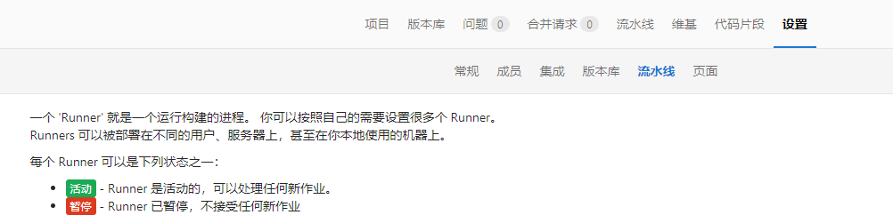

# 为自己的项目搭建gitlab-runner，开启CI


> 尽量不要将 gitlab 服务器 安装 gitlab-runner 服务，因为gitlab -runner 会占用很大的资源


> 以下文字，大部分都是翻译官方的文档，还有一些自己躺过的坑


## 安装 GitLab Runner

> 可以在GNU/Linux , macOS,FreeBSD  和 Windows 上安装和使用GitLabe Runner
>
> 你可以安装在：
>
> 1. 一个容器中
> 2. 通过手动下载二进制文件
> 3. 通过将存储库用于rpm/deb 软件包
>
>  
>
> 官方支持Linux 发行版 ： centOS ，Debian ，Ubuntu ，RHEL，Fedora ，Mint


## 使用用于Debian / Ubuntu / CentOS / RedHat的GitLab存储库进行安装

> 地址： https://docs.gitlab.com/runner/install/linux-repository.html


### 添加官方的GitLab 存储库

```shell
# For Debian/Ubuntu/Mint
curl -L "https://packages.gitlab.com/install/repositories/runner/gitlab-runner/script.deb.sh" | sudo bash

# For RHEL/CentOS/Fedora
curl -L "https://packages.gitlab.com/install/repositories/runner/gitlab-runner/script.rpm.sh" | sudo bash

# Debian 用户需要做些另外修改，这里不做赘述
```


### 安装 版本


####  最新版本

```shell
# For Debian/Ubuntu/Mint
export GITLAB_RUNNER_DISABLE_SKEL=true; sudo -E apt-get install gitlab-runner

# For RHEL/CentOS/Fedora
export GITLAB_RUNNER_DISABLE_SKEL=true; sudo -E yum install gitlab-runner
```


#### 自己选择版本

```shell
# for DEB based systems
apt-cache madison gitlab-runner
export GITLAB_RUNNER_DISABLE_SKEL=true; sudo -E apt-get install gitlab-runner=10.0.0

# for RPM based systems
yum list gitlab-runner --showduplicates | sort -r
export GITLAB_RUNNER_DISABLE_SKEL=true; sudo -E yum install gitlab-runner-10.0.0-1
```


#### docker 安装

> Gitla Runner Docker 映像  被设计为标准GitLab-runner 命令的包装器，就像Gitlab Runner 是直接安装在主机上一样

##### 运行命令

```shell
# 以下方式运行
gitlab-runner <runner command and options...>

# 例如
docker run --rm -t -i gitlab/gitlab-runner --help

# 就相当于git-runner 的命令移动到了docker 里面执行
```


> 在 docker 里面运行GitLab -runner  是非常的方面的，但是 要确保启动容器时，配置不会丢失。为此官方提供了两个方法。

> 如果使用[`session_server`](https://docs.gitlab.com/runner/configuration/advanced-configuration.html)，则还需要`8093`通过添加`-p 8093:8093`到`docker run`命令来公开端口。

1. 使用本地挂载 启动Runner 容器

   ```shell
   $    docker run -d --name gitlab-runner --restart always \
        -v /srv/gitlab-runner/config:/etc/gitlab-runner \
        -v /var/run/docker.sock:/var/run/docker.sock \
        gitlab/gitlab-runner:latest
    # 在macOS上，使用/Users/Shared代替/srv。
   ```

2. 使用docker 卷 启动 Runner 容器 

   1. 创建Docker 卷

      > docker volume create gitlab-runner-config

   2. 使用我们刚创建的卷启动GitLab Runner 容器：

      ```shell
      docker run -d --name gitlab-runner --restart always \
          -v /var/run/docker.sock:/var/run/docker.sock \
          -v gitlab-runner-config:/etc/gitlab-runner \
          gitlab/gitlab-runner:latest
      ```

      > `请注意` :  容器的时区 ，在  docker run 命令 中使用 flat  --env  TZ=<TIMEZONE>
      >
      > [查看可用时区列表](https://en.wikipedia.org/wiki/List_of_tz_database_time_zones)

#####  更新配置

> 配置文件名是`config.toml`，如果更改了配置，需要重新启动运行程序，并且确保重启整个容器，而不是使用`gitlab-runner restart`

> docker  restart gitlab-runner


##### 升级版


######  拉取最新版本

docker pull gitlab/gitlab-runner:latest

###### 停止并删除现有容器

docker stop gitlab-runner && docker rm gitlab-runner

###### 安装最初的步骤启动容器

```shell
docker run -d --name gitlab-runner --restart always \
  -v /var/run/docker.sock:/var/run/docker.sock \
  -v /srv/gitlab-runner/config:/etc/gitlab-runner \
  gitlab/gitlab-runner:latest
  
# 请不要忘记装载配置文件
```


###  读取 GitLab  Runner 日志

> 当GitLab Runner作为前台任务启动时（无论是本地安装的二进制文件还是在Docker容器内部），日志都会打印到标准输出。当GitLab Runner作为系统服务（例如，使用Systemd）启动时，大多数情况下是通过Syslog或其他系统日志记录机制记录日志。

> docker 安装  直接使用docker  logs


### 其他，例如SSL 证书，根据自己需求


### 注册Runner

> 地址 :  https://docs.gitlab.com/runner/register/index.html


##### 码头工人 docker

> 根据 安装类型运行的register 命令


######  对于挂载在本地配置文件

```shell
docker run --rm -it -v /srv/gitlab-runner/config:/etc/gitlab-runner gitlab/gitlab-runner register
```

> `请注意` ： 使用正确的卷更新命令

###### 对于Docker 卷挂载

```shell
docker run --rm -it -v gitlab-runner-config:/etc/gitlab-runner gitlab/gitlab-runner:latest register
```

##### linux

```shell
sudo gitlab-runner register
```

##### macos

```shell
gitlab-runner register
```

##### windows

```shell
./gitlab-runner.exe register
```


#### 在上述交互命令，官方还提供one-line 的command

> 展示 注册 命令 ： gitlab-runner register -h


###### 使用常见的注册runner

```shell
sudo gitlab-runner register \
  --non-interactive \
  --url "https://gitlab.com/" \
  --registration-token "PROJECT_REGISTRATION_TOKEN" \
  --executor "docker" \
  --docker-image alpine:latest \
  --description "docker-runner" \
  --tag-list "docker,aws" \
  --run-untagged="true" \
  --locked="false" \
  --access-level="not_protected"
```


###### docker 运行

```shell
docker run --rm -v /srv/gitlab-runner/config:/etc/gitlab-runner gitlab/gitlab-runner register \
  --non-interactive \
  --executor "docker" \
  --docker-image alpine:latest \
  --url "https://gitlab.com/" \
  --registration-token "PROJECT_REGISTRATION_TOKEN" \
  --description "docker-runner" \
  --tag-list "docker,aws" \
  --run-untagged="true" \
  --locked="false" \
  --access-level="not_protected"
  
  ## 该--access-level参数已在GitLab Runner 12.0中添加。它使用GitLab 11.11中引入的注册API参数。在注册过程中使用此参数来创建受保护的运行程序。对于受保护的跑步者，请使用--access-level="ref_protected"参数。对于不受保护的跑步者，请--access-level="not_protected"改用或将其值保留为未定义。以后可以在项目的“设置”>“ CI / CD”菜单中打开或关闭此值
```


#### 上述不同的安装方式的通用 步骤(`其实都是可以在GitLab的设置的流水线中可以看到注册成功的标志`)

> 实例URL 和token 都在标题的位置上可以看到

1. 输入您的GitLab实例URL（也称为`gitlab-ci coordinator URL`）。
2. 输入您获得的令牌以注册runner。
3. 输入跑步者的描述。您可以稍后在GitLab用户界面中更改此值。
4. 输入[tags associated with the runner](https://docs.gitlab.com/ee/ci/runners/#using-tags)标签。您可以稍后在GitLab用户界面中更改此值。
5. 提供[runner executor](https://docs.gitlab.com/runner/executors/README.html)。对于大多数用例，请输入 `docker`。
6. 如果您`docker`以执行者身份输入，则系统会要求您提供默认图片，以用于未在中定义一个的项目`.gitlab-ci.yml`。
7. 安装成功 ，gitlab  会报 绿灯
8. 


