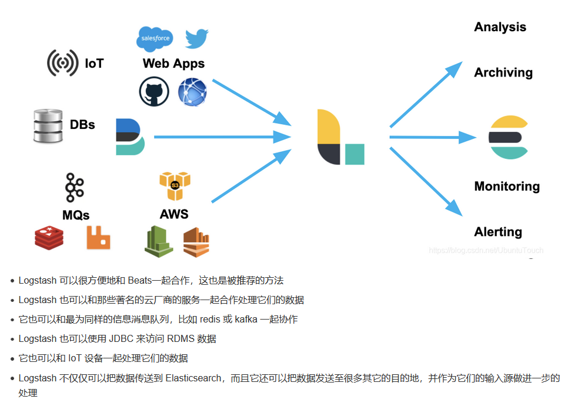

# beats


1. FileBeat

> 用于收集和传送日志文件，也是最常用的beat


2.  Packetbeat

> 网络数据包分析器，用于捕获服务器之间网络流量。因为可用于应用程序和性能监视
>
> Packetbeat 支持的协议包括：DNS，HTTP，ICMP，Redis，MySQL，MongoDB，Cassandra 等。


3. Metricbeat

> 它收集报告各种系统和平台的各种系统级指标。还支持用于从特定平台收集统计信息的内部模块。

4. Hearbeat

> Heartbeat 是用于 “uptime monitoring” 的。本质上，Heartbeat 是探测服务以检查它们是否可访问的功能，例如，它可以用来验证服务的正常运行时间是否符合你的 SLA。 你要做的就是为 Heartbeat 提供 URL 和正常运行时间指标的列表，以直接发送到Elasticsearch 或 Logstash 以便在建立索引之前发送到你的堆栈。
> 

5. Winlogbeat

> Winlogbeat 仅会引起Windows系统管理员或工程师的兴趣，因为它是专门为收集 Windows 事件日志而设计的 Beat。 它可用于分析安全事件，已安装的更新等。

6. Auditbeat

> Auditbeat 可用于审核 Linux 服务器上的用户和进程活动。 与其他传统的系统审核工具（systemd，auditd）类似，Auditbeat 可用于识别安全漏洞-文件更改，配置更改，恶意行为等。

7. Functionbeat

> Functionbeat 被定义为 “serverless” 的发件人，可以将其部署为收集数据并将其发送到 ELK 堆栈的功能。 Functionbeat 专为监视云环境而设计，目前已针对 Amazon 设置量身定制，可以部署为 Amazon Lambda 函数，以从 Amazon CloudWatch，Kinesis 和 SQS 收集数据。
> 


## Filebeat 及 Metricbeat


### Filebeat

Filebeat 具有如下的一些特性：

    正确处理日志旋转：针对每隔一个时间段生产一个新的日志的案例，Filebeat 可以帮我们正确地处理新生产的日志，并重新启动对新生成日志的处理
    背压敏感：如果日志生成的速度过快，从而导致 Filebeat 生产的速度超过 Elasticsearch 处理的速度，那么 Filebeat 可以自动调节处理的速度，以达到 Elasticsearch 可以处理的范围内
    “至少一次”保证：每个日志生成的事件至少被处理一次
    结构化日志：可以处理结构化的日志数据数据
    多行事件：如果一个日志有多行信息，也可以被正确处理，比如错误信息往往是多行数据
    条件过滤：可以有条件地过滤一些事件


```yml
filebeat.inputs:
- type: log
paths:
  - /var/log/system.log
  - /var/log/wifi.log
 
- type: log
  paths:
    - "/var/log/apache2/*"
  fields:
    apache: true
  fields_under_root: true

```

Filbeat 支持如下的一些输出：

- Elasticsearch
- Logstash
- Kafka
- Redis
- File
- Console
- Cloud

### Metricbeat

#### Mettric ： metric 可以收集如下两种类型的指标：


为了能够收集指标，我们必须把 Metricbeat 部署在需要监控的机器上。它除了能够对主机机进行指标采集，比如内存，CPU，硬盘等的实用情况，它同时也可以对运用于上面的服务比如 Nginx, Apache, MySQL 等的指标进行采集。

Metricbeat 通过从服务器上运行的系统和服务收集指标来帮助你监视服务器，例如：

- [Apache](https://www.elastic.co/guide/en/beats/metricbeat/current/metricbeat-module-apache.html)
- [HAProxy](https://www.elastic.co/guide/en/beats/metricbeat/current/metricbeat-module-haproxy.html)
- [MongoDB](https://www.elastic.co/guide/en/beats/metricbeat/current/metricbeat-module-mongodb.html)
- [MySQL](https://www.elastic.co/guide/en/beats/metricbeat/current/metricbeat-module-mysql.html)
- [Nginx](https://www.elastic.co/guide/en/beats/metricbeat/current/metricbeat-module-nginx.html)
- [PostgreSQL](https://www.elastic.co/guide/en/beats/metricbeat/current/metricbeat-module-postgresql.html)
- [Redis](https://www.elastic.co/guide/en/beats/metricbeat/current/metricbeat-module-redis.html)
- [System](https://www.elastic.co/guide/en/beats/metricbeat/current/metricbeat-module-system.html)
- [Zookeeper](https://www.elastic.co/guide/en/beats/metricbeat/current/metricbeat-module-zookeeper.html)


Metricbeat 具有一些特性：

    轮询服务的 API 以收集指标
    有效地将指标存储在 Elasticsearch 中
    通过 JMX / Jolokia，Prometheus，Dropwizard，Graphite 的应用程序指标
    自动贴标：表明是从 AWS, Docker， Kubernetes,  GoogleCloud 或 Azure 采集的


### 什么是Filebeat 和 Merticbeat 模块


Filebeat 模块简化了常见日志格式的收集，解析和可视化。文件集包含以下内容：

    Filebeat 输入配置，其中包含在其中查找日志文件的默认路径。 这些默认路径取决于操作系统。 Filebeat 配置还负责在需要时将多行事件缝合在一起。
    Elasticsearch Ingest Node 管道定义，用于解析日志行。
    字段定义，用于为每个字段配置具有正确类型的 Elasticsearch。 它们还包含每个字段的简短说明。
    示例 Kibana 仪表板（如果有）可用于可视化日志文件。


# Logstash

数据流引擎

- 用于数据物流的开源流式ETL 引擎
- 在几分钟内建立数据流管道
- 具有水平可扩展及韧性且具有自适应缓冲
- 不可知的数据源
- 具有200 多个集成和处理器插件生态系统
- 使用Elastic Stack 监视和管理部署

它可以摄入日志，文件，指标或者网路真实数据。经过 Logstash 的处理，变为可以使用的 Web Apps 可以消耗的数据，也可以存储于数据中心，或变为其它的流式数据。



你如果想了解更多关于 Logstash 的这些 Inputs, Filters 及 Outputs，那么请访问 Elastic 的官方网址https://www.elastic.co/guide/en/logstash/current/index.html


1. 标准案例输入输出

> ```
> bin/logstash -e 'input { stdin { } } output { stdout {} }'
> ```

2. 自动应用配置文件

> config.reload.automatic: true


## 过滤器对数据进行处理


###  Grok

针对 Grok，我还有有一个专门的文章 “[Logstash：Grok filter 入门](https://elasticstack.blog.csdn.net/article/details/105922198)” 来描述。你可以发现所有的关于 Logstash 的 patterns: https://github.com/logstash-plugins/logstash-patterns-core/blob/master/patterns/grok-patterns。


> 是一种将行与正则表达式屁屁额。将行的特定部分映射到专用字段中以及根据此映射执行操作的方法

> 基本语法： %{PATTERN:fieldName}


### Geoip

> 使用对IP地址进去数据丰富，

```conf
input {
  tcp {
    port => 9900
  }
}
 
filter {
  grok {
    match => { "message" => "%{COMBINEDAPACHELOG}" }
  }
 
  geoip {
    source => "clientip"
  }
}
 
output {
  stdout { }
}

```


### Useragent

```conf
input {
  tcp {
    port => 9900
  }
}
 
filter {
  grok {
    match => { "message" => "%{COMBINEDAPACHELOG}" }
  }
 
  geoip {
    source => "clientip"
  }
 
  useragent {
    source => "agent"
    target => "useragent"
  }
 
}
 
output {
  stdout { }
}

```


### Mutate - convert

> bytes 类型转换

```conf
input {
  tcp {
    port => 9900
  }
}
 
filter {
  grok {
    match => { "message" => "%{COMBINEDAPACHELOG}" }
  }
 
  mutate {
    convert => {
      "bytes" => "integer"
    }
  }
 
  geoip {
    source => "clientip"
  }
 
  useragent {
    source => "agent"
    target => "useragent"
  }
 
}
 
output {
  stdout { }
}

```


### date

```conf
input {
  tcp {
    port => 9900
  }
}
 
filter {
  grok {
    match => { "message" => "%{COMBINEDAPACHELOG}" }
  }
 
  mutate {
    convert => {
      "bytes" => "integer"
    }
  }
 
  geoip {
    source => "clientip"
  }
 
  useragent {
    source => "agent"
    target => "useragent"
  }
 
  date {
    match => ["timestamp", "dd/MMM/yyyy:HH:mm:ss Z"]
  }
}
 
output {
  stdout { }
}

```

### 输出到es

```conf
input {
  tcp {
    port => 9900
  }
}
 
filter {
  grok {
    match => { "message" => "%{COMBINEDAPACHELOG}" }
  }
 
  mutate {
    convert => {
      "bytes" => "integer"
    }
  }
 
  geoip {
    source => "clientip"
  }
 
  useragent {
    source => "agent"
    target => "useragent"
  }
 
  date {
    match => ["timestamp", "dd/MMM/yyyy:HH:mm:ss Z"]
  }
}
 
output {
  stdout { }
 
  elasticsearch {
    hosts => ["localhost:9200"]
    user => "elastic"
    password => "changeme"
  }
}

```

