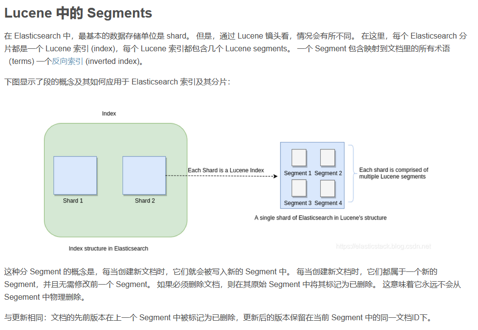
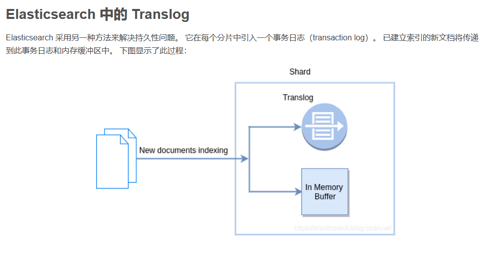
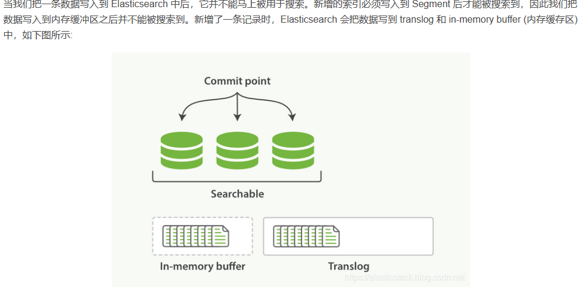
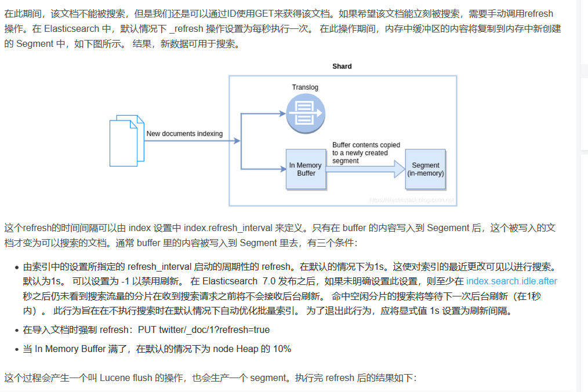

# Elasticsearch 查询 和运维 调优


## 重要概念说明

[^Elasticsearch 升级6.0后]: 由于一些原因，在 Elasticsearch 6.0 以后，一个 Index 只能含有一个 type。这其中的原因是：相同 index 的不同映射 type 中具有相同名称的字段是相同； 在 Elasticsearch 索引中，不同映射 type 中具有相同名称的字段在 Lucene 中被同一个字段支持。在默认的情况下是 _doc。在未来8.0的版本中，type 将被彻底删除

### index

> 索引是文档的集合，一个index 里面可能用多的documents组成

### shard

> 分片。当创建一个索引的时候，可以指定你想要的分片的数量。每个分片是独立的索引
>
> - 允许你水平分割/扩展你的内容容量
> - 允许你在分片（潜在地，位于多个节点上）之上进行分布式的、并行的操作，进而提高性能/吞吐量

有两种类型的分片：primary shard 和 replica shard。

- Primary shard: 每个文档都存储在一个Primary shard。 索引文档时，它首先在 Primary shard上编制索引，然后在此分片的所有副本上（replica）编制索引。索引可以包含一个或多个主分片。 此数字确定索引相对于索引数据大小的可伸缩性。 创建索引后，无法更改索引中的主分片数。
- Replica shard: 每个主分片可以具有零个或多个副本。 副本是主分片的副本，有两个目的：
  - 增加故障转移：如果主要故障，可以将副本分片提升为主分片
  - 提高性能：get 和 search 请求可以由主 shard 或副本 shard 处理。

默认情况下，每个主分片都有一个副本，但可以在现有索引上动态更改副本数。 永远不会在与其主分片相同的节点上启动副本分片。

```json
{
    "settings" : {
        "index.number_of_shards" : 2,
        "index.number_of_replicas" : 1
    }
}
```

### replica

> 默认每个索引将包含一个主分片，每个分片将具有一个副本
>
> 主副本和副本分片之间的主要区别在于只有主分片可以接受索引请求。副本和主分片都可以提供查询请求。

shard 健康

- 红色：集群中未分配至少一个主分片
- 黄色：已分配所有主副本，但未分配至少一个副本
- 绿色：分配所有分片


## 开始使用Elasticsearch——1

> es 默认 mapping 是根据 你的记录内容 自动适配，可能有些 字段的类型，不是适配很准确


### Open/Close Index

> Elasticsearch 支持索引的在线/离线模式。 使用脱机模式时，在群集上几乎没有任何开销地维护数据。 关闭索引后，将阻止读/写操作。 当您希望索引重新联机时，只需打开它即可。 但是，关闭索引会占用大量磁盘空间。 您可以通过将 cluster.indices.close.enable 的默认值从 true 更改为 false 来禁用关闭索引功能，以避免发生意外
>
> 1. post  demo/_close
> 2. post demo/_open


### Freeze/unfreeze  index

> 冻结索引（freeze index）在群集上几乎没有开销（除了将其元数据保留在内存中），并且是只读的。 只读索引被阻止进行写操作，例如 [docs-index](https://www.elastic.co/guide/en/elasticsearch/reference/7.5/search-suggesters.html#indexing) 或 [force merge](https://www.elastic.co/guide/en/elasticsearch/reference/7.5/indices-forcemerge.html)。 请参[阅冻结索引](https://www.elastic.co/guide/en/elasticsearch/reference/7.5/frozen-indices.html)和[取消冻结索引](https://www.elastic.co/guide/en/elasticsearch/reference/7.5/freeze-index-api.html)。

> 冻结索引受到限制，以限制每个节点的内存消耗。 每个节点的并发加载的冻结索引数受 search_throttled 线程池中的线程数限制，默认情况下为1。 默认情况下，即使已明确命名冻结索引，也不会针对冻结索引执行搜索请求。 这是为了防止由于误将冻结的索引作为目标而导致的意外减速。 如果要包含冻结索引做搜索，必须使用查询参数 ignore_throttled = false 来执行搜索请求
>
> 1. post demo/_freeze
> 2. post demo/_unfreeze

为什么要使用 冰冻索引：引用官方文档翻译

> 例如，如果您使用基于时间的指数来存储日志消息或时间系列数据，那么较旧的指数搜索的频率可能比最近的指数低得多。较老的指数也不会收到索引请求。此外，通常情况下，对较老指数的搜索是为了进行长期分析，而较慢的反应是可以接受的。
>
> 如果你有这样的指数，那么他们是成为*冻结指数*的好候选人。弹性搜索每次搜索碎片时都会构建冻结索引每个碎片的瞬态数据结构，并在搜索完成后立即丢弃这些数据结构。由于弹性搜索在内存中不维护这些瞬态数据结构，因此冻结指数消耗的堆比正常指数少得多。这允许磁盘与堆比比本来可能的要高得多。
>
> - 对于一些不重要的数据，不要求搜索时间的，可以使用这个。


## 开始使用Elasticsearch——2: 基本查询

>1. query 可以帮我们进行全文搜索，
>2. aggregation  对数据进行统计分析

```json
{
  "query": {
    "match": {
      "title": "community"
    }
  },
  "aggregations": {
    "top_authors": {
      "terms": {
        "field": "author"
      }
    }
  }
}

```

###  搜索所有文档

1. 搜索所有文档

   ```
   GET /_search?size=20&form=2  分页查找
   ```

2. 多个index 搜索

   ```
   POST /index1,index2,index3/_search
   ```

3. scipt fields 生成不存在的field (对于大量文档，会消耗很多资源)

   ```json
   {
     "query": {
       "match_all": {}
     },
     "script_fields": {
       "years_to_100": {
         "script": {
           "lang": "painless",
           "source": "100-doc['age'].value"
         }
       },
       "year_of_birth":{
         "script": "2019 - doc['age'].value"
       }
     }
   }
   ```

### Count API

1. 查询文档数量

   ```txt
   get demo/_count
   ```

2. 满足条件的文档数量

   ```txt
   {
     "query": {
       "match": {
         "city": "北京"
       }
     }
   }
   ```

   

### 修改索引的mapping

1. 不需要事先定义一个相应的mapping 才可以生成文档。字段类型是动态进行识别的。（前面所说，识别未必是自己想要的）
2. 如果有动态加入新的字段，mapping 也可以自动进行调整并识别新加入的字段

```txt
1. 获取 mapping
get demo/_mapping
```

**我们不能为已经建立index 动态修改mapping。这是因为一旦修改，那么之前建立的索引就变成不能搜索的了。一种办法就是reindex 从而重新建立索引。如果在之前的mapping加入新的字段，那么我们可以不用重新建立索引**


3. 查询filter

   ```txt
       GET twitter/_search
       {
         "query": {
           "bool": {
             "filter": {
               "term": {
                 "city.keyword": "北京"
               }
             }
           }
         }
       }
   ```

4. 查询 match

   ```txt
   如果搜索文字，模式 拆分字符串进行OR 匹配
   {
    "query": {
      "match": {
        "user": "朝阳区-老贾"
      }
    }
   }
   如果指定 AND
   {
     "query": {
       "match": {
         "user": {
           "query": "朝阳区-老贾",
           "operator": "and"
         }
       }
     }
   }
   
   可以设置 最少匹配的term
   {
     "query": {
       "match": {
         "user": {
           "query": "朝阳区-老贾",
           "operator": "or",
           "minimum_should_match": 3
         }
       }
     }
   }
   
   ```

5. IDs  query (一般id 都是 自动生成的，)

   ```txt
   {
     "query": {
       "ids": {
         "values": ["1", "2"]
       }
     }
   }
   ```

   

### multi_match  (在不知道field含有这个关键词，使用这个关键字进行搜索)

```txt
{
  "query": {
    "multi_match": {
      "query": "朝阳",
      "fields": [
        "user",
        "address^3",
        "message"
      ],
      "type": "best_fields"
    }
  }
}

```

- best_fields  , ： _score 是按照得分最高的那个字段的分数为准。


### Prefix query  (返回在提供的字段中包含特定的前缀的文档)

```txt
{
  "query": {
    "prefix": {
      "user": {
        "value": "朝"
      }
    }
  }
}
```


### term query （会在给定字段中进行精确的字词匹配。因此，您需要提供准确的术语以获取正确的结果）

```txt
{
  "query": {
    "term": {
      "user.keyword": {
        "value": "朝阳区-老贾"
      }
    }
  }
}
```


### terms query 多个字段精确匹配

```txt
GET twitter/_search
{
  "query": {
    "terms": {
      "user.keyword": [
        "双榆树-张三",
        "东城区-老刘"
      ]
    }
  }

```


### terms_set query （查询在提供的字段中包含最少数目的精确术语的文档。除你可以定义文档所需的术语只为，其他相同）

```txt
PUT /job-candidates
{
  "mappings": {
    "properties": {
      "name": {
        "type": "keyword"
      },
      "programming_languages": {
        "type": "keyword"
      },
      "required_matches": {
        "type": "long"
      }
    }
  }
}
 
PUT /job-candidates/_doc/1?refresh
{
  "name": "Jane Smith",
  "programming_languages": [ "c++", "java" ],
  "required_matches": 2
}
 
 
PUT /job-candidates/_doc/2?refresh
{
  "name": "Jason Response",
  "programming_languages": [ "java", "php" ],
  "required_matches": 2
}
 
GET /job-candidates/_search
{
  "query": {
    "terms_set": {
      "programming_languages": {
        "terms": [ "c++", "java", "php" ],
        "minimum_should_match_field": "required_matches"
      }
    }
  }
}

```


### 复合查询（compound query）

> 上面的是leaf 查询，，那么复合查询就是将多个leaf 查询组合起来

```txt
POST _search
{
  "query": {
    "bool" : {
      "must" : {
        "term" : { "user" : "kimchy" }
      },
      "filter": {
        "term" : { "tag" : "tech" }
      },
      "must_not" : {
        "range" : {
          "age" : { "gte" : 10, "lte" : 20 }
        }
      },
      "should" : [
        { "term" : { "tag" : "wow" } },
        { "term" : { "tag" : "elasticsearch" } }
      ],
      "minimum_should_match" : 1,
      "boost" : 1.0
    }
  }
}


GET twitter/_search
{
  "query": {
    "bool": {
      "should": [     // or 的意思
        {
          "match": {
            "city": "北京"
          }
        },
        {
          "match": {
            "city": "武汉"
          }
        }
      ],
      "minimum_should_match": 2
    }
  }
}

```

如果我们想知道为什么得出来这样的结果，我们可以在搜索的指令中加入**"explained" : true**。


### 位置查询——指的是经纬度的查询

```txt
GET twitter/_search
{
  "query": {
    "bool": {
      "must": [
        {
          "match": {
            "address": "北京"
          }
        }
      ]
    }
  },
  "post_filter": {
    "geo_distance": {
      "distance": "3km",
      "location": {
        "lat": 39.920086,
        "lon": 116.454182
      }
    }
  }
}

```

example

```txt
GET twitter/_search
{
  "query": {
    "bool": {
      "must": [
        {
          "match": {
            "address": "北京"
          }
        }
      ]
    }
  },
  "post_filter": {
    "geo_distance": {
      "distance": "5km",
      "location": {
        "lat": 39.920086,
        "lon": 116.454182
      }
    }
  },
  "sort": [
    {
      "_geo_distance": {
        "location": "39.920086,116.454182",
        "order": "asc",
        "unit": "km"
      }
    }
  ]
}

```

### 范围查询

```txt
    GET twitter/_search
    {
      "query": {
        "range": {
          "age": {
            "gte": 30,
            "lte": 40
          }
        }
      }
    }
    GET twitter/_search
{
  "query": {
    "range": {
      "age": {
        "gte": 30,
        "lte": 40
      }
    }
  },"sort": [
    {
      "age": {
        "order": "desc"
      }
    }
  ]
}

```

### exists 查询——判断一个字段是否存在

```txt
    GET twitter/_search
    {
      "query": {
        "exists": {
          "field": "city"
        }
      }
    }
```

###  匹配短语

通常短语，会通过空格，逗号等标签进行分割查询

例如 “happy birthday” 会分开两个单词

```txt
    GET twitter/_search
    {
      "query": {
        "match": {  // 所匹配的短语，不分前后顺序
          "message": {
            "query": "happy birthday",
            "operator": "and"
          }
        }
      }
    }
    采用and 的关系，，，就必须匹配到happy birthday 都能存在的文档
```

使用match——phrase 进行顺序搜索

```txt
GET twitter/_search
{
  "query": {
    "match_phrase": {
      "message": "Happy birthday"
    }
  },
  "highlight": {
    "fields": {
      "message": {}
    }
  }
}

```


### Named queries

使用_name 为一个filter 或 query 来取一个名字

```txt
GET twitter/_search
{
  "query": {
    "bool": {
      "must": [
        {
          "match": {
            "city": {
              "query": "北京",
              "_name": "城市"
            }
          }
        },
        {
          "match": {
            "country": {
              "query": "中国",
              "_name": "国家"
            }
          }
        }
      ],
      "should": [
        {
          "match": {
            "_id": {
              "query": "1",
              "_name": "ID"
            }
          }
        }
      ]
    }
  }
}

```

### sql 查询

```txt
    GET /_sql?
    {
      "query": """
        SELECT * FROM twitter 
        WHERE age = 30
      """
    }
    
    
    translate  : 得到相对应的DSL 语句
        GET /_sql/translate
    {
      "query": """
        SELECT * FROM twitter 
        WHERE age = 30
      """
    }
```


## 开始使用Elasticsearch——3: 聚合查询


### Aggregation 简介

> 聚合可以被视为在一组文档上构建分析信息的工作单元。执行的上下文定义了该文档集的内容（例如，在执行的查询的上下文中执行顶级聚合/搜索请求的过滤器）

1. Bucketing
2. Metric
3. Martrix
4. Pipline

接下来是有趣的部分。由于每个存储桶( bucket )有效地定义了一个文档集（属于该 bucket 的所有文档），因此可以在 bucket 级别上关联聚合，并且这些聚合将在该存储桶的上下文中执行。这就是聚合的真正力量所在：聚合可以嵌套！

注意一：bucketing聚合可以具有子聚合（bucketing 或 metric）。 将为其父聚合生成的桶计算子聚合。 嵌套聚合的级别/深度没有硬性限制（可以在“父”聚合下嵌套聚合，“父”聚合本身是另一个更高级聚合的子聚合）。

注意二：聚合可以操作于 double 类型的上限的数据。 因此，当在绝对值大于2 ^ 53的 long 上运行时，结果可能是近似的。

Aggregation 请求是搜索 API 的一部分，它可以带有一个 query 的结构或者不带。

聚合语法

```txt
"aggregations" : {
    "<aggregation_name>" : {
        "<aggregation_type>" : {
            <aggregation_body>
        }
        [,"meta" : {  [<meta_data_body>] } ]?
        [,"aggregations" : { [<sub_aggregation>]+ } ]?
    }
    [,"<aggregation_name_2>" : { ... } ]*
}
也可以使用aggs replace  aggregations
```


#### range 聚合

```txt
GET twitter/_search
{
  "size": 0,
  "aggs": {
    "age": {
      "range": {
        "field": "age",
        "ranges": [
          {
            "from": 20,
            "to": 22
          },
          {
            "from": 22,
            "to": 25
          },
          {
            "from": 25,
            "to": 30
          }
        ]
      }
    }
  }
}

```


#### Filters 聚合

> ranges 只适用于数字的字段，但是可以使用filter 来对数据进行分类。 ，可以针对非数字字段来建立不同的bucket 称为Filter aggregagation。

```txt
GET twitter/_search
{
  "size": 0,
  "aggs": {
    "by_cities": {
      "filters": {
        "filters": {
          "beijing": {
            "match": {
              "city": "北京"
            }
          },
          "shanghai": {
            "match": {
              "city": "上海"
            }
          }
        }
      }
    }
  }
}
 
```


#### Filter 聚合

> 在当前文档集上下文定义与指定过滤器匹配的所有文档的单个存储桶。

```txt
GET twitter/_search
{
  "size": 0,
  "aggs": {
    "beijing": {
      "filter": {
        "match": {
          "city": "北京"
        }
      },
      "aggs": {
        "avg_age": {
          "avg": {
            "field": "age"
          }
        }
      }
    }
  }
}

```


#### date_range 聚合

> 使用date_range 来统计在某个时间段里的文档数

```txt
POST twitter/_search
{
  "size": 0,
  "aggs": {
    "birth_range": {
      "date_range": {
        "field": "DOB",
        "format": "yyyy-MM-dd",
        "ranges": [
          {
            "from": "1989-01-01",
            "to": "1990-01-01"
          },
          {
            "from": "1991-01-01",
            "to": "1992-01-01"
          }
        ]
      }
    }
  }
}

```

#### terms 聚合

> 可以使用term 聚合来查询某一个关键字出现的频率。
>
> 在如下的 term 聚合中，我们想寻找在所有的文档出现 ”Happy birthday” 里按照城市进行分类的一个聚合。

```txt
GET twitter/_search
{
  "query": {
    "match": {
      "message": "happy birthday"
    }
  },
  "size": 0,
  "aggs": {
    "city": {
      "terms": {
        "field": "city",
        "size": 10
      }
    }
  }
}

```


####  Histogram Aggregation

> 基于多桶值源的汇总，可以应用于从文档中提取的数值或数值范围值。根据值动态构建固定大小的存储桶

```txt
GET twitter/_search
{
  "size": 0,
  "aggs": {
    "age_distribution": {
      "histogram": {
        "field": "age",
        "interval": 2
      }
    }
  }
}

```


#### date_histogram

> 这种聚合类似于正常的直方图，但只能与日期或日期范围值一起使用。 由于日期在 Elasticsearch 中内部以长值表示，因此也可以但不准确地对日期使用正常的直方图。

```txt
GET twitter/_search
{
  "size": 0,
  "aggs": {
    "age_distribution": {
      "date_histogram": {
        "field": "DOB",
        "interval": "year"
      }
    }
  }
}

```


#### cardinality 聚合

```txt
    GET twitter/_search
    {
      "size": 0,
      "aggs": {
        "number_of_cities": {
          "cardinality": {
            "field": "city"
          }
        }
      }
    }
```


### Metric 聚合

> 统计我们的数值数据，比如我们想知道所有用户的平均年龄是多少

```txt
GET twitter/_search
{
  "size": 0,
  "aggs": {
    "average_age": {
      "avg": {
        "field": "age"
      }
    }
  }
}
```


#### Percentile aggregation

> 百分位数 表示观察 出现一定百分比的点。

```txt
GET twitter/_search
{
  "size": 0,
  "aggs": {
    "age_quartiles": {
      "percentiles": {
        "field": "age",
        "percents": [
          25,
          50,
          75,
          100
        ]
      }
    }
  }
}

```


###  更为复杂的聚合

```txt
GET twitter/_search
{
  "size": 0,
  "aggs": {
    "cities": {
      "terms": {
        "field": "city",
        "order": {
          "average_age": "desc"
        }, 
        "size": 5
      },
      "aggs": {
        "average_age": {
          "avg": {
            "field": "age"
          }
        }
      }
    }
  }
}

```


### Misssing 聚合

> 这个聚合来统计出来缺失某个字段的文档个数

```txt
    GET twitter/_search
    {
      "size": 0,
      "aggs": {
        "total_missing_age": {
          "missing": {
            "field": "age"
          }
        }
      }
    }
```


### Analyzer 简介

> standard analyzer 是elasticsearch 的默认分析器
>
> - 没有 Char Filter
> - 使用standard tokonizer
> - 把字符串变为小写，同时有选择的删除一些stop words 等。默认的情况下 stop words 为 _none_，也即不过滤任何 stop words

```txt
GET twitter/_analyze
{
  "text": [
    "Happy Birthday"
  ],
  "analyzer": "standard"
}
```


## Elasticsearch : inverted index ,doc_values 及 source


###  Inverted index  反向索引

> 反向索引 是Elasticsearch 和任何其他支持全文搜索的系统的核心数据结构。当一段文字从原始文字导入的elastic 中，需要经过一个 indexing 的过程。 analyzer

如果不让其索引

```txt
 "user": {
        "type": "object",
        "enabled": false
  }
  
      {
      "mappings": {
        "properties": {
          "http_version": {
            "type": "keyword",
            "index": false
          }
         ...
        }
      }
    }
```

不想存储任何的字段

```txt
 
PUT twitter
{
  "mappings": {
    "_source": {
      "enabled": false
    }
  }
}
```

有选择的存储想要的字段

```txt
DELETE twitter
 
PUT twitter
{
  "mappings": {
    "_source": {
      "includes": [
        "*.lat",
        "address",
        "name.*"
      ],
      "excludes": [
        "name.surname"
      ]
    }    
  }

```


### Source

> 通常每个文档的每个字段都会被存储在shard 里存放source 的地方

### Doc_values

> sort，aggregtion 和访问脚本中的字段值需要不同的数据访问模式。除了查找术语和查找文档外，我们还需要能够查找文档并查找其在字段中具有的术语。
>
> Doc values 是在文档索引时构建的磁盘数据结构，这使这种数据访问模式成为可能。它们存储与 _source 相同的值，但以面向列（column）的方式存储，这对于排序和聚合而言更为有效。几乎所有字段类型都支持Doc值，但对字符串字段除外 （text 及annotated_text）。Doc values 告诉你对于给定的文档 ID，字段的值是什么。
> 

```txt
PUT cities
{
  "mappings": {
    "properties": {
      "city": {
        "type": "keyword"
      }
    }
  }
}
```

不想字段进行排序和聚合

```txt
      "city": {
        "type": "keyword",
        "doc_values": false,
        "ignore_above": 256
      },
```


## 理解mapping 的store 属性

> 默认情况下，对字段值进行索引以使其可搜索，但不存储它们 (store)。 这意味着可以查询该字段，但是无法检索原始字段值。在这里我们必须理解的一点是: 如果一个字段的 mapping 中含有 store 属性为 true，那么有一个单独的存储空间为这个字段做存储，而且这个存储是独立于 _source 的存储的。它具有更快的查询。存储该字段会占用磁盘空间。如果需要从文档中提取（即在脚本中和聚合），它会帮助减少计算。在聚合时，具有store属性的字段会比不具有这个属性的字段快。 此选项的可能值为 false 和 true。
>
> 通常这无关紧要。 该字段值已经是 _source 字段的一部分，默认情况下已存储。 如果你只想检索单个字段或几个字段的值，而不是整个 _source 的值，则可以使用 source filtering 来实现。
>
> 在某些情况下，存储字段可能很有意义。 例如，如果你有一个带有标题，日期和很大的内容字段的文档，则可能只想检索标题和日期，而不必从较大的 _source 字段中提取这些字段
>
> 如果在一种替代品，相当于目录，，会将每个章节的标题拿出来单独存储，使用

```txt
PUT my_index
{
  "mappings": {
    "properties": {
      "title": {
        "type": "text",
        "store": true 
      },
      "date": {
        "type": "date",
        "store": true 
      },
      "content": {
        "type": "text"
      }
    }
  }
}

```


## 从搜索中获取选定的字段

```txt
POST my-index-000001/_search
{
  "query": {
    "match": {
      "message": "foo"
    }
  },
  "fields": ["user.id", "@timestamp"],
  "_source": false
}

```

使用fields 减少返回的字段数量，还可以设置它接受 multi-fields 和字段别名，并且还以一致的方式设置诸如日期之类的字段值的格式。

文档的 _source 存储在 Lucene 中的单个字段中。因此，即使仅请求少量字段，也必须加载并解析整个 _source 对象。为避免此限制，你可以尝试另一种加载字段的方法：

    使用 docvalue_fields 参数获取选定字段的值。当返回相当少量的支持 doc 值的字段（例如关键字和日期）时，这是一个不错的选择。
    使用 stored_fields 参数获取特定存储字段（使用 store 映射选项的字段）的值
```txt
GET developers/_search
{
  "query": {
    "match": {
      "city": "Beijing"
    }
  },
  "fields": [
    "name.firstname",
    "ski*",
    "nianling",
    "city",
    {
      "field": "DOB",
      "format": "epoch_millis"
    }
  ]
}

```

也可以直接使用source filtering 的方法返回_source 的部分字段

```txt
    GET developers/_search
    {
      "query": {
        "match": {
          "city": "Beijing"
        }
      },
      "_source": ["city", "age", "name"]
    }
```


###  处理nested 字段

> nested 字段的字段响应与常规对象字段的字段响应略有不同。 常规对象字段内的 leaf value 作为扁平列表返回时，nested 字段内的值被分组以维护原始 nested 数组内每个对象的独立性。 对于 nested 字段数组内的每个条目，除非父 nested 对象内还有其他 nested 字段，否则值将再次作为一个扁平列表返回，在这种情况下，将对较深的 nested 字段再次重复相同的过程
> 

```txt
    POST my-index-000001/_search
    {
      "fields": ["user.first"],
      "_source": false
    }
```


### 检索未映射的字段

> 默认情况下，fields 参数仅返回映射字段的值。 但是，Elasticsearch 允许将未映射的字段存储在 _source 中，例如，通过将 “[动态字段映射](https://www.elastic.co/guide/en/elasticsearch/reference/current/dynamic-field-mapping.html)” 设置为 false 或使用具有 enable: false的对象字段，从而禁用对其内容的解析和索引编制。

```txt
PUT my-index-000002/_doc/1?refresh=true
{
  "user_id": "kimchy",
  "session_data": {
     "object": {
       "some_field": "some_value"
     }
   }
}
 
POST my-index-000002/_search
{
  "fields": [
    "user_id",
    {
      "field": "session_data.object.*",
      "include_unmapped" : true 
    }
  ],
  "_source": false
}
```


## 基础知识


### Index Template

> Index template 定义在创建新 index 时可以自动应用的 settings 和 mappings。 Elasticsearch 根据与 index 名称匹配的 index 模式将模板应用于新索引。这个对于我们想创建的一系列的 Index 具有同样的 settings 及 mappings。比如我们希望每一天/月的日志的index都具有同样的设置
> **Index template 仅在 index 创建期间应用。 对 index template 的更改不会影响现有索引。 [create index API](https://www.elastic.co/guide/en/elasticsearch/reference/current/indices-create-index.html) 请求中指定的设置和映射会覆盖索引模板中指定的任何设置或映射**


#### 定义一个Index template

```txt
PUT _template/logs_template
{
  "index_patterns": "logs-*",
  "order": 1, 
  "settings": {
    "number_of_shards": 4,
    "number_of_replicas": 1
  },
  "mappings": { 
    "properties": {
      "@timestamp": {
        "type": "date"
      }
    }
  }
}

```

**建议在kibana 中编写模板内容，避免命令出现问题**

以上的 template_1 将禁用存储 _source，但对于以 te * 开头的索引，仍将启用 _source。 注意，对于映射，合并是 “深度” 的，这意味着可以在高阶模板上轻松添加/覆盖特定的基于对象/属性的映射，而较低阶模板提供基础。


### 可组合的Index template - 7.8 版本之后


> 这个功能，只能用于 版本7.8 之后才可以使用

> 索引模板是一种告诉Elasticsearch 在创建索引时如何配置索引的方法。对于数据流（[data stream](https://elasticstack.blog.csdn.net/article/details/110528838)），索引模板会在创建流时支持其后备索引。 在创建索引之前先配置模板，然后在手动创建索引或通过对文档建立索引创建索引时，模板设置将用作创建索引的基础。
>
> 模板有两种类型：索引模板和[组件模板](https://www.elastic.co/guide/en/elasticsearch/reference/master/indices-component-template.html)。 组件模板是可重用的构建块，用于配置映射，设置和别名。 你使用组件模板来构造索引模板，但它们不会直接应用于一组索引。 索引模板可以包含组件模板的集合，也可以直接指定设置，映射和别名

**当可组合模板与给定索引匹配时，它始终优先于旧模板**。 如果没有可组合模板匹配，则旧版模板可能仍匹配并被应用。

如果使用显式设置创建索引并且该索引也与索引模板匹配，则创建索引请求中的设置将优先于索引模板及其组件模板中指定的设置


#### 创建可组合的Index template

```txt
PUT _component_template/component_template1
{
  "template": {
    "mappings": {
      "properties": {
        "@timestamp": {
          "type": "date"
        }
      }
    }
  }
}
 
PUT _component_template/other_component_template
{
  "template": {
    "mappings": {
      "properties": {
        "ip_address": {
          "type": "ip"
        }
      }
    }
  }
}

```


使用如下的命令，组合创建一个新的template

```txt
PUT _index_template/template_1
{
  "index_patterns": ["te*", "bar*"],
  "template": {
    "settings": {
      "number_of_shards": 1
    },
    "mappings": {
      "_source": {
        "enabled": false
      },
      "properties": {
        "host_name": {
          "type": "keyword"
        },
        "created_at": {
          "type": "date",
          "format": "EEE MMM dd HH:mm:ss Z yyyy"
        }
      }
    },
    "aliases": {
      "mydata": { }
    }
  },
  "priority": 200,
  "composed_of": ["component_template1", "other_component_template"], // 包含两个可组合的template
  "version": 3,
  "_meta": {
    "description": "my custom"
  }
}

```


### search template

> 搜索模板，进行重复工作，但是会有一些不同的值的查询，
>
> **搜索模板容许你使用可在执行时的参数定义查询**

好处 是： 

1. 避免在多个地方重复代码
2. 更容易测试和执行你的查询
3. 在应用程序间共享查询
4. 容许用户只执行一些预定义的查询
5. 将搜索逻辑与应用程序逻辑分离


#### 定义一个search template

```txt
POST _scripts/my_search_template
{
  "script": {
    "lang": "mustache",
    "source": {
      "query": {
        "match": {
          "{{my_field}}": "{{my_value}}"
        }
      }
    }
  }
}

```

如果更新上述的模板，只需要保证名字相同，修改就可


#### 条件判断

> 在mustache  语言中，没有if/else 判断但是你可以定 section 来跳过它如果那个变量是 false 还是没有被定义：
>
> ```
> {{#param1}}
> 
> 
> 
>     "This section is skipped if param1 is null or false"
> 
> 
> 
> {{/param1}}
> ```

```txt
POST _scripts/docs_from_beijing_and_age
{
  "script": {
    "lang": "mustache",
    "source": 
"""
    {
      "query": {
        "bool": {
          "must": [
            {
              "match": {
                "city": "{{search_term}}"
              }
            }
            {{#search_age}}
            ,
            {
              "range": {
                "age": {
                  "gte": {{search_age}}
                }
              }
            }
            {{/search_age}}
          ]
        }
      }
    }
"""
  }
}

```


### Dynamic mapping


> 自动检测和添加新字段称为动态映射。动态映射规则可以根据你的目的进行定制
>
> - [动态字段映射](https://www.elastic.co/guide/en/elasticsearch/reference/7.4/dynamic-field-mapping.html)：管理动态 field 检测的规则
> - [动态模板](https://www.elastic.co/guide/en/elasticsearch/reference/7.4/dynamic-templates.html)：用于配置动态添加字段的映射的自定义规则


#### 动态模板

假设你有包含大量字段的文档

    或者在映射定义时未知的动态字段名称的文档
    和 nested 的 key/value 对不是一个很好的解决方案

使用动态模板，你可以基于定义字段的映射

    字段的数据类型, 使用 match_mapping_type
    字段的名字，使用 match and unmatch 或 match_pattern.
    或者字段的路径，使用 path_match 及 path_unmatch.


#### 控制动态字段

默认情况下，当在文档中找到以前未见过的字段时，Elasticsearch 会将新字段添加到类型映射中。 通过将 dynamic 参数设置为 false（忽略新字段）或 strict（如果遇到未知字段则抛出异常），可以在文档和对象级别禁用此行为。

在生产(product) 环境中，你极有可能会创建你的 mapping 在索引你的数据之前，而且你极有可能不想你的 mapping 会被修改：

    POST blogs/_doc/2
    {
        "some_new_field": "What should we do?" 
    }


#### settings 以防止映射爆炸

在索引中定义太多字段是一种可能导致映射爆炸的情况，这可能导致内存不足错误和难以恢复的情况。 这个问题可能比预期更常见。 例如，考虑插入的每个新文档引入新字段的情况。 这在动态映射中非常常见。 每次文档包含新字段时，这些字段最终都会出现在索引的映射中。 这并不需要担心少量数据，但随着映射的增加，它可能会成为一个问题。 以下设置允许你限制可手动或动态创建的字段映射的数量，以防止错误的文档导致映射爆炸：
index.mapping.total_fields.limit

索引中的最大字段数。 字段和对象映射以及字段别名都计入此限制。 默认值为1000
index.mapping.depth.limit

字段的最大深度，以内部对象的数量来衡量。 例如，如果所有字段都在根对象级别定义，则深度为1.如果有一个对象映射，则深度为2，等等。默认值为20。
index.mapping.nested_fields.limit

索引中不同 nested 映射的最大数量，默认为50。
index.mapping.nested_objects.limit

所有 nested 类型中单个文档中嵌套 JSON 对象的最大数量，默认为10000。
index.mapping.field_name_length.limit

设置字段名称的最大长度。 默认值为 Long.MAX_VALUE（无限制）。 此设置实际上不是解决映射爆炸的问题，但如果要限制字段长度，则可能仍然有用。 通常不需要设置此设置。 默认是可以的，除非用户开始添加大量具有真正长名称的字段。


```txt
    PUT test_blog 
    {
      "settings": {
        "index.mapping.total_fields.limit": 2000,
        "number_of_replicas": 0,
        "number_of_shards": 1
      }
    }
```


### 运用scroll 接口对大量数据实现更好的分页


1. 使用size 和 from 方法来进行分页，局限性是 适用于 小量数据，，


#### 使用scroll 来返回一个初始的搜索，并返回一个scroll ID

```txt
GET twitter/_search?scroll=1m
{
  "query": {
    "match": {
      "city": "北京"
    }
  },
  "size": 2
}
```

> scroll= 1m  ,表明 Elasticsearch 容许等待的时间是1分钟，如果一分钟之内，接下来的scroll 请求没有到达，那么当前上下文消失。


#### 使用——scroll_id ，再次请求

```txt
GET _search/scroll
{
  "scroll": "1m",
  "scroll_id":"DXF1ZXJ5QW5kRmV0Y2gBAAAAAAAAHC8WWUdCVlRMUllRb3UzMkdqb0IxVnZNUQ=="
}
```

在这里必须指出的是：

- 这里填写的 scroll_id 是上一个请求返回的值
- 这个 scroll_id 的有效期是我们在第一次搜索时定义的 1m，也就是1分钟。如果超过了，这个就没有用


#### 记得清楚 上下文

```txt
    DELTE_search/scroll
    {
      "scroll_id":"DXF1ZXJ5QW5kRmV0Y2gBAAAAAAAAHC8WWUdCVlRMUllRb3UzMkdqb0IxVnZNUQ=="
    }
```


#### 缺点

1. 无法跳转翻页，只能依次页码进行


### 运用search_after 来进行深度分页

```txt
GET twitter/_search
{
  "size": 2,
  "query": {
    "match": {
      "city": "北京"
    }
  },
  "search_after": [
    347155200000,
    "东城区-老刘"
  ],
  "sort": [
    {
      "DOB": {
        "order": "asc"
      }
    },
    {
      "user.keyword": {
        "order": "asc"
      }
    }
  ]
}

```

> search_after时，，from值必须设置为0 或者-1 
>
> search_after 不是自由跳转到随机页面而是并行 scroll 多个查询的解决方案。 它与 scroll API 非常相似，但与它不同，search_after 参数是无状态的，它始终针对最新版本的搜索器进行解析。 因此，排序顺序可能会在步行期间发生变化，具体取决于索引的更新和删除
> 


### fuzzy 搜索（模糊搜索）

match 查询具有 “fuziness” 属性。它可以被设置为 “0”， “1”， “2”或 “auto”。“auto” 是推荐的选项，它会根据查询词的长度定义距离。在实际的使用中，当我们使用 auto 时，如果字符串的长度大于5，那么 funziness 的值自动设置为2，如果字符串的长度小于2，那么 fuziness 的值自动设置为 0。


#### Fuzzy query

```txt
GET /_search
{
    "query": {
        "fuzzy": {
            "content": {
                "value": "bxxe",
                "fuzziness": "2"
            }
        }
    }
}

```

fuzziness 可以设置  auto ， 0 ，1,2,3  匹配的容忍度就不一样


### Reindex 接口

> 可以将数据从一个index 到另外一个 index 进行重新reindex
>
> 特别适用，修改mappings ，，

为了能够使用 reindex 接口，我们必须满足一下的条件：

    _source 选项对所有的源 index 文档是启动的，也即源 index 的 source 是已经被存储的
    reindex 不是帮我们尝试设置好目的地 index。它不拷贝源 index 的设置到目的地的 index 里去。你应该在做 reindex 之前把目的地的源的 index 设置好，这其中包括 mapping, shard 数目，replica 等
```txt
    POST _reindex
    {
      "source": {
        "index": "twitter2"
      },
      "dest": {
        "index": "twitter3"
      }
    }
```


#### Reindex 执行

- Reindex 是一个时间点的副本
- 就像上面返回的结构显示的那样，它是以batch 的方式执行的，默认的批量为1000
- 也可以只拷贝index 其中的一部分数据
  - 通过query 到source
  - 通过定义 max_docs 参数

```txt
POST _reindex
{
  "max_docs": 100,
  "source": {
    "index": "twitter2",
    "query": {
      "match": {
        "city": "北京"
      }
    }
  },
  "dest": {
    "index": "twitter3"
  }
}

```

```txt
    POST _reindex
    {
      "source": {
        "index": "twitter2"
      },
      "dest": {
        "index": "twitter3",
        "op_type": "create"    // 仅在目标索引中创建缺少的文档。
      }
    }
```

```txt
POST _reindex
{
  "conflicts": "proceed",   // confict 可以保证继续处理版本冲突的下一个文档。proceed
  "source": {
    "index": "twitter"
  },
  "dest": {
    "index": "new_twitter",
    "op_type": "create"
  }
}

```

#### Throttling

> 重新索引大量文档可能会使你的群集泛滥甚至崩溃。requests_per_second 限制索引操作速率

```txt
    POST _reindex?requests_per_second=500 
    {
      "source": {
        "index": "blogs",
        "size": 500
      },
      "dest": {
        "index": "blogs_fixed"
      }
    }
```


####  运用index 别名 来进行reindex

```txt
PUT test     
PUT test_2   
POST /_aliases
{
    "actions" : [
        { "add":  { "index": "test_2", "alias": "test" } },
        { "remove_index": { "index": "test" } }  
    ]
}

```


####  从另一个集群进行reindex

```txt
POST _reindex
{
  "source": {
    "index": "blogs",
    "remote": {
      "host": "http://remote_cluster_node1:9200",
      "username": "USERNAME",
      "password": "PASSWORD"
    }
  },
  "dest": {
    "index": "blogs"
  }
}

```


#### update by query

存在有些情况下，我们可以通过_update_by_query API 来让我们轻松更新一个字段的值

```txt
POST blogs_fixed/_update_by_query
{
  "query": {
    "match": {
      "category.keyword": ""
    }
  },
  "script": {
    "source": """
       ctx._source['category'] = "None"
     """
  }
}

```

在上面，把 category.keyword 项为空的所有文档的 category 通过脚本设置为默认的 "None" 字符串。它和 reindex 的作用相似


#### 为mapping 添加新的mulit-field

假设 向索引 的mapping 添加一个多字段mulit-field

```txt
PUT new_new/_mapping
{
  "properties": {
    "content": {
      "type": "text",
      "fields": {
        "english": {
          "type": "text",
          "analyzer": "english"
        }
      }
    }
  }
}

```

```txt
POST twitter_new/_update_by_query  // 运行命令，已拥有现有文档选择新的字段
```


### 使用Elasticsearch 中的copy_to 来提高搜索效率

```txt
PUT twitter
{
  "mappings": {
    "properties": {
      "address": {
        "type": "text",
        "fields": {
          "keyword": {
            "type": "keyword",
            "ignore_above": 256
          }
        }
      },
      "age": {
        "type": "long"
      },
      "city": {
        "type": "keyword",
        "copy_to": "region"
      },
      "country": {
        "type": "keyword",
        "copy_to": "region"
      },
      "province": {
        "type": "keyword",
        "copy_to": "region"
      },
      "region": {
        "type": "text",
        "store": true
      },
      "location": {
        "type": "geo_point"
      },
      "message": {
        "type": "text",
        "fields": {
          "keyword": {
            "type": "keyword",
            "ignore_above": 256
          }
        }
      },
      "uid": {
        "type": "long"
      },
      "user": {
        "type": "text",
        "fields": {
          "keyword": {
            "type": "keyword",
            "ignore_above": 256
          }
        }
      }
    }
  }
}

```

> 上述目的，减少搜索语句长度，将city ,province,contry 合起来一起搜索

```txt
    GET twitter/_search 
    {
      "query": {
        "match": {
          "region": {
            "query": "中国 北京",
            "minimum_should_match": 4
          }
        }
      }
    }
```


#### 如何查看copy_to 内容

```txt
GET twitter/_doc/1?stored_fields=region
```


### fielddata 介绍

> 主要用于 text 字段 使用，默认text 字段，是不支持dock-values 换句话说，就是不容许排序和聚合。

但是想要text文本数据，也用于聚合、排序和脚本中使用。需要构建此数据结构。

称为fielddata

#### 默认Fielddata 是禁用的

> 查询是报错的

开启

```txt
 
PUT myindex
{
  "mappings": {
    "properties": {
      "address": {
        "type": "text",
        "fielddata": true
      }
    }
  }
}
```


#### 启用前的思考

> 启用这个耗费资源的设置，是不是必要的，如果要开启，要怎么使用

```txt
PUT myindex
{
  "mappings": {
    "properties": {
      "address": {
        "type": "text",
        "fields": {
          "keyword": {
            "type": "keyword",
            "ignore_above": 256
          }
        }
      }
    }
  }
}

```


###  Elasticsearch 的分片管理策略


#### 将Shard 从一个节点移动到另一个节点

重要的是要注意，在处理任何重新路由命令之后，Elasticsearch 将正常执行重新平衡（尊重诸如 cluster.routing.rebalance.enable 之类的设置的值），以便保持平衡状态。例如，如果请求的分配包括将分片从节点1移动到节点2，则这可能导致分片从节点2移动回到节点1来保持平衡。


可以使用 cluster.routing.allocation.enable 设置将集群设置为禁用分配。如果禁用了分配，则将执行的唯一分配是使用 reroute 命令指定的显式分配，以及由于重新平衡而导致的后续分配。

```txt
POST /_cluster/reroute
{
  "commands": [
    {
      "move": {
        "index": "test",
        "shard": 0,
        "from_node": "node1",
        "to_node": "node2"
      }
    },
    {
      "allocate_replica": {
        "index": "test",
        "shard": 1,
        "node": "node3"
      }
    }
  ]
}

```


#### 停用节点

> 在保证集群可用情况下，优雅的删除/停用节点

```txt
    PUT _cluster/settings
    {
      "transient": {
        "cluster.routing.allocation.exclude._ip": "IP of the node"
      }
    }
```

可以按照 节点ID 和 名称 排除节点

```txt
    PUT _cluster/settings
    {
      "transient": {
        "cluster.routing.allocation.exclude._name": "name of the node"
      }
    }
        PUT _cluster/settings
    {
      "transient": {
        "cluster.routing.allocation.exclude._id": "unique id of the node"
      }
    }
```


#### 重命名索引

```txt
POST _aliases
{
  "actions": [
    {
      "add": {
        "index": "testindex",
        "alias": "testindex-1"
      }
    }
  ]
}
```


### 分布式计分（没懂）

> Elasticsearch 的计算相关性，直接体现于 _score  即是 使用频率

1. Term Frequency  ： 给定术语在某个文档的使用频率，越多越高
2. Inverse Document Frequency ： 给定术语在所有文档中的唯一性。一个字段越多的文档出现，越不重要
3. **Field length**：较短的字段比较长的字段更相关


###  refresh  和  flush 操作指南


> 两个都是在索引操作后立即提供搜索，

您必须熟悉 Lucene中的 Segments，Reopen 和 Commits。[Apache Lucene](https://lucene.apache.org/) 是 Elasticsearch 中的基础查询引擎。






#### refresh

> 默认每次将新数据刷新的segment 中，每秒一次，可以使用 index.refresh_interval 来定义， -1 表示禁用刷新







Translog 及持久化存储

但是，translog 如何解决持久性问题？ 每个 Shard 中都存在一个 translog，这意味着它与物理磁盘内存有关。 它是同步且安全的，因此即使对于尚未提交的文档，您也可以获得持久性和持久性。 如果发生问题，可以还原事务日志。 同样，在每个设置的时间间隔内，或在成功完成请求（索引，批量，删除或更新）后，将事务日志提交到磁盘。


```txt
curl -XPUT 'localhost:9200/my_index/_settings' -d ' {
    "index" : {
        "number_of_replicas" : 0
    }
}'
```


#### Flush

Flush 实质上意味着将内存缓冲区中的所有文档都写入新的 Lucene Segment，如下面的图所示。 这些连同所有现有的内存段一起被提交到磁盘，该磁盘清除事务日志（参见图4）。 此提交本质上是 Lucene 提交（commit）。


### 使用_validate API 在不执行查询的情况下验证查询

```txt
GET my_index/_validate/query?rewrite=true
{
  "query": {
    "query_string": {
      "default_field": "content",
      "query": "Elastic speed scalability relevance",
      "minimum_should_match": "50%"
    }
  }
}

```


### Node roles 

> Elasticsearch 可以在配置文件中配置Node 的角色。


#### Node

默认情况下，节点为以下所有类型：master-eligible, data, ingest 和（如果可用）machine learning。 所有 data 节点也是 transform 节点。

友情提示：随着集群的增长，特别是如果你有大量机器学习工作或连续转换，请考虑将专用于 master-eligible 节点与专用 data 节点，machine learning 节点和 transform 节点分离。


#### Node roles

默认节点具有以下角色：

1. master
2. data
3. data_content
4. data_hot
5. data_warn
6. data_cold
7. ingest
8. ml
9. remote_cluster_client


[博客链接](https://elasticstack.blog.csdn.net/article/details/110947372)