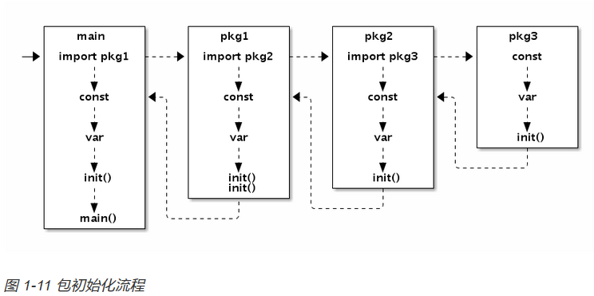

# Go语言高级编程

## 数组、字符串、切片

### 数组

1. 数组定义方式

```Go
var a [3]int                    // 定义长度为3的int型数组, 元素全部为0
var b = [...]int{1, 2, 3}       // 定义长度为3的int型数组, 元素为 1, 2, 3
var c = [...]int{2: 3, 1: 2}    // 定义长度为3的int型数组, 元素为 0, 2, 3
var d = [...]int{1, 2, 4: 5, 6} // 定义长度为6的int型数组, 元素为 1, 2, 0, 0, 5, 6
```

2. 数组不仅仅可以用于数值类型，还可以定义字符串数组、结构体数组、函数数组、接口数组、管道数组等等；
3. 空数组的意义所在：**长度为0的数组在内存中并不占用空间。空数组虽然很少直接使用，但是可以用于强调某种特有类型的操作时避免分配额外的内存空间**


### 字符串

1. 字符串结构由两个信息组成：==第一个是字符串指向的底层字节数组，第二个是字符串的字节的长度。字符串其实是一个结构体，因此字符串的赋值操作也就是`reflect.StringHeader`结构体的复制过程，并不会涉及底层字节数组的复制==

2. 对字符串的迭代模拟实现

   ```go
   func forOnString(s string, forBody func(i int, r rune)) {
       for i := 0; len(s) > 0; {
           r, size := utf8.DecodeRuneInString(s)
           forBody(i, r)
           s = s[size:]
           i += size
       }
   }
   ```

   

### 切片

1. 定义切片方式

   ```go
    a []int               // nil切片, 和 nil 相等, 一般用来表示一个不存在的切片
       b = []int{}           // 空切片, 和 nil 不相等, 一般用来表示一个空的集合
       c = []int{1, 2, 3}    // 有3个元素的切片, len和cap都为3
       d = c[:2]             // 有2个元素的切片, len为2, cap为3
       e = c[0:2:cap(c)]     // 有2个元素的切片, len为2, cap为3
       f = c[:0]             // 有0个元素的切片, len为0, cap为3
       g = make([]int, 3)    // 有3个元素的切片, len和cap都为3
       h = make([]int, 2, 3) // 有2个元素的切片, len为2, cap为3
       i = make([]int, 0, 3) // 有0个元素的切片, len为0, cap为3
   ```

2. 在对切片本身赋值或参数传递时，和数组指针的操作方式类似，只是复制切片头信息（`reflect.SliceHeader`），并不会复制底层的数据。

3. ==`len`为`0`但是`cap`容量不为`0`的切片则是非常有用的特性==

4. 保险的方式是先将需要自动内存回收的元素设置为`nil`，保证自动回收器可以发现需要回收的对象，然后再进行切片的删除操作：**最快最安全的删除操作** ==如果切片使用周期短，可以不用这样操作==

5.  切片可以强制类型转换，有时候是具有价值的

   ```go
   import "sort"
   
   var a = []float64{4, 2, 5, 7, 2, 1, 88, 1}
   
   func SortFloat64FastV1(a []float64) {
       // 强制类型转换
       var b []int = ((*[1 << 20]int)(unsafe.Pointer(&a[0])))[:len(a):cap(a)]
   
       // 以int方式给float64排序
       sort.Ints(b)
   }
   
   func SortFloat64FastV2(a []float64) {
       // 通过 reflect.SliceHeader 更新切片头部信息实现转换
       var c []int
       aHdr := (*reflect.SliceHeader)(unsafe.Pointer(&a))
       cHdr := (*reflect.SliceHeader)(unsafe.Pointer(&c))
       *cHdr = *aHdr
   
       // 以int方式给float64排序
       sort.Ints(c)
   }
   ```

   

## 函数、方法和接口



### 函数

1. 函数有：具名，匿名函数

2. 可支持多个返回值（可命名），多个参数（可变参数的使用）

3. 匿名函数一般也称为==闭包==，，闭包对捕获的外部变量并不是传值方式访问，而是以引用的方式访问。

4.  递归调用没有深度，栈的深度会随着动态调整

   Go语言函数的递归调用深度逻辑上没有限制，函数调用的栈是不会出现溢出错误的，因为Go语言运行时会根据需要动态地调整函数栈的大小。每个goroutine刚启动时只会分配很小的栈（4或8KB，具体依赖实现），根据需要动态调整栈的大小，栈最大可以达到GB级（依赖具体实现，在目前的实现中，32位体系结构为250MB,64位体系结构为1GB）

5. Go1.4之后改用连续的动态栈实现，也就是采用一个类似动态数组的结构来表示栈。

   1. ==所以这时候不能在依赖地址，因为有可能会发生变化，不能随意将指针保持到数值变量中==

### 方法（相当于类的实例方法一样）

1. **Go语言中方法是编译时静态绑定的**

### 接口

## 面向并发的内存模型

goroutine和系统线程也不是等价的。尽管两者的区别实际上只是一个量的区别，但正是这个量变引发了Go语言并发编程质的飞跃。

Goroutine采用的是半抢占式的协作调度，只有在当前Goroutine发生阻塞时才会导致调度；同时发生在用户态，调度器会根据具体函数只保存必要的寄存器，切换的代价要比系统线程低得多

==运行时有一个`runtime.GOMAXPROCS`变量，用于控制当前运行正常非阻塞Goroutine的系统线程数目==

### 原子操作

并发编程中“最小的且不可并行化”的操作

==就是说，多个线程同时 对一个变量操作，但是保证这个变量在那瞬间是独立被一个线程占用的。==

1. 粗粒度的原子操作，我们可以借助于`sync.Mutex`来实现

   ```g0
   import (
       "sync"
   )
   
   var total struct {
       sync.Mutex
       value int
   }
   
   func worker(wg *sync.WaitGroup) {
       defer wg.Done()
   
       for i := 0; i <= 100; i++ {
           total.Lock()
           total.value += i
           total.Unlock()
       }
   }
   
   func main() {
       var wg sync.WaitGroup
       wg.Add(2)
       go worker(&wg)
       go worker(&wg)
       wg.Wait()
   
       fmt.Println(total.value)
   }
   ```


2.  使用sync/atomic 包对原子操作提供了丰富的支持

   ```go
   import (
       "sync"
       "sync/atomic"
   )
   
   var total uint64
   
   func worker(wg *sync.WaitGroup) {
       defer wg.Done()
   
       var i uint64
       for i = 0; i <= 100; i++ {
           atomic.AddUint64(&total, i)
       }
   }
   
   func main() {
       var wg sync.WaitGroup
       wg.Add(2)
   
       go worker(&wg)
       go worker(&wg)
       wg.Wait()
   }
   ```

3. 原子操作配合互斥锁可以实现非常高效的单件模式。互斥锁的代价比普通整数的原子读写高很多，在性能敏感的地方可以增加一个数字型的标志位，通过原子检测标志位状态降低互斥锁的使用次数来提高性能

   ```go
   type singleton struct {}
   
   var (
       instance    *singleton
       initialized uint32
       mu          sync.Mutex
   )
   
   func Instance() *singleton {
       if atomic.LoadUint32(&initialized) == 1 {
           return instance
       }
   
       mu.Lock()
       defer mu.Unlock()
   
       if instance == nil {
           defer atomic.StoreUint32(&initialized, 1)
           instance = &singleton{}
       }
       return instance
   }
   ```

4. sync.once 是可以实现单例模式

### 顺序一致性内存模型

不同的Goroutine之间，并不满足顺序一致性内存模型，需要通过明确定义的同步事件来作为同步的参考

**对于从无缓冲Channel进行的接收，发生在对该Channel进行的发送完成之前。**

==严谨的并发程序的正确性不应该是依赖于CPU的执行速度和休眠时间等不靠谱的因素的。严谨的并发也应该是可以静态推导出结果的：根据线程内顺序一致性，结合Channel或`sync`同步事件的可排序性来推导，最终完成各个线程各段代码的偏序关系排序。如果两个事件无法根据此规则来排序，那么它们就是并发的，也就是执行先后顺序不可靠的。==

**==解决同步问题的思路是相同的：使用显式的同步。==**


### 常见的并发模式

并发不是并行。并发更关注的是程序的设计层面，并发的程序完全是可以顺序执行的，只有在真正的多核CPU上才可能真正地同时运行。并行更关注的是程序的运行层面，并行一般是简单的大量重复，例如GPU中对图像处理都会有大量的并行运算。为更好的编写并发程序，从设计之初Go语言就注重如何在编程语言层级上设计一个简洁安全高效的抽象模型，让程序员专注于分解问题和组合方案，而且不用被线程管理和信号互斥这些繁琐的操作分散精力。

而Go语言却另辟蹊径，它将共享的值通过Channel传递(实际上多个独立执行的线程很少主动共享资源)。在任意给定的时刻，最好只有一个Goroutine能够拥有该资源。==避免加锁==


1.  godoc 的vfs 包对虚拟的文件系统，子包getefs 就是为了控制访问该虚拟文件系统的最大并发数

2. ==切记 ，go中的goroutine 没有可以安全关闭管道的方法，可以使用select来进行管道的超时判断==

   ```go
   select {
   case v := <-in:
       fmt.Println(v)
   case <-time.After(time.Second):
       return // 超时
   }
   
   default 分支实现非阻塞的管道发送或接受操作
   ```

   

### 异常

在非`defer`语句中执行`recover`调用是初学者常犯的错误:

但是defer 不能直接调用recover 函数，因为不能正常捕获异常

```go
if r := recover(); r != nil { ... }
```


## CGO 编程

### 简单入门

```go
// hello.go
package main

import "C"

func main() {
    println("hello cgo")
}
```

代码通过`import "C"`语句启用CGO特性，主函数只是通过Go内置的println函数输出字符串，其中并没有任何和CGO相关的代码。虽然没有调用CGO的相关函数，但是`go build`命令会在编译和链接阶段启动gcc编译器，这已经是一个完整的CGO程序了

然后通过CGO包的`C.CString`函数将Go语言字符串转为C语言字符串，最后调用CGO包的`C.puts`函数向标准输出窗口打印转换后的C字符串。