## hadoop入梦

### HDFS概述

#### 1.1 HDFS 产出背景及定义

1. 定义

   HDFS 是一个文件系统，用户存储文件，通过目录树来定位文件，其次是分布式的，由很多服务器联合起来实现其功能，集群中的服务器有各自的角色

   ==适用于场景== ： 适合一次写入，多次读出的场景，且不支持文件的修改，适合用来做数据分析


#### 1.2 HDFS优缺点

##### 1.2.1 优点

1. 高容错性
   1. 数据自动保存多个副本，
   2. 副本丢失，自动回复
2. 适合处理大数据
3. 可构建在廉价机器上，通过多副本机制，提供可靠性

##### 1.2.2 缺点

1. 不适合低延时数据访问，
2. 无法高效的对大量小文件进行存储
   1. 会占用NameNode大量的内容来存储文件目录和块信息，这样是不可取的
   2. 小文件存储的寻址时间会超高读取时间，违反了设计目的
3. 不支持并发写入、文件修改
   1. 一个文件只能有一个写，不容许多个线程同时写
   2. 仅支持数据==追加==，不支持文件的随机修改

#### 1.3 HDFS 组成架构

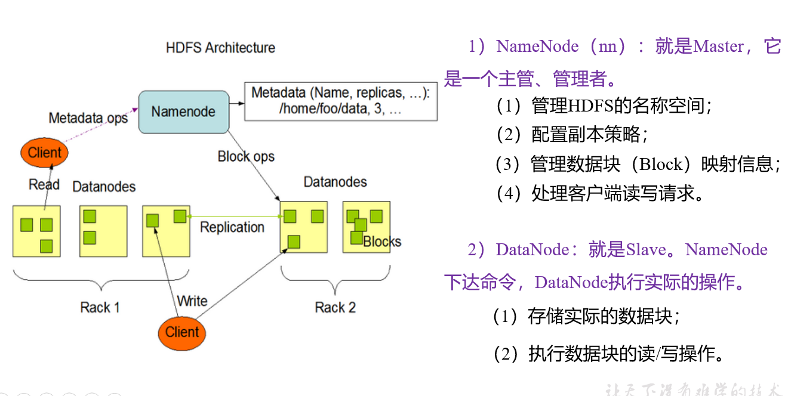

#### 1.4 HDFS 文件块大小

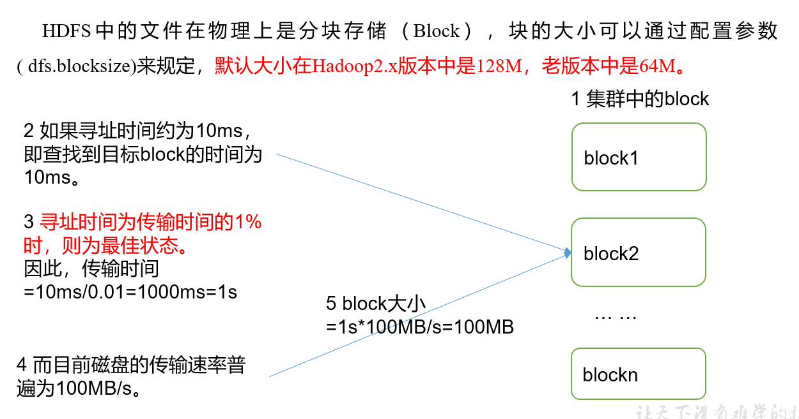


### HDFS 的shell操作

1. 基本语法

   bin/hadoop  fs 具体命令  OR  bin/hdfs  dfs 具体命令

2. 命令大全

   bin/hadoop  dfs 可以查看

3. 常用命令实操

   1. 启动hadoop集群

      ```txt
      sbin/start-dfs.sh
      sbin/start-yarn.sh
      ```

   2. -help 输出这个命令参数

      ```txt
      hadoop fs -help rm
      ```

   3. -ls  显示目录信息

   4. -mkdir  在HDFS上创建目录

      ```txt
      hadoop fs  -mkdir -p /lan/input
      ```

   5. -moveFromLocal：从本地剪切粘贴到HDFS

      ```txt
      hadoop fs  -moveFromLocal  ./kongming.txt  /sanguo/shuguo
      ```

   6. -appendToFile：追加一个文件到已经存在的文件末尾

      ```tx
      hadoop fs -appendToFile liubei.txt /sanguo/shuguo/kongming.txt
      ```

   7. -cat 显示内容

      ```
      hadoop fs -cat /sanguo/shuguo/kongming.txt
      ```

   8. -chgrp 、-chmod、-chown：Linux文件系统中的用法一样，修改文件所属权限

   9. -copyFromLocal：从本地文件系统中拷贝文件到HDFS路径去

   10. -cp ：从HDFS 的一个路径拷贝到HDFS的另一个路径

   11. -mv 在HDFS 目录中移动文件

   12. -get ： 等同于copyTolocal，就是从HDFS下载文件到本地

   13. -getmerge：合并下载多个文件，比如HDFS的目录 /user/lan/test下有多个文件:log.1, log.2,log.3,...

   14. -put：等同于copyFromLocal

   15. -tail：显示一个文件的末尾

   16. -rm：删除文件或文件夹

   17. -rmdir ： 删除空目录

   18. -du ： 统计文件夹的大小信息

   19. -setrep ： 设置HDFS 中文件的副本数量

#### HDFS客户端操作（开发重点)

##### HDFS客户端环境准备

1. 根据自己电脑的操作系统拷贝对应的编译后的hadoop jar包到非中文路径

2. 配置HADOOP_HOME 环境变量

   ```txt
   HADOOP_HOME=****
   
   path 变量 ： 
   %HADOOP_HOME%\bin
   ```

3. 创建一个maven 工程HdfsClientDemo

4. 导入响应的依赖包和日志

   ```
   <dependencies>
   		<dependency>
   			<groupId>junit</groupId>
   			<artifactId>junit</artifactId>
   			<version>RELEASE</version>
   		</dependency>
   		<dependency>
   			<groupId>org.apache.logging.log4j</groupId>
   			<artifactId>log4j-core</artifactId>
   			<version>2.8.2</version>
   		</dependency>
   		<dependency>
   			<groupId>org.apache.hadoop</groupId>
   			<artifactId>hadoop-common</artifactId>
   			<version>2.7.2</version>
   		</dependency>
   		<dependency>
   			<groupId>org.apache.hadoop</groupId>
   			<artifactId>hadoop-client</artifactId>
   			<version>2.7.2</version>
   		</dependency>
   		<dependency>
   			<groupId>org.apache.hadoop</groupId>
   			<artifactId>hadoop-hdfs</artifactId>
   			<version>2.7.2</version>
   		</dependency>
   		<dependency>
   			<groupId>jdk.tools</groupId>
   			<artifactId>jdk.tools</artifactId>
   			<version>1.8</version>
   			<scope>system</scope>
   			<systemPath>${JAVA_HOME}/lib/tools.jar</systemPath>
   		</dependency>
   </dependencies>
   
   ```

5. log4j.properties

   ```txt
   log4j.rootLogger=INFO, stdout
   log4j.appender.stdout=org.apache.log4j.ConsoleAppender
   log4j.appender.stdout.layout=org.apache.log4j.PatternLayout
   log4j.appender.stdout.layout.ConversionPattern=%d %p [%c] - %m%n
   log4j.appender.logfile=org.apache.log4j.FileAppender
   log4j.appender.logfile.File=target/spring.log
   log4j.appender.logfile.layout=org.apache.log4j.PatternLayout
   log4j.appender.logfile.layout.ConversionPattern=%d %p [%c] - %m%n
   
   ```

6. 创建类 ： com.stduy.hdfs.HdfsClient 类

   ```txt
   public class HdfsClient{	
   @Test
   public void testMkdirs() throws IOException, InterruptedException, URISyntaxException{
   		
   		// 1 获取文件系统
   		Configuration configuration = new Configuration();
   		// 配置在集群上运行
   		// configuration.set("fs.defaultFS", "hdfs://hadoop102:9000");
   		// FileSystem fs = FileSystem.get(configuration);
   
   		FileSystem fs = FileSystem.get(new URI("hdfs://hadoop102:9000"), configuration, "lan");
   		
   		// 2 创建目录
   		fs.mkdirs(new Path("/1108/daxian/banzhang"));
   		
   		// 3 关闭资源
   		fs.close();
   	}
   }
   
   ```

7. 客户端去操作HDFS 时，是有一个用户身份。默认情况下，HDFS客户端API 会从JVM 中获取一个参数来作为自己的用户身份 ： --DHADOOP_USER_NAME=lan，lan为用户名称。

### HDFS客户端操作

#### HDFS 客户端环境准备

1. 根据自己电脑的系统，将编译过的hadoop包，放到非中文路径下

2. 配置环境变量

   ```txt
   HADOOP_HOME= 
   path : 添加 ;  %HADOOP_HOME%\bin
   ```

3. 注意事项 ： 

   ```txt
   1. 如果你的jdk 安装在 program file 下， 存在空格，那么
   有两种办法 ： 
   	1. 在program file  这个加 "",
   	2. 对java文件夹，添加软连接   mklink /j  源文件夹   目的文件夹
   ```

4. 在客户端操作HDFS 是，是有一个用户身份的，默认情况下，HDFS客户端API 会从JVM 中获取一个参数来作为自己身份的默认情况下，HDFS客户端API会从JVM中获取一个参数来作为自己的用户身份：-DHADOOP_USER_NAME=lan ，lan用户名称

5. 测试类

   ```java
   package com.study.hdfs;
   
   
   import org.apache.hadoop.conf.Configuration;
   import org.apache.hadoop.fs.FileSystem;
   import org.apache.hadoop.fs.Path;
   
   import java.io.IOException;
   import java.net.URI;
   import java.net.URISyntaxException;
   
   /**
    * Created by IntelliJ IDEA.
    *
    * @author : Firewine
    * @version : 1.0
    * @Program Name: HDFSClient
    * @Create : 2020/2/3
    * @Description :
    */
   public class HDFSClient {
   
       public static void main(String[] args) throws IOException, URISyntaxException, InterruptedException {
   
   
           Configuration conf = new Configuration();
           conf.set("fs.defaultFS","hdfs://192.168.11.100:9000");
           //1.获取hdfs 客户端对象
           // FileSystem fs = FileSystem.get(conf);
           FileSystem fs = FileSystem.get(new URI("hdfs://192.168.11.100:9000"),conf,"lan");
           //2在hdfs创建路径
           fs.mkdirs(new Path("/demo/ceshi1"));
   
   
           //3. 关闭资源
           fs.close();
   
           System.out.println("over");
       }
   }
   
   ```

   

#### 文件上传

1. 代码

   ```txt
    @Test
       public void testCopyFromLocalFile() throws IOException, URISyntaxException, InterruptedException {
   
           //1. 获取fs对象
           Configuration conf = new Configuration();
           conf.set("dfs.replication","2");
           FileSystem fs = FileSystem.get(new URI("hdfs://192.168.11.100:9000"),conf,"lan");
   
           //2. 执行上传API
           fs.copyFromLocalFile(new Path("E:\\JAVA\\IdeaProjects\\HDFSClient\\bangzhang.txt"),new Path("/banzhang3.txt"));
   
   
           fs.close();
       }
   ```

2. 参数优先级 ： 

   参数优先级排序：（1）客户端代码中设置的值 >（2）ClassPath下的用户自定义配置文件 >（3）然后是服务器的默认配置

#### 文件下载

1. 代码

   ```
     @Test
       public void testCopyToLocalFile() throws URISyntaxException, IOException, InterruptedException {
   
           //1. 获取fs对象
           Configuration conf = new Configuration();
           conf.set("dfs.replication","2");
           FileSystem fs = FileSystem.get(new URI("hdfs://192.168.11.100:9000"),conf,"lan");
   
   
           //2 执行下载操作
           fs.copyToLocalFile(new Path("/banzhang.txt"),new Path("e:/banzhagn.txt"));
       }
   ```

#### 文件夹删除

1. 代码

   ```java
    @Test
       public void testDelete() throws URISyntaxException, IOException, InterruptedException {
   
           //1. 获取fs对象
           Configuration conf = new Configuration();
           conf.set("dfs.replication", "2");
           FileSystem fs = FileSystem.get(new URI("hdfs://192.168.11.100:9000"), conf, "lan");
   
           // 2 执行删除
           //后面的true，，表示如果你删除的是文件夹，则说明是否递归删除，若是文件，忽略
           fs.delete(new Path("/hadoop-2.7.2.tar.gz"), true);
   
           // 3 关闭资源
           fs.close();
   
       }
   ```

   


#### 文件名更改

1. 代码

   ```java
    @Test
       public void testRname() throws URISyntaxException, IOException, InterruptedException {
   
           //1. 获取fs对象
           Configuration conf = new Configuration();
         
           FileSystem fs = FileSystem.get(new URI("hdfs://192.168.11.100:9000"), conf, "lan");
   
           // 2 修改文件名称
           fs.rename(new Path("/banzhang.txt"), new Path("/banhua.txt"));
   
   
           // 3 关闭资源
           fs.close();
   
       }
   ```

   

#### HDFS 文件详情查看

1. 代码

   ```java
   @Test
   public void testListFiles() throws IOException, InterruptedException, URISyntaxException{
     //1. 获取fs对象
           Configuration conf = new Configuration();
         
           FileSystem fs = FileSystem.get(new URI("hdfs://192.168.11.100:9000"), conf, "lan");
   		
   	// 2 获取文件详情
   	RemoteIterator<LocatedFileStatus> listFiles = fs.listFiles(new Path("/"), true);
   		
   	while(listFiles.hasNext()){
   		LocatedFileStatus status = listFiles.next();
   			
   		// 输出详情
   		// 文件名称
   		System.out.println(status.getPath().getName());
   		// 长度
   		System.out.println(status.getLen());
   		// 权限
   		System.out.println(status.getPermission());
   		// 分组
   		System.out.println(status.getGroup());
   			
   		// 获取存储的块信息
   		BlockLocation[] blockLocations = status.getBlockLocations();
   			
   		for (BlockLocation blockLocation : blockLocations) {
   				
   			// 获取块存储的主机节点
   			String[] hosts = blockLocation.getHosts();
   				
   			for (String host : hosts) {
   				System.out.println(host);
   			}
   		}
   			
   		System.out.println("-----------班长的分割线----------");
   	}
   
   // 3 关闭资源
   fs.close();
   }
   
   ```

#### HDFS 文件和文件夹判断

1. 代码

   ```java
    //文件和文件夹判断
       @Test
       public void testListStatus() throws IOException, InterruptedException, URISyntaxException {
   
           // 1 获取文件配置信息
           Configuration conf = new Configuration();
           FileSystem fs = FileSystem.get(new URI("hdfs://192.168.11.100:9000"), conf, "lan");
   
           // 2 判断是文件还是文件夹
           FileStatus[] listStatus = fs.listStatus(new Path("/"));
   
           for (FileStatus fileStatus : listStatus) {
   
               // 如果是文件
               if (fileStatus.isFile()) {
                   System.out.println("f:" + fileStatus.getPath().getName());
               } else {
                   System.out.println("d:" + fileStatus.getPath().getName());
               }
           }
   
           // 3 关闭资源
           fs.close();
       }
   ```

#### HDFS 的 I/O操作

##### 文件上传,下载，块读写

1. 代码

   ```java
   package com.study.hdfs;
   
   import org.apache.hadoop.conf.Configuration;
   import org.apache.hadoop.fs.FSDataInputStream;
   import org.apache.hadoop.fs.FSDataOutputStream;
   import org.apache.hadoop.fs.FileSystem;
   import org.apache.hadoop.fs.Path;
   import org.apache.hadoop.io.IOUtils;
   import org.junit.Test;
   
   import java.io.File;
   import java.io.FileInputStream;
   import java.io.FileOutputStream;
   import java.io.IOException;
   import java.net.URI;
   import java.net.URISyntaxException;
   
   /**
    * Created by IntelliJ IDEA.
    *
    * @author : Firewine
    * @version : 1.0
    * @Program Name: HDFSIO
    * @Create : 2020/2/4
    * @Description :
    */
   public class HDFSIo {
   
       // 把本地e盘上的banhua.txt文件上传到HDFS根目录
       @Test
       public void putFileToHDFS() throws IOException, InterruptedException, URISyntaxException {
   
           // 1 获取对象
           Configuration conf = new Configuration();
           FileSystem fs = FileSystem.get(new URI("hdfs://192.168.11.100:9000"), conf, "lan");
   
           // 2 获取输入流
           FileInputStream fis = new FileInputStream(new File("e:/banzhang.txt"));
   
           // 3 获取输出流
           FSDataOutputStream fos = fs.create(new Path("/banzhang.txt"));
   
           // 4 流的对拷
           IOUtils.copyBytes(fis, fos, conf);
   
           // 5 关闭资源
           IOUtils.closeStream(fos);
           IOUtils.closeStream(fis);
           fs.close();
       }
   
   
       // 从HDFS上下载banhua.txt文件到本地e盘上
       @Test
       public void getFileFromHDFS() throws IOException, InterruptedException, URISyntaxException{
   
           // 1 获取对象
           Configuration conf = new Configuration();
           FileSystem fs = FileSystem.get(new URI("hdfs://hadoop102:9000"), conf , "lan");
   
           // 2 获取输入流
           FSDataInputStream fis = fs.open(new Path("/banhua.txt"));
   
           // 3 获取输出流
           FileOutputStream fos = new FileOutputStream(new File("e:/banhua.txt"));
   
           // 4 流的对拷
           IOUtils.copyBytes(fis, fos, conf);
   
           // 5 关闭资源
           IOUtils.closeStream(fos);
           IOUtils.closeStream(fis);
           fs.close();
       }
   
       // 下载第一块
       @Test
       public void readFileSeek1() throws IOException, InterruptedException, URISyntaxException{
   
           // 1 获取对象
           Configuration conf = new Configuration();
           FileSystem fs = FileSystem.get(new URI("hdfs://hadoop102:9000"), conf , "lan");
   
           // 2 获取输入流
           FSDataInputStream fis = fs.open(new Path("/hadoop-2.7.2.tar.gz"));
   
           // 3 获取输出流
           FileOutputStream fos = new FileOutputStream(new File("e:/hadoop-2.7.2.tar.gz.part1"));
   
           // 4 流的对拷（只拷贝128m）
           byte[] buf = new byte[1024];
           for (int i = 0; i < 1024 * 128; i++) {
               fis.read(buf);
               fos.write(buf);
           }
   
           // 5 关闭资源
           IOUtils.closeStream(fos);
           IOUtils.closeStream(fis);
           fs.close();
       }
   
       // 下载第二块
       @SuppressWarnings("resource")
       @Test
       public void readFileSeek2() throws IOException, InterruptedException, URISyntaxException{
   
           // 1 获取对象
           Configuration conf = new Configuration();
           FileSystem fs = FileSystem.get(new URI("hdfs://hadoop102:9000"), conf , "lan");
   
           // 2 获取输入流
           FSDataInputStream fis = fs.open(new Path("/hadoop-2.7.2.tar.gz"));
   
           // 3 设置指定读取的起点
           fis.seek(1024*1024*128);
   
           // 4 获取输出流
           FileOutputStream fos = new FileOutputStream(new File("e:/hadoop-2.7.2.tar.gz.part2"));
   
           // 5 流的对拷
           IOUtils.copyBytes(fis, fos, conf);
   
           // 6 关闭资源
           IOUtils.closeStream(fos);
           IOUtils.closeStream(fis);
           fs.close();
       }
   
   
   
   }
   
   ```


### HDFS 的数据流

#### HDFS写数据流程

##### 剖析文件写入

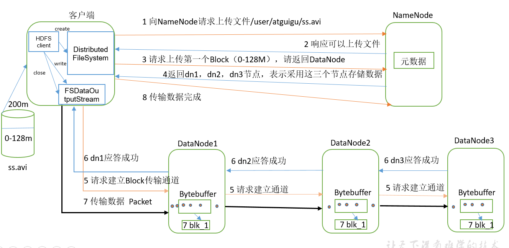


```txt
1）客户端通过Distributed FileSystem模块向NameNode请求上传文件，NameNode检查目标文件是否已存在，父目录是否存在。
2）NameNode返回是否可以上传。
3）客户端请求第一个 Block上传到哪几个DataNode服务器上。
4）NameNode返回3个DataNode节点，分别为dn1、dn2、dn3。
5）客户端通过FSDataOutputStream模块请求dn1上传数据，dn1收到请求会继续调用dn2，然后dn2调用dn3，将这个通信管道建立完成。
6）dn1、dn2、dn3逐级应答客户端。
7）客户端开始往dn1上传第一个Block（先从磁盘读取数据放到一个本地内存缓存），以Packet为单位，dn1收到一个Packet就会传给dn2，dn2传给dn3；dn1每传一个packet会放入一个应答队列等待应答。
8）当一个Block传输完成之后，客户端再次请求NameNode上传第二个Block的服务器。（重复执行3-7步）。

```


##### 网络拓扑-结点距离计算

NameNode 会选择距离待上传数据最近距离的DataNode接收数据。最近距离怎么算

==节点距离： 两个节点到达最近的共同祖先的距离总和==

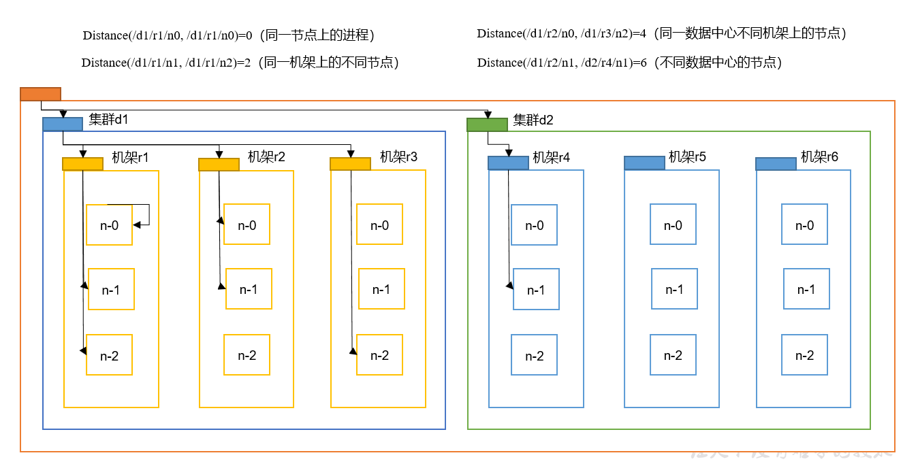

   

##### 机架感知

1. 副本结点选择

   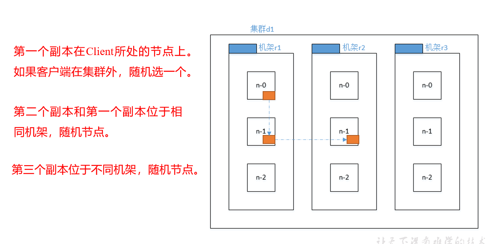

   

#### HDFS 读数据流程

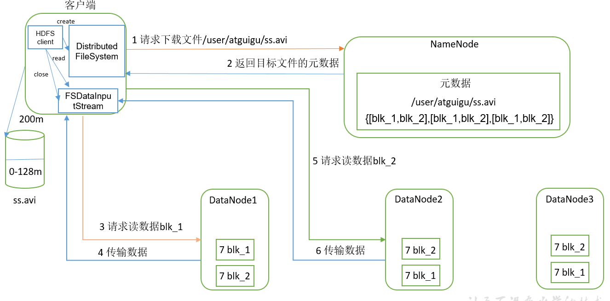

```txt
1）客户端通过Distributed FileSystem向NameNode请求下载文件，NameNode通过查询元数据，找到文件块所在的DataNode地址。
2）挑选一台DataNode（就近原则，然后随机）服务器，请求读取数据。
3）DataNode开始传输数据给客户端（从磁盘里面读取数据输入流，以Packet为单位来做校验）。
4）客户端以Packet为单位接收，先在本地缓存，然后写入目标文件。

```


### NameNode 和 SecondaryNamenode

#### NN和2NN工作机制

NameNode 的元数据，是存放在内存的，也是在磁盘里面备份元数据的FsImage

因此，引入Edits文件(只进行追加操作，效率很高)。每当元数据有更新或者添加元数据时，修改内存中的元数据并追加到Edits中。

一旦断电，可以通过 这两个文件，进行合并，合成元数据

而 SecondarynameNode ，是专门用于 这两个文件的合并

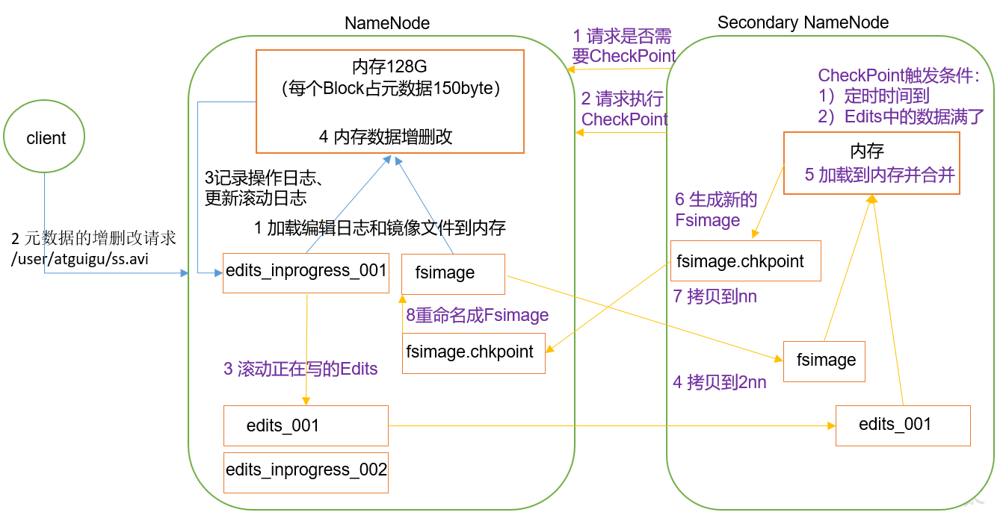

```txt
1. 第一阶段：NameNode启动
（1）第一次启动NameNode格式化后，创建Fsimage和Edits文件。如果不是第一次启动，直接加载编辑日志和镜像文件到内存。
（2）客户端对元数据进行增删改的请求。
（3）NameNode记录操作日志，更新滚动日志。
（4）NameNode在内存中对数据进行增删改。
2. 第二阶段：Secondary NameNode工作
	（1）Secondary NameNode询问NameNode是否需要CheckPoint。直接带回NameNode是否检查结果。
	（2）Secondary NameNode请求执行CheckPoint。
	（3）NameNode滚动正在写的Edits日志。
	（4）将滚动前的编辑日志和镜像文件拷贝到Secondary NameNode。
	（5）Secondary NameNode加载编辑日志和镜像文件到内存，并合并。
	（6）生成新的镜像文件fsimage.chkpoint。
	（7）拷贝fsimage.chkpoint到NameNode。
	（8）NameNode将fsimage.chkpoint重新命名成fsimage。

```

#### Fsimage 和 Edits 解析

1. 概念

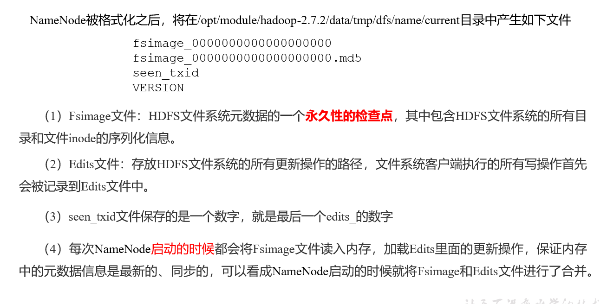

2. oiv 查看fsimage 文件

   1. 查看oiv 和oev 命令

      ```txt
      oiv            apply the offline fsimage viewer to an fsimage
      oev            apply the offline edits viewer to an edits file
      
      ```

   2. 基本语法

      ```txt
      hdfs oiv -p 文件类型 -i镜像文件 -o 转换后文件输出路径
      ```

   3. 举例

      ```txt
      hdfs oiv -p XML -i fsimage_0000000000000000025 -o /opt/module/hadoop-2.7.2/fsimage.xml
      
      cat /opt/module/hadoop-2.7.2/fsimage.xml
      ```

      

3. oev 查看Edits文件

   1. 基本语法

      ```txt
      hdfs oev -p 文件类型 -i编辑日志 -o 转换后文件输出路径
      ```

   2. 案例

      ```txt
      hdfs oev -p XML -i edits_0000000000000000012-0000000000000000013 -o /opt/module/hadoop-2.7.2/edits.xml
      
      ```

      

#### CheckPoint时间设置

1. 通常情况下，SecondarynameNode 每隔一小时执行一次

   ```txt
   [hdfs-default.xml]
   <property>
     <name>dfs.namenode.checkpoint.period</name>
     <value>3600</value>
   </property>
   
   ```

2. 一分钟检查一次操作次数，当操作次数达到1百万时，SecondaryNameNode 执行一次

   ```txt
   <property>
     <name>dfs.namenode.checkpoint.txns</name>
     <value>1000000</value>
   <description>操作动作次数</description>
   </property>
   
   <property>
     <name>dfs.namenode.checkpoint.check.period</name>
     <value>60</value>
   <description> 1分钟检查一次操作次数</description>
   </property >
   
   ```


#### NameNode 故障处理

采用两种方法恢复数据：；

###### 方法一 ： 将SecondaryNamenode 中数据拷贝到namenode 存储数据的目录

1. kill -9 NameNode进程

2. 删除NameNode存储的数据（/opt/module/hadoop-2.7.2/data/tmp/dfs/name）

   hadoop100 hadoop-2.7.2]$ rm -rf /opt/module/hadoop-2.7.2/data/tmp/dfs/name/*

3. 拷贝SecondaryNameNode中数据到原NameNode存储数据目录

   hadoop100 dfs]$ scp -r lan@hadoop104:/opt/module/hadoop-2.7.2/data/tmp/dfs/namesecondary/* ./name/

4. 重新启动NameNode

   hadoop100 hadoop-2.7.2]$ sbin/hadoop-daemon.sh start namenode

###### 方法二 ： 使用-importCheckpoint选项启动NameNode守护进程，从而将SecondaryNameNode中数据拷贝到NameNode目录中。

1. 修改hdfs-site.xml中的

   ```txt
   <property>
   
    <name>dfs.namenode.checkpoint.period</name>
   
    <value>120</value>
   
   </property>
   
   <property>
   
    <name>dfs.namenode.name.dir</name>
   
    <value>/opt/module/hadoop-2.7.2/data/tmp/dfs/name</value>
   
   </property>
   ```

   


2. kill -9 NameNode进程

3. 删除NameNode存储的数据（/opt/module/hadoop-2.7.2/data/tmp/dfs/name）

   hadoop100 hadoop-2.7.2]$ rm -rf /opt/module/hadoop-2.7.2/data/tmp/dfs/name/*

4. 如果SecondaryNameNode不和NameNode在一个主机节点上，需要将SecondaryNameNode存储数据的目录拷贝到NameNode存储数据的平级目录，并删除in_use.lock文件

   ```txt
   3. @hadoop100 dfs]$ scp -r lan@hadoop104:/opt/module/hadoop-2.7.2/data/tmp/dfs/namesecondary ./
   
    
   
   hadoop100 namesecondary]$ rm -rf in_use.lock
   
    
   
   hadoop100 dfs]$ pwd
   
   /opt/module/hadoop-2.7.2/data/tmp/dfs
   
    
   
   hadoop100 dfs]$ ls
   
   data name namesecondary
   ```

   

   

5. 导入检查点数据（等待一会ctrl+c结束掉）

   hadoop102 hadoop-2.7.2]$ bin/hdfs namenode -importCheckpoint

6. 启动NameNode

   hadoop102 hadoop-2.7.2]$ sbin/hadoop-daemon.sh start namenode

#### 集群安全模式

1. 概述

   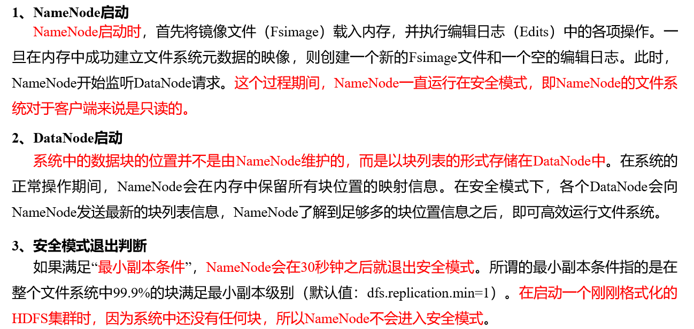

2. 基本语法

   集群处于安全模式，，不能执行重要操作（写操作）。集群启动完全后，自动退出安全模式

   ```txt
   （1）bin/hdfs dfsadmin -safemode get		（功能描述：查看安全模式状态）
   （2）bin/hdfs dfsadmin -safemode enter  	（功能描述：进入安全模式状态）
   （3）bin/hdfs dfsadmin -safemode leave	（功能描述：离开安全模式状态）
   （4）bin/hdfs dfsadmin -safemode wait	（功能描述：等待安全模式状态）
   
   ```

3. 案例

   1. 查看安全模式

      ```txt
      hdfs dfsadmin -safemode get
      Safe mode is OFF
      
      
      ```

   2. 先进入安全模式

      bin/hdfs dfsadmin -safemode enter

   3. 创建并执行下面脚本

      ```txt
      在/opt/module/hadoop-2.7.2路径上，编辑一个脚本safemode.sh
      
      #!/bin/bash
      hdfs dfsadmin -safemode wait
      hdfs dfs -put /opt/module/hadoop-2.7.2/README.txt /
      
      ```

   4. 再开一个窗口执行

      ```tt
       bin/hdfs dfsadmin -safemode leave
      ```

   5. 观察

       1.  在观察上一个窗口

           safe mode is OFF

            	2. HDFS集群已经有上传数据了

      

#### NameNode 多目录配置

1. Namenode 的本地目录可以配置成多个，且每个目录存放内容相同，增加了可靠性

2. 具体配置如下：

   ```txt
   （1）在hdfs-site.xml文件中增加如下内容
   <property>
       <name>dfs.namenode.name.dir</name>
   <value>file:///${hadoop.tmp.dir}/dfs/name1,file:///${hadoop.tmp.dir}/dfs/name2</value>
   </property>
   （2）停止集群，删除data和logs中所有数据。
   [lan@hadoop102 hadoop-2.7.2]$ rm -rf data/ logs/
   [lan@hadoop103 hadoop-2.7.2]$ rm -rf data/ logs/
   [lan@hadoop104 hadoop-2.7.2]$ rm -rf data/ logs/
   （3）格式化集群并启动。
   [lan@hadoop102 hadoop-2.7.2]$ bin/hdfs namenode –format
   [lan@hadoop102 hadoop-2.7.2]$ sbin/start-dfs.sh
   （4）查看结果
   [lan@hadoop102 dfs]$ ll
   总用量 12
   
   ```


### DataNode 

#### DataNode 工作机制

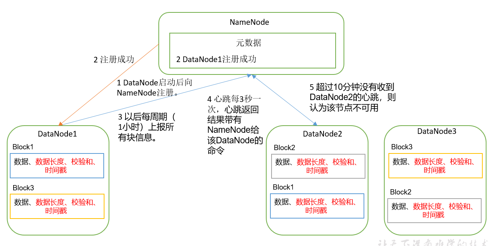

```txt
1）一个数据块在DataNode上以文件形式存储在磁盘上，包括两个文件，一个是数据本身，一个是元数据包括数据块的长度，块数据的校验和，以及时间戳。
2）DataNode启动后向NameNode注册，通过后，周期性（1小时）的向NameNode上报所有的块信息。
3）心跳是每3秒一次，心跳返回结果带有NameNode给该DataNode的命令如复制块数据到另一台机器，或删除某个数据块。如果超过10分钟没有收到某个DataNode的心跳，则认为该节点不可用。
4）集群运行中可以安全加入和退出一些机器。

```


#### 数据完整性

1. 如下是DataNode结点保证数据完整性的发方法
   1. 当DataNode读取的Block的时候，它会计算CheckSum
   2. 如果计算后的CheckSum，与Block创建时值不一样，说明Block已经损坏
   3. Client读取其他DataNode上的Block
   4. DataNode在其文件创建后周期验证CheckSum

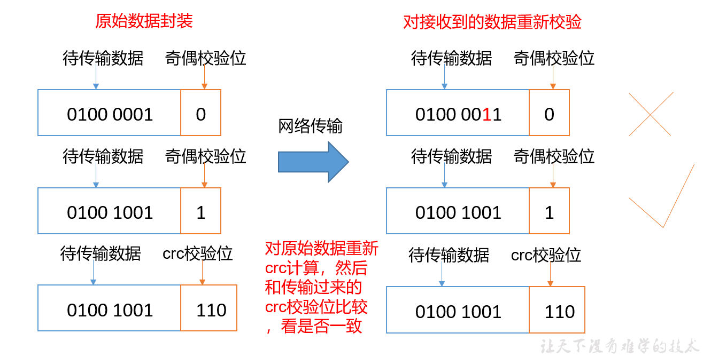


#### 掉线时限参数设置

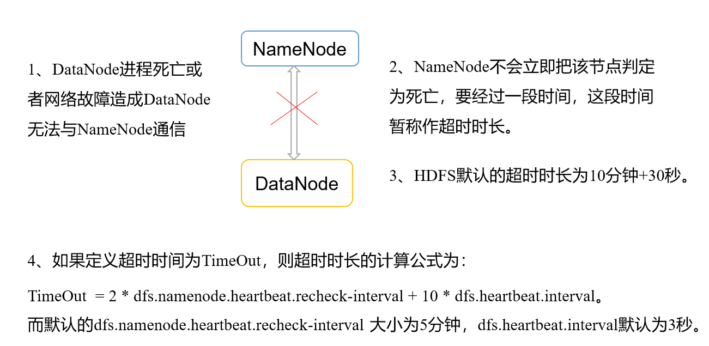

需要注意的是hdfs-site.xml 配置文件中的heartbeat.recheck.interval的单位为毫秒，dfs.heartbeat.interval的单位为秒。

```txt
<property>
    <name>dfs.namenode.heartbeat.recheck-interval</name>
    <value>300000</value>
</property>
<property>
    <name>dfs.heartbeat.interval</name>
    <value>3</value>
</property>

```

#### 服役新数据结点

1. 原有的数据结点，不能满足存储数据的需求，需要在原有基础上添加新的数据结点

2. 环境准备

   1. 在 原主机上克隆主机
   2. 修改IP地址和主机名称
   3. 删除原来HDFS文件系统留存的文件（/opt/module/hadoop***/data  和 log）
   4. source 一些配置文件

3. 服役新节点的具体步骤

   1. 直接启动DataNode，即可关联到集群

      ```txt
      hadoop103(新节点)
      sbin/hadoop-daemon.sh start datanode
      sbin/yarn-daemon.sh start nodemanager
      
      ```

      

   2. 在新节点上传文件

      ```txt
      hadoop fs -put /opt/module/hadoop-2.7.2/LICENSE.txt /
      ```

   3. 如果数据不均衡，可以用命令实现集群的再平衡

      ```txt
      ./start-balancer.sh
      starting balancer, logging to /opt/module/hadoop-2.7.2/logs/hadoop-lan-balancer-hadoop102.out
      Time Stamp               Iteration#  Bytes Already Moved  Bytes Left To Move  Bytes Being Moved
      
      ```

      

#### 退役旧数据节点

##### 添加白名单

添加到白名单的主机节点，都容许访问NameNode，不在白名单的主机节点，都会被退出

配置白名单的具体步骤如下： (在hadoop100 下运行)

1. 在NameNode 的/opt/module/hadoop***/etc/hadoop 目录下创建dfs.hosts文件

   并且添加主机名称（不添加hadoop103）

   ```txt
   hadoop100
   hadoop101
   hadoop102
   ```

2. 在nameNode 的hdfs-site.xml 配置文件中增加dfs.hosts属性

   ```txt
   <property>
   <name>dfs.hosts</name>
   <value>/opt/module/hadoop-2.7.2/etc/hadoop/dfs.hosts</value>
   </property>
   
   ```

3. 配置文件分发

4. 刷新namenode 

5. 更新ResourceManager 节点

   ```txt
   xsync hdfs-site.xml
   
   hdfs dfsadmin -refreshNodes
   
   yarn rmadmin -refreshNodes
   ```

6. 在web浏览器查看

7. 如果数据不均衡，可以命令实现集群的再均衡

##### 黑名单退役

在黑名单上面的会被强制退出

1. 在NameNode的/opt/module/hadoop-2.7.2/etc/hadoop目录下创建dfs.hosts.exclude文件

   ```txt
   hadoop103
   ```

2. 在NameNode的hdfs-site.xml配置文件中增加dfs.hosts.exclude属性

   ```txt
   <property>
   <name>dfs.hosts.exclude</name>
         <value>/opt/module/hadoop-2.7.2/etc/hadoop/dfs.hosts.exclude</value>
   </property>
   
   ```

3. 刷新NameNode、刷新ResourceManager

   ```txt
   hdfs dfsadmin -refreshNodes
   Refresh nodes successful
   
   
   yarn rmadmin -refreshNodes
   ```

4. 检查web浏览器

5. 等待退役节点状态为decommissioned（所有块已经复制完成），停止该节点及节点资源管理器。注意：如果副本数是3，服役的节点小于等于3，是不能退役成功的，需要修改副本数后才能退役

6. ==黑白名单，不可以出现同时存在同一个节点==

#### DataNode多目录配置

1. DataNode也可以配置成多个目录，每个目录存储的数据不一样。即：数据不是副本

2. 具体配置如下 ： hdfs-site.xml

   ```txt
   <property>
           <name>dfs.datanode.data.dir</name>
   <value>file:///${hadoop.tmp.dir}/dfs/data1,file:///${hadoop.tmp.dir}/dfs/data2</value>
   </property>
   
   ```


### HDFS 2.X 新特性

#### 集群间数据拷贝

使用SCP  命令

采用distcp命令实现两个Hadoop集群之间的递归数据复制


#### 小文件存档

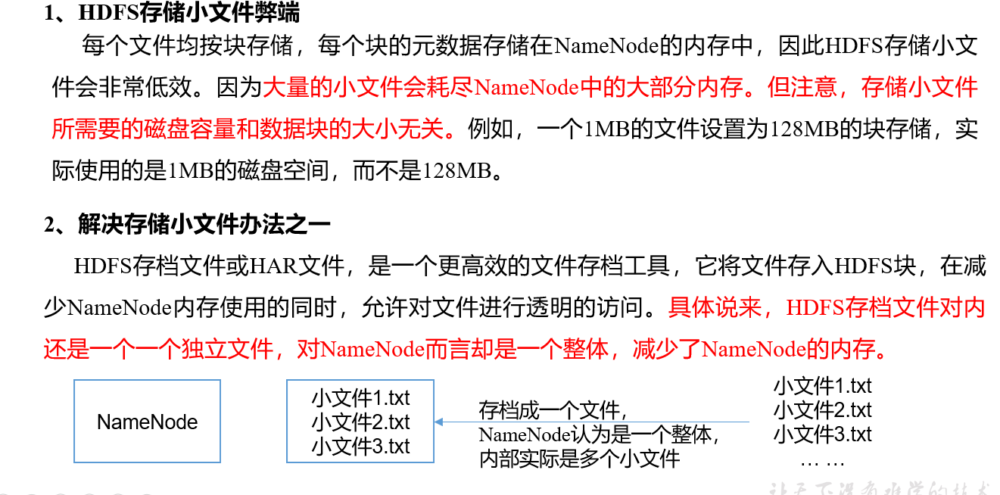

案例 :

1. 需要启动YARN进程

   start-yarn.sh

2. 归档文件

   把/user/lan/input目录里面的所有文件归档成一个叫input.har的归档文件，并把归档后文件存储到/user/lan/output路径下。

   ```txt
   bin/hadoop archive -archiveName input.har –p  /user/lan/input   /user/lan/output
   ```

3. 查看归档

   ```txt
   hadoop fs -lsr /user/lan/output/input.har
   hadoop fs -lsr har:///user/lan/output/input.har
   ```

   

4. 解归档文件

   ```txt
   hadoop fs -cp har:/// user/lan/output/input.har/*    /user/lan
   ```

   

#### 回收站

开启回收站功能，可以将删除的文件在不超时的情况下，恢复原数据，起到防止误删除备份等作用

1. 回收站参数设置及工作机制

   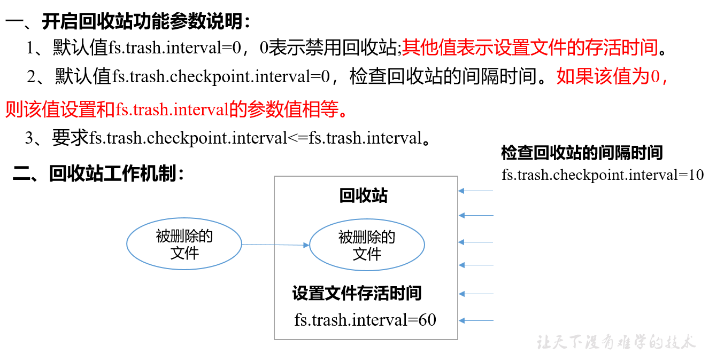

   

2. 启用回收站

   ```txt
   修改core-site.xml，配置垃圾回收时间为1分钟。
   <property>
      <name>fs.trash.interval</name>
   <value>1</value>
   </property>
   
   ```

3. 查看回收站 /user/lan/.Trash/

4. 修改访问垃圾回收站用户名称

   默认是dr.who，，修改为lan用户

   ```txt
   [core-site.xml]
   <property>
     <name>hadoop.http.staticuser.user</name>
     <value>lan</value>
   </property>
   
   ```
   
5. 通过程序删除的文件不会经过回收站，需要调用moveToTrash()才进入回收站
   
	```txt
   

   Trash trash = New Trash(conf);

   trash.moveToTrash(path);
	```
   
6. 恢复回收站数据

   ```txt
   hadoop fs -mv
   
   /user/lan/.Trash/Current/user/lan/input  /user/lan/input
   ```

   

7. 清空回收站

   ```txt
   hadoop fs -expunge
   ```

   

#### 快照管理

   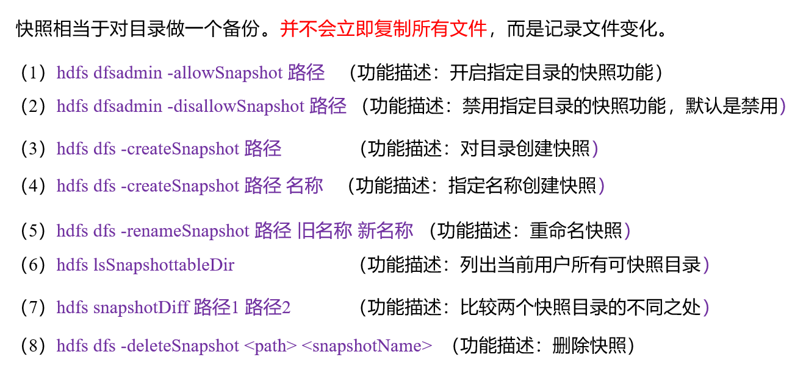

   2. 案例

      ```txt
      （1）开启/禁用指定目录的快照功能
      [lan@hadoop102 hadoop-2.7.2]$ hdfs dfsadmin -allowSnapshot /user/lan/input
      
      [lan@hadoop102 hadoop-2.7.2]$ hdfs dfsadmin -disallowSnapshot /user/lan/input
      	（2）对目录创建快照
      [lan@hadoop102 hadoop-2.7.2]$ hdfs dfs -createSnapshot /user/lan/input
      通过web访问hdfs://hadoop102:50070/user/lan/input/.snapshot/s…..// 快照和源文件使用相同数据
      [lan@hadoop102 hadoop-2.7.2]$ hdfs dfs -lsr /user/lan/input/.snapshot/
      	（3）指定名称创建快照
      [lan@hadoop102 hadoop-2.7.2]$ hdfs dfs -createSnapshot /user/lan/input  miao170508
      	（4）重命名快照
      [lan@hadoop102 hadoop-2.7.2]$ hdfs dfs -renameSnapshot /user/lan/input/  miao170508 lan170508
      	（5）列出当前用户所有可快照目录
      [lan@hadoop102 hadoop-2.7.2]$ hdfs lsSnapshottableDir
      	（6）比较两个快照目录的不同之处
      [lan@hadoop102 hadoop-2.7.2]$ hdfs snapshotDiff
       /user/lan/input/  .  .snapshot/lan170508	
      	（7）恢复快照
      [lan@hadoop102 hadoop-2.7.2]$ hdfs dfs -cp
      /user/lan/input/.snapshot/s20170708-134303.027 /user
      
      ```

      

### HDFS  HA 高可用

#### HA概述

1. 所谓HA ，即高可用（7 * 24小时不中断服务）
2. 实现高可用最关键的策略是**消除单点故障**，HA严格来说应该分成各个HA机制：HDFS的HA 和YARN 的HA


#### HDFS-HA工作机制

通过双NameNode消除单点故障


##### HDFS-HA 工作要点

1. 元数据管理方式需要改变

   ```txt
   内存中各自保存一份元数据；
   Edits日志只有Active状态的NameNode节点可以做写操作；
   两个NameNode都可以读取Edits；
   共享的Edits放在一个共享存储中管理（qjournal和NFS两个主流实现）；
   
   ```

2. 需要一个状态管理功能模块

   实现了一个zkfailover，常驻在每一个namenode所在的节点，每一个zkfailover负责监控自己所在NameNode节点，利用zk进行状态标识，当需要进行状态切换时，由zkfailover来负责切换，切换时需要防止brain split现象的发生。

3. 必须保证两个NameNode之间能够ssh无密码登录

4. 隔离（Fence），即同一时刻仅仅有一个NameNode对外提供服务


##### HDFS-HA 自动故障转移工作机制

通过添加Zookeeper 和ZKFailoverController进程，zook是维护少量协调数据，通知客户端这些数据的改变和监视这些客户端故障的高可用服务。HA的自动故障转移依赖于Zookeeper 的一下功能：

- 故障检测 ： 集群中的每个NameNode在Zookeeper中维护一个持久会话，如果机器崩溃，ZooKeeper中的会话将终止，ZooKeeper通知另一个NameNode需要触发故障转移。
- **现役NameNode****选择：ZooKeeper提供了一个简单的机制用于唯一的选择一个节点为active状态。如果目前现役NameNode崩溃，另一个节点可能从ZooKeeper获得特殊的排外锁以表明它应该成为现役NameNode。


ZKFC 是自动故障转移中的另一个新组件，是Zookeeper 的客户端，也简史和管理Namenode的状态，每个运行Namenode的主机也隐形了一个ZKFC进程，并负责：

- **健康监测：**ZKFC使用一个健康检查命令定期地ping与之在相同主机的NameNode，只要该NameNode及时地回复健康状态，ZKFC认为该节点是健康的。如果该节点崩溃，冻结或进入不健康状态，健康监测器标识该节点为非健康的。
- **ZooKeeper**会话管理：当本地NameNode是健康的，ZKFC保持一个在ZooKeeper中打开的会话。如果本地NameNode处于active状态，ZKFC也保持一个特殊的znode锁，该锁使用了ZooKeeper对短暂节点的支持，如果会话终止，锁节点将自动删除。
- **基于ZooKeeper**的选择：如果本地NameNode是健康的，且ZKFC发现没有其它的节点当前持有znode锁，它将为自己获取该锁。如果成功，则它已经赢得了选择，并负责运行故障转移进程以使它的本地NameNode为Active。故障转移进程与前面描述的手动故障转移相似，首先如果必要保护之前的现役NameNode，然后本地NameNode转换为Active状态。

   

   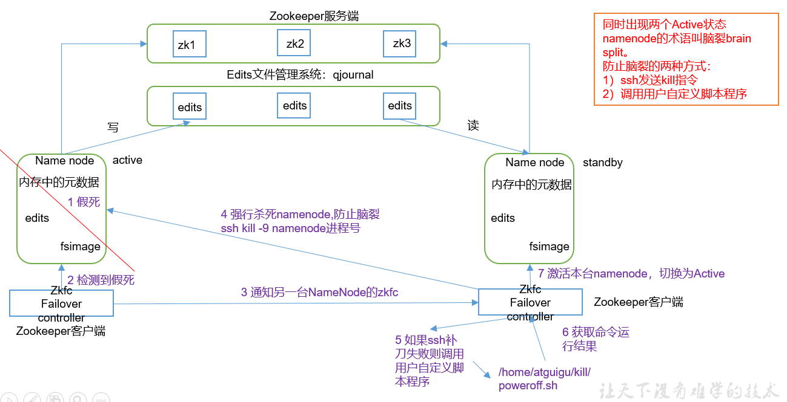

#### HDFS-HA集群配置

##### 环境准备

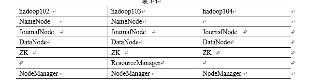

##### 配置Zookeeper集群

1. 集群规划

   在三个结点服务器部署Zookeeper

2. 解压安装

   1. 解压Zookeeper安装包到目录下
   2. 在 该目录下，创建 zkData 目录 mkdir -p zkData
   3. 重命名/opt/module/zookeeper-3.4.10/conf这个目录下的zoo_sample.cfg为zoo.cfg

3. 配置zoo.cfg文件

   ```txt
   （1）具体配置
   dataDir=/opt/module/zookeeper-3.4.10/zkData
   	增加如下配置
   #######################cluster##########################
   server.2=hadoop102:2888:3888
   server.3=hadoop103:2888:3888
   server.4=hadoop104:2888:3888
   （2）配置参数解读
   Server.A=B:C:D。
   A是一个数字，表示这个是第几号服务器；
   B是这个服务器的IP地址；
   C是这个服务器与集群中的Leader服务器交换信息的端口；
   D是万一集群中的Leader服务器挂了，需要一个端口来重新进行选举，选出一个新的Leader，而这个端口就是用来执行选举时服务器相互通信的端口。
   集群模式下配置一个文件myid，这个文件在dataDir目录下，这个文件里面有一个数据就是A的值，Zookeeper启动时读取此文件，拿到里面的数据与zoo.cfg里面的配置信息比较从而判断到底是哪个server。
   
   ```

4. 集群操作

   1. 在/opt/module/zookeeper-3.4.10/zkData目录下创建一个myid的文件

   2. 编辑myid文件

      ```txt
      添加与server对应的编号，如2
      ```

   3. 拷贝配置好的Zookeeper到其他服务器上

      ```txt
      scp -r zookeeper-3.4.10/ root@hadoop103.atguigu.com:/opt/app/
      scp -r zookeeper-3.4.10/ root@hadoop104.atguigu.com:/opt/app/
      并分别修改myid文件中内容为3、4
      ```

   4. 启动Zookeeper

      ```txt
      bin/zkServer.sh start
      ```

   5. 查看状态

      ```txt
      bin/zkServer.sh status
      JMX enabled by default
      
      ```

      

##### 配置HDFS-HA 集群 

1. 在opt目录下，创建一个ha文件夹

2. 将/opt/app/下的 hadoop-2.7.2拷贝到/opt/ha目录下

3. 配置hadoop-env.sh

4. 配置 core-site.xml

   ```txt
   <configuration>
   <!-- 把两个NameNode）的地址组装成一个集群mycluster -->
   		<property>
   			<name>fs.defaultFS</name>
           	<value>hdfs://mycluster</value>
   		</property>
   
   		<!-- 指定hadoop运行时产生文件的存储目录 -->
   		<property>
   			<name>hadoop.tmp.dir</name>
   			<value>/opt/ha/hadoop-2.7.2/data/tmp</value>
   		</property>
   </configuration>
   
   ```

5. 配置hdfs-site.xml

   ```txt
   
   <configuration>
   	<!-- 完全分布式集群名称 -->
   	<property>
   		<name>dfs.nameservices</name>
   		<value>mycluster</value>
   	</property>
   
   	<!-- 集群中NameNode节点都有哪些 -->
   	<property>
   		<name>dfs.ha.namenodes.mycluster</name>
   		<value>nn1,nn2</value>
   	</property>
   
   	<!-- nn1的RPC通信地址 -->
   	<property>
   		<name>dfs.namenode.rpc-address.mycluster.nn1</name>
   		<value>hadoop102:9000</value>
   	</property>
   
   	<!-- nn2的RPC通信地址 -->
   	<property>
   		<name>dfs.namenode.rpc-address.mycluster.nn2</name>
   		<value>hadoop103:9000</value>
   	</property>
   
   	<!-- nn1的http通信地址 -->
   	<property>
   		<name>dfs.namenode.http-address.mycluster.nn1</name>
   		<value>hadoop102:50070</value>
   	</property>
   
   	<!-- nn2的http通信地址 -->
   	<property>
   		<name>dfs.namenode.http-address.mycluster.nn2</name>
   		<value>hadoop103:50070</value>
   	</property>
   
   	<!-- 指定NameNode元数据在JournalNode上的存放位置 -->
   	<property>
   		<name>dfs.namenode.shared.edits.dir</name>
   	<value>qjournal://hadoop102:8485;hadoop103:8485;hadoop104:8485/mycluster</value>
   	</property>
   
   	<!-- 配置隔离机制，即同一时刻只能有一台服务器对外响应 -->
   	<property>
   		<name>dfs.ha.fencing.methods</name>
   		<value>sshfence</value>
   	</property>
   
   	<!-- 使用隔离机制时需要ssh无秘钥登录-->
   	<property>
   		<name>dfs.ha.fencing.ssh.private-key-files</name>
   		<value>/home/atguigu/.ssh/id_rsa</value>
   	</property>
   
   	<!-- 声明journalnode服务器存储目录-->
   	<property>
   		<name>dfs.journalnode.edits.dir</name>
   		<value>/opt/ha/hadoop-2.7.2/data/jn</value>
   	</property>
   
   	<!-- 关闭权限检查-->
   	<property>
   		<name>dfs.permissions.enable</name>
   		<value>false</value>
   	</property>
   
   	<!-- 访问代理类：client，mycluster，active配置失败自动切换实现方式-->
   	<property>
     		<name>dfs.client.failover.proxy.provider.mycluster</name>
   	<value>org.apache.hadoop.hdfs.server.namenode.ha.ConfiguredFailoverProxyProvider</value>
   	</property>
   </configuration>
   
   ```

6. 拷贝好的hadoop环境到其他节点

##### 启动HDFS-HA集群

```txt
1.	在各个JournalNode节点上，输入以下命令启动journalnode服务
	sbin/hadoop-daemon.sh start journalnode
2.	在[nn1]上，对其进行格式化，并启动
	bin/hdfs namenode -format
	sbin/hadoop-daemon.sh start namenode
3.	在[nn2]上，同步nn1的元数据信息
	bin/hdfs namenode -bootstrapStandby
5.  web查看
4.	启动[nn2]
	sbin/hadoop-daemon.sh start namenode
6.	在[nn1]上，启动所有datanode
	sbin/hadoop-daemons.sh start datanode
7.	将[nn1]切换为Active
	bin/hdfs haadmin -transitionToActive nn1
7.	查看是否Active
	bin/hdfs haadmin -getServiceState nn1


```

#### YARN-HA 配置

##### 工作机制

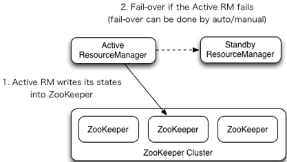

##### 配置YARN-HA集群

1. 环境准备
   1. 修改IP
   2. 修改主机名及主机名和IP地址的映射
   3. 关闭防火墙
   4. ssh免密登录
   5. 安装JDK，配置环境变量等
   6. 配置Zookeeper集群

2. 规划集群

   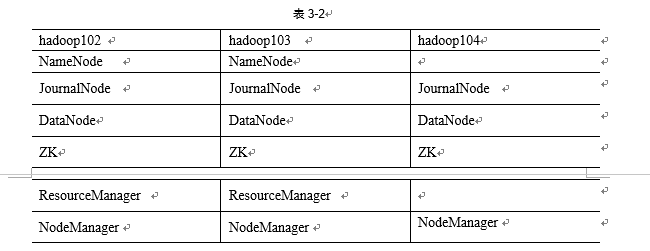

3. 具体配置

   1. yarn-site.xml

      ```txt
      <configuration>
      
          <property>
              <name>yarn.nodemanager.aux-services</name>
              <value>mapreduce_shuffle</value>
          </property>
      
          <!--启用resourcemanager ha-->
          <property>
              <name>yarn.resourcemanager.ha.enabled</name>
              <value>true</value>
          </property>
       
          <!--声明两台resourcemanager的地址-->
          <property>
              <name>yarn.resourcemanager.cluster-id</name>
              <value>cluster-yarn1</value>
          </property>
      
          <property>
              <name>yarn.resourcemanager.ha.rm-ids</name>
              <value>rm1,rm2</value>
          </property>
      
          <property>
              <name>yarn.resourcemanager.hostname.rm1</name>
              <value>hadoop102</value>
          </property>
      
          <property>
              <name>yarn.resourcemanager.hostname.rm2</name>
              <value>hadoop103</value>
          </property>
       
          <!--指定zookeeper集群的地址--> 
          <property>
              <name>yarn.resourcemanager.zk-address</name>
              <value>hadoop102:2181,hadoop103:2181,hadoop104:2181</value>
          </property>
      
          <!--启用自动恢复--> 
          <property>
              <name>yarn.resourcemanager.recovery.enabled</name>
              <value>true</value>
          </property>
       
          <!--指定resourcemanager的状态信息存储在zookeeper集群--> 
          <property>
              <name>yarn.resourcemanager.store.class</name>     <value>org.apache.hadoop.yarn.server.resourcemanager.recovery.ZKRMStateStore</value>
      </property>
      
      </configuration>
      
      ```

   2. 同步更新其他节点的配置信息

4. 启动hdfs

   ```txt
   （1）在各个JournalNode节点上，输入以下命令启动journalnode服务：
   sbin/hadoop-daemon.sh start journalnode
   （2）在[nn1]上，对其进行格式化，并启动：
   bin/hdfs namenode -format
   sbin/hadoop-daemon.sh start namenode
   （3）在[nn2]上，同步nn1的元数据信息：
   bin/hdfs namenode -bootstrapStandby
   （4）启动[nn2]：
   sbin/hadoop-daemon.sh start namenode
   （5）启动所有DataNode
   sbin/hadoop-daemons.sh start datanode
   （6）将[nn1]切换为Active
   bin/hdfs haadmin -transitionToActive nn1
   
   ```

5. 启动yarn

   ```txt
   （1）在hadoop102中执行：
   sbin/start-yarn.sh
   （2）在hadoop103中执行：
   sbin/yarn-daemon.sh start resourcemanager
   （3）查看服务状态，如图3-24所示
   bin/yarn rmadmin -getServiceState rm1
   
   ```

   