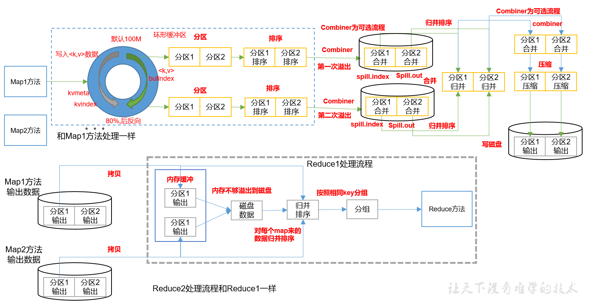

# MapRuce 入梦

## 第一章： MapReduce 概述

### 1.1 MapReduce 定义

> mapReduce 是一个==分布式运算程序的编程框架==，是用户开发“基于hadoop的数据分析应用的”核心框架
>
> 核心功能  是将==用户编写的业务逻辑代码==和==自带默认组件==整合成一个完整的==分布式运算程序==，并发运行在一个hadoop集群中。

### 1.2 mapReduce 优缺点

#### 优点

1. mapreduce 易于编程

   > ==简单的是实现一些借口，就可以完成一个分布式程序，==这个分布式程序可以分布到大量廉价的机器上运行 ，就是相当于写一个串行的程序一样

2. 良好的扩展性

   > 当计算资源不能得到满足的时候，就增加机器就完事了

3. 高容错性

   > 其中一台机器挂掉的话，它可以把上面的计算任务转移到另外一个结点上运行，不至于任务运行失败 

4. 适合PB级以上海量数据的离线处理 

#### 缺点

1. 不擅长实时计算

2. 不擅长流式计算

   > 流式计算的输入数据是动态的，而mapreduce 是数据数据是静态的

3. 不擅长DAG（有向图）计算

   > 多个应用 程序存在依赖关系，后一个应用程序的输入为前一个的输出，在这种情况下，MapReduce并不是不能做，而是使用后，==每个MapReduce作业的输出结果都会写入到磁盘，会造成大量的磁盘IO，导致性能非常的低下==

### 1.3  MapReduce 核心思想

> 案例需求 ： 统计其中每一个单词出现的总次数（查询结果：a-p一个文件，q-z一个文件）


### 1.4 MapReduce 进程

一个完整的MapReduce 程序在分布式运行时有三类实例进程：

1. MrAppMaster ： 负责整个程序的过程调度及状态协调
2. MapTask ： 负责Map阶段的整个数据处理流程
3. ReduceTask ： 负责Reduce 阶段的整个处理流程

### 1.5 官方的wordCount 的源码

### 1.6 常用的数据序列化类型


### 1.7 MapReduce 编程规范

#### mapper 阶段

1. 用户自定义的mapper 要继承自己的类
2. mapper 的输入数据是KV对的形式（KV类型可自定义）
3. mapper 中的业务逻辑写在map（）方法中
4. mapper 的输出数据是KV对的形式（可自定义）
5. ==map()方法（MapTASk）对每一个<K,V>调用一次==

#### Reducer 阶段

1. 用户自定义的mapper 要继承自己的类
2. Reducer的输入数据类型对应Mapper的输出数据类型，也是KV
3. Reducer的业务逻辑写在reduce方法中
4. ==ReduceTask进程对每一组相同的k的<k,V>组调用一次的reduce方法==

#### Driver 阶段

相当于YARN集群的客户端，用于提交我们整个程序到YARN集群，提交的是封装了MapReduce程序相关运行参数的job对象


### 1.8 wordCount 案例实操

> 统计单词出现次数，空格为分隔符

1. 新增maven 项目，添加依赖

   ```xml
     <dependencies>
           <dependency>
               <groupId>junit</groupId>
               <artifactId>junit</artifactId>
               <version>4.13</version>
               <scope>test</scope>
           </dependency>
           <dependency>
               <groupId>org.apache.logging.log4j</groupId>
               <artifactId>log4j</artifactId>
               <version>2.13.3</version>
               <type>pom</type>
           </dependency>
           <dependency>
               <groupId>org.apache.hadoop</groupId>
               <artifactId>hadoop-common</artifactId>
               <version>3.3.0</version>
           </dependency>
           <dependency>
               <groupId>org.apache.hadoop</groupId>
               <artifactId>hadoop-client</artifactId>
               <version>3.3.0</version>
           </dependency>
           <dependency>
               <groupId>org.apache.hadoop</groupId>
               <artifactId>hadoop-hdfs</artifactId>
               <version>3.3.0</version>
           </dependency>
       </dependencies>
   ```

2. log4j 输出

   ```properties
   log4j.rootLogger=INFO, stdout
   log4j.appender.stdout=org.apache.log4j.ConsoleAppender
   log4j.appender.stdout.layout=org.apache.log4j.PatternLayout
   log4j.appender.stdout.layout.ConversionPattern=%d %p [%c] - %m%n
   log4j.appender.logfile=org.apache.log4j.FileAppender
   log4j.appender.logfile.File=target/spring.log
   log4j.appender.logfile.layout=org.apache.log4j.PatternLayout
   log4j.appender.logfile.layout.ConversionPattern=%d %p [%c] - %m%n
   
   ```

3. 编写mapper类

   ```java
   package com.example.mr.wordcount;
   
   import org.apache.hadoop.io.IntWritable;
   import org.apache.hadoop.io.LongWritable;
   import org.apache.hadoop.io.Text;
   import org.apache.hadoop.mapreduce.Mapper;
   
   import java.io.IOException;
   
   /**
    * Created by IntelliJ IDEA.
    *
    * @author Firewine
    * @version 1.0
    * @ProgramName: WordcountMapper
    * @Create 2020/10/31
    * @Description: map 阶段
    *
    *  keyin 输入数据的key
    *  valuein 输入数据的value
    *   keyout 输出数据的类型
    *   valueOUT 输出的数据的value类型
    */
   
   public class WordCountMapper extends Mapper<LongWritable, Text, Text, IntWritable> {
       Text k = new Text();
       IntWritable v = new IntWritable(1);
   
       @Override
       protected void map(LongWritable key, Text value, Context context) throws IOException, InterruptedException {
           //    ss ss
           //    1. 获取一行
           String line = value.toString();
           //    切割单词
           String[] words = line.split(" ");
   
           //    循环写出
           for (String word : words) {
   
               k.set(word);
               context.write(k, v);
           }
       }
   }
   
   ```

4. 编写reducer类

   ```java
   package com.example.mr.wordcount;
   
   import org.apache.hadoop.io.IntWritable;
   import org.apache.hadoop.io.Text;
   import org.apache.hadoop.mapreduce.Reducer;
   
   import java.io.IOException;
   
   /**
    * Created by IntelliJ IDEA.
    *
    * @author Firewine
    * @version 1.0
    * @ProgramName: WordCountReducer
    * @Create 2020/11/1
    * @Description:
    *
    * keyin ,valueIn map阶段输出的key和value
    */
   public class WordCountReducer extends Reducer<Text, IntWritable,Text,IntWritable> {
       IntWritable v = new IntWritable();
       @Override
       protected void reduce(Text key, Iterable<IntWritable> values, Context context) throws IOException, InterruptedException {
       //    ss 1
       //    ss 1
       //    1. 累加求和
           int sum= 0 ;
           for(IntWritable value:values){
               sum += value.get();
           }
           v.set(sum);
           //    2. 写出ss 2
           context.write(key,v);
       }
   }
   ```

5. 编写driver类

   ```java
   package com.example.mr.wordcount;
   
   import org.apache.hadoop.conf.Configuration;
   import org.apache.hadoop.fs.Path;
   import org.apache.hadoop.io.IntWritable;
   import org.apache.hadoop.io.Text;
   import org.apache.hadoop.mapreduce.Job;
   import org.apache.hadoop.mapreduce.lib.input.FileInputFormat;
   import org.apache.hadoop.mapreduce.lib.output.FileOutputFormat;
   
   import java.io.IOException;
   
   /**
    * Created by IntelliJ IDEA.
    *
    * @author Firewine
    * @version 1.0
    * @ProgramName: WordCountDriver
    * @Create 2020/11/1
    * @Description:
    */
   public class WordCountDriver {
   
     public static void main(String[] args) throws IOException, ClassNotFoundException, InterruptedException {
   
       args = new String[]{"F:/wordCount.txt","F:/demo"};
       Configuration conf = new Configuration();
       //    1. 获取job 对象
       Job job = Job.getInstance();
       //    2. 设置jar存储位置
       job.setJarByClass(WordCountDriver.class);
       //    3. 关联map和reduce类
       job.setMapperClass(WordCountMapper.class);
       job.setReducerClass(WordCountReducer.class);
       //    4. 设置mapper 阶段输出数组的key和value类型
       job.setMapOutputKeyClass(Text.class);
       job.setMapOutputValueClass(IntWritable.class);
   
       //    5. 设置最终数据输出的key 和value 类型
       job.setOutputKeyClass(Text.class);
       job.setOutputValueClass(IntWritable.class);
       //    6. 设置输入路径和输出路径
       FileInputFormat.setInputPaths(job,new Path(args[0]));
       FileOutputFormat.setOutputPath(job,new Path(args[1]));
       //    7. 调教job
       // job.submit();
       boolean result = job.waitForCompletion(true);
       System.exit(result ? 0 : 1);
     }
   }
   ```

6. 打包

   ```xml
     <build>
           <plugins>
               <plugin>
                   <artifactId>maven-compiler-plugin</artifactId>
                   <version>3.8.1</version>
                   <configuration>
                       <source>11</source>
                       <target>11</target>
                   </configuration>
               </plugin>
               <plugin>
                   <artifactId>maven-assembly-plugin</artifactId>
                   <configuration>
                       <descriptorRefs>
                           <descriptorRef>jar-with-dependencies</descriptorRef>
                       </descriptorRefs>
                       <archive>
                           <manifest>
                               <mainClass>com.example.mr.wordcount.WordCountDriver</mainClass>
                           </manifest>
                       </archive>
                   </configuration>
                   <executions>
                       <execution>
                           <id>make-assembly</id>
                           <phase>package</phase>
                           <goals>
                               <goal>single</goal>
                           </goals>
                       </execution>
                   </executions>
               </plugin>
           </plugins>
       </build>
       <properties>
           <!--编译编码-->
           <project.build.sourceEncoding>UTF-8</project.build.sourceEncoding>
       </properties>
   ```

7. 执行

   ```shell
   hadoop jar wc.jar com.example.mr.wordcount.WordCountDriver inputpath outPath
   ```

## 第二章： Hadoop序列化

### 2.1 序列号概述

#### 什么是序列化

> 序列化就是把==内存中的对象，转换成字节序列==，（或其他数据传输协议）以便存储到磁盘和网络传输

> 反序列化就是将收到的字节序列（或其他数据传输协议）或者是==磁盘的持久化数据，转换成内存中对象==

#### 为什么要序列化

> 一般来说，活的对象只生存在内存里，关机断电就没有了，而且活的对象只能由本地的进程使用，不能被发送到网络上的另外一台计算。然而==序列化可以存储“活的”对象，可以将活的对象发送到远程计算机==

#### 为什么不用java序列化

> java 序列化是一个重量级序列化框架Serializable，会增加很多额外的数据，，
>
> hadoop 开发序列化机制Writable

##### hadoop序列化特点：

1. 紧凑 ： 高效实用存储空间
2. 快速：读写数据的额外开销小
3. 可扩展 ： 可以随着通信协议升级而升级
4. 互操作性 ： 多语言交互

### 2.2自定义bean对象实现序列化接口（Writable）

#### 具体实现bean独享序列化步骤如下7步：

1. 必须实现Writable 接口

2. 反序列化时，需要反射调用空参构造函数， 

3. 重写序列化方法

   ```java 
   @Override
   public void write(DataOutput out) throws IOException {
   	out.writeLong(upFlow);
   	out.writeLong(downFlow);
   	out.writeLong(sumFlow);
   }
   ```

4. 重写反序列化方法

   ```java 
   @Override
   public void readFields(DataInput in) throws IOException {
   	upFlow = in.readLong();
   	downFlow = in.readLong();
   	sumFlow = in.readLong();
   }
   ```

5. ==注意反序列化的顺序和序列化的顺序完全一致==

6. 要想把结果显示在文件中，需要重写toString()，可用”\t”分开，方便后续用。

7. 如果需要将自定义的bean放在key中传输，则还需要实现Comparable接口，因为MapReduce框中的Shuffle过程要求对key必须能排序。详见后面排序案例。

   ```java
   @Override
   public int compareTo(FlowBean o) {
   	// 倒序排列，从大到小
   	return this.sumFlow > o.getSumFlow() ? -1 : 1;
   }
   ```

### 2.3 序列化实操

#### 1. 需求

统计每一个手机号耗费的总上行流量，下行流量，总流量


#### 2. 实操

1. mapper 类

   ```java
   package com.example.mr.flowsum;
   
   import org.apache.hadoop.io.LongWritable;
   import org.apache.hadoop.io.Text;
   import org.apache.hadoop.mapreduce.Mapper;
   
   import java.io.IOException;
   
   /**
    * Created by IntelliJ IDEA.
    *
    * @author Firewine
    * @version 1.0 @ProgramName: FlowCountMapper @Create 2020/11/2 @Description:
    */
   public class FlowCountMapper extends Mapper<LongWritable, Text, Text, FlowBean> {
     Text k = new Text();
     FlowBean v = new FlowBean();
   
     @Override
     protected void map(LongWritable key, Text value, Context context)
         throws IOException, InterruptedException {
       // 7  phone  ip  1116 954  200
       //    1. 获取一行
       String line = value.toString();
   
       //    2. 切割\t
       String[] fields = line.split("\t");
   
       //    3. 封装对象
       //封装手机号
       k.set(fields[1]);
   
       long upFlow =Long.parseLong( fields[fields.length -3]);
       long downFlow =Long.parseLong( fields[fields.length -2]);
       v.setUpFlow(upFlow);
       v.setDownFlow(downFlow);
       // v.set(upFlow,downFlow);
   
       //    5. 写出
       context.write(k,v);
     }
   }
   
   ```

   

2. 序列化bean 类

   ```java
   package com.example.mr.flowsum;
   
   import org.apache.hadoop.io.Writable;
   
   import java.io.DataInput;
   import java.io.DataOutput;
   import java.io.IOException;
   
   /**
    * Created by IntelliJ IDEA.
    *
    * @author Firewine
    * @version 1.0 @ProgramName: FlowBean @Create 2020/11/2 @Description:
    */
   public class FlowBean implements Writable {
     /** 上行流量 */
     private long upFlow;
     /** 下行流量 */
     private long downFlow;
     /** 总流量 */
     private long sumFlow;
   
     /** 空参构造，为了后序反射 */
     public FlowBean() {
       super();
     }
   
     public FlowBean(long upFlow, long downFlow) {
       super();
       this.upFlow = upFlow;
       this.downFlow = downFlow;
       sumFlow = upFlow + downFlow;
     }
   
     /**
      * 序列化方法
      *
      * @param dataOutput
      * @throws IOException
      */
     @Override
     public void write(DataOutput dataOutput) throws IOException {
       dataOutput.writeLong(upFlow);
       dataOutput.writeLong(downFlow);
       dataOutput.writeLong(sumFlow);
     }
   
     /**
      * 反序列化方法
      *
      * @param dataInput
      * @throws IOException
      */
     @Override
     public void readFields(DataInput dataInput) throws IOException {
       //  必须和序列化方法顺序一致
       upFlow = dataInput.readLong();
       downFlow = dataInput.readLong();
       sumFlow = dataInput.readLong();
     }
   
     @Override
     public String toString() {
       return "FlowBean{"
           + "upFlow="
           + upFlow
           + ", downFlow="
           + downFlow
           + ", sumFlow="
           + sumFlow
           + '}';
     }
   
     public long getUpFlow() {
       return upFlow;
     }
   
     public void setUpFlow(long upFlow) {
       this.upFlow = upFlow;
     }
   
     public long getDownFlow() {
       return downFlow;
     }
   
     public void setDownFlow(long downFlow) {
       this.downFlow = downFlow;
     }
   
     public long getSumFlow() {
       return sumFlow;
     }
   
     public void setSumFlow(long sumFlow) {
       this.sumFlow = sumFlow;
     }
   
     public void set(long upFlow1, long downFlow1) {
   
      upFlow = upFlow1;
       downFlow = downFlow1;
       sumFlow = upFlow + downFlow;
     }
   }
   
   ```

   

3. reducer 类

   ```java
    package com.example.mr.flowsum;
   
   import org.apache.hadoop.io.Text;
   import org.apache.hadoop.mapreduce.Reducer;
   
   import java.io.IOException;
   
   /**
    * Created by IntelliJ IDEA.
    *
    * @author Firewine
    * @version 1.0
    * @ProgramName: FlowCountReducer
    * @Create 2020/11/2
    * @Description:
    */
   public class FlowCountReducer extends Reducer<Text,FlowBean,Text,FlowBean> {
       FlowBean v = new FlowBean();
       @Override
       protected void reduce(Text key, Iterable<FlowBean> values, Context context) throws IOException, InterruptedException {
   
           long sum_upFlow = 0;
           long sum_downFlow = 0;
       //    1. 累加求和
           for (FlowBean flowBean : values){
               sum_upFlow += flowBean.getUpFlow();
               sum_downFlow += flowBean.getDownFlow();
           }
   
           v.set(sum_upFlow,sum_downFlow);
           //    2. 写出
           context.write(key,v);
       }
   }
   
   ```

   

4. driver 类

   ```java
   package com.example.mr.flowsum;
   
   import org.apache.hadoop.conf.Configuration;
   import org.apache.hadoop.fs.Path;
   import org.apache.hadoop.io.Text;
   import org.apache.hadoop.mapreduce.Job;
   import org.apache.hadoop.mapreduce.lib.input.FileInputFormat;
   import org.apache.hadoop.mapreduce.lib.output.FileOutputFormat;
   
   import java.io.IOException;
   
   /**
    * Created by IntelliJ IDEA.
    *
    * @author Firewine
    * @version 1.0 @ProgramName: FlowSumDriver @Create 2020/11/2 @Description:
    */
   public class FlowSumDriver {
   
     public static void main(String[] args)
         throws IOException, ClassNotFoundException, InterruptedException {
       args = new String[] {"F:/wordCount.txt", "F:/demo"};
       Configuration conf = new Configuration();
       // 1. 获取job对象
       Job job = Job.getInstance(conf);
       //    2. 设置jar路径
       job.setJarByClass(FlowSumDriver.class);
       //    3. 关联mapper ，reducer
       job.setMapperClass(FlowCountMapper.class);
       job.setReducerClass(FlowCountReducer.class);
       //    4. 设置mapper输出的key 和value
       job.setMapOutputKeyClass(Text.class);
       job.setMapOutputValueClass(FlowBean.class);
       //    5 设置最终输出的key和value类型
       job.setOutputKeyClass(Text.class);
       job.setOutputValueClass(FlowBean.class);
       //    6 设置输入输出路径
       FileInputFormat.setInputPaths(job, new Path(args[0]));
       FileOutputFormat.setOutputPath(job, new Path(args[1]));
       //    7 调价job
       boolean result = job.waitForCompletion(true);
   
       System.exit(result ? 0 : 1);
     }
   }
   
   ```

   

## 第三章 ： MapReduce框架原理

### 3.1 InputFormat 数据输入

#### 切片与MapTask 并行度决定机制

1. 问题引出

   > MapTask 的并行度决定Map阶段的任务处理并发度，进而应用到整个job的处理速度
   >
   > 但是并不是说开的越多越好，是根据数据的大小来合适匹配

2. MapTask 并行度决定机制

   - 数据块 ： Block 是HDFS 物理上把数据分成一块一块的
   - 数据切片： 数据切片只是在逻辑上对输入进行切片，并不会在磁盘上进行切片存储

   

   

####  job 提交流程源码和切片源码详解

1. job提交流程源码详解

```java
waitForCompletion()

submit();

// 1建立连接
	connect();	
		// 1）创建提交Job的代理
		new Cluster(getConfiguration());
			// （1）判断是本地yarn还是远程
			initialize(jobTrackAddr, conf); 

// 2 提交job
submitter.submitJobInternal(Job.this, cluster)
	// 1）创建给集群提交数据的Stag路径
	Path jobStagingArea = JobSubmissionFiles.getStagingDir(cluster, conf);

	// 2）获取jobid ，并创建Job路径
	JobID jobId = submitClient.getNewJobID();

	// 3）拷贝jar包到集群
copyAndConfigureFiles(job, submitJobDir);	
	rUploader.uploadFiles(job, jobSubmitDir);

// 4）计算切片，生成切片规划文件
writeSplits(job, submitJobDir);
		maps = writeNewSplits(job, jobSubmitDir);
		input.getSplits(job);

// 5）向Stag路径写XML配置文件
writeConf(conf, submitJobFile);
	conf.writeXml(out);

// 6）提交Job,返回提交状态
status = submitClient.submitJob(jobId, submitJobDir.toString(), job.getCredentials());

```


2. FileInputFormat 切片源码解析(input.getSplits(job))

   

   

#### FileInputFormat 切片机制


####  CombineTextInoutFormat 切片机制

> 框架默认的TextInputFormat 切片机制是对任务按文件规划切片，==不管文件多小，都会是以一个单独的切片== 都会交给一个MapTask。这样如果有大量小文件，就会产生大量的MapTask，处理效率极其低下。

1. 应用场景 

   CombineTextInputFormat 用于小文件过多的场景，它可以将多个小文件从逻辑上规划到一个切片中，这样，多个小文件就可以交给一个MapTask处理

2. 虚拟存储切片最大值设置

   CombineTextInputFormat.SetmaxInputSplitSize(job,4194304);// 4m

   **虚拟存储切片最大值设置最好根据实际的小文件大小情况来设置具体的值**

3. CombineTextInputForamt 切片机制

   

   - 虚拟存储过程

     将输入目录下所有文件大小，依次和设置的setMaxInputSplitSize值比较，如果不大于设置的最大值，逻辑上划分一个块。如果输入文件大于设置的最大值且大于两倍，那么以最大值切割一块；当剩余数据大小超过设置的最大值且不大于最大值2倍，此时将文件均分成2个虚拟存储块（防止出现太小切片）。

#### CombineTextInputFormat案例实操

- 将输入的大量小文件合并成一个切片统一处理

- 在wordcount 的wordDriver 中增加如下代码，运行程序，观察运行的切片格式为3 

  - inputForamt

    ```java
    // 如果不设置InputFormat，它默认用的是TextInputFormat.class
    job.setInputFormatClass(CombineTextInputFormat.class);
    
    //虚拟存储切片最大值设置4m
    CombineTextInputFormat.setMaxInputSplitSize(job, 4194304);
    
    ```

    运行结果3个切片

  - 修改代码

    ```java
    // 如果不设置InputFormat，它默认用的是TextInputFormat.class
    job.setInputFormatClass(CombineTextInputFormat.class);
    
    //虚拟存储切片最大值设置20m
    CombineTextInputFormat.setMaxInputSplitSize(job, 20971520)
    
    ```

    运行结果为1个切片

#### FileInputForamt 实现类 

> 前情提要 ： 针对不同的数据类型，mapreduce 是如何读取这些数据的呢

> 常见的接口实现类包括： TextInputForamt 、 keyValueTextInputFormat  、 NineInputFormat 、 CombineTextInputForamt 和自定义 InputForamt 等

##### TextInputForamt

> 是默认的FileInputFormat 实现类，按行读取每条记录，==键是存储改行在整个文件中的起始字节偏移量，LongWitable类型，值是这行的内容，不包括任何终止符（换行符或回车符），Text类型 

##### keyValueTextInputForamt

> 每一行均为一条记录，被分隔符分割为key，value。可以通过在驱动类中设置==conf.set(keyVlaueLineRecordReader.KEY_VALUE_SEPERATOR,"\t")== 来设定分隔符。默认分隔符是tab。

```txt
line1 ——>  ricd  learning form
```

代码：

- mapper

  ```java
  package com.example.mr.kv;
  
  import org.apache.hadoop.io.IntWritable;
  import org.apache.hadoop.io.LongWritable;
  import org.apache.hadoop.io.Text;
  import org.apache.hadoop.mapreduce.Mapper;
  
  import java.io.IOException;
  
  /**
   * Created by IntelliJ IDEA.
   *
   * @author Firewine
   * @version 1.0 @ProgramName: KvTextMapper @Create 2020/11/7 @Description: bangzhang ni hao
   *     <bangzhang ,1
   */
  public class KvTextMapper extends Mapper<Text, Text, Text, LongWritable> {
  
      /**
       * 设置value
       */
      LongWritable v = new LongWritable(1);
  
      @Override
      protected void map(Text key, Text value, Context context) throws IOException, InterruptedException {
  
      //    1. 封装对象
      //    2. 写出
          context.write(key,v);
      }
  }
  
  ```

- reducer

  ```java
  package com.example.mr.kv;
  
  import org.apache.hadoop.io.IntWritable;
  import org.apache.hadoop.io.Text;
  import org.apache.hadoop.mapreduce.Reducer;
  
  import java.io.IOException;
  
  /**
   * Created by IntelliJ IDEA.
   *
   * @author Firewine
   * @version 1.0 @ProgramName: KvTextReducer @Create 2020/11/7 @Description:
   */
  public class KvTextReducer extends Reducer<Text, IntWritable, Text, IntWritable> {
    IntWritable v = new IntWritable();
  
    @Override
    protected void reduce(Text key, Iterable<IntWritable> values, Context context)
        throws IOException, InterruptedException {
  
      //    1. 累加求和
      int sum = 0;
      for (IntWritable value : values) {
        sum += value.get();
      }
      v.set(sum);
  
      //    2. 写出
      context.write(key, v);
    }
  }
  
  ```

- driver

  ```java
  package com.example.mr.kv;
  
  import org.apache.hadoop.conf.Configuration;
  import org.apache.hadoop.fs.Path;
  import org.apache.hadoop.io.IntWritable;
  import org.apache.hadoop.io.Text;
  
  import org.apache.hadoop.mapreduce.Job;
  import org.apache.hadoop.mapreduce.lib.input.FileInputFormat;
  import org.apache.hadoop.mapreduce.lib.input.KeyValueLineRecordReader;
  import org.apache.hadoop.mapreduce.lib.input.KeyValueTextInputFormat;
  import org.apache.hadoop.mapreduce.lib.output.FileOutputFormat;
  
  import java.io.IOException;
  
  /**
   * Created by IntelliJ IDEA.
   *
   * @author Firewine
   * @version 1.0 @ProgramName: KvTextDriver @Create 2020/11/7 @Description:
   */
  public class KvTextDriver {
  
    public static void main(String[] args)
        throws IOException, ClassNotFoundException, InterruptedException {
  
      args = new String[]{"demo",""};
      Configuration conf = new Configuration();
      conf.set(KeyValueLineRecordReader.KEY_VALUE_SEPARATOR, "  ");
  
      // 1. 获取job 对象
      Job job = Job.getInstance(conf);
      //  2. 设置jar 存储路径
      job.setJarByClass(KvTextDriver.class);
      //  3. 管理mapper 和reduce 类
      job.setMapperClass(KvTextMapper.class);
      job.setReducerClass(KvTextReducer.class);
      //  4. 设置mapper 输出的key和value 类型
      job.setMapOutputKeyClass(Text.class);
      job.setMapOutputValueClass(IntWritable.class);
      //  5. 设置最终输出的key 和value
      job.setOutputKeyClass(Text.class);
      job.setOutputValueClass(IntWritable.class);
  
      job.setInputFormatClass(KeyValueTextInputFormat.class);
      //  6. 设置输入输出路径
      FileInputFormat.setInputPaths(job, new Path(args[0]));
      FileOutputFormat.setOutputPath(job, new Path(args[1]));
      //  7. 提交job
      boolean result = job.waitForCompletion(true);
      System.exit(result? 0 : 1);
    }
  }
  
  ```

  

##### NLineInputFormat

> 代表每个map 进程处理的InputSplit 不再按Block块去划分，而是按照NlineInputForamt指定的行数N来划分。即输入文件的总行数/N = 切片数， 如果不整除，切片数 = 商 + 1


- 使用案例 

- mapper

  ```java
  package com.example.mr.nline;
  
  import org.apache.hadoop.io.IntWritable;
  import org.apache.hadoop.io.LongWritable;
  import org.apache.hadoop.io.Text;
  import org.apache.hadoop.mapreduce.Mapper;
  
  import java.io.IOException;
  
  /**
   * Created by IntelliJ IDEA.
   *
   * @author Firewine
   * @version 1.0 @ProgramName: NlineMapper @Create 2020/11/7 @Description:
   */
  public class NlineMapper extends Mapper<LongWritable, Text, Text, IntWritable> {
  
    Text k = new Text();
    IntWritable v = new IntWritable();
  
    @Override
    protected void map(LongWritable key, Text value, Context context)
        throws IOException, InterruptedException {
  
      //    1. 获取一行
      String line = value.toString();
  
      //    切割
      String[] words = line.split(" ");
      //    循环写出
      for (String word : words) {
        k.set(word);
  
        context.write(k, v);
      }
    }
  }
  
  ```

- reducer

  ```java
  package com.example.mr.kv;
  
  import org.apache.hadoop.io.IntWritable;
  import org.apache.hadoop.io.Text;
  import org.apache.hadoop.mapreduce.Reducer;
  
  import java.io.IOException;
  
  /**
   * Created by IntelliJ IDEA.
   *
   * @author Firewine
   * @version 1.0 @ProgramName: KvTextReducer @Create 2020/11/7 @Description:
   */
  public class KvTextReducer extends Reducer<Text, IntWritable, Text, IntWritable> {
    IntWritable v = new IntWritable();
  
    @Override
    protected void reduce(Text key, Iterable<IntWritable> values, Context context)
        throws IOException, InterruptedException {
  
      //    1. 累加求和
      int sum = 0;
      for (IntWritable value : values) {
        sum += value.get();
      }
      v.set(sum);
  
      //    2. 写出
      context.write(key, v);
    }
  }
  
  ```

- driver

  ```java
  package com.example.mr.nline;
  
  import com.example.mr.kv.KvTextDriver;
  import com.example.mr.kv.KvTextMapper;
  import com.example.mr.kv.KvTextReducer;
  import org.apache.hadoop.conf.Configuration;
  import org.apache.hadoop.fs.Path;
  import org.apache.hadoop.io.IntWritable;
  import org.apache.hadoop.io.Text;
  import org.apache.hadoop.mapreduce.Job;
  import org.apache.hadoop.mapreduce.lib.input.FileInputFormat;
  import org.apache.hadoop.mapreduce.lib.input.KeyValueLineRecordReader;
  import org.apache.hadoop.mapreduce.lib.input.KeyValueTextInputFormat;
  import org.apache.hadoop.mapreduce.lib.input.NLineInputFormat;
  import org.apache.hadoop.mapreduce.lib.output.FileOutputFormat;
  
  import java.io.IOException;
  
  /**
   * Created by IntelliJ IDEA.
   *
   * @author Firewine
   * @version 1.0
   * @ProgramName: NlineDriver
   * @Create 2020/11/7
   * @Description:
   */
  public class NlineDriver {
  
      public static void main(String[] args)
              throws IOException, ClassNotFoundException, InterruptedException {
  
          args = new String[]{"demo",""};
          Configuration conf = new Configuration();
  
          // 1. 获取job 对象
          Job job = Job.getInstance(conf);
  
          NLineInputFormat.setNumLinesPerSplit(job,3);
          job.setInputFormatClass(NLineInputFormat.class);
          //  2. 设置jar 存储路径
          job.setJarByClass(NlineDriver.class);
          //  3. 管理mapper 和reduce 类
          job.setMapperClass(NlineMapper.class);
          job.setReducerClass(NlineReducer.class);
          //  4. 设置mapper 输出的key和value 类型
          job.setMapOutputKeyClass(Text.class);
          job.setMapOutputValueClass(IntWritable.class);
          //  5. 设置最终输出的key 和value
          job.setOutputKeyClass(Text.class);
          job.setOutputValueClass(IntWritable.class);
  
          //  6. 设置输入输出路径
          FileInputFormat.setInputPaths(job, new Path(args[0]));
          FileOutputFormat.setOutputPath(job, new Path(args[1]));
          //  7. 提交job
          boolean result = job.waitForCompletion(true);
          System.exit(result? 0 : 1);
      }
  }
  
  ```

  

##### 自定义Inputformat

> 自定义Inputformat 步骤如下： 
>
> 1. 自定义一个类继承FileInputForamt
> 2. 改写RecordReader，实现一次读取一个完整文件封装为KV
> 3. 在输出时使用SequenceFileOutPutForamt输出合并文件

案例实操：

1. 需求

   将多个小文件合并成一个SequenceFile文件（SequenceFile文件是Hadoop用来存储二进制形式的key-value对的文件格式），SequenceFile里面存储着多个文件，存储的形式为文件路径+名称为key，文件内容为value。

2. 需求分析

   > 1. 自定义一个类继承FileInputFormat
   >
   >    1. 重写isSplitable方法，返回false 不可切割
   >    2. 重写createRecordReader ，创建自定义的RecordReade对象，并初始化
   >
   > 2. 改写RecordReader,实现一次读取一个完整文件封装KV
   >
   >    1. 采用IO流一次读取一个文件输出到value中，因为设置了不可切片，最终把所有文件都封装到了value中
   >    2. 获取文件路径信息+名称，并设置key
   >
   > 3. 设置Driver
   >
   >    1. 设置输入的Inputforamt
   >
   >       job.setInputFormatClass(WholeFileInputFormat.class)
   >
   >    2. 设置输出的outputFormat
   >
   >       job.setOutPutFormatClass(SequenceFileOutPutFormat.class)

3. 代码

   - driver

     ```java
     package com.example.mr.inputformat;
     
     import com.example.mr.kv.KvTextDriver;
     import com.example.mr.kv.KvTextMapper;
     import com.example.mr.kv.KvTextReducer;
     import org.apache.hadoop.conf.Configuration;
     import org.apache.hadoop.fs.Path;
     import org.apache.hadoop.io.BytesWritable;
     import org.apache.hadoop.io.IntWritable;
     import org.apache.hadoop.io.Text;
     import org.apache.hadoop.mapreduce.Job;
     import org.apache.hadoop.mapreduce.lib.input.FileInputFormat;
     import org.apache.hadoop.mapreduce.lib.input.KeyValueLineRecordReader;
     import org.apache.hadoop.mapreduce.lib.input.KeyValueTextInputFormat;
     import org.apache.hadoop.mapreduce.lib.output.FileOutputFormat;
     
     import java.io.IOException;
     
     /**
      * Created by IntelliJ IDEA.
      *
      * @author Firewine
      * @version 1.0
      * @ProgramName: SequenceFileDriver
      * @Create 2020/11/8
      * @Description:
      */
     public class SequenceFileDriver {
     
       public static void main(String[] args) throws IOException, ClassNotFoundException, InterruptedException {
           // 输入输出路径需要根据自己电脑上实际的输入输出路径设置
           args = new String[] { "e:/input/inputinputformat", "e:/output1" };
     
           // 1 获取job对象
           Configuration conf = new Configuration();
           Job job = Job.getInstance(conf);
     
           // 2 设置jar包存储位置、关联自定义的mapper和reducer
           job.setJarByClass(SequenceFileDriver.class);
           job.setMapperClass(SequenceFileMapper.class);
           job.setReducerClass(SequenceFileReducer.class);
     
           // 7设置输入的inputFormat
           // job.setInputFormatClass(WholeFileInputformat.class);
     
           // 8设置输出的outputFormat
           // job.setOutputFormatClass(SequenceFileOutputFormat.class);
     
     // 3 设置map输出端的kv类型
           job.setMapOutputKeyClass(Text.class);
           job.setMapOutputValueClass(BytesWritable.class);
     
           // 4 设置最终输出端的kv类型
           job.setOutputKeyClass(Text.class);
           job.setOutputValueClass(BytesWritable.class);
     
           // 5 设置输入输出路径
           FileInputFormat.setInputPaths(job, new Path(args[0]));
           FileOutputFormat.setOutputPath(job, new Path(args[1]));
     
           // 6 提交job
           boolean result = job.waitForCompletion(true);
           System.exit(result ? 0 : 1);
       }
     
     
     }
     
     ```

   - mapper

     ```java
     package com.example.mr.inputformat;
     
     import org.apache.hadoop.io.ByteWritable;
     import org.apache.hadoop.io.Text;
     import org.apache.hadoop.mapreduce.Mapper;
     
     import java.io.IOException;
     
     /**
      * Created by IntelliJ IDEA.
      *
      * @author Firewine
      * @version 1.0 @ProgramName: SequenceFileMapper @Create 2020/11/8 @Description:
      */
     public class SequenceFileMapper extends Mapper<Text, ByteWritable, Text, ByteWritable> {
     
     
         @Override
         protected void map(Text key, ByteWritable value, Context context) throws IOException, InterruptedException {
     
             context.write(key,value);
         }
     }
     
     
     ```

   - reducer

     ```java
     package com.example.mr.inputformat;
     
     import org.apache.hadoop.io.ByteWritable;
     import org.apache.hadoop.io.BytesWritable;
     import org.apache.hadoop.io.Text;
     import org.apache.hadoop.mapreduce.Reducer;
     
     import java.io.IOException;
     
     /**
      * Created by IntelliJ IDEA.
      *
      * @author Firewine
      * @version 1.0
      * @ProgramName: SequenceFileReducer
      * @Create 2020/11/8
      * @Description:
      */
     public class SequenceFileReducer extends Reducer<Text, ByteWritable, Text, ByteWritable> {
     
         @Override
         protected void reduce(Text key, Iterable<ByteWritable> values, Context context) throws IOException, InterruptedException {
     
         //    循环写出
             for (ByteWritable value : values){
                context.write(key,value);
             }
         }
     }
     
     
     ```

   - inputForamt

     ```java
     package com.example.mr.inputformat;
     
     import org.apache.hadoop.io.ByteWritable;
     import org.apache.hadoop.io.BytesWritable;
     import org.apache.hadoop.io.Text;
     import org.apache.hadoop.mapreduce.Reducer;
     
     import java.io.IOException;
     
     /**
      * Created by IntelliJ IDEA.
      *
      * @author Firewine
      * @version 1.0
      * @ProgramName: SequenceFileReducer
      * @Create 2020/11/8
      * @Description:
      */
     public class SequenceFileReducer extends Reducer<Text, ByteWritable, Text, ByteWritable> {
     
         @Override
         protected void reduce(Text key, Iterable<ByteWritable> values, Context context) throws IOException, InterruptedException {
     
         //    循环写出
             for (ByteWritable value : values){
                context.write(key,value);
             }
         }
     }
     
     
     ```

   - recordReader

     ```java
     package com.example.mr.inputformat;
     
     import org.apache.hadoop.conf.Configuration;
     import org.apache.hadoop.fs.FSDataInputStream;
     import org.apache.hadoop.fs.FileSystem;
     import org.apache.hadoop.fs.Path;
     import org.apache.hadoop.io.BytesWritable;
     import org.apache.hadoop.io.IOUtils;
     import org.apache.hadoop.io.Text;
     import org.apache.hadoop.mapred.FileSplit;
     import org.apache.hadoop.mapreduce.InputSplit;
     import org.apache.hadoop.mapreduce.RecordReader;
     import org.apache.hadoop.mapreduce.TaskAttemptContext;
     
     import java.io.IOException;
     
     /**
      * Created by IntelliJ IDEA.
      *
      * @author Firewine
      * @version 1.0 @ProgramName: WholeRecordReader @Create 2020/11/8 @Description:
      */
     public class WholeRecordReader extends RecordReader<Text, BytesWritable> {
       FileSplit split;
       Configuration configuration;
       Text k = new Text();
       BytesWritable v = new BytesWritable();
      boolean isProgress = true;
       @Override
       public void initialize(InputSplit inputSplit, TaskAttemptContext taskAttemptContext)
           throws IOException, InterruptedException {
     
         //    初始化
         this.split = (FileSplit) inputSplit;
         configuration = taskAttemptContext.getConfiguration();
       }
     
       @Override
       public boolean nextKeyValue() throws IOException, InterruptedException {
     
         if (isProgress){
           // 核心业务逻辑
           byte[] buf = new byte[(int) split.getLength()];
           // 1. 获取fs对象
           Path path = split.getPath();
           FileSystem fs = path.getFileSystem(configuration);
     
           // 2. 获取输入流
           FSDataInputStream fis = fs.open(path);
           // 3. 拷贝
           IOUtils.readFully(fis, buf, 0, buf.length);
     
           // 4. 封装v
           v.set(buf,0,buf.length);
     
           // 5. 封装k
           k.set(path.toString());
     
           // 6  关闭资源
           IOUtils.closeStream(fis);
     
           isProgress = false;
           return true;
         }
         return false;
     
     
       }
     
       @Override
       public Text getCurrentKey() throws IOException, InterruptedException {
     
         return k;
       }
     
       @Override
       public BytesWritable getCurrentValue() throws IOException, InterruptedException {
     
         return v;
       }
     
       @Override
       public float getProgress() throws IOException, InterruptedException {
         return 0;
       }
     
       @Override
       public void close() throws IOException {}
     }
     
     ```

     


### 3.2 mapreduce 工作流程

####  工作流程一


实现字典排序的手段是快排

#### 工作流程二


### 3.3 shuffle 机制

> Map方法之后，Reduce方法之前的数据处理过程称为shuffle



#### Partition 分区

#####  默认分区

默认分区是hash分区

```java 
public class HashPartitioner<K,V> extends Partitioner<L,V> {

public int getPartition(K key,V value, int numReduceTasks) {
    return (key,hashCode() & Integer.MAX_VALUE ) % nuReduceTasks
}
```

默认分区是根据key 的hashCode 对ReduceTasks 个数取模得到的。用户没法控制那个key 存储到那个分区

##### 自定义分区


#### WritableComparable排序

> 排序是MapReduce 框架中最终要的操作之一。
>
> MatTask 和ReduceTask 均会对数据==按照key== 进行排序。该操作属于hadoop 的默认行为。==任何应用程序中的数据均会被排序，而不管逻辑上是否需要==
>
> 默认排序是按照字典顺序排序，且实现该偏序方法是快速排序

- 对于mapper 阶段

  > 对于MapTask ，它会将处理的结果暂时放到环形缓冲区汇总，当环形缓冲区使用率达到一定阈值后，在对缓冲区中的数据进行一次快速排序，并将这些有序数据溢写到磁盘上，而当数据处理完毕后，它会对磁盘上所有文件进行归并排序

- reducer 阶段

  > 它从每个MapTask 上远程拷贝相应的数据文件，如果文件大小超过一定阈值，则溢写到磁盘上，否则存储在内存中。如果磁盘上文件数目达到一定阈值，则进行一次归并排序以生成一个更大的文件； 如果内存中文件大小或者数目超过一定阈值，则进行一次合并后将数据溢写到磁盘上。当所有数据拷贝完毕后。ReduceTask统一对内存和磁盘上的所有数据进行一次归并排序。

##### 排序的分类

1. 部分排序

   MapReduce 根据输入记录的键对数据集排序。保证输出的每个文件内部有序

2. 全排序

   最终输出结果只有一个文件，且文件内部有序。实现方式是只设置一个reduceTask。但该方法在处理大型文件时效率极低，因为一台机器处理所有文件，完全丧失了MapReduce 所提供的并行架构。

3. 辅助排序

   在Reduce端对key进行分组，应用于： 在接收到的key为bean对象时，想让一个或者几个字段相同（全部字段比较不相同）的key进入到同一个reduce方法时，可以采用分组排序。

4. 二次排序

   在自定义排序过程中，如果comparTo中判断条件为两个即为二次排序

##### 自定义排序WritableComparable

原理分析

bean对象做为key传输，需要实现WritableComparable接口重写compareTo方法，就可以实现排序。

```java
@Override

public int compareTo(FlowBean o) {
  int result;
  // 按照总流量大小，倒序排列

  if (sumFlow > bean.getSumFlow()) {
   result = -1;
  }else if (sumFlow < bean.getSumFlow()) {
    result = 1;
  }else {
    result = 0;
  }
  return result;

}
```

##### 案例（全排序）

bean

```java
package com.example.mr.sort;

import org.apache.hadoop.io.WritableComparable;

import java.io.DataInput;
import java.io.DataOutput;
import java.io.IOException;

/**
 * Created by IntelliJ IDEA.
 *
 * @author Firewine
 * @version 1.0 @ProgramName: FlowBean @Create 2020/11/8 @Description:
 */
public class FlowBean implements WritableComparable<FlowBean> {

  /** 上行流量 */
  private long upFlow;
  /** 下行流量 */
  private long downFlow;
  /** 总流量 */
  private long sumFlow;

  public FlowBean() {
    super();
  }

  public FlowBean(long upFlow, long downFlow) {
    this.upFlow = upFlow;
    this.downFlow = downFlow;
    sumFlow = upFlow + downFlow;
  }

  @Override
  public String toString() {
    return "FlowBean{"
        + "upFlow="
        + upFlow
        + ", downFlow="
        + downFlow
        + ", sumFlow="
        + sumFlow
        + '}';
  }

  /**
   * 比较
   *
   * @param bean
   * @return
   */
  @Override
  public int compareTo(FlowBean bean) {
    int result;
    // 核心比较判断
    if (sumFlow > bean.getSumFlow()){
      result = -1;
    }else if (sumFlow < bean.getSumFlow()){
      result = 1;
    }else {
      result = 0;
    }
    return result;
  }

  /**
   * 序列化
   *
   * @param dataOutput
   * @throws IOException
   */
  @Override
  public void write(DataOutput dataOutput) throws IOException {
    dataOutput.writeLong(upFlow);
    dataOutput.writeLong(downFlow);
    dataOutput.writeLong(sumFlow);
  }

  /**
   * 反序列化
   *
   * @param dataInput
   * @throws IOException
   */
  @Override
  public void readFields(DataInput dataInput) throws IOException {
    upFlow = dataInput.readLong();
    downFlow = dataInput.readLong();
    sumFlow = dataInput.readLong();
  }


  public long getUpFlow() {
    return upFlow;
  }

  public void setUpFlow(long upFlow) {
    this.upFlow = upFlow;
  }

  public long getDownFlow() {
    return downFlow;
  }

  public void setDownFlow(long downFlow) {
    this.downFlow = downFlow;
  }

  public long getSumFlow() {
    return sumFlow;
  }

  public void setSumFlow(long sumFlow) {
    this.sumFlow = sumFlow;
  }
}

```

mapper

```java
package com.example.mr.sort;

import org.apache.hadoop.io.LongWritable;
import org.apache.hadoop.io.Text;
import org.apache.hadoop.mapreduce.Mapper;

import java.io.IOException;

/**
 * Created by IntelliJ IDEA.
 *
 * @author Firewine
 * @version 1.0 @ProgramName: FlowCountSortMapper @Create 2020/11/8 @Description:
 */
public class FlowCountSortMapper extends Mapper<LongWritable, Text, FlowBean, Text> {
  FlowBean k = new FlowBean();
  Text v = new Text();

  @Override
  protected void map(LongWritable key, Text value, Context context)
      throws IOException, InterruptedException {
    //    phone   2481   24681  27162
    //    1. 获取一行
    String line = value.toString();
    //    2. 切割
    String[] fields = line.split("\t");

    //    3. 封装对象
    String phoneNum = fields[0];
    long upFlow = Long.parseLong(fields[1]);
    long downFlow = Long.parseLong(fields[2]);
    long sumFlow = Long.parseLong(fields[3]);

    k.setDownFlow(downFlow);
    k.setSumFlow(sumFlow);
    k.setUpFlow(upFlow);

    v.set(phoneNum);

  //  写出
    context.write(k,v);
  }
}

```

reducer

```java
package com.example.mr.sort;

import org.apache.hadoop.io.Text;
import org.apache.hadoop.mapreduce.Reducer;

import java.io.IOException;

/**
 * Created by IntelliJ IDEA.
 *
 * @author Firewine
 * @version 1.0
 * @ProgramName: FlowCountSortReducer
 * @Create 2020/11/8
 * @Description:
 */
public class FlowCountSortReducer extends Reducer<FlowBean, Text, Text, FlowBean> {

    @Override
    protected void reduce(FlowBean key, Iterable<Text> values, Context context) throws IOException, InterruptedException, IOException {

        // 循环输出，避免总流量相同情况
        for (Text text : values) {
            context.write(text, key);
        }
    }

}

```

driver

```java
package com.example.mr.sort;

import org.apache.hadoop.conf.Configuration;
import org.apache.hadoop.fs.Path;
import org.apache.hadoop.io.Text;
import org.apache.hadoop.mapreduce.Job;
import org.apache.hadoop.mapreduce.lib.input.FileInputFormat;
import org.apache.hadoop.mapreduce.lib.output.FileOutputFormat;

import java.io.IOException;


/**
 * Created by IntelliJ IDEA.
 *
 * @author Firewine
 * @version 1.0
 * @ProgramName: FlowCountSortDriver
 * @Create 2020/11/8
 * @Description:
 */
public class FlowCountSortDriver {

  public static void main(String[] args) throws IOException, ClassNotFoundException, InterruptedException {
      // 输入输出路径需要根据自己电脑上实际的输入输出路径设置
      args = new String[]{"e:/output1","e:/output2"};

      // 1 获取配置信息，或者job对象实例
      Configuration configuration = new Configuration();
      Job job = Job.getInstance(configuration);

      // 2 指定本程序的jar包所在的本地路径
      job.setJarByClass(FlowCountSortDriver.class);

      // 3 指定本业务job要使用的mapper/Reducer业务类
      job.setMapperClass(FlowCountSortMapper.class);
      job.setReducerClass(FlowCountSortReducer.class);

      // 4 指定mapper输出数据的kv类型
      job.setMapOutputKeyClass(FlowBean.class);
      job.setMapOutputValueClass(Text.class);

      // 5 指定最终输出的数据的kv类型
      job.setOutputKeyClass(Text.class);
      job.setOutputValueClass(FlowBean.class);

      // 6 指定job的输入原始文件所在目录
      FileInputFormat.setInputPaths(job, new Path(args[0]));
      FileOutputFormat.setOutputPath(job, new Path(args[1]));

      // 7 将job中配置的相关参数，以及job所用的java类所在的jar包， 提交给yarn去运行
      boolean result = job.waitForCompletion(true);
      System.exit(result ? 0 : 1);
  }

}


```

##### 案例 （区内排序）

在sort 基础上增加

provincePartitioner

```java
package com.example.mr.sort;

import org.apache.hadoop.io.Text;
import org.apache.hadoop.mapreduce.Partitioner;

/**
 * Created by IntelliJ IDEA.
 *
 * @author Firewine
 * @version 1.0
 * @ProgramName: ProvincePartitioner
 * @Create 2020/11/9
 * @Description:
 */
public class ProvincePartitioner extends Partitioner<FlowBean, Text> {
    @Override
    public int getPartition(FlowBean flowBean, Text text, int i) {

        // 按照手机号的前三位分区
        String prePhoneNum = text.toString().substring(0,3);

        int partition = 4;

        if ("136".equals(prePhoneNum)){
            partition = 0;
        }else if ("137".equals(prePhoneNum)){
            partition = 1;
        }else if("138".equals(prePhoneNum)){
            partition = 2;
        }else if ("139".equals(prePhoneNum)){
            partition = 3;
        }

        return partition;
    }
}

```

driver 驱动增加

```java
package com.example.mr.sort;

import org.apache.hadoop.conf.Configuration;
import org.apache.hadoop.fs.Path;
import org.apache.hadoop.io.Text;
import org.apache.hadoop.mapreduce.Job;
import org.apache.hadoop.mapreduce.lib.input.FileInputFormat;
import org.apache.hadoop.mapreduce.lib.output.FileOutputFormat;

import java.io.IOException;


/**
 * Created by IntelliJ IDEA.
 *
 * @author Firewine
 * @version 1.0
 * @ProgramName: FlowCountSortDriver
 * @Create 2020/11/8
 * @Description:
 */
public class FlowCountSortDriver {

  public static void main(String[] args) throws IOException, ClassNotFoundException, InterruptedException {
      // 输入输出路径需要根据自己电脑上实际的输入输出路径设置
      args = new String[]{"e:/output1","e:/output2"};

      // 1 获取配置信息，或者job对象实例
      Configuration configuration = new Configuration();
      Job job = Job.getInstance(configuration);

      // 2 指定本程序的jar包所在的本地路径
      job.setJarByClass(FlowCountSortDriver.class);

      // 3 指定本业务job要使用的mapper/Reducer业务类
      job.setMapperClass(FlowCountSortMapper.class);
      job.setReducerClass(FlowCountSortReducer.class);

      // 4 指定mapper输出数据的kv类型
      job.setMapOutputKeyClass(FlowBean.class);
      job.setMapOutputValueClass(Text.class);
      // 设置分区
      job.setPartitionerClass(ProvincePartitioner.class);
      job.setNumReduceTasks(5);
      // 5 指定最终输出的数据的kv类型
      job.setOutputKeyClass(Text.class);
      job.setOutputValueClass(FlowBean.class);

      // 6 指定job的输入原始文件所在目录
      FileInputFormat.setInputPaths(job, new Path(args[0]));
      FileOutputFormat.setOutputPath(job, new Path(args[1]));

      // 7 将job中配置的相关参数，以及job所用的java类所在的jar包， 提交给yarn去运行
      boolean result = job.waitForCompletion(true);
      System.exit(result ? 0 : 1);
  }

}


```

#### Combiner 合并

1. Combiner 是MR程序中Mapper和Reducer之外的一种组件

2. Combiner 组件的父类就是Reducer

3. Combiner 和Reducer 的区别在于运行的位置

   Combiner 是在每一个MapTask 所在的节点运行

   Reducer 是接收全局所有mapper 的输出结果

4. Combiner 的意义就是对每一个mapTask 的输出进行局部汇总，以减小网络传输量。

5. Combiner 能够引用的前提是不能影响最终的业务逻辑，而且，Cominer的输出kv应该跟Reducer 的输入kv类型要对应起来。

   ```text
   Mapper                            reducer
   3 5 7 -> (3+5+7)/3=5		(3+5+7+2+6)/5 = 25/3 不等于(5+4)/2=9/2    
   2 6 -> (2+6)/2 =4
   ```

6. 自定义Combiner 实现步骤

   - 自定义Combiner类继承Reducer，重写方法

     ```java
     public class WordcountCombiner extends Reducer<Text, IntWritable, Text,IntWritable>{
     
     	@Override
     	protected void reduce(Text key, Iterable<IntWritable> values,Context context) throws IOException, InterruptedException {
     
             // 1 汇总操作
     		int count = 0;
     		for(IntWritable v :values){
     			count += v.get();
     		}
     
             // 2 写出
     		context.write(key, new IntWritable(count));
     	}
     }
     
     ```

   - job驱动类中设置

     ```java
     job.setCombinerClass(WordcountCombiner.class);
     ```

##### Combiner 合并案例实操 


reducer 方案一

```java
package com.example.mr.wordcount;

import org.apache.hadoop.io.IntWritable;
import org.apache.hadoop.io.Text;
import org.apache.hadoop.mapreduce.Reducer;

import java.io.IOException;

/**
 * Created by IntelliJ IDEA.
 *
 * @author Firewine
 * @version 1.0
 * @ProgramName: WordCountReducer
 * @Create 2020/11/1
 * @Description:
 *
 * keyin ,valueIn map阶段输出的key和value
 */
public class WordCountReducer extends Reducer<Text, IntWritable,Text,IntWritable> {
    IntWritable v = new IntWritable();
    @Override
    protected void reduce(Text key, Iterable<IntWritable> values, Context context) throws IOException, InterruptedException {
    //    ss 1
    //    ss 1
    //    1. 累加求和
        int sum= 0 ;
        for(IntWritable value:values){
            sum += value.get();
        }
        v.set(sum);
        //    2. 写出ss 2
        context.write(key,v);
    }
}


```

driver 方案二

```java
// 指定需要使用Combiner，以及用哪个类作为Combiner的逻辑
job.setCombinerClass(WordcountReducer.class);

```

####  GroupingComparator分组（辅助排序）

案例： 

> 每个订单有多个商品，将 订单号 按照升序排列，商品金额按照降序排列，找到每个订单中，商品金额较大的金额


orderBean

```java
package com.example.mr.order;

import org.apache.hadoop.io.WritableComparable;

import java.io.DataInput;
import java.io.DataOutput;
import java.io.IOException;

/**
 * Created by IntelliJ IDEA.
 *
 * @author Firewine
 * @version 1.0 @ProgramName: OrderBean @Create 2020/11/13 @Description:
 */
public class OrderBean implements WritableComparable<OrderBean> {

  /** 订单id */
  private int orderId;

  /** 价格 */
  private double price;

  public OrderBean() {}

  public OrderBean(int orderId, double price) {
    this.orderId = orderId;
    this.price = price;
  }

  @Override
  public int compareTo(OrderBean o) {
    // 先按照id 升序排序，如果相同 按照价格降序排序
    int result;
    if (orderId > o.getOrderId()){
      result = 1;
    }else if (orderId < o.getOrderId()){
      result = -1;
    }else{
      if (price > o.getPrice()){
        result = -1;
      }else if (price < o.getPrice()){
        result = 1;
      }else{
        result = 0;
      }
    }
    return result;
  }

  @Override
  public void write(DataOutput dataOutput) throws IOException {
    dataOutput.writeInt(orderId);
    dataOutput.writeDouble(price);
  }

  @Override
  public void readFields(DataInput dataInput) throws IOException {

    orderId = dataInput.readInt();
    price = dataInput.readDouble();
  }

  public int getOrderId() {
    return orderId;
  }

  public void setOrderId(int orderId) {
    this.orderId = orderId;
  }

  public double getPrice() {
    return price;
  }

  public void setPrice(double price) {
    this.price = price;
  }

  @Override
  public String toString() {
    return orderId + "\t" + price;
  }
}

```

orderSortMapper

```java
package com.example.mr.order;

import org.apache.hadoop.io.LongWritable;
import org.apache.hadoop.io.NullWritable;
import org.apache.hadoop.io.Text;
import org.apache.hadoop.mapreduce.Mapper;

import java.io.IOException;

/**
 * Created by IntelliJ IDEA.
 *
 * @author Firewine
 * @version 1.0 @ProgramName: OrderSortMapper @Create 2020/11/15 @Description:
 */
public class OrderSortMapper extends Mapper<LongWritable, Text, OrderBean, NullWritable> {

  OrderBean k = new OrderBean();

  @Override
  protected void map(LongWritable key, Text value, Context context)
      throws IOException, InterruptedException {

    //    1. 获取一行
    String line = value.toString();
    //    2. 切割
    String[] fields = line.split(" ");

    // 3. 封装对象
    k.setOrderId(Integer.parseInt(fields[0]));
    k.setPrice(Double.parseDouble(fields[2]));

    // 4. 写出
    context.write(k, NullWritable.get());
  }
}

```

orderSortGroupingComparator

```java
package com.example.mr.order;

import org.apache.hadoop.io.WritableComparable;
import org.apache.hadoop.io.WritableComparator;

/**
 * Created by IntelliJ IDEA.
 *
 * @author Firewine
 * @version 1.0
 * @ProgramName: OrderSortGroupingComparator
 * @Create 2020/11/15
 * @Description:
 */
public class OrderSortGroupingComparator extends WritableComparator {

    protected OrderSortGroupingComparator() {
        super(OrderBean.class, true);
    }

    @Override
    public int compare(WritableComparable a, WritableComparable b) {

        OrderBean aBean = (OrderBean) a;
        OrderBean bBean = (OrderBean) b;

        int result;
        if (aBean.getOrderId() > bBean.getOrderId()) {
            result = 1;
        } else if (aBean.getOrderId() < bBean.getOrderId()) {
            result = -1;
        } else {
            result = 0;
        }

        return result;
    }

}

```

orderSortReducer

```java
package com.example.mr.order;

import org.apache.hadoop.io.NullWritable;
import org.apache.hadoop.mapreduce.Reducer;

import java.io.IOException;

/**
 * Created by IntelliJ IDEA.
 *
 * @author Firewine
 * @version 1.0
 * @ProgramName: OrderSortReducer
 * @Create 2020/11/15
 * @Description:
 */
public class OrderSortReducer extends Reducer<OrderBean, NullWritable, OrderBean, NullWritable> {

    @Override
    protected void reduce(OrderBean key, Iterable<NullWritable> values, Context context) throws IOException, InterruptedException {

        for (NullWritable nullWritable : values){
            // 遍历是全部输出，也可以遍历两次，输出前三
            context.write(key,NullWritable.get());
        }

    }
}

```

ordersortDriver

```java
package com.example.mr.order;

import org.apache.hadoop.conf.Configuration;
import org.apache.hadoop.fs.Path;
import org.apache.hadoop.io.NullWritable;
import org.apache.hadoop.mapreduce.Job;
import org.apache.hadoop.mapreduce.lib.input.FileInputFormat;
import org.apache.hadoop.mapreduce.lib.output.FileOutputFormat;

import java.io.IOException;

/**
 * Created by IntelliJ IDEA.
 *
 * @author Firewine
 * @version 1.0
 * @ProgramName: OrderSortDriver
 * @Create 2020/11/15
 * @Description:
 */
public class OrderSortDriver  {
  public static void main(String[] args) throws IOException, ClassNotFoundException, InterruptedException {
      // 输入输出路径需要根据自己电脑上实际的输入输出路径设置
      args  = new String[]{"e:/input/inputorder" , "e:/output1"};

      // 1 获取配置信息
      Configuration conf = new Configuration();
      Job job = Job.getInstance(conf);

      // 2 设置jar包加载路径
      job.setJarByClass(OrderSortDriver.class);

      // 3 加载map/reduce类
      job.setMapperClass(OrderSortMapper.class);
      job.setReducerClass(OrderSortReducer.class);

      // 4 设置map输出数据key和value类型
      job.setMapOutputKeyClass(OrderBean.class);
      job.setMapOutputValueClass(NullWritable.class);

      // 5 设置最终输出数据的key和value类型
      job.setOutputKeyClass(OrderBean.class);
      job.setOutputValueClass(NullWritable.class);

      // 6 设置输入数据和输出数据路径
      FileInputFormat.setInputPaths(job, new Path(args[0]));
      FileOutputFormat.setOutputPath(job, new Path(args[1]));

      // 8 设置reduce端的分组
      job.setGroupingComparatorClass(OrderSortGroupingComparator.class);

      // 7 提交
      boolean result = job.waitForCompletion(true);
      System.exit(result ? 0 : 1);

  }
}

```


###  3.4 MapTask 工作机制


```txt
（1）Read阶段：MapTask通过用户编写的RecordReader，从输入InputSplit中解析出一个个key/value。
	（2）Map阶段：该节点主要是将解析出的key/value交给用户编写map()函数处理，并产生一系列新的key/value。
	（3）Collect收集阶段：在用户编写map()函数中，当数据处理完成后，一般会调用OutputCollector.collect()输出结果。在该函数内部，它会将生成的key/value分区（调用Partitioner），并写入一个环形内存缓冲区中。
	（4）Spill阶段：即“溢写”，当环形缓冲区满后，MapReduce会将数据写到本地磁盘上，生成一个临时文件。需要注意的是，将数据写入本地磁盘之前，先要对数据进行一次本地排序，并在必要时对数据进行合并、压缩等操作。
	溢写阶段详情：
	步骤1：利用快速排序算法对缓存区内的数据进行排序，排序方式是，先按照分区编号Partition进行排序，然后按照key进行排序。这样，经过排序后，数据以分区为单位聚集在一起，且同一分区内所有数据按照key有序。
	步骤2：按照分区编号由小到大依次将每个分区中的数据写入任务工作目录下的临时文件output/spillN.out（N表示当前溢写次数）中。如果用户设置了Combiner，则写入文件之前，对每个分区中的数据进行一次聚集操作。
	步骤3：将分区数据的元信息写到内存索引数据结构SpillRecord中，其中每个分区的元信息包括在临时文件中的偏移量、压缩前数据大小和压缩后数据大小。如果当前内存索引大小超过1MB，则将内存索引写到文件output/spillN.out.index中。
	（5）Combine阶段：当所有数据处理完成后，MapTask对所有临时文件进行一次合并，以确保最终只会生成一个数据文件。
	当所有数据处理完后，MapTask会将所有临时文件合并成一个大文件，并保存到文件output/file.out中，同时生成相应的索引文件output/file.out.index。
	在进行文件合并过程中，MapTask以分区为单位进行合并。对于某个分区，它将采用多轮递归合并的方式。每轮合并io.sort.factor（默认10）个文件，并将产生的文件重新加入待合并列表中，对文件排序后，重复以上过程，直到最终得到一个大文件。
	让每个MapTask最终只生成一个数据文件，可避免同时打开大量文件和同时读取大量小文件产生的随机读取带来的开销。

```


###  3.5 ReduceTask 工作机制


```txt
（1）Copy阶段：ReduceTask从各个MapTask上远程拷贝一片数据，并针对某一片数据，如果其大小超过一定阈值，则写到磁盘上，否则直接放到内存中。
	（2）Merge阶段：在远程拷贝数据的同时，ReduceTask启动了两个后台线程对内存和磁盘上的文件进行合并，以防止内存使用过多或磁盘上文件过多。
	（3）Sort阶段：按照MapReduce语义，用户编写reduce()函数输入数据是按key进行聚集的一组数据。为了将key相同的数据聚在一起，Hadoop采用了基于排序的策略。由于各个MapTask已经实现对自己的处理结果进行了局部排序，因此，ReduceTask只需对所有数据进行一次归并排序即可。
	（4）Reduce阶段：reduce()函数将计算结果写到HDFS上。

```

#### 设置ReduceTask并行度（个数）

ReduceTask的并行度同样影响整个Job的执行并发度和执行效率，但与MapTask的并发数由切片数决定不同，ReduceTask数量的决定是可以直接手动设置：


```java
// 默认值是1，手动设置为4
job.setNumReduceTasks(4);
```

#### 注意事项

