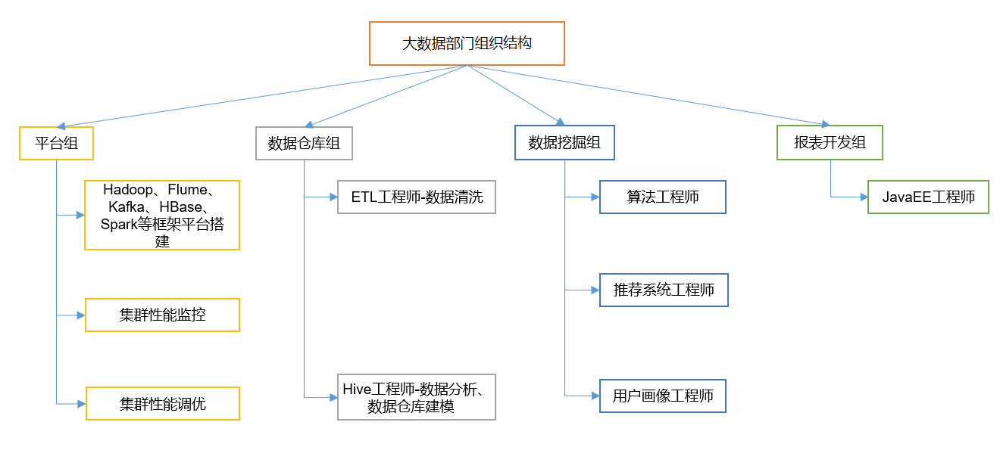
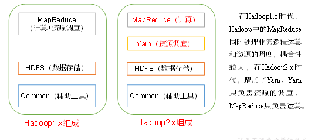
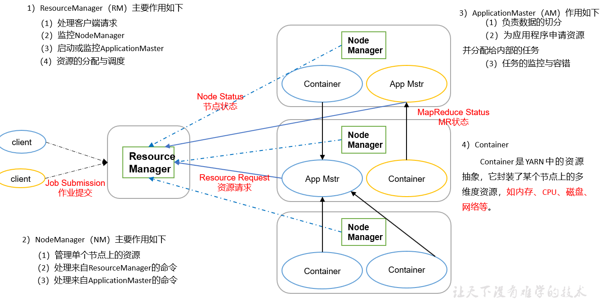
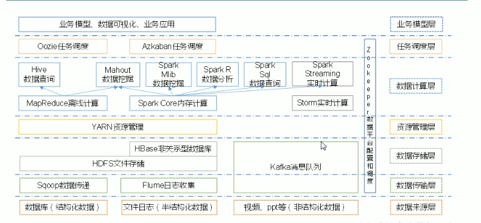
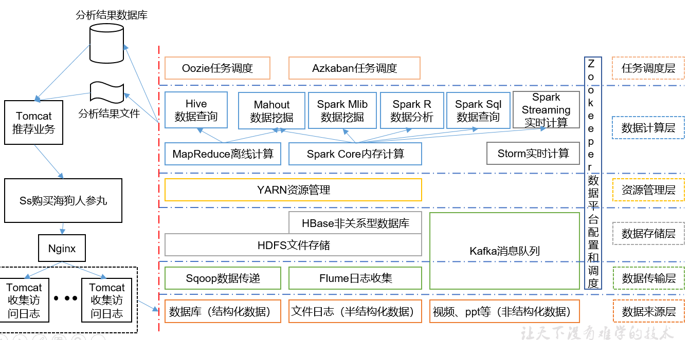
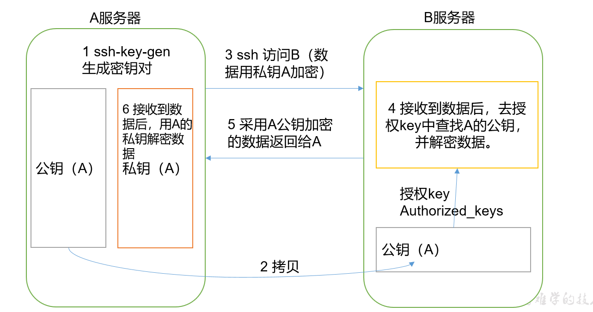
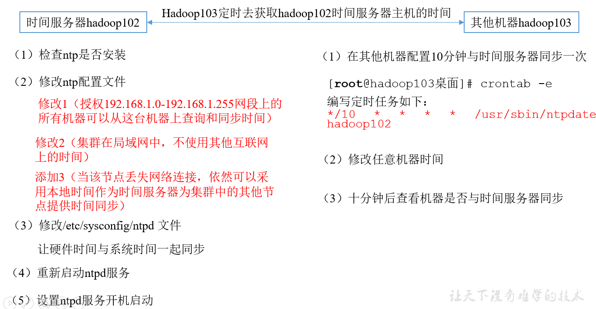

# 大数据概论

## 1.1 大数据概念

- 大数据 ： 指==无法在一定时间范围==内用常规软件工具进行捕捉、管理和处理的数据集合，是需要新处理模式才能具有更强的决策力、洞察发现力和流程优化能力的==海量，高增长率和多样化的信息资产==

- 主要解决 ： 海量数据的存储和海量数据的分析计算问题

  

- 数据存储单位 ： bit，Byte，KB，MB，GB，TB，PB，EB，ZB，YB，BB，NB，DB
  -  1byte = 8bit  1k = 1024Byte，1MB = 1024K
  - 1G= 1024M  1T = 1024G， 1p  = 1024T

## 1.2 大数据特点

1. Volume (大量)
2. Velocity （高速）
3. Variety （多样）
   - 数据分为 结构化数据 和非结构化数据
4. Value （低价值密度）


## 1.3 大数据应用场景

1. 物流仓库
2. 零售 ： 分析用户消费习惯，为用户提供方便
3. 旅游 ： 共建旅游产业智慧管理、智慧服务和智慧营销的未来
4. 商品广告推荐 ：  给用户推荐可能喜欢的商品
5. 保险 ： 海量数据挖掘及风险预测、助力保险，行业精准推销
6. 金融 ： 多维度体现用户特征，帮助金融机构土建优质客户，防范欺诈风险
7. 房产 ： 选出合适的地，建造合适的楼，卖给合适的人  
8. 人工智能

## 1.4 大数据部门业务流程分析

1. 产品人员提需求(统计总用户数，日活跃用户数，回流用户数)
2. 数据部分搭建数据平台，分析数据指标
3. 数据可视化（报表，邮件发送等）


## 1.5 大数据部门组织结构（重点）



# 从Hadoop框架讨论大数据生态

## 2.1 Hadoop是什么

1. 是一个分布式系统的基础架构
2. 主要解决 ： 海量数据的==存储==和海量数据的==分析计算==问题
3. 广义来说 ： Hadoop 通常是指一个更广泛的概念——生态圈

## 2.2 Hadoop发展历史

1. Lucene 框架是 用java书写的，实现与Google类似的全文搜索功能，它提供了全文检索引擎的架构，包括完整的查询引擎和索引引擎
2. 学习和模仿Google 解决这些问题的办法：微型Nutch
3. google三篇论文：
   1. GFS-HDFS
   2. MAP-Rduce --》 MR
   3. BIgTable ---》Hbase 

## 2.3 Hadoop 三大发行版本

Apache ，Cloudera，Hortonworks

Apache  最基础，入门学习

Cloudera 在企业用的多，需要收费

Houtonworks 文档较好

## 2.4 Hadoop 的优势（4高）

1. 高可靠性 ： Hadoop底层维护多个数据副本，所有即使Hadoop某个元素或存储出现故障，也不会导数数据的丢失
2. 高扩展性 ： 在集群间分配任务数据，可方便的扩展数以千计的结点
3. 高效性 ; 在MapReduce 的思想下，Hadoop是并行工作的，以加快任务处理速度
4. 高容错性：能够自动将失败的任务重新分配

## 2.5 Hadoop组成（面试重点）

 1. Hadoop1.x 和Hadoop 2.x区别



2. HDFS 架构概述

   

3. YARN 架构概述

   

## 2.6 大数据技术生态体系



```txt
1）Sqoop：Sqoop是一款开源的工具，主要用于在Hadoop、Hive与传统的数据库(MySql)间进行数据的传递，可以将一个关系型数据库（例如 ：MySQL，Oracle 等）中的数据导进到Hadoop的HDFS中，也可以将HDFS的数据导进到关系型数据库中。
2）Flume：Flume是Cloudera提供的一个高可用的，高可靠的，分布式的海量日志采集、聚合和传输的系统，Flume支持在日志系统中定制各类数据发送方，用于收集数据；同时，Flume提供对数据进行简单处理，并写到各种数据接受方（可定制）的能力。
3）Kafka：Kafka是一种高吞吐量的分布式发布订阅消息系统，有如下特性：
（1）通过O(1)的磁盘数据结构提供消息的持久化，这种结构对于即使数以TB的消息存储也能够保持长时间的稳定性能。
（2）高吞吐量：即使是非常普通的硬件Kafka也可以支持每秒数百万的消息。
（3）支持通过Kafka服务器和消费机集群来分区消息。
（4）支持Hadoop并行数据加载。
4）Storm：Storm用于“连续计算”，对数据流做连续查询，在计算时就将结果以流的形式输出给用户。
5）Spark：Spark是当前最流行的开源大数据内存计算框架。可以基于Hadoop上存储的大数据进行计算。
6）Oozie：Oozie是一个管理Hdoop作业（job）的工作流程调度管理系统。
7）Hbase：HBase是一个分布式的、面向列的开源数据库。HBase不同于一般的关系数据库，它是一个适合于非结构化数据存储的数据库。
8）Hive：Hive是基于Hadoop的一个数据仓库工具，可以将结构化的数据文件映射为一张数据库表，并提供简单的SQL查询功能，可以将SQL语句转换为MapReduce任务进行运行。 其优点是学习成本低，可以通过类SQL语句快速实现简单的MapReduce统计，不必开发专门的MapReduce应用，十分适合数据仓库的统计分析。
10）R语言：R是用于统计分析、绘图的语言和操作环境。R是属于GNU系统的一个自由、免费、源代码开放的软件，它是一个用于统计计算和统计制图的优秀工具。
11）Mahout：Apache Mahout是个可扩展的机器学习和数据挖掘库。
12）ZooKeeper：Zookeeper是Google的Chubby一个开源的实现。它是一个针对大型分布式系统的可靠协调系统，提供的功能包括：配置维护、名字服务、 分布式同步、组服务等。ZooKeeper的目标就是封装好复杂易出错的关键服务，将简单易用的接口和性能高效、功能稳定的系统提供给用户。

```


## 2.7 推荐项目框架图



# Hadoop运行环境搭建（开发重点）

## 3.1 虚拟机环境准备

1. 克隆虚拟机

2. 修改克隆虚拟机的静态IP

3. 修改主机名

   ```txt
   vim /etc/udev/rules.d/70-persistent-net.rules (可以查找到mac地址，如果没有找到mac地址，那么可以在虚拟机中生成)
   vim /etc/sysconfig/network-scripts/ifcfg-ens32 (改变ip 为手动设置而不是静态iP)
   
   vim /etc/sysconfig/network(改变主机名)，NETWORKING=yes，HOSTNAME=
   
   vim /etc/hosts (设置对应IP地址的主机名)
   
   达到要求：
   各个虚拟主机，能够ping通
   主机与各个虚拟主机，能够ping通
   
   ```

4. 设置用户为超级用户

   ```txt
   vim /etc/sudoers
   
   新建用户 为lan
   密码 为1234
   ```

5. 配置java环境

   ```txt
   1. 解压jdk 文件在一个文件夹下
   
   
   2. 配置环境
   vim /etc/profile
   ##JAVA_HOME
   export JAVA_HOME=/opt/module/jdk1.8.0_144
   export PATH=$PATH:$JAVA_HOME/bin
   
   source /etc/profile 更新文件配置
   ```

6. hadoop安装

   ```txt
   1. 解压hadoop 文件在一个文件夹下
   
   2. 配置环境
   ## HADOOP_HOME
   export HADOOP_HOME=/opt/module/hadoop-2.7.2
   export PATH=$PATH:$HADOOP_HOME/bin
   export PATH=$PATH:$HADOOP_HOME/sbin
   
   更新文件配置
   ```

   重要目录

   ```txt
   （1）bin目录：存放对Hadoop相关服务（HDFS,YARN）进行操作的脚本
   （2）etc目录：Hadoop的配置文件目录，存放Hadoop的配置文件
   （3）lib目录：存放Hadoop的本地库（对数据进行压缩解压缩功能）
   （4）sbin目录：存放启动或停止Hadoop相关服务的脚本
   （5）share目录：存放Hadoop的依赖jar包、文档、和官方案例
   
   ```

   

## Hadoop 运行模式

1. 本地模式
2. 伪分布模式
3. 完全分布模式

官方网站：http://hadoop.apache.org/

### 4.1 本地运行模式

#### 4.1 官方Grep案例

1. 创建hadoop 文件下面创建一个input文件夹
2. 将Hadoop的xml配置 文件复制到input
3. 执行share目录下的MapReduce程序
4. 查看输出结果（cat output/*)(output必须不存在，不然报错)

#### 4.2 官方WordCount案例

1. 创建在hadoop-2.7.2文件下面创建一个wcinput文件夹

   -   mkdir wcinput

2. 在wcinput文件下创建一个wc.input文件

   - cd wcinput
   - touch wc.input

3. 编辑wc.input文件

   ```txt
   3. 
   
   在文件中输入如下内容
   
   hadoop yarn
   
   hadoop mapreduce
   
   lan
   lan
   
   保存退出：：wq
   ```

   

4. 回到Hadoop目录/opt/module/hadoop-2.7.2

5. 执行程序
   
   - hadoop jar share/hadoop/mapreduce/hadoop-mapreduce-examples-2.7.2.jar wordcount wcinput wcoutput
6. 查看结果
   
   - cat wcoutput/part-r-00000

### 4.2 伪分布式运行模式

#### 4.2.1 启动HDFS 并运行Mapreduce程序

1. 分析

   1. 配置集群
   2. 启动、测试集群增删查
   3. 执行wordCount案例

2. 执行步骤

   1. 配置集群

      1. 配置 ： hadoop-env.sh

         ```txt
         添加JAVA_HOME 的路径
         ```

         

      2. 配置： core-site.xml

         ```txt
         <!-- 指定HDFS中NameNode的地址 -->
         <property>
         <name>fs.defaultFS</name>
             <value>hdfs://hadoop101:9000</value>
         </property>
         
         <!-- 指定Hadoop运行时产生文件的存储目录 -->
         <property>
         	<name>hadoop.tmp.dir</name>
         	<value>/opt/module/hadoop-2.7.2/data/tmp</value>
         </property>
         
         ```

      3. 配置 ： hdfs-site.xml

         ```txt
         <!-- 指定HDFS副本的数量 -->
         <property>
         	<name>dfs.replication</name>
         	<value>1</value>
         </property>
         
         ```

   2. 启动集群

      1. ==格式化NameNode（第一次启动时格式化，以后就不要总格式化）==

         ```txt
         bin/hdfs namenode -format
         ```

      2. 启动NameNode

         ```txt
         sbin/hadoop-daemon.sh start namenode
         ```

      3. 启动DataNode

         ```txt
         sbin/hadoop-daemon.sh start datanode
         ```

   3. 查看集群

      1. 查看是否启动成功

         ```txt
         jps(这是jdk里面的命令)
         ```

      2.  web端查看HDFS文件系统

         ```txt
         https://hadpp100:50070/dfshealth.html#tab-overview
         
         参考：http://www.cnblogs.com/zlslch/p/6604189.html
         ```

      3. 查看产生的log日志

      4. **为什么不能一直格式化NameNode，格式化Namenode，要注意什么**

         ```txt
          cd data/tmp/dfs/name/current/
          
          cat VERSION (得到ID)
          
          cd data/tmp/dfs/data/current/
          
          cat verison（得到ID）
          
         ```

         ==格式化NameNode，会产生新的集群导致namenode 和 DataNode 的集群ID不一致，集群找不到已往数据，所有，格式nameNode时，一定要先删除data数据 和log日志，然后再格式化nameNode==

      5. 操作集群

         1. 再HDFS文件系统上创建一个input文件夹

            ```txt
            bin/hdfs dfs -mkdir -p /usr/lan/input
            ```

         2. 将测试内容上传到文件系统上

            ```txt
            bin/hdfs dfs -put wcinput/wc.input
              /user/lan/input/
            
            ```

         3. 查看文件是否正确

            ```txt
            1. hadoop-2.7.2]$ bin/hdfs dfs -ls  /user/lan/input/
            2.  bin/hdfs dfs -cat  /user/lan/ input/wc.input
            
            ```

         4. 运行mapReduce程序

            ```txt
            bin/hadoop jar share/hadoop/mapreduce/hadoop-mapreduce-examples-2.7.2.jar wordcount /user/lan/input/
            /user/lan/output
            ```

         5. 查看结果

            ```txt
            bin/hdfs dfs -cat /user/lan/output/*
            ```

         6.  将测试内容下载到本地

             ```txt
    hdfs dfs -get /user/lan/output/part-r-00000 ./wcoutput/
             ```
         
             
         
         7.  删除输出结果
         
             ```txt
             hdfs dfs -rm -r /user/lan/output
             ```
#### 4.2.2 启动yarn 并运行MapReduce 程序

1. 分析

   - 配置集群在yarn上运行MR
   - 启动、测试集群增删查
   - 在yarn上执行wordCount案例

2. 执行步骤

   1. 配置集群

      1. 配置yarn-env.sh

         配置java_home

      2. 配置yarn-site.xml

         ```txt
         <!-- Reducer获取数据的方式 -->
         <property>
          		<name>yarn.nodemanager.aux-services</name>
          		<value>mapreduce_shuffle</value>
         </property>
         
         <!-- 指定YARN的ResourceManager的地址 -->
         <property>
         <name>yarn.resourcemanager.hostname</name>
         <value>hadoop101</value>
         </property>
         
         ```

      3. 配置 mapred-env.sh

         配置 JAVA_HOME

      4. 配置(对mapred-site.xml.template重新命名为) mapred-site.xml

         ```txt
         mv mapred-site.xml.template mapred-site.xml
         
         vi mapred-site.xml
         
         <!-- 指定MR运行在YARN上 -->
         <property>
         		<name>mapreduce.framework.name</name>
         		<value>yarn</value>
         </property>
         
         ```

   2. 启动集群

      1.  启动前必须保证NameNode和dataNode已经启动

      2. 启动Resourcemanager

         ```txt
         sbin/yarn-daemon.sh start resouremanager
         ```

      3. 启动Nodemanager

         ```txt
         sbin/yarn-daemon.sh start nodemanager
         ```

      4. 集群操作

         1. yarn的浏览器查看（http://hadoop101:8088/cluster）

         2. 删除文件系统上的output文件

            ```txt
            bin/hdfs dfs -rm -R /user/lan/output
            ```

            

         3. 执行MapReduce程序

            ```txt
            bin/hadoop jar
             share/hadoop/mapreduce/hadoop-mapreduce-examples-2.7.2.jar wordcount /user/lan/input  /user/lan/output
            
            ```

         4. 查看运行结果

            ```txt
            bin/hdfs dfs -cat /user/lan/output/*
            
            ```

   
#### 4.2.3 配置历史服务器

   可以查看程序的历史运行情况，需要配置历史服务器

   1. 配置mapred-site.xml

      ```txt
      <!-- 历史服务器端地址 -->
      <property>
      <name>mapreduce.jobhistory.address</name>
      <value>hadoop101:10020</value>
      </property>
      <!-- 历史服务器web端地址 -->
      <property>
          <name>mapreduce.jobhistory.webapp.address</name>
          <value>hadoop101:19888</value>
      </property>
      
      ```

   2. 启动历史服务器

      ```txt
      sbin/mr-jobhistroy-daemon.sh start historyserver
      ```

   3. 查看历史服务器

      ```txt
      hadoop-2.7.2]$ sbin/mr-jobhistory-daemon.sh start historyserver
      ```

   4. 网址 ： http://hadoop:19888/jobhistory


#### 4.2.4 配置日志的聚集

将运行日志信息上传到HDFS系统上

==注意 ： 开启日志聚集功能，需要重新启动Nodemanager、ResourceManager和Historymanager==

1. 配置yarn-site.xml

   ```txt
   <property>
   <name>yarn.log-aggregation-enable</name>
   <value>true</value>
   </property>
   
   <!-- 日志保留时间设置7天 -->
   <property>
   <name>yarn.log-aggregation.retain-seconds</name>
   <value>604800</value>
   </property>
   
   ```

2.  关闭三个；

   ```txt
   sbin/yarn-daemon.sh stop resourcemanager
   sbin/yarn-daemon.sh stop nodemanager
   sbin/mr-jobhistory-daemon.sh stop historyserver
   
   ```

3. 启动上面关闭的三个

   ```txt
   sbin/yarn-daemon.sh start resourcemanager
   sbin/yarn-daemon.sh start nodemanager
   sbin/mr-jobhistory-daemon.sh start historyserver
   
   ```

4. 删除HDFS上已经存在的输出文件

   ```txt
   bin/hdfs dfs -rm -R /user/lan/output
   ```

5. 执行wordCount程序

   ```txt
   hadoop jar share/hadoop/mapreduce/hadoop-mapreduce-examples-2.7.2.jar wordcount /user/lan/input /user/lan/output
   
   ```

   

#### 4.2.5 配置文件说明

Hadoop配置文件分两类：默认配置文件和自定义配置文件，只有用户想修改某一默认配置值时，才需要修改自定义配置文件，更改相应属性值。

1. 默认配置文件

   | 要获取的默认文件     | 文件放在Hadoop的jar包中的位置                              |
   | -------------------- | ---------------------------------------------------------- |
   | [core-default.xml]   | hadoop-common-2.7.2.jar/ core-default.xml                  |
   | [hdfs-default.xml]   | hadoop-hdfs-2.7.2.jar/ hdfs-default.xml                    |
   | [yarn-default.xml]   | hadoop-yarn-common-2.7.2.jar/ yarn-default.xml             |
   | [mapred-default.xml] | hadoop-mapreduce-client-core-2.7.2.jar/ mapred-default.xml |

2. 自定义配置文件

   **core-site.xml、hdfs-site.xml、yarn-site.xml、mapred-site.xml**四个配置文件存放在$HADOOP_HOME/etc/hadoop这个路径上，用户可以根据项目需求重新进行修改配置。


### 4.3 完全分布式运行模式（开发重点）

分析： 

```txt
1. 准备多台客户机 （关闭防火墙，静态ip，主机名称）
2. 安装jDK
3. 安装Hadoop
4. 配置环境变量
5. 配置集群
6. 单点启动
7. 配置ssh
8. 群起并测试集群
```


#### 4.3.1 虚拟机准备

#### 4.3.2 编辑集群分发脚本Sxync

1. scp 安全拷贝

   1. scp定义

      1. 可以实现服务器与服务器之间的数据拷贝

      2. 基本语法

         ```txt
         scp -r  $pdir/$fname   $user@hadoop$hostt:$padir/$fname
         
         
         命令   递归   要拷贝的文件路径/名称   目的用户@主机：目的路径/名称
         ```

      3. 案例实操

         1. 在hadoop100 上，将hadoop100中/opt/module目录下的软件拷贝到hadoop101上

            ```txt
            scp -r /opt/module  root@hadoop101:/opt/module
            ```

         2. 同样操作，将hadoop100 拷贝到hadoop102上

         3. 当上述操作完成后，改变所有者和所有者组

         4. 然后拷贝/etc/profile 文件

   2. rsync 远程同步工具

      rsync主要用于备份和镜像。具有速度快、避免复制相同内容和支持符号链接的优点。

      rsync和scp区别：用rsync做文件的复制要比scp的速度快，rsync只对差异文件做更新。scp是把所有文件都复制过去。

      1. 基本语法

         ```txt
         rsync    -rvl       $pdir/$fname              $user@hadoop$host:$pdir/$fname
         命令   选项参数   要拷贝的文件路径/名称    目的用户@主机:目的路径/名称
         	  选项参数说明
         
         选项	功能
         -r	递归
         -v	显示复制过程
         -l	拷贝符号连接
         
         ```

      2. 案例实操

         1. 把hadoop100 的目录同步到 hadoop 的root 用户下的/opt目录下

            ```txt
            rsync -rvl /opt/module root@hadoop101:/opt	
            ```

      3. sxync 集群分发脚本

         1. 需求 ： 循环复制文件到所有结点的相同目录下

         2. 需求分析 ; 

            1. rsync 命令原始拷贝

            ```txt
            rsync  -rvl     /opt/module  		 root@hadoop103:/opt/
            ```

               2.    期望脚本

                     xsync 要同步的文件名称：

            				3.  说明： 在home/lan/bin 这个目录下存放的脚本，lan用户可以在系统任何地方直接执行

         3. 脚本实现

            1. 在 home/lan 目录下创建bin目录，并在目录下xsync 创建文件，

               ```txt
               #!/bin/bash
               #1 获取输入参数个数，如果没有参数，直接退出
               pcount=$#
               if((pcount==0)); then
               echo no args;
               exit;
               fi
               
               #2 获取文件名称
               p1=$1
               fname=`basename $p1`
               echo fname=$fname
               
               #3 获取上级目录到绝对路径
               pdir=`cd -P $(dirname $p1); pwd`
               echo pdir=$pdir
               
               #4 获取当前用户名称
               user=`whoami`
               
               #5 循环
               for((host=103; host<105; host++)); do
                       echo ------------------- hadoop$host --------------
                       rsync -rvl $pdir/$fname $user@hadoop$host:$pdir
               done
               
               ```

            2. 修改权限 ： chmod  777

            3. 调用脚本形式 ： xsync 文件名称

               ```txt
               xsync  /home/lan/bin
               ```

            4.  ==注意： 如果将xsync放到/home/lan/bin目录下仍然不能实现全局使用，可以将xsync移动到/usr/local/bin目录下。==

#### 4.3.4 集群配置

1. 集群部署规划

   |      | hadoop100          | hadoop101                    | hadoop102                  |
   | ---- | ------------------ | ---------------------------- | -------------------------- |
   | HDFS | NameNode，DataNode | DataNode                     | SecondaryNameNode,Datanode |
   | YARN | Nodemanager        | Resourcemanager，Nodemanager | Nodemangager               |

   

2. 配置集群

   1.  核心配置文件

      配置core-site.xml

      ```txt
      hadoop100 配置
      <!-- 指定HDFS中NameNode的地址 -->
      <property>
      		<name>fs.defaultFS</name>
            <value>hdfs://hadoop100:9000</value>
      </property>
      
      <!-- 指定Hadoop运行时产生文件的存储目录 -->
      <property>
      		<name>hadoop.tmp.dir</name>
      		<value>/opt/module/hadoop-2.7.2/data/tmp</value>
      </property>
      ```
   
2.  HDFS 配置文件
   
   - hadoop-env.sh 配置
   
        ```txt
        hadoop100 配置
        vi hadoop-env.sh
        export JAVA_HOME=/opt/module/jdk1.8.0_144
           
     ```
   
   - hdfs-site.xml
     
        ```txt
        <property>
        		<name>dfs.replication</name>
        		<value>3</value>
        </property>
        
        <!-- 指定Hadoop辅助名称节点主机配置 -->
        <property>
              <name>dfs.namenode.secondary.http-address</name>
              <value>hadoop102:50090</value>
        </property>
        
        ```
   
   3. YARN 配置文件
   
         -  yarn-env.sh
   
            ```txt
            hadoop100 配置
            vi yarn-env.sh
              export JAVA_HOME=/opt/module/jdk1.8.0_144
            
            ```
         - yarn-site.xml
         ```
            <!-- Reducer获取数据的方式 -->
             <property>
             		<name>yarn.nodemanager.aux-services</name>
             		<value>mapreduce_shuffle</value>
             </property>
           
             <!-- 指定YARN的ResourceManager的地址 -->
             <property>
             		<name>yarn.resourcemanager.hostname</name>
             		<value>hadoop101</value>
             </property>
         ```
   
   
   ​        
   
   4. Mapreduce配置文件
   
      - mapre-env。sh
   
        ```txt
        hadoop100 配置
       vi mapred-env.sh
        export JAVA_HOME=/opt/module/jdk1.8.0_144
        
        ```
     ```
      
      - 配置 mapred-site.xml
      
        ```txt
        hadoop100 配置
        cp mapred-site.xml.template mapred-site.xml
        vi mapred-site.xml
        
        添加配置
        <!-- 指定MR运行在Yarn上 -->
        <property>
        		<name>mapreduce.framework.name</name>
        		<value>yarn</value>
        </property>
        
     ```
   
3. 在集群上分发配置好的Hadoop配置文件

   xsync /opt/module/hadoop---/	

4. 查看文件分发情况

#### 4.3.4 集群单点启动

1. 如果集群是第一个启动，需要==格式化==

   hadoop100 ：bin/hdfs namenode -format

2. 在 hadoop100 启动NameNode

   hadoop-dameon.sh start namenode

   jps

3. 在hadoop100-102  分别启动DataNode

   hadoop-daemon.sh start datanode

4. **如何批量启动**

   下面写出


#### 4.3.5 SSH无密码登录

1. 配置

   1. 基本语法

      ssh 另一台电脑

   2. 无密钥配置

      1. 免密码登录原理

         

      2. 生成公钥和私钥

         ```txt
         ssh-keygen -t rsa
         
         然后敲回车 就会生成两个文件id rsa（私钥） ，id rsa_pub（公钥）
         
         
         ```

      3. 将公钥拷贝到要免密登录的目标机器上

         ```txt
         lan@hadoop100 ,ssh :ssh-copy-id hadoop100
         lan@hadoop100 ,ssh :ssh-copy-id hadoop101
         lan@hadoop100 ,ssh :ssh-copy-id hadoop102
         
         
         注意 ： 还需要在hadoop100 采用root 账号，配置无密登录到hadoop101 和hadoop100，hadoop102
         
         还需要在hadoop101 上采用 lan账号 配置一下无密登录到handoop100、hadoop102服务器
         ```

      4. .ssh 文件夹 下 的文件功能解释

         | known_hosts     | 记录ssh访问过的计算机的公钥    |
         | --------------- | ------------------------------ |
         | id_rsa          | 生成的私钥                     |
         | id_rsa.pub      | 生成的公钥                     |
         | authorized_keys | 存放授权过的无密登录服务器公钥 |

         

#### 4.3.6 群起集群

1.  配置slaves

   /opt/module/hadoop-2.7.2/etc/hadoop/slaves

    vi slaves

   ```txt
   hadoop102
   hadoop103
   hadoop104
   注意：该文件中添加的内容结尾不允许有空格，文件中不允许有空行。
   
   ```

   然后同步所有节点配置文件 sxync.sh  slaves

2. 启动集群

   1. 如果集群第一次启动，需要格式化namenode

   2. 启动HDFS sbin/start-dfs.sh

   3. 启动yarn  sbin/start-yarn.sh

      ==注意：namenode和resourcemanger如果不是同一台机器，不能在namenode上启动yarn，应该在Resourcemanager所在的机器上启动yarn==

   4. web查看 ： hadoop102:50090

3. 集群基本测试

   1. 上传文件到集群

      - 上传小文件

      ```txt
      hadoop100 : hdfs dfs -mkdir - p /user/lan/input
      hadoop100 : hdfs
      ```

      - 上传大文件

        ```txt
        bin/hadoop dfs -put /opt/software/hadoop-2.7.2.tar.gz /user/lan/input
        ```

   2. 上传文件后查看文件存放在什么位置

      1. 查看HDFS文件存储路径

         lan@hadoop100 subdir0   ： pwd

         /opt/module/hadoop-2.7.2/data/tmp/dfs/data/current/BP-333364707-192.168.11.100-1580479654507/current/finalized/subdir0/subdir0

      2. 查看HDFS在磁盘存储文件的内容

         ```txt
         lan@hadoop100 : subdir:
         cat blk_*******
         ```

      3. 拼接

         ```txt
         cat *** >> tmp.file
         ca ***1 >> tmp.file
         tar -zxvf tmp.file
         ```

      4. 下载

         ```txt
         bin/hadoop fs -get /user/lan/input/hadoop***.tar.gz  ./
         ```

         

#### 4.3.7 集群启动/停止方式总结

1. 各个服务组件注意启动停止

   1. 分别启动-停止HDFS组件

      ```
      hadoop-daemon.sh start/stop namenode/datanode/secondarynamnode
      
      ```

   2. 启动停止YARN

      ```txt
      yarn-daemon.sh start/stop resourcemanager/nodemnaager			
      ```


2. 各个模块分开启动停止（ssh配置是前提）

   1. 整体启动停止HDFS

      start-dfs。sh/  stop-dfs.sh

   2. 整体启动停止yarn

      start-yarn.sh / stop-yarn.sh

#### 4.3.7 集群时间同步

时间同步方式： 找一个机器，作为时间服务器，所有机器与这条集群时间进行定时的同步，比如每隔10分钟，同步一次时间



配置时间同步具体实操：

1.  时间服务器配置（必须是root用户）

   1. 检查ntp是否安装

      rpm -qa | grep ntp

   2. 修改ntp配置文件

      vim /etc/net.conf 下面是参考配置

      ```txt
      a）修改1（授权192.168.1.0-192.168.1.255网段上的所有机器可以从这台机器上查询和同步时间）
      #restrict 192.168.1.0 mask 255.255.255.0 nomodify notrap为
      restrict 192.168.1.0 mask 255.255.255.0 nomodify notrap
      		b）修改2（集群在局域网中，不使用其他互联网上的时间）
      server 0.centos.pool.ntp.org iburst
      server 1.centos.pool.ntp.org iburst
      server 2.centos.pool.ntp.org iburst
      server 3.centos.pool.ntp.org iburst为
      #server 0.centos.pool.ntp.org iburst
      #server 1.centos.pool.ntp.org iburst
      #server 2.centos.pool.ntp.org iburst
      #server 3.centos.pool.ntp.org iburst
      c）添加3（当该节点丢失网络连接，依然可以采用本地时间作为时间服务器为集群中的其他节点提供时间同步）
      server 127.127.1.0
      fudge 127.127.1.0 stratum 10
      
      ```

   3.  修改/etc/sysconfig/ntpd 文件

      添加文件 ： SYNC HWCLOCK=yes

   4. 重新启动ntpd服务

      service ntpd status

   5. 设置开机启动

      chkconfig ntpd on

2. 其他机器配置（必须是root 用户）

   1. 在其他机器配置10分钟与时间服务器同步一次

      crontab -e

      ```txt
      */10 * * * * /usr/sbin/ntpdate hadoop100
      ```

   2. 可以测试 data -s “2020-2-1 16:46:20”


### 第五章 ： Hadoop编译源码（面试重点）

#### 5.1 前期准备工作 

1. 能联网
2. root编译
3. jar (hadoop源码 ，jdk8，maven，ant，protobuf)

#### 5.2 jar安装

1. 配置java

2. 配置maven

   ```txt
   root@hadoop101 software]# tar -zxvf apache-maven-3.0.5-bin.tar.gz -C /opt/module/
   
   [root@hadoop101 apache-maven-3.0.5]# vi conf/settings.xml
   
   <mirrors>
       <!-- mirror
        | Specifies a repository mirror site to use instead of a given repository. The repository that
        | this mirror serves has an ID that matches the mirrorOf element of this mirror. IDs are used
        | for inheritance and direct lookup purposes, and must be unique across the set of mirrors.
        |
   <mirror>
          <id>mirrorId</id>
          <mirrorOf>repositoryId</mirrorOf>
          <name>Human Readable Name for this Mirror.</name>
          <url>http://my.repository.com/repo/path</url>
         </mirror>
        -->
           <mirror>
                   <id>nexus-aliyun</id>
                   <mirrorOf>central</mirrorOf>
                   <name>Nexus aliyun</name>
                   <url>http://maven.aliyun.com/nexus/content/groups/public</url>
           </mirror>
   </mirrors>
   
   
   
   [root@hadoop101 apache-maven-3.0.5]# vi /etc/profile
   #MAVEN_HOME
   export MAVEN_HOME=/opt/module/apache-maven-3.0.5
   export PATH=$PATH:$MAVEN_HOME/bin
   
   [root@hadoop101 software]#source /etc/profile
   
   ```

   

3. 配置ant

   ```txt
   [root@hadoop101 software]# tar -zxvf apache-ant-1.9.9-bin.tar.gz -C /opt/module/
   
   [root@hadoop101 apache-ant-1.9.9]# vi /etc/profile
   #ANT_HOME
   export ANT_HOME=/opt/module/apache-ant-1.9.9
   export PATH=$PATH:$ANT_HOME/bin
   
   [root@hadoop101 software]#source /etc/profile
   
   ```

4. 安装 glibc-headers 和G++，make，和cmake

5. 解压protobuf ，进入到解压后protobuf 主目录 ，

   ```txt
   tar -zxvf protobuf-*** tar.gz -C /opt/module
   
   [root@hadoop101 protobuf-2.5.0]#./configure 
   [root@hadoop101 protobuf-2.5.0]# make 
   [root@hadoop101 protobuf-2.5.0]# make check 
   [root@hadoop101 protobuf-2.5.0]# make install 
   [root@hadoop101 protobuf-2.5.0]# ldconfig 
   
   [root@hadoop101 hadoop-dist]# vi /etc/profile
   #LD_LIBRARY_PATH
   export LD_LIBRARY_PATH=/opt/module/protobuf-2.5.0
   export PATH=$PATH:$LD_LIBRARY_PATH
   
   [root@hadoop101 software]#source /etc/profile
   
   
   验证命令：protoc --version
   ```

6. 安装openssl库

7. 安装ncurses-devel库

#### 5.4 编译源码

1. 解压源码到opt目录

2. 进入源码主目录

3. maven 执行编译命令

   ```txt
   mvn package -Pdist,native -DskipTests -Dtar
   ```

4. 若出现问题

   ```txt
   （1）MAVEN install时候JVM内存溢出
   处理方式：在环境配置文件和maven的执行文件均可调整MAVEN_OPT的heap大小。（详情查阅MAVEN 编译 JVM调优问题，如：http://outofmemory.cn/code-snippet/12652/maven-outofmemoryerror-method）
   （2）编译期间maven报错。可能网络阻塞问题导致依赖库下载不完整导致，多次执行命令（一次通过比较难）：
   [root@hadoop101 hadoop-2.7.2-src]#mvn package -Pdist,nativeN -DskipTests -Dtar
   （3）报ant、protobuf等错误，插件下载未完整或者插件版本问题，最开始链接有较多特殊情况，同时推荐
   2.7.0版本的问题汇总帖子 http://www.tuicool.com/articles/IBn63qf
   
   ```

   

   