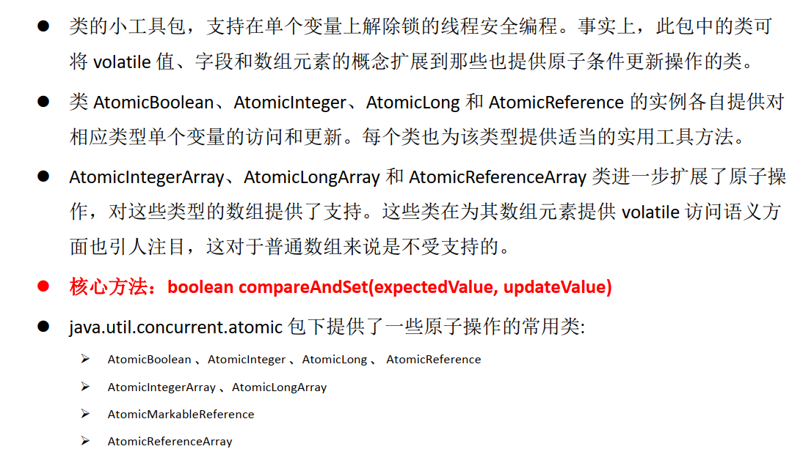

## JUC 学习

> java 5.0 提供给了java.util.concurrent 包，增加了在并发编程中很常用的使用工具类，用于定义类似于线程的自定义子线程，包括线程池，异步I/O和轻量级任务框架。提供可调的、灵活的线程池。还提供给了设计用于多线程上下文的Collection实现等


## volatile  关键字 内存可见性

### 内存可见性


### volatile 关键字


 

## 原子变量——CAS算法

> CAS(Compare-And-Swap)是一种硬件对并发的支持，针对多处理器操作而设计的处理器中的一种特殊指令，用于管理对共享数据的并发访问

1. CAS 是一种无锁的非阻塞算法的实现
2. CAS 包含了3个操作数
   1. 需要读写的内存值V
   2. 进行比较的值A
   3. 拟写入的新值B
3. 当且仅当V的值等于A时，CAS通过原子方式用新值B来更新V的值，否则不会执行任何操作

原子变量：



```java
//模拟CAS


/*
 * 模拟 CAS 算法
 */
public class TestCompareAndSwap {

	public static void main(String[] args) {
		final CompareAndSwap cas = new CompareAndSwap();
		
		for (int i = 0; i < 10; i++) {
			new Thread(new Runnable() {
				
				@Override
				public void run() {
					int expectedValue = cas.get();
					boolean b = cas.compareAndSet(expectedValue, (int)(Math.random() * 101));
					System.out.println(b);
				}
			}).start();
		}
		
	}
	
}

class CompareAndSwap{
	private int value;
	
	//获取内存值
	public synchronized int get(){
		return value;
	}
	
	//比较
	public synchronized int compareAndSwap(int expectedValue, int newValue){
		int oldValue = value;
		
		if(oldValue == expectedValue){
			this.value = newValue;
		}
		
		return oldValue;
	}
	
	//设置
	public synchronized boolean compareAndSet(int expectedValue, int newValue){
		return expectedValue == compareAndSwap(expectedValue, newValue);
	}
}

```


## ConcurrentHashMap 锁分段机制（线程安全）


## 闭锁CountDownLatch


  


### 创建执行线程


> 创建执行线程的方式三： 实现Callable接口 
>
> 第一种 继承Thread 类
>
> 第二种 实现Runnable接口
>
> 第四种 开启线程池

```java
public class TestCallable{


}
class ThreadDemo implements Callable<Integer>{

		public Integer call()  throws Exception{
        	return null
        }
}
```

> 实现Callable 接口，是基于泛型，，对比于Runnable 接口，方法可以有返回值，接收运算结果，可以抛出异常

> 执行Callable 方式，需要futureTask 实现类的支持，用于接收运算结果，FutureTask 是Future 接口的实现类
>
> 也可以用于闭锁


## 同步锁

> 用于解决多线程安全文件的方式
>
> 1. 同步代码块
> 2. 同步方法
> 3. 同步锁lock   显式锁，lock，unlock
>
> 1，2 使用synchronized  隐式锁


## 线程按序交替


```java

```

