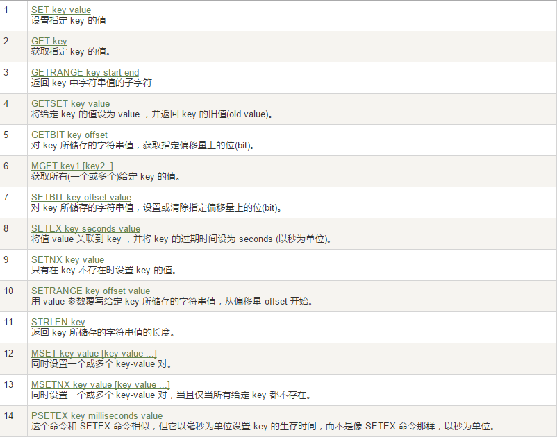
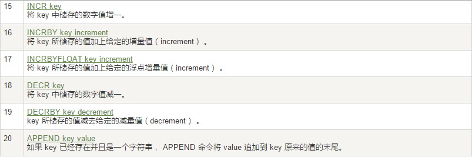
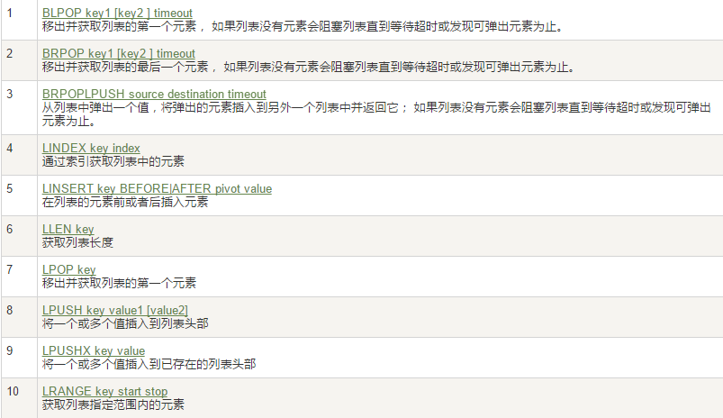
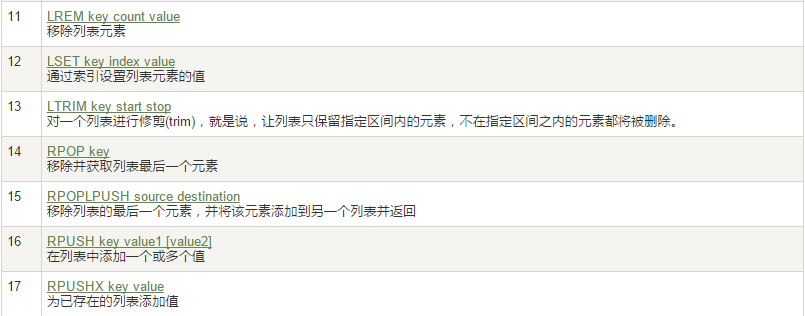
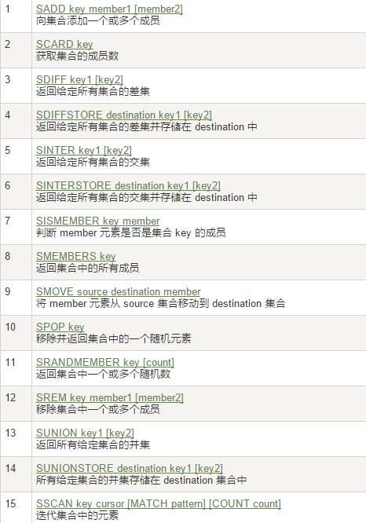
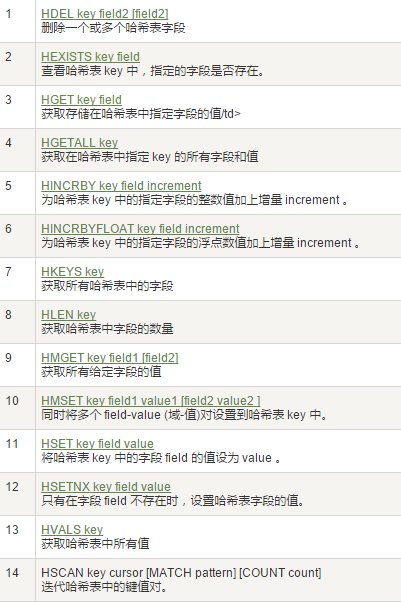
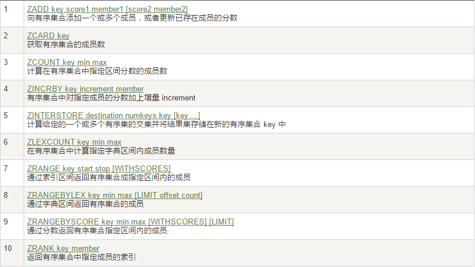
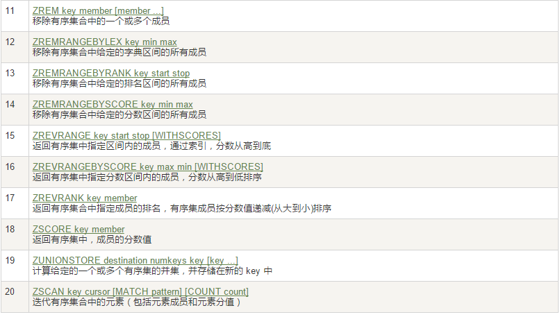
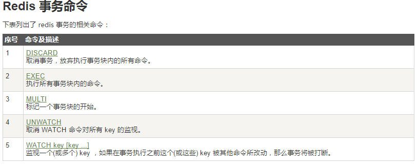

# NoSql 的学习笔记

## 一、NoSql 的入门和概述

 1. 为什么使用NoSql 

    省略

 2. 是什么

    -  泛指 ==非关系型==的数据库
    - 产生就是为了解决大规模数据集合种类带来的挑战，尤其是大数据

 3. 能干嘛

    - 易扩展

      - 去掉了 关系型数据库的特性

    - 大数据量高性能

    - 多样灵活的数据模型

    - 传统的RDBMS vs NoSql

      - RDBMS

        - 高度组织化结构化数据
        
        - 结构化查询语言（SQL）
        
        - 数据和关系都存储在单独的表中。
        
        - 数据操纵语言，数据定义语言
        
        - 严格的一致性
        
        - 基础事务
      - NoSQL
        -   代表着不仅仅是SQL
        -  没有声明性查询语言
        -   没有预定义的模式
        -   键 - 值对存储，列存储，文档存储，图形数据库
        - 最终一致性，而非ACID属性
        -  非结构化和不可预知的数据
        -    CAP定理
        -    高性能，高可用性和可伸缩性
    
 4.  3V + 3 高

    1. 大数据时代的3V 
       - 海量Volume
       - 多样Variety
       - 实时Velocity
    2. 3高
       - 高并发
       - 高可扩
       - 高性能

 5. 当下的使用

     1. MySQL和nosql 是结合使用的

 6.  NoSql 的数据模型简介

     1. nosql 使用==BSON== 来设计的

        ```json
        {
         "customer":{
           "id":1136,
           "name":"Z3",
           "billingAddress":[{"city":"beijing"}],
           "orders":[
            {
              "id":17,
              "customerId":1136,
              "orderItems":[{"productId":27,"price":77.5,"productName":"thinking in java"}],
              "shippingAddress":[{"city":"beijing"}]
              "orderPayment":[{"ccinfo":"111-222-333","txnid":"asdfadcd334","billingAddress":{"city":"beijing"}}],
              }
            ]
          }
        }
        ```

        

    2.  高并发的操作 不太建议有关联查询。
    3. 聚合模型
       - kV 键值
       - bson
       - 列族
         - 是按列存储数据的。最大的特点是方便存储结构化和半结构化数据，方便做数据压缩
       - 图形
         - 例如 亲戚关系的宗谱

 7. 在分布式数据库中CAP 原理 CAP 和BASE

     1. 传统的ACID

        - 原子性
        - 一致性
        - 独立性
        - 持久性

     2. CAP

         1. **强一致性**Consistency
         2. **可用性**Availability
         3. **分区容错性**Partition tolerance

     3. CAP 的取舍

         1. 现实是最多实现 两种，而 分区容错性（p） 是必须的
         2. CA 传统的oracle 数据库
         3. AP 大多数网站架构的选择
         4. CP Redis 、Mongodb

     4.  CAP 图

         1. 因此，根据 CAP 原理将 NoSQL 数据库分成了满足 CA 原则、满足 CP 原则和满足 AP 原则三 大类：

            - CA - 单点集群，满足一致性，可用性的系统，通常在可扩展性上不太强大。

            - CP - 满足一致性，分区容忍必的系统，通常性能不是特别高。

            - AP - 满足可用性，分区容忍性的系统，通常可能对一致性要求低一些。

     5. BASE 是什么

         1. BASE就是为了解决关系数据库强一致性引起的问题而引起的可用性降低而提出的解决方案。
         2.  基本可用 ，软状态，最终一致

     6. 分布式和集群式

         1. 分布式 是 ： 不同的多台服务器 部署不同的服务模块，之间采用RPC/RMi 通信，
         2. 集群 是 ：  不同的多台服务器 上面部署相同的 服务模块，通过分布式调度软件 进行统一的调度


## 二、Redis 的入门介绍

### 1. 安装

1. 下载 redis...tar.gz 放入 自己安装的文件夹

2. 解压

3. 进入目录

4. 进行编译 和安装 (其实不用Redis Test )

5. ==只要学习linux就会安装==

6. 查看默认安装目录 usr/local/bin 

   - redis-benchmark:性能测试工具，可以在自己本子运行，看看自己本子性能如何
   - redis-check-aof：修复有问题的AOF文件，rdb和aof后面讲
   - redis-check-dump：修复有问题的dump.rdb文件
   - redis-cli：客户端，操作入口
   - redis-sentinel：redis集群使用
   - redis-server：Redis服务器启动命令

7. 启动

   - ==不要使用默认的配置文件，切记，，任何新东西先备份 再操作==

   1. 修改redis.conf文件将里面的daemonize no 改成 yes，让服务在后台启动
   2. 将默认的redis.conf拷贝到自己定义好的一个路径下，比如/myconf
   3. /usr/local/bin目录下运行redis-server，运行拷贝出存放了自定义conf文件目录下的redis.conf文件

8. 关闭

   1. 单实例关闭：redis-cli shutdown
   2. 多实例关闭，指定端口关闭:redis-cli -p 6379 shutdown

### 2. 启动后的基础知识

1. 单进程
   1. 单进程模型来处理客户端的请求。对读写等事件的响应 ，是通过对epoll函数的包装来做到的。Redis的实际处理速度完全依靠主进程的执行效率
   2. epoll是Linux内核为处理大批量文件描述符而作了改进的epoll，是Linux下多路复用IO接口select/poll的增强版本，它能显著提高程序在大量并发连接中只有少量活跃的情况下的系统CPU利用率。
2. 数据库
   1. 默认16个数据库，类似数组下表从零开始，初始默认使用零号库
3. select命令切换数据库
4. dbsize查看当前数据库的key的数量
5. flushdb：清空当前库 ==只在学习阶段使用==
6. Flushall；通杀全部库 ==只在学习阶段使用==
7. 统一密码管理，16个库都是同样密码，要么都OK要么一个也连接不上
8. Redis索引都是从零开始
9. 为什么默认端口是6379 ==可以配置文件改==


## 三、 Redis 数据类型

### 1. Redis 的五大数据类型

1. string（字符串）
   - 以键值对的形式(最大支持512M)
2. hash（哈希，类似java里的Map）
3. list（列表）
4. set（集合）
5. zset(sorted set：有序集合)
   1. 在每一个元素 还关联一个 double类型的分数 ---这个可以重复

### 2. 常见的数据类型操作命令

1. [数据操作命令的网址](http://redisdoc.com/)

### 3. Redis 键(key)

<<<<<<< HEAD


### 4. 字符串

 


### 4. 字符串



>>>>>>> d978cde2b76da6ba095c9fa35d18024752121c01

1. **单值单value**


### 5. 列表list

<<<<<<< HEAD
 

 
=======



>>>>>>> d978cde2b76da6ba095c9fa35d18024752121c01

1. 列表 对于头尾 的效率最高，而中间的效率很惨淡


### 6. 集合

	1. 单值多value
 	2. 数学集合类
      	1. 差集 sdiff
      	2. 交集 sinter
      	3. 并集 sunion

<<<<<<< HEAD

=======

>>>>>>> d978cde2b76da6ba095c9fa35d18024752121c01

### 7. 哈希Hash

1. KV模式不变，但V是一个键值对

<<<<<<< HEAD

=======

>>>>>>> d978cde2b76da6ba095c9fa35d18024752121c01

### 8.有序集合Zset

1. 在set基础上，加一个score值。之前set是k1 v1 v2 v3，现在zset是k1 score1 v1 score2 v2

<<<<<<< HEAD
    

    
=======
   

   
>>>>>>> d978cde2b76da6ba095c9fa35d18024752121c01

## 四、 redis.conf 简单解读

### 1. 在哪

安装的时候肯定看到了，在文件夹里

### 2. 字节

​    1.  配置大小单位,开头定义了一些基本的度量单位，只支持bytes，不支持bit

    2.  对大小写不敏感

### 3. 分割

1. 可以像 spring的配置文件一样，可以include 包含

### 4. 通用

1. daemonize  no 在守护进程下运行，要改成yes

2. pidfile ： 进程号文件

3. port ： 端口

4. tcp-backlog  ： tcp 

   ```txt
   设置tcp的backlog，backlog其实是一个连接队列，backlog队列总和=未完成三次握手队列 + 已经完成三次握手队列。
   在高并发环境下你需要一个高backlog值来避免慢客户端连接问题。注意Linux内核会将这个值减小到/proc/sys/net/core/somaxconn的值，所以需要确认增大somaxconn和tcp_max_syn_backlog两个值
   ```

   

5. timeout ： 

6. bind

7. tcp-keepalive

8. loglevel ： 日志水平，为四个种类

9. logfile  : 日志文件

10. syslog-enabled

    1. 是否把日志输出到syslog中

11. syslog-ident

    1. 指定syslog里的日志标志

12. syslog-facility

    1. 指定syslog设备，值可以是USER或LOCAL0-LOCAL7

13. databases : 数据库数量  16 个

### 5. 快照 Snapshotting

1. save 秒钟 写操作次数
   1. RDB 是整个内存的快照
   2. 条件
      1. 是1分钟内改了1万次，
      2. 或5分钟内改了10次，
      3. 或15分钟内改了1次。
   3. 禁用
      1. 如果想禁用RDB持久化的策略，只要不设置任何save指令，或者给save传入一个空字符串参数也可以
2. stop-writes-on-bgsave-error 
   1. 如果配置成no，表示你不在乎数据不一致或者有其他的手段发现和控制
3.  rdbcompression
   1. rdbcompression：对于存储到磁盘中的快照，可以设置是否进行压缩存储。如果是的话，redis会采，LZF算法进行压缩。如果你不想消耗CPU来进行压缩的话，可以设置为关闭此功能
4.  rdbchecksum
   1. rdbchecksum：在存储快照后，还可以让redis使用CRC64算法来进行数据校验，但是这样做会增加10%的性能消耗，如果希望获取到最大的性能提升，可以关闭此功能
5.  dbfilename
6.  dir

### 6. REPLICATION复制

### 7.SECURITY安全

1. 设置密码
   1. config set requirepas  "123456"
2. 登录
   1. auth 123456

### 8.LIMITS限制

1. maxclients  ：设置redis同时可以与多少个客户端进行连接。默认情况下为10000个客户端
2. maxmemory ：设置redis可以使用的内存量
   1. 一旦到达内存使用上限，redis将会试图移除内部数据，移除规则可以通过maxmemory-policy来指定
3. maxmemory-policy
   1. volatile-lru：使用LRU算法移除key，只对设置了过期时间的键
   2. allkeys-lru：使用LRU算法移除key
   3. volatile-random：在过期集合中移除随机的key，只对设置了过期时间的键
   4. allkeys-random：移除随机的key
   5. volatile-ttl：移除那些TTL值最小的key，即那些最近要过期的key
   6. noeviction：不进行移除。针对写操作，只是返回错误信息
4. maxmemory-samples
   1. 设置样本数量，LRU算法和最小TTL算法都并非是精确的算法，而是估算值，所以你可以设置样本的大小，redis默认会检查这么多个key并选择其中LRU的那个

### 9.APPEND ONLY MODE追加

1.  appendonly

2.  appendfilename

3. appendfsync

   1. always  ： 同步持久化
   2. everysec ： 异步操作
   3. no

4. no-appendfsync-on-rewrite：重写时是否可以运用Appendfsync，用默认no即可，保证数据安全性。

5. auto-aof-rewrite-min-size：设置重写的基准值

6. auto-aof-rewrite-percentage：设置重写的基准值

<details>
<summary>
<mark>
<font color=darkred>点击查看详细内容</font>
</mark>
</summary>
参数说明
   redis.conf 配置项说明如下：<br>
1. Redis默认不是以守护进程的方式运行，可以通过该配置项修改，使用yes启用守护进程<br>
   daemonize no<br>
2. 当Redis以守护进程方式运行时，Redis默认会把pid写入/var/run/redis.pid文件，可以通过pidfile指定<br>
   pidfile /var/run/redis.pid<br>
3. 指定Redis监听端口，默认端口为6379，作者在自己的一篇博文中解释了为什么选用6379作为默认端口，因为6379在手机按键上MERZ对应的号码，而MERZ取自意大利歌女Alessia Merz的名字<br>
   port 6379<br>
4. 绑定的主机地址<br>
   bind 127.0.0.1<br>
      5.当 客户端闲置多长时间后关闭连接，如果指定为0，表示关闭该功能<br>
   timeout 300<br>
5. 指定日志记录级别，Redis总共支持四个级别：debug、verbose、notice、warning，默认为verbose<br>
   loglevel verbose<br>
6. 日志记录方式，默认为标准输出，如果配置Redis为守护进程方式运行，而这里又配置为日志记录方式为标准输出，则日志将会发送给/dev/null<br>
   logfile stdout<br>
7. 设置数据库的数量，默认数据库为0，可以使用SELECT 命令在连接上指定数据库id<br>
   databases 16<br>
8. 指定在多长时间内，有多少次更新操作，就将数据同步到数据文件，可以多个条件配合<br>
   save <br>
   Redis默认配置文件中提供了三个条件：<br>
   save 900 1<br>
   save 300 10<br>
   save 60 10000<br>
   分别表示900秒（15分钟）内有1个更改，300秒（5分钟）内有10个更改以及60秒内有10000个更改。<br>
9. 指定存储至本地数据库时是否压缩数据，默认为yes，Redis采用LZF压缩，如果为了节省CPU时间，可以关闭该选项，但会导致数据库文件变的巨大<br>
   rdbcompression yes<br>
10. 指定本地数据库文件名，默认值为dump.rdb<br>
    dbfilename dump.rdb<br>
11. 指定本地数据库存放目录<br>
    dir ./<br>
12. 设置当本机为slav服务时，设置master服务的IP地址及端口，在Redis启动时，它会自动从master进行数据同步<br>
    slaveof <br>
13. 当master服务设置了密码保护时，slav服务连接master的密码<br>
    masterauth <br>
14. 设置Redis连接密码，如果配置了连接密码，客户端在连接Redis时需要通过AUTH 命令提供密码，默认关闭<br>
    requirepass foobared<br>
15. 设置同一时间最大客户端连接数，默认无限制，Redis可以同时打开的客户端连接数为Redis进程可以打开的最大文件描述符数，如果设置 maxclients 0，表示不作限制。当客户端连接数到达限制时，Redis会关闭新的连接并向客户端返回max number of clients reached错误信息<br>
    maxclients 128<br>
16. 指定Redis最大内存限制，Redis在启动时会把数据加载到内存中，达到最大内存后，Redis会先尝试清除已到期或即将到期的Key，当此方法处理 后，仍然到达最大内存设置，将无法再进行写入操作，但仍然可以进行读取操作。Redis新的vm机制，会把Key存放内存，Value会存放在swap区<br>
    maxmemory <br>
17. 指定是否在每次更新操作后进行日志记录，Redis在默认情况下是异步的把数据写入磁盘，如果不开启，可能会在断电时导致一段时间内的数据丢失。因为 redis本身同步数据文件是按上面save条件来同步的，所以有的数据会在一段时间内只存在于内存中。默认为no<br>
    appendonly no<br>
18. 指定更新日志文件名，默认为appendonly.aof<br>
      appendfilename appendonly.aof<br>
19. 指定更新日志条件，共有3个可选值： <br>
    no：表示等操作系统进行数据缓存同步到磁盘（快） <br>
    always：表示每次更新操作后手动调用fsync()将数据写到磁盘（慢，安全） <br>
    everysec：表示每秒同步一次（折衷，默认值）<br>
    appendfsync everysec<br>
20. 指定是否启用虚拟内存机制，默认值为no，简单的介绍一下，VM机制将数据分页存放，由Redis将访问量较少的页即冷数据swap到磁盘上，访问多的页面由磁盘自动换出到内存中（在后面的文章我会仔细分析Redis的VM机制）<br>
      vm-enabled no<br>
21. 虚拟内存文件路径，默认值为/tmp/redis.swap，不可多个Redis实例共享<br>
      vm-swap-file /tmp/redis.swap<br>
22. 将所有大于vm-max-memory的数据存入虚拟内存,无论vm-max-memory设置多小,所有索引数据都是内存存储的(Redis的索引数据 就是keys),也就是说,当vm-max-memory设置为0的时候,其实是所有value都存在于磁盘。默认值为0<br>
      vm-max-memory 0<br>
23. Redis swap文件分成了很多的page，一个对象可以保存在多个page上面，但一个page上不能被多个对象共享，vm-page-size是要根据存储的 数据大小来设定的，作者建议如果存储很多小对象，page大小最好设置为32或者64bytes；如果存储很大大对象，则可以使用更大的page，如果不 确定，就使用默认值<br>
      vm-page-size 32<br>
24. 设置swap文件中的page数量，由于页表（一种表示页面空闲或使用的bitmap）是在放在内存中的，，在磁盘上每8个pages将消耗1byte的内存。<br>
      vm-pages 134217728<br>
25. 设置访问swap文件的线程数,最好不要超过机器的核数,如果设置为0,那么所有对swap文件的操作都是串行的，可能会造成比较长时间的延迟。默认值为4<br>
      vm-max-threads 4<br>
26. 设置在向客户端应答时，是否把较小的包合并为一个包发送，默认为开启<br>
    glueoutputbuf yes<br>
27. 指定在超过一定的数量或者最大的元素超过某一临界值时，采用一种特殊的哈希算法<br>
    hash-max-zipmap-entries 64<br>
    hash-max-zipmap-value 512<br>
28. 指定是否激活重置哈希，默认为开启（后面在介绍Redis的哈希算法时具体介绍）<br>
    activerehashing yes<br>
29. 指定包含其它的配置文件，可以在同一主机上多个Redis实例之间使用同一份配置文件，而同时各个实例又拥有自己的特定配置文件<br>
    include /path/to/local.conf<br>
</details>

## 五、 redis 的复制

### 1.  是什么

​	行话：也就是我们所说的主从复制，主机数据更新后根据配置和策略，

自动同步到备机的master/slaver机制，Master以写为主，Slave以读为主

1. 读写分离
2. 容灾恢复


### 2. 配置

1. 配从(库)不配主(库)

2. 从库配置：slaveof 主库IP 主库端口

   1. 每次与master断开之后，都需要重新连接，除非你配置进redis.conf文件
   2. info replication ： 查看配置信息

3. 修改配置文件细节操作

   1. 拷贝多个redis.conf文件
   2. 开启daemonize yes
   3. pid文件名字
   4. 指定端口
   5. log文件名字
   6. dump.rdb名字

4. 常用3 招

   1. 一主二仆
      1. 问题
         - 从机 第一次 全写，，以后 随写
         - 从机只负责 读，，不能写
         - 主机shutdown，，从机待命
         - 主机回来，从机连接
         - 从机 重启，必须重新配置绑定
   2. 薪火相传
      1. 像是接力赛 一样
      2. 中途变更向，会清楚之前的数据，重新考呗最新的
   3. 反客为主
      1. 当主机 宕机 后，在从机上手动选择 一个， 执行 slaveof no one 变成主机
      2. 当主机重启，属于另外一个系列，

5. 复制原理

   由于是内存，可以参考 计算机组成原理的讲解

   1. 先 第一次连接 全量复制，，，然后增量复制

### 3. 哨兵模式

1. 反客为主的自动版，能够后台监控主机是否故障，如果故障了根据投票数自动将从库转换为主库

2. 自定义的/myredis目录下新建sentinel.conf文件，名字绝不能错

3. 内容

   1.  sentinel monitor 被监控数据库名字(自己起名字) 127.0.0.1 6379 1
   2. 上面最后一个数字1，表示主机挂掉后salve投票看让谁接替成为主机，得票数多少后成为主机

4. 启动哨兵

   1. redis-sentinel /myredis/sentinel.conf 
   2. 上述目录依照各自的实际情况配置，可能目录不同

5. 问题

   1. 如果 主机  宕机 后， 重启，直接变成 从机

6. 一组sentinel能同时监控多个Master

### 4. 缺点 ： 复制延时

<<<<<<< HEAD
=======
## 六、redis的持久化

## 1. RDB

### 1. 是什么

> 在指定的时间间隔内将内存中的数据集快照写入磁盘，也就是行话讲的Snapshot快照，它恢复时是将快照文件直接读到内存里

> Redis会单独创建（fork）一个子进程来进行持久化，会先将数据写入到
> 一个临时文件中，待持久化过程都结束了，再用这个临时文件替换上次持久化好的文件。
> 整个过程中，主进程是不进行任何IO操作的，这就确保了极高的性能
> 如果需要进行大规模数据的恢复，且对于数据恢复的完整性不是非常敏感，那RDB方
> 式要比AOF方式更加的高效。RDB的缺点是最后一次持久化后的数据可能丢失。

### 2. fork 

> 就是 复制一个与当前进程一样的进程。新进程的所有数据都和原进程一样，但是是一个全新的进程，并作为原进程的子进程

### 3.rdb 保存的是dump.rdb文件

### 4. 如何触发RDB快照

1. 配置文件中默认的快照配置

   1. 冷拷贝后 ，
   2. cp dump.rdb  dump1.rdb

2. 命令save或者是bgsave

   1. save ： 只管保存，其他不管，全部阻塞
   2. Bgsave ： redis在后台异步进行快照操作，同时快照相应客户端请求 ，通过lastsave 获取最后一个成功执行快照的时间

3. ==执行flushall命令，也会产生dump.rdb文件，但是里面是空的==

### 5.如何恢复

   1. 将上述备份文件移动到redis安装目录并启动服务
      2. config get dir 获取目录

### 5. 优势

1. 适合大规模的数据恢复
2. 对数据完整性和一致性要求不高

### 6.劣势

1. 在一定间隔时间做一次备份，如果出现意外，会丢失最后一次备份修改
2. fork 会导致内存 2倍膨胀性

### 7. 如何停止

1. 动态所有停止rdb保存规则的办法
   1. redis-cli config set save “”

## 2. AOF

### 1. 是什么

>以日志的形式来记录每个写操作，将Redis执行过的所有写指令记录下来(读操作不记录)，
>
>只许追加文件但不可以改写文件，redis启动之初会读取该文件重新构建数据，换言之，redis
>
>重启的话就根据日志文件的内容将写指令从前到后执行一次以完成数据的恢复工作

### 2. 保存文件

1. appendonly.aof 文件

### 3.配置地方在 配置文件中可以找到

### 4. AOF启动/修复/恢复

#### 1. 正常恢复

1. 启动
   1. 设置yes
2. 将数据的aof文件复制一份到对应目录
3. 恢复 ： 重启redis 重新加载

#### 2. 异常恢复

1. 启动 
   1. 设置yes
2. 备份被写坏的aof文件
3. 修复 
   1. **redis-check-aof --fix**进行修复
4. 重启进行加载

### 3. rewrite

1. 是什么

   >AOF采用文件追加方式，文件会越来越大为避免出现此种情况，新增了重写机制,
   >
   >当AOF文件的大小超过所设定的阈值时，Redis就会启动AOF文件的内容压缩，
   >
   >只保留可以恢复数据的最小指令集.可以使用命令bgrewriteaof

2. 重写原理

   > AOF文件持续增长而过大时，会fork出一条新进程来将文件重写(也是先写临时文件最后再rename)，
   >
   > 遍历新进程的内存中数据，每条记录有一条的Set语句。重写aof文件的操作，并没有读取旧的aof文件，
   >
   > 而是将整个内存中的数据库内容用命令的方式重写了一个新的aof文件，这点和快照有点类似

3. 触发机制

   ==Redis会记录上次重写时的AOF大小，默认配置是当AOF文件大小是上次rewrite后大小的一倍且文件大于64M时触发==

   

### 4. 优势

1. 每修改同步 ： appendfsync 
   1. always  ： 同步持久化，每次发生数据变更，都会记录，性能较差，但是完整性较好
   2. everysec ： 异步操作，每秒记录
   3. no ： 从不同步

### 5. 劣势

1. 相同的数据集 aof比rdb打，恢复速度也较慢
2. aof  运行效率慢于rdb ，每秒同步策略效率较好，不同步效率相同

## 3. select who

> RDB持久化方式能够在指定的时间间隔能对你的数据进行快照存储
>
> AOF持久化方式记录每次对服务器写的操作,当服务器重启的时候会重新执行这些
>
> 命令来恢复原始的数据,AOF命令以redis协议追加保存每次写的操作到文件末尾.
>
> Redis还能对AOF文件进行后台重写,使得AOF文件的体积不至于过大
>
> 只做缓存：如果你只希望你的数据在服务器运行的时候存在,你也可以不使用任何持久化方式.

### 1. 建议 开启两种

> 在这种情况下,当redis重启的时候会优先载入AOF文件来恢复原始的数据,
>
> 因为在通常情况下AOF文件保存的数据集要比RDB文件保存的数据集要完整.
>
> RDB的数据不实时，同时使用两者时服务器重启也只会找AOF文件。那要不要只使用AOF呢？
>
> 作者建议不要，因为RDB更适合用于备份数据库(AOF在不断变化不好备份)，
>
> 快速重启，而且不会有AOF可能潜在的bug，留着作为一个万一的手段。

具体的性能 、安全 、效率 根据实际情况，来自己调整

## 六、事务

### 1. 是什么

> 可以一次执行多个命令，本质是一组命令的集合。一个事务中的
>
> 所有命令都会序列化，按顺序地串行化执行而不会被其它命令插入，不许加塞

### 2. 能干什么

一个队列中，一次性、顺序性、排他性的执行一系列命令

### 3. 具体操作



#### 1. 正常执行

```redis
MULTI

set id l2

get id

incr tl

incr tl

get tl

EXEC
```

#### 2.  放弃事务

```redis
MULTI

set name z3

set age 28

incr tl

discard
```


#### 3.全体连坐

```redis
MULTI 

set name z3

get name

incr tl

get tl

set email

EXEC
```

==一个事务都不执行==

#### 4.  各做各的

```redis
MULTI 

set age 11

incr tl

set email abc@11.com

incr email

EXEC
```

==只运行能执行的事务==

#### 5. watch监控

1. 原理

   1. 悲观锁/乐观锁/CAS(Check And Set)

      ```txt
       悲观锁(Pessimistic Lock), 顾名思义，就是很悲观，每次去拿数据的时候都认为别人会修改，所以每次在拿数据的时候都会上锁，这样别人想拿这个数据就会block直到它拿到锁。传统的关系型数据库里边就用到了很多这种锁机制，比如行锁，表锁等，读锁，写锁等，都是在做操作之前先上锁
       
        乐观锁(Optimistic Lock), 顾名思义，就是很乐观，每次去拿数据的时候都认为别人不会修改，所以不会上锁，但是在更新的时候会判断一下在此期间别人有没有去更新这个数据，可以使用版本号等机制。乐观锁适用于多读的应用类型，这样可以提高吞吐量，
      乐观锁策略:提交版本必须大于记录当前版本才能执行更新
       
       
       CAS
      ```

   2. 例如  信用卡可用余额和欠额
      - 如果要改动金额
      - 首先 监控 可用余额 watch
      - 然后 开启 事务
      - 如果 自己的事务不能执行
      - 则是 版本不一致，有人修改，要unwatch ，解锁
      - 如果 自己事务exec 执行了，监控锁会取消掉
   3. watch 类似 乐观锁，
   4. watch 可以监控 多个keys，
   5. 在exec 执行失败 ，同时返回Nullmulti-bulk应答以通知调用者事务执行失败

### 4. 阶段

   1. 开启 ； multi 开始一个事务
   2. 入队 ： 将多个命令入队到书屋中
      3. 执行 ； exec 触发事务

### 5. 特性

1. 单独的隔离操作 ： 事务中，所有命令都会序列化，不会被其他命令请求打断
2. 没有隔离级别的概念 ： 队列中的命令没有提交之前，不会实际执行
3. 不保证原子性 ： 同一个事务 中的，命令各自运行，没有回滚


