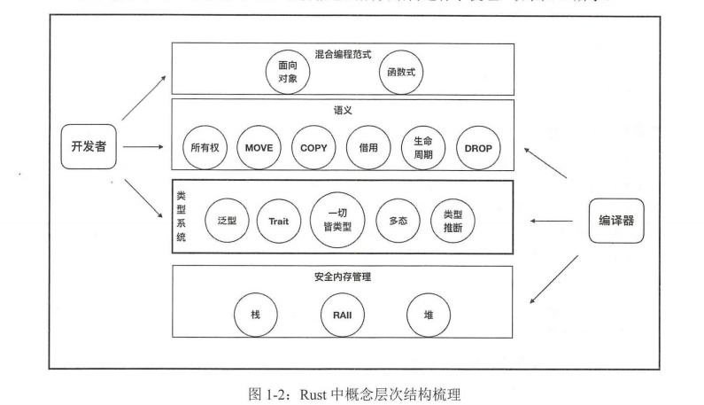
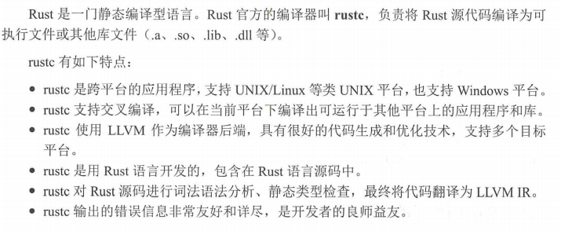
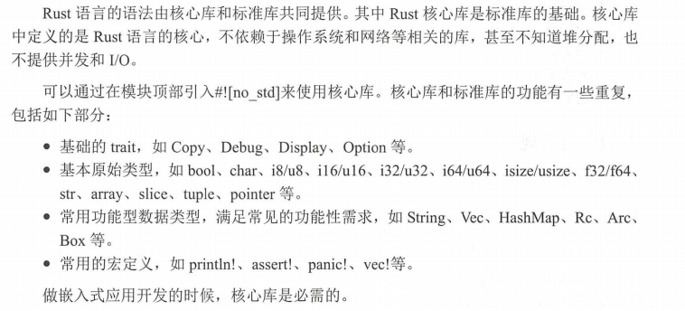

# Rust 的起源

1. 解决的问题
   - 难编写内存安全的代码
   - 难编写线程安全的代码

则 Rust 是一门 同时追求`安全`、`并发`和`性能`的现代系统级编程语言。

### 设计哲学

###  内存安全

> 未定义行为 是 引发点。
>
> Rust 保证就是类型安全

开发出来

1. 所有权系统。 每个被分配的内存都有一个独占其所有权的指针。只有当该指针被销毁时，其对应的内存才能被释放
2. 借用和声明周期。 每个变量都有生命周期，一旦超出，变量自动释放。如果是借用，则可以通过标记生命周期参数供编译器检查的方式，防止出现悬垂指针，也就是释放后使用的情况

其具备的特性：

1. 没有空指针
2. 默认不可变
3. 表达式
4. 高阶函数
5. 代数数据类型
6. 模式匹配
7. 泛型
8. trait 和关联类型
9. 本地类型推导
10. 仿射类型，该类型用来表达Rust所有权中的Move语义
11. 借用、生命周期

###  语言架构

## 语言精要

核心部件组成：

1. 语言规范
2. 编译器
3. 核心库
4. 标准库
5. 包管理器

### 语言规范

### 语句与表达式

1. 声明语句
   1. 用于声明各种语言项，包括声明变量、静态变量、常量、结构体、函数等，以及通过extern 和use 关键字 引入包和模块等。
   2. 表达式语句 ： 特指以分号结尾的表达式。此类表达式求值结果将会被舍弃，并总是返回单元类型()