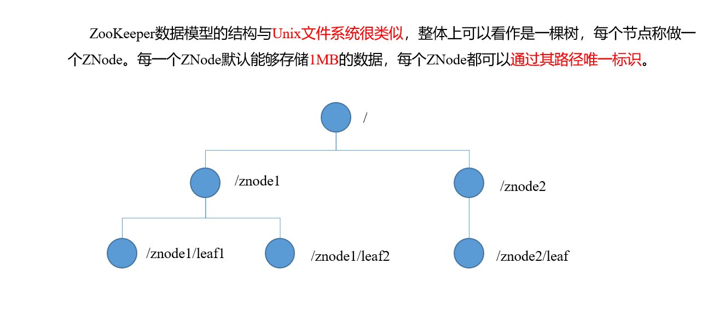

# Zookeeper 入梦

## 第一章 入梦

### 概述

Zookeeper是一个开源的分布式的，为分布式应用提供协调服务的Apache项目。


### 特点


### 数据结构



### 应用场景

提供的服务包括：统一命名服务、统一配置管理、统一集群管理、服务器节点动态上下线、软负载均衡等。


## 第二章：安装

### 本地模式安装部署

#### 安装前准备

1. 安装jdk
2. 拷贝Zookeeper到系统目录下
3. 解压到指定目录

#### 配置修改

1. 将/opt/module/zookeeper-3.4.10/conf这个路径下的zoo_sample.cfg修改为zoo.cfg；

2. 打开zoo.cfg文件，修改dataDir路径：

   ```txt
   dataDir=/opt/module/zookeeper-3.4.10/zkData
   ```

3. 在/opt/module/zookeeper-3.4.10/这个目录上创建zkData文件夹

#### 操作Zookeeper

1. 启动Zookeeper

   ```txt
   bin/zkServer.sh start
   ```

2. 查看进程是否启动

   ```txt
   jps
   ```

3. 查看状态

   ```txt
   bin/zkServer.sh status
   ZooKeeper JMX enabled by default
   
   ```

   

4. 启动客户端

   ```txt
    bin/zkCli.sh
   ```

   

5. 退出客户端

   ```txt
   quit
   ```

   

6. 停止Zookeeper

   ```txt
   bin/zkServer.sh stop
   ```

   

### 配置参数解读

Zookeeper中的配置文件zoo.cfg中参数含义解读如下：

1. tickTime =2000：通信心跳数，Zookeeper服务器与客户端心跳时间，单位毫秒
   - Zookeeper使用的基本时间，服务器之间或客户端与服务器之间维持心跳的时间间隔，也就是每个tickTime时间就会发送一个心跳，时间单位为毫秒。
   - 它用于心跳机制，并且设置最小的session超时时间为两倍心跳时间。(session的最小超时时间是2*tickTime) 
2. initLimit =10：LF初始通信时限
   - 集群中的Follower跟随者服务器与Leader领导者服务器之间初始连接时能容忍的最多心跳数（tickTime的数量），用它来限定集群中的Zookeeper服务器连接到Leader的时限。
3. syncLimit =5：LF同步通信时限
   - 集群中Leader与Follower之间的最大响应时间单位，假如响应超过syncLimit * tickTime，Leader认为Follwer死掉，从服务器列表中删除Follwer。
4. dataDir：数据文件目录+数据持久化路径
   - 主要用于保存Zookeeper中的数据。
5. clientPort =2181：客户端连接端口
   - 监听客户端连接的端口。

## 第三章 ： Zookeeper内部原理

### 3.1 选举机制（面试重点）

#### 1. 半数机制 ： 集群中半数以上机器存活，集群可用。所以Zookeeper 适合安装奇数台服务器

#### 2. Zookeeper虽然在配置文件中并没有指定Master和Slave。但是，Zookeeper工作时，是有一个节点为Leader，其他则为Follower，Leader是通过内部的选举机制临时产生的。

#### 以一个简单的例子来说明整个选举的过程。

假设有五台服务器组成的Zookeeper集群，它们的id从1-5，同时它们都是最新启动的，也就是没有历史数据，在存放数据量这一点上，都是一样的。假设这些服务器依序启动，来看看会发生什么，如图5-8所示。

           

（1）服务器1启动，此时只有它一台服务器启动了，它发出去的报文没有任何响应，所以它的选举状态一直是LOOKING状态。

（2）服务器2启动，它与最开始启动的服务器1进行通信，互相交换自己的选举结果，由于两者都没有历史数据，所以id值较大的服务器2胜出，但是由于没有达到超过半数以上的服务器都同意选举它(这个例子中的半数以上是3)，所以服务器1、2还是继续保持LOOKING状态。

（3）服务器3启动，根据前面的理论分析，服务器3成为服务器1、2、3中的老大，而与上面不同的是，此时有三台服务器选举了它，所以它成为了这次选举的Leader。

（4）服务器4启动，根据前面的分析，理论上服务器4应该是服务器1、2、3、4中最大的，但是由于前面已经有半数以上的服务器选举了服务器3，所以它只能接收当小弟的命了。

（5）服务器5启动，同4一样当小弟。


### 3.2 结点类型


### 3.3 stat结构体

1. czxid-创建节点的事务zxid

   - 每次修改ZooKeeper状态都会收到一个zxid形式的时间戳，也就是ZooKeeper事务ID。

   - 事务ID是ZooKeeper中所有修改总的次序。每个修改都有唯一的zxid，如果zxid1小于zxid2，那么zxid1在zxid2之前发生。

2. ctime - znode被创建的毫秒数(从1970年开始)

3. mzxid - znode最后更新的事务zxid

4. mtime - znode最后修改的毫秒数(从1970年开始)

5. pZxid-znode最后更新的子节点zxid

6. cversion - znode子节点变化号，znode子节点修改次数

7. dataversion - znode数据变化号

8. aclVersion - znode访问控制列表的变化号

9. ephemeralOwner- 如果是临时节点，这个是znode拥有者的session id。如果不是临时节点则是0。

10. **dataLength- znode的数据长度**

11. **numChildren - znode子节点数量**

### 监听器原理


### 写数据流程


## 第四章 ： zook实战

### 分布式安装部署

1. 集群规划，

   将上次的hadoop100 -101 进行部署

2. 解压安装

3. 同步内容

   xsync  zook---

4. 配置服务器编号

   1. 在软件目录下，创建zkData
   2. 目录下，创建myid的文件
   3. 编辑myid文件
      - 添加server对应的编号
   4. 将文件拷贝其他的zookeeper 服务器上

5. 配置zoo.cfg文件

   1. 先重命名zoo_sample.cfg -> zoo.cfg

   2. 打开编辑

      ```txt
      dataDir=/opt/module/zookeeper-3.4.10/zkData
      ```

   3. 增加配置

      ```txt
      #######################cluster##########################
      server.2=hadoop100:2888:3888
      server.3=hadoop101:2888:3888
      server.4=hadoop102:2888:3888
      
      ```

   4. 用xsync同步配置

   5. 配置参数解读

      ```txt
      A是一个数字，表示这个是第几号服务器；
      集群模式下配置一个文件myid，这个文件在dataDir目录下，这个文件里面有一个数据就是A的值，Zookeeper启动时读取此文件，拿到里面的数据与zoo.cfg里面的配置信息比较从而判断到底是哪个server。
      B是这个服务器的ip地址；
      C是这个服务器与集群中的Leader服务器交换信息的端口；
      D是万一集群中的Leader服务器挂了，需要一个端口来重新进行选举，选出一个新的Leader，而这个端口就是用来执行选举时服务器相互通信的端口。
      
      ```

6. 集群操作

   1. 分别启动Zookeeper

      ```txt
      bin/zkServer.sh start
      ```

   2. 查看状态

#### 客户端命令行操作

| 命令基本语法      | 功能描述                                           |
| ----------------- | -------------------------------------------------- |
| help              | 显示所有操作命令                                   |
| ls path [watch]   | 使用 ls 命令来查看当前znode中所包含的内容          |
| ls2 path  [watch] | 查看当前节点数据并能看到更新次数等数据             |
| create            | 普通创建  -s 含有序列  -e 临时（重启或者超时消失） |
| get path  [watch] | 获得节点的值                                       |
| set               | 设置节点的具体值                                   |
| stat              | 查看节点状态                                       |
| delete            | 删除节点                                           |
| rmr               | 递归删除节点                                       |

例子

```txt
1．启动客户端 bin/zkCli.sh
2．显示所有操作命令 help
3.查看当前znode中所包含的内容   ls /
4．查看当前节点详细数据  ls2 /
5．分别创建2个普通节点
create /sanguo "jinlian"  Created /sanguo
create /sanguo/shuguo "liubei"  Created /sanguo/shuguo
6．获得节点的值
get /sanguo

get /sanguo/shuguo

7．创建短暂节点
create -e /sanguo/wuguo "zhouyu"
Created /sanguo/wuguo
（1）在当前客户端是能查看到的
 ls /sanguo 

（2）退出当前客户端然后再重启客户端
quit
bin/zkCli.sh
（3）再次查看根目录下短暂节点已经删除
ls /sanguo

8．创建带序号的节点
	（1）先创建一个普通的根节点/sanguo/weiguo
create /sanguo/weiguo "caocao"
Created /sanguo/weiguo
	（2）创建带序号的节点
create -s /sanguo/weiguo/xiaoqiao "jinlian"
Created /sanguo/weiguo/xiaoqiao0000000000
create -s /sanguo/weiguo/daqiao "jinlian"
Created /sanguo/weiguo/daqiao0000000001
create -s /sanguo/weiguo/diaocan "jinlian"
Created /sanguo/weiguo/diaocan0000000002
如果原来没有序号节点，序号从0开始依次递增。如果原节点下已有2个节点，则再排序时从2开始，以此类推。
9．修改节点数据值
set /sanguo/weiguo "simayi"
10．节点的值变化监听
	（1）在hadoop102主机上注册监听/sanguo节点数据变化
[zk: localhost:2181(CONNECTED) 26] [zk: localhost:2181(CONNECTED) 8] get /sanguo watch
	（2）在hadoop101主机上修改/sanguo节点的数据
[zk: localhost:2181(CONNECTED) 1] set /sanguo "xisi"
	（3）观察hadoop102主机收到数据变化的监听
WATCHER::
WatchedEvent state:SyncConnected type:NodeDataChanged path:/sanguo
11．节点的子节点变化监听（路径变化）
	（1）在hadoop102主机上注册监听/sanguo节点的子节点变化
 ls /sanguo watch

	（2）在hadoop101主机/sanguo节点上创建子节点
create /sanguo/jin "simayi"
Created /sanguo/jin
	（3）观察hadoop102主机收到子节点变化的监听
WATCHER::
WatchedEvent state:SyncConnected type:NodeChildrenChanged path:/sanguo
12．删除节点
delete /sanguo/jin
13．递归删除节点
 rmr /sanguo/shuguo
14．查看节点状态
 stat /sanguo

```


#### API 应用

##### 环境搭建

1. maven工程

2. pom文件

   ```txt
   <dependencies>
   		<dependency>
   			<groupId>junit</groupId>
   			<artifactId>junit</artifactId>
   			<version>RELEASE</version>
   		</dependency>
   		<dependency>
   			<groupId>org.apache.logging.log4j</groupId>
   			<artifactId>log4j-core</artifactId>
   			<version>2.8.2</version>
   		</dependency>
   		<!-- https://mvnrepository.com/artifact/org.apache.zookeeper/zookeeper -->
   		<dependency>
   			<groupId>org.apache.zookeeper</groupId>
   			<artifactId>zookeeper</artifactId>
   			<version>3.4.10</version>
   		</dependency>
   </dependencies>
   
   ```

3. 拷贝log4j.properties文件到项目根目录

   ```txt
   log4j.rootLogger=INFO, stdout  
   log4j.appender.stdout=org.apache.log4j.ConsoleAppender  
   log4j.appender.stdout.layout=org.apache.log4j.PatternLayout  
   log4j.appender.stdout.layout.ConversionPattern=%d %p [%c] - %m%n  
   log4j.appender.logfile=org.apache.log4j.FileAppender  
   log4j.appender.logfile.File=target/spring.log  
   log4j.appender.logfile.layout=org.apache.log4j.PatternLayout  
   log4j.appender.logfile.layout.ConversionPattern=%d %p [%c] - %m%n  
   
   ```

##### 创建Zookeeper 客户端

```java
rivate static String connectString =
 "hadoop102:2181,hadoop103:2181,hadoop104:2181";
	private static int sessionTimeout = 2000;
	private ZooKeeper zkClient = null;

	@Before
	public void init() throws Exception {

	zkClient = new ZooKeeper(connectString, sessionTimeout, new Watcher() {

			@Override
			public void process(WatchedEvent event) {

				// 收到事件通知后的回调函数（用户的业务逻辑）
				System.out.println(event.getType() + "--" + event.getPath());

				// 再次启动监听
				try {
					zkClient.getChildren("/", true);
				} catch (Exception e) {
					e.printStackTrace();
				}
			}
		});
	}

```

##### 创建子节点

```txt
// 创建子节点
@Test
public void create() throws Exception {

		// 参数1：要创建的节点的路径； 参数2：节点数据 ； 参数3：节点权限 ；参数4：节点的类型
		String nodeCreated = zkClient.create("/lan", "jinlian".getBytes(), Ids.OPEN_ACL_UNSAFE, CreateMode.PERSISTENT);
}

```

##### 获取子节点并监听节点变化

```java
// 获取子节点
@Test
public void getChildren() throws Exception {

		List<String> children = zkClient.getChildren("/", true);

		for (String child : children) {
			System.out.println(child);
		}

		// 延时阻塞
		Thread.sleep(Long.MAX_VALUE);
}

```


##### 判断znode是否存在

```java
// 判断znode是否存在
@Test
public void exist() throws Exception {

	Stat stat = zkClient.exists("/eclipse", false);

	System.out.println(stat == null ? "not exist" : "exist");
}

```

### 监听服务器节点动态上下线案例

1. 需求

   某分布式系统中，主节点可以有多台，可以动态上下线，任意一台客户端都能实时感知到主节点服务器的上下线。

2. 需求分析，图式

   


3. 具体实现

   1. 先在集群上创建/server节点

      ```txt
      create /servers "servers"
      Created /servers
      
      ```

   2. 服务器向Zookeeper 注册代码

      ```java
      import java.io.IOException;
      import org.apache.zookeeper.CreateMode;
      import org.apache.zookeeper.WatchedEvent;
      import org.apache.zookeeper.Watcher;
      import org.apache.zookeeper.ZooKeeper;
      import org.apache.zookeeper.ZooDefs.Ids;
      
      public class DistributeServer {
      
      	private static String connectString = "hadoop102:2181,hadoop103:2181,hadoop104:2181";
      	private static int sessionTimeout = 2000;
      	private ZooKeeper zk = null;
      	private String parentNode = "/servers";
      	
      	// 创建到zk的客户端连接
      	public void getConnect() throws IOException{
      		
      		zk = new ZooKeeper(connectString, sessionTimeout, new Watcher() {
      
      			@Override
      			public void process(WatchedEvent event) {
      
      			}
      		});
      	}
      	
      	// 注册服务器
      	public void registServer(String hostname) throws Exception{
      
      		String create = zk.create(parentNode + "/server", hostname.getBytes(), Ids.OPEN_ACL_UNSAFE, CreateMode.EPHEMERAL_SEQUENTIAL);
      		
      		System.out.println(hostname +" is online "+ create);
      	}
      	
      	// 业务功能
      	public void business(String hostname) throws Exception{
      		System.out.println(hostname+" is working ...");
      		
      		Thread.sleep(Long.MAX_VALUE);
      	}
      	
      	public static void main(String[] args) throws Exception {
      		
      // 1获取zk连接
      		DistributeServer server = new DistributeServer();
      		server.getConnect();
      		
      		// 2 利用zk连接注册服务器信息
      		server.registServer(args[0]);
      		
      		// 3 启动业务功能
      		server.business(args[0]);
      	}
      }
      
      ```

   3. 客户端代码

      ```java
      import java.io.IOException;
      import java.util.ArrayList;
      import java.util.List;
      import org.apache.zookeeper.WatchedEvent;
      import org.apache.zookeeper.Watcher;
      import org.apache.zookeeper.ZooKeeper;
      
      public class DistributeClient {
      
      	private static String connectString = "hadoop102:2181,hadoop103:2181,hadoop104:2181";
      	private static int sessionTimeout = 2000;
      	private ZooKeeper zk = null;
      	private String parentNode = "/servers";
      
      	// 创建到zk的客户端连接
      	public void getConnect() throws IOException {
      		zk = new ZooKeeper(connectString, sessionTimeout, new Watcher() {
      
      			@Override
      			public void process(WatchedEvent event) {
      
      				// 再次启动监听
      				try {
      					getServerList();
      				} catch (Exception e) {
      					e.printStackTrace();
      				}
      			}
      		});
      	}
      
      	// 获取服务器列表信息
      	public void getServerList() throws Exception {
      		
      		// 1获取服务器子节点信息，并且对父节点进行监听
      		List<String> children = zk.getChildren(parentNode, true);
      
              // 2存储服务器信息列表
      		ArrayList<String> servers = new ArrayList<>();
      		
              // 3遍历所有节点，获取节点中的主机名称信息
      		for (String child : children) {
      			byte[] data = zk.getData(parentNode + "/" + child, false, null);
      
      			servers.add(new String(data));
      		}
      
              // 4打印服务器列表信息
      		System.out.println(servers);
      	}
      
      	// 业务功能
      	public void business() throws Exception{
      
      		System.out.println("client is working ...");
      Thread.sleep(Long.MAX_VALUE);
      	}
      
      	public static void main(String[] args) throws Exception {
      
      		// 1获取zk连接
      		DistributeClient client = new DistributeClient();
      		client.getConnect();
      
      		// 2获取servers的子节点信息，从中获取服务器信息列表
      		client.getServerList();
      
      		// 3业务进程启动
      		client.business();
      	}
      }
      
      ```

      