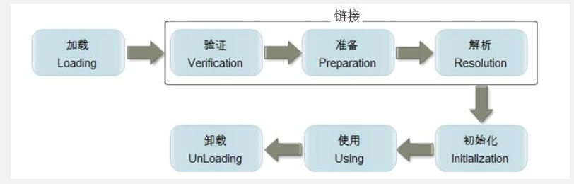
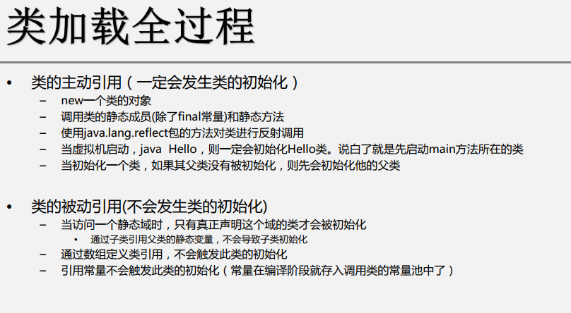
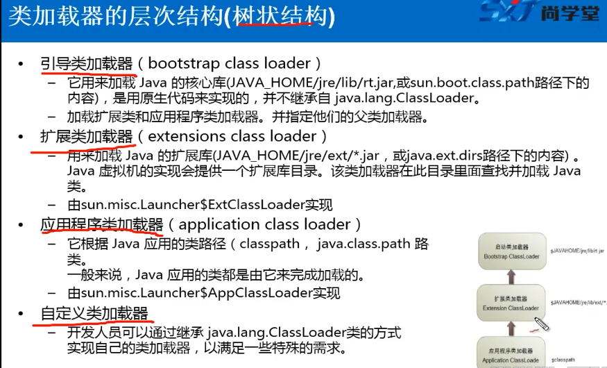
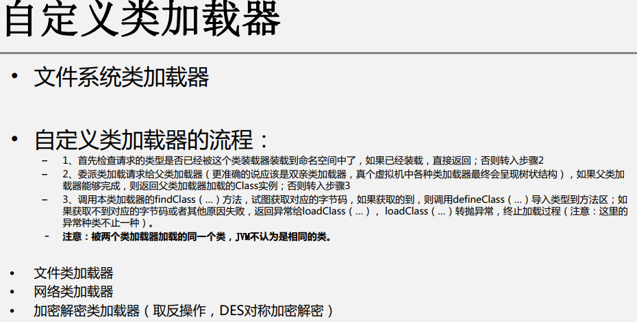
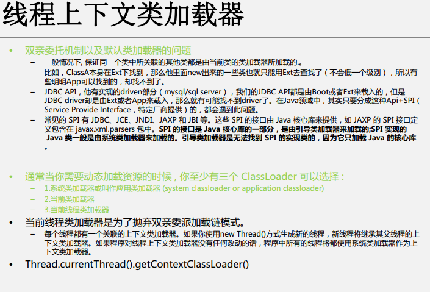
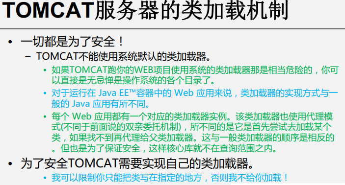

# Annotation 内置注解


作用 ： 对程序的说明，和解释，，帮助程序的处理
## 在什么地方使用
在 包，类，方法上面

## 常用内置注解
1. Override  为修辞方法，表示重写某个方法
2. Deprecated 为修辞方法，属性，类，表示不鼓励程序员使用这样的元素
3. suppressWarnings ，用来抑制编译时的警告信息(里面可以添加参数)


## 反射机制
### 1. 概念
1. 指的是可以于运行时的加载，探知，使用编译期间完全未知的类
2. 程序在运行状态中，可以动态加载一个只有名称的类，对于任意一个已加载的类，都能够知道这个类的所有属性和方法；对于
任意一个对象，都能够调用它的任意一个方法和属性
```java
Class c = Class.forName("com.study.test.User");
```
3. 加载完类之后，在堆内存中，就会产生一个Class类型的对象，这个对象是==唯一的== 并且包含了完整的类的结构信息。
我们可以通过这个对象看到类的结构。这个可以称之为 反射


### 2. 作用
1. 动态加载类、动态获取类的信息（属性、方法、构造器）
2. 动态构造对象
3. 动态调用类和对象的任意方法、构造器
4. 动态调用和处理属性
5. 获取泛型信息
6. 处理注解


## java 6.0 引入了动态编译机制
### 1. 动态编译的应用场景
1. 可以做一个浏览器端编写java代码，上传服务器编辑和运行的在线评测系统
2. 服务器动态加载某些类文件进行编译

### 2. 动态编译的两种做法
1. 通过 Runtime 调用javac ，启动新的进程去操作
```java
Runtime run = Runtime.getRuntime();
Process process = run.exec("javac -cp d:/...  helloworld.java");
```
2. 通过javaCompiler 动态编译
看demo


## 脚本引擎执行JavaScript代码
### 1. 脚本引擎介绍
是的java应用程序可以通过一套固定的接口与各种脚本引擎交互，从而达到在java平台上调用各种脚本语言的目的
也可以将一些复杂异变的业务逻辑交给脚本语言处理，这又提高了开发效率

### 2. 获得脚本引擎对象
```java
ScriptEngineManager sem = new ScriptEngineManager();
ScriptEngine engine = sem.getEngineByName("javascript")
```


## 字节码操作
看demo

## JVM 运行和类加载全过程
### 1. 类加载机制
jVM 把Class 文件加载到内存，并对数据进行校验、解析和初始化，最终形成jVM可以直接使用的java类型的过程
加载： 把class 文件字节码内容加载到内存中，并将这些数据转换成方法区中的运行时数据结构，在堆中生成一个代表这个类的java.lang.Class对象，作为入口


### 2. 类加载的全过程
1. 链接 将Java类的二进制代码合并到JVM的运行状态之中的过程
 - 验证：
    - 确保加载的类信息符合JVM规范，没有安全方面的问题。
 - 准备：
    - 正式为类变量(static变量)分配内存并设置类变量初始值的阶段，这些内存都将在方法区中进行分配
 - 解析
    -  虚拟机常量池内的符号引用替换为直接引用的过程
    - 初始化
 - 初始化阶段是执行类构造器<clinit>()方法的过程。类构造器<clinit>()方法是由编译器自动收集
        类中的所有类变量的赋值动作和静态语句块(static块)中的语句合并产生的。
 - 当初始化一个类的时候，如果发现其父类还没有进行过初始化、则需要先出发其父类的初始化
 - 虚拟机会保证一个类的<clinit>()方法在多线程环境中被正确加锁和同步。
    


## 深入了解类加载过程
### 1. 类加载器的作用
1. 将Class 文件字节码内容加载到内存中，并将这些静态数据转换成方法区中的运行时的数据结构，在堆中生成一个代表这个类的独享，作为
方法去类数据的访问入口

2. 类缓存
 - 标准的javaSE类加载器可以按要去查找类，但一旦某个类被加载到类加载器中，它将维持加载（缓存）一段时间。不过jVM 垃圾收集器可回收这些Class对象
3. 类加载器的层次结构（树状结构）



### 2. 类加载器的代理模式
- 代理模式
 - 交给其他加载器来加载指定的类
- 双亲委托机制
    - 就是某个特定的类加载器在接到加载类的请求时，首先将加载任务委托给父类加载器，依次回溯，知道最高的爷爷辈的，如果父类加载器
    可以完成类加载任务，就成功返回；只有父类加载器无法完成此加载任务时，才自己去加载。
    - 这个机制 是为了 保证java核心库的类型安全
        ==保证不会出现用户自己能定义java.lang.Object类的情况==
    - 类加载器除了用于加载类，也是安全的最基本的屏障

- 这种机制也是代理模式的一种

### 3. 自定义类加载器


### 4. 线程上下文类加载器


### 5. JAVAEE服务器的类加载机制


