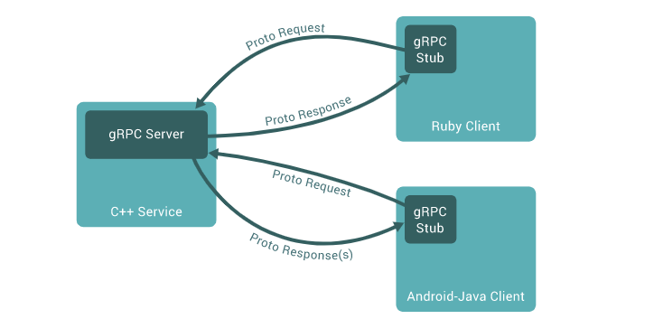
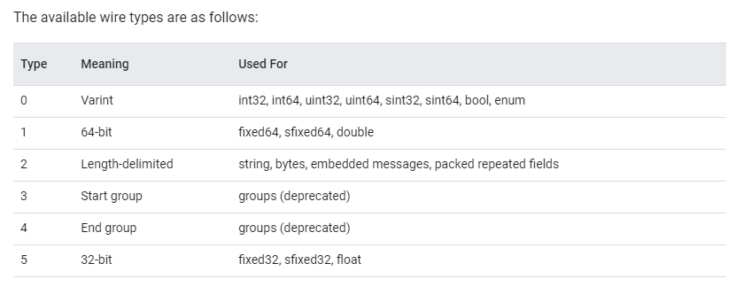

# gRPC

> gRPC 可以使用协议缓冲区（protocol-buffers）作为接口定义语言IDL和其底层消息交换格式


## 概述：

> 在 gRPC 中，客户端应用程序可以直接调用不同机器上的服务器应用程序上的方法，就像它是本地对象一样，使您可以更轻松地创建分布式应用程序和服务.
>
> 与许多 RPC 系统一样，gRPC 基于定义服务的思想，指定可以通过参数和返回类型远程调用的方法。在服务器端，服务器实现了这个接口并运行一个 gRPC 服务器来处理客户端调用。在客户端，客户端有一个存根（在某些语言中简称为客户端），它提供与服务器相同的方法。
>
> 适用于 java 、go、python、ruby 客户端




## 使用协议缓冲区

> 默认情况下，gRPC使用[protocol-buffers](https://developers.google.com/protocol-buffers/docs/overview),谷歌成熟的用于结构化数据序列化的开源机制
>
> 使用协议缓冲区的第一步是定义在`proto`文件中序列化的数据的结构： 扩展名为.proto 的不同文本文件。
>
> 协议缓冲区数据被构造为消息，其中每条消息都是小的信息逻辑记录，包含a series of name-value pairs called *fields*

```protobuf
message Person {
  string name = 1;
  int32 id = 2;
  bool has_ponycopter = 3;
}
```


> 可以上述斍中定义gRPC 服务，并将RPC 方法参数和返回类型指定为协议缓冲区消息：

```protobuf
// The greeter service definition.
service Greeter {
  // Sends a greeting
  rpc SayHello (HelloRequest) returns (HelloReply) {}
}

// The request message containing the user's name.
message HelloRequest {
  string name = 1;
}

// The response message containing the greetings
message HelloReply {
  string message = 1;
}
```


## 协议缓冲区版本

虽然[协议缓冲区](https://developers.google.com/protocol-buffers/docs/overview)开源用户已经可以使用一段时间了，该站点的大多数示例使用协议缓冲区版本 3 (proto3)，它具有稍微简化的语法、一些有用的新功能并支持更多语言。Proto3 目前可用于 Java、C++、Dart、Python、Objective-C、C#、精简版运行时（Android Java）、Ruby 和来自[协议缓冲区 GitHub 存储库的](https://github.com/google/protobuf/releases)JavaScript ，以及来自[golang/protobuf 官方包](https://pkg.go.dev/google.golang.org/protobuf)的 Go 语言生成器 ，更多的语言正在开发中。您可以在[proto3 语言指南中](https://developers.google.com/protocol-buffers/docs/proto3)找到更多信息和[参考文档](https://developers.google.com/protocol-buffers/docs/reference/overview)可用于每种语言。参考文档还包括[正式的规范](https://developers.google.com/protocol-buffers/docs/reference/proto3-spec)对于`.proto`文件格式。

一般来说，虽然您可以使用 proto2（当前的默认协议缓冲区版本），但我们建议您将 proto3 与 gRPC 一起使用，因为它可以让您使用所有 gRPC 支持的语言，并避免与 proto2 客户端通信的兼容性问题proto3 服务器，反之亦然。


## 核心改变、架构和生命周期

### 概述

#### 服务定义

> gRPC 基于定义服务的思想，指定可以通过参数和返回类型远程调用的方法。默认情况下，gRPC 使用协议缓冲区作为接口定义语言（IDL），用于描述接口和有效载荷信息的结构。

```protobuf
service HelloService {
  rpc SayHello (HelloRequest) returns (HelloResponse);
}

message HelloRequest {
  string greeting = 1;
}

message HelloResponse {
  string reply = 1;
}
```

gRPC容许定义四种服务方法:

1. 客户端向服务器发送单个请求并返回单个响应，就像普通函数调用一样

   ```protobuf
   rpc SayHello(HelloRequest) returns (HelloResponse);
   ```

2. 服务器流程RPC，客户端向服务器发送请求并获取流以读取一系列的消息。客户端从返回的流中读取，直到没有更多的消息。gRPC 保证单个RPC调用中的消息排序

   ```protobuf
   rpc LotsOfReplies(HelloRequest) returns (stream HelloResponse);
   ```

3. 客户端流式RPC，客户端写入一系列消息并将他们发送到服务器，再次使用提供的流。一旦客户端完成写入消息，它等待服务器读取他们并返回其响应。gRPC 再次保证单个RPC 调用中的消息排序

   ```protobuf
   rpc LotsOfGreetings(stream HelloRequest) returns (HelloResponse);
   ```

4. 双向流式RPC，其中双方使用读写流发送一系列消息。这个两个流独立运行，因此客户端和服务器可以按照他们喜欢的任何顺序进行读写： 例如，服务器可以写入响应之前等待接收所有客户端信息，或者它可以交替读取消息然后写入消息，或其他一些读取和写入的组合。保留每个流中消息的顺序。

   ```protobuf
   rpc BidiHello(stream HelloRequest) returns (stream HelloResponse);
   ```

   

#### 同步与异步

> 在服务器响应到达之前阻塞的同步RPC调用最接近RPC 所追求的过程调用的抽象。
>
> 另一方面，网络本质上是异步的，在许多情况下，能够在不阻塞当前线程的情况下启动 RPC 很有用

#### RPC生命周期

##### Unary RPC

首先考虑客户端发送单个请求并返回单个响应的最简单的 RPC 类型。

1. 一旦客户端调用了存根方法，服务器就会收到通知：RPC 已经被调用，其中包含客户端的[元数据](https://www.grpc.io/docs/what-is-grpc/core-concepts/#metadata) 、方法名称和指定的[截止日期（](https://www.grpc.io/docs/what-is-grpc/core-concepts/#deadlines)如果适用）。
2. 然后服务器可以立即发回它自己的初始元数据（必须在任何响应之前发送），或者等待客户端的请求消息。首先发生的是特定于应用程序的。
3. 一旦服务器收到客户端的请求消息，它就会执行创建和填充响应所需的任何工作。然后将响应（如果成功）连同状态详细信息（状态代码和可选状态消息）和可选的尾随元数据一起返回给客户端。
4. 如果响应状态为OK，则客户端得到响应，在客户端完成调用。


##### Server streaming RPC

服务器流式 RPC 类似于一元 RPC，不同之处在于服务器返回消息流以响应客户端的请求。发送完所有消息后，服务器的状态详细信息（状态代码和可选状态消息）和可选的尾随元数据将发送到客户端。这样就完成了服务器端的处理。一旦客户端拥有服务器的所有消息，它就完成了

##### Client streaming RPC

客户端流式 RPC 类似于一元 RPC，不同之处在于客户端向服务器发送消息流而不是单个消息。服务器用一条消息（连同它的状态详细信息和可选的尾随元数据）进行响应，通常但不一定是在它收到所有客户端的消息之后。

##### Bidirectional streaming RPC

在双向流式 RPC 中，调用由调用方法的客户端和接收客户端元数据、方法名称和截止日期的服务器发起。服务器可以选择发回其初始元数据或等待客户端开始流式传输消息。

客户端和服务器端流处理是特定于应用程序的。由于两个流是独立的，客户端和服务器可以按任意顺序读写消息。例如，服务器可以等到收到所有客户端的消息后再写入消息，或者服务器和客户端可以玩“乒乓”——服务器收到请求，然后发回响应，然后客户端发送基于响应的另一个请求，依此类推。


####  截止日期/超时

指定截止日期或超时是特定于语言的：某些语言 API 根据超时（时间持续时间）工作，而某些语言 API 根据截止日期（固定时间点）工作，并且可能有也可能没有默认截止日期。


#### RPC 终止

在 gRPC 中，客户端和服务器都对调用的成功做出独立和本地的判断，它们的结论可能不一致。这意味着，例如，您可能有一个 RPC 在服务器端成功完成（“我已经发送了我所有的响应！”）但在客户端失败（“响应在我的截止日期之后到达！”）。服务器也有可能在客户端发送其所有请求之前决定完成。


#### 元数据

元数据是键值对列表形式的特定 RPC 调用的信息（例如[身份验证详细信息](https://www.grpc.io/docs/guides/auth/)），其中键是字符串，值通常是字符串，但也可以是二进制数据。元数据对 gRPC 本身是不透明的——它允许客户端提供与服务器调用相关的信息，反之亦然。

对元数据的访问取决于语言。


#### 频道

gRPC 通道提供到指定主机和端口上的 gRPC 服务器的连接。它在创建客户端存根时使用。客户端可以指定通道参数来修改 gRPC 的默认行为，例如打开或关闭消息压缩。通道具有状态，包括`connected`和`idle`。

gRPC 如何处理关闭通道取决于语言。某些语言还允许查询通道状态。

# protocol-buffers

> 主要学习如何使用protocol-buffers 来构建协议缓冲区数据，包含.proto 文件语法以及如何从.proto 文件生成数据访问类。


#### 定义消息类型

```protobuf
message SearchRequest {
  required string query = 1;
  optional int32 page_number = 2;
  optional int32 result_per_page = 3;
}
```


##### 指定字段类型

`除了以下的标准字段类型，还可以指定字段为复合类型、包括枚举和其他消息类型`

| .proto Type | Notes                                                        | C++ Type | Java Type  | Python Type[2]                       | Go Type  |
| :---------- | :----------------------------------------------------------- | :------- | :--------- | :----------------------------------- | :------- |
| double      |                                                              | double   | double     | float                                | *float64 |
| float       |                                                              | float    | float      | float                                | *float32 |
| int32       | Uses variable-length encoding. Inefficient for encoding negative numbers – if your field is likely to have negative values, use sint32 instead. | int32    | int        | int                                  | *int32   |
| int64       | Uses variable-length encoding. Inefficient for encoding negative numbers – if your field is likely to have negative values, use sint64 instead. | int64    | long       | int/long[3]                          | *int64   |
| uint32      | Uses variable-length encoding.                               | uint32   | int[1]     | int/long[3]                          | *uint32  |
| uint64      | Uses variable-length encoding.                               | uint64   | long[1]    | int/long[3]                          | *uint64  |
| sint32      | Uses variable-length encoding. Signed int value. These more efficiently encode negative numbers than regular int32s. | int32    | int        | int                                  | *int32   |
| sint64      | Uses variable-length encoding. Signed int value. These more efficiently encode negative numbers than regular int64s. | int64    | long       | int/long[3]                          | *int64   |
| fixed32     | Always four bytes. More efficient than uint32 if values are often greater than 228. | uint32   | int[1]     | int/long[3]                          | *uint32  |
| fixed64     | Always eight bytes. More efficient than uint64 if values are often greater than 256. | uint64   | long[1]    | int/long[3]                          | *uint64  |
| sfixed32    | Always four bytes.                                           | int32    | int        | int                                  | *int32   |
| sfixed64    | Always eight bytes.                                          | int64    | long       | int/long[3]                          | *int64   |
| bool        |                                                              | bool     | boolean    | bool                                 | *bool    |
| string      | A string must always contain UTF-8 encoded or 7-bit ASCII text. | string   | String     | unicode (Python 2) or str (Python 3) | *string  |
| bytes       | May contain any arbitrary sequence of bytes.                 | string   | ByteString | bytes                                | []byte   |

当您在[Protocol Buffer Encoding 中](https://developers.google.com/protocol-buffers/docs/encoding)序列化您的消息时，您可以找到有关这些类型如何编码的更多信息。

[1]在 Java 中，无符号 32 位和 64 位整数使用它们的有符号对应物表示，最高位简单地存储在符号位中。

[2]在所有情况下，为字段设置值将执行类型检查以确保其有效。

[3] 64 位或无符号 32 位整数在解码时总是表示为 long，但如果在设置字段时给出 int，则可以是 int。在所有情况下，该值必须适合设置时表示的类型。见[2]。


##### 分配字段编号

消息定义中的每个字段都有一个唯一的编号。`一旦被消息类型使用，就不应该类型。`

**注意！！！ 1 到 15 范围内的字段编号占用一个字节进行编码，包括字段编号和字段类型。 16 到2047 范围内的字段编号占用两个字节。**因此，为将来可能添加的频繁的元素留出一些空间。


##### 指定字段规则

- required ： 格式正确的消息必须恰好具有此字段之一
- optional ： 格式正确的消息可以有零个或一个此字段（但不能超过一个）
- repeated ： 可以在格式良好的消息中重复任意此处（包含零次）。重复值的顺序将被保留。

[^标记]: 由于历史原因，repeated 标量数值类型的字段编码效率不高。新代码应使用特殊选项`[packed=true]`以获得更搞笑的编码

```protobuf
repeated int32 samples = 4 [packed = true]
```


##### 添加更多消息类型

> 即使容许添加更多的消息类型，但是不建议一个.proto 里面包含很多的消息类型


##### 注释

> 采用  C/C++ 样式   // 和   /**/ 语法


##### 保留字段

使用reserved 来 指定已删除字段编号或者名称

```protobuf
message Foo {
  reserved 2, 15, 9 to 11;
  reserved "foo", "bar";
}
```

[^标记]: 不能在同一 reserved 语句中混合使用字段名和字段编号


#### 可选字段和默认值

```protobuf
optional int32 result_per_page = 3 [default = 10];
```

- 对于字符串，默认为空字符串
- 对于字节，默认为空字节
- 对于bool,默认false
- 对于数字类型，默认为0，
- 对于枚举，默认是枚举类型中列出的第一个值


#### 枚举

> 枚举的用途： 希望其字段之一具有预定义的值列表之一。
>
>  具有`enum`类型的字段只能将一组指定的常量中的一个作为其值（如果您尝试提供不同的值，解析器会将其视为未知的场地）

```protobuf
message SearchRequest {
  required string query = 1;
  optional int32 page_number = 2;
  optional int32 result_per_page = 3 [default = 10];
  enum Corpus {
    UNIVERSAL = 0;
    WEB = 1;
    IMAGES = 2;
    LOCAL = 3;
    NEWS = 4;
    PRODUCTS = 5;
    VIDEO = 6;
  }
  optional Corpus corpus = 4 [default = UNIVERSAL];
}
```

#### 使用其他消息类型

> 可以使用同文件的消息体作为消息类型。 或者 使用导入另一个文件的消息体

```protobuf
message SearchResponse {
  repeated Result result = 1;
}

message Result {
  required string url = 1;
  optional string title = 2;
  repeated string snippets = 3;
}
```

##### 导入定义

```protobuf
import "myproject/other_protos.proto"
```


##### 使用proto3 消息类型

> 可以导入proto3消息类型并在proto2 只用，但是这个只用于向下兼容，但是proto2 不能在proto3 中使用


#### 嵌套类型

```protobuf
message SearchResponse {
  message Result {
    required string url = 1;
    optional string title = 2;
    repeated string snippets = 3;
  }
  repeated Result result = 1;
}
```

如果要在其父消息类型之外重用此消息类型，则将其称为 `_Parent_._Type_`

```protobuf
message SomeOtherMessage {
  optional SearchResponse.Result result = 1;
}
```


##### 团体

> `此功能放弃使用，使用嵌套消息类型`

```protobuf
message SearchResponse {
  repeated group Result = 1 {
    required string url = 2;
    optional string title = 3;
    repeated string snippets = 4;
  }
}
```


#### 更新消息类型

如果现有的消息类型不再满足您的所有需求——例如，您希望消息格式有一个额外的字段——但您仍然希望使用以旧格式创建的代码，请不要担心！在不破坏任何现有代码的情况下更新消息类型非常简单。请记住以下规则：

- 不要更改任何现有字段的字段编号
- 您添加的任何新字段都应该是`optional`或`repeated`。这意味着使用“旧”消息格式的代码序列化的任何消息都可以由新生成的代码解析，因为它们不会丢失任何`required`元素。您应该为这些元素设置合理的[默认值](https://developers.google.com/protocol-buffers/docs/overview#optional)，以便新代码可以与旧代码生成的消息正确交互。类似地，由新代码创建的消息可以由旧代码解析：旧二进制文件在解析时简单地忽略新字段。但是，未知字段不会被丢弃，如果消息稍后被序列化，未知字段也会随之序列化——因此如果将消息传递给新代码，新字段仍然可用。
- 可以删除非必填字段，只要在更新的消息类型中不再使用字段编号。您可能想要重命名该字段，也许添加前缀“OBSOLETE_”，或者[保留](https://developers.google.com/protocol-buffers/docs/overview#reserved)字段编号，以便您的未来用户`.proto`不会意外地重复使用该编号。
- 只要类型和编号保持不变，非必填字段可以转换为[扩展名](https://developers.google.com/protocol-buffers/docs/overview#extensions)，反之亦然。
- `int32`、`uint32`、`int64`、`uint64`和`bool`都兼容——这意味着您可以将字段从这些类型中的一种更改为另一种，而不会破坏向前或向后的兼容性。如果从连线中解析出的数字不适合相应类型，您将获得与在 C++ 中将该数字强制转换为该类型相同的效果（例如，如果将 64 位数字读取为 int32，它将被截断为 32 位）。
- `sint32`并且`sint64`彼此兼容，但与其他整数类型*不*兼容。
- `string`并且`bytes`只要字节是有效的 UTF-8 就兼容。
- `bytes`如果字节包含消息的编码版本，则嵌入的消息兼容。
- `fixed32`与兼容`sfixed32`，并`fixed64`用`sfixed64`。
- 对于`string`、`bytes`和 消息字段，`optional`与 兼容`repeated`。给定重复字段的序列化数据作为输入，`optional`如果它是原始类型字段，则期望此字段的客户端将采用最后一个输入值，如果它是消息类型字段，则合并所有输入元素。请注意，这**不是**一般的数值类型，包括布尔变量和枚举安全。数字类型的重复字段可以以[打包](https://developers.google.com/protocol-buffers/docs/encoding#packed)格式进行序列化，在`optional`预期字段时将无法正确解析。
- 更改默认值通常没问题，只要您记住默认值永远不会通过网络发送。因此，如果程序收到一条消息，其中没有设置特定字段，程序将看到默认值，因为它是在该程序的协议版本中定义的。它不会看到在发件人代码中定义的默认值。
- `enum`与`int32`, `uint32`, `int64`, 和`uint64`有线格式兼容（请注意，如果不适合，值将被截断），但请注意，当消息被反序列化时，客户端代码可能会以不同的方式对待它们。值得注意的是，`enum`当消息被反序列化时，无法识别的值会被丢弃，这使得字段的`has..`访问器返回 false 并且它的 getter 返回`enum`定义中列出的第一个值，或者如果指定了默认值。在重复枚举字段的情况下，任何无法识别的值都会从列表中删除。但是，整数字段将始终保留其值。因此，在将整数升级为 an 时，您需要非常小心`enum`，以免在线路上接收越界枚举值。
- 在当前的 Java 和 C++ 实现中，当`enum`去除无法识别的值时，它们会与其他未知字段一起存储。请注意，如果此数据被序列化，然后由识别这些值的客户端重新解析，这可能会导致奇怪的行为。在可选字段的情况下，即使在原始消息反序列化后写入了新值，识别它的客户端仍将读取旧值。在重复字段的情况下，旧值将出现在任何已识别和新添加的值之后，这意味着不会保留顺序。
- 将单个`optional`值更改为**新** 值的成员`oneof`是安全且二进制兼容的。如果您确定没有代码一次设置多个，则将多个`optional`字段移入一个新字段`oneof`可能是安全的。将任何字段移动到现有字段中`oneof`都是不安全的。
- 更改 a`map<K, V>`和相应`repeated`消息字段之间的字段是二进制兼容的（有关消息布局和其他限制，请参阅下面的[Maps](https://developers.google.com/protocol-buffers/docs/overview#maps)）。但是，更改的安全性取决于应用程序：在反序列化和重新序列化消息时，使用`repeated`字段定义的客户端将产生语义相同的结果；但是，使用`map`字段定义的客户端可能会重新排序条目并删除具有重复键的条目。


#### 扩展

> 扩展容许你声明消息中的一系列字段编号可用于第三方扩展。扩展名是原始.proto 文件未定义类型的字段的占位符

```protobuf
message Foo {
  // ...
  extensions 100 to 199;
}
```

这表示字段编号 [100, 199] 的范围`Foo`是为扩展保留的。其他用户现在可以使用您指定范围内的字段编号将新字段添加到`Foo`他们自己的`.proto`文件中，以导入您的`.proto`.

```protobuf
extend Foo {
  optional int32 bar = 126;
}
```


##### 嵌套扩展

```protobuf
message Baz {
  extend Foo {
    optional int32 bar = 126;
  }
  ...
}
```

唯一的作用bar 就是定义在范围内Baz

这是一个常见的混淆来源：声明一个`extend`嵌套在消息类型*中*的块*并不*意味着外部类型和扩展类型之间有任何关系。特别是，上面的例子*并不*意味着它`Baz`是 的任何类型的子类`Foo`。这意味着该符号`bar`是在`Baz`;的范围内声明的。它只是一个静态成员

##### 选择扩展的数字

确保两个用户不会使用相同的字段编号向相同的信息类型添加扩展非常重要。如果扩展被意外解释为错误的类型，可能会导致数据损坏

```protobuf
message Foo {
  extensions 1000 to max;
}
```

与一般选择字段编号时一样，您的编号约定也需要避免字段编号 19000 到 19999


#### Oneof

> 如果您的消息包含许多可选字段，并且最多同时设置一个字段，则可以强制执行此行为并使用 oneof 功能节省内存。
>
> oneof字段除了oneof共享内存中的所有字段都是可选字段，最多可以同时设置一个字段。设置 oneof 的任何成员会自动清除所有其他成员。您可以使用特殊 case() 或 whichOneof() 方法检查 oneof 中设置的值（如果有），具体取决于您选择的语言。


##### Using Oneof

```protobuf
message SampleMessage {
  oneof test_oneof {
     string name = 4;
     SubMessage sub_message = 9;
  }
}
```

能够添加任何类型，但是不能用于required 、optional、repeated keywords，如果需要增加重复字段给oneof，可以用一个消息类型包含这个重复字段

##### Oneof  Features

- 设置一个oneof 字段将自动清除其他oneof 的数据，所以如果你设置多个oneof 字段，仅只有最后一个字段是有值的

  ```protobuf
  SampleMessage message;
  message.set_name("name");
  CHECK(message.has_name());
  message.mutable_sub_message();   // Will clear name field.
  CHECK(!message.has_name());
  ```

- 如果解析器在解析到多个oneof 的成员，仅将最后一个成员解析到消息中

- oneof 不支持扩展

- oneof  不能 重复 

- 反射APIS 适用于 oneof 字段

- 如果将 oneof 字段设置为默认值（例如将 int32 oneof 字段设置为 0），则将设置该 oneof 字段的“大小写”，并且该值将在线上序列化。


##### 向后兼容问题

> 添加或删除一个字段时要小心。如果检查 oneof 的值返回 None/NOT_SET，则可能意味着 oneof 尚未设置或已设置为 oneof 的不同版本中的字段。无法区分，因为无法知道线路上的未知字段是否是 oneof 的成员。

标签重用问题

- 将可选字段移入或者移出oneof： 在消息序列化和解析后，某些字段可能会被清楚。但是，可以安全的将单个字段移动到新的oneof中，并且如果知道只设置了一个字段，则可能能够移动多个字段
- 删除oneof 字段并将其添加回来
- 拆分或合并一个


#### Maps

`map<key_type, value_type> map_field = N;`

...其中`key_type`可以是任何整数或字符串类型（因此，除了浮点类型和之外的任何[标量](https://developers.google.com/protocol-buffers/docs/overview#scalar)类型`bytes`）。请注意， enum 不是有效的`key_type`. 的`value_type`可以是任何类型的除另一地图。

地图功能：

- 地图不支持扩展
- 地图不能`repeated`，`optional`或`required`。
- 地图值的连线格式排序和地图迭代排序未定义，因此您不能依赖于特定顺序的地图项。
- 为 a 生成文本格式时`.proto`，地图按键排序。数字键按数字排序。
- 从连线解析或合并时，如果有重复的映射键，则使用看到的最后一个键。从文本格式解析地图时，如果有重复的键，解析可能会失败。

##### 向后兼容

map 语法等效于以下内容，因此不支持 map 的协议缓冲区实现仍然可以处理您的数据：

```protobuf
message MapFieldEntry {
  optional key_type key = 1;
  optional value_type value = 2;
}

repeated MapFieldEntry map_field = N;
```

任何支持映射的协议缓冲区实现都必须生成和接受上述定义可以接受的数据。


#### packages

> 添加可选包参数说明，防止协议消息类型之间的名称冲突

```protobuf
package foo.bar;

message Foo {
  ...
  required foo.bar.Open open = 1;
  ...
}
```

包说明符影响生成代码的方式取决于您选择的语言：

- 在**C++ 中**，生成的类被包装在 C++ 命名空间中。例如，`Open`将在命名空间中`foo::bar`。
- 在**Java 中**，该包用作 Java 包，除非您`option java_package`在`.proto`文件中明确提供 a 。
- 在**Python 中**，该`package`指令被忽略，因为 Python 模块是根据它们在文件系统中的位置组织的。
- 在**Go 中**，`package`指令被忽略，生成的`.pb.go`文件在以相应`go_proto_library`规则命名的包中。

请注意，即使`package`指令不直接影响生成的代码，例如在 Python 中，仍然强烈建议为`.proto`文件指定包，否则可能会导致描述符中的命名冲突并使 proto 无法移植到其他语言。


##### 包和名称解析

proto-buffers 语言解析方式与C++类型：

> 首先搜索最内部的范围，然后是下一个最内部的范围，依次来推，每个包都被认为是其父包的内部。


#### 定义服务

```protobuf
service SearchService {
  rpc Search(SearchRequest) returns (SearchResponse);
}
```


#### Options

常用选项：

- `java_package`(文件选项）： 要用于生成的java类的包。如果文件中显式声明，则在java 语言默认使用package 指定。

  ```protobuf
  option java_package = "com.example.foo"
  ```

- `java_outer_classname`(文件选项) ： 要生成的包装java 类名（以及文件名）。如果文件中没有明确此参数。类名通过.proto 转换为 驼峰式大小写来构造。 如果 该 `java_multiple_files`选项被禁用，则所有其他类/枚举。为.proto 文件生成

- `java_multiple_files`（文件选项）：如果为 false，则只`.java`为该`.proto`文件生成一个文件，所有 Java 类/枚举/等。为顶级消息、服务和枚举生成的消息将嵌套在外部类中（请参阅 参考资料`java_outer_classname`）。如果为 true，`.java`将为每个 Java 类/枚举/等生成单独的文件。为顶级消息、服务和枚举生成，并且为此`.proto`文件生成的包装器 Java 类将不包含任何嵌套类/枚举/等。这是一个布尔选项，默认为`false`。如果不生成 Java 代码，则此选项无效

- `optimize_for`（文件选项）：可以设置为`SPEED`、`CODE_SIZE`、 或`LITE_RUNTIME`。这会通过以下方式影响 C++ 和 Java 代码生成器（以及可能的第三方生成器）：

  - `SPEED`（默认）：协议缓冲区编译器将生成用于序列化、解析和对您的消息类型执行其他常见操作的代码。这段代码是高度优化的。
  - `CODE_SIZE`：protocol buffer 编译器将生成最少的类，并将依赖共享的、基于反射的代码来实现序列化、解析和各种其他操作。因此生成的代码将比 with 小得多`SPEED`，但操作会更慢。类仍将实现与它们在`SPEED`模式中完全相同的公共 API 。此模式在包含大量`.proto`文件且不需要所有文件都非常快的应用程序中最有用。
  - `LITE_RUNTIME`：protocol buffer 编译器将生成仅依赖于“lite”运行时库（`libprotobuf-lite`而不是`libprotobuf`）的类。lite 运行时比完整库小得多（大约小一个数量级），但省略了某些功能，如描述符和反射。这对于在手机等受限平台上运行的应用程序特别有用。编译器仍然会像在`SPEED`mode 中那样生成所有方法的快速实现。生成的类只会实现`MessageLite`每种语言的接口，它只提供完整`Message`接口的方法的一个子集。

- `cc_generic_services`, `java_generic_services`, `py_generic_services`(file options)：protocol buffer 编译器是否应该分别基于C++、Java 和 Python 中的[服务定义](https://developers.google.com/protocol-buffers/docs/overview#services)生成抽象服务代码。出于遗留原因，这些默认为`true`. 然而，从 2.3.0 版本（2010 年 1 月）开始，RPC 实现被认为最好提供[代码生成器插件](https://developers.google.com/protocol-buffers/docs/reference/cpp/google.protobuf.compiler.plugin.pb)来生成更特定于每个系统的代码，而不是依赖于“抽象”服务

- `cc_enable_arenas`（文件选项）：为 C++ 生成的代码启用[arena 分配](https://developers.google.com/protocol-buffers/docs/reference/arenas)。

- `message_set_wire_format`（消息选项）：如果设置为`true`，则消息使用不同的二进制格式，旨在与 Google 内部使用的旧格式`MessageSet`. Google 以外的用户可能永远不需要使用此选项。消息必须严格按照如下方式声明：

  ```protobuf
  message Foo {
    option message_set_wire_format = true;
    extensions 4 to max;
  }
  ```

  

- packed`（字段选项）：如果`true`在基本数字类型的重复字段上设置为，则使用更紧凑的[编码](https://developers.google.com/protocol-buffers/docs/encoding#packed)。使用此选项没有任何缺点。但是，请注意，在 2.3.0 版本之前，收到非预期打包数据的解析器将忽略它

  ```
  repeated int32 samples = 4 [packed=true];
  ```

- `deprecated`（字段选项）：如果设置为`true`，则表示该字段已弃用，不应由新代码使用。在大多数语言中，这没有实际效果。在 Java 中，这变成了一个`@Deprecated`注解。将来，其他特定于语言的代码生成器可能会在字段的访问器上生成弃用注释，这反过来会导致在编译尝试使用该字段的代码时发出警告。如果该字段未被任何人使用并且您希望阻止新用户使用它，请考虑使用[保留](https://developers.google.com/protocol-buffers/docs/overview#reserved)语句替换该字段声明。

  ```
  optional int32 old_field = 6 [deprecated=true];
  ```


##### 自定义选项——不用到


#### 生成语言代码

```
protoc --proto_path=IMPORT_PATH --cpp_out=DST_DIR --java_out=DST_DIR --python_out=DST_DIR path/to/file.proto
```

- `IMPORT_PATH`指定`.proto`解析`import`指令时查找文件的目录。如果省略，则使用当前目录。通过`--proto_path`多次传递选项可以指定多个导入目录；将按顺序搜索它们。`-IIMPORT_PATH`可以用作`--proto_path`.

- 您可以提供一个或多个

  输出指令

  ：

  - `--cpp_out`生成 C++ 代码`DST_DIR`。有关更多信息，请参阅[C++ 生成的代码参考](https://developers.google.com/protocol-buffers/docs/reference/cpp-generated)。
  - `--java_out`生成 Java 代码`DST_DIR`。有关更多信息，请参阅[Java 生成的代码参考](https://developers.google.com/protocol-buffers/docs/reference/java-generated)。
  - `--python_out`生成 Python 代码`DST_DIR`。有关更多信息，请参阅[Python 生成的代码参考。](https://developers.google.com/protocol-buffers/docs/reference/python-generated)为方便起见，如果`DST_DIR`以`.zip`或结尾`.jar`，编译器会将输出写入具有给定名称的单个 ZIP 格式存档文件。`.jar`输出还将根据 Java JAR 规范的要求提供清单文件。请注意，如果输出存档已经存在，它将被覆盖；编译器不够聪明，无法将文件添加到现有存档中。


# Style Guide


如果是proto 3 ,必须在文件第一行中，指定

```protobuf
syntax = "proto3";

message SearchRequest {
  string query = 1;
  int32 page_number = 2;
  int32 result_per_page = 3;
}
```


### 标准文件格式

- 保持行长度为80字符
- 使用2个空格的缩进
- 最好对字符串使用双引号


### 文件结构

文件应该命名`lower_snake_case.proto`

所有文件应按以下方式排序：

1. 许可证标题
2. 文件概览
3. 句法
4. 包
5. 导入（排序的）
6. 文件选项
7. 其他一切


### packages

包名应该都是小写的，并应该与目录层次结构相对应。例如，如果一个文件在中my/package/,那么包名应该是`my.package`


### 消息和字段名称

使用CamelCase（首字母大写） 作为消息名称，例如 SongServerRequest 。

使用underscore_seoarated_names 作为字段名称（包括oneof 字段或扩展名） 例如 ： song_name

```protobuf
message SongServerRequest {
  optional string song_name = 1;
}
```

如果您的字段名称包含数字，则数字应出现在字母之后而不是下划线之后。例如，使用`song_name1`代替`song_name_1`


### 重复字段

对重复字段使用复数名称

```protobuf
  repeated string keys = 1;
  ...
  repeated MyMessage accounts = 17;
```


### 枚举

枚举类型名称使用CamelCase（首字母大写），值名称使用`CAPITALS_WITH_UNDERSCORES`

```protobuf
enum FooBar {
  FOO_BAR_UNSPECIFIED = 0;
  FOO_BAR_FIRST_VALUE = 1;
  FOO_BAR_SECOND_VALUE = 2;
}
```

每个枚举值应以分号结尾，而不是逗号。优先为枚举值添加前缀，而不是将他们包围在封闭信息中，零值枚举应该有后缀 `UNSPECIFIED`


### 服务

> 如果定义了一个RPC 服务，你应该使用CamelCase（首字母大写）作为服务名称和任何RPC方法名称

```protobuf
service FooService {
  rpc GetSomething(FooRequest) returns (FooResponse);
}
```


### Things to avoid

- Required fields (only for proto2)
- Groups (only for proto2)


# encoding


### 一个简单的消息

```protobuf
message Test1 {
  optional int32 a = 1;
}
```


创建一条Test1  消息并设置a 为150 ，然后该消息序列化为输出流。检查编码的字节

```proto
08 96 01
```


## Base 128 Varints

重要了解概念——————`Varints`, 是一种使用一个或多个字节序列化整数的方法。较小的数字占用较小的字节数。

varint 的每个字节，除了最后一个字节，都设置最高有效位msb——这表明还有更多的字节要来。每个字节的低 7 位用于以 7 位为一组存储数字的二进制补码表示，**最低有效组在前**


### 消息结构

协议缓冲区是一系列键值对。消息的二进制版本仅使用字段的编号作为键——每个字段的名称和声明的类型只能在解码端通过引用消息类型的定义来确定




### 更多值类型


#### 有符号整数

在编码负数时，有符号int类型（sint32 and sint64） 和 标准 int 类型 （int32  and int64）之间存在重要区别。如果使用int32 或 int54 作为负数的类型，则结果 varint*总是十个字节长*——实际上，它被视为一个非常大的无符号整数。如果您使用其中一种有符号类型，则生成的 varint 使用 ZigZag 编码，效率更高

ZigZag 编码将有符号整数映射到无符号整数，因此*绝对值*较小（例如 -1）的数字也具有较小的 varint 编码值。它以通过正整数和负整数来回“锯齿形”的方式执行此操作，因此 -1 被编码为 1，1 被编码为 2，-2 被编码为 3，依此类推，就像你一样可以在下表中看到：

| 签名原件    | 编码为     |
| :---------- | :--------- |
| 0           | 0          |
| -1          | 1          |
| 1           | 2          |
| -2          | 3          |
| 2147483647  | 4294967294 |
| -2147483648 | 4294967295 |


#### 非变量数

Non-varint 数字类型很简单——`double`并且`fixed64`有类型 1，它告诉解析器期望一个固定的 64 位数据块；类似地，`float`并且`fixed32`有 5 号线，它告诉它期望 32 位。在这两种情况下，值都以 little-endian 字节顺序存储


#### 字符串

连线类型 2（长度分隔）表示该值是 varint 编码的长度，后跟指定的数据字节数。