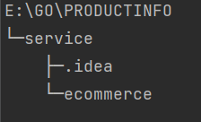
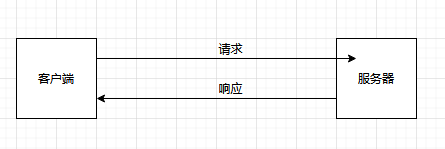
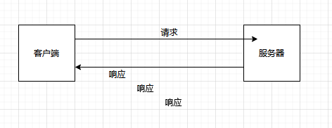
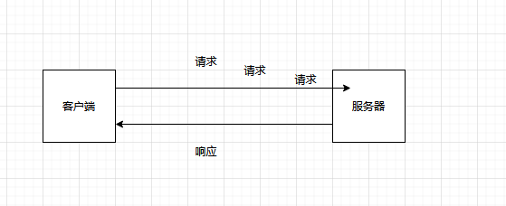
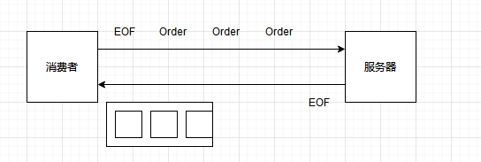
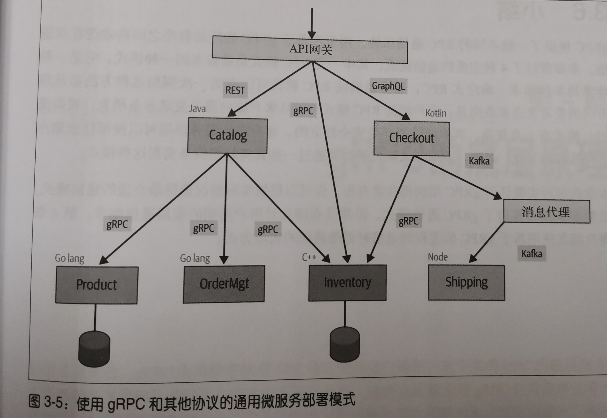
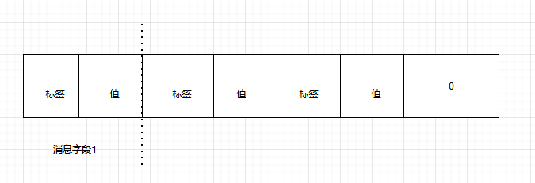
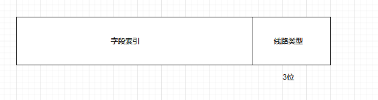

# gRPC与云原生应用开发


## 一、gRPC 入梦

> 微服务架构定义： 
>
> ​		 是将软件应用程序构建为一组独立、自治（独立开发、部署和扩展）、松耦合、面向业务能力[^1]的服务。
>
> 微服务架构和云原生架构，就是为了多种业务能力所构建的传统软件系统被进一步拆分为一组细粒度、自治和面向业务能力的实体，也就是微服务。

[^1]: 更强调的是软件系统所具有的的能力，而不仅仅是完成指定的任务


进程间通信方式——————`事务代理`

1. 通常使用 消息传递的方式
2. 同步的请求-响应 风格
3. 异步的事件驱动风格（进程间会通过异步消息传递进行通信）

> gRPC：
>
> ​		主要采用的是 请求-响应风格进行通信，但在建立初始连接后，它完成可以以异步模式或流模式进行操作。
>
> 但是 不建议消息大小在1M 以上，如果达到，可以考虑更加合适的方法传递。


### 1.1 gRPC 的定义

> 服务接口 包含  ： 消费者消费服务的方式、消费者能够远程调用的方法以及调用这些方法所使用的参数和消息格式等。 ———————— 被称作为 `IDL`[^2]
>
> gRPC 采用 HTTP/2 进行消息发送

[^2]: 接口定义语言

> 代理的不同叫法：
>
> 1. 骨架： 服务定义生成的服务器端代码
> 2. 存根： 服务定义生成的客户端代码


#### 1.1.1 服务定义

服务接口定义在proto文件中指定。

```protobuf
//product_info.proto
syntax = "proto3";  // 1. proto3版本必须显示指定，不然默认为proto2

//package ecommerce;  // 2. 用来防止协议消息类型之间发生命名冲突的包名，该报名也会用来生成代码
option go_package = ".;ecommerce"; //补充，go protoc 要求必须指定go_package 而不是package

// 3. 定义gRPC 服务的接口
service ProductInfo {
  // 4.添加商品的远程方法，并返回商品id
  rpc AddProduct(Product)returns (ProductId);
  //  5. 获取产品详情
  rpc GetProduct(ProductId)returns (Product);
}

// 6. 定义消息格式或类型
message Product{
  string id = 1; // 7. 数字为地址编号，详细内容[https://blog.csdn.net/xyjworkgame/article/details/119057144?spm=1001.2014.3001.5501]
  string name = 2;
  string description = 3;
}

message ProductId{
  string value = 1;
}


// protoc -I ecommerce --go_out=ecommerce  ecommerce\product_info.proto
```


#### 1.1.2 服务器端

#### 1.1.3 客户端

> 后序代码中展示


### 1.2 进程间通信技术的演化


#### 1.2.1 传统的RPC

- 通用对象请求代理体系结构（CORBA）
- java 远程调用方法（RMI）

#### 1.2.2 SOAP

> 简单对象访问协议（SOAP）：
>
> ​       是**面向服务的架构（SOA）**中的标准通信技术，用于通常在web服务之间交换xml的结构化数据，并且能够基于任意的底层通信协议进行通信，常见的就是HTTP

#### 1.2.3 REST

> **描述性状态转移（REST）**
>
> **面向资源架构（ROA）**

REST 服务的3 个局限性：

1. 基于文本的低效消息协议

   使用人类可读的文本，但是机器并不需要这个文本化格式，使用低效

2. 应用程序之间缺乏强类型接口

3. REST架构风格难以强制实施


#### 1.2.4 gRPC 起源

Baidu 至上

#### 1.2.5 选择gRPC 原因

##### gRPC 优势

1. 提供高效的进程间通信

2. 具有简单且定义良好的服务接口和模式

3. 属于强类型

4. 支持多语言

5. 支持双工流

6. 具备内置的商业化特性

   一般指向 ： 认证、加密、弹性（截止时间和超时）、元数据交换、压缩、负载均衡、服务发现等

7. 与云原生生态系统进行集成

8. 已成熟被广泛使用

##### gRPC劣势

1. 不太适合面向外部的服务
2. 巨大的服务定义变更是复杂的开发流程
3. gRPC 生态系统相对较小


#### 1.2.6 与其他协议对比： Thrift和 GraphQL


##### 与Thrift对比

1. 传输方面

2. 流方面

   gRPC 原生支持 双向流，本身就是服务定义的一部分

3. 采用情况和社区资源方面

4. 性能方面

   虽然Thrift 有点强，但是性能不是唯一考虑标准

##### GraphQL

GraphQL 用于面向外部的服务或API

gRPC 更适用于内部的服务


## 二、开始使用gRPC


###  2.1 创建服务定义

**消息** 是客户端和服务器端交换的数据结构

`第一章所提及：`不能为字段设置相同的数字

**服务** 是暴露给客户端的远程方法的集合——（protocol-buffers 规定，只能有一个请求类型和响应类型）

具体

**包名** 可以指定包名，但是在go 中，包名的名称为`go_package  `

**导入** 可以导入其他proto 文件的定义好的消息类型

```protobuf
syntax = "proto3";
import "google/protobuf/wrappers.protp";
```


### 2.2 实现(github 代码存储)


1. go语言

目录架构（不是生产架构）




protobuf  文件

```protobuf
syntax = "proto3";

package ecommerce.v1;
option go_package = ".;ecommerce_v1";

service ProductInfo {
  rpc AddProduct(Product)returns (ProductID);
  rpc GetProduct(ProductID) returns (Product);
}

message Product {
  string id = 1;
  string name = 2;
  string description = 3;
}

message ProductID {
  string value = 1;
}


//protoc -I ecommerce --go_out=plugins=grpc:ecommerce  ecommerce\product_info.proto
```

2. java 语言

gradle 配置

```groovy
apply plugin: 'java'
apply plugin: 'com.google.protobuf'

repositories {
    mavenCentral()
}

def grpcVersion = '1.39.0'

dependencies {
    compile "io.grpc:grpc-netty:${grpcVersion}"
    compile "io.grpc:grpc-protobuf:${grpcVersion}"
    compile "io.grpc:grpc-stub:${grpcVersion}"
    compile 'com.google.protobuf:protobuf-java:3.17.2'
    compile 'javax.annotation:javax.annotation-api:1.3.2'
}

buildscript {
    repositories {
        mavenCentral()
    }
    dependencies {
        classpath 'com.google.protobuf:protobuf-gradle-plugin:0.8.17'
    }
}

protobuf {
    protoc {
        artifact = 'com.google.protobuf:protoc:3.17.2'
    }
    plugins {
        grpc {
            artifact = "io.grpc:protoc-gen-grpc-java:${grpcVersion}"
        }
    }
    generateProtoTasks {
        all()*.plugins {
            grpc {}
        }
    }
}


sourceSets {
    main {
        java {
            srcDirs 'build/generated/source/proto/main/grpc'
            srcDirs 'build/generated/source/proto/main/java'
        }
    }
}

jar {
    manifest {
        attributes "Main-Class": "ecommerce.ProductInfoServer"
    }
    from {
        configurations.compile.collect { it.isDirectory() ? it : zipTree(it) }
    }
}

// Generate IntelliJ IDEA's .idea & .iml project files
apply plugin: 'idea'

// Provide convenience executables for trying out the examples.
apply plugin: 'application'

startScripts.enabled = false
```


## 三、 gRPC 的通信模式

> gRPC 的 4 种 基础通信模式： 一元RPC 、 服务器端流RPC ， 客户端流RPC 、 双向流RPC


### 3.1 一元RPC模式[^3]

> 模式 可以简称为 请求-响应模式。 
>
> 当客户端调用服务器端的远程方法时，客户端发送请求至服务器端并获得一个响应，与响应一起发送的还有状态细节以及trailer 元数据。



[^3]: 大部分RPC 模式都是采用的一元RPC 模式

### 3.2 服务器端流RPC 模式

> 服务器端在接收到客户端的请求消息后，会发回一个响应的序列。这种多个响应所组成的序列也被称流。
>
> 服务器端会以 trailer 元数据的形式将其状态发送给客户端，从而标记流的结束。
>
> 



```go
func （s * server）SearchOrder(searchQuery *wrappers.StringValue,Stream pb.orderManagement_SearchOrdersServer)error {

    for key,order := rnage orderMap {
        log.print(key,order)
        for _,itemStr := range order.items {
            log.Print(itemStr)
            if strings.Contains(
            	itemStr.searchQuery.Value
            ){
            	//在流中 发送匹配的订单
                err := stream.Send(&order)
                if err != nil {
                    return fmt.Errorf("error sending message to stream : %v",err)
                }
                break;
            }
        }
    }
}
```

```go
// 建立到服务器端的链接
c := pb.NewOrderManagementClient(conn)

searchStream , _ := c.SearchOrder(ctx,&wrapper.StringValue{Value:"Test"})
for {
    searchOrder ,err := searchStream.Recv()
    if err == io.EOF{
    	break
    }
    // 处理可能出现的错误
    log.print(err)
}
```


### 3.3 客户端流RPC模式

> 在客户单流RPC 中，客户单会发送多个请求给服务器端，而不再是单个请求。
>
> `服务器端不一定要等到从客户端接收到所有消息后才发送响应`



```go
// 服务器端
func (s *server) UpdateOrders(stream pb.OrderManagement_UpdateOrdersServer)error {
    ordersStr := "Updated Order IDS : "
    for {
        order ,err := stream.Recv()
        if err === io.EOF {
            return stream.SendAndClose(&wrapper.StringValue{Value: "Orders processed" + ordersStr})
        }
        //更新订单
        orderMap[order.Id] = *order
        log.Printf("....")
        ordersStr += order.Id + ","
    }
}
```

```go
// 客户端
c := pb.NewOrderManageMentClient(conn)


updateStream ,err := client.UpdateOrders(ctx)
if err != nil {
    log.FatalF()
}
// 更新订单1
if err := updateStream.Send(&updOrder1);err != nil {
    log.fatalf()
}
// 更新订单2 
....

// 停止发送，接收响应
udpatesRes ,err := updatesStream.CloseAndRecv()
if err != nil{}
log.print("success")
```


###  3.4  双向流RPC 模式

> 类似于 TCP 的全双工模式。。客户端以消息流的形式发送请求到服务器端，服务器端也以消息流的形式进行响应。



> 如图： ，例如订单和发货的之间的关系。存在多个订单有着相同的发货地址。服务器将接收到的订单，，划分成多个集合进行传送

> 这个业务用例的核心理念就是一旦调用RPC 方法，那么无论是客户端还是服务器端，都可以在任意时间发送消息。也包括来自任意一端的流结束标记。


```go
// 服务器端
func (s *server) ProcessOrders(stream pb.OrderManagement_ProcessOrdersServer)error {
    for {
        orderId,err := stream.Recv()
        if err == io.EOF{
        	...
            break
        }
        for _,comb := range comblinedShipmentMap{
            stream.Send(&comb)
        }
        return nil
    }
    if err != nil {
    	return err
    }
    // 基于目的地位置
    // 将订单组合到发货组合中的逻辑
    if batchmarker == orderBatchSize {
    	//将组合后的订单以流的形式分批发送至客户端
        for _, comb := rnage combineShipmentMap {
            stream.Send(&comb)
        }
        batchMarker = 0
        combinedShipmentMap = make (map[string]pb.CombineShipment)
    }else {
    	batchMarker++
    }
}
```

```go
// 客户端
// 处理订单
streamProcOrder ,_ := c.ProcessOrders(ctx)
if err := streamProcOrder.Send(&wrapper.stringValue{Value:"102"});err != nil {
    log.Fatalf()
}
if err := streamProcOrder.Send(&wrapper.stringValue{Value:"112"});err != nil {
    log.Fatalf()
}
if err := streamProcOrder.Send(&wrapper.stringValue{Value:"122"});err != nil {
    log.Fatalf()
}
if err := streamProcOrder.Send(&wrapper.stringValue{Value:"132"});err != nil {
    log.Fatalf()
}

channel := make(chan struct{})
go asncClientBidirectionalRPC(streamProcOrder,channel)
time.Sleep(time.Millisecond *1000)

if err != streamProcOrder.Send(&wrapper.StringValue{Value:"101"});err != nil {
    log.Fatalf()
}

if err := streamProcOrder.CloseSend();err != nil {
    log.Fatal(err)
}
<- channel

func asncClientBidirectionalRPC{
    streamProcOrder pb.OrderManagement_processOrdersClient,c chan struct{}){
        for {
            combinedShipment,errProcOrder := streamProcOrder.Recv()
            if errProcOrder == io.EOF {
            	break
            }
            log.Printf("Combined shipment:",...)
        }
    }
    <-c 
}
```


### 3.5 使用gRPC 实现微服务通信




## 四、 gRPC 的底层原理

> gRPC 使用protocol-buffers 作为编码技术，将HTTP/2 作为通信协议。


### 4.1 RPC流


1. 客户端调用流程

   - 调用getProduct() 方法
   - gRPC 所生成的存根，进行消息编码，编码完成后，进行消息构建
   - 通过网络发送请求到服务器端

2. 服务器接收消息

   - 服务器接收到消息，并将消息传输给骨架

   - 通过gRPC 所生成的骨架，进行消息解码，得到需要调用的方法，骨架对getProduct 方法进行本地调用


### 4.2 使用protocol buffers 编码消息

> 正确定义消息是非常重要的，这决定消息改如何编码，消息的大小。

```protobuf
message ProductID {
	string value = 1;
}
```

在上述的消息结构体中，value 的字段，字段索引为1 。

当创建value 的值为 15 的消息实例时，对应的字节码内容会包含一个用于value 的字段的标识符，随后进行编码。

`字段的标识符也被称为标签tag`

protobcol buffers 编码后的字节流图示：



标签有两个值构成： 字段索引和线路类型（wire type) 。

字段类型就是为字段设置的唯一数字

线路类型就是基于字段类型的，能够为字段输入值的数据类型。

可用的线路类型及其对应的字段类型：

| 线路类型 | 分类         | 字段类型                                                 |
| -------- | ------------ | -------------------------------------------------------- |
| 0        | Varint       | int32、int64、uint32、uint64、sint32、sint64、bool、enum |
| 1        | 64位         | flexd64、sfixed64、double                                |
| 2        | 基于长度分隔 | string 、 bytes、嵌入式消息、打包的repeated 字段         |
| 3        | 起始组       | groups （已废弃）                                        |
| 4        | 结束组       | groups（已废弃）                                         |
| 5        | 32位         | fixed32、sfixed32、float                                 |

通过上面的表格，就可以将表示字段索引的二进制左移3位并与表示线路类型的值进行按位或操作

```txt
Tag value  = (field_index << 3 ) | wrie_type
```


标签值的结构：



通过上面的公式，可以计算出，productID  的value  值 为 10 的标签 值 ，，

字段索引为1 ，字符串的线路类型为2 ，

Tag  value   = （00000001 << 3 ) |  00000010 = 000 1010


1. protocol-buffers 会使用UTF-8 [^4]来进行 对 字符串值编码
2. 对于 int32 的整数，会使用Varint 进行编码


[:^4]: UTF-8编码，会根据字段值变化而变化


####  编码技术


##### 1. Varint类型

> Varint(可变长度整数) 是使用单字节或多字节来序列化整数的方法
>
> 在Varint 中，除了最后的字节，其他所有字节都会设置最高有效位（MSB），表明后面还有字节。
>
> 在分配字节中，每个值都是根据具体的值来分配字节的。

##### 2. 有符合整数类型

> 有符号整数类型是能够表示正整数和负整数值的类型。
>
> 1. 有符号的类型，会使用`zigzag`编码进行将有符号变成无符号整数。
> 2. 无符号整数，会使用Varint 进行编码

针对有符号整数使用zigzag 编码

| 原始值 | 映射值 |
| ------ | ------ |
| 0      | 0      |
| -1     | 1      |
| 1      | 2      |
| -2     | 3      |
| 2      | 4      |

##### 3. 非Varint 类型

> 会分配固定的字节。例如 fixed64、 fixed32  用来表示 64/32位 的线路类型。

##### 4. 字符串类型

> 字符串类型属于`基于长度分隔`的线路类型。
>
> 首先会有一个经过Varint 编码的长度值，随后才是指定数量的字节数据，值会采用UTF-8编码


### 4.3 基于长度前缀的消息分帧

> 消息分帧 ： 构建消息和通信 ，以便于目标受众很容易地提取信息
>
> 而gRPC使用了`长度前缀分帧`的消息分帧技术

> 长度前缀分帧是指在写入消息本身之前，写入长度消息，来表明每条消息的大小。


**在gRPC 通信中，每条消息都有额外的4字节用来设置其大小。所以不可以超高4GB 的所有消息**

当编译成二进制格式的消息后，然后计算二进制内容的大小，并以 `大端`[^5]格式将其添加到二进制内容的前面。

除了消息大小，帧中还有单字节的无符号整数。用来表名数据是否进行了压缩。


### 4.4 基于HTTP/2 的gRPC

> 在http/2 中，客户端和服务器的所有通信都是通过一个TCP连接完成的，这个连接可以传送任意数量的双向字节流。
>
> 专业术语：
>
> - 流 ： 在一个已建立的连接上的双向字节流。一个流可以携带一条或多条信息。
> - 帧： HTTP/2 中最小的通信单元。每一帧都包含一个帧头，它至少要标记该帧所属的流
> - 消息： 完整的帧序列，映射为一条逻辑上的HTTP消息，由一帧或多帧组成。这么样，消息就可以多路复用


#### 4.4.1 请求信息

请求信息包含3 部分：

- 请求头信息
- 以长度作为前缀的消息
- 流结束标记（简称EOS标记）

对于gRPC 来说，请求信息

- 始终是POST请求
- 端点路径： 构造为 服务名/方法名
- te  =  trailers  定义对不兼容代理的检测。在gRPC 中，这个值必须是 trailers
- content-type  应该都是以application/grpc开头，，不然会报415 响应
- 定义消息的压缩类型。可选的值是identity、gzip、deflate、snappy和{custom}


#### 4.4.2 响应信息


响应信息包含3 部分：

- 响应头信息
- 以长度为前缀的消息
- trailer

对于gRPC 来说，请求信息

- 压缩类型与请求信息压缩类型一样
- Content-Type 与请求信息一样
- 注意：trailer
  - 还包含gRPC 自己定义的状态码。[状态码连接](https://grpc.io/docs/guides/error/)


#### 理解gRPC通信模式中的消息流


##### 1. 一元RPC 模式

请求消息结束后，会跟随一个EOS 标记，方便客户端`半关`连接，处于只能接受，不能发送的状态。

响应消息结束后，会跟随一个trailer 头信息，通信就会完整关闭，表示整一个响应请求结束。


##### 2. 服务器端流RPC模式

前后都跟一元RPC模式，

服务器端不同的是，在trailer 前面，可以有多个响应

##### 3. 客户端流RPC模式

与服务端流RPC 模式其他的相同的情况下，相反的是，客户端可以在EOS 标记前发送多个请求

##### 4. 双向流RPC 模式

与前面不同的是，两者都会互发，无须等待对方结束。 客户端和服务器端会同时发送消息。两者都可以在自己一侧关闭连接，这意味他们不能在发送消息了。


## 五、gRPC ： 超越基础知识


### 5.1 拦截器

> 对于一元RPC ，可以使用一元拦截器
>
> 对于流RPC，可以使用流拦截器


#### 5.1.1 服务器端拦截器


##### 1. 一元拦截器

需要先实现UnaryServerInterceptor 类型的函数，并在gRPC服务器端的时候，注册进来

```go
func(ctx context.Context, req interface{} ,info *UnaryServerInfo,handler UnaryHandler)(resp interface{},err error)
```


demo

```go
func orderUnaryServerInterceptor(ctx context.Context, req interface{} ,info *UnaryServerInfo,handler UnaryHandler)(resp interface{},err error){
	// 前置处理逻辑
    // 通过检查传入的参数,获取关于当前RPC 的信息
    info.FullMethos
    // 调用handler 完成一元RPC 的正常执行
    m,err := handler(ctx,req)
    
    //后置处理逻辑
    return m,err
}


//注册
func main(){
    s := grpc.NewServer(grpc.UnaryInterceptor(orderUnaryServerInterceptor))
}
```


##### 2. 流拦截器

需要先实现streamServer.Interceptor 服务器端拦截器类型

```go
func(srv interface{},ss ServerStream,info *StreamServerInfo,handler StreamHandler)error
```


demo

```go
type wrappedStream struct {
	grpc.ServerStream
}

// 处理流RPC 接收到的消息
func (w *wrappedStream) RecvMsg (m interface{})error {
    return w.ServerStream.RecvMsg(m)
}
// 处理流RPC 发送的消息
func (w *wrappedStream) SendMsg (m interface{})error {
    return w.ServerStream.SendMsg(m)
}

func newWrappedStream(s grpc.ServerStream) grpc.ServerStream {
    return &wrappedStream{s}
}

func orderServerStreamInterceptor(src interface{},ss grpc.ServerStream,info *grpc.StreamServerInfo,handler gprc.StreamHandler)error{

    err := handler(srv,newWrappedStream(ss)
                   return err
 }
                   
                   
 // 注册
                   s := grpc.NewServer(grpc.StramInterceptor(orderServerStreamInterceptor))
```


####  5.1.2 客户端拦截器


#####  1. 一元拦截器

实现UnaryClientInterceptor

``` go
func (ctx context.Context,method string,req,reply interface{},cc *ClientConn,invoker UnaryInvoker,opts ...CallOption)error 


```


demo

```go
func orderUnaryClientInterceptor(
    ctx context.Context,method string ,req,reply interface{}，cc *grpc.ClientConn,invoker grpc.UnaryInvoker, opts ...grpc.CallOption)error {


    err := invoker (ctx ,method,req,reply,cc,opts)}
)

grpc.Dial(address,gprc.withInsecure(),grpc.WithUnaryInterceptor(orderUnaryClientInterceptor)
```


##### 2. 流拦截器

实现StreamClientInterceptor

```go
func (ctx context,Context,desc *streamDesc,cc *ClientConn,method string,streamer Streamer,opts ..CallOption) (ClientStream,error)
```


demo


```go
func clientStreamInterceptor(ctx context.Context,desc *grpc.StreamDesc,cc *grpc.CLientConn,method string , streamer grpc.Streamer,opts ...grpc.CallOption)(grpc.ClientStream,error){
    s,err := streamer(ctx,desc,cc,method,opts...)
}


type wrappedStream struct {
	grpc.ClientStream
}

// 处理流RPC 接收到的消息
func (w *wrappedStream) RecvMsg (m interface{})error {
    return w.ClientStream.RecvMsg(m)
}
// 处理流RPC 发送的消息
func (w *wrappedStream) SendMsg (m interface{})error {
    return w.ClientStream.SendMsg(m)
}

func newWrappedStream(s grpc.ClientStream) grpc.ServerStream {
    return &wrappedStream{s}
}

func orderServerStreamInterceptor(src interface{},ss grpc.ServerStream,info *grpc.StreamServerInfo,handler gprc.StreamHandler)error{

    err := handler(srv,newWrappedStream(ss)
                   return err
 }
                   
                   
 // 注册
 s := grpc.NewServer(grpc.StramInterceptor(clientStreamInterceptor))
```


###  5.2 截止时间

> - 截止时间 （微服务一般采用截止时间为最佳实践）
>   - 是以请求开始的绝对时间来表示（即使API将他们表示为持续时间偏移），并且应用于多个服务调用
> - 超时时间
>   - 可以指定客户端应用程序等待RPC 完成的时间（之后一错误结束），通常以持续时长的方式来指定，并且在每个客户端本地进行应用


demo


```go
conn,err := grpc.Dial(address,grpc.withInsecure())
if err != nil{
    log.Fatalf()
}
defer conn.close()

client := pb.NewOrderManagementCLient(conn)

clientDeadLine := time.Now().add(time.Duration(2 * time.Second))

ctx,cancel := context.WithDeadline(context.Background(),clientDeadline)

defer cancel()


// 添加订单
order1 := pb.Order{Id:"1.1"}
// 捕获出现的错误
res,addErr := client.AddOrder(ctx,&Order1)

if addErr != nil{
    // 使用statu 包确定错误码
    got := status.Code(AddErr)
}else {
    log.Print()
}
```


### 5.3 取消

在GO语言中，一般都使用Context.Context() 进行上下午传递。其中WtihCancel 是一个内置函数，当调用这个函数，grPC就回创建头信息，表示当前请求截止。

可以通过context.WithTImout 获取cancel 函数。


### 5.4 错误处理


GRPC 使用一组 专用的状态码，但是本身自带的状态码类型有限，使用google.rcp包所提供的的更丰富的错误模型，但是只有所支持的语言，才可以使用，例如 c++, GO,java ,Python.


demo

```go
if orderReq.Id == "-1"{
    errorStatus := status.New(codes.InvalidArgument,"custom error")
    ds,err := errorStatus.WithDetails(&epb.BadRequest_FieldViolation{...})
    
    if err != nil{
        return nil,errorStatus.Err()
    }
    return nil,ds.Err()
}

```


### 5.5 多路复用


> gRPC 还容许在同一个RPC 服务器端上运行多个gRPC 服务，也允许多个客户端存根使用同一个gRPC 端连接，这种功能就叫 多路复用。
>
> 一般也不会这样子搞，，但是这个用途强大的地方是，同一个服务器端进程中托管同一个服务的多个主版本。保证API 在发生破坏性变化，依旧还能适应遗留客户端。


### 5.6 元数据

> 元数据的构造遵循key-value 的形式


元数据最常见的用途就是： 在gRPC 应用程序之间交换安全头信息。


####  5.6.1 创建和检索元数据

```go
// method_1
metadata.New(map[string]string{"key1","val1"})

// method_2
metadata.Pairs(
"key12","val1",
"key12","key2")
```

metadata.Pairs 创建的元数据对，具有相同的键的元数据会被合并为一个列表。


在客户端或服务器端读取元数据，可以通过传入的RPC上下午以metata.FromIncomingContext(ctx) 函数来实现，会返回元数据的map


#### 5.6.2 发送和接收元数据： 客户端

有两种方式来实现这一点：

1. NewOutgoingContext 创建带有新元数据的上下文。 （`会替换上下文中所有已有的元数据`）
2. 使用AppendToOutgoingContext 将元数据附加到已有的上下文中。


```go
//在gRPC 客户端发送元数据
me : metadata.Pairs(....)


mdCtx := metada.NewOutgoingContext(context.Background(),md)

ctxA := metadata.AppendToOutgoingContext(mdCtx,"k1","k2")

// 发送一元rpc
client.SomeRPC(ctxA,someRequest)

// 发送流 rpc
client.SomeStreamingRPC(ctxA)


```


```go
// 客户端接收元数据
var header ,trailer metadata.MD

//****** 一元
client.SomeRPC(ctx,someRequest,grpc.Header(&header),grpc.Trailer(&trailer)),)


// ***** 流RPC

stream,err := client.SomeStreamingRPC(ctx)

// 检索头信息
header ,er := stream.Header()
// 检索trailer
trailer := stream.Trailer()

```


#### 5.6.3 发送和接收元数据：服务器端

```go
func (s *server)SomeRPC(ctx context.Context，in pb.someRequest)(*pb.someResponse,error){
    md,ok := metadata.FromIncomingContext(ctx)
}

func (s *server)SomeRPC(ctx context.Context，in pb.Serveice_SomeStreamingRPCS)(*pb.someResponse,error){
    md,ok := metadata.FromIncomingContext(ctx)
}
```


[^5]: 大端是一种在系统或消息中对二进制数据进行排序的方式。在大端格式中序列中的最高有效位（2 的最大乘方）存储在最低存储地址上。


