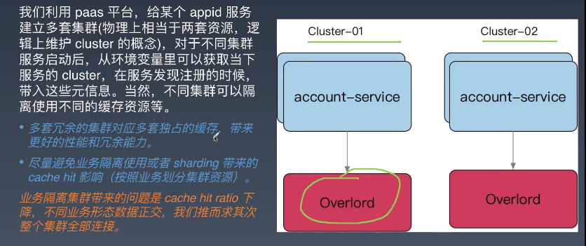
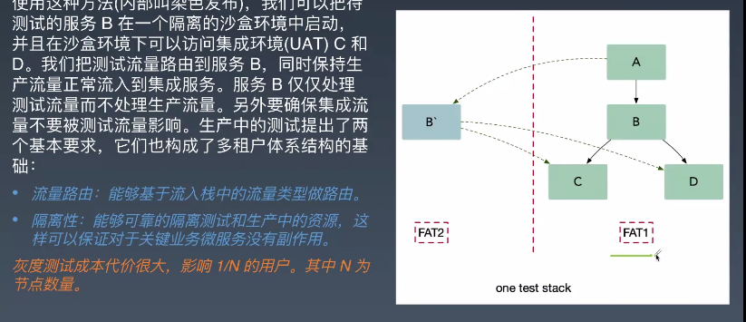

# go 进阶训练营-微服务

## 微服务概览与治理

### 微服务概览

#### 单体架构

> 尽管也是模块化逻辑，但是最终打包并部署为单体式应用。
>
> 应用无法扩展，可靠性很低，敏捷性开发和部署都无法完成

应对思路： ==化繁为简，分而治之==

#### 微服务起源

`面向服务SOA` 的架构模式，，微服务就是	`SOA` 的一种实践

1. 小即是美
2. 单一职责
3. 尽可能早的创建原型： 尽可能早的提供服务API，建立服务七月，达成服务间沟通的一致性约定
4. 可移植性比效率更重要

#### 微服务定义

> 围绕业务功能构建，服务关注单一业务，服务间采用轻量级的通信机制，可以全自动独立部署。
>
> 微服务架构通过业务拆分实现服务组件化，通过组件组合快速开发系统，业务单一的服务组件可以独立部署

1. 原子服务
2. 独立进程
3. 去中心化服务治理

缺点：

- 基础设施的建设，复杂度高

#### 微服务不足

1. 分布式系统，必须使用RPC或者消息传递，来实现进程通信，并且保证可靠性传输
2. 分区的数据架构，同时更新多个业务的事务很普遍。必须实现分布式事务
3. 测试一个基于微服务架构的应用也是非常复杂
4. 服务模块间的依赖，应用的升级也会很复杂
5. 对运维基础设施的挑战比较大

#### 组件服务化

> 传统实现组件的方式是通过库，库是和应用一起运行在进程中。

- kit  ： 一个微服务的基础库（框架）
- service： 业务代码 + kit 依赖 + 第三方依赖组成的业务微服务
- `rpc` + message queue: 轻量级通讯

`本质上等同于，多个微服务组合完成了一个完整的用户场景 `

#### 按业务组织服务

> 服务提供的能力 和业务功能对应

#### 去中心化

> 1. 数据去中心化
> 2. 治理去中心化
> 3. 技术去中心化

**每个服务独享自身的数据存储设置（缓存，数据库等），不像传统应用共享一个缓存和数据库，有利于服务的独立性，隔离相关干扰**

#### 基础设施自动化

> 无自动化不微服务，自动化包括测试和部署

- CICD ： GitLab + GitLab  Hooks + k8s
- Testing： 测试环境 ，单元测试，API自动化测试
- 在线运行时：k8s，以及一系列Prometheus ，ELK，Conrtol Panle

#### 可用性 & 兼容性 设计

> 著名的`Design For Failure`思想，微服务架构采用粗粒度的进程间通信，引入了额外的复杂性和需要处理的新问题。如网络延迟、消息格式、负载均衡和容错。

- 隔离
- 超时控制
- 负载保护
- 限流
- 降级
- 重试
- 负载均衡

### 微服务设计

#### `API Gateway`

> 网关用于统一的协议出口，在服务内进行大量的dataset join，按照业务场景来设计粗粒度的API，给后续服务的演进带来很大优势

- 轻量交互：协议精简、聚合
- 差异服务：数据裁剪以及聚合、针对终端定制好API
- 动态升级：原有系统兼容升级，更新服务而非协议
- 沟通效率提升，协作模式演进为移动业务+网关小组

严重问题： 单点服务

#### Mircoservice 划分

> 如何划分微服务的边界
>
> 常用两种方式：
>
> 1. 业务职能：例如客户，审核
> 2. DDD 的限界上下文： 解决不同业务问题的问题域和对应的解决方案域，为了解决某种类型的业务问题

#### Mircoservice 安全

### `gRPC` & 服务发现

#### `gRPC`

- 多语言：语言中立，支持多种
- 轻量级、高性能：序列化支持PB（Protocol Buffer） 和JSON，PB 是一种语言无关的高性能序列化框架
- 可插拔
- IDL：基于文件定义服务，通过proto3 工具生成指定语言的数据结构、服务端接口以及客户端Stub
- 设计理念
- 移动端：基于标准的HTTP2设计，支持双向流、消息头压缩，单TCP的多路复用、服务端推送等特性。
- 服务而非对象、消息而非引用
- 负载无关的：不同的服务需要使用不同的消息类型和编码
- 流：Streaming  API
- 阻塞式 和非阻塞时：支持异步和同步处理在客户端和服务端间交互的消息队列
- 元数据交换：常见的横切关注点，如认证或跟踪
- 标准化状态吗：客户端通常以优先的方式响应API调用返回的错误

`不要过早的关注性能问题，先标准化`

####  gRPC- HealthCheck

> 有一个标准的健康监测协议，在gRPC的所有语言实现中基本都提供了生成代码和用于设置运行状态的功能。

#### 服务发现 - 客户端发现

#### 服务发现- 服务端发现

#### 服务发现

1. 客户端发现：

   直连，比服务器服务发现少一个网络跳转Consumer需要内置特定的服务发现客户端和发现逻辑

2. 服务端发现

   Consumer 无需关注服务发现具体细节，只需知道服务的DNS域名即可，支持异构语言开发，需要基础设施支撑，多一次网络跳转，可能有性能损失

==微服务的核心是去中心化，使用`客户端`发现模式==

[^推荐书籍：]:linux环境编程 

 

### 多集群 & 多租户

#### 多集群

多集群的必要性：

1. 从单一集群考虑，多个节点保证可用性，我们通常使用N+2的方式来冗余节点
2. 从单一集群故障带来的影响面角度考虑冗余多套集群
3. 单个机房内的机房故障导致的问题

[^推荐书籍]:  Google SRE

#### 多租户

## GO 语言实践

### Error Vs  Exception

> Error  就是一个普通的接口，
>
> 经常使用errors.New()  创建一个错误error对象

这里使用结构体指针，不然会造成多个string 的text 相同，但是判断不相等

Go的异常处理逻辑是不引入Exception ，支持多参数返回，可以在函数签名中带上实现了error interface 的对象，

Go 中有panic 的机制，但是不与其他语言的Exception 一样，当我们抛出异常的时候，相当于把Exception 扔给了调用者去处理

**Go  panic 意味着fatal error ，不能假设调用者来解决panic，意味着代码不能继续运行**

1. 对于真正以外的情况，那些表示不可恢复的程序错误，例如索引越界、不可恢复的环境问题，栈溢出，我们才使用panic。对于其他错误，都是用error 来进行判定。

### Error Type

### Handing Error
#### Wrap errors

1. 在应用代码中，使用erros.New 或者 errors.Errorf 返回错误
2. 如果调用其他包内的函数，通常简单的直接返回
3. 如果和==其他库进行协作==，考虑使用erros.Wrap 或者erros.Wrapf 保存堆栈信息，同样使用于标准库协作的时候。
4. 直接返回错误，而不是每个错误产生的地方到处打日志
5. 在程序的顶部或者是工作的goroutine 顶部（请求入口），使用 %+v 把堆栈详情记录

> 1. 选择wrap error 是只有applicaitons 可以选择应用的策略，具有最高可重用性的包只能返回根错误值。

### Go  1.13 errors

### Go 2 Error Inspection

### Reference