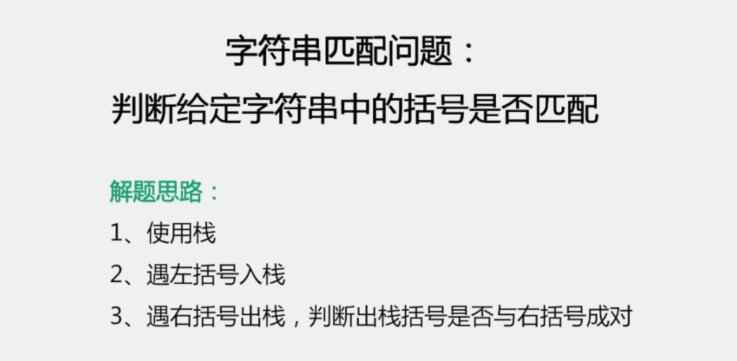
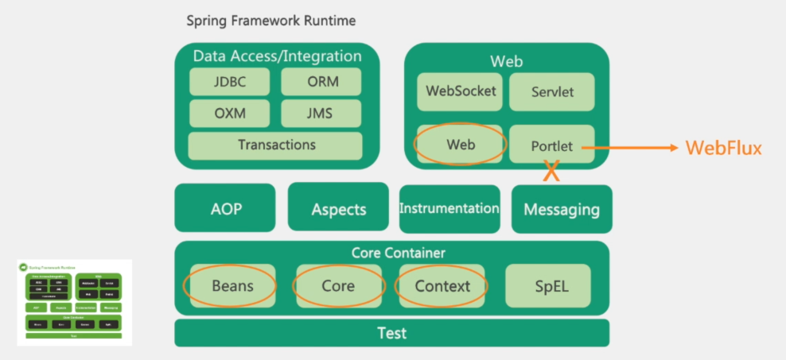
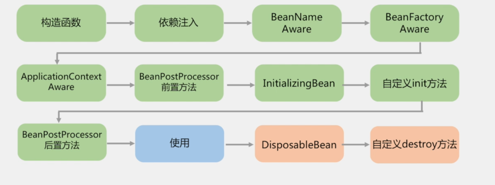

 

# 一份有吸引人的简历

特点 ： 

1.  结构清晰，主次明了
2.  语句通顺，没有错别字
3.  少即是多
4.  可量化的结果
5.  务实的自我评价

技巧： 

1. 针对岗位定制
2. 打造自己的特点
3. 换一个视角
4. 他山之石，可以攻玉
5. 另辟蹊径

# 操作系统 与计算机网络

进程 与线程的区别： 

进程 ： 是操作系统资源分配的基本单位，而线程是任务掉和执行的基本单位

一个程序 必须有一个进程，一个进程必须有一个线程，但是进程可以包含多个线程，

OSI七层 ： 

物理层，数据链路层，网络层，运输层，会话层，表示层，应用层

五层协议的体系结构

物理层，数据链路层，网络层，运输层，应用层

三次握手建连

四次挥手断链

# 设计模式

模式总量是GOF29种

## 单例模式线程安全实现

1. 静态初始化（饿汉式）
2. 双重检查（懒汉式）（使用volitie 修饰变量，防止多个实例创建）
3. 单例注册表

## 其他常见设计模式与应用场景

# java语言特性

## Map

## java版本特特性

## 面试考察点

1. 基本概念和基本原理
2. 实现方式与使用姿势
3. 经常用到的知识点
4. 实际应用中容易犯错的点
5. 与面试方向相关的知识点

### 加分项

1. 知识点与典型的业务场景关联
2. 以返利来描述实际场景中误用的危害
3. 与知识点相关的优化点
4. 与知识点相关的最新技术趋势
5. 在了解的前提下，尽量增加回答的内容深度

### 真题：

## jvm

### JVM内存模型

## jmm 与内存可见性

### JMM保证

 

### 类的加载与卸载

### 双亲委派模式

### 分代回收

### 垃圾回收算法

#### CMS算法

#### G1算法

### ZGC 针对大内存堆的低延迟垃圾回收算法

1. 着色指针
2. 读屏障
3. 并发处理
4. 基于Region
5. 内存压缩

## 考察点

## 加分项

## 真题

****

# 并发 与多线程

### 线程的状态转换

### Synchronized 实现原理

### 线程池

#### 线程池参数介绍

### JUC 常用工具

### 面试考察点

### 加分项

### 真题汇总

# 数据结构与算法

### 从搜索树到B+树

### 字符串匹配问题

### TOPK问题

### 常用算法介绍

### 面试考察点

### 加分项

### 真题

# 常用工具类

## JMC

## btrace

### 其他JVM工具介绍

## git

### 分支管理策略

## 常用的LInux 分析工具

## 考察点与加分项

## 真题

# Spring 全家桶

 

## spring 框架

### 框架组件

### 机制与实现

### 注解

### Context初始化流程

### Spring中bean的生命周期

### spring 扩展接口

## springboot

# Mysql调优与最佳实践

## mysql 索引

## mysql 调优

## 考察点与加分项

## 真题

