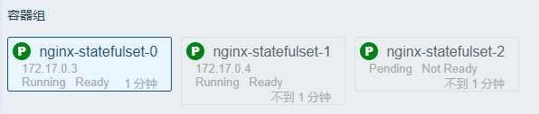
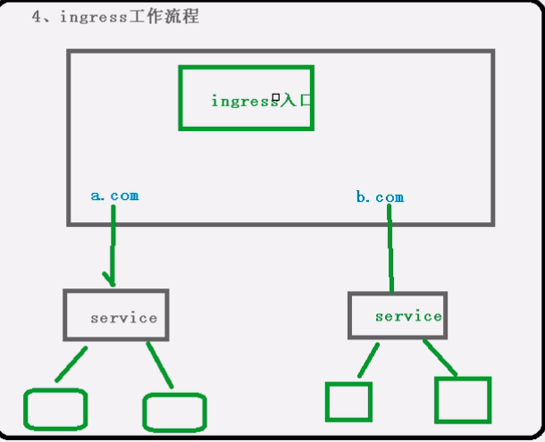

# k8s

## k8s 功能

1. 自动装箱

   > 基于容器对应用运行环境的资源配置要求自动部署应用容器

2. 自我修复

   > 当容器失败时，会对容器自动重启
   >
   > 当所部署的node结点有问题时，会对容器进行重新部署和重新调度
   >
   > 当容器未通过监控检查时，会关闭容器知道容器正常运行时，才会对外提供服务

3. 水平扩展

   > 通过简单的命令，用户``UI，对容器进行规模扩大或剪裁

4. 服务发现

   > 用户不需要使用额外的服务发现机制，就能够基于`kubernetes`自身能力实现服务发现和负载均衡

5. 滚动更新

   >可以根据应用的编号，对应用容器运行的应用，进行一次性或批量性更新

6. 版本回退

   > 可以根据应用部署情况，对应容器运行的应用，进行历史版本即时回退

7. 密钥和配置管理

   > 在不需要重新构建镜像的情况下，可以部署和更新密钥和应用配置，类似热部署

8. 存储编排

   > 自动实现存储系统的挂载及应用，特别对有状态应用实现数据持久化非常重要，存储系统可以来自于本地，网络存储，公共云

9. 批处理

   > 提供一次性任务，定时任务，满足批量处理

### 组件

#### master

> 主控结点

##### 1. apiserver 组件

> 集群统一入口，以restful方式，交给etcd存储

##### 2. scheduler

> 结点调度，选择node结点应用部署

##### 3. controller-manager

> 处理集群常规后台任务，一个资源对应一个控制器

##### 4. etcd

> 存储系统，用于保存集群相关的数据

#### node

> 工作结点

##### 1. kubeelet

> master 派到node结点代表，管理本机容器

##### 2. kube-proxy

> 网络上面的代理，负载均衡等操作


## k8s 核心概念

### pod

> ==最小部署单元==
>
> 一组容器的集合
>
> 共享网络
>
> 生命周期是短暂的

### controller

> 确保预期的pod的副本数量
>
> 无状态应用部署**(随便使用)**
>
> 有状态应用部署**(需要一定条件)**
>
> 确保所有的node运行同一个pod
>
> 一次性任务和定时任务

##### service

> 定义一组pod 的访问规则

### 搭建kubernetes集群

### 平台规划

> 1. 单master集群
> 2. 多master集群**（在master和node之间通过负载均衡来连接）**

### 硬件要求

#### master

> 两核，4g，20G

#### node

> 四核，8g，40g

==生产环境，一般不是实地，这里不写出==

## 安装方式

1. kubeadm
2. 二进制
3. kind ——单master
4. minikube ——单master

### kubeadm 安装

1. 准备环境

   

| 角色   | IP            |
| ------ | ------------- |
| master | 192.168.11.11 |
| node1  | 192.168.11.12 |
| node2  | 192.168.11.13 |

2. 首先配置虚拟机

```shell
# 关闭防火墙
systemctl stop firewalld
systemctl disable firewalld

# 关闭selinux
sed -i 's/enforcing/disabled/' /etc/selinux/config  # 永久
setenforce 0  # 临时

# 关闭swap
swapoff -a  # 临时
sed -ri 's/.*swap.*/#&/' /etc/fstab    # 永久

# 根据规划设置主机名
hostnamectl set-hostname <hostname>

# 在master添加hosts
cat >> /etc/hosts << EOF
192.168.44.146 k8smaster
192.168.44.145 k8snode1
192.168.44.144 k8snode2
EOF

# 将桥接的IPv4流量传递到iptables的链
cat > /etc/sysctl.d/k8s.conf << EOF
net.bridge.bridge-nf-call-ip6tables = 1
net.bridge.bridge-nf-call-iptables = 1
EOF
sysctl --system  # 生效
```

3. 所有结点安装docker，kubeadm，kubelet

   ```shell
   $ wget https://mirrors.aliyun.com/docker-ce/linux/centos/docker-ce.repo -O /etc/yum.repos.d/docker-ce.repo
   $ yum -y install docker-ce-18.06.1.ce-3.el7
   $ systemctl enable docker && systemctl start docker
   $ docker --version
   Docker version 18.06.1-ce, build e68fc7a
   # 配置镜像
   $ cat > /etc/docker/daemon.json << EOF
   {
     "registry-mirrors": ["https://b9pmyelo.mirror.aliyuncs.com"]
   }
   EOF
   ```

   ```shell
   # kubernetes
   $ cat > /etc/yum.repos.d/kubernetes.repo << EOF
   [kubernetes]
   name=Kubernetes
   baseurl=https://mirrors.aliyun.com/kubernetes/yum/repos/kubernetes-el7-x86_64
   enabled=1
   gpgcheck=0
   repo_gpgcheck=0
   gpgkey=https://mirrors.aliyun.com/kubernetes/yum/doc/yum-key.gpg https://mirrors.aliyun.com/kubernetes/yum/doc/rpm-package-key.gpg
   EOF
   
   $ yum install -y kubelet-1.18.0 kubeadm-1.18.0 kubectl-1.18.0
   $ systemctl enable kubelet
   ```

4. 部署master

   ```shell
   $ kubeadm init \
     --apiserver-advertise-address=192.168.11.11 \
     --image-repository registry.aliyuncs.com/google_containers \
     --kubernetes-version v1.18.0 \
     --service-cidr=10.96.0.0/12 \
     --pod-network-cidr=10.244.0.0/16
   ```

5. 加入master结点

   ```shell
   #在node节点运行master初始化生成的命令
   $ kubeadm join 192.168.1.11:6443 --token esce21.q6hetwm8si29qxwn \
       --discovery-token-ca-cert-hash sha256:00603a05805807501d7181c3d60b478788408cfe6cedefedb1f97569708be9c5
   ```

   ```shell
   # token 24小时会过期，，重新创建
   kubeadm token create --print-join-command
   ```

6. 部署CNI网络插件

   ```shell
   wget https://raw.githubusercontent.com/coreos/flannel/master/Documentation/kube-flannel.yml
   ```

7. 测试集群

   ```shell
   $ kubectl create deployment nginx --image=nginx
   $ kubectl expose deployment nginx --port=80 --type=NodePort
   $ kubectl get pod,svc
   # 访问http://NodeIP:Port  
   ```

### 二进制安装

详情安装文档

### kind 安装 （单机master集群）

### minikube 安装（单机master集群）

##  kubectl ——k8s集群命令行工具

###  语法格式


- command: 对资源的操作
- type ： 资源类型
- name  ： 资源名称
- flags ：  可选参数，，例如端口等等


### 基础命令


### 部署和集群管理命令


### 故障和调试命令


### 其他命令


## yaml 文件

### 包含部分：

> 1. 控制器定义
> 2. 被控制对象


####  如何快速编写yaml文件

1. 使用kubectl create 命令生成yaml文件

   ```shell
   $ kubectl create deplyment web --image=ngnix -o yaml --dry-run > my.yaml
   ```

   

2. 使用kubectl get 命令导出yaml文件

   ```shell
   $ kubectl get deploy ngnix -o=yaml  > my.yaml
   ```


##  核心技术

###  Pod

#### 基本概念

> 是系统中可以创建和管理的最小单元，是资源对象模型中有用户创建和部署的最小资源对象模型，这不是容器

- 最小部署的单元
- 包含多个容器，（一组容器的集合）
- 一个pod中容器共享网络
- pod是短暂的


#### pod 存在的意义

1. 创建容器使用docker，，一个容器为一个程序 
2. pod 是多进程设计，运行多个应用程序 
   - 一个pod 有多个容器，一个容器里面运行一个应用程序
3. pod存在亲密性应用
   - 两个应用之间进行交互
   - 网络之间调用
   - 两个应用需要频繁调用

#### pod实现机制

1. 共享网络

   > 通过pausc容器，把其他业务容器加入到pausc容器里面，让所有业务容器在同一个名称空间中，可以实现网络共享

2. 共享存储__volumn数据卷


例如 日志数据，业务数据

####  镜像拉取策略

```yaml
imagePullPolicy:Always
```

- ItNotPresent: 默认值，镜像不存在，拉取
- always ： 每此创建pod都会重新拉取一次镜像
- never ： pod永远不会主动拉取这个镜像


#### 资源限制


#### 重启机制

```yaml
restartPolicy:Never
```

- always : 当容器终止退出后，总是重启
- OnFailure ： 当容器异常退出后（退出状态码非0），才重启
- never：终止退出，不重启


#### 健康检查

> 进行容器检查
>
> 例如 ： java堆内存溢出
>
> 两种检查机制：

```shell
livenessprobe 存活检查
# 如果检查失败，将杀死容器，根据pod的restartPolicy来操作
readinessProbe 就绪检查
# 如果检查失败，rebernetes会把pod从service endpoints中剔除
```

```shell
probe 支持以下三种检查方法
bttpGet  
# 发送http请求，返回200-400 为成功
exec
# 执行shell命令返回状态码是0为成功
tcpSocket
#发起tcp socket建立成功
```

例子：


#### 调度策略


> 影响调度的属性
>
> 1. ==对pod 的资源限制==
>
> 2. ==节点选择器的标签==
>
> 3. ==节点的亲和性==
>
>    - nodeAffinity和之前nodeSelector基本一样的，根据节点标签约束来绝对pod调度到那些节点上
>
>    1. 硬亲和性==约束条件必须满足==；例如标签等
>    2. 软亲和性==尝试满足，不保证==
>
> 4. 污点和污点容忍
>
>    **节点不做普通分配调度，是节点属性**
>
>    专用节点，配置特点硬件节点，基于taint驱逐

- 演示节点污点情况

  

  污点值有三个：

  - noSchedule——一定不被调度
  - PreferNoSchdule——尽量不被调度
  - NoExecute——不会调度，并且还有驱逐node已有pod

  ```shell
  $ kubectl taint node [node] key=value：污点三个值
  ```

- 污点容忍

  

  

### Controller 

#### Controller 概念

> 在集群上管理和运行容器的对象

#### pod 和Controller关系

> 1. pod 是通过Controller 实现应用的运维比如伸缩，滚动更新等
> 2. pod 和Controller 之间通过label标签建立关系selector

#### deployment应用场景

1. 部署无状态应用
2. 管理pod和replicaSet
3. 部署，滚动升级等功能
4. 应用场景： web服务，微服务

#### 使用yaml 文件部署应用

```shell
$ kubectl create deployment web --image=ngnix --dry-run=client -o yaml > demo.yaml
# 导出

# 部署
$ kubectl apply -f demo.yaml

# 对外发布-暴露端口
$ kubectl expose deployment web --port=80 --type=NodePort --target-port=80 --name=web1 -o yaml > web1.yaml
$ kubectl apply -f web1.yaml
```

#### 应用升级回滚和弹性伸缩

```shell
$ kubectl set image deployment web ngnix=ngnix:1.15

# 查看升级状态
$ kubectl rollout status deployment web

# 查看历史版本
$ kubectl rollout history deployment web

# 回滚到上一个版本
$ kubectl rollout undo deployment web

# 回滚到指定版本
$ kubectl rollout undo deployment web --to-revision=2

# 弹性伸缩
$ kubectl scale deployment web --replices=10

```

### service

> 定义一组pod的访问规则

#### 存在意义

> 		1. 防止pod失联（服务发现）
> 		2. 定义一组Pod访问策略（负载均衡）

#### Pod和Service 关系

一个service 可以由多个pod

#### 常用Service类型

1. ClusterIP： 集群内部使用
2. NodePort ： 对外访问应用使用
3. LoadBalancore：对外访问应用使用，公有云

##### ==node内网部署应用，外网一般不能访问怎办==

- nginx 反向代理
- 手动把结点，添加到nginx里面
- **其他**
- 使用loadBalancer： 公有云，把负载均衡，控制器，

#### 部署有状态应用

##### 无状态和有状态区别

###### 无状态

- pod 都是相同的
- 没有顺序要求
- 不用考虑在那个node运行
- 随意进行伸缩和扩展

###### 有状态

- 上面因素都要考虑到
- 让每个pod 都是独立的，保持pod 的启动顺序和唯一性
- 唯一的网络标识符，持久存储
- 有序，比如mysql主从


##### 部署有状态的应用

1. 无头service——ClusterIP：none

###### 部署——statefulset

```yaml
apiVersion: v1
kind: Service
metadata:
  name: nginx
  labels:
    app: nginx
spec:
  ports:
  - port: 80
    name: web
  clusterIP: None  # 这里
  selector:
    app: nginx

---

apiVersion: apps/v1
kind: StatefulSet
metadata:
  name: nginx-statefulset
  namespace: default
spec:
  serviceName: nginx
  replicas: 3
  selector:
    matchLabels:
      app: nginx
  template:
    metadata:
      labels:
        app: nginx
    spec:
      containers:
      - name: nginx
        image: nginx:latest
        ports:
        - containerPort: 80
```



###### deployment 和 statefueset区别：有身份，唯一标识

> 根据主机名 + 按照一定规则生成域名

每个pod 有唯一主机名

唯一域名：

```txt
格式 ： 主机名称.service名称.名称空间.svc.cluster.local
```

#### 部署守护进程DaemonSet

> 在每个node上运行一个pod，新加入的node也同样运行在一个node里面
>
> eg: 在每个node 结点安装数据采集工具

```yaml
apiVersion: apps/v1
kind: DaemonSet
metadata:
  name: ds-test 
  labels:
    app: filebeat
spec:
  selector:
    matchLabels:
      app: filebeat
  template:
    metadata:
      labels:
        app: filebeat
    spec:
      containers:
      - name: logs
        image: nginx
        ports:
        - containerPort: 80
        volumeMounts:
        - name: varlog
          mountPath: /tmp/log
      volumes:
      - name: varlog
        hostPath:
          path: /var/log

```

####  job(一次性任务）

```yaml
# 一次性任务
apiVersion: batch/v1
kind: Job
metadata:
  name: pi
spec:
  template:
    spec:
      containers:
      - name: pi
        image: perl
        command: ["perl",  "-Mbignum=bpi", "-wle", "print bpi(2000)"]
      restartPolicy: Never
  backoffLimit: 4

```

####  cronjob（定时任务）

```yaml
apiVersion: batch/v1beta1
kind: CronJob
metadata:
  name: hello
spec:
  schedule: "*/1 * * * *"
  jobTemplate:
    spec:
      template:
        spec:
          containers:
          - name: hello
            image: busybox
            args:
            - /bin/sh
            - -c
            - date; echo Hello from the Kubernetes cluster
          restartPolicy: OnFailure


```

###  Secret

> 作用 ： 加密数据存在etcd里面，让pod容器以挂载Volume方式进行访问
>
> 场景： 凭证

1. 创建Secret

   ```yaml
   # base64 加密后的密码
   apiVersion: v1
   kind: Secret
   metadata:
     name: mysecret
   type: Opaque
   data:
     username: YWRtaW4=
     password: MWYyZDFlMmU2N2Rm
   
   ```

   kubectl create -f  secret.yaml

2. 以变量的形式挂载pod上

   ```yaml
   apiVersion: v1
   kind: Pod
   metadata:
     name: mypod
   spec:
     containers:
     - name: nginx
       image: nginx
       env:
         - name: SECRET_USERNAME
           valueFrom:
             secretKeyRef:
               name: mysecret
               key: username
         - name: SECRET_PASSWORD
           valueFrom:
             secretKeyRef:
               name: mysecret
               key: password
   
   ```

3. 以volume 形式挂载pod上

   ```yaml
   apiVersion: v1
   kind: Pod
   metadata:
     name: mypod
   spec:
     containers:
     - name: nginx
       image: nginx
       volumeMounts:
       - name: foo
         mountPath: "/etc/foo"
         readOnly: true
     volumes:
     - name: foo
       secret:
         secretName: mysecret
   ```


##### ConfigMap 

> 作用： 存储不加密数据到etcd ，让pod 以变量或者Volume挂载到容器中
>
> 场景：  配置文件

1. 创建配置文件

   ```properties
   redis.host=127.0.0.1
   redis.port=6379
   redis.password=123456
   ```

2. 创建configMap

   ```shell
   $ kubectl create configmap redis-config --from-file=redis.properties
   
   $ kubectl get cm
   $ kubectl describe cm redis-config
   ```

3. 配置yaml文件

   ```yaml
   apiVersion: v1
   kind: Pod
   metadata:
     name: mypod
   spec:
     containers:
       - name: busybox
         image: busybox
         command: [ "/bin/sh","-c","cat /etc/config/redis.properties" ]
         volumeMounts:
         - name: config-volume
           mountPath: /etc/config
     volumes:
       - name: config-volume
         configMap:
           name: redis-config
     restartPolicy: Never
   ```

   

##### 变量的形式

1. 配置文件

   ```yaml
   apiVersion: v1
   kind: ConfigMap
   metadata:
     name: myconfig
     namespace: default
   data:
     special.level: info
     special.type: hello
   ```

2. 挂载

   ```yaml
   apiVersion: v1
   kind: Pod
   metadata:
     name: mypod
   spec:
     containers:
       - name: busybox
         image: busybox
         command: [ "/bin/sh", "-c", "echo $(LEVEL) $(TYPE)" ]
         env:
           - name: LEVEL
             valueFrom:
               configMapKeyRef:
                 name: myconfig
                 key: special.level
           - name: TYPE
             valueFrom:
               configMapKeyRef:
                 name: myconfig
                 key: special.type
     restartPolicy: Never
   
   ```

### 集群的安全机制

#### 概述

1. 访问k8s集群时候，需要经过三个步骤完成具体操作

   - 认证
   - 鉴权（授权）
   - 准入控制

2. 进行访问的时候，过程中都需要经过apiserver，做统一协调，比如门卫，

   访问过程中需要整数，token，或者用户名+密码

   如果访问pod需要serviceAccount

#### 第一步认证：传输安全

- 传输安全： 对外不暴露8080端口，只能内部访问，对外使用6443

- 认证

  > 客户端身份认证常用方式：
  >
  > 1. https证书
  > 2. token
  > 3. 用户名 + 密码

#### 第二步 鉴权

- 基于RBAC进行鉴权
- 基于角色访问控制

#### 第三步 准入控制

- 就是准入控制器的列表，如果列表有请求内容通过，没有拒绝


#### 集群安全机制

##### 创建命名空间

```shell
$ kubectl create ns demo
```

##### 新的命名空间创建pod

```shell
$ kubectl run  nginx --image=nginx -n demo 
```

##### 创建角色

```yaml
kind: Role
apiVersion: rbac.authorization.k8s.io/v1
metadata:
  namespace: demo
  name: pod-reader
rules:
- apiGroups: [""] # "" indicates the core API group
  resources: ["pods"]
  verbs: ["get", "watch", "list"]

```


```shell
$ kubectl apply -f rabc.yaml
$ kubectl get role -n demo
```

##### 使用证书识别身份

```sh
cat > mary-csr.json <<EOF
{
  "CN": "mary",
  "hosts": [],
  "key": {
    "algo": "rsa",
    "size": 2048
  },
  "names": [
    {
      "C": "CN",
      "L": "BeiJing",
      "ST": "BeiJing"
    }
  ]
}
EOF

cfssl gencert -ca=ca.pem -ca-key=ca-key.pem -config=ca-config.json -profile=kubernetes mary-csr.json | cfssljson -bare mary 

kubectl config set-cluster kubernetes \
  --certificate-authority=ca.pem \
  --embed-certs=true \
  --server=https://192.168.31.63:6443 \
  --kubeconfig=mary-kubeconfig
  
kubectl config set-credentials mary \
  --client-key=mary-key.pem \
  --client-certificate=mary.pem \
  --embed-certs=true \
  --kubeconfig=mary-kubeconfig

kubectl config set-context default \
  --cluster=kubernetes \
  --user=mary \
  --kubeconfig=mary-kubeconfig

kubectl config use-context default --kubeconfig=mary-kubeconfig

```

### Ingress

> 1.  把端口对外暴露，通过对ip+ 端口号进行访问
>
>    ==使用Service里面的nodePort实现==
>
> 2. nodeport 缺陷
>
>    ==在每个节点上都会起到端口，在访问时候通过任何结点，通过节点ip+端口号实现访问==
>
>    ==意味着每个端口只能使用一次，一个端口对应一个应用==
>
>    ==实际访问中都是用域名，根据不同域名跳转到不同的端口服务中心==

##### port 与 Ingress 的关联

>  pod 和ingress 通过service关联的
>
> ingress作为统一入口，有service关联一组pod

#### ingress 工作流程



#### 使用

#####  部署ingress Controller

#####  创建ingress 规则（官方维护的nginx控制器）

1. 创建nginx

   ```shell
   $ kubectl create deployment web --image=nginx 
   $ kubectl expose deployment web --port=80 --target-port=80 --type=NodePort
   ```

2. 部署ingress Controller

   ```yaml
   apiVersion: v1
   kind: Namespace
   metadata:
     name: ingress-nginx
     labels:
       app.kubernetes.io/name: ingress-nginx
       app.kubernetes.io/part-of: ingress-nginx
   
   ---
   
   kind: ConfigMap
   apiVersion: v1
   metadata:
     name: nginx-configuration
     namespace: ingress-nginx
     labels:
       app.kubernetes.io/name: ingress-nginx
       app.kubernetes.io/part-of: ingress-nginx
   
   ---
   kind: ConfigMap
   apiVersion: v1
   metadata:
     name: tcp-services
     namespace: ingress-nginx
     labels:
       app.kubernetes.io/name: ingress-nginx
       app.kubernetes.io/part-of: ingress-nginx
   
   ---
   kind: ConfigMap
   apiVersion: v1
   metadata:
     name: udp-services
     namespace: ingress-nginx
     labels:
       app.kubernetes.io/name: ingress-nginx
       app.kubernetes.io/part-of: ingress-nginx
   
   ---
   apiVersion: v1
   kind: ServiceAccount
   metadata:
     name: nginx-ingress-serviceaccount
     namespace: ingress-nginx
     labels:
       app.kubernetes.io/name: ingress-nginx
       app.kubernetes.io/part-of: ingress-nginx
   
   ---
   apiVersion: rbac.authorization.k8s.io/v1beta1
   kind: ClusterRole
   metadata:
     name: nginx-ingress-clusterrole
     labels:
       app.kubernetes.io/name: ingress-nginx
       app.kubernetes.io/part-of: ingress-nginx
   rules:
     - apiGroups:
         - ""
       resources:
         - configmaps
         - endpoints
         - nodes
         - pods
         - secrets
       verbs:
         - list
         - watch
     - apiGroups:
         - ""
       resources:
         - nodes
       verbs:
         - get
     - apiGroups:
         - ""
       resources:
         - services
       verbs:
         - get
         - list
         - watch
     - apiGroups:
         - ""
       resources:
         - events
       verbs:
         - create
         - patch
     - apiGroups:
         - "extensions"
         - "networking.k8s.io"
       resources:
         - ingresses
       verbs:
         - get
         - list
         - watch
     - apiGroups:
         - "extensions"
         - "networking.k8s.io"
       resources:
         - ingresses/status
       verbs:
         - update
   
   ---
   apiVersion: rbac.authorization.k8s.io/v1beta1
   kind: Role
   metadata:
     name: nginx-ingress-role
     namespace: ingress-nginx
     labels:
       app.kubernetes.io/name: ingress-nginx
       app.kubernetes.io/part-of: ingress-nginx
   rules:
     - apiGroups:
         - ""
       resources:
         - configmaps
         - pods
         - secrets
         - namespaces
       verbs:
         - get
     - apiGroups:
         - ""
       resources:
         - configmaps
       resourceNames:
         # Defaults to "<election-id>-<ingress-class>"
         # Here: "<ingress-controller-leader>-<nginx>"
         # This has to be adapted if you change either parameter
         # when launching the nginx-ingress-controller.
         - "ingress-controller-leader-nginx"
       verbs:
         - get
         - update
     - apiGroups:
         - ""
       resources:
         - configmaps
       verbs:
         - create
     - apiGroups:
         - ""
       resources:
         - endpoints
       verbs:
         - get
   
   ---
   apiVersion: rbac.authorization.k8s.io/v1beta1
   kind: RoleBinding
   metadata:
     name: nginx-ingress-role-nisa-binding
     namespace: ingress-nginx
     labels:
       app.kubernetes.io/name: ingress-nginx
       app.kubernetes.io/part-of: ingress-nginx
   roleRef:
     apiGroup: rbac.authorization.k8s.io
     kind: Role
     name: nginx-ingress-role
   subjects:
     - kind: ServiceAccount
       name: nginx-ingress-serviceaccount
       namespace: ingress-nginx
   
   ---
   apiVersion: rbac.authorization.k8s.io/v1beta1
   kind: ClusterRoleBinding
   metadata:
     name: nginx-ingress-clusterrole-nisa-binding
     labels:
       app.kubernetes.io/name: ingress-nginx
       app.kubernetes.io/part-of: ingress-nginx
   roleRef:
     apiGroup: rbac.authorization.k8s.io
     kind: ClusterRole
     name: nginx-ingress-clusterrole
   subjects:
     - kind: ServiceAccount
       name: nginx-ingress-serviceaccount
       namespace: ingress-nginx
   
   ---
   
   apiVersion: apps/v1
   kind: Deployment
   metadata:
     name: nginx-ingress-controller
     namespace: ingress-nginx
     labels:
       app.kubernetes.io/name: ingress-nginx
       app.kubernetes.io/part-of: ingress-nginx
   spec:
     replicas: 1
     selector:
       matchLabels:
         app.kubernetes.io/name: ingress-nginx
         app.kubernetes.io/part-of: ingress-nginx
     template:
       metadata:
         labels:
           app.kubernetes.io/name: ingress-nginx
           app.kubernetes.io/part-of: ingress-nginx
         annotations:
           prometheus.io/port: "10254"
           prometheus.io/scrape: "true"
       spec:
         hostNetwork: true
         # wait up to five minutes for the drain of connections
         terminationGracePeriodSeconds: 300
         serviceAccountName: nginx-ingress-serviceaccount
         nodeSelector:
           kubernetes.io/os: linux
         containers:
           - name: nginx-ingress-controller
             image: lizhenliang/nginx-ingress-controller:0.30.0
             args:
               - /nginx-ingress-controller
               - --configmap=$(POD_NAMESPACE)/nginx-configuration
               - --tcp-services-configmap=$(POD_NAMESPACE)/tcp-services
               - --udp-services-configmap=$(POD_NAMESPACE)/udp-services
               - --publish-service=$(POD_NAMESPACE)/ingress-nginx
               - --annotations-prefix=nginx.ingress.kubernetes.io
             securityContext:
               allowPrivilegeEscalation: true
               capabilities:
                 drop:
                   - ALL
                 add:
                   - NET_BIND_SERVICE
               # www-data -> 101
               runAsUser: 101
             env:
               - name: POD_NAME
                 valueFrom:
                   fieldRef:
                     fieldPath: metadata.name
               - name: POD_NAMESPACE
                 valueFrom:
                   fieldRef:
                     fieldPath: metadata.namespace
             ports:
               - name: http
                 containerPort: 80
                 protocol: TCP
               - name: https
                 containerPort: 443
                 protocol: TCP
             livenessProbe:
               failureThreshold: 3
               httpGet:
                 path: /healthz
                 port: 10254
                 scheme: HTTP
               initialDelaySeconds: 10
               periodSeconds: 10
               successThreshold: 1
               timeoutSeconds: 10
             readinessProbe:
               failureThreshold: 3
               httpGet:
                 path: /healthz
                 port: 10254
                 scheme: HTTP
               periodSeconds: 10
               successThreshold: 1
               timeoutSeconds: 10
             lifecycle:
               preStop:
                 exec:
                   command:
                     - /wait-shutdown
   
   ---
   
   apiVersion: v1
   kind: LimitRange
   metadata:
     name: ingress-nginx
     namespace: ingress-nginx
     labels:
       app.kubernetes.io/name: ingress-nginx
       app.kubernetes.io/part-of: ingress-nginx
   spec:
     limits:
     - min:
         memory: 90Mi
         cpu: 100m
       type: Container
   
   ```

3. ingress01 里面的模拟网站

   ```yaml
   apiVersion: networking.k8s.io/v1beta1
   kind: Ingress
   metadata:
     name: example-ingress
   spec:
     rules:
     - host: example.ingredemo.com
       http:
         paths:
         - path: /
           backend:
             serviceName: web
             servicePort: 80
   
   ```

### Helm

   > 使用helm 可以将yaml 作为一个整体管理
   >
   > 实现yaml高效复用
   >
   > 使用helm应用级别的版本管理

#### 介绍

> helm 是一个 k8s 的包管理工具，就像linux 的包管理器，如yum等，可以很方便的将之前打包好的yaml文件部署到k8s中

#### 三个很重要的概念

##### helm

> 命令行客户端工具


#####  chart

> 把yaml文件打包，是yaml 集合

##### release

> 基于chart部署实体，应用级别的版本管理

#### 安装

下载压缩文件

解压文件到usr/bin目录下

#### 配置helm仓库

##### 添加仓库

```shell
$ helm repo add stable url
$ helm repo update

# 删除仓库
$ helm repo remove stable
```


#### 使用helm 快速部署应用

##### 命令搜索应用

helm search repo 名称

##### 根据搜索选择安装

helm install 安装后名称  搜索之后名称

##### 查看安装后状态

helm list

helm status 名称

#### 自定义chart

##### 使用命令创建chart

```shell
$ helm create chart 名称
# 生成模板
```

- 模板文件介绍
  - chartyaml ： 当前chart 属性配置信息
  - templates ： 编写yaml 文件放到这个目录中
  - values.yaml ： yaml 文件可以使用全局变量
- 例如在 templates
  - 创建deployment文件
  - 创建service.yaml文件

##### 安装

helm install web1  mychart/

#### 应用升级

helm upgrade web1 mychart


#### 实现yaml 高效复用

> 通过传递参数，动态渲染模板，yaml内容动态传入参数生成
>
> ==在chart有varlues。yaml文件，定义yaml文件去全局变量==


##### yaml 文件大体有几个地方不同的

```txt
image
tag
label
port
replicas
```

在values.yaml定义变量和值

```yaml
replicas:1
image:nginx
tag:1.16
label:nginx
port : 80
```

在templates 的yaml 文件使用全局变量

```yaml
# 通过表达式形式使用全局变量
{{.Values.变量名称}}
```


### 持久化存储

##### nfs网络存储

> pod 重启，数据还存在的

1. yum install nfs-utils -y

```shell
vim /etc/exports
# 设置挂载路径
/data/nfs *{rw,no_root_squash}
# 路径必须存在
```

2. k8s 节点，必须也要安装（会自动挂载）

3. 启动nfs服务

4. yaml文件

   ```yaml
   apiVersion: apps/v1
   kind: Deployment
   metadata:
     name: nginx-dep1
   spec:
     replicas: 1
     selector:
       matchLabels:
         app: nginx
     template:
       metadata:
         labels:
           app: nginx
       spec:
         containers:
         - name: nginx
           image: nginx
           volumeMounts:
           - name: wwwroot
             mountPath: /usr/share/nginx/html
           ports:
           - containerPort: 80
         volumes:
           - name: wwwroot
             nfs:
               server: 192.168.44.134
               path: /data/nfs
   ```


#####  pV和 PVC 存储

> PV : 持久化存储，对存储资源进行抽象，对外提供可以调用的地方（生产者）
>
> PVC ： 用于调用，不需要关系内部实现细节（消费者）

- 实现流程

  ```yaml
  # PV 文件
  apiVersion: v1
  kind: PersistentVolume
  metadata:
    name: my-pv
  spec:
    capacity:
      storage: 5Gi
    accessModes:
      - ReadWriteMany
    nfs:
      path: /k8s/nfs
      server: 192.168.44.134
  ```

  ```yaml
  # PVC 文件
  apiVersion: apps/v1
  kind: Deployment
  metadata:
    name: nginx-dep1
  spec:
    replicas: 3
    selector:
      matchLabels:
        app: nginx
    template:
      metadata:
        labels:
          app: nginx
      spec:
        containers:
        - name: nginx
          image: nginx
          volumeMounts:
          - name: wwwroot
            mountPath: /usr/share/nginx/html
          ports:
          - containerPort: 80
        volumes:
        - name: wwwroot
          persistentVolumeClaim:
            claimName: my-pvc
  
  ---
  
  apiVersion: v1
  kind: PersistentVolumeClaim
  metadata:
    name: my-pvc
  spec:
    accessModes:
      - ReadWriteMany
    resources:
      requests:
        storage: 5Gi
  ```

  

### 集群资源监控

#### 监控指标

##### 集群监控

1. 结点资源利用率
2. 结点数
3. 运行pods


##### pod解控

1. 容器指标
2. 应用程序

#### 监控平台搭建方案

> prometheus + Grafana

##### prometheus

> 1. 开源的
> 2. 监控、报警、数据库
> 3. 以http协议周期性抓取被监控组件状态
> 4. 不需要复杂的集成过程，使用http接口接入就可以了

##### Grafana

> 开源的数据分析和可视化界面
>
> 支持多种数据库

配置文件

node-exporter.yaml 守护文件

