# k8s

## k8s 功能

1. 自动装箱

   > 基于容器对应用运行环境的资源配置要求自动部署应用容器

2. 自我修复

   > 当容器失败时，会对容器自动重启
   >
   > 当所部署的node结点有问题时，会对容器进行重新部署和重新调度
   >
   > 当容器未通过监控检查时，会关闭容器知道容器正常运行时，才会对外提供服务

3. 水平扩展

   > 通过简单的命令，用户``UI，对容器进行规模扩大或剪裁

4. 服务发现

   > 用户不需要使用额外的服务发现机制，就能够基于`kubernetes`自身能力实现服务发现和负载均衡
   
5. 滚动更新

   >可以根据应用的编号，对应用容器运行的应用，进行一次性或批量性更新

6. 版本回退

   > 可以根据应用部署情况，对应容器运行的应用，进行历史版本即时回退

7. 密钥和配置管理

   > 在不需要重新构建镜像的情况下，可以部署和更新密钥和应用配置，类似热部署

8. 存储编排

   > 自动实现存储系统的挂载及应用，特别对有状态应用实现数据持久化非常重要，存储系统可以来自于本地，网络存储，公共云

9. 批处理

   > 提供一次性任务，定时任务，满足批量处理

### 组件

#### master

> 主控结点

##### 1. apiserver 组件

> 集群统一入口，以restful方式，交给etcd存储

##### 2. scheduler

> 结点调度，选择node结点应用部署

##### 3. controller-manager

> 处理集群常规后台任务，一个资源对应一个控制器

##### 4. etcd

> 存储系统，用于保存集群相关的数据

#### node

> 工作结点

##### 1. kubeelet

> master 派到node结点代表，管理本机容器

##### 2. kube-proxy

> 网络上面的代理，负载均衡等操作


## k8s 核心概念

### pod

> ==最小部署单元==
>
> 一组容器的集合
>
> 共享网络
>
> 生命周期是短暂的

### controller

> 确保预期的pod的副本数量
>
> 无状态应用部署**(随便使用)**
>
> 有状态应用部署**(需要一定条件)**
>
> 确保所有的node运行同一个pod
>
> 一次性任务和定时任务

##### service

> 定义一组pod 的访问规则

### 搭建kubernetes集群

### 平台规划

> 1. 单master集群
> 2. 多master集群**（在master和node之间通过负载均衡来连接）**

### 硬件要求

#### master

> 两核，4g，20G

#### node

> 四核，8g，40g

==生产环境，一般不是实地，这里不写出==

## 安装方式

1. kubeadm
2. 二进制
3. kind ——单master
4. minikube ——单master

### kubeadm 安装

1. 准备环境

   
| 角色   | IP            |
| ------ | ------------- |
| master | 192.168.11.11 |
| node1  | 192.168.11.12 |
| node2  | 192.168.11.13 |

2. 首先配置虚拟机

```shell
# 关闭防火墙
systemctl stop firewalld
systemctl disable firewalld

# 关闭selinux
sed -i 's/enforcing/disabled/' /etc/selinux/config  # 永久
setenforce 0  # 临时

# 关闭swap
swapoff -a  # 临时
sed -ri 's/.*swap.*/#&/' /etc/fstab    # 永久

# 根据规划设置主机名
hostnamectl set-hostname <hostname>

# 在master添加hosts
cat >> /etc/hosts << EOF
192.168.44.146 k8smaster
192.168.44.145 k8snode1
192.168.44.144 k8snode2
EOF

# 将桥接的IPv4流量传递到iptables的链
cat > /etc/sysctl.d/k8s.conf << EOF
net.bridge.bridge-nf-call-ip6tables = 1
net.bridge.bridge-nf-call-iptables = 1
EOF
sysctl --system  # 生效
```

3. 所有结点安装docker，kubeadm，kubelet

   ```shell
   $ wget https://mirrors.aliyun.com/docker-ce/linux/centos/docker-ce.repo -O /etc/yum.repos.d/docker-ce.repo
   $ yum -y install docker-ce-18.06.1.ce-3.el7
   $ systemctl enable docker && systemctl start docker
   $ docker --version
   Docker version 18.06.1-ce, build e68fc7a
   # 配置镜像
   $ cat > /etc/docker/daemon.json << EOF
   {
     "registry-mirrors": ["https://b9pmyelo.mirror.aliyuncs.com"]
   }
   EOF
   ```

   ```shell
   # kubernetes
   $ cat > /etc/yum.repos.d/kubernetes.repo << EOF
   [kubernetes]
   name=Kubernetes
   baseurl=https://mirrors.aliyun.com/kubernetes/yum/repos/kubernetes-el7-x86_64
   enabled=1
   gpgcheck=0
   repo_gpgcheck=0
   gpgkey=https://mirrors.aliyun.com/kubernetes/yum/doc/yum-key.gpg https://mirrors.aliyun.com/kubernetes/yum/doc/rpm-package-key.gpg
   EOF
   
   $ yum install -y kubelet-1.18.0 kubeadm-1.18.0 kubectl-1.18.0
   $ systemctl enable kubelet
   ```

4. 部署master

   ```shell
   $ kubeadm init \
     --apiserver-advertise-address=192.168.11.11 \
     --image-repository registry.aliyuncs.com/google_containers \
     --kubernetes-version v1.18.0 \
     --service-cidr=10.96.0.0/12 \
     --pod-network-cidr=10.244.0.0/16
   ```

5. 加入master结点

   ```shell
   #在node节点运行master初始化生成的命令
   $ kubeadm join 192.168.1.11:6443 --token esce21.q6hetwm8si29qxwn \
       --discovery-token-ca-cert-hash sha256:00603a05805807501d7181c3d60b478788408cfe6cedefedb1f97569708be9c5
   ```

   ```shell
   # token 24小时会过期，，重新创建
   kubeadm token create --print-join-command
   ```

6. 部署CNI网络插件

   ```shell
   wget https://raw.githubusercontent.com/coreos/flannel/master/Documentation/kube-flannel.yml
   ```

7. 测试集群

   ```shell
   $ kubectl create deployment nginx --image=nginx
   $ kubectl expose deployment nginx --port=80 --type=NodePort
   $ kubectl get pod,svc
   # 访问http://NodeIP:Port  
   ```

### 二进制安装

详情安装文档

### kind 安装 （单机master集群）

### minikube 安装（单机master集群）

##  kubectl ——k8s集群命令行工具

###  语法格式


- command: 对资源的操作
- type ： 资源类型
- name  ： 资源名称
- flags ：  可选参数，，例如端口等等

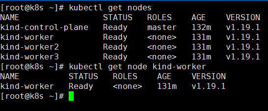

### 基础命令

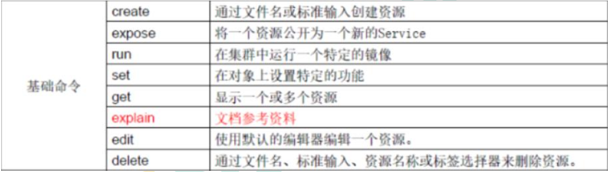

### 部署和集群管理命令

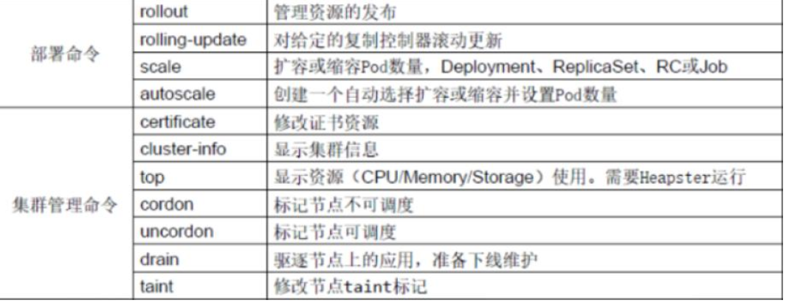

### 故障和调试命令

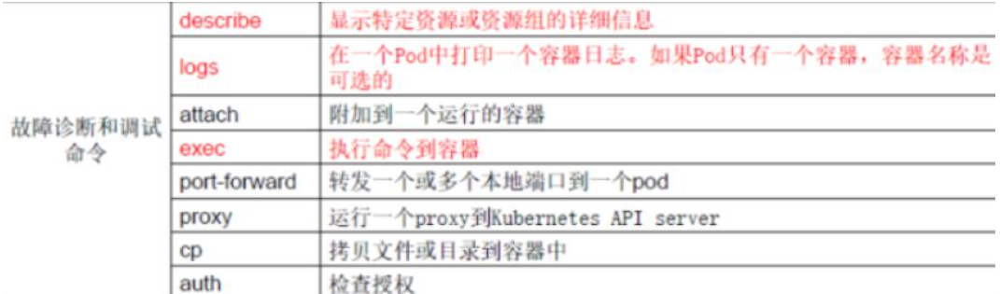

### 其他命令

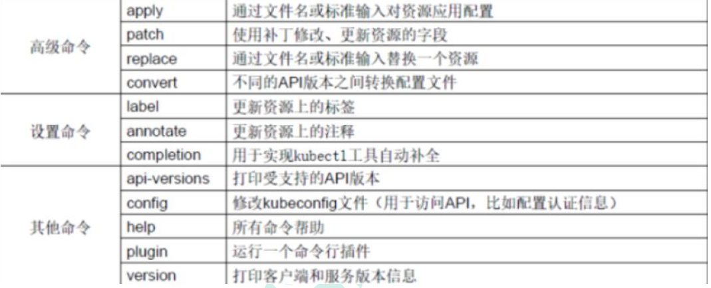


## yaml 文件

### 包含部分：

> 1. 控制器定义
> 2. 被控制对象

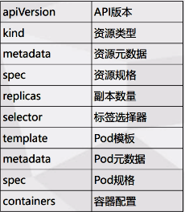


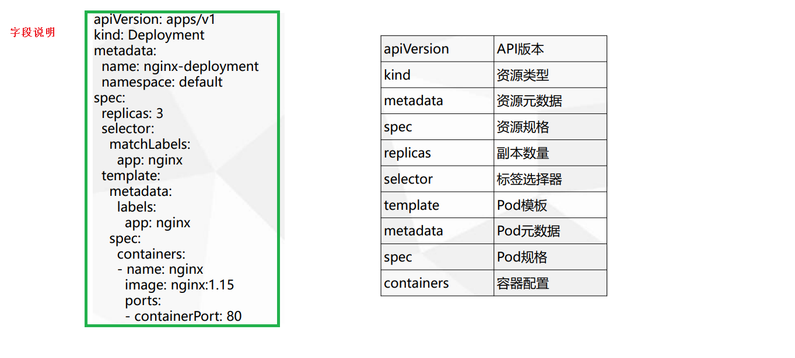

####  如何快速编写yaml文件

1. 使用kubectl create 命令生成yaml文件

   ```shell
   $ kubectl create deplyment web --image=ngnix -o yaml --dry-run > my.yaml
   ```

   

2. 使用kubectl get 命令导出yaml文件

   ```shell
   $ kubectl get deploy ngnix -o=yaml  > my.yaml
   ```


##  核心技术

###  Pod

#### 基本概念

> 是系统中可以创建和管理的最小单元，是资源对象模型中有用户创建和部署的最小资源对象模型，这不是容器

- 最小部署的单元
- 包含多个容器，（一组容器的集合）
- 一个pod中容器共享网络
- pod是短暂的


#### pod 存在的意义

1. 创建容器使用docker，，一个容器为一个程序 
2. pod 是多进程设计，运行多个应用程序 
   - 一个pod 有多个容器，一个容器里面运行一个应用程序
3. pod存在亲密性应用
   - 两个应用之间进行交互
   - 网络之间调用
   - 两个应用需要频繁调用

#### pod实现机制

1. 共享网络

   > 通过pausc容器，把其他业务容器加入到pausc容器里面，让所有业务容器在同一个名称空间中，可以实现网络共享

2. 共享存储__volumn数据卷

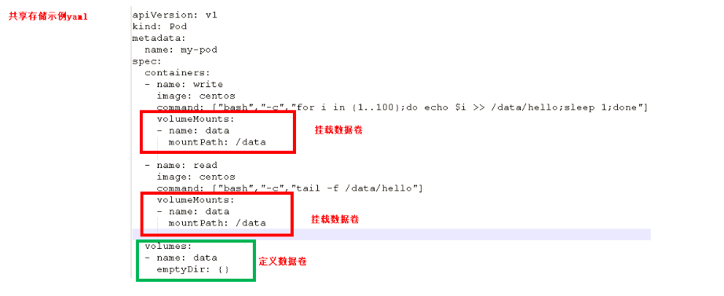

例如 日志数据，业务数据

####  镜像拉取策略

```yaml
imagePullPolicy:Always
```

- ItNotPresent: 默认值，镜像不存在，拉取
- always ： 每此创建pod都会重新拉取一次镜像
- never ： pod永远不会主动拉取这个镜像


#### 资源限制

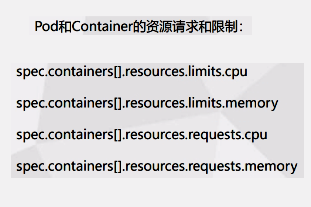

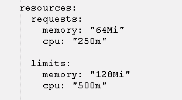

#### 重启机制

```yaml
restartPolicy:Never
```

- always : 当容器终止退出后，总是重启
- OnFailure ： 当容器异常退出后（退出状态码非0），才重启
- never：终止退出，不重启


#### 健康检查

> 进行容器检查
>
> 例如 ： java堆内存溢出
>
> 两种检查机制：

```shell
livenessprobe 存活检查
# 如果检查失败，将杀死容器，根据pod的restartPolicy来操作
readinessProbe 就绪检查
# 如果检查失败，rebernetes会把pod从service endpoints中剔除
```

```shell
probe 支持以下三种检查方法
bttpGet  
# 发送http请求，返回200-400 为成功
exec
# 执行shell命令返回状态码是0为成功
tcpSocket
#发起tcp socket建立成功
```

例子：

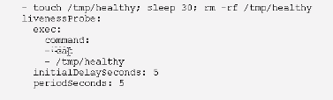

#### 调度策略

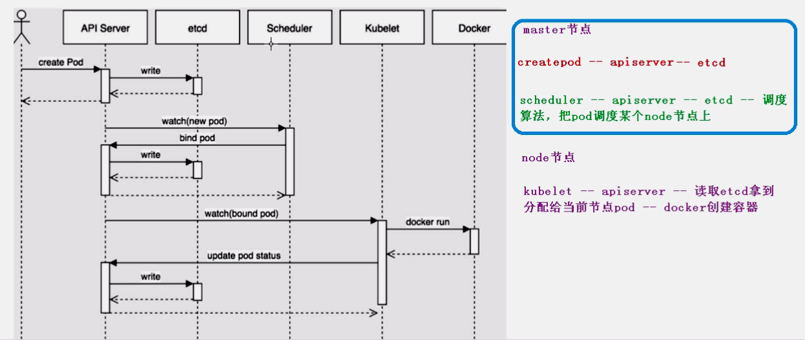

> 影响调度的属性
>
> 1. ==对pod 的资源限制==
>
> 2. ==节点选择器的标签==
>
> 3. ==节点的亲和性==
>
>    - nodeAffinity和之前nodeSelector基本一样的，根据节点标签约束来绝对pod调度到那些节点上
>
>    1. 硬亲和性==约束条件必须满足==；例如标签等
>    2. 软亲和性==尝试满足，不保证==
>
> 4. 污点和污点容忍
>
>    **节点不做普通分配调度，是节点属性**
>
>    专用节点，配置特点硬件节点，基于taint驱逐

- 演示节点污点情况

  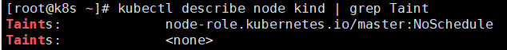

  污点值有三个：

  - noSchedule——一定不被调度
  - PreferNoSchdule——尽量不被调度
  - NoExecute——不会调度，并且还有驱逐node已有pod

  ```shell
  $ kubectl taint node [node] key=value：污点三个值
  ```

- 污点容忍

  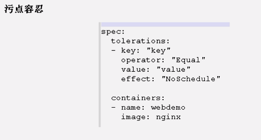

  

### Controller 

#### Controller 概念

> 在集群上管理和运行容器的对象

#### pod 和Controller关系

> 1. pod 是通过Controller 实现应用的运维比如伸缩，滚动更新等
> 2. pod 和Controller 之间通过label标签建立关系selector

#### deployment应用场景

1. 部署无状态应用
2. 管理pod和replicaSet
3. 部署，滚动升级等功能
4. 应用场景： web服务，微服务

#### 使用yaml 文件部署应用

```shell
$ kubectl create deployment web --image=ngnix --dry-run=client -o yaml > demo.yaml
# 导出

# 部署
$ kubectl apply -f demo.yaml

# 对外发布-暴露端口
$ kubectl expose deployment web --port=80 --type=NodePort --target-port=80 --name=web1 -o yaml > web1.yaml
$ kubectl apply -f web1.yaml
```

#### 应用升级回滚和弹性伸缩

```shell
$ kubectl set image deployment web ngnix=ngnix:1.15

# 查看升级状态
$ kubectl rollout status deployment web

# 查看历史版本
$ kubectl rollout history deployment web

# 回滚到上一个版本
$ kubectl rollout undo deployment web

# 回滚到指定版本
$ kubectl rollout undo deployment web --to-revision=2

# 弹性伸缩
$ kubectl scale deployment web --replices=10

```

