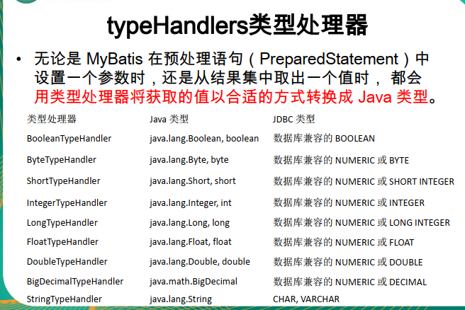

# MyBatis入梦

## 什么是MyBatis

1. MyBatis 是一个半自动化的持久化层框架


###### 与其他对比

1. JDBC ： 
   - SQL 夹在java代码里，耦合度高导致硬编码内伤
   - sql 在代码里，不好频繁修改
2. Hibernate和JPA
   - 复杂的SQL，对于Hibernate而言处理不容易
   - 内部产生的sql，不好优化
   - 全映射的全自动框架，大量字段的POJO，进行部分映射困难


## mybatis

1. 创建MyBatis 全局配置文件
   - 配置设置和属性信息，如 ： 数据库连接池信息，
2. 创建SQL映射文件
   - 相当于定义Dao接口的实现类如何工作，里面包含了sql语句


## Mapper文件

```xml
注意问题： 
    <!--namespace : 名称空间 ； 指定为接口的全类名(接口为名称空间的动态绑定)
        id : 唯一标识
        resultType ： 返回值类型
        #{id} : 从专递过来的参数中取出id值
        public Employee getEmpById(Integer id);
        -->
    <!--尽量bean里面的属性与数据表中的字段一致，当不一致的情况出现，可以在sql映射文件中添加别名，-->
```

```txt
 1. 接口式编程
      原生 Dao ---->   DaoImpi
      mybatis    Mapper ---->  xxMapper.xml

 2. SqlSession 代表和数据库的一次会话，用完关闭
 3. SQLSession和connection 一样都是非线程安全，每次使用都获取新的对象。
  （不可以写成员变量 private SQLSession SQLSession ）
 4. mapper接口没有实现类，但是MyBatis会为这个接口生成一个代理对象
      (将接口和xml进行绑定)
      SQLSession。getMapper （EmployeeMapper.class）

5. 两个重要的配置文件
      MyBatis的全局配置文件，包括数据库连接池信息，事务管理器信息等，系统运行环境等
      sql映射文件，保存了sql的映射信息，这样可以将sql抽取出来
```


## mybatis - 全局配置文件

```xml
<?xml version="1.0" encoding="UTF-8" ?>
<!DOCTYPE configuration
        PUBLIC "-//mybatis.org//DTD Config 3.0//EN"
        "http://mybatis.org/dtd/mybatis-3-config.dtd">

<configuration>
    <!--
		1、mybatis可以使用properties来引入外部properties配置文件的内容；
		resource：引入类路径下的资源
		url：引入网络路径或者磁盘路径下的资源


		但是这块如果跟spring整合的话，可以交给spring来做，所以这个作为了解
	  -->
    <properties resource="dbconfig.properties"></properties>

    <!--
       2. setting 包含很多重要的设置项
       setting：用来设置每一个设置项
        name : 设置项名
        value ： 设置项取消
       -->
    <settings>
        <!--具体说明可以看手册-->
        <setting name="mapUnderscoreToCamelCase" value="true"/>
    </settings>
    <!--
       3. typeAliases ： 别名处理器，可以为我们的java类型起别名
                别名不区分大小写
    -->
    <typeAliases>
        <!-- 1）typeALias: 为某个java类型起别名
                type ： 指定要起别名的类型全类名； 默认是类名小写 ： employee
                alias ： 执行新的别名-->
        <typeAlias type="com.mybatis.bean.Employee"/>

        <!--2）package : 为某个包下所有的类批量起别名
                name；执行包名（为当前包及以下所有的后代的每一个类都默认一个别名(类名小写)）-->
        <package name="com.mybatis.bean"/>
        <!--3）如果当前包下的包还有个类的别名也是employee，可以在类上的上面增加注解@Alias 改变别名-->

    </typeAliases>
    <!--4. environment ： 环境，mybatis可以配置多种环境
            environment ： 配置一个具体的环境信息，必须有两个标签，id 代表当前环境的唯一标识 ，default指定使用某种环境，可以达到快速切换环境
             transactionManager :  事务管理器
             type ： 事务管理器的类型  ;JDBC和MANAGED
                    也可以自定义事务管理器：实现 TransactionFactory接口，type 指定全类名、
             dataSource ：数据源；
                        type ：数据源类型；UNPOOLED|POOLED|JNDI
                            自定义数据源，实现DataSourceFactory接口，type是全类名-->
    <environments default="development">
        <environment id="test">
            <transactionManager type=""></transactionManager>
            <dataSource type=""></dataSource>
        </environment>
        <environment id="development">
            <transactionManager type="JDBC"/>
            <dataSource type="POOLED">
                <property name="driver" value="com.mysql.jdbc.Driver"/>
                <property name="url" value="jdbc:mysql://localhost:3306/mybatis?useSSL=false"/>
                <property name="username" value="root"/>
                <property name="password" value="123456"/>
            </dataSource>
        </environment>
    </environments>

    <!--5.databaseIdProvide 支持多种数据库厂商
            type = "DB_VENDOR", VendorDatabaseIdProvider
                作用就是得到数据库厂商的标识(驱动getDatabaseProductName)，mybatis就是根据数据库厂商来标记不同的sql-->

    <databaseIdProvider type="DB_VENDOR">
        <!--为不同的数据库厂商起别名-->
        <property name="MySQL" value="mysql"/>
        <property name="Oracle" value="oracle"/>
        <property name="SQL Server" value="sqlserver"/>
    </databaseIdProvider>
    <!--将我们写好的sql映射文件(1.xml)一样要注册到全局配置文件(mybatis-config.xml)中-->
    <!--6. 将mappers将sql映射到全局配置中-->
    <mappers>
        <!--
            com.mybatis dao：注册一个sql映射
                resource ： 引用类路径下的SQl映射文件
                url ： 引用网络路径或者磁盘路径下的sql映射文件
                class : 引用(注册)接口
                    1. 有sql映射文件，映射文件必须和接口同名，并且放在接口同一目录下
                    2. 没有sql映射文件，所有的sql都是利用注解写在接口上
                    推荐比较重要的Dao接口我们来写sql映射文件，不重要的就写注解的方式
        -->
        <!--<com.mybatis.dao resource="mybatis.com.mybatis.dao/1.xml"/>-->
        <!--<com.mybatis.dao class="com.EmployeeMapperAnnotation"/>-->

        <mapper resource="com.mybatis.dao/EmployeeMapper.xml"/>
        <!--批量注册 ：
                    文件名和接口名一致的话，可以批量注册-->
        <!--<package name="com.mybatis.dao"/>-->
    </mappers>
</configuration>
```





