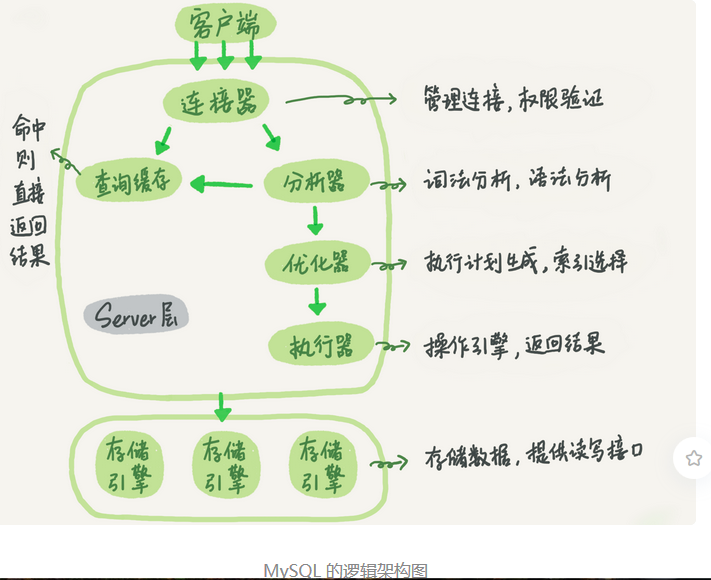
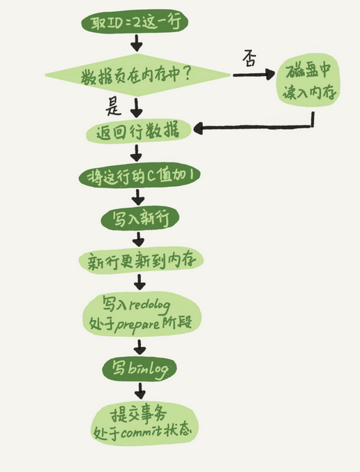
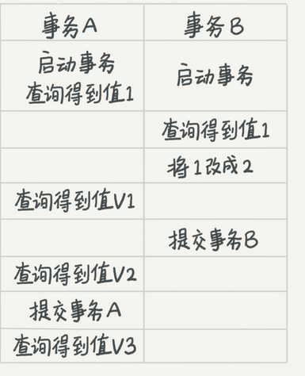

# mysql 学习

## 基础

### 查询语句是如何执行的




#### 连接器

> 连接分为： 
>
> 1. 长连接： 客户端只需要连接一次，就可以一直使用同一个连接
> 2. 短连接：每次请求完成后会断开，下一次会重新连接使用
>
> ==建议使用长连接，或者连接池比较好==
>
> 3. 但不是每个使用，都是用长连接都是好的，使用mysql_reset_conection 来初始化连接资源，更好


####  查询缓存

> 在每次查询之前，都会在缓存中查找数据，但是 大部分的表的更新==频繁==查询缓存的命中率非常低，除非你的业务就是系统配置表，才适合查询缓存
>
> `query_cache_type` 设置成DEMAND 这样默认不会使用查询缓存，
>
> 当每次查询的时候，可以显示指定 SQL_CACHE
>
> ==mysql 8.0 没有查询缓存这个整块功能==，一般使用其他缓存工具进行缓存

#### 分析器

#####  词法分析

> 语句首先执行的就是词法分析，识别出来里面的字符串 分别是什么，代表什么

##### 优化器

> 优化器是在表里面有多个索引的时候，决定使用哪个索引；或者在一个语句有多表关联join的时候，决定各个表的连接顺序，

```sql

mysql> select * from t1 join t2 using(ID)  where t1.c=10 and t2.d=20;
```

> 如果没有直接指定 left join 或者right join  那么就是有优化器来根据效率来选择合适的执行方案

#### 执行器

> 通过分析器知道你要做什么，优化器知道怎么做，那么开始执行语句

1. 首先判断你对这个表有没有权限（前面也会调用验证权限）
2. 如果有权限，那么就会通过引擎定义，打开提供的接口
3.  执行器将上述遍历过程所有满足条件的行组成记录集返回客户端
4. 语句结束完成

### 更新语句是如何进行的

```mysql
mysql> create table T(ID int primary key, c int);

mysql> update T set c=c+1 where ID=2;
```

####  基本流程

> 前期与 查询是一样的步骤，
>
> 进行 分析器，优化器等操作

#### 不同的流程

> 更新流程还涉及日志模块，
>
> 1. redo log 重做日志
> 2. binlog  归档日志

##### redo log

> 相当于延迟操作，将要写入的数据，先写入日志然后最后在写磁盘，
>
> 避免 增加磁盘的压力——高I/O

**redo log 是固定大小的，从头到尾共记录4GB操作**

有了 redo log ，就能保证数据库发生异常重启，数据丢失的情况 ——crash-safe

##### binlog

> mysql  有两大块：  
>
> 1. Server层：mysql 功能层面的事情 binlog
> 2. 引擎层： 负责存储相关的具体事宜 redo log

binlog 只能用于归档

#####  两种日志的对比

1. redo log 是innoDb 引擎 特有的； binlog 是mysql 的Server层实现的，所有引擎都是可以使用
2. redo log 是物理日志，记录的是==在某个数据页上做了什么修改==binlog 是逻辑日志，==记录的是这个语句的原始逻辑，比如“给ID=2 这一行的c字段加1”==
3. redo log 是循环写的，空间固定会用完；binlog 是可以追加写入的，**追加写是指 binlog 文件写到一定大小后回切换到下一个，并不会覆盖以前的日志**

#### 更新update 的内部流程

1. 执行器先找引擎取ID=2 这一行。ID是逐渐，引擎是可以直接使用树搜索找到这一行，如果ID=2 在内容中，则直接放回，不然磁盘查找然后再返回。

2. 执行器拿到引擎给的行数据，把这个值加上1，再写入这行新数据

3. 引擎将这行新数据更新到内存中，同时将这个更新操作记录到redo log 里面，此时 redo log 处于prepare 状态，然后通知执行器完成了，可以随时提交事务。

4. 执行器生成这个操作的binlog ，并写入磁盘

   

   ####  两阶段提交

   > 为了让两份日志之间的逻辑一致

   ##### 如果出现第一个日志成功，一个日志写的时候出现crash

   1. 先写redo log 后写binlog ： 

      系统崩溃，但是仍然能够把数据恢复回来，但是由于binlog没写完crash了，恢复临时库的时候，临时库会少一条更新语句

   2. 先写binlog  后 写 redo log  

      崩溃恢复以后这个事务无效，所以这行值是0，但是binlog已经写入，所以恢复就多一个事务出来 

   #### 问题

   定期备份的周期 取决于系统重要性，有的是一天一备，有的是一周一备，在什么样的情景下，一天一备会比一周一杯更有优势，或者说，它影响了这个数据库系统的那个指标。

### 事务隔离

####  隔离性与隔离级别

> ACID : 原子性，一致性，隔离性，持久性

> 多个事务同时执行的时候，就会出现 ： 脏读，不可重复读，幻读

> sql标准的事务隔离级别包含 ： 读未提交，读提交，可重复读，串行化
>
> 1.  读未提交 ： 一个事务还没提交，他做的变更就能被别的事务所看到
> 2. 读提交 ： 一个事务提交之后，它做的变更才会被其他事务看到
> 3. 可重复读 ： 一个事务执行过程中看到的数据，总是跟这个事务在启动时看到的数据是一致的。当然在可重复度隔离级别下，未提交变更对其他事务也是不可见的
> 4. 串行化： 对同一行记录，写 加 “写锁”，读加 “读锁”。当出现读写冲突时候，后访问的事务必须等前一个事务执行完成，才能继续执行

读提交 和 可重复度  例图



不同的隔离级别下，事务A 有哪些不同的返回结果

- 读未提交 ： v1 =2  ， v2 = v3 = 2
- 读提交 ： v1 = 1, v2 =2  , v3 =2
- 可重复读 ： v1 = v2 = 1 ,  v3 = 2
- 可串行化 ： v1 = v2 = 1 , v3 = 2

可重复度 和 读提交 的隔离级别，是在每个sql语句开始执行的时候创建的。

读未提交 和 串行化  的隔离级别 是直接使用加锁的方式来避免并行访问

**Oracle 数据库 的默认隔离级别就是读提交**

#### 事务隔离的实现

> 每条记录在更新的时候都会同时记录一条回滚操作，记录上的最新值，通过回滚操作，都可以得到前一个状态的值
>
> 不同时刻启动的事务会有不同的read-view 。 同一条记录在系统中可以存在多个版本。就是数据库的多版本并发控制MVCC，

##### 回滚日志什么时候删除

就是当系统里没有比这个回滚日志更早的read-view 的时候。

==尽量不要使用长事务==

尝试无意味着系统里面会存在很老的事务视图，。由于这些事务随时可能会访问数据库里面的任何数据，所以在这个事务提交之前，数据库里面可能会用到回滚记录，所以导致大量空间占用