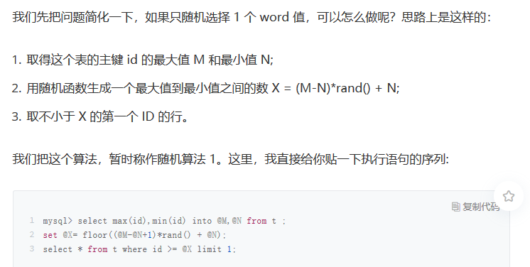

# mysql 学习

## 基础

### 查询语句是如何执行的


#### 连接器

> 连接分为： 
>
> 1. 长连接： 客户端只需要连接一次，就可以一直使用同一个连接
> 2. 短连接：每次请求完成后会断开，下一次会重新连接使用
>
> ==建议使用长连接，或者连接池比较好==
>
> 3. 但不是每个使用，都是用长连接都是好的，使用mysql_reset_conection 来初始化连接资源，更好。这个过程不需要重连或重新做权限验证，但是会将连接恢复到刚刚创建时的状态


####  查询缓存

> 在每次查询之前，都会在缓存中查找数据，但是 大部分的表的更新`频繁`查询缓存的命中率非常低，除非你的业务就是系统配置表，才适合查询缓存
>
> `query_cache_type` 设置成DEMAND 这样默认不会使用查询缓存，
>
> 当每次查询的时候，可以显示指定 SQL_CACHE
>
> `mysql 8.0 没有查询缓存这个整块功能`，一般使用其他缓存工具进行缓存
>
> **但是大多情况下，建议不要使用查询缓存，使用查询缓存往往弊大于利**
>
> - 只要对一个表的更新，这个表上所有的查询缓存都会清空。如果不是配置表的话，查询缓存命中率会非常低
> - `select SQL_CACHE * from T where id = 10;`  要使用查询缓存的语句

#### 分析器

#####  词法分析

> 语句首先执行的就是词法分析，识别出来里面的字符串 分别是什么，代表什么

##### 语法分析

> 这里根据 词法分析的结果，语法分析器会根据语法规则，会判断sql 语言是否满足mysql 语法
>
> 这里报错： 一般是 系统的语法规则，识别字符串失败, 例如 elect 少一个s

#### 优化器

> 优化器是在表里面有多个索引的时候，决定使用哪个索引；或者在一个语句有多表关联join的时候，决定各个表的连接顺序，

```sql

mysql> select * from t1 join t2 using(ID)  where t1.c=10 and t2.d=20;
```

> 如果没有直接指定 left join 或者right join  那么就是有优化器来根据效率来选择合适的执行方案

#### 执行器

> 通过分析器知道你要做什么，优化器知道怎么做，那么开始执行语句

1. 首先判断你对这个表有没有权限（前面也会调用验证权限）
2. 如果有权限，那么就会通过引擎定义，打开提供的接口
3.  执行器将上述遍历过程所有满足条件的行组成记录集返回客户端
4. 语句结束完成

#### 总结：

如果表 T 中没有字段 k，而你执行了这个语句 select * from T where
 k=1, 那肯定是会报“不存在这个列”的错误： “Unknown column ‘k’ in ‘where
 clause’”。你觉得这个错误是在我们上面提到的哪个阶段报出来的呢？

答案：`是优化器而不是分析器`
 优化器会进行优化分析，比如用先执行哪个条件，使用哪个索引。如果没有对应的字段就会报错的，很多人说是执行器，原因是这个时候才打开表获取数据，但是表的字段不是数据啊，是事先定义好的，所以可以直接读取的，不需要打开表。

### 更新语句是如何进行的

```mysql
mysql> create table T(ID int primary key, c int);

mysql> update T set c=c+1 where ID=2;
```

####  基本流程

> 前期与 查询是一样的步骤，
>
> 进行 分析器，优化器等操作

#### 重要的日志模块： redo log

具体来说，当有一条记录需要更新的时候，InnoDB引擎就会先把记录写到redo  log（粉板）里面，并更新内存，这个时候更新就算完成了。同时，InnoDB引擎会在适当的时候，将这个操作记录更新到磁盘里面，而这个更新往往是在系统比较空闲的时候做，这就像打烊以后掌柜做的事.

与此类似，InnoDB的redo log是固定大小的，比如可以配置为一组4个文件，每个文件的大小是1GB，那么这块“粉板”总共就可以记录4GB的操作。从头开始写，写到末尾就又回到开头循环写.

> 相当于延迟操作，将要写入的数据，先写入日志然后最后在写磁盘，
>
> 避免 增加磁盘的压力——高I/O

**redo log 是固定大小的，从头到尾共记录4GB操作**

有了 redo log ，就能保证数据库发生异常重启，数据丢失的情况 ——crash-safe

#### 重要的日志模块： binlog

> mysql  有两大块：  
>
> 1. Server层：mysql 功能层面的事情 binlog
> 2. 引擎层： 负责存储相关的具体事宜 redo log

binlog 只能用于归档

####  两种日志的对比

1. redo log 是innoDb 引擎 特有的； binlog 是mysql 的Server层实现的，所有引擎都是可以使用
2. redo log 是物理日志，记录的是==在某个数据页上做了什么修改==binlog 是逻辑日志，==记录的是这个语句的原始逻辑，比如“给ID=2 这一行的c字段加1”==
3. redo log 是循环写的，空间固定会用完；binlog 是可以追加写入的，**追加写是指 binlog 文件写到一定大小后回切换到下一个，并不会覆盖以前的日志**
4. 更新流程还涉及日志模块，

   1. redo log 重做日志
   2. binlog  归档日志

#### 更新update 的内部流程

1. 执行器先找引擎取ID=2 这一行。ID是逐渐，引擎是可以直接使用树搜索找到这一行，如果ID=2 在内容中，则直接放回，不然磁盘查找然后再返回。

2. 执行器拿到引擎给的行数据，把这个值加上1，再写入这行新数据

3. 引擎将这行新数据更新到内存中，同时将这个更新操作记录到redo log 里面，此时 redo log 处于prepare 状态，然后通知执行器完成了，可以随时提交事务。

4. 执行器生成这个操作的binlog ，并写入磁盘

   

   ####  两阶段提交

   > 为了让两份日志之间的逻辑一致

   ##### 如果出现第一个日志成功，一个日志写的时候出现crash

   1. 先写redo log 后写binlog ： 

      系统崩溃，但是仍然能够把数据恢复回来，但是由于binlog没写完crash了，恢复临时库的时候，临时库会少一条更新语句

   2. 先写binlog  后 写 redo log  

      崩溃恢复以后这个事务无效，所以这行值是0，但是binlog已经写入，所以恢复就多一个事务出来 

   #### 问题

   定期备份的周期 取决于系统重要性，有的是一天一备，有的是一周一备，在什么样的情景下，一天一备会比一周一杯更有优势，或者说，它影响了这个数据库系统的那个指标。
   
   一天一备会比一周一备好处是“最长恢复时间”更短。

### 事务隔离

####  隔离性与隔离级别

> ACID : 原子性，一致性，隔离性，持久性

> 多个事务同时执行的时候，就会出现 ： 脏读，不可重复读，幻读

> sql标准的事务隔离级别包含 ： 读未提交，读提交，可重复读，串行化
>
> 1.  读未提交 ： 一个事务还没提交，他做的变更就能被别的事务所看到
> 2. 读提交 ： 一个事务提交之后，它做的变更才会被其他事务看到
> 3. 可重复读 ： 一个事务执行过程中看到的数据，总是跟这个事务在启动时看到的数据是一致的。当然在可重复度隔离级别下，未提交变更对其他事务也是不可见的
> 4. 串行化： 对同一行记录，写 加 “写锁”，读加 “读锁”。当出现读写冲突时候，后访问的事务必须等前一个事务执行完成，才能继续执行

读提交 和 可重复度  例图


不同的隔离级别下，事务A 有哪些不同的返回结果

- 读未提交 ： v1 =2  ， v2 = v3 = 2
- 读提交 ： v1 = 1, v2 =2  , v3 =2
- 可重复读 ： v1 = v2 = 1 ,  v3 = 2
- 可串行化 ： v1 = v2 = 1 , v3 = 2

可重复度 和 读提交 的隔离级别，是在每个sql语句开始执行的时候创建的。

读未提交 和 串行化  的隔离级别 是直接使用加锁的方式来避免并行访问

**Oracle 数据库 的默认隔离级别就是读提交**

#### 事务隔离的实现

> 每条记录在更新的时候都会同时记录一条回滚操作，记录上的最新值，通过回滚操作，都可以得到前一个状态的值
>
> 不同时刻启动的事务会有不同的read-view 。 同一条记录在系统中可以存在多个版本。就是数据库的多版本并发控制MVCC，

##### 回滚日志什么时候删除

就是当系统里没有比这个回滚日志更早的read-view 的时候。

==尽量不要使用长事务==

尝试无意味着系统里面会存在很老的事务视图，。由于这些事务随时可能会访问数据库里面的任何数据，所以在这个事务提交之前，数据库里面可能会用到回滚记录，所以导致大量空间占用

###### 什么是长事务： 

就是执行时间较长的事务。

`select * from information_schema.INNODB_TRX`

导致什么样的问题发生： 

1. 长事务意味着系统里面会存在很老的事务视图，由于这些事务随时可能防卫数据库里面的任何数据。所以这个事务提交之前，数据库里面它可能用到的回滚记录都必须保留，这就会导致大量占用内存空间
2. 除了对回滚段的影响，长事务还占用锁资源。

解决方法：

1. 等系统不繁忙时操作

2. 检查infomation_schema.INNODB_TRX是否有长事务，考虑先暂停DDL，或者kill掉这个长事务

3. 将长事务分解成小批量事务

4. 设置等待获取锁时间，超时放弃更新

   `ALTER TABLE tbl_name WAIT N add column`


#### 事务的启动方式

1.  显示启动事务语句，begin 或 start transaction 。配套的提交语句是commit，回滚是rollback
2. set autocommit = 0，这个命令会将这个线程的自动提交关掉，意味着如果你只执行一个select语句，这个事务就启动了，而且并不会自动提交。这个事务持续存在制动你主动执行commit 或rollback 语句 ，或者断开连接。

<mark>尽量使用第一种情况，这样既可以在代码中显式看到事务，如果是长连接，就导致意外的长事务。</mark>

- 如果想要避免begin，减少语句的交互次数，可以使用commit work and chain 语句——提交事务并自动下一个事务，可以省去begin语句开销

- 查找长事务持续时间超过60s的事务

  `select * from information_schema.innodb_trx where TIME_TO_SEC(timediff(now(),trx_started))>60`

##### 上一期问题答案：

根据业务重要性来 判断，一天一备虽然是**最长恢复时间**最短，RTO（恢复目标时间）更小，但是频繁备份需要消耗大量的存储空间，


### 索引上

#### 常见索引模型：

> 哈希表，有序数组和搜索树

1. 哈希表 ： 是键值对的存储数据的结构，根据数组里面的键值，来寻找value，例如java中的hashmap 一样，使用<mark>数组，链接</mark></mark>的形式，避免值的重复
   1. 适用于只有等值查询的场景
2. 有序数组 在**等值查询和范围场景**的性能就非常的好，
   1. 只适用于 静态存储引擎(就是不涉及cud 三种操作)
3. 二叉搜索树，<mark>数据库并不是只有平衡二叉树，还有多叉</mark>数据库存储，索引不止存在内存中，还要写到磁盘上
   1. 二叉搜索树，读写性能更好，适配磁盘的访问模式

#### InnoDb 的索引模型

> 表是根据主键顺序以索引的形式存放的，这种存储方式的表为`索引组织表` 即使 B+ 树


从图中： 索引类型分为主键索引和非主键索引

- 主键索引——叶子结点： 存的是整行数据，主键索引为称为`聚簇索引`
- 非主键索引——叶子结点：主键的值，非主键索引也称为`二级索引`

###### 主键索引和普通索引的查询有什么区别？

- 如果语句是select * from T where ID = 400,即 主键查询方式，则只需要搜索ID这课B+树
- 如果语句是select * from T where k = 5 ,即 普通索引查询方式，则需要先搜索k索引树，得到ID的值为500，再到ID索引树所搜一次，这个过程叫回表
- <mark>基于非主键索引的查询需要多少米一棵索引树，尽量使用主键查询</mark>

#### 索引维护

> B+ 树为了维护索引有序性，有插入新值的时候需要做必要的维护。
>
> - 如果插入 id400，需要在逻辑上挪动后面的数据，控制位置---麻烦
> - 如果所在的数据页已经满了,根据B+树的算法，这时候需要申请一个新的数据页，然后挪动部分数据过去。——页分裂——更加对性能影响

主键的长度越长，叶子结点的数据就越大，例如 身份证号为 20字节，整型做主键只要4个字节

<mark>显然： 主键长度越小，普通索引的叶子结点就越小，普通索引占用的空间也就越小<mark>


### 索引下

> 常见在索引下，select 查询 between，会执行树 的3条记录，回表了两次


#### 覆盖索引

> 可以不让其回表，减少树的搜索次数，显著提升查询性能，常用的性能优化手段

#### 最左前缀原则

> 对于不频繁使用的记录，在B+树这种索引结构，可以利用最左前缀，来定位记录
>
> 可以是最左n个字段，或者是字符

##### 在建立联合索引的时候，如何安排索引内的字段顺序

1. 如果通过调整顺序，可以少维护一个索引，那么这个顺序往往就是需要优先考虑采用的
2. 考虑空间的大小，例如 name 字段比 age 大，，可以先创建（name，age）的联合索引和一个age 的单字段索引

#### 索引下推

> 可以在索引遍历过程中，对索引中包含的字段先做判断，直接过滤掉不满足条件的记录，减少回表数。

### 全局锁和表锁

> mysql 锁 大致分为： 全局锁，表级锁，行锁三类


#### 全局锁

> 对整个数据库实例加锁，
>
> 使用长江 ： 全库逻辑备份
>
> 自带逻辑备份工具 ： mysqldump    参数 -single-transaction 的时候就会使用事务拿到一致性视图

但是 一致性 读 ，不是适用于所有引擎。例如 MyIsAm，就需要FTWRL 命令

`single-transaction`方法只使用与所有表事务引擎的库


#### 表级锁

> 1. 表锁
> 2. 元数据锁 meta data lock——MDL

##### 如何安全的给表加字段

1. 首先停掉 长事务
2. 如果是热点表，在alter table 加入等待时间，重复通过命令尝试拿到MDL 锁，修改表

### 行锁

> <mark>在InnoDb 事务中，行锁是 在需要的时候才加上的，但并不是不需要了就like释放，而是要等到事务结束时才释放——两段锁协议<mark>
>
> 所以：  如果事务需要锁多行，要把最可能造成锁冲突，最可能影响并发度的锁尽量往后放

##### 死锁和死锁检测

> 当并发系统中不同线程出现循环资源依赖，涉及的线程都在等待别的线程释放资源时，就会导致这几个线程都计入了无线等待的状态——死锁

###### 出现死锁的两种策略

1. 直接进行等待，直到超时，通过参数innodb_lock_wait_timeout来设置
2. 发起死锁检测，发现死锁后，主动回滚死锁链条中的某个事务，让其他事务得以继续执行，参数InnoDb_deadlock_detect 设置为on表示开启

**优先使用第二种方法，但是会造成CPU资源大量消耗**

- 控制并发度，
  - 在客户端做并发控制，但是并不是可取之法，峰值很高
  - 数据库服务端。可以通过中间件实现或者修改mysql源码；<mark>对于相同行的更新，在进入引擎之前排队。这样引擎内部不会有大量死锁检测工作了</mark>

### 事务是隔离还是不隔离

##### mysql 两个视图的概念：

1. 一个是view ，他是用查询语句定义虚拟表，在调用的时候执行查询语句并生成结果。创建视图的语法create view
2. 另一个是InnoDb 在实现MVCC 时用到的一致性读视图，即conststent read view 用于支持RC （读提交） 和RR（可重复读）隔离级别的实现，，作用在`事务执行期间用来定义“我能看到什么数据”`


##### `快照`在MVCC 里是怎么工作的

> InnoDB 里面每个事务有一个唯一的事务ID，叫做transaction id，。它是在事务开始的时候向InnoDb 的事务系统申请的，是**按照申请顺序严格递增的**

总结 ： 数据库的一行记录，其实存在多个版本，每个版本有自己的trx_id 

但是 版本id 并不是真实存在的，是通过当前版本和undo log 计算出来的。


#### 事务的可重复读的能力怎么实现？


## 实践

### 普通索引和唯一索引，选择

> 背景图： InnoDB 的数据是按数据页为单位来读写的，也就是说： 当需要读一条记录的时候，并不是将这个记录本身从磁盘读出来，而是以页为单位，将其整体读入内存。每个数据页的大小默认为16KB

#### 更新过程


redo log 主要节省的是随机写磁盘的IO消耗（转成顺序写） 而 change buffer 主要节省的则是随机读磁盘的IO消耗

### mysql 选错索引

> 最直观的表现是: 扫描的行数，优化器通过各种方法，例如临时表，等判断扫描的行数，但是存在误判的情况存在，但是不多

#### 索引选择异常和处理

1. 采用 force index 强制选择索引
2. 修改语句，引导mysql 使用 期望的索引
3. 在某些特定的场景下，可以新增一个更适合的索引，来提供给优化器做选择，或删除误用的索引

### 给字符串字段加索引

1. 可以使用前缀索引，定义好长度，就可以做到既节省空间，又不用额外增加太多的查询成本
2. 选择前缀索引，就不要覆盖索引对查询性能的优化了


#### 其他方式用于高区分度

1. 倒序存储
2. 使用hash字段

- 相同点 ： 都不支持范围查询，
- 区别：
  - 从占用的额外空间来看，两者相差不大
  - CPU消耗，倒序每次都需要调用一次反转函数，hash都需要计算一次hash值
  - 查询效率，，hash 查询性能相对更稳定一些

### 有时mysql查询的语句突然慢了下

**当内存数据页跟磁盘数据页内容不一致的时候，这个内存页 为 脏页，内存数据写入到磁盘后，内存和磁盘上的数据页的内容就一致了，为干净页**


#### 为什么表数据删掉一般，表文件大小不变

delete 命令 其实 只是把 记录的位置，或者数据页标记为了“可复用”，单磁盘文件的大小是不会变的。

不只是删除数据会造成空洞，插入数据也会。


#### 重建表

可以使用临时表，进行数据紧凑起来，

也可以使用alter table A engine  = InnoDB 命令来重建表。mysql 会自动完成转存数据，交换表名，删除旧表的操作

### count（*） 速度慢

1. MyISAM 表虽然count（*）很快，但是不支持事务
2. show table status 命令返回很快，但是不准确
3. InnoDB 直接count ，会遍历全表，结果准确，性能低下


##### count（） 里面的数值的不同，性能的不同


性能排序 ： count(字段） < count (主键id） < count(1)  = count(*)

### 日志和索引相关的问题

#### Mysql 怎么知道binglog 是 完整的？

一个事务的binlog 是有完整格式的：

1. statement 格式的binglog ，最后会有COMMIT
2. row 格式的binglog ，最后会有一个XID event
3. ==在5.6.2版本后，有binglog-checksum 参数来验证binlog内容的准确性==


#### redo log 和 binlog 是怎么关联起来的

他们有一个共同的数据字段，叫XID，崩溃恢复的时候，会按顺序扫描redo log；

- 如果碰到既有prepare ，又有commit 的redo log ，就直接提交
- 如果碰到只有prepare，而没有commit 的redo log，就拿着XID去binlog 找对应的事务


#### 处于prepare 阶段的redo log 加上完整binlog ，重启就能恢复，MYsql 为什么要这么设计？

> 其实，这个问题与前面说到的数据与备份的一致性相关。在时刻B，也就是binlog 写完之后Mysql 崩溃，这时候binglog 已经写入了，之后就会被从库使用
>
> so ： 在主库也要提交这个事务，采用这个策略，主库和备库的数据就保证了一致性


### order by 是怎么工作的

> 有两种排序
>
> 1. 全字段排序
> 2. rowid 排序

如果内存够用，会优先使用全字段排序，把需要的字段都放我sort_buffer中，这样排序后，就直接从内存里面返回查询结果。

如果内存不够用，会影响排序效率，采用rowid排序算法，这样一次可以排序更多行，但是需要到原表拿数据。


#### 。。

换句话是： 原数据 就是无序的，但是使用索引，索引是有序的，所以速度是比较快的

**覆盖索引是指，索引上的信息足够满足查询请求，不需要再回到主键索引上去取数据**


### 如何正确地显示随机消息

order by rand（） 使用了内存临时表，内存临时表排序的时候使用了rowid 排序方法


#### 磁盘临时表

> 默认引擎是InnoDB
>
> 超过memory 的限制，就会将内存表，转换为磁盘临时表

#### 随机排序方法



### 为什么sql语句逻辑相同，性能差异大

#### 条件字段函数操作

1. 对索引字段做函数操作，可能会破坏索引值的有序性，因此优化器就决定放弃走输搜索功能

#### 隐式类型转换

1. 连接过程中要去在被驱动表的索引字段上加函数操作，是直接导致全表扫描的原因
2. 隐式类型转换也是 通过函数操作

### 一行语句，执行也慢

#### 查询长时间不返回

1. 等待MDL锁 ： show processlist 查看锁是否有线程占用
2. 等flush 
3. 等行锁

#### 查询慢

> ==坏查询不一定是慢查询==

一般是长时间的扫描导致的


### 幻读是什么，幻读有什么问题

#### 幻读是什么

幻读指的是一个事务在前后两次查询同一个范围的时候，后一次查询看到了前一次查询没有看到的行。

1. 在可重复读离级别下，普通的查询是快照度，是不会看到别的事务插入的数据的，因此，幻读在“当前读”下才会出现
2. 上面session B 的修改结果，被session A 之后select 语句用“当前读”看到，不能称为幻读，幻读仅专指“新插入的行”

#### 幻读有什么问题

##### 语义问题： 

语义会被破坏

##### 数据一致性的问题：

数据库内部数据状态在此刻的一致性，数据和日志在逻辑上的一致性

#### 如何解决幻读

产生原因： 行锁只能锁住行，但是新插入记录这个动作，要更新的是记录之间的间隙，。因此，为了解决幻读问题，加入间隙锁Gap Lock


间隙锁 ： 锁的就是两个值之间的空隙，比如文章开头的表t，初始化插入了6个记录，这就产生了7个间隙


### 只改一行的语句，锁这么多


### “饮鸩止渴” 提高性能的方法

#### 短连接风暴

1. 先处理掉那些占着连接但是不工作的线程
2. 减少连接过程的消耗

#### 慢查询性能问题

1.  索引没有设计好
   - 紧急创建索引来解决
2. sql 语句没有写好
3. mysql 选错了索引
   - 应急方案是，添加force index 


### mysql 是怎么保证数据不丢的

binlog 的写入机制

事务执行过程中，先把日志写到binglog cache ，事务提交的时候，再把binlog cache 写到binlog 文件中


###  MYSQL 是怎么保证主备一致的


上述图为主备切换流程


 

### mysql 是怎么保证高可用的

#### 主备延迟

- 来源
  1. 备库的机器性能比主库稍差
  2. 备库分担一部分语句，耗费太多资源，影响同步资源
  3. 大事务：`不要一次性用delete语句删除太多数据`，`大表DDL`
- 开启并行复制

 备库为什么延迟好几个小时


### 主库出问题了，从库怎么办

> 一主多从的切换正确性
>
> 一般用于读写分析，主库负责所有的写入和一部分读，其他的读请求有从库分担


####  切换过程

##### 基于位点的主备切换

```yaml

CHANGE MASTER TO 
MASTER_HOST=$host_name 
MASTER_PORT=$port 
MASTER_USER=$user_name 
MASTER_PASSWORD=$password 
MASTER_LOG_FILE=$master_log_name 
MASTER_LOG_POS=$master_log_pos  
```

==通常情况下，我们在切换任务的时候，要先主动跳过这些错误，有两种常用的方法。==

1. 主动跳过事务 

   ```sql
   
   set global sql_slave_skip_counter=1;
   start slave;
   ```

2. 通过设置slave_skip_errors参数，直接设置跳过指定的错误

==使用GTID模式下，一主多从切换就非常方便==

### 读写分离有那些坑

> 读写分离的主要目标： 分摊主库的压力，
>
> 一种是 ： 客户端主动做负载均衡。这种模式下一般会把数据库的连接信息放在客户端的连接层。**也就是说客户端来选择后端数据库进行查询**
>
> 另外一种是： 在数据库和客户端之间有一个中间代理层proxy，有proxy来决定请求类型和上下文决定请求的分发路由

1. 客户端直连方案： 少一层转发，查询性能会好点，排查问题方便、**缺点**：由于要了解后端部署细节，出现主备切换，库迁移等操作，客户端都会感知到，并且需要调整。但是可以同etcd 或者zookeeper 进行消息同步，和统一性。
2. proxy，对客户端比较友好。但是后端维护团队要求更高，proxy也需要高可用，或者主从，整体架构更加的复杂


#### 处理过期读问题：

##### 强制走主库方案

将查询请求做分类

1. 必须要拿到最新结果请求，主库操作
2. 旧数据，从库

##### sleep 方案

在执行请求的时候，执行sleep1 以下

##### 判断主备无延迟方案

1. 每次从库查询请求前，先判断seconds_behind_master是否已经等于0，如果还不等于0，那就必须等到这个参数变为0才请求

2. 对比位点确保主备无延迟

   

3. 对比GTID 集合确保主备无延迟

   

##### 配合semi-sync方案


##### 等主库位点方案


##### 等GTID方案


### 如何判断一个数据库是不是出问题了

1.  select 1 成功返回，说明进程存在，主库没有问题

2. 查表判断：创建一个表，放一行数据定期检查

3. 更新判断：定期更新有意义字段： 例如时间戳

4. 内部统计，

   

   

### 误删数据，怎么办


#### 删除数据分类

1. 可以使用Flashback 工具通过闪回把数据恢复

   - 就是修改binlog 内容
   - 

2. 误删库/ 表

   - 使用全量备份，加增量日志的方式

3. 延迟复制备库

   给人工反应时间，从库并没有同步数据，则原始数据还存在

#### 预防误删库、表方法

1. 账号分离
2. 指定操作规范


==rm 删除数据==

一般高可用机制的Mysql集群来说，只要不是整个集群删除，HA会自动分主库操作的


### 为什么还有kill不掉的语句

> mysql有两个kill命令 ： 
>
> 1. kill query + 线程id
> 2. kill connection + 线程id

原因 ： 

1. 线程没有执行到判断线程状态的逻辑
2. 终止逻辑耗时较长 

### 查大量数据，数据库内存会不会爆

对于正常的线上业务来说：如果一个查询的返回结果不会很多的话，建议使用mysql_store_result 这个接口，直接把查询结果保存到本地内存

### 到底可不可以使用join

> join语句执行过程中，驱动表是走==全表扫描==，而被驱动表是走==走树搜索==

1. 使用join语句，性能比强行拆成多个单表执行sql语句的性能要好
2. 如果使用join语句的话，需要让小表做驱动表
3. ==前提==可以使用被驱动表的索引
4. **在决定哪个表做驱动表的时候，应该是两个表按照各自的条件过滤，过滤完成之后，计算参与join的各个字段的总数据量，数据量小的那个表，就是 “小表”，应该作为驱动表**

###  join 语句怎么优化

> 大多数的数据都是按照主键递增顺序插入得到的，所以我们可以认为，如果按照主键的递增顺序查询的话，对磁盘的读比较接近顺序读，能够提交读性能。

### 为什么临时表可以重名

> 临时表 ： 就是内存表
>
> 内存表 ： 指的是使用Memory 引擎的表，建表语法是create table ... engine=memory。 这种表的数据都保存在内存里，系统重启的时候会被清空，但是表结构还在。除了这两个特性看上去比较“奇怪”外，从其他的特征上看，他就是一个正常的表。
>
> 临时表 ： 可以使用各种引擎类型。如果是使用InnoDB引擎或者MyISAM 引擎 的临时表，写数据的时候是写到磁盘上的。当然，临时表也可以使用Memory 引擎。

### 什么时候会使用内部临时表

1. 使用union 执行流程
2. group by 执行流程

### 自增主键为什么不是连续的

由于自增主键，可以让主键索引尽量地保持递增顺序插入，避免了页分裂，因此索引更紧凑，

但是自增主键不是连续递增的


表的结构定义存放在后缀名为.frm的文件汇总，但是并不会保存自增值


1. 唯一冲突是导致自增主键id不连续的第一种原因
2. 事务回滚也会产生类似的现象，这就是第二种原因


### 如何最快的复制一张表

1. mysqldump 方法

   >
   >
   >mysqldump -h$host -P$port -u$user --add-locks=0 --no-create-info --single-transaction  --set-gtid-purged=OFF db1 t --where="a>900" --result-file=/client_tmp/t.sql

- single-transaction 作用是：在导出数据的时候不需要对原表加表锁，而是使用START TRANSACTION WITH CONSISTENT SNAPSHOT 的方法；
- add-locks 设置为0，表示在输出的文件结果里，不增加“LOCK TABLES t WRITE”
- no-create-info 的意思是 ： 不需要导出表结构
- set-gtid-purged=off 表示的是，不输出跟GTID相关的信息
- result-file 指定了输出文件的路径，其中client表示生成的文件是在客户端机器上的

2. 导出 csv 文件

   > select * from db1.t where a>900 into outfile '/server_tmp/t.csv';

   - 这条语句会将结果保存在服务端，如果你执行命令的客户端和mysql 服务端不在同一个机器上，客户端机器的临时目录下是不会生成csv文件的
   - into outfile 指定了文件的生成位置/server_tmp/ ,这个位置必须参数secure_file_priv的限制，参数secure_file_priv的可选值和作用分别是：
     - empty ： 表示不限制文件生成位置，不安全的设置
     - 设置一个表示路径的字符串，就要求生成的文件只能放在这个指定的目录，或者他的子目录
     - 设置为null，就表示禁止在这个mysql实例上执行select ... into outfile 操作
   - 不会覆盖文件，存在相同文件会报错
   - 生成文件中，原则上一个数据行对应文本文件的一行。出现换行符会有转义字符

   >
   >
   >load data infile '/server_tmp/t.csv' into table db2.t;

### grant之后要跟着flush privileges 吗

grant 是用来用户赋权的

赋最高权限：

> grant all privileges on *.* to 'ua'@'%' with grant option;
>
> 收回
>
> revoke all privileges on *.* from 'ua'@'%';

db权限

> grant all privileges on db1.* to 'ua'@'%' with grant option;

表权限 和列权限

> create table db1.t1(id int, a int);
>
> grant all privileges on db1.t1 to 'ua'@'%' with grant option;
> GRANT SELECT(id), INSERT (id,a) ON mydb.mytbl TO 'ua'@'%' with grant option;

**正常情况下，grant命令之后，没有必要跟着flush privileges 命令**

==flush privileges==

当数据表中的权限数据跟内存中的权限数据不一致的时候，

可以 用来重建内存数据，达到一致状态


### 自增id用完怎么办

thread_id ： 线程id

trx_id : 事务id，只读事务不会分配id

Xid 是有server 层维护的，InnoDb 内部使用XID，就是为了能够在InnoDb事务和server之间做关联

XId ： 是redo log 和binlog 的共同字段，用来对应事务的

1. 表的自增id达到上限后，再申请时他的值就不会改变，进而导致继续插入数据时报主键冲突的错误
2. row_id 达到上限后，则会归0 在重新递增，如果出现相同的row_id ，后写的数据会覆盖之前的数据
3. xid 只需要不在同一个binglog 文件中出现重复值即可。虽然理论会出现重复值，但是概率极小
4. InnoDb 的max_trx_id 递增值每次mysql 重启都会被保存起来，
5. thread_id 是我们使用中最常见，而且是处理的最好的一个自增id逻辑了。


