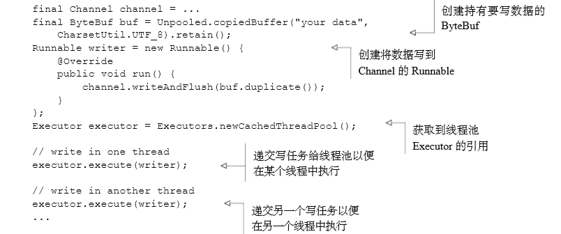
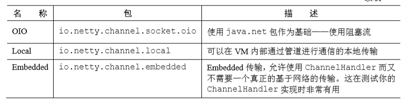

# Netty 的学习


##  基础概念

1. 异步

   > 通常，你只有在已经问了一个问题之后才会得到一个和它对 应的答案，而在你等待它的同时你也可以做点别的事情。 
   >
   > 在日常的生活中，异步自然而然地就发生了，所以你可能没有对它考虑过多少。但是让一个 计算机程序以相同的方式工作就会产生一些非常特殊的问题。本质上，一个既是异步的又是事件 驱动的系统会表现出一种特殊的、对我们来说极具价值的行为：它可以以任意的顺序响应在任意 的时间点产生的事件


## Netty 的核心组件

> Netty 的主要构件块：
>
> 1. Channel
> 2. 回调
> 3. Future
> 4. 事件 和ChannelHandler


### Channel

> Channel 是java NIO 的一个基本构造。
>
> `它代表一个到实体（如一个硬件设备、一个文件、一个网络套接字或者一个能够执 行一个或者多个不同的I/O操作的程序组件）的开放连接，如读操作和写操作 `
>
> 可以把Channel看作是传入（入站）或者传出（出站）数据的载体。它可以被打开或者被关闭，连接或者断开连接

### 回调

> 一个回调就是一个方法，一个指向已经被提供给另外一个方法的方法的引用。
>
> 这使得后者可以在适当的时候调用前者。

Netty 在内部使用了回调来处理时间；当一个回调被触发时，相关的事件可以被一个interface-ChannelHandler 的实现处理。

```java
public class ConnectHandler extends ChannelInboundHandlerAdapter{

	public void channelActive(ChannelHandlerContext ctx)
        throws Exception {
    	Systemc.out.println("Clinet" + ctx.channel().remoteAddress() + "connected");
        当一个新的连接已经被建立时，channelActive（ChannelHandler） 将会被调用
    }
}
```


### Future

> Future 提供了另一种在操作完成时通知应用程序的方法。这个对象可以看做是一个异步操作的结果的占位符；他将在未来的某个时刻完成，并提供对其结果的访问。
>
> Netty 是有自己实现的——ChannelFuture，用户在执行异步操作的时候使用。

ChannelFuture提供了几种额外的方法，这些方法使得我们能够注册一个或者多个 ChannelFutureListener实例。监听器的回调方法operationComplete()，将会在对应的 操作完成时被调用 。然后监听器可以判断该操作是成功地完成了还是出错了。如果是后者，我 们可以检索产生的Throwable。简而言之，由ChannelFutureListener提供的通知机制消除 了手动检查对应的操作是否完成的必要。 

每个Netty 的出站I/O 操作都将返回一个ChannelFuture ；也就说，他们都不会阻塞。

```java
// 异步的建立连接
Channel channel = ...;
ChannelFuture future = channel.connect(new InetSocketAddress("192.168.0.1",25));
/**
这里， connect()方法将会直接返回，而不会阻塞，该调用将会在后台完成。这究竟什么时候会发生 则取决于若干的因素，但这个关注点已经从代码中抽象出来了。因为线程不用阻塞以等待对应的 操作完成，所以它可以同时做其他的工作，从而更加有效地利用资源。
**/
```

```java
// 回调实战
Channel channel = ...;

ChannelFuture future = channel.connect (new InetSocketAddress("192.168.0.1",25));  // 异步的连接到远程结点
future.addListener(new ChannelFutureListener(){
	//注册一个ChannelFutureListener，以便在操作完成时获得通知
    public void operationComplete(ChannelFuture future){
    	if (future.isSuccess()){
        	ByteBuf buffer = Unpooled.copiedBuffer("Hello",Charset.defaultCharset());//如果操作成功，则创建一个ByteBuf以持有数据
            ChannelFuture wf = future.channel().writeAndFlush(buffer);//将数据异步地发送到远程结点。返回一个ChannelFuture
            ...
        }else {
        	Throwable cause = future.cause(); // 如果发生错误，则访问描述原因的Throwable
            cause.printStackTrace(); 
        }
    }
}
/**
需要注意的是，对错误的处理完全取决于你、目标，当然也包括目前任何对于特定类型的错误 加以的限制。例如，如果连接失败，你可以尝试重新连接或者建立一个到另一个远程节点的连接。
 如果你把 ChannelFutureListener 看作是回调的一个更加精细的版本，那么你是对的。 事实上，回调和Future是相互补充的机制；它们相互结合，构成了Netty本身的关键构件块之一。
 
*/
```


###  事件和ChannelHandler

> Netty 使用不同的事件来通知我们状态的改变或者是操作的状态。这使得我们能够基于已经发生的时间来出发适当的动作。动作可能是：
>
> - 记录日志
> - 数据转换
> - 流控制
> - 应用程序逻辑
>
> Netty 是一个网络编程框架，以事件是按照它们与入站或出站数据流的相关性进行分类的。 可能由入站数据或者相关的状态更改而触发的事件包括：
>
> - 连接已被激活或者连接失活
> - 数据读取
> - 用户事件
> - 错误事件
>
> 出站事件是未来将会触发的某个动作的操作结果，这些动作包括：
>
> - 打开或者关闭到远程节点的连接
> - 将数据写到或者冲刷到套接字


Netty 提供了大量预定义的可以开箱即用的 ChannelHandler 实现，包括用于各种协议 （如 HTTP 和 SSL/TLS）的ChannelHandler。在内部，ChannelHandler自己也使用了事件 和Future，使得它们也成为了你的应用程序将使用的相同抽象的消费者。


## Netty 瓦能demo


Netty 客户端/服务器概览


所有的Netty 服务器都需要以下两部分：

- 至少一个ChannelHandler ——该组件实现了服务器对从客户端接收的数据的处理，即他的业务逻辑
- 引导——这是配置服务器的启动代码。至少，它会将服务器绑定到他要监听连接请求的端口上。


因为你的Echo 服务器会响应传入的消息，所以它需要实现ChannelInboundHandler接口，用 来定义响应入站事件的方法。这个简单的应用程序只需要用到少量的这些方法，所以继承 Channel- InboundHandlerAdapter类也就足够了，它提供了ChannelInboundHandler的默认实现。 我们感兴趣的方法是： 

- channelRead（）——对于每个传入的消息都要调用
- channelReadComplete（）——通知ChannelInboundhandler 最后一次对ChannelRead（）的调用是当前批量读取中的最后一条消息
- exceptionCaught（）——在读取操作期间，有异常抛出时会调用

### demo 代码

#### client

```java
package com.study.demo.client;

import io.netty.bootstrap.Bootstrap;
import io.netty.channel.ChannelFuture;
import io.netty.channel.ChannelInitializer;
import io.netty.channel.EventLoopGroup;
import io.netty.channel.nio.NioEventLoopGroup;
import io.netty.channel.socket.SocketChannel;
import io.netty.channel.socket.nio.NioSocketChannel;

import java.net.InetSocketAddress;

/**
 * @author Firewine
 * @version 1.0.0
 * @ClassName EchoClient.java
 * @createTime: 2020年11月19日 15:35:15
 * @Description TODO
 */
public class EchoClient {

    private final String host;
    private final int port;

    public EchoClient(String host, int port) {
        this.host = host;
        this.port = port;
    }

    public void start() throws InterruptedException {
        EventLoopGroup group = new NioEventLoopGroup();
        try {
            Bootstrap b = new Bootstrap();
            b.group(group)
                    // 配置适用于NIO ，还可以是OIO（阻塞式）
                    .channel(NioSocketChannel.class)
                    .remoteAddress(new InetSocketAddress(host, port))
                    .handler(new ChannelInitializer<SocketChannel>() {
                        @Override
                        protected void initChannel(SocketChannel socketChannel) throws Exception {
                            socketChannel.pipeline().addLast(
                                    new EchoClientHandler()
                            );
                        }
                    });
            // 连接到远程结点，阻塞等待直到连接完成
            ChannelFuture f = b.connect().sync();
            // 阻塞，直到channel 关闭
            f.channel().closeFuture().sync();
        } finally {
            group.shutdownGracefully().sync();
        }
    }

    public static void main(String[] args) throws InterruptedException {
        if (args.length != 2) {
            System.err.println("Usage: " + EchoClient.class.getSimpleName() + " <host> <port>");
            return;
        }
        String host = args[0];
        int port = Integer.parseInt(args[1]);
        new EchoClient(host, port).start();
    }
}

```

```java
package com.study.demo.client;

import io.netty.buffer.ByteBuf;
import io.netty.buffer.Unpooled;
import io.netty.channel.ChannelHandlerContext;
import io.netty.channel.SimpleChannelInboundHandler;
import io.netty.util.CharsetUtil;

/**
 * @author Firewine
 * @version 1.0.0
 * @ClassName EchoClientHandler.java
 * @createTime: 2020年11月19日 13:38:49
 * @Description TODO
 */
@io.netty.channel.ChannelHandler.Sharable
public class EchoClientHandler extends SimpleChannelInboundHandler<ByteBuf> {
    @Override
    protected void channelRead0(ChannelHandlerContext channelHandlerContext, ByteBuf byteBuf) throws Exception {
        // 记录已接收消息的转储
        System.out.println("client received : " + byteBuf.toString(CharsetUtil.UTF_8));
    }


    @Override
    public void channelActive(ChannelHandlerContext ctx) throws Exception {
        // 当被通知Channel 是活跃的时候，发送一条消息
        ctx.writeAndFlush(Unpooled.copiedBuffer("netty rocks!", CharsetUtil.UTF_8));
    }

    @Override
    public void exceptionCaught(ChannelHandlerContext ctx, Throwable cause) throws Exception {
        // 在发生异常时，记录错误，并关闭Channel
        cause.printStackTrace();
        ctx.close();
    }
}
/*
* 首先，
* 你重写了 channelActive()方法，其将在一个连接建立时被调用。
* 这确保了数据 将会被尽可能快地写入服务器，
* 其在这个场景下是一个编码了字符串"Netty rocks!"的字节 缓冲区。
* 接下来，你重写了channelRead0()方法。每当接收数据时，都会调用这个方法。
* 需要注 意的是，由服务器发送的消息可能会被分块接收。也就是说，
* 如果服务器发送了 5 字节，那么不 能保证这 5 字节会被一次性接收。
* 即使是对于这么少量的数据，channelRead0()方法也可能 会被调用两次，
* 第一次使用一个持有 3 字节的 ByteBuf（Netty 的字节容器），
* 第二次使用一个 持有 2 字节的 ByteBuf。作为一个面向流的协议，
* TCP 保证了字节数组将会按照服务器发送它 们的顺序被接收。
* 重写的第三个方法是exceptionCaught()。
* 记录Throwable，关闭Channel，在这个场景下，终止到服务器的连接。
 */
```

#### server

```java
package com.study.demo.sever;

import io.netty.bootstrap.ServerBootstrap;
import io.netty.channel.ChannelFuture;
import io.netty.channel.ChannelInitializer;
import io.netty.channel.EventLoopGroup;
import io.netty.channel.nio.NioEventLoopGroup;
import io.netty.channel.socket.SocketChannel;
import io.netty.channel.socket.nio.NioServerSocketChannel;

import java.net.InetSocketAddress;

/**
 * @author Firewine
 * @version 1.0.0
 * @ClassName EchoServer
 * @Description 创建服务器的主要代码组件：
 * 1. EchoServerHandler 实现了业务逻辑
 * 2. main方法引导了服务器
 * 引导过程步骤如下：
 * 1. 创建一个ServerBootstrap的实例以引导和绑定服务
 */
public class EchoServer {

    private final int port;

    public EchoServer(int port) {
        this.port = port;
    }


    public static void main(String[] args) throws InterruptedException {

        if (args.length != 1){

            System.out.println("usage:"+EchoServer.class.getSimpleName() + "port");
        }
        // 设置端口
        int port = Integer.parseInt(args[0]);
        new EchoServer(port).start();
    }

    public void start() throws InterruptedException {
        final EchoServerHandler serverHandler = new EchoServerHandler();
        // 创建EventLoopGroup
        EventLoopGroup group = new NioEventLoopGroup();
        try {
            // 创建serverBootstrap
            ServerBootstrap b = new ServerBootstrap();
            b.group(group)
                    // 指定所使用的NIO 传出Channel
                    .channel(NioServerSocketChannel.class)
                    .localAddress(new InetSocketAddress(port))
                    // 添加一个EchoServerHandler 到子Channel的ChannelPipLine
                    .childHandler(new ChannelInitializer<SocketChannel>() {
                        @Override
                        protected void initChannel(SocketChannel socketChannel) throws Exception {
                            // 因为被标记@shareable ，可分享，可以总是使用同样的实例
                            socketChannel.pipeline().addLast(serverHandler);
                        }
                    });
            // 异步地绑定服务器，调用sync 方法阻塞等待直到绑定完成
            ChannelFuture f = b.bind().sync();
            // 获取Channel 的CloseFuture 并且阻塞当前线程直到他完成
            f.channel().closeFuture().sync();
        }finally {
            // 关闭EventLoopGroup 释放所有资源
            group.shutdownGracefully().sync();
        }
    }
}

/*
* 你创建了一个ServerBootstrap实例。因为你正在使用的是NIO 传输，
* 所以你指定 了NioEventLoopGroup 来接受和处理新的连接，
* 并且将Channel 的类型指定为 NioServer- SocketChannel 。
* 在此之后，你将本地地址设置为一个具有选定端口的 InetSocket- Address 。
* 服务器将绑定到这个地址以监听新的连接请求。
* 你使用了一个特殊的类——ChannelInitializer。
* 这是关键。当一个新的连接 被接受时，一个新的子 Channel 将会被创建，
* 而 ChannelInitializer 将会把一个你的 EchoServerHandler的实例添加到该Channel的ChannelPipeline中。正如我们之前所 解释的，这个ChannelHandler将会收到有关入站消息的通知。 虽然 NIO 是可伸缩的，但是其适当的尤其是关于多线程处理的配置并不简单。
* Netty 的设计 封装了大部分的复杂性，。 接下来你绑定了服务器 ，并等待绑定完成
* （对 sync()方法的调用将导致当前 Thread 阻塞，一直到绑定操作完成为止）。
* 该应用程序将会阻塞等待直到服务器的 Channel 关闭（因为你在 Channel 的 CloseFuture 上调用了 sync()方法）。然后，你将可以关闭 EventLoopGroup，并释放所有的资源，包括所有被创建的线程 。
*  这个示例使用了 NIO，因为得益于它的可扩展性和彻底的异步性，它是目前使用最广泛的传 输。但是也可以使用一个不同的传输实现。如果你想要在自己的服务器中使用 OIO 传输，将需 要指定OioServerSocketChannel和OioEventLoopGroup。我们将在第 4 章中对传输进行 更加详细的探讨*/
```

```java
package com.study.demo.sever;

import io.netty.buffer.ByteBuf;
import io.netty.buffer.Unpooled;
import io.netty.channel.ChannelFutureListener;
import io.netty.channel.ChannelHandler;
import io.netty.channel.ChannelHandlerContext;
import io.netty.channel.ChannelInboundHandlerAdapter;
import io.netty.util.CharsetUtil;

/**
 * @author Firewine
 * @version 1.0.0
 * @ClassName EchoServerHandler.java
 * @Description TODO
 * @createTime
 */

@ChannelHandler.Sharable //标示一个ChannelHandler可以被多个Channel安全的共享
public class EchoServerHandler extends ChannelInboundHandlerAdapter {

    @Override
    public void channelRead(ChannelHandlerContext ctx, Object msg) throws Exception {
        ByteBuf in = (ByteBuf) msg;
        // 将消息记录到控制台
        System.out.println("server receiver :" + in.toString(CharsetUtil.UTF_8));
        //将接收到的消息写给发送者，而不冲刷出站消息
        ctx.write(in);
    }

    @Override
    public void channelReadComplete(ChannelHandlerContext ctx) throws Exception {
        //    将未决消息冲刷到远程结点，并且关闭该Channel
        ctx.writeAndFlush(Unpooled.EMPTY_BUFFER)
                .addListener(ChannelFutureListener.CLOSE);
    }

    /**
     *  重写方法，容许对Throwable 的任何子类型做出反应，
     *
     * @param ctx
     * @param cause
     * @throws Exception
     */
    @Override
    public void exceptionCaught(ChannelHandlerContext ctx, Throwable cause) throws Exception {
        // 打印异常栈跟踪，关闭channel
        cause.printStackTrace();
        /*
        如果不捕获异常，会发生什么呢 每个 Channel 都拥有一个与之相关联的 ChannelPipeline，其持有一个 ChannelHandler 的 实例链。在默认的情况下，
        ChannelHandler 会把对它的方法的调用转发给链中的下一个 Channel- Handler。因此，如果exceptionCaught()方法没有被该链中的某处实现，
        那么所接收的异常将会被 传递到 ChannelPipeline 的尾端并被记录。为此，你的应用程序应该提供至少有一个实现了 exceptionCaught()方法的ChannelHandler。（ 6.4 节详细地讨论了异常处理）
         */
        ctx.close();
    }
}
// 关键点
// 1. 针对不同类型的事件来调用ChannelHandler
// 2. 应用程序通过实现或者扩展ChannelHandler 来挂钩到事件的生命周期，并且提供自定义的应用程序逻辑
// 3. 在架构上，ChannelHandler 有助于保持业务逻辑与网络代码的分离。这简化了开发过程，因为代码必须不断的演化以想响应不断变化的需求

```

#### 连接后发生的事

1. 一旦客户端建立连接，它就发送他的消息——Netty rocks
2. 服务器报告接收到的消息，并将其回送给客户端
3. 客户端接收返回消息并退出


## Netty 的组件和设计

> 类库的视角
>
> 框架的视角

>Netty 的技术 和体系结构方面的内容
>
>Channel、EventLoop和ChannelFuture
>
>ChannelHandler 和ChannelPipeline

### Channel 、EventLoop、ChannelFuture

#### Channel 接口

> 基本的 I/O 操作（bind()、connect()、read()和write()）依赖于底层网络传输所提 供的原语。在基于 Java 的网络编程中，其基本的构造是class Socket。Netty 的Channel接 口所提供的 API，大大地降低了直接使用 Socket 类的复杂性。Channel 拥有的预定义、专门化实现的广泛类层次结构的根
>
> - EmbeddedChannel；
> - LocalServerChannel； 
> - NioDatagramChannel； 
> - NioSctpChannel； 
> - NioSocketChannel。

#### EventLoop 接口

> 此接口定义了Netty的核心抽象，用于处理连接的生面周期中所发生的事件。

从高层次说明Channel、EventLoop、Thread、EventLoopGroup 关系


1. 一个EventLoopGroup 包含一个或者多个EventLoop
2. 一个EventLoop在它的生命周期只和一个Thread绑定
3. 所有由EventLoop 处理的I/O事件都将在它专有的Thread上被处理
4. 一个Channel 在它的生命周期内只注册一个EventLoop
5. 一个EventLoop可能会被分配一个或多个Channel

**这种设计，一个给定的Channel 的I/O 操作都是由相同的Thread执行的，实际上消除了对于同步的需要**

#### ChannelFuture 接口

> Netty 中所有I/O 都是异步的，需要有一种用于在之后的某个时间点确定其结果的办法。
>
> 为此，Netty 提供了 ChannelFuture接口，其addListener()方法注册了一个ChannelFutureListener，以 便在某个操作完成时（无论是否成功）得到通知

> 关于ChannelFuture的更多讨论  可以将ChannelFuture看作是将来要执行的操作的结果的 占位符。它究竟什么时候被执行则可能取决于若干的因素，因此不可能准确地预测，但是可以肯 定的是它将会被执行。此外，所有属于同一个Channel的操作都被保证其将以它们被调用的顺序 被执行


### ChannelHandler 和 ChannelPipeline

> 管理数据流以及执行应用程序处理逻辑的组件


#### ChannelHandler 接口

> Netty的主要组件是ChannelHandler，他充当了所有处理入站和出站数据的应用程序逻辑的容器。
>
> 可专门用于几乎任何类型的动作。例如数据格式转换，处理转换异常
>
> 
>
> 举例来说，ChannelInboundHandler 是一个你将会经常实现的子接口。这种类型的 ChannelHandler 接收入站事件和数据，这些数据随后将会被你的应用程序的业务逻辑所处 理。当你要给连接的客户端发送响应时，也可以从ChannelInboundHandler冲刷数据。你 的应用程序的业务逻辑通常驻留在一个或者多个ChannelInboundHandler中。


#### ChannelPipeline 接口

> 此接口提供了ChannelHandler 链的容器，并定义了用于在该链上传播入站和出站事件流的API。当Channel 被创建时，它会被自动分配到它所属的ChannelPipeline。
>
> 过程如下：
>
> 1. 一个ChannelInitializer的实现被注册到了ServerBootstrap中 ；
> 2. 当ChannelInitializer.initChannel()方法被调用时，ChannelInitializer 将在ChannelPipeline中安装一组自定义的ChannelHandler； 
> 3. ChannelInitializer将它自己从ChannelPipeline中移除。 


##### 上述两个接口的关系

ChannelHandler 是专为 支持广泛的用途设计的，可以将它看做事处理往来ChannelPipeline事件（包括数据）的任何代码的通用容器。其中ChannelInbounHandler 和ChannelOutboundHandler 是 继承 ChannelHandler 接口的。


从一个客户端应用程序的角度来看，如果事件的运动方向是从客户端到服务器端，那么这些事件为出站，反之，入站。


出站和入站操作是不同的，但是不同类的ChannelHandler都混合添加到同一个ChannelP 中，Netty 能够区分不同的实现，保证数据只会在具有相同定向类型的两个ChannelHandler之间传递。

当ChannelHandler被添加到ChannelPipeline时，它将 会被分配一个ChannelHandler- Context，其代表了ChannelHandler和ChannelPipeline之间的绑定。虽然这个对象可 以被用于获取底层的Channel，但是它主要还是被用于写出站数据。

 在Netty中，有两种发送消息的方式。你可以直接写到Channel中，也可以 写到和Channel- Handler相关联的ChannelHandlerContext对象中。前一种方式将会导致消息从Channel- Pipeline的尾端开始流动，而后者将导致消息从ChannelPipeline中的下一个Channel- Handler开始流动。


#### 深入了解ChannelHandler

> 有许多不同类型的ChannelHandler，它们各自的功能主要取决于 它们的超类。Netty 以适配器类的形式提供了大量默认的 ChannelHandler 实现，其旨在简化 应用程序处理逻辑的开发过程。你已经看到了，ChannelPipeline中的每个ChannelHandler 将负责把事件转发到链中的下一个ChannelHandler。这些适配器类（及它们的子类）将自动 执行这个操作，所以你可以只重写那些你想要特殊处理的方法和事件。 

通过适配类可以将编写自定义的ChannelHandler 所需要的努力降到最低限度，因为他们提供了定义在对于接口中的所以方法的默认实现：

自定义ChannelHandler 经常所用的适配类：

1. ChannelHandlerAdapter
2. ChannelInboundHandlerAdapter
3. ChannelOutboundHandlerAdapter
4. ChannelDuplexHandler


#### 编码器和解码器

> 相当于从字节转换到java对象，入站，从java对象转换到字节，出站


编码器的基类名称： 类似于ByteToMessageDecoder 或 MessageToByteEncoder

支持google 的Protocol Buffers ——》 ProtobufEncoder 和ProtobufDecoder


其他的处理器也可以完成编码器和解码器的功能。但是，正如有用来简化 ChannelHandler的创建的适配器类一样，所有由 Netty 提供的编码器/解码器适配器类都实现 了ChannelOutboundHandler或者ChannelInboundHandler接口。 

你将会发现对于入站数据来说，channelRead 方法/事件已经被重写了。对于每个从入站 Channel读取的消息，这个方法都将会被调用。随后，它将调用由预置解码器所提供的decode() 方法，并将已解码的字节转发给ChannelPipeline中的下一个ChannelInboundHandler

##### 抽象类SimpleChannelInboundHandler

> 常见的情况是： 你的应用程序会利用一个ChannelHandler 来接收解码消息，并对该数据应用业务逻辑。要创建一个这样的ChannelHandler，只需要扩展基类`SimpleChannelInboundHandler<T>`，其中T 就是你要处理的消息的java类型。在这个ChannelHandler 中，你将需要重写基类的一个或者多个方法，并且获取一个到ChannelHandler的引用，这个引用将作为输入参数传递给ChannelHandler的所有方法。
>
> 
>
> 在这种类型的 ChannelHandler 中，最重要的方法是 channelRead0(Channel- HandlerContext,T)。除了要求不要阻塞当前的 I/O 线程之外，其具体实现完全取决于你

### 引导类

> 为程序的网络层配置提供了容器，这涉及将一个进程绑定到某个指定的端口，或者将一个进程连接到另一个运行在某个指定主机的指定端口上的进程。
>
> `即“服务器”和“客户端”实际上表示 了不同的网络行为；换句话说，是监听传入的连接还是建立到一个或者多个进程的连接`
>
> 因此，有两种类型的引导：
>
> 一种用于客户端（简单地称为 Bootstrap），
>
> 而另一种 （ServerBootstrap）用于服务器。
>
> 无论你的应用程序使用哪种协议或者处理哪种类型的数据， 唯一决定它使用哪种引导类的是它是作为一个客户端还是作为一个服务器。


区别：

1. ：ServerBootstrap 将绑定到一个 端口，因为服务器必须要监听连接，而Bootstrap则是由想要连接到远程节点的客户端应用程 序所使用的。

2. 引导一个客户端只需要一个 EventLoopGroup，但是一个 ServerBootstrap则需要两个（也可以是同一个实例）。

   >因为服务器需要两组不同的 Channel。第一组将只包含一个 ServerChannel，代表服务 器自身的已绑定到某个本地端口的正在监听的套接字。而第二组将包含所有已创建的用来处理传 入客户端连接（对于每个服务器已经接受的连接都有一个）的 Channel
   >
   >与 ServerChannel 相关联的 EventLoopGroup 将分配一个负责为传入连接请求创建 Channel 的 EventLoop。一旦连接被接受，第二个 EventLoopGroup 就会给它的 Channel 分配一个EventLoop

## 传输

### demo 对比Oio和Nio

> 首先Oio和Nio 进行对比(使用Netty)

```java
package com.study.compare.netty;

import com.sun.imageio.spi.OutputStreamImageOutputStreamSpi;
import io.netty.bootstrap.ServerBootstrap;
import io.netty.buffer.ByteBuf;
import io.netty.buffer.Unpooled;
import io.netty.channel.*;
import io.netty.channel.oio.OioEventLoopGroup;
import io.netty.channel.socket.SocketChannel;
import io.netty.channel.socket.oio.OioServerSocketChannel;

import java.net.InetSocketAddress;
import java.nio.charset.Charset;
import java.nio.charset.StandardCharsets;

/**
 * @author Firewine
 * @version 1.0.0
 * @ClassName NettyOioServer.java
 * @createTime: 2020年11月20日 14:21:42
 * @Description TODO
 */
@Deprecated
public class NettyOioServer {

    public void server (int port) throws InterruptedException {
        final ByteBuf buf = Unpooled.unreleasableBuffer(
                Unpooled.copiedBuffer("Hi\r\n", StandardCharsets.UTF_8)
        );
        EventLoopGroup group = new OioEventLoopGroup();
        try {
            ServerBootstrap b = new ServerBootstrap();
            b.group(group)
                    // 容许阻塞模式
                    .channel(OioServerSocketChannel.class)
                    .localAddress(new InetSocketAddress(port))
                    .childHandler(new ChannelInitializer<SocketChannel>() {
                        @Override
                        protected void initChannel(SocketChannel socketChannel) throws Exception {
                            socketChannel.pipeline().addLast(
                                    new ChannelInboundHandlerAdapter(){
                                        @Override
                                        public void channelActive(ChannelHandlerContext ctx) throws Exception {
                                            ctx.writeAndFlush(buf.duplicate())
                                                    .addListener(ChannelFutureListener.CLOSE);
                                        }
                                    });
                        }
                    });
            //绑定服务器接受连接
            ChannelFuture f = b.bind().sync();
            f.channel().closeFuture().sync();
        }finally {
            // 释放资源
            group.shutdownGracefully().sync();
        }
    }
}

```

```java
package com.study.compare.netty;

import com.sun.tools.doclets.standard.Standard;
import io.netty.bootstrap.ServerBootstrap;
import io.netty.buffer.ByteBuf;
import io.netty.buffer.Unpooled;
import io.netty.channel.*;
import io.netty.channel.nio.NioEventLoopGroup;
import io.netty.channel.socket.SocketChannel;
import io.netty.channel.socket.nio.NioServerSocketChannel;
import io.netty.channel.socket.nio.NioSocketChannel;
import jdk.jfr.Event;

import java.net.InetSocketAddress;
import java.nio.charset.StandardCharsets;

/**
 * @author Firewine
 * @version 1.0.0
 * @ClassName NettyNioServer.java
 * @createTime: 2020年11月20日 15:19:33
 * @Description TODO
 */
public class NettyNioServer {
    public void server(int  port) throws InterruptedException {
        final ByteBuf buf = Unpooled.copiedBuffer("Hi\r\n", StandardCharsets.UTF_8);
        // 为非阻塞模式使用NioEventLoopGroup
        EventLoopGroup group = new NioEventLoopGroup();
        try {
            ServerBootstrap b = new ServerBootstrap();
            // 创建 ServerBootstrap
            b.group(group).channel(NioServerSocketChannel.class)
                    .localAddress(new InetSocketAddress(port))
                    // 指定。。。对于每个已接受的链接都调用它
                    .childHandler(new ChannelInitializer<SocketChannel>() {
                        @Override
                        protected void initChannel(SocketChannel socketChannel) throws Exception {
                            socketChannel.pipeline().addLast(
                                    // 添加 。。。接收和处理事件
                                    new ChannelInboundHandlerAdapter(){
                                        @Override
                                        public void channelActive(ChannelHandlerContext ctx) throws Exception {
                                            // 将消息写到客户端，并添加ChannelFutureListener， 方便消息一写完就关闭连接
                                            ctx.writeAndFlush(buf.duplicate())
                                                    .addListener(ChannelFutureListener.CLOSE);
                                        }
                                    }
                            );
                        }
                    });
            ChannelFuture f = b.bind().sync();
            f.channel().closeFuture().sync();
        }finally {
            group.shutdownGracefully().sync();
        }
    }
}

```

### 传输api


如图所示： 每个Channel 都将会被分配一个ChannelPipeline 和ChannelConfig。

ChannelConfig 包含该Channel 的所有配置设置，并且支持热更新。由于特定的传输可能具有独特的设置，所以它可能会实现一个ChannelConfig的子类型。

ChannelHandler 的用途：

1. 将数据从一种格式转换为另一种格式
2. 提供异常的通知
3. 提供Channel变为活动的或者非活动的通知
4. 提供当Channel注册到EventLoop或者从EventLoop注销时的通知
5. 提供有关用户自定义事件的通知

Netty的Channel 实现是线程安全的，可以存储一个到Channel 的引用，




### 内置的传输




####  NIO——非阻塞I/O

> 选择器的背后的基本概念是充当一个注册表，在哪里你将可以请求在Channel的状态发生变化时得到通知，可能的状态变化有：
>
> 1. 新的Channel已被接受并且就绪
> 2. Channel 连接已经完成
> 3. Channel 有已经就绪的可供读取的数据
> 4. Channel可用于写数据
>
> 选择器运行在一个检查状态变化并对其做出相应响应的线程上，在应用程序对状态的改变做 出响应之后，选择器将会被重置，并将重复这个过程


#### Epoll ——用于Linux 的本地非阻塞传输

> Netty 是基于java的jdk进行的通用抽象。为保证全平台可用，进行一定性能舍弃
>
> 只需要将NioEventLoopGroup 替换为 EpollEventLoopGroup，并且将 NioServerSocketChannel.class 替换为 EpollServerSocketChannel.class即可。

#### OIO——旧的阻塞I/O

> 它可以通过常规的传输 API 使用，但是由于它 是建立在java.net包的阻塞实现之上的，所以它不是异步的。但是，它仍然非常适合于某 些用途:
>
> 1. 将jdbc 的遗留代码，换为非阻塞可能不行，但是短期使用OIO传输，在代码移植

#### 用于JVM内部通信的Local传输

> 用于在同一个JVM中运行的客户端和服务器程序之间的异步通信。
>
> 与其他通信，并无太大区别：
>
> 唯一区别就是：并没有绑定物理网络地址，只要服务器还在运行，就会存储在注册表里，并在Channel关闭时注销。
>
> 如果客户端希望连接到同一个JVM，使用这个传输的服务器端也必须使用它

#### Embedded 传输

> 可以将一组ChannelHandler 作为帮助器嵌入到其他的ChannelHandler内部。通过这种方式，你将可以扩展一个ChannelHandler的功能，而不需要修改其内部代码

### 传输用例


## ByteBuf

### api

> ByteBuf 比 jdk 的ByteBuffer 有着更好的性能和灵活性，提供更好的api
>
> 优点：
>
> 1. 它可以被用户自定义的缓冲区类型扩展
> 2. 通过内置的复合缓冲区类型实现了透明的零拷贝
> 3. 容量可以按需增长（类似于JDK 的StringBuider）
> 4. 在读和写这两种模式之间切换不需要调用ByteBUffer的flip方法
> 5. 读和写使用了不同的索引
> 6. 支持方法的链式调用
> 7. 支持引用计数
> 8. 支持池化

### Netty 的数据容器

#### 如何工作的

> 维护两个不同的索引：一个用于读取，一个用于写入。
>
> 名称以 read 或者 write 开头的 ByteBuf 方法，将会推进其对应的索引，而名称以 set 或 者 get 开头的操作则不会。后面的这些方法将在作为一个参数传入的一个相对索引上执行操作
>
> 可以指定 ByteBuf 的最大容量。试图移动写索引（即 writerIndex）超过这个值将会触 发一个异常。（默认的限制是 Integer.MAX_VALUE。） 

#### ByteBuf 的使用模式

1. 堆缓冲区

   > 将数据存储在JVM的堆空间中。模式称为支撑数组，它能在没有使用池化的情况下，提供快速的分配和释放。

   ```java
   ByteBuf heapBuf = ...;
   if (heapBuf.hasArray()){  //检查是否有一个支撑数组
   	byte[] array = heapBuf.array(); // 如果有，获取引用
       int offset = heapBuf.arrayOffset() + heapBuf.readerIndex(); //计算偏移量
       int length = heapBuf.readableBytes();  // 获得可读字节数
       handleArray(arrya,offset,length); // 获得相关数据，调用方法
   }
   ```

2. 直接缓冲区

   > 直接缓冲区： 主要是为了避免在每次调用本地I/O操作前后，将缓冲区的内容复制到一个中间缓冲区
   >
   > 直接缓冲区的缺点：
   >
   > ​	相对于基于堆的缓冲区，他们的分配和释放都较为昂贵。数据不是在堆上，你就不得不进行一次复制

   

3. 复合缓冲区

   > 为多个ByteBuf 提供一个聚合视图
   >
   > Netty通过一个ByteBuf子类——CompositeByteBuf——实现了这个模式，它提供了一 个将多个缓冲区表示为单个合并缓冲区的虚拟表示

   

### 字节级操作

#### 随机访问索引

> 与普通java字节数组一样，都是从0开始，capacity-1 结束，遍历getByte 可获得数据
>
> 注意： `使用那些需要一个索引值参数的方法之一来方法数据既不会改变readerIndex也不会改变writerIndex。。如果有需要，也可以通过调用readerIndex(index) 或者writerIndex(index)来手动移动这两者`

   

#### 顺序访问索引

> JDK 的ByuteBuffer 只有一个索引，需要调用flip方法切换

#### 可丢弃字节

> 可丢弃字节包含了已经被读过的字节。通过调用`discardReadBytes方法`可以丢弃并回收空间，但是不建议频繁调用，

#### 可读字节

