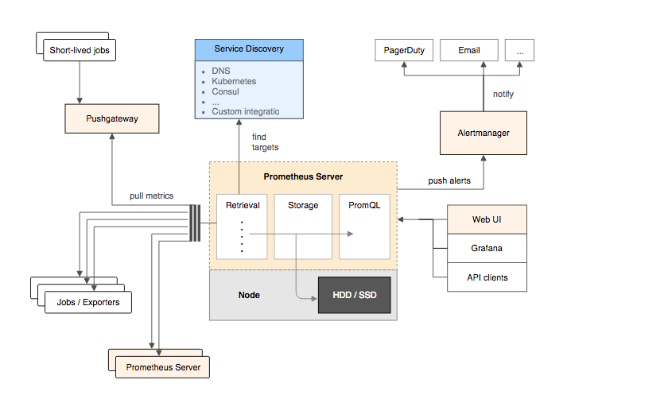

# Prometheus


##  安装

### install


#### 从二进制包安装


1. 下载最新的软件包

```
export VERSION=2.4.3curl -LO  https://github.com/prometheus/prometheus/releases/download/v$VERSION/prometheus-$VERSION.darwin-amd64.tar.gz
```

2. 解压

```txt
    tar -xzf prometheus-${VERSION}.darwin-amd64.tar.gz
    cd prometheus-${VERSION}.darwin-amd64
```

3. 默认配置文件

```yml
    # my global config
    global:
      scrape_interval:     15s # Set the scrape interval to every 15 seconds. Default is every 1 minute.
      evaluation_interval: 15s # Evaluate rules every 15 seconds. The default is every 1 minute.
      # scrape_timeout is set to the global default (10s).
    # Alertmanager configuration
    alerting:
      alertmanagers:
      - static_configs:
        - targets:
          # - alertmanager:9093
    # Load rules once and periodically evaluate them according to the global 'evaluation_interval'.
    rule_files:
      # - "first_rules.yml"
      # - "second_rules.yml"
    # A scrape configuration containing exactly one endpoint to scrape:
    # Here it's Prometheus itself.
    scrape_configs:
      # The job name is added as a label `job=<job_name>` to any timeseries scraped from this config.
      - job_name: 'prometheus'
        # metrics_path defaults to '/metrics'
        # scheme defaults to 'http'.
        static_configs:
        - targets: ['localhost:9090']
```

> promtheus 作为一个时间序列数据库，其采集的数据会以文件的形式存储在本地中，默认的存储路径为data/
>
> 可以通过参数 `--storage.tsdb.path="data/"` 修改本地数据存储的路径
>
> 启动
>
> ./prometheus


####  使用容器安装

```sh
docker run -d --name=prometheus -p 9090:9090  \
-v /data/prometheus/conf/prometheus.yml:/etc/prometheus/prometheus.yml \
-v /data/prometheus/prometheus:/prometheus   prom/prometheus  \
--config.file=/etc/prometheus/prometheus.yml \
--storage.tsdb.path=/prometheus \
--web.console.libraries=/usr/share/prometheus/console_libraries \
--web.console.templates=/usr/share/prometheus/consoles \
--web.enable-lifecycle
```


### Node Exporter 采用主机运行数据


#### 安装Node Exporter

> server  不直接服务监控特定的目标，其主要任务负责数据的收集，存储并且对外提供数据查询支持。
>
> 因此为了能够监控到某些东西，如主机的cpu 使用率，


```sh
    curl -OL https://github.com/prometheus/node_exporter/releases/download/v0.15.2/node_exporter-0.15.2.darwin-amd64.tar.gz
    tar -xzf node_exporter-0.15.2.darwin-amd64.tar.gz
```

运行node exporter

```txt
    cd node_exporter-0.15.2.darwin-amd64
    cp node_exporter-0.15.2.darwin-amd64/node_exporter /usr/local/bin/
    node_exporter
```

形式信息表述

```txt
    # HELP node_cpu Seconds the cpus spent in each mode.
    # TYPE node_cpu counter
    node_cpu{cpu="cpu0",mode="idle"} 362812.7890625
    # HELP node_load1 1m load average.
    # TYPE node_load1 gauge
    node_load1 3.0703125
```

- HELP 解释当前指标的含义
- TYPE 说明当前指标的数据类型
- node_cpu的注释表明当前指标是cpu0上idle进程占用CPU的总时间，CPU占用时间是一个只增不减的度量指标，从类型中也可以看出node_cpu的数据类型是计数器(counter)，与该指标的实际含义一致。又例如node_load1该指标反映了当前主机在最近一分钟以内的负载情况，系统的负载情况会随系统资源的使用而变化，因此node_load1反映的是当前状态，数据可能增加也可能减少，从注释中可以看出当前指标类型为仪表盘(gauge)，与指标反映的实际含义一致。
- node_boot_time：系统启动时间
- node_cpu：系统CPU使用量
- node*disk**：磁盘IO
- node*filesystem**：文件系统用量
- node_load1：系统负载
- node*memeory**：内存使用量
- node*network**：网络带宽
- node_time：当前系统时间
- go_*：node exporter中go相关指标
- process_*：node exporter自身进程相关运行指标

```yml
    # prometheus.yml 获取监控数据
    scrape_configs:
      - job_name: 'prometheus'
        static_configs:
          - targets: ['localhost:9090']
      # 采集node exporter监控数据
      - job_name: 'node'
        static_configs:
          - targets: ['localhost:9100']
```


### 使用PromQL 查询监控数据

1. 因此通过该函数我们可以近似的通过CPU使用时间计算CPU的利用率

```
rate(node_cpu[2m])
```

2. 这时如果要忽略是哪一个CPU的，只需要使用without表达式，将标签CPU去除后聚合数据

```
avg without(cpu) (rate(node_cpu[2m]))
```

3. 如果需要计算系统CPU的总体使用率，通过排除系统闲置的CPU使用率即可获得:

```
1 - avg without(cpu) (rate(node_cpu{mode="idle"}[2m]))
```


### 使用Grafana 创建可视化Dashboard


####  安装

```
docker run -d -p 3000:3000 grafana/grafana
```


### 任务和实例


> 在 Prometheus ，每一个暴露监控样本数据的HTTP 服务称为一个实例。例如在当前主机上运行的node exporter可以称为一个实例instance
>
> Prometheus 还支持 与 DNS 、Consul、E2C、Kubernetes 等进行集成实现自动发现instance 实例，并从这些实例上获取数据。


### Prometheus 核心组件


#### Prometheus 组件



##### Prometheus Server

> Prometheus Server是Prometheus组件中的核心部分，负责实现对监控数据的获取，存储以及查询。 Prometheus Server可以通过静态配置管理监控目标，也可以配合使用Service  Discovery的方式动态管理监控目标，并从这些监控目标中获取数据。其次Prometheus  Server需要对采集到的监控数据进行存储，Prometheus  Server本身就是一个时序数据库，将采集到的监控数据按照时间序列的方式存储在本地磁盘当中。最后Prometheus  Server对外提供了自定义的PromQL语言，实现对数据的查询以及分析。
>
> Prometheus Server内置的Express Browser UI，通过这个UI可以直接通过PromQL实现数据的查询以及可视化。
>
> Prometheus Server的联邦集群能力可以使其从其他的Prometheus Server实例中获取数据，因此在大规模监控的情况下，可以通过联邦集群以及功能分区的方式对Prometheus Server进行扩展。

##### Exporters

Exporter将监控数据采集的端点通过HTTP服务的形式暴露给Prometheus Server，Prometheus Server通过访问该Exporter提供的Endpoint端点，即可获取到需要采集的监控数据。

一般来说可以将Exporter分为2类：

- 直接采集：这一类Exporter直接内置了对Prometheus监控的支持，比如cAdvisor，Kubernetes，Etcd，Gokit等，都直接内置了用于向Prometheus暴露监控数据的端点。
- 间接采集：间接采集，原有监控目标并不直接支持Prometheus，因此我们需要通过Prometheus提供的Client Library编写该监控目标的监控采集程序。例如： Mysql Exporter，JMX Exporter，Consul Exporter等。

##### AlertManager

在Prometheus  Server中支持基于PromQL创建告警规则，如果满足PromQL定义的规则，则会产生一条告警，而告警的后续处理流程则由AlertManager进行管理。在AlertManager中我们可以与邮件，Slack等等内置的通知方式进行集成，也可以通过Webhook自定义告警处理方式。AlertManager即Prometheus体系中的告警处理中心。

##### PushGateway

由于Prometheus数据采集基于Pull模型进行设计，因此在网络环境的配置上必须要让Prometheus Server能够直接与Exporter进行通信。  当这种网络需求无法直接满足时，就可以利用PushGateway来进行中转。可以通过PushGateway将内部网络的监控数据主动Push到Gateway当中。而Prometheus Server则可以采用同样Pull的方式从PushGateway中获取到监控数据。


# 探索PromQL


### 理解时间序列

Prometheus会将所有采集到的样本数据以时间序列（time-series）的方式保存在内存数据库中，并且定时保存到硬盘上。time-series是按照时间戳和值的序列顺序存放的，我们称之为向量(vector). 每条time-series通过指标名称(metrics name)和一组标签集(labelset)命名。


### Metric 类型

从存储上来讲所有的监控指标metric都是相同的，但是在不同的场景下这些metric又有一些细微的差异。 例如，在Node  Exporter返回的样本中指标node_load1反应的是当前系统的负载状态，随着时间的变化这个指标返回的样本数据是在不断变化的。而指标node_cpu所获取到的样本数据却不同，它是一个持续增大的值，因为其反应的是CPU的累积使用时间，从理论上讲只要系统不关机，这个值是会无限变大的。

为了能够帮助用户理解和区分这些不同监控指标之间的差异，Prometheus定义了4种不同的指标类型(metric type)：Counter（计数器）、Gauge（仪表盘）、Histogram（直方图）、Summary（摘要）。


#### Counter : 只增不减的计数器

Counter类型的指标其工作方式和计数器一样，只增不减（除非系统发生重置）。常见的监控指标，如http_requests_total，node_cpu都是Counter类型的监控指标。 一般在定义Counter类型指标的名称时推荐使用_total作为后缀。

Counter是一个简单但有强大的工具，例如我们可以在应用程序中记录某些事件发生的次数，通过以时序的形式存储这些数据，我们可以轻松的了解该事件产生速率的变化。 PromQL内置的聚合操作和函数可以让用户对这些数据进行进一步的分析：

例如，通过rate()函数获取HTTP请求量的增长率：

```
rate(http_requests_total[5m])
```

查询当前系统中，访问量前10的HTTP地址：

```

topk(10, http_requests_total)
```


#### Gauge ： 可增可减的仪表盘

与Counter不同，Gauge类型的指标侧重于反应系统的当前状态。因此这类指标的样本数据可增可减。常见指标如：node_memory_MemFree（主机当前空闲的内容大小）、node_memory_MemAvailable（可用内存大小）都是Gauge类型的监控指标。

通过Gauge指标，用户可以直接查看系统的当前状态：

```
node_memory_MemFree
```

对于Gauge类型的监控指标，通过PromQL内置函数delta()可以获取样本在一段时间返回内的变化情况。例如，计算CPU温度在两个小时内的差异：

```
delta(cpu_temp_celsius{host="zeus"}[2h])
```

还可以使用deriv()计算样本的线性回归模型，甚至是直接使用predict_linear()对数据的变化趋势进行预测。例如，预测系统磁盘空间在4个小时之后的剩余情况：

```

predict_linear(node_filesystem_free{job="node"}[1h], 4 * 3600)
```


#### 使用Histogram 和Summary 分析数据分布情况

为了区分是平均的慢还是长尾的慢，最简单的方式就是按照请求延迟的范围进行分组。例如，统计延迟在0~10ms之间的请求数有多少而10~20ms之间的请求数又有多少。通过这种方式可以快速分析系统慢的原因。Histogram和Summary都是为了能够解决这样问题的存在，通过Histogram和Summary类型的监控指标，我们可以快速了解监控样本的分布情况。 

同时对于Histogram的指标，我们还可以通过histogram_quantile()函数计算出其值的分位数。不同在于Histogram通过histogram_quantile函数是在服务器端计算的分位数。  而Sumamry的分位数则是直接在客户端计算完成。因此对于分位数的计算而言，Summary在通过PromQL进行查询时有更好的性能表现，而Histogram则会消耗更多的资源。反之对于客户端而言Histogram消耗的资源更少。在选择这两种方式时用户应该按照自己的实际场景进行选择。

```txt
    # HELP prometheus_tsdb_compaction_chunk_range Final time range of chunks on their first compaction
    # TYPE prometheus_tsdb_compaction_chunk_range histogram
    prometheus_tsdb_compaction_chunk_range_bucket{le="100"} 0
    prometheus_tsdb_compaction_chunk_range_bucket{le="400"} 0
    prometheus_tsdb_compaction_chunk_range_bucket{le="1600"} 0
    prometheus_tsdb_compaction_chunk_range_bucket{le="6400"} 0
    prometheus_tsdb_compaction_chunk_range_bucket{le="25600"} 0
    prometheus_tsdb_compaction_chunk_range_bucket{le="102400"} 0
    prometheus_tsdb_compaction_chunk_range_bucket{le="409600"} 0
    prometheus_tsdb_compaction_chunk_range_bucket{le="1.6384e+06"} 260
    prometheus_tsdb_compaction_chunk_range_bucket{le="6.5536e+06"} 780
    prometheus_tsdb_compaction_chunk_range_bucket{le="2.62144e+07"} 780
    prometheus_tsdb_compaction_chunk_range_bucket{le="+Inf"} 780
    prometheus_tsdb_compaction_chunk_range_sum 1.1540798e+09
    prometheus_tsdb_compaction_chunk_range_count 780
```


### 初识PromQL

Prometheus通过指标名称（metrics  name）以及对应的一组标签（labelset）唯一定义一条时间序列。指标名称反映了监控样本的基本标识，而label则在这个基本特征上为采集到的数据提供了多种特征维度。用户可以基于这些特征维度过滤，聚合，统计从而产生新的计算后的一条时间序列。


#### 查询时间序列

1. 查询该指标下的所有时间序列

   http_requests_total

2. 支持使用= 和 != 两种完全匹配模式

   1. 通过使用`label=value`可以选择那些标签满足表达式定义的时间序列；
   2. 反之使用`label!=value`则可以根据标签匹配排除时间序列；

   ```
   http_requests_total{instance="localhost:9090"}
   http_requests_total{instance!="localhost:9090"}
   ```

3. 支持正则表达式作为匹配调试件，多个表达式之间使用 | 分离

   1. 使用`label=~regx`表示选择那些标签符合正则表达式定义的时间序列；
   2. 反之使用`label!~regx`进行排除；

   ```
   http_requests_total{environment=~"staging|testing|development",method!="GET"}
   ```


#### 范围查询

直接通过类似于PromQL表达式`http_requests_total`查询时间序列时，返回值中只会包含该时间序列中的最新的一个样本值，这样的返回结果我们称之为**瞬时向量**。而相应的这样的表达式称之为**瞬时向量表达式**

1. 最近5分钟内的所有样本数据

   ```
   http_requests_total{}[5m]
   ```

- s 秒
- m分钟
- h 小时
- d 天
- w 周
- y 年


#### 时间位移操作

在瞬时向量表达式或者区间向量表达式中，都是以当前时间为准

```
http_request_total{} # 瞬时向量表达式，选择当前最新的数据
http_request_total{}[5m] # 区间向量表达式，选择以当前时间为基准，5分钟内的数据
```

可以使用offset时间位移操作：

```
http_request_total{} offset 5m
http_request_total{}[1d] offset 1d
```


#### 使用聚合操作

一般来说，如果描述样本特征的标签(label)在并非唯一的情况下，通过PromQL查询数据，会返回多条满足这些特征维度的时间序列。而PromQL提供的聚合操作可以用来对这些时间序列进行处理，形成一条新的时间序列：

```
# 查询系统所有http请求的总量
sum(http_request_total)
# 按照mode计算主机CPU的平均使用时间
avg(node_cpu) by (mode)
# 按照主机查询各个主机的CPU使用率
sum(sum(irate(node_cpu{mode!='idle'}[5m]))  / sum(irate(node_cpu[5m]))) by (instance)
```


#### 标量和字符串


##### 标量Scalar ： 一个浮点型的数字值

可以通过 scalar（） 转换为标量


##### 字符串 string ： 一个简单的字符串值

直接使用字符串，作为PromQL表达式，则会直接返回字符串。

```
"this is a string"
'these are unescaped: \n \\ \t'
`these are not unescaped: \n ' " \t`
```


#### 合法PromQL 表达式

所有的PromQL表达式都必须至少包含一个指标名称(例如http_request_total)，或者一个不会匹配到空字符串的标签过滤器(例如{code=”200”})。

```
http_request_total # 合法
http_request_total{} # 合法
{method="get"} # 合法
```

同时，除了使用`<metric name>{label=value}`的形式以外，我们还可以使用内置的`__name__`标签来指定监控指标名称：

```
{__name__=~"http_request_total"} # 合法{__name__=~"node_disk_bytes_read|node_disk_bytes_written"} # 合法
```


### PromQL操作符


#### 数学运算

1. 我们可以通过指标node_memory_free_bytes_total获取当前主机可用的内存空间大小，其样本单位为Bytes。

```
node_memory_free_bytes_total / (1024 * 1024)
```

2. 如果是瞬时向量与瞬时向量之间进行数学运算时，过程会相对复杂一点。 例如，如果我们想根据node_disk_bytes_written和node_disk_bytes_read获取主机磁盘IO的总量

```
node_disk_bytes_written + node_disk_bytes_read
```


#### 使用布尔运算过滤时间序列

> 在PromQL通过标签匹配模式，用户可以根据时间序列的特征维度对其进行查询。而布尔运算则支持用户根据时间序列中样本的值，对时间序列进行过滤

1. 通过数学运算符我们可以很方便的计算出，当前所有主机节点的内存使用率：

```
(node_memory_bytes_total - node_memory_free_bytes_total) / node_memory_bytes_total
```

2. 当前内存使用率超过95%的主机呢

```
(node_memory_bytes_total - node_memory_free_bytes_total) / node_memory_bytes_total > 0.95
```


#### 使用bool修饰符改变布尔运算符的行为

布尔运算符的默认行为是对时序数据进行过滤。而在其它的情况下我们可能需要的是真正的布尔结果。

1. 只需要知道当前模块的HTTP请求量是否>=1000，如果大于等于1000则返回1（true）否则返回0（false）。这时可以使用bool修饰符改变布尔运算的默认行为

```
http_requests_total > bool 1000
```


#### 使用集合运算符

- `and` (并且)
- `or` (或者)
- `unless` (排除)


#### 操作符优先级

1. 查询主机的CPU使用率

```
100 * (1 - avg (irate(node_cpu{mode='idle'}[5m])) by(job) )
```

1. `^`
2. `*, /, %`
3. `+, -`
4. `==, !=, <=, <, >=, >`
5. `and, unless`
6. `or`


### PromQL 聚合操作

- `sum` (求和)
- `min` (最小值)
- `max` (最大值)
- `avg` (平均值)
- `stddev` (标准差)
- `stdvar` (标准方差)
- `count` (计数)
- `count_values` (对value进行计数)
- `bottomk` (后n条时序)
- `topk` (前n条时序)
- `quantile` (分位数)

其中只有`count_values`, `quantile`, `topk`, `bottomk`支持参数(parameter)。


### 最佳实践： 4个黄金指标和USE方法

| 级别              | 监控什么                                                   | Exporter                        |
| ----------------- | ---------------------------------------------------------- | ------------------------------- |
| 网络              | 网络协议：http、dns、tcp、icmp；网络硬件：路由器，交换机等 | BlackBox Exporter;SNMP Exporter |
| 主机              | 资源用量                                                   | node exporter                   |
| 容器              | 资源用量                                                   | cAdvisor                        |
| 应用(包括Library) | 延迟，错误，QPS，内部状态等                                | 代码中集成Prmometheus Client    |
| 中间件状态        | 资源用量，以及服务状态                                     | 代码中集成Prmometheus Client    |
| 编排工具          | 集群资源用量，调度等                                       | Kubernetes Components           |

#####  4个指标

主要关注与以下四种类型的指标：延迟，通讯量，错误以及饱和度：

- 延迟：服务请求所需时间。
- 通讯量：监控当前系统的流量，用于衡量服务的容量需求。
- 错误：监控当前系统所有发生的错误请求，衡量当前系统错误发生的速率。
- 饱和度：衡量当前服务的饱和度。


#### RED方法


RED方法是Weave Cloud在基于Google的“4个黄金指标”的原则下结合Prometheus以及Kubernetes容器实践，细化和总结的方法论，特别适合于云原生应用以及微服务架构应用的监控和度量。主要关注以下三种关键指标：

- (请求)速率：服务每秒接收的请求数。
- (请求)错误：每秒失败的请求数。
- (请求)耗时：每个请求的耗时。


#### USE 方法

- 使用率：关注系统资源的使用情况。 这里的资源主要包括但不限于：CPU，内存，网络，磁盘等等。100%的使用率通常是系统性能瓶颈的标志。
- 饱和度：例如CPU的平均运行排队长度，这里主要是针对资源的饱和度(注意，不同于4大黄金信号)。任何资源在某种程度上的饱和都可能导致系统性能的下降。
- 错误：错误计数。例如：“网卡在数据包传输过程中检测到的以太网网络冲突了14次”。


