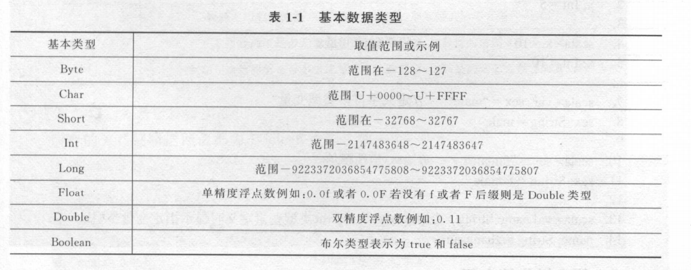

# spark 学习


## Scala 入门


### Scala 基础与语法入门实战


#### 基本数据类型

> Byte、Char、Short、Int、Long、Float、Double、Boolean




#### Scala 变量声明

> Scala 通过var 和  val 来声明变量
>
> 1. val    相当于java 汇总的 final 修饰的变量
> 2. var 类型变量确定以后值可以修改


#### 常见的算术运算符

> 加减乘除，求模，关系运算符  都类似


#### 条件语句

1. 写在同一行
2. 写在不同行并且有多条语句组成的结构体

#### 循环语句

##### for循环

```scala
for (变量  <-  集合)
{
    循环体
}

for (i <-1 to 10 ) print(i)
 for(i <-i to 10 if i % 2 = O;if i != 2) print(i +” ”) 
```

```scala
// 生成枚举
val vl = for(i <- 1 to 5) yield i
```

##### while 循环

```scala
while(i <= 5)
{
	i += 1
    print(i)
}
```

> scala 中没有break 和continue 两个关键字，continue可以通过if 条件语句来控制是否向下执行，而break 存在特殊实现：
>
> import scala.util.control.Breaks._
>
> 就可以使用breakable，和break 语句了

```scala
import scala.util.Random
import scala.util.control.Breaks.{break, breakable}

/**
 * @author Firewine
 * @version 1.0.0
 * @ClassName ControlStatementBreak.java
 * @createTime: 2021年06月28日 16:16:36
 * @Description TODO
 */
object ControlStatementBreak {
  def main(args: Array[String]): Unit = {
    breakable {
      while (true) {
        val r = new Random()
        val i = r.nextInt(10)
        println("i ==" + i)
        if (i == 5) {
          break
        }
      }
    }
  }
}

```

##### do-while 循环


#### 异常控制

> scala 的异常处理有两种方式： 捕获异常和抛出异常

##### 抛出异常使用关键字throw

##### 捕获异常使用try-catch-finally


#### Scala 中Array 、Map 等数据结构实战


##### 定长数组和可变数组

> Scala 中数组分为可变 和不可变数组。默认情况下定义的不可变数组。
>
> 如果定义可变数组，需要导入包`import Scala.collection.mutable.ArrayBuffer`

```scala
package com.study.structure

import scala.collection.mutable.ArrayBuffer

/**
 * @author XYJ
 * @version 1.0.0
 * @ClassName ArrayStudy.scala
 * @createTime: 2021年06月28日 18:54:44
 * @Description TODO
 */
class ArrayStudy {
  def main(args: Array[String]): Unit = {

    // 定义一个长度为2 的字符串类型数组，默认为不可变数组
    val arrStr = Array("scala", "spark")

    // 定长数组
    val arrInt = new Array[Int](10)

    // 可变长度数组
    val arrBuffInt = ArrayBuffer[Int]()


    //     数组常用算法
    //    1. 指定分隔符
    arrStr.mkString(",")
    //    2. 将不可变数组转换成可变数组
    arrStr.toBuffer
    //    3. 两种方法遍历数组
    for (i <- 0 until arrStr.length) println(arrStr(i))
    for (i <- arrStr.indices) println(arrStr(i))
    //      3.2 类似于java的增强for
    for (elem <- arrStr) println(elem)

    //    4. 求和
    Array(1, 2, 3).sum


    //    可变数组特有的操作
    //    1. 使用+= 在尾端添加元素
    arrBuffInt += 1
    //    2. 同时在尾端添加多个元素(@Deprecated)
    arrBuffInt += (2, 3, 4, 5)
    //     3. 可以用++= 操作符追加任何集合
    arrBuffInt ++= Array(6, 7, 8)
//    移除最后两个元素
    arrBuffInt.trimEnd(2)
//    移除arr(2+1)个元素
    arrBuffInt.remove(2)
//    从第三个元素开始移除4个元素
    arrBuffInt.remove(2,4)
//    将数组缓冲转换为Array
    val arrBufI = arrBuffInt.toArray
  }
}

```

##### 列表

```scala
package com.study.structure

/**
 * @author XYJ
 * @version 1.0.0
 * @ClassName ListStudy
 * @createTime: 2021年06月28日 20:05:14
 * @Description TODO
 */
class ListStudy {

  def main(args: Array[String]): Unit = {

    /*
    *  Scala 中列表是类似于数组，列表是存储相同类型的，
    * 区别 ;
    * 1. 列表 是不可变的
    * 2. 列表表示一个链表，而数组是平坦的
    * */
    //    定义存放string 类型的list
    val fruit: List[String] = List("apples", "oranges", "pears")
    //    二维List列表
    val dim: List[List[Int]] = List(List(1, 0, 0), List(0, 1, 0), List(0, 0, 1))

    //    使用两种基本的构建模块来定义
    //    一个无尾Nil 和 ：：
    var fruits = "apples" :: ("oranges" :: ("pears" :: Nil))
    //    fruits : List[String] = List(apples,oranges,pears)

    //    空列表
    val empty = Nil


  }

  //    列表的基本操作
  def ops: Unit = {
    val fruit = "apples" :: ("oranges" :: ("pears" :: Nil))
    val nums = Nil
    //      head 方法去除List中的第一个值
    println("head of fruilt : " + fruit.head)
    //      tail 去除list中除了第一个值，其他的所有值
    println("tail of fruit:" + fruit.tail)

    // 判断空
    fruit.isEmpty
    nums.isEmpty
  }

  def concatTest: Unit = {
    //    使用 ：：： 运算符 或列表 list.:::()   or  list.concat 添加两个或多个列表
    var fruit1 = "apples" :: ("oranges" :: ("pears" :: Nil))
    var fruit2 = "mangoes" :: ("banana" :: Nil)
    // 用::: 串联
    var fruit = fruit1 ::: fruit2
    println(fruit)

    fruit = fruit1.:::(fruit2)
    //3
    List.concat(fruit, fruit2)
  }
}

```


##### Map

```scala
package com.study.structure

import scala.collection.mutable

/**
 * @author XYJ
 * @version 1.0.0
 * @ClassName MapStudy
 * @createTime: 2021年06月28日 19:24:56
 * @Description TODO
 */
class MapStudy {

  /*
  *  默认情况下，Scala 使用不可变的映射。
  *  如果使用可变集，导入 scala.collection.mutable.Map 类
  *  定义映射 ： var mapCase = Map("China" -> "Beijing")
  * */

  def main(args: Array[String]): Unit = {

    //    构造不可变映射
    val bigData = Map("scala" -> 25, "hadoop" -> 12)
    // 获取key 为scala 的值
    bigData("scala")
    //    判断映射中是否包含key为Hadoop的键值对，返回值为boolean类型
    val bool = bigData.contains("hadoop")

    // 返回map 的key 的值，存在默认值
    val i = bigData.getOrElse("spark", 79)

    // 添加分隔符
    val str = bigData.mkString("{", ",", "}")
    println(str)

    //    以角标0开始，返回角标为2 的元素
    bigData.drop(2)


    //    构造可变映射
    val bigDataVal = mutable.Map("scala" -> 32)

    // 更新key 为spark 的键值对，若不存在，则改为插入
    bigDataVal("spark") = 100

    // 添加 和删除键值对
    bigDataVal += ("kafka" -> 68)
    bigDataVal -= ("kafka" -> 69)

    //遍历映射
    for ((k, v) <- bigData) println(k + " " + v)

    //    遍历k
    for (k <- bigData.keySet) println(k)
  }

}

```

##### set 集合

```scala
package com.study.structure

/**
 * @author XYJ
 * @version 1.0.0
 * @ClassName SetStudy
 * @createTime: 2021年06月28日 20:46:58
 * @Description TODO
 */
class SetStudy {
  /*
  *  分为不可变和可变的
  *  两者的区别在于： 当一个对象是不可变的，对象本身不能被改变。
  *  默认情况下，Scala 中使用不可变的集。如果想使用可变集，必须明确导入scala.collection.mutable.Set 类
  *  如果想同时使用可变和不可变的集合，那么可以继续参考不变的集合
  * */
  def notChangeSet: Unit = {
    // 定义空Set 集合
    var s: Set[Int] = Set()


    // 定义Int类型Set 集合
    var s1: Set[Int] = Set(1, 3, 4, 5)

    // 或者
    var s2 = Set(1, 3, 4, 5)

    // 定义String类型Set集合
    var str: Set[String] = Set("Scala", "spark", "Hadoop")


  }

  //集合基本操作
  def setMethodTest: Unit = {
    val book = Set("scala", "spark", "hadoop")
    val nums: Set[Int] = Set()

    // set 集合的 head /tail / isEmpty 基本操作与 与 List 基本一致
  }
}

```


##### tuple 元组

```scala
package com.study.structure

/**
 * @author XYJ
 * @version 1.0.0
 * @name TupleStudy
 * @createTime 2021年06月28日 20:01:25
 * @Description TODO
 */
class TupleStudy {


  def main(args: Array[String]): Unit = {

    val tuple1 = (1, "scala", "hadoop", 3)
    // 访问元组中的元素
    val tuple2 = (1, 2, 3, 4, "hello")
    println(tuple1._1) //打印出第一个元素


  }

}

```

## Scala 面向对象彻底精通及Spark源码阅读


### 面向对象详解

> Scala 一切皆对象，对象是Scala 的核心


#### Scala 中的class 、object 介绍

> class 定义 与 java 类似，区别 ： scala 中，类名不是必须和文件名相同且一个文件可以定义多个class
>
> scala 的class 中不存在静态成员，java的静态成员由scala 的object 替代。
>
> 当object 对象名和class 名相同时则称object 为 class 的伴生对象

```scala 
package com.study.`object`

/**
 * @author XYJ
 * @version 1.0.0
 * @ClassName ClassStudy
 * @createTime: 2021年06月29日 09:13:49
 * @Description TODO
 */
class ClassStudy {

  /*定义普通类 ： 一般类名的第一个字母都大写*/

  private val name = "zhangSan"

  def sayName(): Unit = {
    println(name)
  }

  def getName = name
}

// object定义的对象为单例对象，就是在整个程序中只有这个一个实例。对于同名的object和class
//对象互称伴生对象和伴生类，两者必须在同一个文件中
object Person {
  /* object 本身具有默认的constructor ，但是只会被调用一次 */
  println("scala")
  val age = 10
  def getAge = age
}
// println 只会调用一次
// 1.伴生类和伴生对象一定要在同一个文件中
// 2. 伴生对象可以访问伴生类的私有成员
```

继承

```scala
package com.study.`object`

/**
 * @author XYJ
 * @version 1.0.0
 * @ClassName ExtendStudy
 * @createTime: 2021年06月29日 09:20:28
 * @Description TODO
 */
abstract class ExtendStudy {
  /* 使用 extends  关键字继承 ， Scala  是单继承多实现的（用with 关键字混入多个特质）*/

  /**
   * 已实现的方法
   */
  def eat ={
    println("eat food")
  }
  // 抽象方法
  def  run
}

class Cat extends ExtendStudy{
  override def run: Unit = {
    println("running")
  }

  override def eat: Unit = {

    println("eat mouse")
  }

}

class Dog extends ExtendStudy{

  override def run: Unit = {

    println("dog is running")
  }

}

object AnimalTest {
  def main(args: Array[String]): Unit = {
    val c = new Cat
    c.eat
    c.run
    val d  = new Dog
    d.eat
    d.run
  }
}
```

#### 主构造器与辅助构造器

```scala
package com.study.`object`

/**
 * @author XYJ
 * @version 1.0.0
 * @ClassName ConstructorStudy
 * @createTime: 2021年06月29日 09:29:58
 * @Description TODO
 */
class ConstructorStudy {

}


class Person {
  // 默认无参构造器
}

class Person2(name: String) {
  // 默认带一个字符串参数的构造器，创建对象实例会打印name 的值
  println(this.name)
}


//构造器重载

//重载构造器，第一行必须是默认构造器或者其他构造器
class Person3(name: String) {
  println(this.name)

  def this(name: String, age: Int) {
    this(name)
    println(name + ": " + age)
  }
  def this(name :String,age:Int,sex:String){
    this(name,age)
    println(name+":"+age)
  }
}
```

#### 类的字段和方法精通

```scala
package com.study.`object`

/**
 * @author XYJ
 * @version 1.0.0
 * @ClassName ClassStudy
 * @createTime: 2021年06月29日 09:13:49
 * @Description TODO
 */
class ClassStudy {

  /*定义普通类 ： 一般类名的第一个字母都大写*/

  private val name = "zhangSan"

  def sayName(): Unit = {
    println(name)
  }

  def getName = name
}

// object定义的对象为单例对象，就是在整个程序中只有这个一个实例。对于同名的object和class
//对象互称伴生对象和伴生类，两者必须在同一个文件中
object Person {
  /* object 本身具有默认的constructor ，但是只会被调用一次 */
  println("scala")
  val age = 10
  def getAge = age
}
// println 只会调用一次
// 1.伴生类和伴生对象一定要在同一个文件中
// 2. 伴生对象可以访问伴生类的私有成员
```


## Scala 函数式编程彻底精通及Spark 源码阅读

> Scala 是一门函数式编程和面向对象完美结合的语言，
>
> Scala 就要学习Scala 函数式的编程艺术


### 函数式编程概述


#### 函数式编程思维

1. 函数式表达式化。可以试着理解一切都是表达式，将命令行改成表达式，去掉可变的变量（使用 Var)
2. 数据与行为分离。 
   1. 面向对象是将数据与行为进行绑定的。
   2. 函数式中追求函数和数据拥有同样的地位，没有谁地位高的说法，因此可以将函数作为值或者参数赋值给常量和变量。
   3. 函数式编程的高阶逻辑。举例——》 获取列表中的小于10的，不需要遍历获取
   4. 函数式的组合子逻辑。 函数是自底向上的模式，正好与面向对象相反。
   5. 形而上的思维。 val  x =10 是将x 匹配到了10  ，函数是一等公民
   6. 形而下的思维。
      1. 有那个递归替换循环
      2. 难以尾递归的时候考虑使用延续函数
      3. 高阶函数、部分应用、Lambda 演算
      4. 用泛型、接口、可区别联合类型替换类继承
      5. 用二叉树替换普通链表后可以支持高并发计算
3. 函数式编程的好处
   1. 函数的不变性，没有可以改变的状态。函数的引用就是透明的和没有副作用的存在
   2. 函数不依赖外部的状态也不修改外部的状态。
4. 函数式编程的特性
   1. 递归