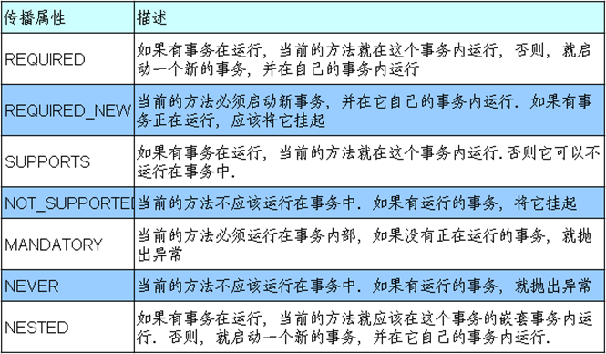
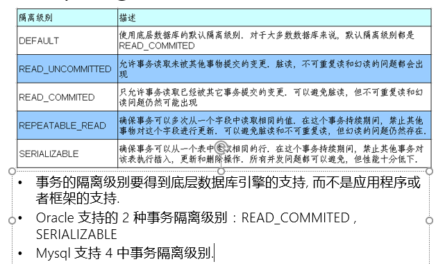

# spring 事务

## 事务简介

1. 事务管理 是 用来确保数据的==完整性==和==一致性==
2. 事务就是一系列的动作，他们被当做一个单独的工作单元，这些动作要么全部完成，要么全部不起作用
3. 事务的四个关键属性ACID
   - Atomicity 原子性 ： 事务是一个原子操作，保证全部完成和全部不完成
   - Consistency 一致性 ;  一旦所有事务动作完成，事务就会被提交，数据和资源就处于一种满足业务规则的一致性状态中
   - Isolation 隔离性  : 可能有许多事务会同时处理相同的数据，因此每个事务都应该与其他事务隔离开来，防止数据损坏。
   - Durability 持久性 : 一旦事务完成，无论发生什么系统错误，他的结果不应该受到影响，通常写到持久化存储器中。

### Spring 中的事务管理

> Spring 在不同的事务管理API 之上定义了一个抽象层，开发人员可以通过抽象层来管理事务，不需要了解底层
>
> Spring 支持 ==编程式事务管理==，也支持==声明式事务管理==

#### 编程式事务管理

> 将事务管理代码切入都业务方法中来控制事务的提交和回滚。


**使用@Transactional** 来进行事务设置，将进行事务的方法，添加这个注解，则代表开启了事务

参数 ： 

```
添加事务注解
1.使用 propagation 指定事务的传播行为, 即当前的事务方法被另外一个事务方法调用时
如何使用事务, 默认取值为 REQUIRED, 即使用调用方法的事务
REQUIRES_NEW: 事务自己的事务, 调用的事务方法的事务被挂起.
2.使用 isolation 指定事务的隔离级别, 最常用的取值为 READ_COMMITTED
3.默认情况下 Spring 的声明式事务对所有的运行时异常进行回滚. 也可以通过对应的
属性进行设置. 通常情况下去默认值即可.
4.使用 readOnly 指定事务是否为只读. 表示这个事务只读取数据但不更新数据,
这样可以帮助数据库引擎优化事务. 若真的事一个只读取数据库值的方法, 应设置 readOnly=true
5.使用 timeout 指定强制回滚之前事务可以占用的时间.
```

事务传播行为 的参数：



事务隔离参数 ：



#### 声明式事务管理

> 将事务管理代码从业务代码中分离出来，以声明的方式来实现事务管理。可通过AOP 的方法模块化，

在xml 的配置文件里面，进行配置

分为三步 ： 

1. 配置事务管理器
2. 配置事务属性
3. 配置事务切入点

```xml
<!-- 1. 配置事务管理器 -->
	<bean id="transactionManager" class="org.springframework.jdbc.datasource.DataSourceTransactionManager">
		<property name="dataSource" ref="dataSource"></property>
	</bean>
	
	<!-- 2. 配置事务属性 -->
	<tx:advice id="txAdvice" transaction-manager="transactionManager">
		<tx:attributes>
			<!-- 根据方法名指定事务的属性 -->
			<tx:method name="purchase" propagation="REQUIRES_NEW"/>
			<tx:method name="get*" read-only="true"/>
			<tx:method name="find*" read-only="true"/>
			<tx:method name="*"/>
		</tx:attributes>
	</tx:advice>
	
	<!-- 3. 配置事务切入点, 以及把事务切入点和事务属性关联起来 -->
	<aop:config>
		<aop:pointcut expression="execution(* com.spring.tx.xml.service.*.*(..))"
			id="txPointCut"/>
		<aop:advisor advice-ref="txAdvice" pointcut-ref="txPointCut"/>	
	</aop:config>
```


## Spring 中的事务管理器

Spring的核心事务管理抽象 是  Interface PlatformTransactionManager 管理封装了一组独立于技术的方法，

### Spring 中的事务管理器的不同实现

1. DataSourceTransactionManager : 在应用程序中只需要处理一个数据源，而且通过JDBC存取
2. jtaTransactionmanager ： 在JavaEE应用服务器上用JTA 进行事务管理
3. HibernateTranslactionManager :  用Hibernate框架存取数据库
4. 事务管理器以普通的bean 形式声明在Spring的IOC容器中