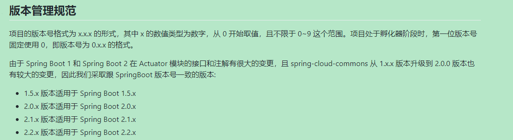
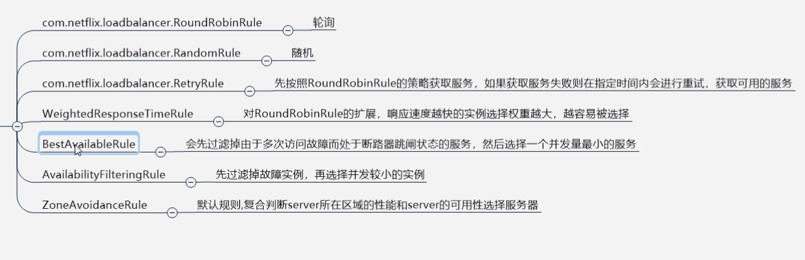
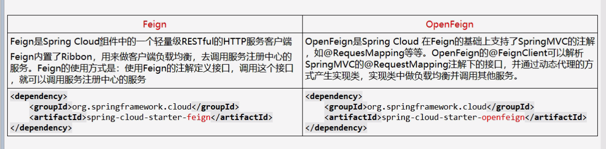
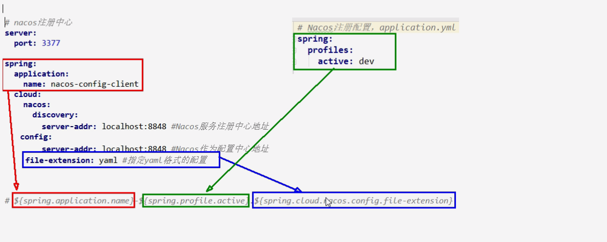

# java 分布式


<!--more-->


##  微服务架构理论入门

1. 微服务概念： 自行百度


分布式的微服务 维度

> 1. 服务注册与发现
> 2. 服务调用
> 3. 服务熔断
> 4. 负载均衡
> 5. 服务降级
> 6. 服务消息队列


### springcloud 

[查看版本依赖信息](https://start.spring.io/actuator/info)


代码参考版本

> 1. cloud  Hoxton.SR9
> 2. boot   2.3.7.RELEASE
> 3. cloud alibaba  2.1.0 RELEASE   ********
> 4. java 8
> 5. maven 3.5
> 6. mysql 5.7 上

springcloud alibaba 版本过低




### 组件迭代

1,Eureka停用,可以使用zk作为服务注册中心

2,服务调用,Ribbon准备停更,代替为LoadBalance

3,Feign改为OpenFeign

4,Hystrix停更,改为resilence4j

​		或者阿里巴巴的sentienl

5.Zuul改为gateway

6,服务配置Config改为  Nacos

7,服务总线Bus改为Nacos

 

### 组件推荐

服务注册中心

1. Zookeeper
2. consul
3. nacos
4. etcd（类似k8s 应该也是可以把）
5. Eureka  过时

服务调用

1. Ribbon
2. loadBalancer

服务调用2

1. OpenFeign
2. Feign 过时

服务降级

1. Hystix（不推荐再使用，但是要大部分项目在用）
2. resilience4j
3. sentienl **

服务网关

1. zuul 过时
2. gateway  spring出的

服务配置

1. Config 过时
2. nacos

服务总线

1. Bus
2. Nacos


# 实战

1. 建module
2. 该pom
3. 写yml
4. 主启动
5. 业务类

## 微服务基础，

> 参考gitee 的仓库代码


### 服务治理

> 在传统的rpc远程调用框架中，管理每个服务与服务之间依赖关系比较复杂，管理比较复杂，所以需要使用服务治理，管理服务与服务之间依赖关系，可以实现服务调用、负载均衡、容错等，实现服务发现与注册。

> 服务注册： 简单来说，就是类似于学生册，当生产者登录，就会在学生册注册，当生产者注销，就会在学生册注销。而学生册就是给消费者提供参考和调用。


#### eurekaServer

1. pom 文件改写

   ```xml
   以前使用
   spring-cloud-starter-eureka
   
   现在使用
   spring-cloud-starter-nelflix-eureka-server
   ```

2. 具体查看code


集群

**互相注册，相互守望** 的关系

实现负载均衡+ 故障容错


eureka 是AP分支，，为高可用代表，

有着自我保护的机制：

当服务不能发送心跳的时候，但是会自动保存注册信息90s，考虑到服务网络拥塞的问题


怎么禁止自我保护，类似于Zookeeper 的临时节点


eureka 停更说明

停更不停用！！！


#### Zookeeper


#### consul

功能：

1. 服务发现
   1. 提供HTTP 和DNS  两种发现方式
2. 健康监测
   1. 支持多种方式，HTTP，TCP，Docker，Shell 脚本定制化
3. KV存储
4. 多数据中心
5. 可视化web界面


#### 对比

| 组件名    | 语言 | CAP  | 服务健康检查 | 对外暴露接口 | springcloud集成 |
| --------- | ---- | ---- | ------------ | ------------ | --------------- |
| Eureka    | java | AP   | 可配支持     | HTTP         | 集成            |
| Consul    | GO   | CP   | 支持         | HTTP/DNS     | 集成            |
| Zookeeper | java | cp   | 支持         | 客户端       | 集成            |


### 服务调用


#### Ribbon  

> 是基于Netflix Ribbon 实现的负载均衡的工具
>
> 主要是客户端的软件复杂均衡苏散发和服务调用


可以使用springcloud-loadBalanced 替换


Ribbon 与Nginx 区别

> Ribbon——本地负载均衡客户端
>
> 在调用微服务接口时候，会在注册中心上获取信息列表进行缓存到JVM 本地，从而使用本地实现RPC远程调用技术
>
> Nginx ——服务器负载均衡
>
> 客户端所有请求都会交给nginx，然后nginx实现转发请求，负载均衡由服务器实现

eureka  新版涵盖了 ribbon


IRule 核心负载规则



负载规则，不能放在ComponentScan 的包及以下，不然会全局使用，失去作用


##### 负载均衡算法

> rest接口第几次请求数%服务器集群总数量 = 实际调用服务器位置下标，每次服务重启后rest接口计数从1开始


手写负载的算法

原理 ：JUC （CAS 和 自旋锁的复习）


#### OpenFeign


1. Feign 和OpenFeign 区别

> Feign 是一个声明式WebService 客户端，使用Feign能让web service客户端更加简单。他的使用方法是定义一个服务接口然后在上面添加注释。
>
> 详细看官网



类似于写server 接口模式


### 服务降级


1. 什么是服务降级

> 服务器无法正常返回响应数据，但是要给客户端立刻返回一个友好的提示fallback

> 那些情况会出发降级：
>
> 1. 程序运行异常
> 2. 超时
> 3. 服务熔断触发服务降级
> 4. 线程池/信号量打满也会导致服务降级

2. 服务熔断

> 类似保险丝达到最大服务访问欧，直接拒绝访问，拉闸限点，然后调用服务降级的方法并返回友好提示
>
> **就是保险丝**————服务的降级-》进而熔断-》恢复调用链路

3. 服务限流

> 秒杀高并发等操作，严禁一窝蜂的过来拥挤，大家排队的，有序进行


##### Hystrix


## nacos

