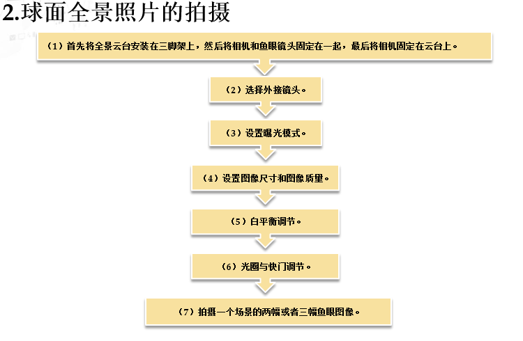

# 人机交互和虚拟现实_复习笔记

## 第一章

### 虚拟现实技术的基本概念

#### 什么是VR/AR?

==VR ： 虚拟现实(Virtual Reality)，简称VR技术，也称人工环境。利用电脑或其他智能计算设备模拟产生一个三维空间的虚拟世界，提供用户关于视觉、听觉、触觉等感官的模拟，让用户如同身历其境一般。==

AR ： 增强现实技术，是一种实时地计算摄影机影像的位置及角度并加上相应图像、视频、3D模型的技术，这种技术的目标是在屏幕上把虚拟世界套在现实世界上进行互动。

这两者的区别是 ： VR 看到的是假的，AR 是在现实世界显示虚拟世界

#### 虚拟现实技术的特征

==沉浸性（Inmmersion）==

==交互性（Interaction）==

==想象力（Imagination）==

#### 虚拟现实系统的分类

虚拟现实系统按其功能不同，可分为4种类型，：==**沉浸式虚拟现实系统、增强现实型的虚拟现实系统、桌面式虚拟现实系统和分布式虚拟现实系统**==

## 第二章

二维空间里的物体有宽度和长度，但是没有深度

### 交互设备

#### 三维位置跟踪器

##### 三个平移自由度

==用于描述三维对象的X,Y,Z坐标值==

##### 三个旋转自由度

==俯仰角（Pitch）==

==横滚角（Roil）==

==航向角（Yaw）==

so  ： ==因此虚拟现实是六度，而非三维动画的三度==

#### 跟踪器的性能参数

==精度、抖动、偏差和延迟==

精度 ： 是指对象真实的三维位置和跟踪器测量出的三维位置间的差值

抖动 ： 是指当被跟踪对象固定不变时，跟踪器输出结果的变化

偏差 ： 是指跟踪器随时间推移而累积的误差

延迟： 是动作与结果之间的时间差。

#### 电磁跟踪器

| 优点                        | 缺点                                                         |
| --------------------------- | ------------------------------------------------------------ |
| 1. 其敏感性不依赖于跟踪方位 | 延迟较长                                                     |
| 不受视线阻挡的限制          | 跟踪范围小                                                   |
| 体积小，价格便宜            | 容易受环境中大的金属物体或其他磁场的影响，信号发生畸变，跟踪精度降低 |

#### 超声波跟踪器

超声波跟踪器  是 ==声学跟踪技术最常用的一种，是一种非接触式的位置测量设备，**使用固定发射器产生的超生信号来确定移动接收单元的实时位置**==

| 优点                         | 缺点                                             |
| ---------------------------- | ------------------------------------------------ |
| 不受环境磁场及铁磁物体的影响 | 更新率慢                                         |
| 不产生电磁辐射               | 超声波信号在空气中的传播衰减，影响跟踪器工作范围 |
| 价格便宜                     | 发射器和接收器之间要求无阻挡                     |
|                              | 背景噪声和其他超生源会破坏跟踪器的信号           |

#### 惯性跟踪器

是通过 **陀螺仪和加速度计** 来 确定的

| 优点                                                         | 缺点                                                     |
| ------------------------------------------------------------ | -------------------------------------------------------- |
| 不存在发射源，不怕遮挡、没有外界干扰，有无限大的工作空间，抖动很小（传感器噪声可通过积分过滤掉） | 快速基类误差（或偏差）                                   |
|                                                              | 由于重力场，容易产生噪声与校准错误，位置和方向会发生变化 |

#### 数据手套的基本原理是：

1. 数据手套设有弯曲传感器，==一个节点对应一个传感器，有5节点，14节点，18节点，22节点==之分。

#### 5DT数据手套

5DT数据手套有==5节点==和==14节点==之分

## 第三章

### 虚拟现实系统的输出设备

输出设备： ==为用户提供仿真过程**对输入的反馈**，通过输出接口给用户产生反馈的感觉通道==

输出设备有三种 ： 图形显示设备，触觉反馈设备，声音输出设备

#### 头盔显示器

头盔显示器（简称HMD） ，==常见的立体显示器==，利用头盔显示器将人对外界的视觉、听觉关闭，引导用户产生一种身在虚拟环境中的感觉。

#### 常见的头盔显示器

5DT数字头盔

5DT 头盔显示器 具有超高分辨率，可提供清晰的图像和优质的音响效果，产品外形设计简约流畅，便于携带

优点： ==用户可根据自己对沉浸感的需求进行不同层级的提哦啊接，另外还有可进行大小调节的顶部按钮、背部按钮、穿戴式的头部跟踪器以及便于检测的翻盖式设计。==

#### 沉浸式立体投影系统

目前 ，大品目三维立体投影显示系统是一个一种最典型、最实用、最高级的==沉浸式虚拟显示系统，根据沉浸程度的不同，通过可分为单通道立体投影系统，多通道环幕立体投影系统、CAVE投影系统，球面投影系统等。==

#### CAVE 沉浸式虚拟显示显示系统

==一种基于多通道视景同步技术、三维空间整形校正算法、立体显示技术的房间式可视协同环境。==

优点 ： 该系统可提供一个同房间大小的四面（六面） 立方体投影显示空间，共多人参与，所有参数者**均完全沉浸在一个被三维立体投影画面包围的高级虚拟仿真环境中**提供给使用者一种前所未有的带有震撼性的身临其境的沉浸感。

#### 立体眼镜（鹰眼）

特点： ==立体眼镜以简单的结构、轻巧的外形和低廉的价格==，而且佩戴很长的时间眼镜也不至于疲劳，称为虚拟现实观察设备理想的选择

图形现实设备的==高延时与晕动症==

## 第六章

### 三维全景概述

**全景** ： ==是一种使用相机环绕四种进行360度拍摄，将拍摄到的图片拼接称一个全方位、全角度的图像。==

虚拟全景和现实全景 ： 虚拟全景是利用3ds，maya 等软件，制作出来的模拟现实的场景；现实全景 ： 是利用单反数码相机拍摄实景照片，由软件进行特殊的拼合处理而生称的真实场景。

==三维全景 是使用全景图像表现三维虚拟环境的虚拟现实技术，也称虚拟现实全景==

#### 三维全景的分类

1. 柱面全景 ： 就是把拍摄的照片投影到以相册视点为中心的圆柱体内表面。可以以水平360方式观看四周的景物。

   | 优点                                                         | 缺点                                                         |
   | ------------------------------------------------------------ | ------------------------------------------------------------ |
   | 圆柱面展开后成为一个矩形平面，所以柱面全景图展开后就成为一个矩形图像，然手利用其在计算机内的图像格式进行存取 | 用鼠标向上或向下拖动时，仰视和俯视的视野收到限制，既看不到天，也看不到地，即垂直角小于180度 |
   | 图像的采集快捷方便。仅通过简单的硬件，如数码相机、三脚架、全景云台就可以实现采集，且不受周围环境的限制 |                                                              |

   #### 球面背景

   球面背景 是将原始图像拼接成一个球体的形状，以==相机视点==为球心，将图像投影到球体的内表面。**球面全景图可以实现水平方向360度旋转、垂直方向180度俯视和仰视的视线观察**

   #### 对象全景

   ==对象全景是**以一件物体（即对象）为中心，通过立体360度球面上的众多视角来看物体**，从而生成对这个对象的全方位的图像信息==

#### 硬件配置方案

1. 数码相机 + 鱼眼镜头 + 三脚架 + 全景云台
2. 三维建模软件营造虚拟场景

#### 柱面全景照片的拍摄

1. 将数码相机与三脚架固定，并拧紧螺丝
2. 将数码相机的各项参数调整至标准状态（不变焦）
3. 拍摄完第一张照片后，保持三角架位置固定，将数码相机旋转一个合适的角度，并保证新场景与前一个场景要重叠15%左右，且不改变其他的参数
4. 依次类推不断的拍摄，直到旋转一周360度，即得到这个位置的所有照片

