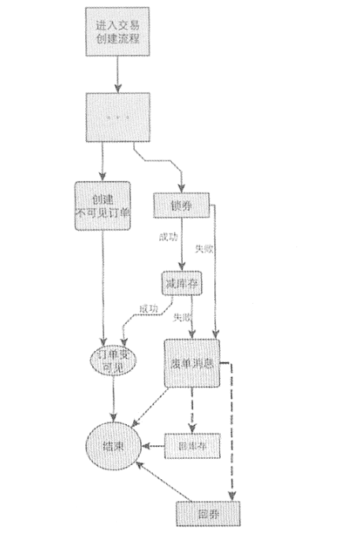
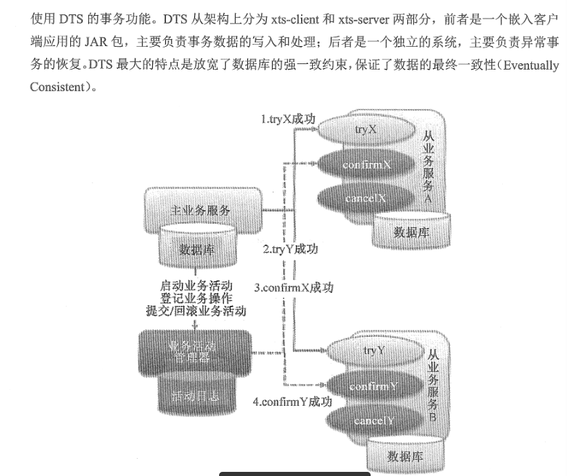

### 分布式系统的经典基础理论

#### 分布式系统的设计理念

> 分布式系统结构的第一原则是`不要分布`

1. 分布式系统的主要目标是提升系统的**整体性能**和**吞吐量**。

2. 要完成一的标准，首先，单机版的性能是更可能高效，例如掌握多线程并发，IPC，高性能框架

##### 分布式系统设计的两个关键目标是 `性能`  和 `容错性`

> 性能的指标是绝对的，而容错性的指标是相对的。
>
> 不同的数据与业务，有着不同的容错性和性能要求。
>
> 日志类： 可以容许丢失，信息类暂时不一致（可以通过代码让其最终达到一致性）
>
> 交易类数据 :  有着很高的可靠性

##### 分布式设计中的两大思路 ： `中心化` 和 `去中心化`

###### 中心化思想

> 分布式集群中的结点机器按照角色分工，一种管理者，一种工作者。领导负责分发工作和监督工作，确保没有一个工作者闲置或者太忙。如果发现一个工作者不能工作，则直接踢出去，直到有新的工作者加进来，不然工作重新分配给其他人。k8s 就是这样理念

> 缺点就是 ： 一个管理者，如果不能工作，那么整个工作就要停止。
>
> 但是多个领导同时工作，存在管理冲突。
>
> 主备两个领导方案，是可以接受的，可以  热备 和冷备，或者手动切换，自动切换

######  去中心化

> 没有中心化思想的角色划分，所有机器都是同样平等的，例如 全球互联网。
>
> 优点是 ： 不存在单点故障问题
>
> 缺点是 ： 不存在管理制度，所以每个节点是要实时同步集群信息

> 补充 ： 脑裂  指 一个集群由于网络的故障，被分为至少两个彼此无法通信的单独集群，容易产生数据冲突和错误。。所以一般集群的节点都是奇数 和规则 来限制脑裂的发生。
>
> 而 现在越来越多的是，通过`选举`的方式进行得到领导，领导是动态的，例如 zookeeper 和 etcd

####  分布式系统的一致性原理

**分布式系统的不可靠性，是重点**

> 可靠性 ： 是指 系统可以无故障的持续运行。
>
> 一个集群 ：
>
> 1. 在运行期间没有出现故障 ，那么就是高度可靠的，
>
> 2. 但是每年要停机两周，可用性就是96%

**一致性原理**

> 分布式集群的一致性是分布式系统里最重要的一环，
>
> 大多数集群的判断一致性的标准就是： `n/2 + 1 的机器数量得到的相同的答案`

**最终一致性原理**

> 最终一致性 就是降低了标准的一致性 ，
>
> 利用 “数据一致性存在延迟时间”来换取数据读写的高性能。

#### 分布式系统的基石之Zookeeper

##### Zookeeper 的原理与功能

> Zookeeper 采用了 一致性的算法，所以是一个非常可靠、强一致性的、没有单点故障的分布式数据存储系统。

分布式所需要的需求：

1. 提供集群的集中化的配置管理功能
2. 需要提供简单可靠的集群结点动态发现机制
3. 需要实现简单可靠的结点Leader 选举机制
4. 需要提供分布式锁

###### Zookeeper 的场景案例分析

主要使用场景

1. 实现配置管理
2. 服务注册中心
3. 集群通信与控制子系统

通常服务的注册信息包含内容：

1. 服务类型
2. 隶属于那个系统
3. 服务IP、端口
4. 服务的请求URL
5. 服务的权重

#### 经典CA理论

**CAP理论**

Consistency 一致性

Availability 可用性

Partition-tolerance  分区容错

> 三者无法共存，最多两两共存

仅适用于原子读写的NoSql 场景中，并不适合数据库系统。

#### BASE 准则

> Basically Available ,Soft-state , Eventually Consistent  主要可用软状态、数据最终一致性

#### 重新认识分布式事务

##### 数据库单机事务的实现原理

> 事务是数据库运行中一个逻辑工作单元，工作单元内的一些列SQL命令具有原子性操作的特点，这些命令要么完全成功执行，要么完全撤销或不执行。

1. 原子性 Atomic  ： 
2. 一致性 Consistent
3. 隔离性 Isolation
4. 持久性 Duration

##### 事务流程简化流程

1. 先记录undo/redo log ，确保日志刷到磁盘上持久存储
2. 更新数据记录，缓存操作并异步刷盘
3. 提交事务，在 redo log 中吸入 commit 记录
   1. 清理 undo 段信息
   2. 释放锁资源
   3. 刷新redo 日志，确保redo 日志落盘，即使修改的数据页没有更新到磁盘，只要日志完成了，就能保证数据库的完整性和一致性
   4. 清理savepoint 列表

##### 互联网分布式事务解决方案

1. 业务接口整合，避免分布式事务

   > 将能合并的事务，合并起来。
   >
   > 实在不能避免的，则进行其他解决办法

2. 最终一致性方案之eBay模式

   > eBay 采用`消息队列`来辅助实现事务控制流程
   >
   > 核心： 将需要分布式处理的任务通过消息队列的方式来异步执行。
   >
   > 如果失败，则可以发起人工重试的纠正流程。（支付，对账 系统 广泛使用）

   

3. X/OpenDTP 模型的支付宝DTS框架

   

   

### RPC

当前主流的微服务架构分为三类： 

1. 基于传统的高性能RPC技术和服务治理的微服务架构， ZeroC  IceGrid
2. 以HTTP REST 为通信机制的通用性微服务架构，spring cloud
3. 基于容器的技术，，目标是部署在公有云台上的微服务架构基础平台，。这种可以实现TCP通信的可达性，理论上，任何分布式应用都可以运行在微服务架构平台上，但是协议要自己定义：例如REST，GRPC，and so on。    王者  ： K8s

### 浅析内存

《看计算机组成原理比较适合》 了解一些根本性质的知识