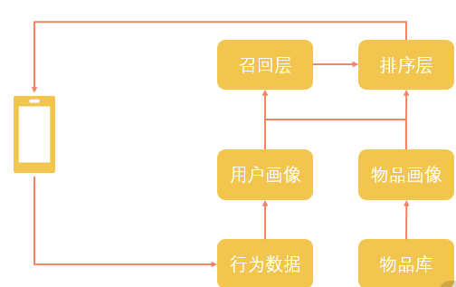

#  大数据基础

## 第四模块

### 标准化数据挖掘全过程

#### 什么是数据挖掘

> 数据挖掘更偏向一种过程，而不是一种名词或者一个结果，比如说我们要为新闻标注分类以方便用户查询，当然可以让编辑或者运营人员人工地进行标注，也可以借助数据挖掘发现分类与新闻的内在练习，从而为新闻自动标注类别。
>
> 而 认为 数据挖掘 就是 各种数据的计算，各种算法，是错误的。

==数据挖掘就是以数据作为研究的对象，从数据中寻找价值，获取知识的过程，至于说机器学习算法，或者数据的统计分析，这些都是分段。==

举例到： 一个公司的业务中： 

1. 借助历史天气，预测未来天气变化
2. 在异常交易中发现羊毛党
3. 为自媒体内容评判好坏
4. 预测一个商品在未来的流行趋势；

#### 数据挖掘的过程

> CRISP-DM  的数据挖掘流程方案 ： 
>
> translation ： `跨行业数据挖掘标准流程`

##### 1.  理解业务

以我们在拉勾教育做数据挖掘为例。为了保持内容的独创性，以吸引更多的用户购买，总编希望作者写的东西能够与一些主流网站上的内容存在一些差异，如果说每写一篇稿子，就让运营挨家挨户地去对比，那一定是费时费力，并且对比的效果很差，因为运营也没办法把那么多内容都看一遍，于是总编向我们发起了一个需求：比对作者写的文章与主流网站的文章是否存在一定的独创性。

1. 首先明白需求

   > 作者写的文章与主流网站的文章是否存在一定独创性

2. 首先定义文章具有独创性

   > 例如 ： 两篇文章 的相似度低于 5% 就认为是有独创性

3. 解析文章相似度 ： `文本抄袭检测`

   > 确定 ： 粒度，文本，引用和概念性介绍，同一个作者内容等等。不同角度

==不要觉得理解业务是浪费时间的事情，认识清楚自己要完成的目标，提高效率，降低损失概率==

##### 2.理解数据

> 理解我们的数据： 针对业务需求
>
> 1. 我们需要什么数据
> 2. 我们现在有什么数据
> 3. 那些数据是一定要有的，那些数据可有可无
>
> 如果无法满足某些需求，需要返回到1，重新理解业务步骤

##### 3.准备数据

> 需要针对具体的情况，也就是拿我们业务和数据本身的问题去做针对性的准备，
>
> 将原始数据清洗加工，转变成后面建模所需要的状态，
>
> 对于数据进行一系列的操作，例如分词，检查异常值

##### 4.构建模型

> 常见的问题可以转化为分类 、聚类、回归和关联分析四种问题，进而选择对应的算法构建模型。
>
> 1. 可以转化成分类问题，==把相似和不想死看作是二分类==，把文本数据转化成数值数据，使用分类算法构建分类模型
> 2. 转化为聚类问题 ： ==把文本进行聚类分析==，根据聚类的距离来判断是否抄袭
> 3. 可以把多种方法组合起来使用。

#####  5. 模型评估

> 字面意思 ： 确认我们的模型是否确实符合我们的预期，能够满足我们的业务需求，解决业务问题。

##### 6. 部署上线

##### 7. 下一次迭代

### 数据挖掘四大经典算法

####  数据挖掘算法有什么特色：

> 算法 定义： 算法是为了求解一个问题需要遵循的、被清楚指定的简单指令的集合。
>
> 算法 与数据挖掘的算法 相同的是 ： 为了求解问题而形成的指令集合
>
> 不同的是： 数据挖掘的算法，是寻扎存在数据中的知识，结果是不确定的。所以需要一些辅助方法，界定和评估结果

#### 数据挖掘算法四大类

##### 1. 分类

> 分类算法就是对已经确定好结果的数据进行学习，从而对未知的新数据进行分类的算法。
>
> 缺点就是： 初始阶段无法精确结果，会出现 ==欠拟合== 、==过拟合== 的情况

##### 2. 聚类

> 与分类 不同， 聚类算法只需要有一些数据，但是事先并不知道数据属于什么类别，通过对这些数据的学习，希望能够通过数据的差别寻找到潜在的类别，从而把已有的数据分成几个类别，至于说这个类别具体是什么并不清楚。

##### 3. 回归

> 回归的计算其实跟分类相似，都是预先已经有个特征数据和结果数据，只不过分类的结果是一个确定的标签，而回归的结果是一个连续型数值。
>
> 很多时候，可以在==回归方法和分类方法之间进行转化==

##### 4. 关联分析

> 关联分析是从已知数据中寻找相关关系的一类算法，比如说 找到奶粉和尿不湿，只是找到这样的销售关系，并推荐正在购物的人，就可以提升业绩。

==不同算法适合的情况==

##### 1. 分类算法

> 通常是学习过去已有的数据，对新的数据做出类别预测
>
> 常见的分类算法有，最近邻算法KNN，决策树算法那，朴素贝叶斯，人工神经网络

##### 2. 聚类算法

> 对前期数据要求会低一点，是通过算法模型来判定。聚类算法通常是针对已经确定的数据集合进行划分，比如说用户分群
>
> 聚类算法有K-means ，DBSCAN，SOM

##### 3. 回归算法

> 如果你有一些数据，其中要去预测的结果并不是一个标签，而是一个连续数值，可以用一个函数近似地模拟特征与结果的关系，那么就考虑使用回归算法。比如说你知道广告投入和产品销量存在着一定的关系，通常是广告投入越大销量越高，你可以用过去几年的广告费用和产品销量构建起一个函数方程，然后把明年的广告预算放进去，就可以得到一个销量的预测值。常见的回归算法有线性回归、Logistic 回归等

##### 4. 关联分析

> 关联分析主要用于寻找两个项之间的关系，并给出关联规则，比如我们提到的尿不湿和奶粉的关系，关联分析可能是需要最少人工调整的方法。常见的关联分析算法有 FP-Growth 算法和 Apriori 算法

###  计算机视觉  VS 自然语言处理，，， 的选择

#### 人工神经网络

> 机器学习的目标看起来就是==仿照人认知事物的方式==，学习其中的规律并应用到数据当中。
>
> 在对神经系统进行研究时，模仿神经元的生物机理而产生的计算模型就是人工神经网络。

#### 深度学习

> 但是随着互联网的兴起，大量的数据可以作为神经网络学习的样本，而不断升级的硬件则提供了强大算力支撑，因而大数据和深度学习的搭配称得上天作之合。

##### 自然语言处理

1. 自然语言基础处理

   关于自然语言需要进行的一些基本操作，比如分词、词性标注、句法分析、实体识别等等，这些大多数是序列标注问题，主要是为了构建一些底层特征而进行的。

2. 文本分类

   文本分类可以说是应用最广泛，最容易理解，也最成熟的一项能力。对于新闻分类、评论的情感分析、广告和标题党的识别，非常多的任务可以使用文本分类的方式解决。

3. 文本生成

   比起文本分类，文本生成则要困难一些。使用文本生成可以给没有标题的内容生成一个新的标题，或者生成对应的摘要。之前 OpenAI 还使用最新的GPT 模型来续写哈利·波特，这些都属于文本生成，不过单纯文本生成的效果当前还很难达到工业级别的需求，在实际的工作中，对于这方面的需求往往需要增加很多辅助工作。

4. 语音识别

5. 机器翻译

6. 智能问答

##### 计算机视觉

1. 图像识别
2. 图像生成
3. 图像变换
4. OCR

[^ 深度学习项目]:  谷歌的`TensorFlow `，`PyTorch`，`PaddlePaddle`

### 如何深入分析电商数据中的价值

#### PEST分析

> 是针对宏观环境的分析，所谓的==PEST 指的是政治（Political） 、经济（Economic） 、社会（Social） 和技术 （Technological） 这四类主要的外部环境因素。

1. 政治环境主要是看我们的国家现在是否鼓励相关的业务
2. 经济环境又可以分为宏观经济和微观经济
3. 社会环境则是说跟社会的风俗习惯是否吻合
4. 技术环境当然就是说的我们的技术实力

#### SWOT 分析

> 分析企业的优势（Strengths）、劣势（Weaknesses）、机会（Opportunities）和威胁（Threats）。

1. 机会与威胁分析

2. 优势与劣势分析

   优劣势分析就是针对我们要做的产品的整个生命链条与竞品做详细的对比

#### 人货场指标

### 数据可视化：如何直观的看见数据

`使用图表`

## 第五模块

### 如何搭建一个推荐系统

> 使用数据处理工具，比如说Spark 或者 Flink ，我们把这些行为数据加工成为用户画像的一部分。
>
> 另一部分，则是对我们的物品信息进行各种挖掘和计算

`推荐系统的典型流程` :  这里形成的用户画像和物品画像在召回层进行匹配，确定适合一个用户的物品有哪些，然后在排序层对这些物品的出现次序进行调整，当用户刷新页面的时候，他对应的物品列表就会被展示出来

#### 用户画像

基本分成 用户的基础属性、行为属性、兴趣属性、价值属性等几个维度：

1. 基础属性是相对固定的信息：用户的年龄，性别，手机等
2. 行为属性通常是对用户使用行为统计计算得出的结果，比如  用户的购买行为，互动行为，购物车，收藏夹等。
3. 兴趣属性通常是针对场景下的物品而言的，比如用户有自驾的兴趣，这类属性会以物品属性为基础，其中可能有依赖统计获得的结果，也可能有使用数据挖掘算法获得的结果
4. 用户的价值属性，往往是针对我们的平台而言，对于电商平台，用户价值可能是消费能力、消费周期、消费频率等；对于内容型平台，用户价值则可能是使用时长、互动水平等，这类属性一般也是包含了统计特征和模型特征

#### 物品画像

通过对用户行为进行分析，我们对用户有了认知，但是想要去匹配用户与物品，我们还需要在物品方面进行理解。**这里所说的物品，也就是要推荐的东西**：

    对于电商推荐来说就是商品信息；
    
    对于内容推荐来说就是各种新闻、视频；
    
    对于广告推荐来说就是各种广告信息。

物品本身通常是由文本、图片、视频等构成的，对于这些数据的处理往往就涉及我们的自然语言处理和计算机视觉相关的能力。

关于物品画像特征，首先也会有基础属性，通常是数据本身或者经过一些统计就可以得到的特征，比如名称、价格、上线时间、优惠信息这类的数据。

在基础属性之上，我们会使用算法对这些数据进行加工，以获得基础算法属性，比如说文本的关键词提取、实体识别、词向量，甚至是预训练模型、图像的美学判定、图像的物体识别、视频的关键帧提取等等。

这两层特征当然可以直接以特征的形式加入推荐召回和排序中，此外，我们会借助这些数据再进行更贴近业务的属性建设，比如说文本图像视频分类、情感分析、人脸检测、质量评级等等。

#### 召回与排序

1. 召回环节：召回环节所要解决的就是从庞大的候选池中快速地找到更可能与用户匹配的物品，缩小候选物品的范围，降低排序时的难度
2. 排序： 排序环节也可以细分，分为粗排、精排以及重排

#### 常见推荐方法

1. 基于协同过滤的推荐

   > 协同过滤的基本系统就是相似用户所喜爱的东西也是相似的。
   >
   > ==根据用户浏览的内容来决定用户的相似度==

2. 基于内容的推荐

   > 基于内容的推荐更多地依赖物品画像

3. 基于知识的推荐

   > 前面两种方法都是基于用户行为的推测，基于知识的推荐则是在明确需求与结果的情况下进行的

4. 混合型推荐

   > 混合推荐就是结合上面几种不同的方案同时应用在一套推荐系统框架中。

#### 冷启动问题

数据量少，无法进行用户与物品匹配

##### 用户冷启动

这是指对于一个新用户，我们没有他的历史行为，也就很难去计算他的兴趣偏好、他的价值。

首先手动选择相关兴趣点

##### 系统冷启动

系统冷启动是说在一个全新的推荐场景，没有任何用户数据，只有部分物品数据。

### 如何从零开始做数据化运营

#### 如何做数据化运营

对于数据运营来说，最核心的工作就是制定人货场的匹配策略，所要解决的就是在什么样的“场景”下给什么样的“用户”展示什么样的“货物”以达到什么目标。

1. 理解业务
2. 制定目标
3. 细分拆解
4. 推进执行
5. 检验结果

### 大数据如何保护隐私

#### 数据安全

1. 硬件
2. 平台
3. 服务
4. 流程

#### 数据安全的技术方案

1. 安全分级
2. 权限验证
3. 资源隔离
4. 数据加密
5. 数据备份
6. 数据脱敏
7. 分享水印