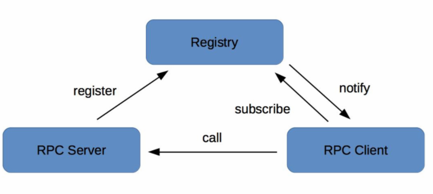
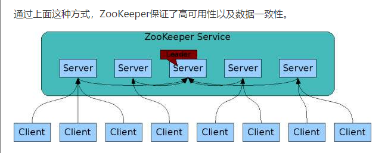
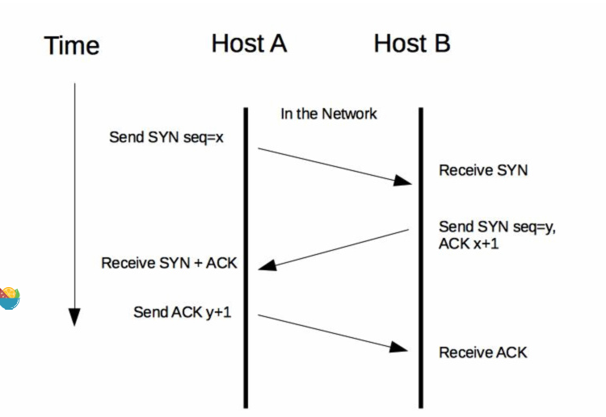
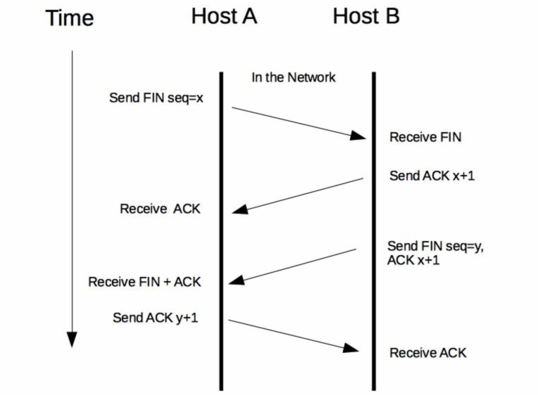
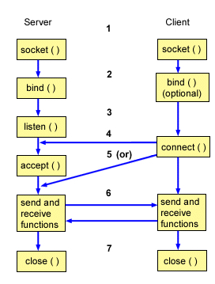
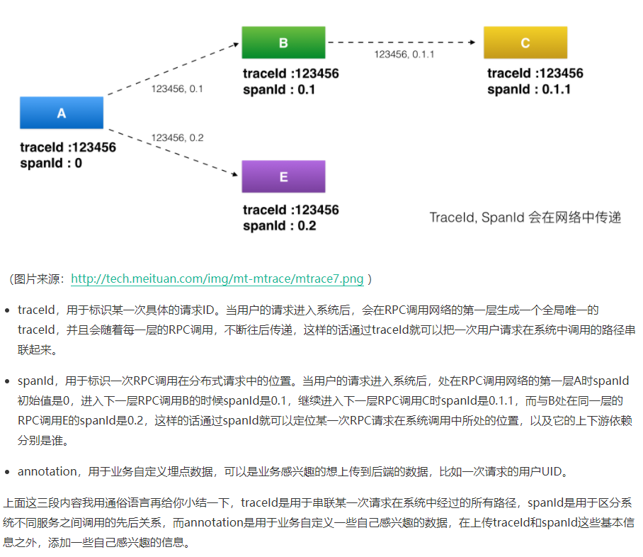
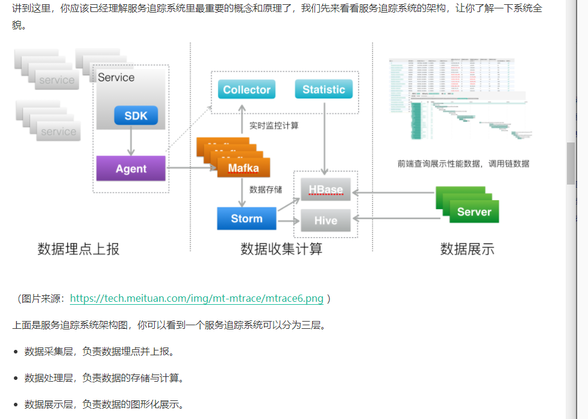

# 微服务从0-100


## 什么是微服务

> 微服务是由单一应用程序构成的小服务，拥有自己的进程与轻量化处理，服务以业务功能设计，以全自动的方式部署，与其他服务使用HTTP API通讯，同时，服务使用最小规模的集中管理k8s 和 docker


### 单体应用

**LAMP**  or  **MVC**    都是单体应用架构设计的，

优点是，学习成本低，开发上手快，测试，部署，运维比较方便。

缺点是，部署效率低下，当依赖越来越多。团队协作开发成本高（开发人员越多，打包次数越多）。系统高可用性差。线上发布慢


### 什么是服务化

> 服务化就是把传统的单机应用中通过JAR包依赖产生的本地方法调用，改造成通过RPC接口产生的远程方法调用。一般在编写业务代码时，对于一些通用的业务逻辑，我会尽力把它抽象并独立成为专门的模块，因为这对于代码复用和业务理解都大有裨益。
>
> 参考例
>
> 在过去的项目经历里，我对此深有体会。以微博系统为例，微博既包含了内容模块，也包含了消息模块和用户模块等。其中消息模块依赖内容模块，消息模块和内容模块又都依赖用户模块。当这三个模块的代码耦合在一起，应用启动时，需要同时去加载每个模块的代码并连接对应的资源。一旦任何模块的代码出现bug，或者依赖的资源出现问题，整个单体应用都会受到影响。
>
> 为此，首先可以把用户模块从单体应用中拆分出来，独立成一个服务部署，以RPC接口的形式对外提供服务。微博和消息模块调用用户接口，就从进程内的调用变成远程RPC调用。这样，用户模块就可以独立开发、测试、上线和运维，可以交由专门的团队来做，与主模块不耦合。进一步的可以再把消息模块也拆分出来作为独立的模块，交由专门的团队来开发和维护。
>
> 可见通过服务化，可以解决单体应用膨胀、团队开发耦合度高、协作效率低下的问题。

### 什么是微服务

相比于服务化的差别

> 服务拆分粒度更细，只要该模块的资源与其他模块没有依赖，就可以拆分
>
> 服务独立部署 ： 例如docker 实例，
>
> 服务独立维护： 负责人可以不是一样，独立开发
>
> 服务治理能力要求高 ，  例如k8s，，弹性伸缩，快速部署等等，一个平台


## 从单体应用走向服务化


### 什么时候进行服务化拆分？

1. 项目第一阶段的主要目标是 ： 快速开发和验证想法，证明产品思路是否可行。开发采取快速迭代，架构也不适合过度设计。所以将所有功能打包到一起，集中进行开发，测试和运维。初级阶段，是最高效的方式。并且方便加入越来越多的新特性或者功能

**一旦单体应用同时进行开发超过了10人，就会遇到问题，应该考虑服务化拆分**

### 服务化拆分的两种姿势：

#### 纵向拆分

> 从业务维度进行拆分。
>
> 标准是按照 **业务的关联程度来决定的，关联比较密切的业务适合拆分为一个微服务，而功能想对比较独立的业务适合单独拆分为一个微服务**

#### 横向拆分

> 是从公共且独立功能维度拆分。标准是按照是否有公共的被多个其他服务调用，且依赖的资源独立不与其他业务耦合。
>
> 例如 一个社交app，无论是首页信息量，评论，消息箱还是个人主页。都是需要用户昵称，那么将用户昵称单独拆出来是最好的

### 服务化拆分的前置条件

从单体应用 迁移到微服务架构是必将面临解决的；

1. 服务如何定义： 通过接口，不管是http还是rpc ，服务之间都是通过接口描述来约定，报告接口名，参数，返回值
2. 服务发布和订阅 ：  需要一个注册中心
3. 服务如何监控 ： qps（调用量） 、AvgTime(平均耗时）、以及P999   （99.9%的请求性能在多少毫秒以内） ，需要提供通用监控方案，能够覆盖业务埋点，数据收集，数据处理，数据展示的全链路功能
4. 服务如何处理 ： 熔断 等一些，防止服务互相请求无线延期的手段
5. 故障如何定位 ： 需要有一种解决方案能够将一次用户请求进行标记，并在多个依赖的服务系统中继续传递，以便串联所有路径，从而故障定位


## 初探微服务架构

> 首先服务提供者（就是提供服务的一方）按照一定的格式服务描述，向注册中心注册服务，声明自己能够提供哪些服务以及服务的地址是什么，完成服务发布
>
> 接下来服务消费者（就是调用服务的一方）请求注册中心，查询所需要的调用服务的地址，然后以约定的通信协议向服务提供者发起请求，得到请求结果后，再按照规定，解析内容

服务调用主要依赖下面几个基本组件：

1. 服务描述
2. 注册中心
3. 服务框架
4. 服务监控
5. 服务追踪
6. 服务之力

### 服务描述

> 服务如何对外描述，
>
> 常用是三种 : 
>
> 1. RESTful API
> 2. XML 配置  
> 3. IDL文件 例如 protobuf 文件


###  注册中心

> 服务的发布与订阅，类似一个注册中心的角色
>
> 例如 zookeeper ，etcd 等框架

流程：

- 服务提供者启动时，根据服务发布文件中配置的发布信息向注册中心注册自己的服务
- 服务消费者启动时，根据消费者配置文件中配置的服务信息向注册中心订阅自己所需要的服务
- 注册中心返回服务提供者地址给消费者
- 服务者提供者，发生问题，注册中心进行更新


### 服务框架

解决问题： 

1. 采用什么协议，http，tcp，udp
2. 数据传输方式，同步，异步，单连接上传，多路复用
3. 数据压缩格式： json 序列化，java对象序列化，protobuf 序列化（比另外两个都要小）


### 服务监控

服务监控的三个流程：

1. 指标收集
2. 数据处理
3. 数据展示


### 服务追踪

服务追踪的工作原理：

- 服务消费者发起调用钱，会在本地按照一定规则生成一个requestId，发起调用时，将requestId当做请求参数的一部分，传递给服务提供者
- 服务提供者受到请求后，记录requestId，处理请求，。如果服务提供者继续请求其他服务，会在本地再生成一个自己的requestId，然后把两个id当做请求参数向下传递

### 服务治理

> 就是通过一系列的手段保证在各种意外情况唉，服务调用仍然能够正常运行

状况 ： 

- 单机故障
- 单IDC 故障
- 依赖服务不可用


### 如何发布和引用服务

> 三种案例学习


### RESTful API

```java
@Path("/rest")
 public interface RestfulService {
     @GET
     @Produces(MediaType.APPLICATION_JSON)
     List<User> getUsers(@QueryParam("uid") int uid);
 
     @GET
     @Path("/primitive")
     @Produces(MediaType.TEXT_PLAIN)
     String testPrimitiveType();
 
     @POST
     @Consumes(MediaType.APPLICATION_FORM_URLENCODED)
     @Produces(MediaType.APPLICATION_JSON)
     Response add(@FormParam("id") int id, @FormParam("name") String name);
```

具体服务

```java
public class RestfulServerDemo implements RestfulService {
        
     @Override
     public List<User> getUsers(@CookieParam("uid") int uid) {
         return Arrays.asList(new User(uid, "name" + uid));
     }
 
     @Override
     public String testPrimitiveType() {
         return "helloworld!";
     }
 
     @Override
     public Response add(@FormParam("id") int id, @FormParam("name") String name) {
         return Response.ok().cookie(new NewCookie("ck", String.valueOf(id))).entity(new User(id, name)).build();
     }
```

部署web.xml

```java
<listener>
     <listener-class>com.weibo.api.motan.protocol.restful.support.servlet.RestfulServletContainerListener</listener-class>
 </listener>

 <servlet>
     <servlet-name>dispatcher</servlet-name>
     <servlet-class>org.jboss.resteasy.plugins.server.servlet.HttpServletDispatcher</servlet-class>
     <load-on-startup>1</load-on-startup>
     <init-param>
         <param-name>resteasy.servlet.mapping.prefix</param-name>
         <param-value>/servlet</param-value>  <!-- 此处实际为servlet-mapping的url-pattern，具体配置见resteasy文档-->
     </init-param>
 </servlet>

 <servlet-mapping>
     <servlet-name>dispatcher</servlet-name>
     <url-pattern>/servlet/*</url-pattern>
 </servlet-mapping>
```

这样服务消费者就可以通过HTTP协议调用服务了，因为HTTP协议本身是一个公开的协议，对于服务消费者来说几乎没有学习成本，所以比较适合用作跨业务平台之间的服务协议。比如你有一个服务，不仅需要在业务部门内部提供服务，还需要向其他业务部门提供服务，甚至开放给外网提供服务，这时候采用HTTP协议就比较合适，也省去了沟通服务协议的成本。


### XML 配置

步骤：

1. 服务提供者定义接口，并实现接口
2. 提供者启动，加载server.xml 配置文件将接口暴露
3. 消费者启动，加载client.xml 引入要调用的接口

motan 为例

```java
public interface FooService {
    public String hello(String name);
}

public class FooServiceImpl implements FooService {

    public String hello(String name) {
        System.out.println(name + " invoked rpc service");
        return "hello " + name;
    }
}
```

servier.xml

```xml
<?xml version="1.0" encoding="UTF-8"?>
<beans xmlns="http://www.springframework.org/schema/beans"
 xmlns:xsi="http://www.w3.org/2001/XMLSchema-instance"
 xmlns:motan="http://api.weibo.com/schema/motan"
 xsi:schemaLocation="http://www.springframework.org/schema/beans http://www.springframework.org/schema/beans/spring-beans-2.5.xsd
   http://api.weibo.com/schema/motan http://api.weibo.com/schema/motan.xsd">

    <!-- service implemention bean -->
    <bean id="serviceImpl" class="quickstart.FooServiceImpl" />
    <!-- exporting service by Motan -->
    <motan:service interface="quickstart.FooService" ref="serviceImpl" export="8002" />
</beans>
```

server.xml code

```java
import org.springframework.context.ApplicationContext;
import org.springframework.context.support.ClassPathXmlApplicationContext;

public class Server {

    public static void main(String[] args) throws InterruptedException {
        ApplicationContext applicationContext = new ClassPathXmlApplicationContext("classpath:motan_server.xml");
        System.out.println("server start...");
    }
}
```

client.xml

```xml
<?xml version="1.0" encoding="UTF-8"?>
<beans xmlns="http://www.springframework.org/schema/beans"
xmlns:xsi="http://www.w3.org/2001/XMLSchema-instance"
xmlns:motan="http://api.weibo.com/schema/motan"
xsi:schemaLocation="http://www.springframework.org/schema/beans http://www.springframework.org/schema/beans/spring-beans-2.5.xsd
   http://api.weibo.com/schema/motan http://api.weibo.com/schema/motan.xsd">

    <!-- reference to the remote service -->
    <motan:referer id="remoteService" interface="quickstart.FooService" directUrl="localhost:8002"/>
</beans>
```

code client

```java
import org.springframework.context.ApplicationContext;
import org.springframework.context.support.ClassPathXmlApplicationContext;


public class Client {

    public static void main(String[] args) throws InterruptedException {
        ApplicationContext ctx = new ClassPathXmlApplicationContext("classpath:motan_client.xml");
        FooService service = (FooService) ctx.getBean("remoteService");
        System.out.println(service.hello("motan"));
    }
}
```

太麻烦，只有私有RPC 去使用，侵入性太高


### IDL文件

> IDL就是接口描述语言（interface description language）的缩写，通过一种中立的方式来描述接口，使得在不同的平台上运行的对象和不同语言编写的程序可以相互通信交流。比如你用Java语言实现提供的一个服务，也能被PHP语言调用。
>
> 也就是说IDL主要是**用作跨语言平台的服务之间的调用**，有两种最常用的IDL：一个是Facebook开源的**Thrift协议**，另一个是Google开源的**gRPC协议**。无论是Thrift协议还是gRPC协议，它们的工作原理都是类似的。

gRpc 为例

```protobuf
// The greeter service definition.
service Greeter {
  // Sends a greeting
  rpc SayHello (HelloRequest) returns (HelloReply) {}
  rpc SayHelloAgain (HelloRequest) returns (HelloReply) {}

}

// The request message containing the user's name.
message HelloRequest {
  string name = 1;
}

// The response message containing the greetings
message HelloReply {
  string message = 1;
}  
```

服务端的代码，可以有protoc 插件生成

缺点 ： 字段通过文件写死，不容易改变，只能固定字段去使用

## 如何注册和发现服务


### 注册中心原理



### 注册中心实现方式

> 注册中心的实现主要涉及几个问题：注册中心需要提供哪些接口，该如何部署；如何存储服务信息；如何监控服务提供者节点的存活；如果服务提供者节点有变化如何通知服务消费者，以及如何控制注册中心的访问权限。下面我来一一给你讲解。

#### 注册中心API

1. 服务注册几口
2. 服务反注册接口
3. 心跳汇报接口
4. 服务订阅接口
5. 服务变更接口

后台api

1. 服务查询接口
2. 服务修改接口

#### 集群部署

以开源注册中心ZooKeeper为例，ZooKeeper集群中包含多个节点，服务提供者和服务消费者可以同任意一个节点通信，因为它们的数据一定是相同的，这是为什么呢？这就要从ZooKeeper的工作原理说起：

- 每个Server在内存中存储了一份数据，Client的读请求可以请求任意一个Server。
- ZooKeeper启动时，将从实例中选举一个leader（Paxos协议）。
- Leader负责处理数据更新等操作（ZAB协议）。
- 一个更新操作成功，当且仅当大多数Server在内存中成功修改 。



#### 目录存储

还是以ZooKeeper为例，注册中心存储服务信息一般采用层次化的目录结构：

- 每个目录在ZooKeeper中叫作znode，并且其有一个唯一的路径标识。
- znode可以包含数据和子znode。
- znode中的数据可以有多个版本，比如某一个znode下存有多个数据版本，那么查询这个路径下的数据需带上版本信息。


#### 服务健康状态检测

它是基于ZooKeeper客户端和服务端的长连接和会话超时控制机制，来实现服务健康状态检测的。

，具体方式是通过客户端定时向服务端发送心跳消息（ping消息），服务器重置下次SESSION_TIMEOUT时间。如果超过SESSION_TIMEOUT后服务端都没有收到客户端的心跳消息，则服务端认为这个Session就已经结束了，ZooKeeper就会认为这个服务节点已经不可用，将会从注册中心中删除其信息。


#### 服务状态变更通知

一旦注册中心探测到有服务提供者节点新加入或者被剔除，就必须立刻通知所有订阅该服务的服务消费者，刷新本地缓存的服务节点信息，确保服务调用不会请求不可用的服务提供者节点

zookeeper 有watcher 机制


#### 白名单机制

为了防止这种情况发生，注册中心需要提供一个保护机制，你可以把注册中心想象成一个带有门禁的房间，只有拥有门禁卡的RPC Server才能进入。在实际应用中，注册中心可以提供一个白名单机制，只有添加到注册中心白名单内的RPC Server，才能够调用注册中心的注册接口，这样的话可以避免测试环境中的节点意外跑到线上环境中去。

```txt
1. 注册中心的服务注册和发现都是基于API的，可以自动化注册与发现，dns则是人工注册。这样也导致前者实时性、容错性好于后者。
2. 注册中心可以注册http、rpc等各种服务，dns只能注册http服务
3. 注册中心对已注册的服务会有主动的、自动化的健康检查机制，dns没有。
4. 注册中心一般是一级分布式的，dns则是多级架构，例如根域名服务器、权威域名服务器等
5. 注册中心的安全机制相对dns弱一些，毕竟是内部使用。


不同意某楼的观念，dns同样也可以用于非http服务的，我觉得dns相较于zk这样的注册中心，劣势在于1. dns的维护管理比较麻烦，甚至需要手工配置 2.dns更新后生效有延迟 3. 客户端一般只能同时连接到一个server ip，无法做请求的负载均衡，而注册中心的方式通常客户端会与所有server建立连接形成连接池，从而在调用端实现请求的负载均衡
```


## 如何实现RPC远程服务调用

> 上面就是RPC调用的过程，由此可见，想要完成调用，你需要解决四个问题：
>
> - 客户端和服务端如何建立网络连接？
> - 服务端如何处理请求？
> - 数据传输采用什么协议？
> - 数据该如何序列化和反序列化？

### 客户端与服务端如何建立网络连接

#### http通信





#### socket 通信

> Socket通信是基于TCP/IP协议的封装，建立一次Socket连接至少需要一对套接字，其中一个运行于客户端，称为ClientSocket ；另一个运行于服务器端，称为ServerSocket 。就像下图所描述的，Socket通信的过程分为四个步骤：服务器监听、客户端请求、连接确认、数据传输。

1. 服务器监听 ： 调用bind函数绑定具体端口，listen 函数实时监控网络状态
2. 客户端请求 ： 调用connect 函数发起地址和端口发起请求
3. 服务端连接确认 ： 接收到请求后，调用accept 函数相应请求
4. 数据传输 ： 客户端调用send函数，服务器调用receive函数， 就可以得到返回结果



- 链路存活检测：客户端需要定时地发送心跳检测消息（一般是通过ping请求）给服务端，如果服务端连续n次心跳检测或者超过规定的时间都没有回复消息，则认为此时链路已经失效，这个时候客户端就需要重新与服务端建立连接。
- 断连重试：通常有多种情况会导致连接断开，比如客户端主动关闭、服务端宕机或者网络故障等。这个时候客户端就需要与服务端重新建立连接，但一般不能立刻完成重连，而是要等待固定的间隔后再发起重连，避免服务端的连接回收不及时，而客户端瞬间重连的请求太多而把服务端的连接数占满。

### 服务端处理请求

1. 同步阻塞方式BIO  ：客户端每发一次请求，服务端就生成一个线程去处理。当客户端同时发起的请求很多时，服务端需要创建很多的线程去处理每一个请求，如果达到了系统最大的线程数瓶颈，新来的请求就没法处理了。

2. 同步非阻塞方式NIO   ：客户端每发一次请求，服务端并不是每次都创建一个新线程来处理，而是通过I/O多路复用技术进行处理。就是把多个I/O的阻塞复用到同一个select的阻塞上，从而使系统在单线程的情况下可以同时处理多个客户端请求。这种方式的优势是开销小，不用为每个请求创建一个线程，可以节省系统开销

3. 异步非阻塞方式AIO   ：客户端只需要发起一个I/O操作然后立即返回，等I/O操作真正完成以后，客户端会得到I/O操作完成的通知，此时客户端只需要对数据进行处理就好了，不需要进行实际的I/O读写操作，因为真正的I/O读取或者写入操作已经由内核完成了。这种方式的优势是客户端无需等待，不存在阻塞等待问题。

   

- BIO适用于连接数比较小的业务场景，这样的话不至于系统中没有可用线程去处理请求。这种方式写的程序也比较简单直观，易于理解。
- NIO适用于连接数比较多并且请求消耗比较轻的业务场景，比如聊天服务器。这种方式相比BIO，相对来说编程比较复杂。
- AIO适用于连接数比较多而且请求消耗比较重的业务场景，比如涉及I/O操作的相册服务器。这种方式相比另外两种，编程难度最大，程序也不易于理解。

Netty，MINA  更加方便

### 数据该如何序列化和反序列化

常用的序列化方式分为两类：文本类如XML/JSON等，二进制类如PB/Thrift等，而具体采用哪种序列化方式，主要取决于三个方面的因素。

- 支持数据结构类型的丰富度。数据结构种类支持的越多越好，这样的话对于使用者来说在编程时更加友好，有些序列化框架如Hessian 2.0还支持复杂的数据结构比如Map、List等。
- 跨语言支持。序列化方式是否支持跨语言也是一个很重要的因素，否则使用的场景就比较局限，比如Java序列化只支持Java语言，就不能用于跨语言的服务调用了。
- 性能。主要看两点，一个是序列化后的压缩比，一个是序列化的速度。以常用的PB序列化和JSON序列化协议为例来对比分析，PB序列化的压缩比和速度都要比JSON序列化高很多，所以对性能和存储空间要求比较高的系统选用PB序列化更合适；而JSON序列化虽然性能要差一些，但可读性更好，更适合对外部提供服务。


##  如何监控微服务调用


### 监控对象

- 用户端监控。通常是指业务直接对用户提供的功能的监控。以微博首页Feed为例，它向用户提供了聚合关注的所有人的微博并按照时间顺序浏览的功能，对首页Feed功能的监控就属于用户端的监控。
- 接口监控。通常是指业务提供的功能所依赖的具体RPC接口的监控。继续以微博首页Feed为例，这个功能依赖于用户关注了哪些人的关系服务，每个人发过哪些微博的微博列表服务，以及每条微博具体内容是什么的内容服务，对这几个服务的调用情况的监控就属于接口监控。
- 资源监控。通常是指某个接口依赖的资源的监控。比如用户关注了哪些人的关系服务使用的是Redis来存储关注列表，对Redis的监控就属于资源监控。
- 基础监控。通常是指对服务器本身的健康状况的监控。主要包括CPU利用率、内存使用量、I/O读写量、网卡带宽等。对服务器的基本监控也是必不可少的，因为服务器本身的健康状况也是影响服务本身的一个重要因素，比如服务器本身连接的网络交换机上联带宽被打满，会影响所有部署在这台服务器上的业务。


### 监控指标

- 请求量。请求量监控分为两个维度，一个是实时请求量，一个是统计请求量。实时请求量用QPS（Queries Per Second）即每秒查询次数来衡量，它反映了服务调用的实时变化情况。统计请求量一般用PV（Page View）即一段时间内用户的访问量来衡量，比如一天的PV代表了服务一天的请求量，通常用来统计报表。
- 响应时间。大多数情况下，可以用一段时间内所有调用的平均耗时来反映请求的响应时间。但它只代表了请求的平均快慢情况，有时候我们更关心慢请求的数量。为此需要把响应时间划分为多个区间，比如0～10ms、10ms～50ms、50ms～100ms、100ms～500ms、500ms以上这五个区间，其中500ms以上这个区间内的请求数就代表了慢请求量，正常情况下，这个区间内的请求数应该接近于0；在出现问题时，这个区间内的请求数会大幅增加，可能平均耗时并不能反映出这一变化。除此之外，还可以从P90、P95、P99、P999角度来监控请求的响应时间，比如P99 = 500ms，意思是99%的请求响应时间在500ms以内，它代表了请求的服务质量，即SLA。
- 错误率。错误率的监控通常用一段时间内调用失败的次数占调用总次数的比率来衡量，比如对于接口的错误率一般用接口返回错误码为503的比率来表示。


### 监控维度

- 全局维度。从整体角度监控对象的的请求量、平均耗时以及错误率，全局维度的监控一般是为了让你对监控对象的调用情况有个整体了解。
- 分机房维度。一般为了业务的高可用性，服务通常部署在不止一个机房，因为不同机房地域的不同，同一个监控对象的各种指标可能会相差很大，所以需要深入到机房内部去了解。
- 单机维度。即便是在同一个机房内部，可能由于采购年份和批次的不同，位于不同机器上的同一个监控对象的各种指标也会有很大差异。一般来说，新采购的机器通常由于成本更低，配置也更高，在同等请求量的情况下，可能表现出较大的性能差异，因此也需要从单机维度去监控同一个对象。
- 时间维度。同一个监控对象，在每天的同一时刻各种指标通常也不会一样，这种差异要么是由业务变更导致，要么是运营活动导致。为了了解监控对象各种指标的变化，通常需要与一天前、一周前、一个月前，甚至三个月前做比较。
- 核心维度。根据我的经验，业务上一般会依据重要性程度对监控对象进行分级，最简单的是分成核心业务和非核心业务。核心业务和非核心业务在部署上必须隔离，分开监控，这样才能对核心业务做重点保障。

讲到这里先小结一下，**对于一个微服务来说，你必须明确要监控哪些对象、哪些指标，并且还要从不同的维度进行监控，才能掌握微服务的调用情况**。明确了这几个关键的问题后，那么该如何搭建一个监控系统，来完成上面这些监控功能呢？


### 监控系统原理  （PB对象是protocol buffers）

可见，**监控系统主要包括四个环节：数据采集、数据传输、数据处理和数据展示**，下面我来给你讲解下每一个环节的实现原理。

**1. 数据采集**

通常有两种数据收集方式：

- 服务主动上报，这种处理方式通过在业务代码或者服务框架里加入数据收集代码逻辑，在每一次服务调用完成后，主动上报服务的调用信息。
- 代理收集，这种处理方式通过服务调用后把调用的详细信息记录到本地日志文件中，然后再通过代理去解析本地日志文件，然后再上报服务的调用信息。

无论哪种数据采集方式，首先要考虑的问题就是采样率，也就是采集数据的频率。采样率决定了监控的实时性与精确度，一般来说，采样率越高，监控的实时性就越高，精确度也越高。但采样对系统本身的性能也会有一定的影响，尤其是采集后的数据需要写到本地磁盘的时候，过高的采样率会导致系统写入磁盘的I/O过高，进而会影响到正常的服务调用。所以设置合理的采用率是数据采集的关键，最好是可以动态控制采样率，在系统比较空闲的时候加大采样率，追求监控的实时性与精确度；在系统负载比较高的时候减小采样率，追求监控的可用性与系统的稳定性。

**2. 数据传输**

数据传输最常用的方式有两种：

- UDP传输，这种处理方式是数据处理单元提供服务器的请求地址，数据采集后通过UDP协议与服务器建立连接，然后把数据发送过去。
- Kafka传输，这种处理方式是数据采集后发送到指定的Topic，然后数据处理单元再订阅对应的Topic，就可以从Kafka消息队列中读取到对应的数据。

无论采用哪种传输方式，数据格式都十分重要，尤其是对带宽敏感以及解析性能要求比较高的场景，一般数据传输时采用的数据格式有两种：

- 二进制协议，最常用的就是PB对象，它的优点是高压缩比和高性能，可以减少传输带宽并且序列化和反序列化效率特别高。
- 文本协议，最常用的就是JSON字符串，它的优点是可读性好，但相比于PB对象，传输占用带宽高，并且解析性能也要差一些。

**3. 数据处理**

数据处理是对收集来的原始数据进行聚合并存储。数据聚合通常有两个维度：

- 接口维度聚合，这个维度是把实时收到的数据按照接口名维度实时聚合在一起，这样就可以得到每个接口的实时请求量、平均耗时等信息。
- 机器维度聚合，这个维度是把实时收到的数据按照调用的节点维度聚合在一起，这样就可以从单机维度去查看每个接口的实时请求量、平均耗时等信息。

聚合后的数据需要持久化到数据库中存储，所选用的数据库一般分为两种：

- 索引数据库，比如Elasticsearch，以倒排索引的数据结构存储，需要查询的时候，根据索引来查询。
- 时序数据库，比如OpenTSDB，以时序序列数据的方式存储，查询的时候按照时序如1min、5min等维度来查询。

**4. 数据展示**

数据展示是把处理后的数据以Dashboard的方式展示给用户。数据展示有多种方式，比如曲线图、饼状图、格子图展示等。


##  如何追踪微服务调用


###  服务追踪的作用

**第一，优化系统瓶颈。**

通过记录调用经过的每一条链路上的耗时，我们能快速定位整个系统的瓶颈点在哪里。比如你访问微博首页发现很慢，肯定是由于某种原因造成的，有可能是运营商网络延迟，有可能是网关系统异常，有可能是某个服务异常，还有可能是缓存或者数据库异常。通过服务追踪，可以从全局视角上去观察，找出整个系统的瓶颈点所在，然后做出针对性的优化。

**第二，优化链路调用。**

通过服务追踪可以分析调用所经过的路径，然后评估是否合理。比如一个服务调用下游依赖了多个服务，通过调用链分析，可以评估是否每个依赖都是必要的，是否可以通过业务优化来减少服务依赖。

还有就是，一般业务都会在多个数据中心都部署服务，以实现异地容灾，这个时候经常会出现一种状况就是服务A调用了另外一个数据中心的服务B，而没有调用同处于一个数据中心的服务B。

根据我的经验，跨数据中心的调用视距离远近都会有一定的网络延迟，像北京和广州这种几千公里距离的网络延迟可能达到30ms以上，这对于有些业务几乎是不可接受的。通过对调用链路进行分析，可以找出跨数据中心的服务调用，从而进行优化，尽量规避这种情况出现。

**第三，生成网络拓扑。**

通过服务追踪系统中记录的链路信息，可以生成一张系统的网络调用拓扑图，它可以反映系统都依赖了哪些服务，以及服务之间的调用关系是什么样的，可以一目了然。除此之外，在网络拓扑图上还可以把服务调用的详细信息也标出来，也能起到服务监控的作用。

**第四，透明传输数据。**

除了服务追踪，业务上经常有一种需求，期望能把一些用户数据，从调用的开始一直往下传递，以便系统中的各个服务都能获取到这个信息。比如业务想做一些A/B测试，这时候就想通过服务追踪系统，把A/B测试的开关逻辑一直往下传递，经过的每一层服务都能获取到这个开关值，就能够统一进行A/B测试。


### 服务追踪系统原理

它的核心理念就是**调用链**：通过一个全局唯一的ID将分布在各个服务节点上的同一次请求串联起来，从而还原原有的调用关系，可以追踪系统问题、分析调用数据并统计各种系统指标。



### 服务追踪系统发现




## 微服务治理的手段


### 节点管理

1. 注册中心主动摘除机制
2. 服务消费者摘除机制


### 负载均衡

1. 随机算法
2. 轮询算法
3. 最少活跃调用算法
4. 一致性hash算法


### 服务路由

> 对于服务消费者而言，在内存中的可用服务节点列表中选择哪个节点不仅由负载均衡算法决定，还由路由规则确定。
>
> 所谓的路由规则，就是通过一定的规则如条件表达式或者正则表达式来限定服务节点的选择范围。
>
> 为什么要制定路由规则呢？主要有两个原因。


1. 业务存在灰度发布的需求
2. 多机房就近访问的需求

那么路由规则该如何配置呢？根据我的实际项目经验，一般有两种配置方式。

1. 静态配置
2. 动态配置

### 服务容错

- FailOver：失败自动切换。就是服务消费者发现调用失败或者超时后，自动从可用的服务节点列表总选择下一个节点重新发起调用，也可以设置重试的次数。这种策略要求服务调用的操作必须是幂等的，也就是说无论调用多少次，只要是同一个调用，返回的结果都是相同的，一般适合服务调用是读请求的场景。
- FailBack：失败通知。就是服务消费者调用失败或者超时后，不再重试，而是根据失败的详细信息，来决定后续的执行策略。比如对于非幂等的调用场景，如果调用失败后，不能简单地重试，而是应该查询服务端的状态，看调用到底是否实际生效，如果已经生效了就不能再重试了；如果没有生效可以再发起一次调用。
- FailCache：失败缓存。就是服务消费者调用失败或者超时后，不立即发起重试，而是隔一段时间后再次尝试发起调用。比如后端服务可能一段时间内都有问题，如果立即发起重试，可能会加剧问题，反而不利于后端服务的恢复。如果隔一段时间待后端节点恢复后，再次发起调用效果会更好。
- FailFast：快速失败。就是服务消费者调用一次失败后，不再重试。实际在业务执行时，一般非核心业务的调用，会采用快速失败策略，调用失败后一般就记录下失败日志就返回了。

一般情况下对于幂等的调用，可以选择FailOver或者FailCache，非幂等的调用可以选择FailBack或者FailFast。