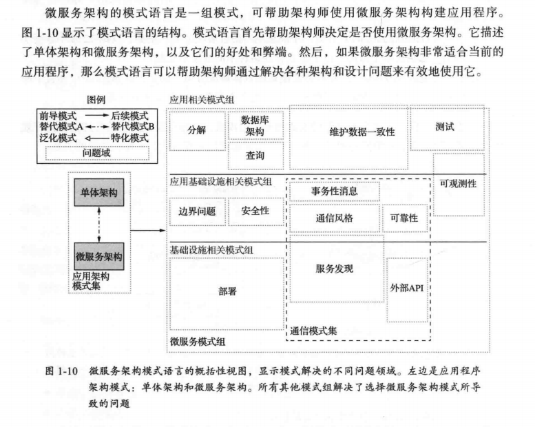

# 微服务架构设计模式----读书几笔

## 读书之前

1. 微服务不是解决所有问题的万能“银弹”
2. 编写整洁的代码和使用自动化测试至关重要，因为这是现代软件开发的基础
3. 关注微服务的本质，**即服务的分解和定义，而不是技术**，如容器和其他工具
4. 确保你的服务松耦合，并且可以独立开发、测试和部署，不要搞成分布式单体，那是巨大的灾难
5. **最重要的**，**不能只是在技术上采用微服务架构。**拥抱`DevOps`的原则和实践，在组织结构上实现跨职能的自治团队，这必不可少。

**实现微服务架构并不是你的目标。你的目标是加速大型复杂应用程序的开发**

## 第一章 ：逃离单体地狱

> 导读：
>
> - 单体地狱的特征、如何借助微服务架构逃离单体地狱
> - 微服务架构的基本特征，他的好处和弊端
> - 开发大型复杂应用时，如何借助微服务实现`DevOps`式开发风格
> - 微服务架构的模式语言及为什么使用它

<!--泥球模式 ： 比喻为“随意架构的、庞大的、草率的、布满了胶带和线路，如同意大利面条一般的代码丛林”-->

**案例单体巨石架构**

<!--虽然逻辑上，上述架构是模块化架构，但是物理上还是打包为一个单一的war文件-->

###### 单体架构的好处

1. 应用的开发简单
2. 易于对应用程序进行大规模的更改
3. 测试相对简单直观
4. 部署简单明了
5. 横向扩展不费吹灰之力： 多个实例，有一个负载均衡进行调度

###### 什么是单体地狱

1. 过度的复杂性会吓退开发者

   系统本身过于庞大，因此，修复软件中的问题和正确实现新功能变得困难且耗时

2. 开发速度慢

   从编辑到构建、运行再到测试，周期花费时间越来越长，影响团队效率

3. 从代码提交到实际部署的周期很长，而且容易出问题

   部署速度缓慢，敏捷实践存在不完整。

   又因为，代码完成到运行，众多开发人员想一个代码库提交更改，构建结果始终无法交付。使用分支又带来漫长合并

   运行测试，有可能会因为一些小问题会跑整个测试 套件，甚至包括手工测试。如果失败，还要有诊断，修复的时间。

4. 难以扩展

   对于不同的功能，所需要的环境是不相同的，例如大内存，高CPU 等不同环境，无法同时满足不同模块的需求

5. 交付可靠的单体应用是一项挑战

   系统不可靠是应用程序体积庞大而无法进行全面和彻底的测试。不同的模块在同一个进程运行，一个错，都错。

###### 学习内容，需要懂得？

- 三层架构
- Web应用程序设计
- 使用面向对象设计来开发业务逻辑
- 关系型数据库： SQL 和ACID 事务概念
- 使用消息代理和REST API 进行进程间通信
- 安全，包括身份验证和访问授权

###### 看完下面的内容，是否学会了，你想学的？

- 掌握的知识 ：
  - 微服务架构的基本特点，好处和弊端，以及在什么情况下使用微服务架构
  - 分布式数据管理的架构模式
  - 针对微服务架构应用程序的有效测试策略
  - 微服务架构应用程序的部署方式
  - 把单体应用重构为微服务架构的策略
- 掌握如下的技术
  - 使用微服务的架构模式来设计应用程序的架构
  - 为服务开发业务逻辑
  - 使用Saga 在进程间维护数据的一致性
  - 实现跨服务的数据查询
  - 更高效地测试微服务架构应用程序
  - 开发生产环境就绪的应用程序，实现安全性、可配置性和可观测性
  - 把现有的单体应用重构为服务。

##### 拯救之道 ： 微服务架构

> 架构的重要性在于，他影响了应用的**非功能性需求**，也称为**质量属性**或者**其他的能力**

###### 扩展立方体和服务

1. X轴扩展：在多个实例之间实现请求的负载均衡

   **常用方法**，相当于nginx  的负载均衡

   

   这是提高`应用程序吞吐量`和`可用性` 的好方法

2. Z轴扩展：根据请求的属性路由请求

   不同于X轴扩展， **每个实例仅负责数据的一个子集**。置于前端的路由器使用请求中的特定属性将请求路由到适当的实例。例如 用户的id

   

   对于应用长须需要处理`增加的事务`和`数据量时`，这是一种很好的扩展方式。

3. Y轴扩展：根据功能把应用拆分为服务

   `以上两种，都是提高了应用的吞吐量和可用性，但是没有解决根本性的问题，就是日益增长的开发和应用复杂性`

   

   > 服务本质上是一个麻雀虽小但五脏俱全的应用程序，他实现了一组相关的功能，例如订单管理、客户管理等。。服务可以在需要的时候借助X轴或Z轴方式进行扩展。

   微服务架构的概括性定义是 ：把应用程序功能性分解为一组服务的架构风格。**请注意这个定义中并没有包含任何与规模有关的内容。**重要的是，每一个服务都是由一组专注的，内聚的功能职责组成。

###### 微服务架构作为模块化的一种形式

> **模块化** 是开发大型、复杂应用程序的基础。当应用程序规模太大，很难作为一个整体开发，也很难让一个人完全理解。，为了让不同的人开发和理解，大型应用需要拆分为模块。。
>
> 在单体应用中，模块通常用 java 包，artifact 来定义，随着时间推移，往往会变成巨石
>
> 微服务架构使用服务作为单元。

###### 每个服务都拥有自己的数据库

**微服务架构的一个关键特性是每一个服务之间都是松耦合的**，仅通过API 进行通信

==方式是 ：每个服务都拥有自己的私有数据库==，在运行时，服务实现了相互之间的独立，不会因为其他的服务锁住数据库而进入阻塞状态。

==独立的数据库== ------> 并不是所指 独立的数据库服务器

###### 上述案例，拆分后

###### 微服务架构与SOA的异同

> 什么是SOA？
>
> 面向服务架构，它可以根据需求通过网络对松散耦合的粗粒度应用组件进行分布式部署、组合和使用。服务层是SOA的基础，可以直接被应用调用，从而有效控制系统中与软件代理交互的人为依赖性。
>
> SOA是一种粗粒度、松耦合服务架构，服务之间通过简单、精确定义接口进行通讯，不涉及底层编程接口和通讯模型。SOA可以看作是B/S模型、[XML](https://baike.baidu.com/item/XML)（[标准通用标记语言](https://baike.baidu.com/item/标准通用标记语言)的子集）/Web Service技术之后的自然延伸。
>
> SOA将能够帮助软件工程师们站在一个新的高度理解企业级架构中的各种组件的开发、部署形式，它将帮助企业系统架构者以更迅速、更可靠、更具重用性架构整个业务系统。较之以往，以[SOA架构](https://baike.baidu.com/item/SOA架构/5577988)的系统能够更加从容地面对业务的急剧变化。
>
> SOA系统是一种企业通用性架构。

SOA 与微服务的比较

|                | SOA                                                      | 微服务                                                       |
| -------------- | -------------------------------------------------------- | ------------------------------------------------------------ |
| 服务间通信     | 智能管道，例如Enterprise Service Bus，往往采用重量级协议 | 使用哑管道，例如消息代理，或者服务之间点对点通信，REST 或者gRPC |
| 数据管理       | 全局数据模型并共享数据库                                 | 每个服务都有自己的数据模型和数据库                           |
| 典型服务的规模 | 较大的单体应用                                           | 较小的服务                                                   |

因此：SOA 应用通常包含和继承若干个大型的服务，微服务架构的应用常常由数十甚至上百个更小的服务组成。

#### 微服务架构的好处和弊端

##### 好处

###### 1. 使大型的服务应用程序可以持续交付和持续部署

> 可以实现应用程序的持续交付和持续部署 。 这两个名词属于`DevOps` 。
>
> 高性能的软件交付实践可以应用程序到生产环境面临更少的问题和故障

三种方式实现CI/CD

1. 它拥有CI/CD所需要的可测试性： 自动化测试
2. 它拥有CI/CD所需要的可不属性：独立部署
3. 它使开发团队能够自助且松散耦合： 团队相互之间不牵扯过多，独立开发、部署、扩展

`DevOps`所实现上的间接价值

1. 缩短产品上市时间，快速响应客户反馈
2. 使企业能够提供当今客户所期望的可靠服务
3. 员工满意度更高，更有时间在有价值的事情上

###### 2.每个服务都相对较小并容易维护

每个服务都较小，开发者更容易上手，开发速度更快，提高开发效率

###### 3. 服务可以独立部署，扩展

服务可以独立扩展，对硬件的需求有着更加的好的，适配性。可以部署在他们需求的硬件上，提高速度

###### 4. 更好的容错性

当一个服务出现错误，不会牵扯到其他的服务

###### 5. 更容易实验和采纳新的技术

开发者可以自由选择适用这个服务的任何语言和框架。并且可以尝试新的技术，而能承担所带来的风险。

##### 弊端

###### 1. 服务的拆分和定义是一项挑战

拆分不对可能会构建出一个**分布式单体应用**： ==一个包含了一大堆互相之间紧耦合的服务，却又必须部署在一起的所谓分布式系统。这更是灾难。

###### 2. 分布式系统带来的各种复杂性

- 服务必须使用进程间通信机制。
- 服务之间通信的不可用，高延迟的情况
- 跨服务的事务和查询成为一项挑战。
- 编写自动化测试难度大，
- 运维难度增大

###### 3. 当部署跨越多个服务的功能时需要谨慎地协调更多开发团队。

多个团队的多个项目，必须严谨协调发布

###### 4. 开发者需要思考到底应该在应用的什么阶段使用微服务架构

#### 微服务架构的模式语言

**模式** 是针对特定上下文中发生的问题的可重用解决方案

高层设计模式-------->

常用的模式结构包括三个重要部分：

1. 需求
2. 结果上下文
3. 相关模式

###### 需求 :  必须解决的问题

> 需求部分描述了必须解决的问题和围绕这个问题的特定上下文环境。需求有时是冲突的，要有所取舍

###### 结果上下文 ： 采用模式后可能带来的后果

- 好吃-----模式的好处，解决了什么需求
- 弊端-----模式的弊端，没有解决那些需求
- 问题------使用模式引入了新问题

###### 相关模式： 5种不同类型的关系

- 前导 ： 前导模式是催生这个模式的需求的模式，例如微服务模式是除单体架构模式以外整个模式语言中所有模式的前导模式
- 后续 ： 指用来解决当前模式引入新问题的模式，例如，你采纳了微服务架构模式，你需要一系列后续模式解决如服务发现。
- 替代： 当前模式的替代模式
- 泛化： 针对一个问题的一般性解决方案 ：后面有“每主机单个服务”模式不同技术实现
- 特化： 针对特定模式的具体解决方案 ： 每主机单个服务的具体解决方案

######  模式语言概述

数据一致性有关模式

微服务需要设计具备可观测的服务

## 第二章： 服务的拆分策略

> 领域驱动设计DDD 的思想

###### 微服务架构到底是啥

> 软件的架构是一种抽象的架构，它由软件的各个组成部分和这些部分之间的依赖关系构成。
>
> 而 微服务架构 是一种架构风格，可为应用程序提供更高的可维护性、可测试性和可部署性。

软件架构的4+1 视图模型

架构风格

1. 分层式架构风格

   

2. 六边形架构风格

   

   

   

   

拆分：

1. 根据业务能力拆分

   

2. 根据子域进行服务拆分

   

   

###### 拆分单体应用为服务的难点

1. 网络延迟
2. 同步进程间通信导致可用性降低
3. 在服务之间维持数据一致性
4. 获取一致的数据视图
5. 上帝类阻碍了拆分，例如Order订单类，

## 第三章： 微服务架构中的进程间通信

### 微服务架构中的进程间通信概述

#### 交互方式

1. 维度一 ： 关注的是 1对1 ，1对多
   1. 一对一 ，每个客户端请求由一个服务实例来处理
   2. 一对多，每个客户端请求由多个服务实例来处理
2. 维度二： 同步和异步
   1. 同步： 客户端请求需要服务端实时响应，客户端等待响应式可能导致堵塞
   2. 异步： 客户端请求不会阻塞进程，服务端的响应可以是非实时的。

