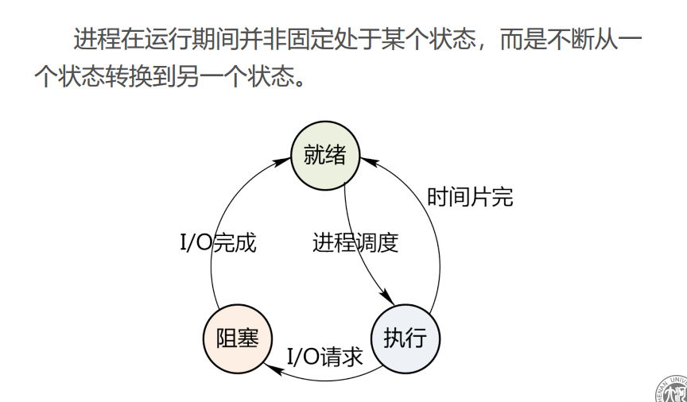
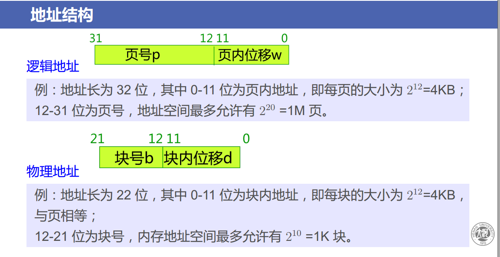
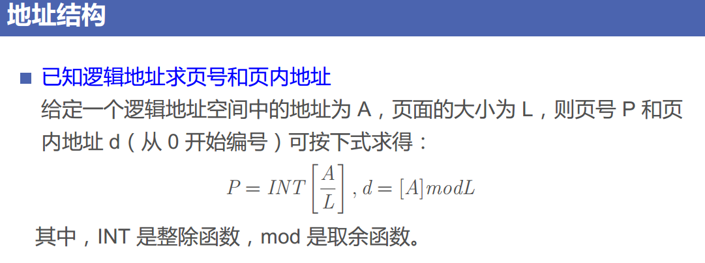

[TOC]

# 操作系统复习要点

## 计算题类型总结

1 利用信号量实现进程同步
2 处理机调度算法（周转时间）
3 银行家算法
4 分区存储管理算法
5 逻辑地址物理地址变换
6 请求分页中的页面置换算法
7 磁盘访问时间
8 磁盘调度算法（平均移道数）
9 混合索引分配
10 文件控制块和索引结点
11 位示图

## 1.  8道大题必出4道大题

1. 简述操作系统的四个基本特征
    操作系统有四个基本特征 ： 并行与并发，共享，异步，虚拟
    * 并行与并发 ： 并行指得是同一时刻发生，并发指得是同一间隔发生
    * 共享 ： 是指系统中的资源可供内存中多个并发执行的进程(线程)共同使用
    * 虚拟 ： 通过某种技术把一个物理实体变为若干个逻辑上的对应物，主要目的在于提高资源的利用率
    * 异步性 ： 也称不确定性，指进程的执行顺序和执行时间的不确定性

2. 进程有哪几种基本状态？ 简要描述进程基本状态之间的转换的典型原因
    进程有三种基本状态 ；就绪状态，运行状态，等待状态
    可以简称为 ：  阻塞，挂起，睡眠
    * 处于就绪装填的进程，当进程调度程序为之分配处理机后，该进程就由就绪状态变为执行状态
    * 正在执行的进程因发生某种时事件无法执行， 则由执行状态转变为阻塞状态
    * 正在执行的过程如，因**时间片完，或被高优先级的进程抢占处理机而被暂停执行** 则变为执行状态 为 就绪状态

3. 什么是死锁？ 简述产生死锁的必要条件
    死锁 是进程 运行过程 中因争夺资源一种僵局。当进程处于这样僵持状态时，若无外力作用，他们都将无发再向前推进
    1. 必要条件
        * 互斥条件 ： 进程对所分配的资源进行排它性的作用
        * 请求和保持条件 : 进程已经至少保持一个资源，但又提出了新的资源请求，但是该资源被其他进程占有
        * 不剥夺条件 ： 进程已获得的资源在未使用完之前不能被剥夺
        * 环路等待条件 ： 在发生死锁时，必然在一个进程-资源循环等待的环形链
4. 试述分页系统和分段系统的主要区别
    1. 分页的作业地址空间是一维的，分段的作业地址空间是二维的
    2. 页是信息的物理单位，段是信息的逻辑单位
    3. 分页是出于系统管理的需要，分段是为了满足用户的需要
    4. 页的大小是固定且由系统决定，一个系统内只能有一种页面大小，段的长度不固定，段还有一组意义完整的信息，段的长度取决于信息的长度

5. 什么是虚拟存储器，它有什么特点
    虚拟存储器指具有请求调入功能和置换功能，能从逻辑上对内存容量进项扩充的一种存储器系统。
    从用户的观点看，虚拟存储器具有比实际内存大的多的容量
    * 特点 ； 多次想，对换性，虚拟性

6. 什么是Spooling 技术？ 简称Spooling 系统的功能及组成
    * 在联机情况下实现的同时外围操作称为spooling ，或称为**假脱机操作**是通过虚拟技术，用进程来模拟外围机控制输入输出。
    * 组成 ：
       1. 输入井和输出井，在磁盘上的两个存储空间，输入井模拟脱机输入，暂存输入数据，输出井模拟脱机输出，暂存输出数据；
       2. 输入缓冲区和输出缓冲区，用来缓和CPU与磁盘之间的速度的矛盾；
       3. 输入进程SPi和输出进程Spo，模拟脱机I/O时的外围控制机。

7. 什么是缓冲？ 为什么要引入缓冲？
    1. 缓冲 就是 使用专用硬件缓冲器或在内存中划出一个区域来暂时存放输入 输出数据的器件
    2. 引入缓冲  ;是为了匹配外设和cpu之间的处理速度，减少中断次数和cpu的中断处理时间，同时解决dma 或通道方式的数据传输瓶颈

8. 文件系统中常采用的物理结构有哪些
    文件物理结构侧重于提高存储空间的利用率和减少存取时间，常采用如下物理机构文件：
    1. 书序文件： 是按照逻辑文件中的记录顺序，依次把逻辑记录存储到连续的物理块中而形成的文件 
    2. 链接文件： 物理块不是连续的，而是每个物理块都设置一个指针，指向下一个物理块的地址，
    3. 索引文件： 为每个文件另外建立一张只是逻辑记录和物理块之间的对应关系表，为索引表，文件本身和索引表组成的文件是索引文件

# 按照书中的目录进行重点复习

## 第一章

1. 操作系统的主要功能
    * 处理机管理功能
    * 存储器管理功能
    * 设备管理功能
    * 文件管理功能
    * 用户接口
2. 进程状态的转换
    

## 第二章

1. 前驱图和程序执行 
    重在理解，
    因为有题会是pcb操作的题

2. 线程的基本概念
    * 进程是资源分配的单位，而线程是处理机调度的单位
    * 一个进程可以创建一个或多个线程
    * 多个线程会争夺CPU，在不同的状态之间进行转换，
    * 同一进程中的所有线程都具有相同的地址空间

3. 同步机制应遵循的规则
    * 空闲让进
    * 忙则等待
    * 有限等待
    * 让权等待
4. 进程的描述
    1. 进程的定义 ： 一段程序的执行过程
        进程也是PCB
        **PCB 是进程 存在的唯一标志**
        由程序段 、 相关的数据段 和PCB 三部分 构成了进程实体
    2. 执行的特征： 
        * 动态性
        * 并发性
        * 独立性
        * 异步性
    3. 进程的控制
        * 创建新进程
        * 终止已完成的进程
        * 将因发生异常情况而无法继续运行的进程置于阻塞状态
        * 负责进程运行中的状态转换
5. 进程的同步 *****
    实现进程同步 机制 有  信号量机制，和管程机制

## 第三章

1. 处理机调度的层次
    * 高级调度 也称 长程调度 或作业调度
    * 中级调度 也称 内存调度
    * 低级调度 也称 进程调度

2. 进程调度
    1. 进程调度的任务
        * 保存处理机的现场信息
        * 按某种算法选取进程
        * 把处理器分配给进程
3. 死锁
    产生死锁的原因
        竞争资源
        进程间推进顺序非法
    产生死锁的四个必要条件
        互斥条件
        请求和保持条件
        不可剥夺条件
        环路等待条件

## 第四章

1. 存储器的层次结构
    寄存器 ， 高速缓存 ， 主存储器， 磁盘缓存 ，固定磁盘 ， 可移动存储介质
2. 磁盘缓存 
    应该是 内存
    是  为了减少CPU 透过 I/O 读取磁盘机的次数，提升磁盘的效率，

3. 连续分配存储管理方式
    1. 单一连续分配  ： 是将内存分为系统区  和用户区  静态分配方式
    2. 固定分区分配  ： 
    3. 动态分区分配
    4. 动态可重定位分区分配
    5. 伙伴系统
4. 基于顺序搜索的动态分区分配算法
    * 首次适应算法
    * 循环首次适应算法
    * 最佳适应算法
    * 最坏适应算法

5. 分页存储管理方式
    1. 分页存储管理方式
    2. 分段存储管理方式
    3. 段页式存储管理方式

6. 对于覆盖和对换的技术是在多道程序环境下用来**扩充内存**的两种方法
    1. 覆盖 ： 把一个程序划分为一系列功能相对的程序段 ，让执行 时不要求同时装入内存的程序段组成一组
    2. 对换 ： 指 将暂时不用的某个进程及数据部分 从内存移到外存中去，让出内存空间
7. 分页存储管理方式
    * 采用离散分配方式
    1. 分页式存储管理：离散分配的基本单位是页
    2. 分段式存储管理：离散分配的基本单位是段
    3. 段页式存储管理：离散分配的基本单位是段、页
    
8. 已知 逻辑地址求页号和页内地址
    
9. 访问一个数据需要访问内存2此  (页表一次  ，内存一次)

## 第五章 

虚拟存储器的 主流技术是  请求分页
虚拟存储器的概念 ： 指具有**请求调度功能和置换功能** ，能从逻辑上对内存容量 加以扩充的一种存储器系统，，，

1. 特征是 多次，对换，虚拟性

2. 请求分页存储管理方式*****
    

    1. 缺页中断
        就是在请求分页系统中，当访问的页不在内存，便产生一个缺页中断
    

3. 页面置换算法
    1. 最佳置换算法  就是看未来 opt
    2. 先进先出置换算法 FIFO  
    3. 最近最久未使用 LRU 
    4. 最少使用置换算法 LFU
    OPT 向前看，LRU 向后看

## 第六章

1. IO系统的功能
    1. 隐藏 物理设备的细节
    2. 与设备的无关性
    3. 提高处理机和I/O 设备的利用率
    4. 对io设备进行控制
    5. 确保对设备的正确共享
    6. 错误处理

2. 假脱机技术SPOOLing

## 第七章

1. 文件的逻辑结构 - 文件组织
2. 文件的物理结构 - 文件的存储结构