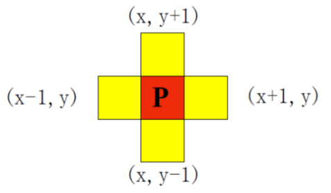
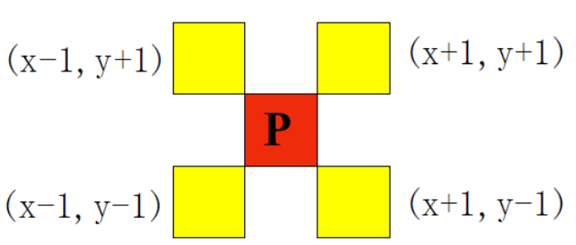
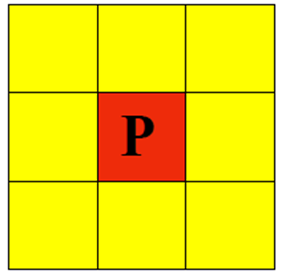
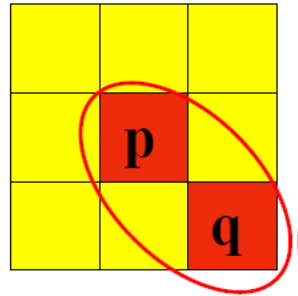
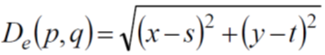

# 第一章 概述

## 数字图像处理及特点

1. 数字图像处理 
   - 概念 ： 又称为 计算机图像处理，它是指将图像信号转换成数字信号并利用计算机对其进行处理的过程，以提高图像的使用性，达到人们所要求的的预期结果。
   - 从处理 的目的来讲 ： 
     - 提高图像的视觉质量，以达到赏心悦目的目的
     - 提取图像中所包含的某些特征或特殊信息，便于计算机分析
     - 对图像数据进行变换，编码和压缩，便于图形的存储和传输

2. 数字图像处理与模拟图像处理 的根本不同在于 ，它不会因图像的存储、传输或复制等一系列变换操作而导致图像质量的退化，所以数字图像处理具有很好的再现性。
3. 数字图像处理的特点：
   - 处理信息量很大，数字图像处理的信息大多是二维信息，
   - 数字图像处理占用的频带较宽
   - 数字图像中各个像素相关性大

## 数字图像处理系统

1. 数字图像处理的优点
   - 精度高
   - 再现性好
   - 通用性、灵活性强
2. 图像处理发展的最大困难之一 
   - 图像数据量大、处理运算量大

## 数字图像处理的主要研究内容

1. 数字图像处理的目的： 
   - 提高图像的视感质量。
   - 对图像数据进行变换
   - 提取图像特征
2. 数字图像处理研究的内容：
   - 图像增强 ： 主要目的是突出图像中人所感兴趣的部分
   - 图像编码 ： 主要是利用图像信号的统计特性和人类诗句的生理学及心理学特性，对图像信号进行高效编码，即数据压缩技术
   - 图像复原 ； 主要尽可能恢复图像本来面貌
   - 图像分割 ： 把图形按其灰度或集合特性分割成若干区域的过程
   - 图像分类 ： 将图像经过某些预处理(压缩，增强、复原)后，再对图形中有用的物理的特征进行分割、特征提取、把不同类别区分开来
   - 图像重建 ： 从数据到图像的处理，即输入的是某种数据，而经过处理后得到的结果是图像

## 数字图像处理的应用和发展

1. 数字图像处理的应用
   - 航天和航空技术方面的应用
   - 生物医学工程方面的应用
   - 通信工程方面的应用
   - 工业和工程方面的应用
   - 军事、公安方面的应用
   - 文化
   - 其他方面

# 第二章 数字图像处理的基础

## 人类的视觉感知系统

1. 基本构造
   - 眼睛由外 向内 被三层 薄膜包围着分别是角膜与巩膜外壳，脉络膜 和视网膜
2. 眼睛中像的形成
   - 眼睛中的光接收器提供了像。光接收器主要包括 锥状体 和杆状体 ，他们位于 视网膜 的中间部分，称为中央凹
3. 视觉过程
   - 视觉是人类的重要功能，视觉过程 是一个非常复杂的过程
   - 当人眼 接收光刺激时，首先 是条件反射，由视网膜神经进行处理，随后图像信号通过视觉通道反应到大脑皮层，大脑皮层相应处理
4. 图像的获取
   - 扫描 ，采样，量化

## 数字图像的基础知识

1. 图像的获取
   - 图像获取设备的组成
     - 采样孔
     - 图像扫描机构
     - 光传感器
     - 量化器
     - 输出存储装置
   - 图像获取设备的性能
     - 像素大小
     - 图像大小
     - 线性度
     - 噪声

2. 采样 和量化

   1. 采样

      - 将空间上连续的图像变换成离散点的操作
      -    一般来说，采样间隔越大，所得图像像素数越少，空间分辨率低，质量差，严重时出现马赛克效应；
      - 采样间隔越小，所得图像像素数越多，空间分辨率高，图像质量好，但数据量大。 

   2. 量化

      - 把像素灰度转换成离散的整数值的过程叫量化
      - 量化等级越多，所得图像层次越丰富，灰度分辨率高，图像质量好，但数据量大；
      - 量化等级越少，图像层次欠丰富，灰度分辨率低，会出现假轮廓现象，图像质量变差，但数据量小。 

      1.  连续灰度量化 化为 灰度级的方法
         1. 等间隔量化
         2. 非等间量化

      -  特点
        - 对缓变的图像，应该细量化、粗采样、以避免假轮廓
        - 对细节丰富的图像，应细采样，粗量化，以避免模糊
        - 对彩色的图像，是按照颜色成分，红，绿，蓝 分别残阳和量化

   3.  像素间的基本关系

      1. ​    设p为位于坐标(x,y)处的一个像素，则p的四个水平和垂直相邻像素的坐标为：(x+1,y),(x-1,y),(x,y+1),(x,y-1)
         上述像素组成p的4邻域，用N4(p)表示，

         

      2. 像素p的四个对角相邻像素的坐标为：
         (x+1,y+1),(x+1,y-1),(x-1,y+1),(x-1,y-1)
         该像素集用ND(p)表示

         

      3. ​       ND(p)和N4(p)合起来称为p的8邻域，用N8(p)表示，如下图2.20所示。

         

   4. 像素间的连通性是一个基本概念，他简化了许多数子图像概念的定义，

      1. 两个像素连通的两个必要条件：

         - 两个像素的位置 是否相邻

         - 两个像素的灰度值是否满足特定的相似性准则(是否相等)

         - 常见的是4 连通 和8 连通

         - 四连通

           

         - 8 连通

           

      2. 像素 的欧式的距离定义如下： 

         ​        像素p(x,y)和q(s,t)间的欧式距离定义如下：

         

         根据这个距离度量，与点(x,y)的距离小于等于某个值d的像素组成以（x,y）为中心、以d为半径的圆。

   5. 数字图像类型

      1. 分为静态图像与动态图像
      2. 静态图像又分为矢量和位图
      3. 矢量图具有以下优点：
         1. 公式化表示图像
         2. 文件数据量很小
         3. 图像质量与分辨率无关。无论将图像放大或缩小了多少次，图像总是以显示设备允许的最大清晰度显示
      4. 矢量图具有以下缺点：
         1. 不宜制作色调丰富或色彩变化太多的图像
         2. 绘出来的图像不是很逼真
         3. 不宜在不同的软件间交换文件
      5. 位图 又可以分成如下四种
         1. 二值图像
         2. 灰度图像
         3. 索引颜色图像
         4. 真彩色图像
   
# 第三章  图像的基本运算

   

## 概述

1. 图像处理
   - 是建立在各种算法基础上的处理方法，在图像处理中经常会用到各种各样的算法。
   - 图像处理 分为点运算，代数运算，逻辑运算，集合运算
   
2. 点运算
   1. 是指对一幅图像中每个像素点的灰度值进行计算，以改善图像显示效果
   
   2. 是 对图像的每个像素点的==灰度值==按一定的映射关系进行运算               
   
   3. 另一个用处就是 变换灰度的单位
   
   4. 分为 线性点运算 和非线性点运算 两类
   
      1. 线性点运算
   
         1. 是 指 输入图像的灰度级且与目标图像的灰度级呈线性关系
   
         2.  
            $$
            s = ar + b
            (r为 输入点的灰度值，s为相应输出点的灰度值)
            $$
   
            1.  当a >1 输出图像对比度大
            2.  当a<1 输出图像对比度降低
            3.  当a<0 暗区变亮，亮区变暗，完成了图像求补
   
      2.  非线性点运算
   
          1.  输出灰度级 与输入灰度级呈非线性关系，，常见的是对数变换和幂次变换
   
3. 代数运算

   1. 是指 两幅或 多幅输入图像之间进行点对点的加减乘除 运算得到输出图像的过程。
   2. 加法运算
      1. 通常用于平均值 降噪 等多种场合
   3. 减法运算
      1. 将同一景物在不同时间拍摄的图像或同一景物在不同波段的图像相减，也可以叫 差影法
   4. 乘法运算
      1. 可用来改变图像的灰度级，实际灰度级变换
      2. 也用来遮挡图像的某些部分
   5. 除法运算
      1. 可以改变图像的灰度级
      2. 除法运算 的典型应用是 比值 图像处理

4. 逻辑运算

   1. 是指 两幅或多幅输入图像之间进行点对点的与或非 逻辑运算得到输出图像的方法
   2. 运行这种方法可以为图像提供模板
   3. 主要针对二值图像进行处理
   
5. 几何运算

   1. 它是图像处理和图像分析的重要内容之一
   2. 通过改变像素位置进行的图像形状的改变 为几何变换
   3. 几何变换可以分为 图像 的位置变换 、形状变换及图像的复合变换等
   4. 图像的缩放
      1. 两种插值处理方法
         1. 直接复制为和它最相近的像素灰度值，叫做最近邻插值法
         2. 通过其他数学插值算法来计算相应像素点的灰度值，处理效果好
   5. 灰度重采样
      1. 最近邻法
      2. 双线性内插法

# 第四章 图像变换

图像变换 ： 为达到某种目的将原始图像变换映射到另一个空间上，使得图像的某些特征得以突出，以便于后面的处理和识别。

应用 ： 图像增强，图像复原，图像编码，图像压缩，特征提取。

## 4.1 连续傅里叶变换

1.  用傅里叶变换表示的函数特征完全可以通过傅里叶反变换来重建，而不会丢失任何信息。

# 4.2 离散傅里叶变换

1. 要在数字图像树立中应用傅里叶变换，需要解决两个问题
   1. 傅里叶变换的fx 为连续信号，而计算机处理的是数字信号
   2. 数学上采用无穷大概念，而计算机只能进行有限次计算
2. 空间频率
   1. 空间频率是指在一定方向上的单位空间波动的周期数。它不仅具有大小而且具有方向，是一个矢量
   2. 一幅图像有明暗和色彩的差别，是一种光的强度和颜色按空间的分布。可以用空间频率来表示

# 4.3 快速傅里叶变换

快速傅里叶变换FFT 并不是一种新的变换，它是离散傅里叶的DFT的一种算法

1. 傅里叶变换的性质
   1. 可分离性
      1. 一个二维傅里叶变换
   2. 平移性
   3. 移中性
      1.  图像作傅里叶变换，若采用上述公式变换，则变换后主要能量集中在频率平面的中心
      2. 反变换图像
   4. 周期
      1. 傅里叶变换和反变换均以为周期
   5. 旋转性质
   6. 卷积
      1. 卷积定理表明两个二维连续函数在空间域中的卷积可用求其相应的两个傅里叶变换乘积的逆变换

## 离散余弦变换

是可分离的变换，其变换核为余弦函数。

