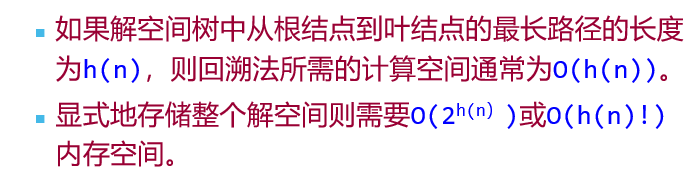
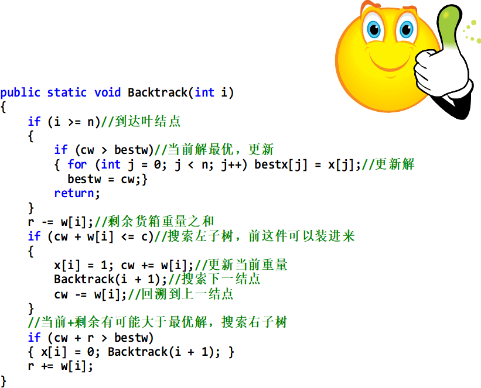

[TOC]

# 第一章： 基础知识

## 一、算法的定义

- 算法就是解决问题的方法
- 算法是解决某一特定问题的一组有穷指令的序列
- 算法是完成一个任务所需要的具体步骤和方法。（也就是说给定初始状态或输入数据，经过有限次运算，能够得出所要求或期望的终止状态或输出数据）

1. 算法的特征：

   1. 有限性
   2. 确定性
   3. 输入
   4. 输出
   5. 可行性

2. 算法的描述方法

   - 自然语言：任何一种你熟悉的文字，只要把你的意思表达出来 
   - 程序语言：严格定义的编程语言
   - 伪代码：自然语言和程序语言的混合体

3. 常见的时间复杂度

   ```txt
   O(1) ：几乎不存在
   
   O(logn)：不能考虑全部输入
   
   O(n)：遍历、扫描全部输入
   
   O(nlogn)：许多分治算法
   
   O(n2 )：两层循环
   
   O(n3) ：三层循环
   
   O(2n ) ：一个集合的所有子集
   
   O(n!) ：一个集合中的元素的所有组合
   
   ```


# 第二章 ： 递归与分治策略

## 一、 递归算法

1. 定义
   - 若一个对象部分地包含它自己, 或用它自己给自己定义, 则称这个对象是递归的；若一个过程直接地或间接地调用自己, 则称这个过程是递归的过程。

### 算法实现例子

1. 汉诺塔递归算法实现

   ```c
   void Hanoi(int n,char a ,char b, char c){
       if(n == 1){
           prinf("\t将第%d个盘片从%c移动到%c\n",n,a,c)
       }else{
           Hanoi(n-1,a,c,b) //将n-1个圆盘 从  f 借助 t 移动到 a
           move(a,b);//表示将a上的编号为n的圆盘移动到b上
           Hanoi(n-1,c,b,a)
       }
   }
   ```

   时间复杂度 为2^n

### 递归算法的特点

1. 问题求解规模缩小，把问题转化为规模缩小了的同类问题的子问题。
2. 相邻两次重复之间有紧密的联系，
3. 是否收敛，终止条件

## 二、分治法

1. 基本思想 ：
   - 对于一个规模为n的问题，若该问题可以容易地解决(比如说规模n较小)，则直接解决，
   - 否则将其分解为k个规模较小的子问题，
   - ==这些子问题互相独立且与原问题形式相同==，递归地解这些子问题，
   -  然后将各子问题的解合并，得到原问题的解。这种算法设计策略叫做分治法

```c++
divide-and-conquer(p){
    if(|P| <= n0) adhoc(p);
    divide P into smaller subinstances P1 ,P2 ....;
    for(i = 1 ; i<= k ;i++){
        yi divide-and-conquer{pi};
    }
    return merge*(y1...)
}
```

### 二分搜索法

1. 是使用**分治策略**的典型例子
2. 基本思想
   - 将n个元素分成个数大致相同的两半，取 a[n/2] 与x比较。 
   - 通过判断是 前半截还是后半截 然后再进行前面一不的操作。直到找出答案，

```c++
template<Class Type>
int  BinarySearch(Type a[] , const Type& x, int n){
	int left = 0; int right = n-1;
	while(left < right){
		int middle = (left + right ) /2;
		if(x == a[middle]) return middle;
		if(x > a[middle]) left = middle + 1;
		else ritht = middle -1;
	}
	return -1  ;//no found
}
```

### 合并排序  

1. 是使用分治策略实现
2. 基本思想：
   - 将待排序元素分成大小大致相同的两个子集合，分别对两个子集合进行排序，最终将排好序的子集合合并成所要求的的排好序的集合

```c++
template <class Type>
void MergeSort(Type a[], int left , int right){
	if(left < right){
		int i = (left + right) /2;
		MergeSort(a,left ,i);
		MergeSort(a,i+1,right);
		Merge(a,b,left,i,right);
		Copy(a,b,left,right)
	}
}
```

3. 消除递归的做法

```c++
template<Class Type>
void mergeSort(Type a[], int n){
	Type* b = new Type [n];
	int s = 1;
	while(s < n){
		MergePass(a,b,s,n);//合并到数组b
		s += s;
		MergePass(b,a,s,n);//合并到数组a
		s += b;
	}
}
```

### 快速排序

1. 也是基于分治策略的
2. 基本思想 是 ： 对于输入的子数组a[P:r] 按以下三个步骤排序。
   - 分解： 划分三段 ： a[p:q-1],a[q],a[q:r]   前一个数组的值不大于a[q]，后面的数组的值要都大于a[q]
   - 递归求解：通过递归调用，快速排序 算法 分别对两个数组排序，
   - 合并 ： 排序就是就地进行的，所以排好序后，不需要执行其他

```c++
void QuickSort(Type a[],int p, int r){
	if(p<r){
        int q= Partition(a,p,r);
        QuickSort(a,p,q-1);//对左半段排序
        QuickSort(a,q+1,r);//对右半段排序
    }
}

//划分算法
int Partition(Type a[],int p,int r){
    int i=p,j = r+1;
    Type x = a[p];
    //将 大于或小于x 的值 交换不同区域
    while(true){
        while(a[++i] < x && i < r);
        while(a[--i] > x);
        if(i >= j)break;
        Swap(a[i],a[j]);
    }
    a[p] = a[j];
    a[j] = x;
    return j;
}
```

快速排序的运行时间与划分是否对称有关，其最坏的情况发生在划分过程产生的两个区域分别包含n-1个元素和1个元素的时候 ，Partition的计算时间为O(n) ，，，T(n)=O(n^2)，时间为T（n） = O(Nlogn)

- 快速排序算法在平均情况下的时间复杂性也是O(nlogn)，这是快速的了，
- 快速排序的==性能==取决于**划分的对称性**

# 第三章：动态规划

## 一、基本思想

1. 基本思想 : 也是 将 待求解的问分解成若干个子问题，先求子问题，然后从这些子问题的解得到原问题的答案。
2. ==与分治法不同的是== ：适合用于动态规划求解的问题，经分解的得到的子问题往往不是==互相独立的==
3. 动态规划算法适用于解最优化的问题： 
   - 找出最优解的性质，并刻画其结构特征
   - 递归地定义最优值
   - 以==自底向上==的方式计算出最优值
4. 动态规划算法的基本要素：
   - 最优子结构性质
   - 重叠子问题性质
5. 动态规划通常用来求最优解，能用动态规划解决的求最优解问题，必须满足，==最优解的每个局部解也都是最优的==


## 二、 算法实现例子

### 1. 0/1背包问题

```c++
int knapSack(int n ,int w[] , int v[]){
    for(int i= 0; i<= n; i++){
        V[i][0] = 0;
    }
    for(j = 0; j<= C; j++){
        V[0][j] = 0;
    }
    for (i=1; i<=n; i++)   //计算第i行，进行第i次迭代
           for (j=1; j<=C; j++)
                  if (j<w[i])   V[i][j]=V[i-1][j];         
                  else   V[i][j]=max(V[i-1][j], V[i-1][j-w[i]]+v[i]);

     j=C;    //求装入背包的物品
     for (i=n; i>0; i--){
         if (V[i][j]>V[i-1][j]) {
              x[i]=1;
              j=j-w[i];
         }
         else x[i]=0;
     }
     return V[n][C];    //返回背包取得的最大价值

}
```

动态规划

```c++
void int knapSack(Type v , int w, int c, int n,Type **m){
	int jMax = min(w[n] - 1 ,c);
    for(int j = 0; j<= jMax; j++) m[n][j] = 0;
    for(int j = w[n];j <= c ;j++)m[n][j] = v[n];
    for(int i = n-1;i> 1; i--){
        jMax = min(w[i] -1,c);
        for(int j = 0; j<= jMax; j++)m[i][j] = m[i+1][j];
        for(int j = w[i]; j <= c;j++) m[i][j] = max(m[i+1][j],m[i+1][j-w[i]] + v[i]);
    }
    m[1][c] = m[2][c];
    if(c >= w[1]) m[1][c] = max(m[1][c],m[2][c--w[1]] + v[1]);
}
template<class Type>
void Traceback(Type **m,int w,int c,int n,int x){
	for(int i = 1; i< n; i++){
		if(m[i][c] == m[i+1][c]) x[i] = 0;
		else{x[i] =1; c-= w[i];}
	}
	x[n] = (m[n][c])?1:0;
}
```


### 2. 最长公共子序列问题

```c++
算法——最长公共子序列问题
   int CommonOrder(int m, int n, int x[ ], int y[ ], int z[ ])
   {
      for (j=0; j<=n; j++)   //初始化第0行
         L[0][j]=0;
      for (i=0; j<=m; i++)   //初始化第0列
         L[i][0]=0;
      for (i=1; i<=m; i++)
         for (j=1; j<=n; j++)
            if (x[i]= =y[j]) { L[i][j]=L[i-1][j-1]+1; S[i][j]=1; }
           else if (L[i][j-1]>=L[i-1][j]) { L[i][j]=L[i][j-1]; S[i][j]=2; }
                  else {L[i][j]=L[i-1][j]; S[i][j]=3; }
      i=m; j=n; k=L[m][n];
      for (i>0 && j>0)
     {
         if (S[i][j]= =1) { z[k]=x[i]; k--; i--; j--; }
        else if (S[i][j]= =2) j--;
               else i--;
     }
     return L[m][n];
  }

```

### 3. 最优二叉查找树

```c++
算法——最优二叉查找树
   double OptimalBST(int n, double p[ ], double C[ ][ ], int R[ ][ ] )
   {
       for (i=1; i<=n; i++)  //按式1和式2初始化
       {
          C[i][i-1]=0;
          C[i][i]=p[i];
          R[i][i]=i;
        }
       C[n+1][n]=0;
for (d=1; d<n; d++)     //按对角线逐条计算
    for (i=1; i<=n-d; i++)
    {
        j=i+d;
        min=∞; mink=i; sum=0;
        for (k=i; k<=j; k++)
       {
           sum=sum+p[k];
           if (C[i][k-1]+C[k+1][j]<min) {
              min=C[i][k-1]+C[k+1][j];
              mink=k;
           }
        }
        C[i][j]=min+sum;
        R[i][j]=mink;
     }
     return C[1][n];
}
时间复杂度O(n3)
```

### 4.矩阵连乘问题

```c++
void matrixMultiply(int **a,int  **b, int **c , int ra, int ca, int rb, int cb){
    if(ca != cb) error("矩阵不可乘");
    for(int i = 0; i < ra; i++){
        for( int j = 0; j< cb ; j++){
            int sum = a[i][0] * b[0][j];
            for(int k = 1; k < ca;k++){
                sum += a[i][k] * b[k][j];
            }
            c[i][j] = sum;
        }
    }
}
ra,ca 和 rb ，cb 分别表示矩阵A 和B的函数和列数

pqr 次循环，没有最优化
```

```c++
void matrixMultiply(int **p,int  **n, int **m. int **s){
    for(int i = 1 ; i<= n ;i++) m[i][i] = 0;
    for(int r= 2; r <= n ;r++){
        for(int i =1; i<= n-r+1;i++){
            int j = i+r -1;
            m[i][j] = m[i+1][j] + p[i-1]*p[i] * p[j];
            s[i][j] = i;
            for(int k = i+1; k<j;k++){
                int t = m[i][k] + m[k+1][j] + p[i-1] * p[k] * p[j];
                if(t < m[i][j]){
                    m[i][j] = t;
                    s[i][j] = k;
                }
            }
        }
    }
}
```

# 第四章： 贪心算法

### 1. 贪心算法的概念

1. 采用逐步构造最优解的方法向给定的目标前进。

2. 就是总是做出在当前看来最好的选择。也就是说贪心算法并不从整体最优考虑，他所做出的选择只是在某种意义上的==局部最优解==
3. 贪心算法不能对所有问题都得到整体最优解，但对一些问题可以得到整体的最优解

### 2. 贪心算法的设计要素

1. 最优子结构
2. 贪心选择性质
   - 贪心算法通常以==自顶向下==的方式进行，以迭代的方式作出相继的贪心选择，每作一次贪心选择就将所求问题简化为规模更小的子问题。

### 3. 应用范例

1. 活动安排问题
2. 单源最短路径
3. 最优装载问题
4. 最小生成树
5. 哈夫曼编码
6. 多级调度

### 4. 谈心算法和动态规划算法的差异

1. ==两个算法都要求== **最优子结构性质**
2. 贪心算法适用于 背包问题
   - 步骤是 ： 首先计算每种物品单位重量的价值；然后依据贪心选择策略，将尽可能多的单位重量价值最高的物品装入背包，如果没有装满，那么依次装入价值排序的物品，直到装满
3. 动态规划 适用于 0-1背包问题（就是物品只能存在放与不放的问题)
   - 物品只存在 放与不放的问题，通过不同物品的组合，，得到最大的价值

### 5. 应用案例

1. 背包问题

   ```c++
   
   void Knapsack(int n,float M,float v[], float w[],float x[]){
       Sort(n,v,w);
       int i;
       for(i = 1; i<= n; i++) x[i] = 0;
       float c= M;
       for(i = 1; i <= n ;i++){
           if(w[i] > c) break;
           x[i] = 1;
           c -= w[i];
       }
       if(i <= n) x[i] = c/w[i];
   }
   ```

   

2. 旅行商问题

   ```c++
   CostType Tray_Greedy(int n,CostType **w,int *path)
   {for(i=1;i<=n;i++) arrived[i]=false; cost=0; //初始化
     path[1]=1; p=1;arrived[1]=true; //从节点1出发
     for(i=2;i<=n;i++)
      {min=inf;
        for(j=1;j<=n;j++)
          if (!arrived[j] && w[p][j]<min)
            {k=j;
              min=w[p][j]}    //搜索最临近p且尚未到达过的节点k
        cost=cost+w[p][k]; path[i]=k; arrived[k]=true; p=k;  
       //将节点k加入到路径中
      }
     cost=cost+w[p][1]; return cost; //加上回路最后一条边的权
    }
   
   ```

   

3. Dijkstra 算法

   ```c++
   /*
   Dijkstra 算法的做法是：
   由近到远逐步计算，每次最近的顶点的距离就是它的最短路径长度。
   然后再从这个最近者出发。即依据最近者修订到各顶点的距离，然后再选出新的最近者。
   如此走下去，直到所有顶点都走到。
   */
   Procedure Dijkstra {
   (1) S:={1}; //初始化S
   (2) for i:= 2  to n do //初始化dis[]
   (3) dis[i] =C[1, i] ; //初始时为源到顶点i一步的距离
   (4) for i :=1  to  n do {
   (5)    从V-S中选取一个顶点u使得dis[u]最小；
   (6)    将u加入到S中；//将新的最近者加入S
   (7)    for w∈V-S do  //依据最近者u修订dis[w]
   (8)    dis[w] := min(dis[w] , dis[u]+C[u ,w])  
           }
       }
   因此Dijkstra算法的时间复杂度为 O(n2)。
   
   ```

   

4. 哈夫曼算法

   ```c++
    template<class T>
    BinaryTree<int>HuffmanTree(T f[], int n)
    {//根据权f[1:n]构造霍夫曼树
       //创建一个单节点树的数组
     Huffman <T>*W=newHuffman<T> [n+1]；
       BinaryTree<int> z,zero；
       for(int i=1；i<=n；i++){
           z.MakeTree(i, zero, zero)；
           W[i].weight=f[i]；
           W[i].tree=z: }
      //数组变成—个最小堆
       MinHeap<Huffman<T>>Q(1)；
       Q.Initialize(w,n,n)；
       //将堆中的树不断合并
       Huffman<T> x, y
       for(i=1;i<n;i++){
          Q.DeleteMin(x)；
          Q.DeleteMin(y)；
          z.MakeTree(0, x.tree, y.tree)；
          x.weight+=y.weight；x.tree=z；
          Q.Insert(x)； }
    Q. DeleteMin(x)；//最后的树
    Q. Deactivate()；
    delete[] w；
    return x.tree；
   
   ```

   

利用哈夫曼树可以构造一种不等长的二进制编码，并且构造所得的哈夫曼编码是一种最优前缀编码，即使所传电文的总长度最短。

```txt

HuffmanTree初始化优先队列Q需要O(n)                                       

DeleteMin和Insert需O(logn). n-1次的合并总共需要O(nlogn)    

所以n个字符的哈夫曼算法的计算时间为O(nlogn)

```

# 第五章 ： 回溯法

## 1.  概念

1. 回溯法   就是一种组织的井井有条的，能==避免不必要搜索的穷局势搜索法==
2. 在问题的解空间树树中，按照==深度优先==策略，从根节点出发搜索解空间树
3. 算法搜索至解空间树的任意一点时，先判断该结点是否包含问题的解
   - 如果肯定不包含，则跳过对该结点为根的子树的搜索，逐层向其祖先结点回溯；
   - 否则，进入该子树，继续按深度优先策略搜索。


## 2.常用剪枝函数

1. ==约束函数== ： 在扩展结点出剪去不满足约束的子树
2. ==限界函数== ：剪去得不到最优解的子树



### ==重要提醒==

1. 在回溯法中，经常用到的两个典型的解空间树 ：
   - ==子集树== ：当所给的问题是从n个元素的集合S中找出满足某种性质的子集时，相应的解空间树称为子集树
   - ==排列树== ：当所个的问题是确定n个元素满足某种性质的排列时，相应的解空间树为排列树，。排列数通常有n！个叶结点


## 3. 递归回溯

回溯法对解空间作深度优先搜索，因此，在一般情况下用递归方法实现回溯法，t表示搜索深度

```c++
void backtrack (int t)
{
if (t>n) //t〉n表示算法已搜索到叶节点
   output(x); //记录或输出得到的可行解x
else
for (int i=f(n,t);i<=g(n,t);i++) 
         {//其中f(n,t),g(n,t)分别表示在当前扩展结点处未搜索过    的子树的起始编号和终止编号。
x[t]=h(i); //h(i)表示在当前扩展节点处x[t]的第i个可选值
if (constraint(t)&&bound(t))    	backtrack(t+1);
}
}

```

```txt
	if (Constraint(t)&&Bound(t) )  Backtrack(t + 1)；
	if语句含义：Constraint(t)和Bound(t)表示当前扩展节点处的约束函数和限界函数。
	Constraint(t): 返回值为true时，在当前扩展节点处x[1:t]的取值满足问题的约束条件，否则不满足问题的约束条件，可剪去相应的子树
	Bound(t): 返回的值为true时，在当前扩展节点处x[1：t]的取值为目标函数不越界，还需由Backtrack(t+1)对其相应的子树做进一步搜索。否则，当前扩展节点处x[1：t]的取值是目标函数越界，可剪去相应的子树
	for循环作用：搜索遍当前扩展的所有未搜索过的子树。
	递归出口：Backtrack(t)执行完毕，返回t-1层继续执行，对还没有测试过的x[t-1]的值继续搜索。当t=1时，若以测试完x[1]的所有可选值，外层调用就全部结束。
	

```

## 4. 迭代回溯(非递归)

```c++
void iterativeBacktrack  ()
{
  int t=1;
  while(t>0){
    if (f(n,t)<=g(n,t))  
       for(int  i=f(n,t);i<=g(n,t);i++){
          x[t]=h(i);
          if(constraint(t) && bound(t)){
             if(solution(t)) output(x);//输出最优解
             else t++;//搜索下一层节点
           }
        }
    else  t--;//回溯到上一节点
  }
}

```

## 5. 应用案例

1. 0-1背包（递归）

   ```c++
   procedure work(k,wei:integer);
       var i,j:integer;
       for i:=1 downto 0 do
           if  (wei-w[k]*i>=0) 
             {
              bag[k]:=i;
              count:=count+v[k]*i;
              if (k=n) and (count>best)
                {best:=count;
                 for j:=1 to n do y[j]:=bag[j];
                }
              if k<n then work(k+1,wei-w[k]*i);
              count:=count-c[k]*i;    {状态恢复}
              }
        
   
   ```

   

2. N皇后问题

   - 要素一 ： 解空间 ： 用完全n叉树表示解空间，
   - 要素二：约束条件
   - 要素三：状态树

   ```c++
   Function Place(k:integer):boolean;
      place:=true;
       for  j←1 to k-1 do
           if |k-j|=|x[j]-x[k]| or x[j]=x[k] then
                  place:= false
   判断约束函数
   ```

```c++
Nqueens()
{
     x[1] ← 0
     k ← 1
     while k>0 do
        {
            x[k] ← x[k] +1
            while x[k]<=n and (not place(k)) do
                      x[k] ← x[k] +1
             if  x[k]<=n then
                         if k=n  then  sum ← sum+1
                         else   {
                                      k ← k+1
                                      x[k] ← 0
                                   }
                else k ← k-1
        }
  }
      
非递归的写法


procedure try(k:byte);
　var i:byte;
　begin
　　for i:=1 to n do		{每层均有n种放法}
　　　if place(k) then 		{寻找放置皇后的位置}
　　　　begin　			
　　　　　x[k]:=i; 		{放置皇后)
　　　　　if k=n then print 	{n个皇后都放置好,输出}
				{若只想找一组解，halt}
　　　　　else try(k+1);	{继续递归放置下一个皇后}
　　　　end;
　end;
递归写法
```

4. 装载问题的回溯算法

   1. 上界函数 ： 用于剪去不含最优解的子树

   ```c++
   template < class Type >
   Type Maxloading(type w[], type c,int n)
      loading <Type> X；
       //初始化X
       X. w=w;  //集装箱重量数组
       X. c=c;   //第一艘船载重量
       X. n=n；//集装箱数
       X. bestw=0; //当前最优载重
       X. cw=0;//当前载重量
       X. r=0; //剩余集装箱重量 
       for (int i=1; i<=n; i++)
           X. r +=w[i]
     //计算最优载重量
       X.Backtrack(1)；
       return X.bestw； }
   算法复杂性:  O(2n)
   
   ```

   

5. 图的着色问题

   ```c++
   void Color::Backtrack(int t)
   { if (t>n) {
     sum++;
     for (int i=1; i<=n; i++) cout << x[i] << ' ';
     cout << endl;
     }
     else
       for (int i=1;i<=m;i++) {
         x[t]=i;
         if (Ok(t)) Backtrack(t+1);
       }
   }
   bool Color::Ok(int k) // 检查颜色可用性
   { for (int j=1;j<=n;j++)
       if ((a[k][j]==1)&&(x[j]==x[k])) return false;
     return true;
   }
   
   ```

   

# 第六章：分支限界法

## 1. 基本思想

1. 分支限界法的求解目标则是 ： 找出满足约束条件的一个解，或是在满足约束条件下的解中找出使某一目标函数值达到极大或极小的解，即在某种意义上的最优解
2. ==与回溯法不同的是== ： 回溯法是找出解空间中满足约束条件的**所有解**

3. 分支限界法 ： 以==广度优先==或==以最小耗费优先==的方式搜索问题的解空间树。
4. 采用的两种方式： ==队列式FIFO分支限界法== ， 和 ==优先队列式分支限界法==

## 2. 解题步骤

1. 定义问题的解空间
2. 确定问题的解空间组织结构（树或图）
3. 搜索解空间。搜索前要定义判断标准（约束函数或限界函数），如果选用优先队列式分支限界法，则必须确定优先级。