第二章作业： 6,8,9

第三章作业：7（1,3） 。。 9（1） 。。12

第四章：1,2，，3（1,2），，，4

第五章

第六章：1,2，,5

第七章：1,3,4,5,6,7

# 第一章作业

## 1. 简述翻译程序和编译程序的基本概念

 - 翻译程序 是指这样的一个程序，它能够把某一种语言程序(称为源语言程序)转换为另一种程序(称为目标程序),而后者与前者在逻辑上是等价的。
 - 编译程序 是如果源语言是 JAVA这样的高级语言，而目标语言是诸如汇编语言或机器语言之类的低级语言，这样的翻译程序就是编译程序。

## 2. 编译过程分为几个阶段？每个阶段的主要任务是什么？

 - ① 词法分析  - 识别单词
 - ② 语法分析 - 分析句子语法结构
 - ③ 语义分析与中间代码产生  - 根据句子含义初步翻译
 - ④ 优化 - 修饰译文产生更为高效的目标代码
 - ⑤ 目标代码生成 - 写出最后译文

## 3. 计算机执行高级语言的方式主要有那两种？本质区别是什么？

 - 解释方式 ： 直接对源程序进行解释执行，并得到结果，特点是计算机不实现对高级语言进行全盘翻译为机器代码，而是边翻译边执行
 - 编译方式 ： 事先对源程序 先全部编译，然后统一执行，即先翻译后执行，


# 第二章作业

## 6. 题目

```txt
令文法G6 为
N -> D |ND
D -> ) |1|2|3|4|5|6|7|8|9
① G6 的语言L(G6)是什么
② 给出橘子0127、34和568 的最左推导和最右推导
```

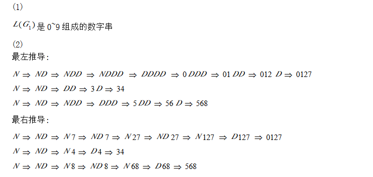


## 8. 题目：

```txt
 E -> T | E + T | E - T
 T -> F | T * F | T / F
 F ->(E) | i
 (1) 给出 i+ i * i、i * (i + i) 的最左推导和最右推导
 (2) 给出 i + i + i、  i+ i * i 和 i - i - i 的语法树
 
```


解 ： 

- 最左推导：任何一步α => β都是对阿尔法中的最左非终结符进行替换
- 何一步α => β都是对阿尔法中的[最右](https://www.baidu.com/s?wd=%E6%9C%80%E5%8F%B3&tn=24004469_oem_dg&rsv_dl=gh_pl_sl_csd)非终结符进行替换

```txt

最左推导：
从文法的起始符号开始：
E -> E + T
-> F + T
-> i + T
-> i + T * F
-> i + F * F
-> i + i * F
-> i + i * i
最右推导：
从文法的开始符号开始：
E -> E + T
-> E + T * F
-> E + T * i
-> E + F * i
-> E + i * i
-> T + i * i
-> F + i * i
-> i + i * i

```

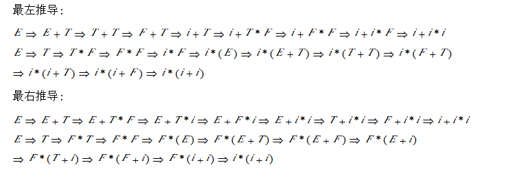

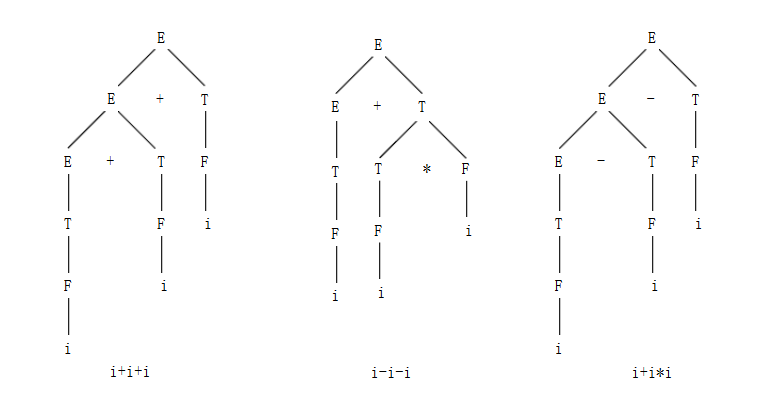

## 9. 题目

```txt
证明下面的文法是二义的：
S -> iSeS|iS|i

```

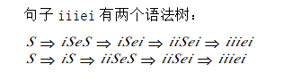

# 第三章作业

## 第七题——构造下列正规式相应的DFA

 1.  1(0|1)*101

     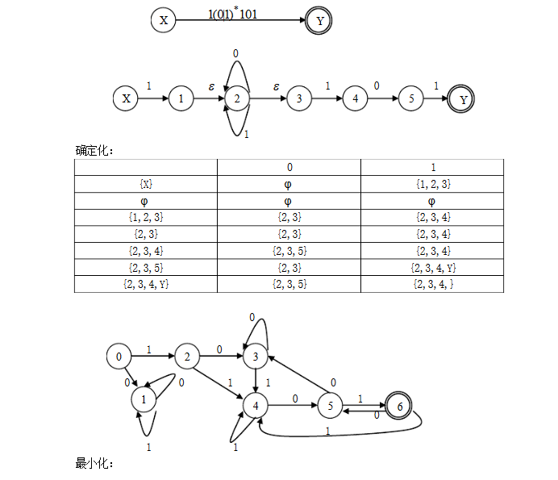

     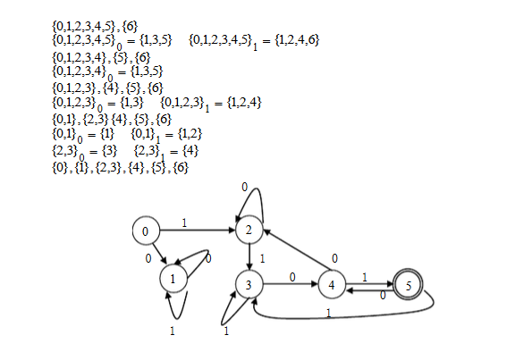

     

 2.  0 \* 10 \* 10 \* 10 \*

     

## 第9题

正规表达式 (0|1)\* 010 (0|1)\*  NFA  -> DFA


### 第12题

1. 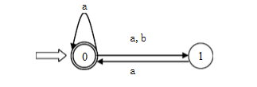

解

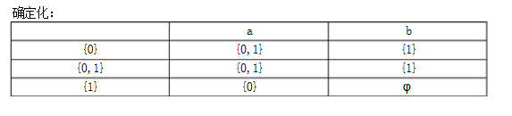

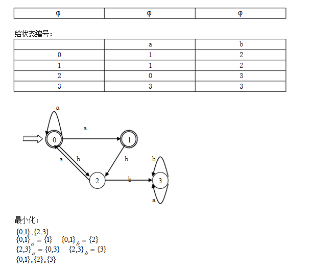

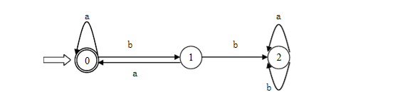

2.  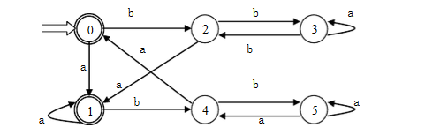

   解；

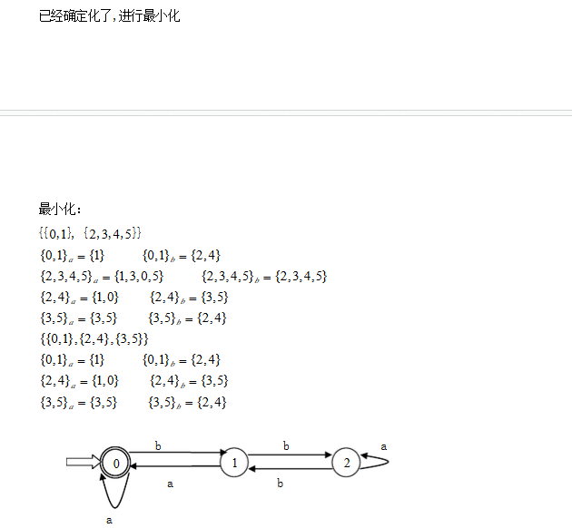

# 第四章作业

## 第一题

1. 

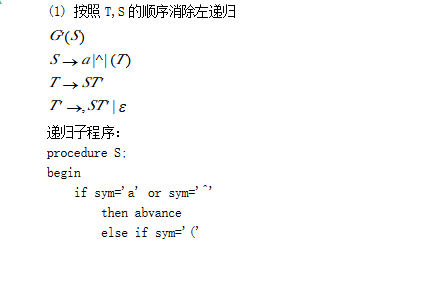

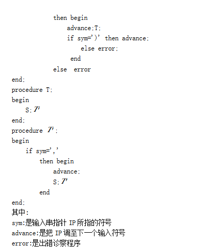

2.

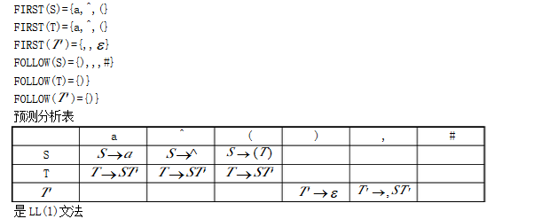

## 第二题

题目：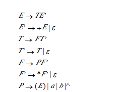

(1). 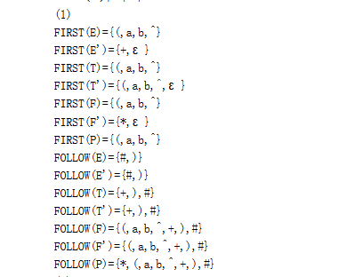

(2). 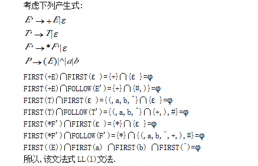

(3). 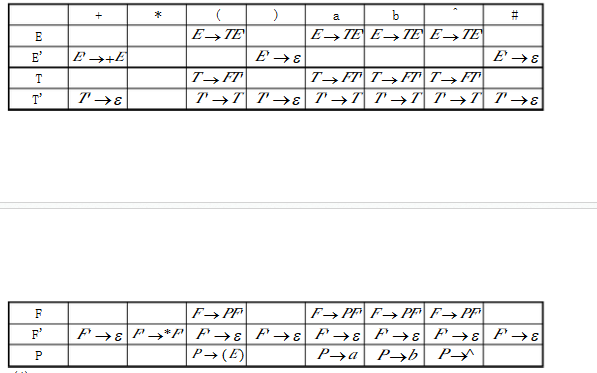

(4). 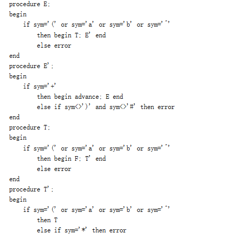

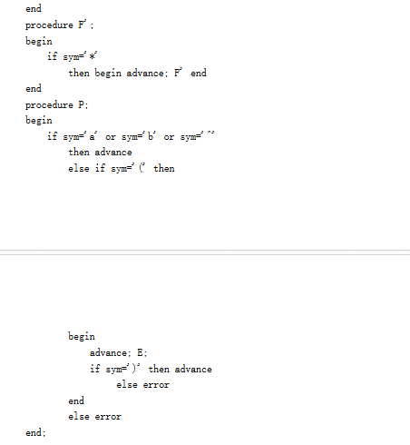

## 第三题

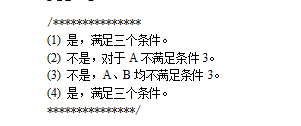

## 第四题

题目：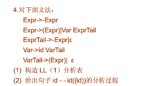

1、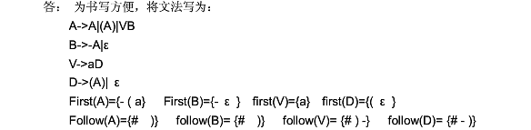

​	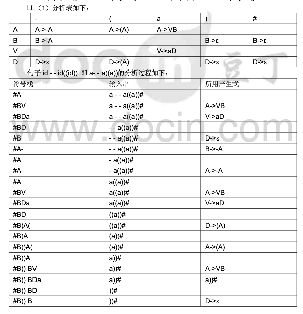

​	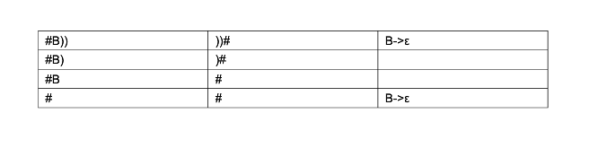

2、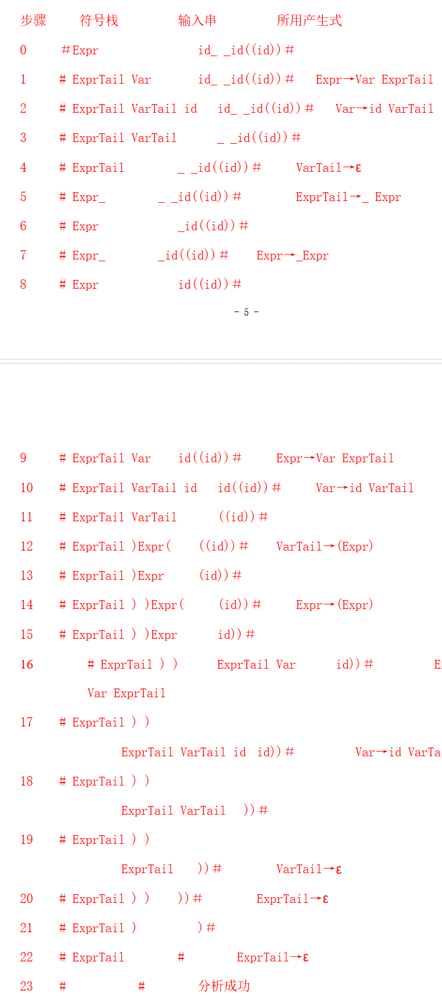

# 第六章习题

## 1. 第一题

   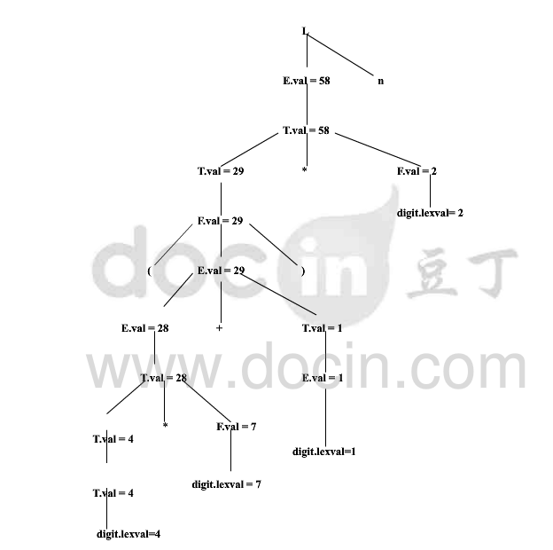

## 2. 第二题

   ### 1. 抽象语法树

  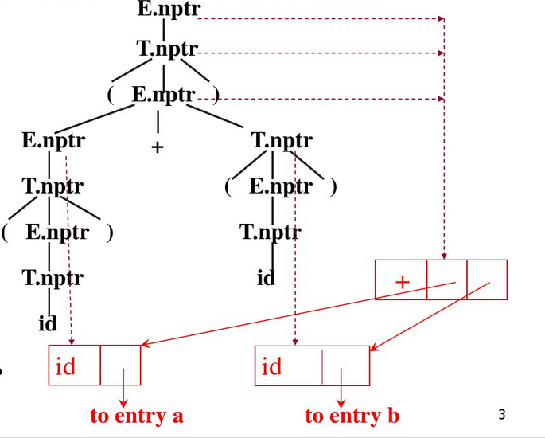

  其他版本

  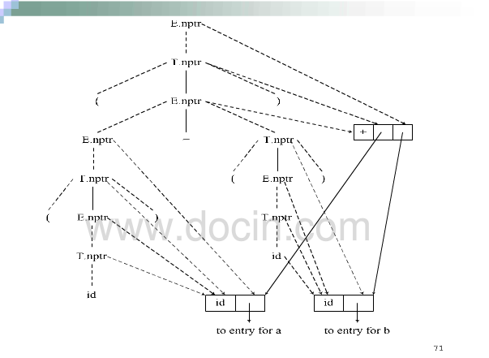

### 2. 抽象语法树

  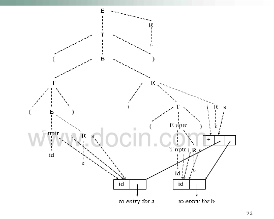

## 3. 第五题

###  1. 属相文法

  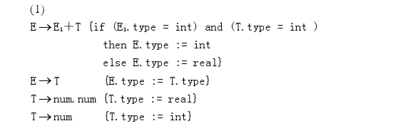


###  2. 类型

  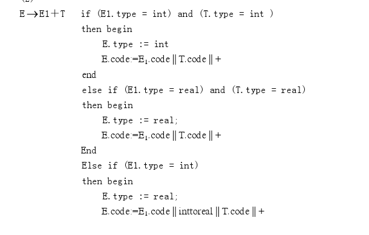

  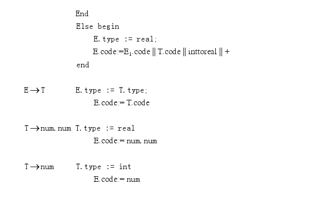

# 第七章习题

## 1

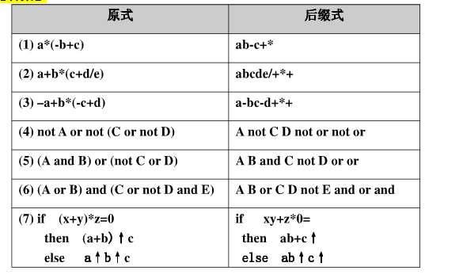

## 3.

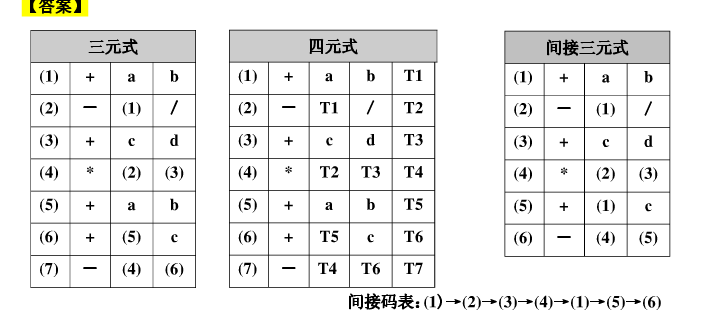

## 4.

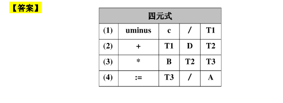

## 5.


## 6.

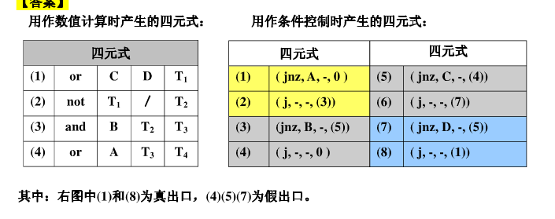

## 7.

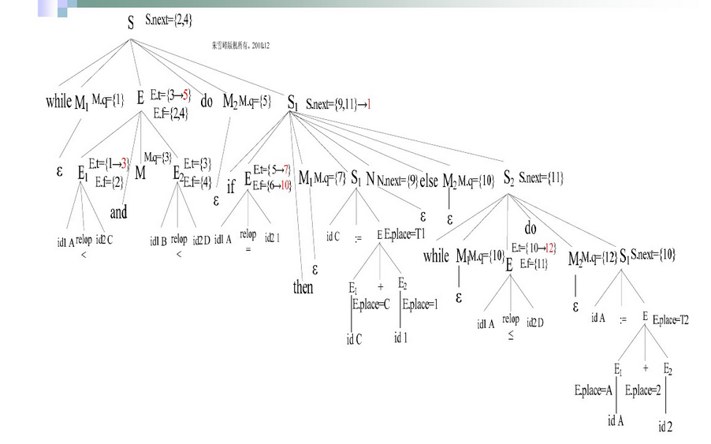

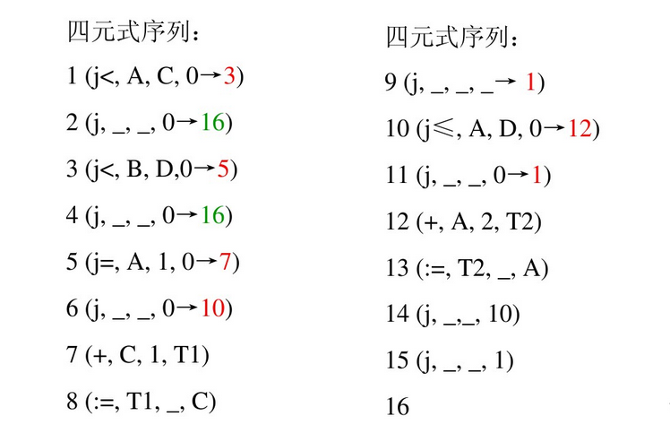


