# 编译原理

```txt

第1章  引论

第2章  高级语言及其语法描述

第3章  词法分析

第4章  语法分析——自上而下分析

第5章  语法分析——自下而上分析

第6章  属性文法和语法制导翻译

第7章  语义分析和中间代码产生


```

## 第一讲： 绪论

### 1.1 什么是编译

> 编译 ： 将高级语言翻译成汇编语言或机器语言的过程


### 1.2 编译系统的结构

1. 翻译句子的顺序，即 编译 顺序

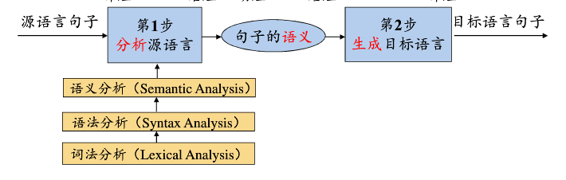


2.  编译器的结构

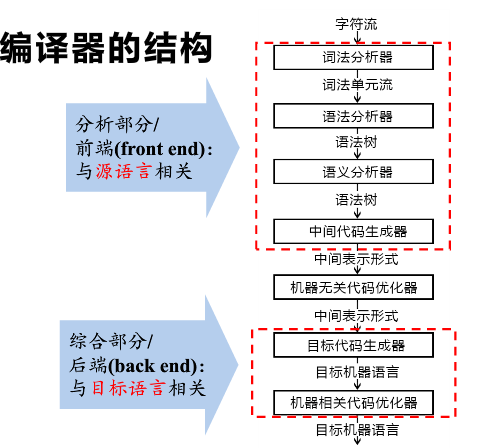

### 1.3 词法分析概述

> 词法分析的主要任务： 
>
> ​			从左到右逐行扫描源程序的字符，识别出各个单词，确定单词的类型。
>
> ​			将识别出的单词转换成统一的==机内表示==-------词法单元（token） 形式

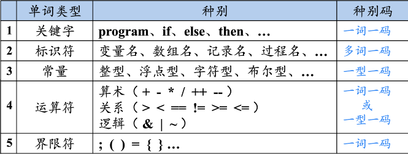


### 1.4 语法分析概述

> 从词法分析器 输出的token 序列中 识别出 各类短语 ，并构造语法分析树
>
> 描述 了句子的语法结构

例1 ： 赋值语句的分析树

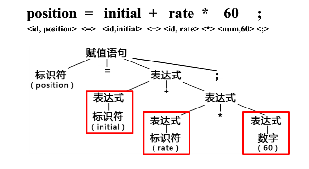

例2 : 变量声明语句的分析树

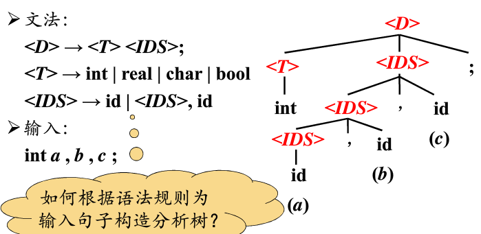


### 1.5 语义分析概述

主要任务

1. 收集标识符的属性信息
   1. 种属kind
   2. 类型type
   3. 存储位置、长度
   4. 值
   5. 作用域
   6. 参数和返回值信息(字符串表 数据结构)
2. 语义检查
   1. 变量或过程未经声明就使用
   2. 变量或过程名重复声明
   3. 运算分量类型不匹配
   4. 操作符与操作数之间的类型不匹配
      1. 数据下标不是整数
      2. 等等

### 1.6 中间代码生成及编译器后端

常用的中间表示形式：

1. 三地址码


2. 语法结构树


## 第二讲： 程序设计语言及其文法

### 2.1 基本概念

1. 字母表运算

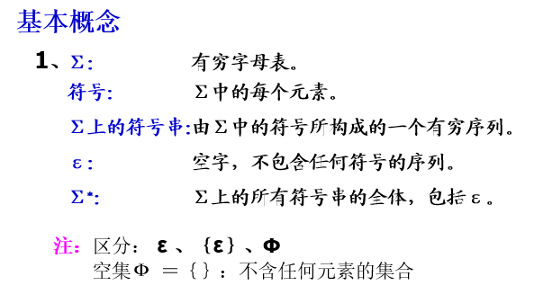

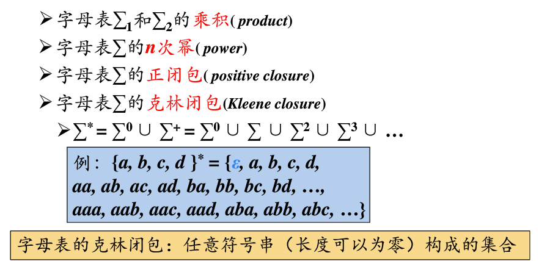

### 2.2 文法的定义

1. 文法的形式化定义

   G= (Vt, Vn , P, S)

   > Vt  ： 终结符集合
   >
   > Vn ： 非终结符集合  —— 用来表示语法成分的符号，(语法变量)
   >
   > Vt 相交 Vn  等于空
   >
   > ~   并且 ~  等于文法符号集
   >
   > P ： 产生式的集合
   >
   > S ： 开始符号

2. 符号约定

   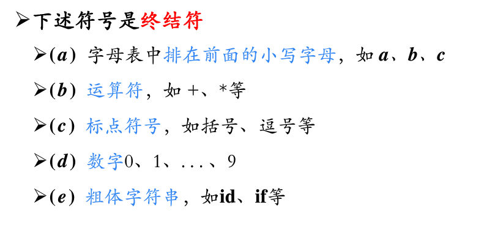

   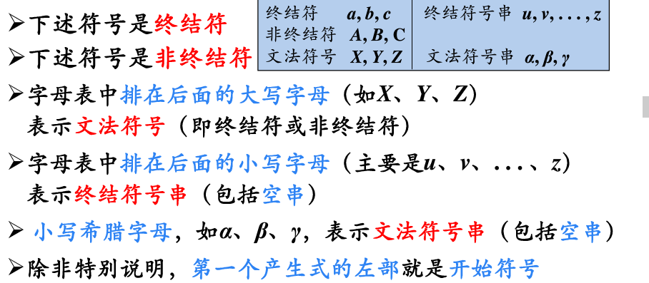

### 2.3 语言的定义

1. 推导和规约

   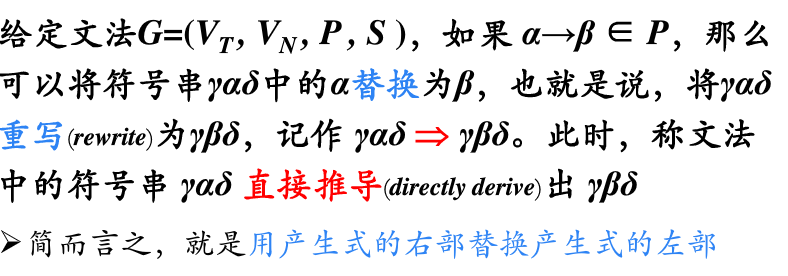

   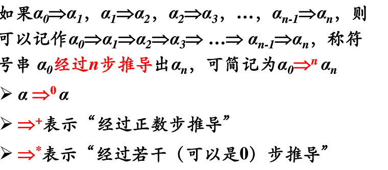

   > 反向即是规约


 ### 2.4 文法的分类

   > 文法分类的体系
   >
   > 0型 文法
   >
   > 1型文法
   >
   > 2型文法
   >
   > 3型文法

   1. 0型文法

      ​	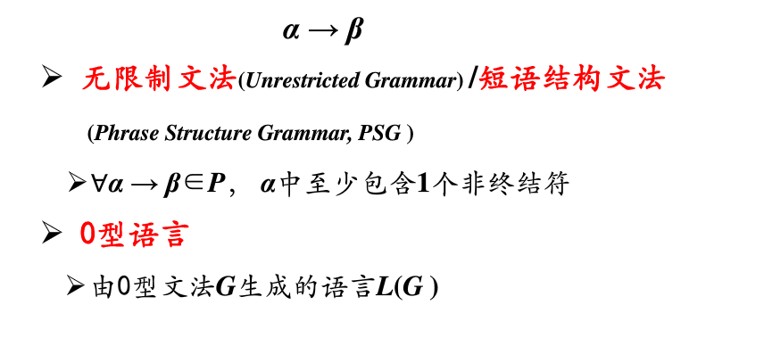

   2. 1型文法

      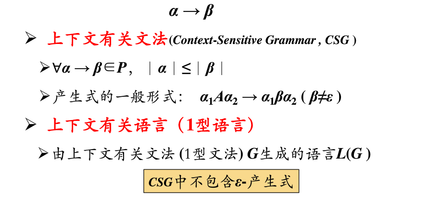

   3. 2型文法

      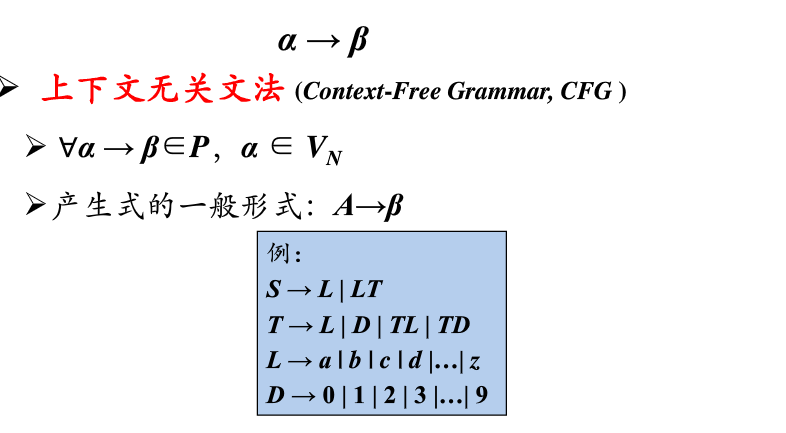

      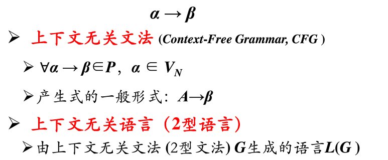

   4. 3型文法

      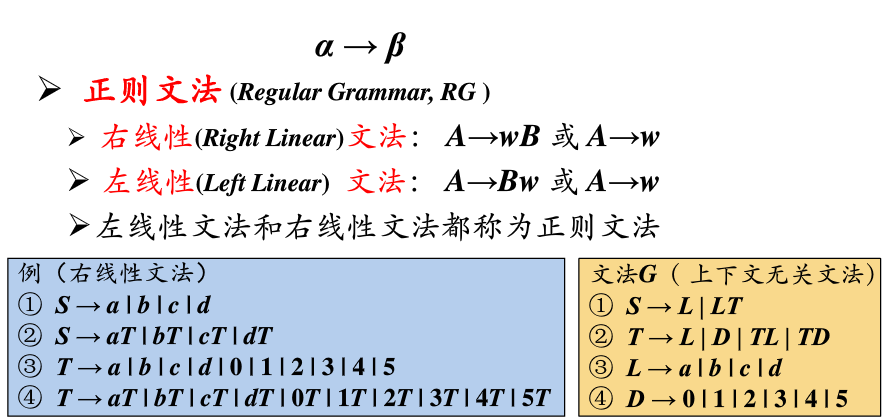

      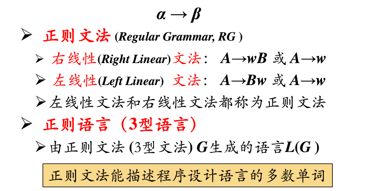

   

四种文法之间的关系

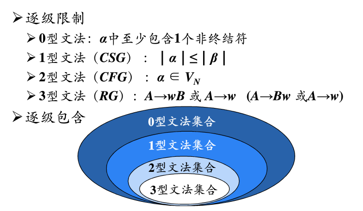

### 2.5 CFG的分析树


## 第三讲： 词法分析

### 3.1 正则表达式

> 正则表达式 是一种用来描述正则语言的更紧凑的表示方法
>
>  正规表达式  是表示  正规集  一种方法。一个字集合是  正规集  当且仅当它能用  正规式  表示 
>
> 可以用RE定义的语言叫做——正则语言或正则集合

**正则文法与正则表达式是等价的**

### 3.2 正则定义

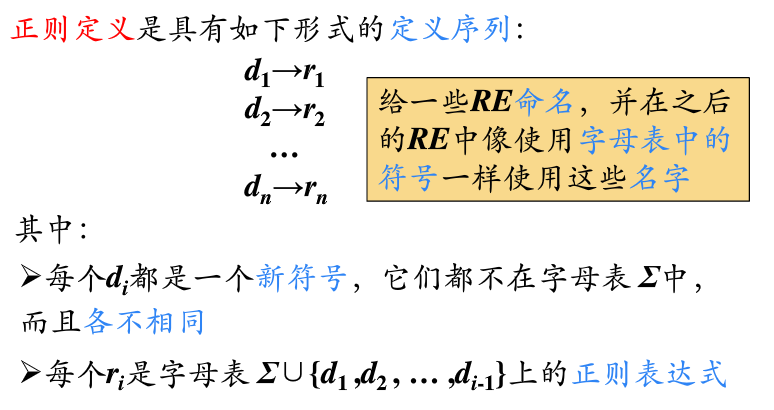

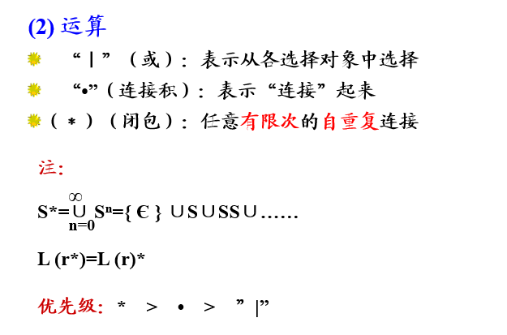

### 3.3 有穷自动机

1. 表示图

   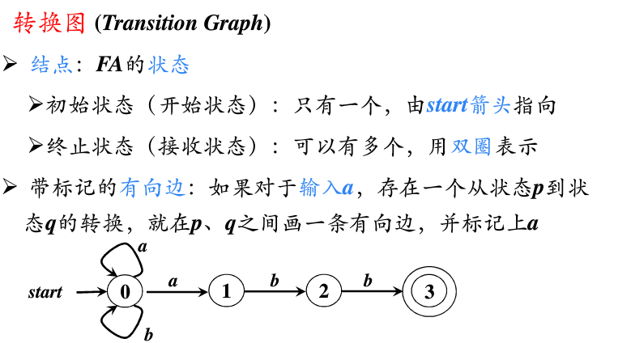

### 3.4 有穷自动机分类

1. 确定的有穷自动机(DFA)

   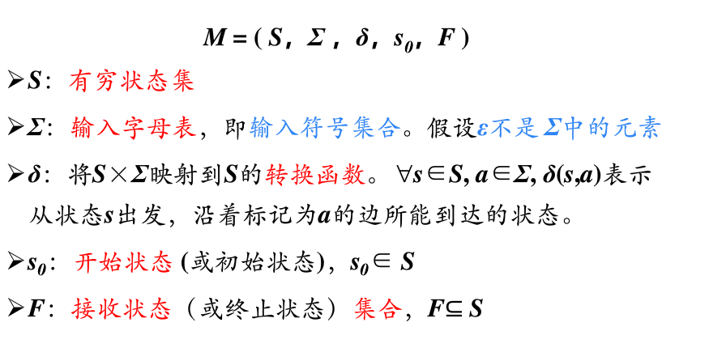

   例子

   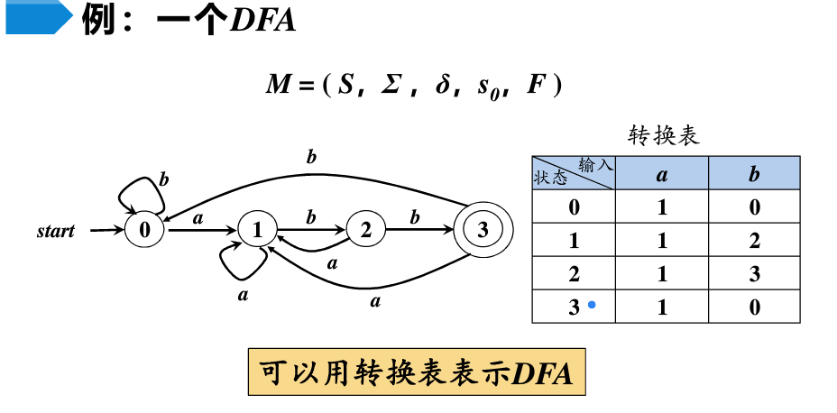

2. 非确定的有穷自动机NFA

   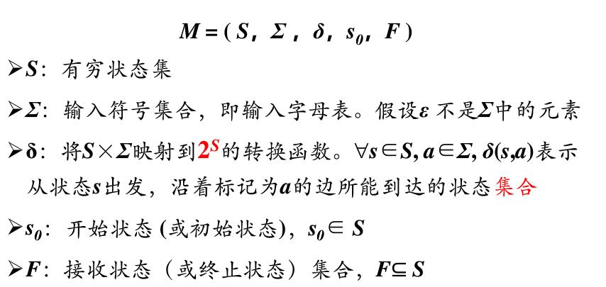

   例子

   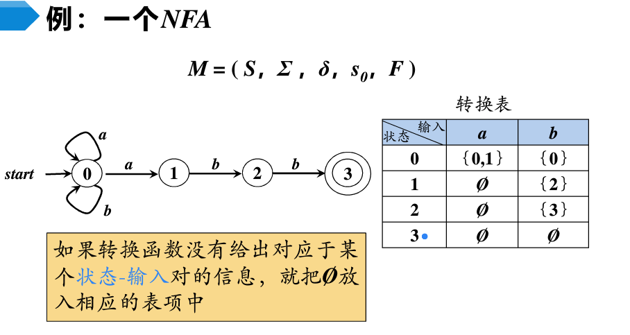

3. DFA 和NFA 的等价性

   1. 对任何非确定的有穷自动机N，存在定义同一语言的确定的有穷自动机D
   2. 对任何确定的有穷自动机D, 存在定义同一语言的非确定的有穷自动机N

4.  ==两者的区别==

   1. DFA在任何的状态下对于任何的输入都是有一个明确的处理，而nFA不是

   2. DFA 的状态迁移矩阵 是确定的，而NFA的矩阵是可以存储裁剪的

      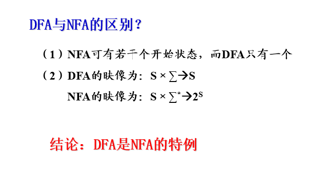

5.  带有空边的NFA

   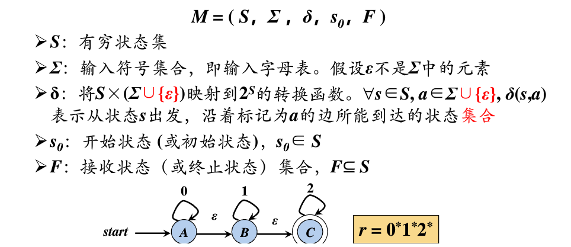

### 3.5 从正则表达式到有穷自动机

> RE  如果转换为 DFA  是通过 NFA当中间的

例子

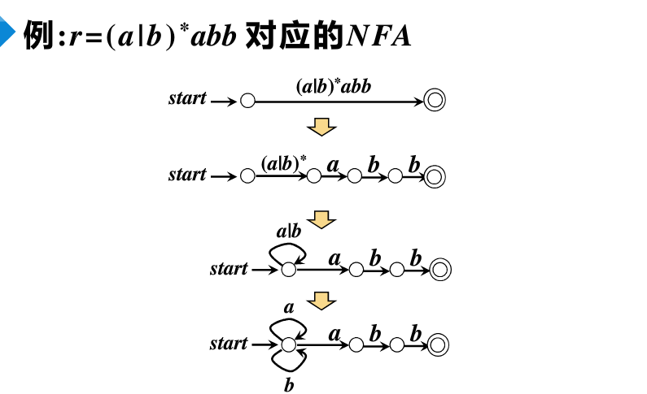

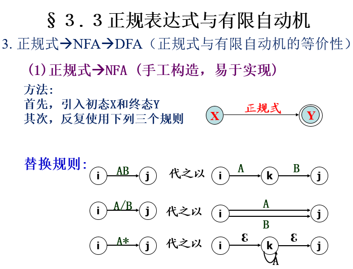

### 3.6 从NFA到DFA的转换

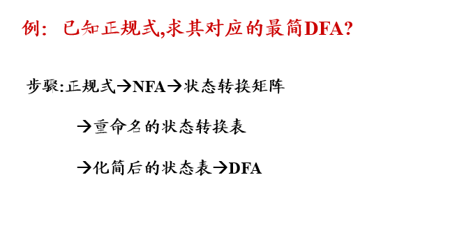

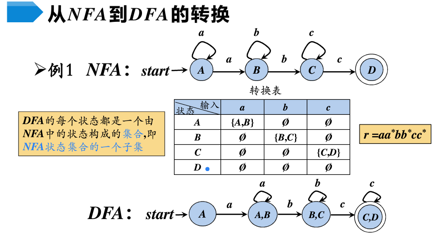

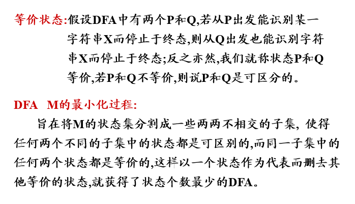

### 3.7 识别单词DFA


## 第四讲：语法分析1

### 4.1 自顶向下分析概述

> 从分析书的顶部(根节点)向底部 方向构造分析书
>
> 可以看成是从文法开始符号S推导字符串w的过程
>
> **从文法的开始符号出发，向下推导(==使用最左推导==)，尽可能使用各种产生式，推导出与输入串匹配的句子。**

​	


> 每一步推导中，都需要做两个选择
>
> ​	替换当前句型中的那个非终结符
>
> ​	用该非终结符的那个候选式进行替换


> •**左递归和回溯问题的产生直接与描述语言的文法有关；**
>
> •因此，要对文法进行确定的自顶向下分析应该改造文法，使其不含左递归和回溯。


1. 最左推导

   1. 总是选择每个句型的==最左非终结符==进行替换

      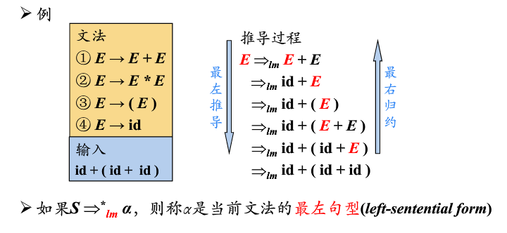

2.  最右推导

   1. 总是选择每个句型的==最右非终结符==进行替换

      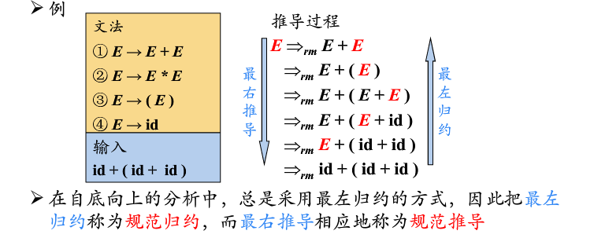

3. 例题

   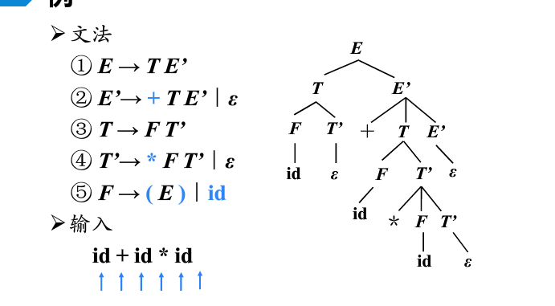

### 4.2 文法转换

> 同一非终结符的多个候选式存在共同前缀，将导致回溯现象
> 
```txt
回溯法也称试探法，它的基本思想是：从问题的某一种状态（初始状态）出发，搜索从这种状态出发所能达到的所有“状态”，当一条路走到“尽头”的时候（不能再前进），再后退一步或若干步，从另一种可能“状态”出发，继续搜索，直到所有的“路径”（状态）都试探过。这种不断“前进”、不断“回溯”寻找解的方法，就称作“回溯法”。 
```

### 4.3 LL(1) 文法

> 每个产生式的右部都以终结符开始
>
> 同一非终结符的各个候选式的首终结符都不同
>
> （不含空产生式）
>
> 分为三步：
>
> 	1. 左递归的消除
>  	2. 消除回溯，提取公共左因子
>  	3. LL(1)文法
>  	4. LL(1) 文法的自上而下分析

1. 概念

   > LL(1) 文法：(对文法进行不带回溯的确定的自顶向下分析的条件)，据此判别是否为LL(1)文法。
   >
   > –(1) 文法不含左递归
   >
   > –(2) 对文法中的任一个非终结符A的各个产生式的侯选首终结符集两两不相交，即：
   > $$
   >   First(ai)∩ First(aj) = φ      (i≠j)
   > $$
   > –(3) 对文法中的每个非终结符A，若它存在某个首选符集含有**ε**，则
   >
   > ​      
   > $$
   > First(A)∩ Follow(A) = φ
   > $$
   > 
   
   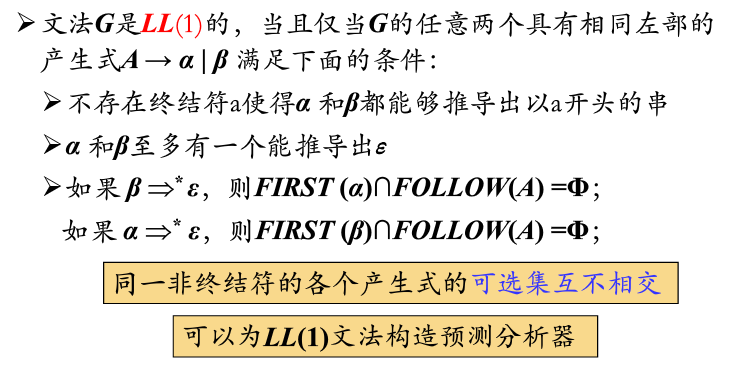


## 第五讲：语法分析2


### 4.3.1 左递归消除

```txt
一：什么是左递归

 

    在计算机科学里面，左递归是一种递归的特殊状况。      
    在上下文无关文法内里的说法，若一个非终端符号（non-terminal）r有任何直接的文法规则或者通过多个文法规则，     
    推导出的句型（sentential form）其中最左边的符号又会出现r，则我们说这个非终端符号r是左递归的。     
    即形如：r->rj像这样的式子。

二:左递归的类型
     1：直接左递归：经过一次推导就能看出文法存在左递归的产生式       
         形如：s->sb|ε    
     2:间接左递归：经过多次推导才能看出文法存在左递归的产生式         
         形如：S->ASb|ε              
              A->aA|ε        
        当A->ε时，第一个产生式就是直接左递归了。 

三：左递归的解法
  直接左递归的解法:
    1、把所有产生式写成候选式形式。如A→Aa1｜Aa2……｜Aan｜b1｜b2……｜bm。其中每个a都不等于ε，而每个b都不以A开头。 　　
    2、变换候选式成如下形式：
         A→b1A’｜b2A’……｜bmA’
         A’ →a1A’｜a2A’……｜anA’｜ε

    例子：考虑文法G： S->Sb,|a         
         一次推导： s->sb,    
         两次推导： s->sb,b,    
         三次推导： s->sb,b,b,    
         ....    
         n次推导：  s->ab,b,b,b,.....    
    观察上面的推导式子，该产生式子最后产生的字符串是以a开头的字符串。       
    所以  s->sb,|a可以替换为  
         s->as'                          
         s'->b,s'|ε    
间接左递归的解法：将间接转换为直接。

   要求：文法不存在环和ε产生式  
   步凑：  　　
     1、以某种顺序排列非终结符A1，A2，……，An； 　　
     2、for i ＝ 1 to n do 　　　　
        {   for j ＝ 1 to i - l do 　　　　　      
                {   用产生式Ａi->a1b｜a2b｜……｜akb代替每个形如Ai->Ajb的产生式，                 
                    其中，Aj->a1｜a2｜……｜ak是所有的当前Aj产生式；                
                } 　　　　             
            消除关于Ai产生式中的直接左递归性        
        } 　　
     3、化简由步骤2所得到的文法。             
    例子：S->Ab|a    
         A->Bc|t    
         B->Sb|l|d         
     1:非终结符号排序：B,A,S     
     2:  用B->Sb|l|d中的 Sb|l|d  代替  A->Bc|t中的B得到：  
              
               A->Sbc|lc|dc|t         

         用A->Sbc|lc|dc|t中的Sbc|lc|dc|t  代替 S->Ab|a中的A得到：  
                
               S->Sbcb|lcb|dcb|tb|a              
         
         消除直接左递归：               
               S->lcbs'|dcbs'|tbs'|as'               
               s'->bcbs'|ε         
        所以最终的结果： 

              
               S->lcbs'|dcbs'|tbs'|as'               
               s'->bcbs'|ε               
               A->Sbc|lc|dc|t               
               B->Sb|l|d 
```


> 消除回溯的方法
>
> 反复使用==提取公共左因子== 的方法 来改造文法，使的文法的每个非终结符号的各个候选式的首终结符两两不想交，来避免回溯

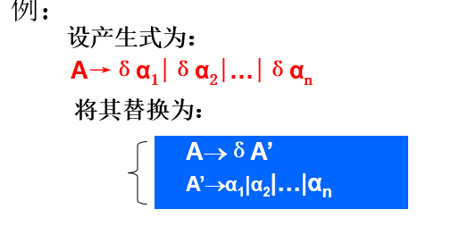

### 4.4 FIRST集合FOLLOW集的计算

1. 计算文法符号X的FIRST（X）

   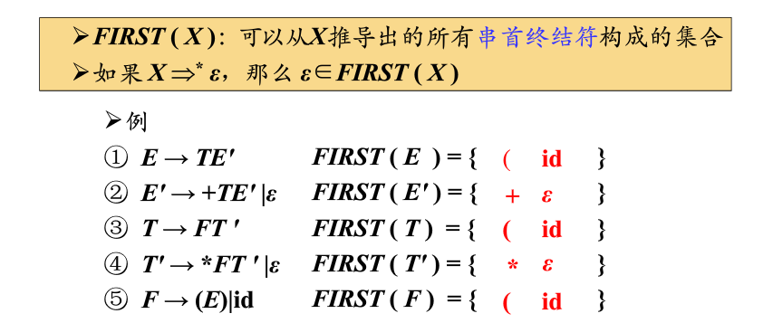

2. 计算非终结符A的FOLLOW(A)

   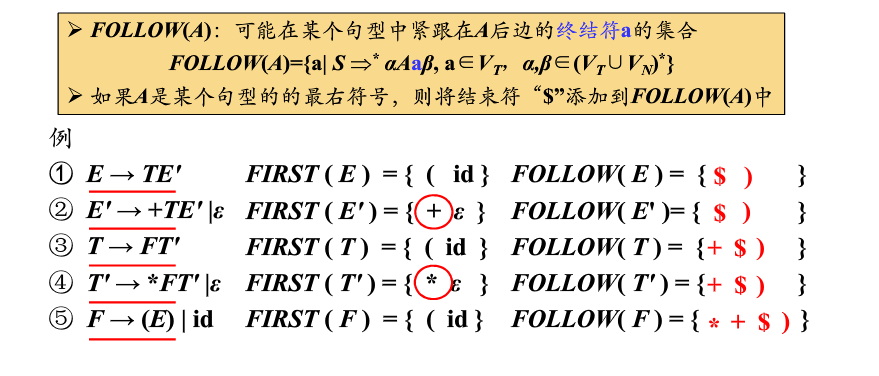

3.  对于FIRST 和FOLLOW 集的解释

   [博客地址](https://blog.csdn.net/xyjworkgame/article/details/90715009)

4. 表达式文法各产生式的SELECT集

   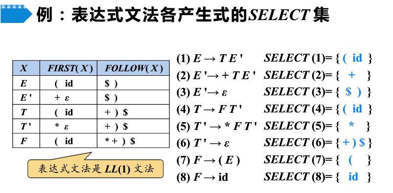

### 4.5 递归的预测分析法

> 是指： 在递归分析中，编写每一个非终结符对应的过程时，根据预测分析表进行产生式的选择。

### 4.6 非递归的预测分析法


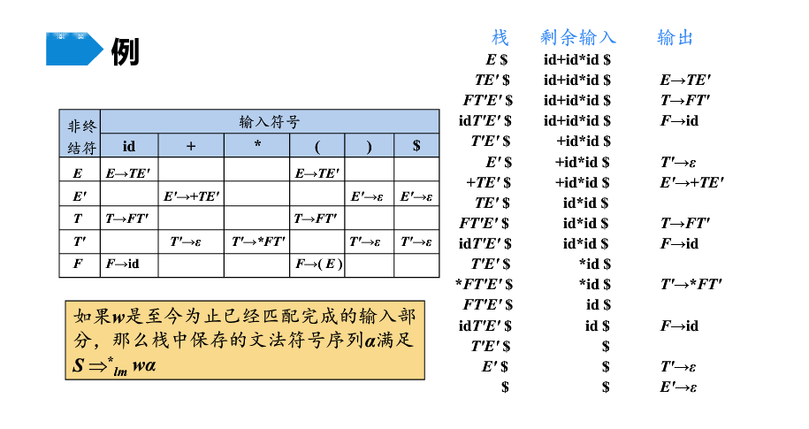

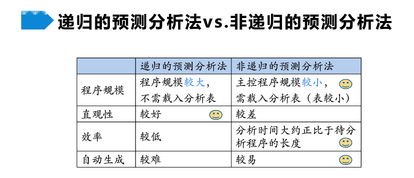

### 4.7 预测分析中的错误检测

1. 两种情况下可以检测到错误
   1. 栈顶的终结符合当前的输入符号不匹配
   2. 栈顶的非终结符与当前的输入符号在预测分析表对应项中信息为空

2. 预测分析中的错误恢复

   1. 恐慌模式

      1. 忽略输入中的一些符号，直到输入中出现由设计者选定的==同步词法单元==集合汇总的某个词法单元
         1. 效果依赖于同步集合的选取，集合的选取应该使得语法分析器能从实际遇到的错误中快速回复
         2. 例如可以把FOLLOW(A)中的所有终结符放入非终结符A的同步记号集合
      2. 如果终结符在栈顶而不能匹配，一个简单的方法就是弹出此终结符

      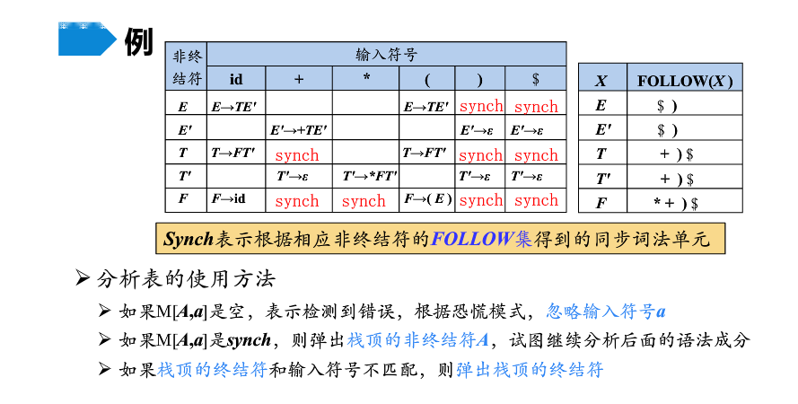

      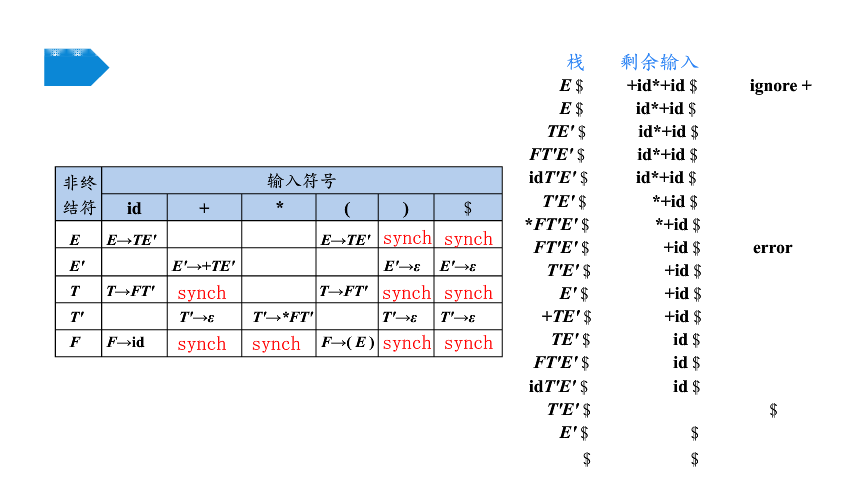

## 第六讲 语法分析3 --- 自下而上分析


在上面已经 解释了 自下而上分析 ，是最右的推导的反向  就叫做规约


1. 规范规约：

   1. 规范推导 ： 即最右推导

   2. 规范句型 ： **由规范推导所得到的句型，称为规范句型**

      ​    若文法G是无二义的，则规范推导(最右推导)的逆过程必然是规范归约(最左归约)。

   3.  规范规约的实质： 在移进工程中，当发现栈顶呈现句柄时，就用相应产生式的左部符号进行替换
      
   4. 规范规约的实质： 如果寻找或确定一个句型的句柄

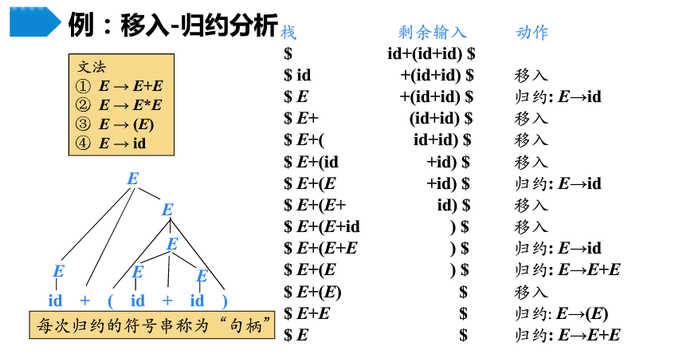


## 第七讲  属性文法和语法制导翻译


### 6.1 属性文法

一、 基本概念

1. 属性

   1. 广义： 用于描述事物或人的特征、性质、品质等等。
   2. 属性文法中：代表与文法符号相关的信息，其信息值为属性值
   3. 属性与变量一样，可以进行计算和传递
   4. 属性加工的过程是语义处理的过程
   5. 属性 
      1. 综合属性 ： 用于自下而上
      2. 继承属性： 用于自下而上

2. 语义规则

   1. 为文法的每一个产生式配备的属性的计算规则

3. 属性文法

   1. 上下文无关文法 + 语义规则 = 属性文法

   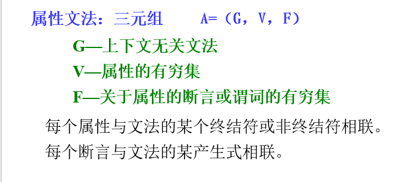


二、 基本规则

1.  语义规则的形式

   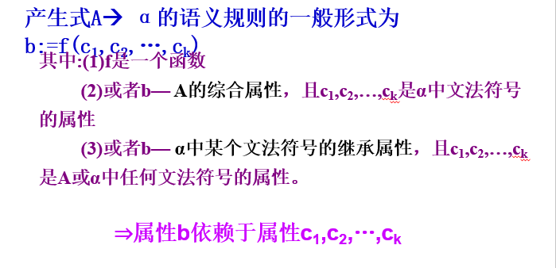

2.   Vt —Vn属性

   1.  Vt 只用综合属性，有词法分析器提供
   
   2.  Vn 即可有综合属性也可有继承属性
   
      开始符号S 的所有继承属性作为属性计算前的初始值
   
   3.  属性的计算和获得
   
       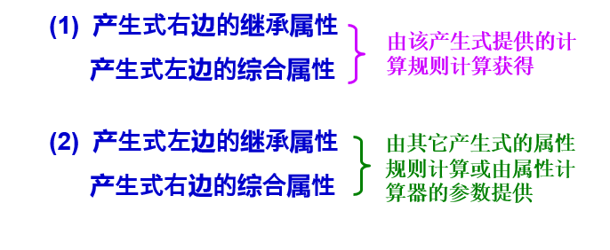
   
   4.  
   
   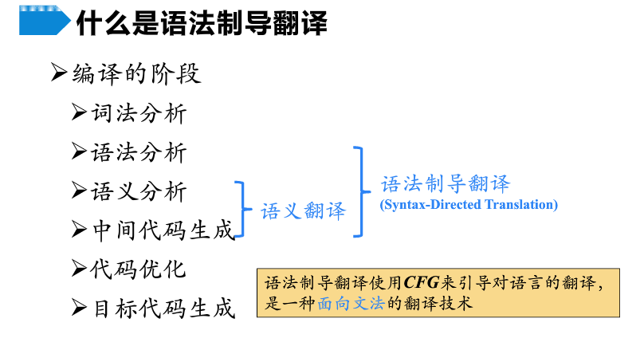

语法制导翻译方法的**实质** ==是在语法分析过程中同时进行语义处理的翻译技术==，这种方法使用属性文法为工具来说明程序设计语言的语义

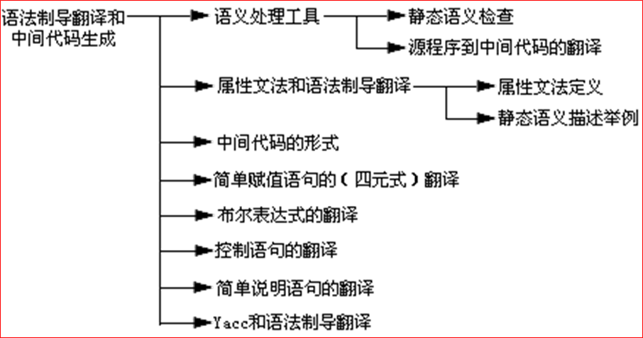

二、 综合属性

1. 语法树中，一个结点的综合属性的值由其子结点的属性值确定

2. 通常使用自底向上的方法在每一个结点出使用语义规则计算综合属性的值

3. S---- 属性文法 ： 仅使用综合属性的属性文法

   根据语义规则，写出带注释的语法树

   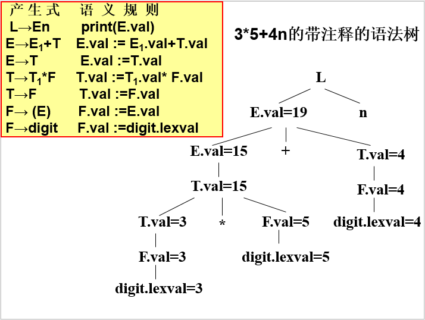


三、 继承属性

	1. 语法树中，一个结点的继承属性由此节点的父节点和/ 或 兄弟结点的某些属性确定
 	2. 用继承属性来表示程序设计语言结构中的上下文依赖关系很方便


###  6.2 基于属性文法的处理方法

1. 基于属性文法的处理过程

   输入串 --> 语法树-->  依赖图-->  语义规则的计算次序-->  进行语义规则计算，得到翻译结果


一、 依赖图】

1. 定义 ： 一个表示一棵语法树中结点的继承属性和综合属性之间的相互依赖关系的有向图
2. 

由于不知道 第六章的重点,给出重要内容

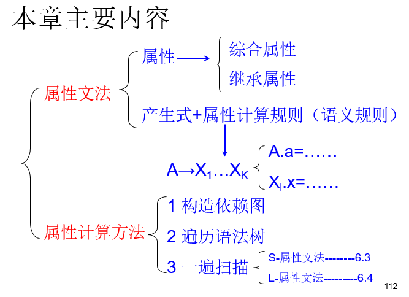

# 第八讲  语义分析和中间代码产生

