## 第一章总结

1. 编译程序的概念(掌握)
2. 编译过程（掌握）
3. 基本概念：遍，编译前端/后端（掌握）
4. T型图(了解)

### 1. 编译程序的概念(掌握)

编译程序 是指 这样的一个程序，它能够把某一种语言程序(称为源语言程序)转换成另一种语言程序（目标语言程序），而后者与前者在逻辑上是等价的。

就是**高级语言程序-------------------> 低级语言程序**


```txt
编译和解释的主要区别：
	是否产生目标代码@
```


### 2. 编译过程（掌握）


从图中可以看到编译过程

1. 词法分析

   1. 规则 ： 依循 词法规则
   2. 规则描述 工具 ： 正规式和有限自动机(FA)
   3. 任务 ： ==输入源程序==，对构成源程序的字符串进行扫描和分解，==识别出一个个的单词符号==，如基本字、标识符、常数、算符、界符等。

2. 语法分析

   1.  规则 ： 依循语法分析
   2. 规则描述工具  ： 上下文无关文法
   3. 任务 ： 在分发分析的基础上，根据语言的语法规则，对单词符号串进行语法分析，识别出各类语法单位，最终判断输入串是否构成语法上正确的程序

3. 语义分析和中间代码产生

   1. 规则 ： 语义规则
   2. 规则描述工具 ： 属性文法
   3. 任务 ： 对语法分析器 识别出的各类语法单位，分析其含义并进行初步翻译(产生中间代码)
      1. 两部分工作
         1. 对每种语法范畴进行静态语义检
         2. 若语义正确，则进行中间代码翻译

4. 优化

   1. 任务 ： 对中间代码进行加工变换，以期在最后阶段能产生出更为高效（省时间和空间）的目标  代码。 
   2. 规则 ： 等价变换规则

5. 目标代码生成

   1. 把中间代码变换成特定机器上的低级语言代码，实现最后的翻译。

      

### 3. 基本概念：遍，编译前端/后端（掌握）

#### 遍

1. 编译过程的划分
   1. 上述划分的5个阶段仅仅是逻辑功能上的
2. 遍
   1. 对源程序或源程序的中间结果从头到尾扫描一次，并做有关的加工处理，生成新的中间结果或目标程序
3. 注意 ： 
   1. 既可以将几个不同阶段合为一遍，也可以把一个阶段的工作分为若干遍
   2. 词法分析+语法分析	->    一遍
   3. 当一遍中包含若干阶段时，各阶段的工作是穿插进行的 。

#### 编译前端与后端

1. 前端  ： 

   1. 由于源程序有关但与目标机无关的那些部分组成     | 

      包括 -----------词法分析、语法分析、语义分析与中间代码产生、部分代码优化工作

2. 后端 ————**仅依赖于中间语言**

   1. 包括编译程序中与目标机有关的那些部分，

      如 ： 与目标具有关的代码优化和目标代码生成等
   
      
   
   ### 4. T型图(了解)
   
    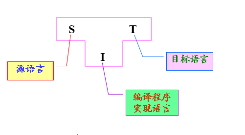
   
   
   
   

## 第二章总结

1、上下文无关文法的概念

2、最左/右推导、语法分析树

3、文法二义性

4、文法的分类


### 1. 上下文无关文法的概念

1. 定义 ： 

   ​	文法 ： 描述语言的语法结构的形式规则

   ​	上下文无关文法：	
   ​      
   
   ​			 所定义的语法范畴（或语法单位）是完全独立
   于这种范畴可能出现的环境的一种文法。
   
2.  句子的语法组成

   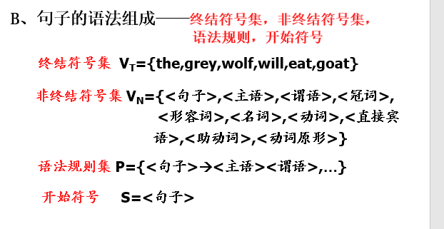

   

### 2.最左/右推导、语法分析树

定义 ： 任何一步 a =》b 都是对a中的最左/左右非终结符进行替换的

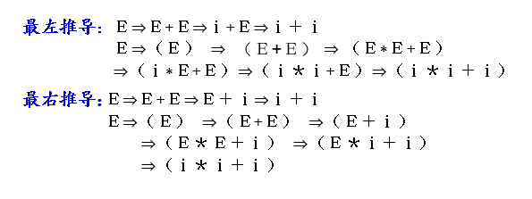

### 3. 文法二义性

1. 语法分析树

   1. 用树的形式表示一个句型的推导生成，有助于理解一个句子语法结构的层次

   例 

   

2.  二义文法

   1. 用若一个文法中存在某个句子，它有两个不同的最左/最右推导，则该文法为二义文法
   2. ==实质： 同一个句子存在两颗语法分析树==
   3.  但是 不存在一个算法 可以有限步骤内，确切判定一个文法是否为二义的

   

   

### 4. 文法的分类

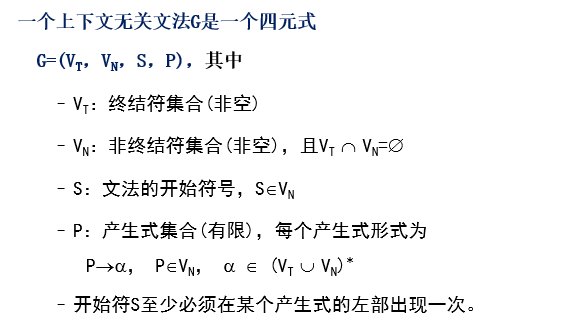

1. 形式语言

   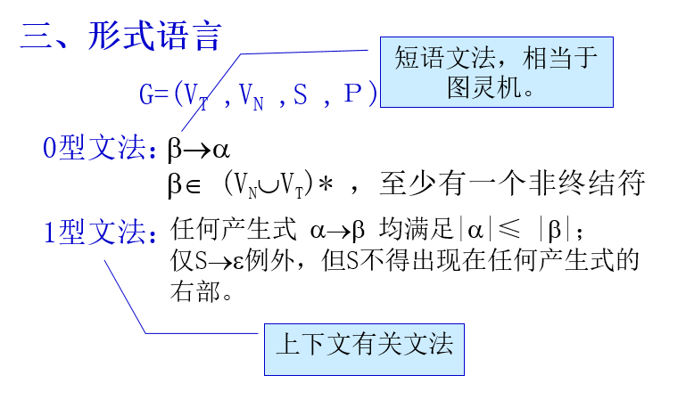

   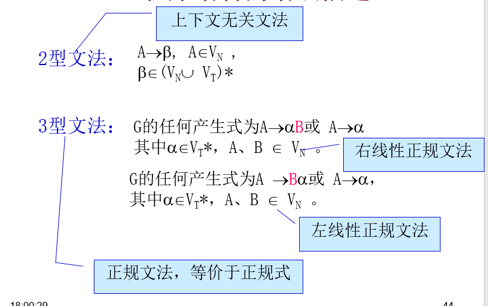

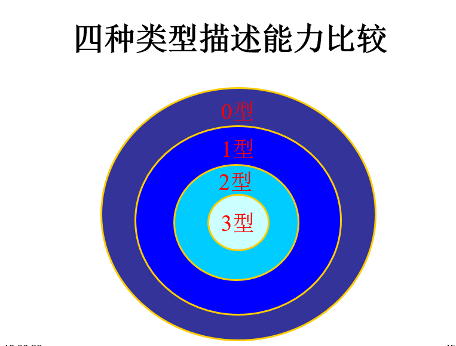

## 第三章总结

1. 状态转化图及其实现

   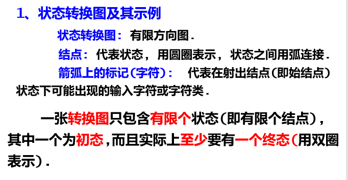

   

#### 正规表达式与有限自动机

1. 有限自动机是一个有穷状态的机器，它由一个有限的内部状态集和一组控制规则组成，这些规则是用来控制在当前状态下读入输入符号后应转向什么状态；是一种数学模型，它可以用来描述**识别输入符号串**的过程。

##### 一、单词符号的描述

1. 正规式与正规集
   1. 正规集 可以用正规表达式 表示
   2. 正规表达式 是表示正规集的一种方法，一个字集合是正规集当且仅当它能用正规式表示
   3. 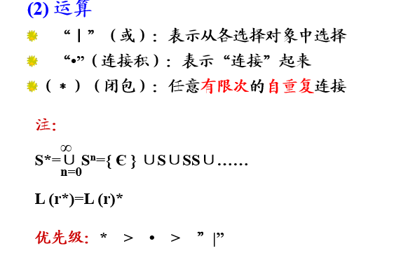
   4. 等价 ： 若两个 正规式所表示 的正规集相同，则认为二者等价
2. 正规文法

##### 二、 有限自动机

1. DFA - 确定有限自动机

   要明白 5元式 ，代表的是什么 各个元素

   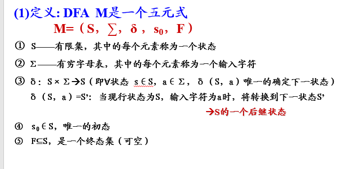

   

2. NFA  ---非确定有限自动机

   ==DFA 是NFA的特例==

   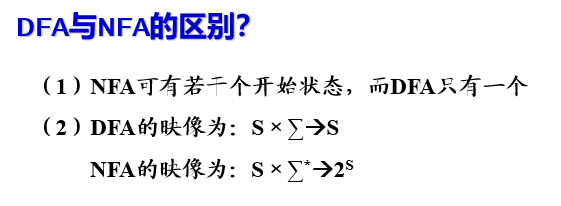

   

3. NFA与DFA的等价

   正规式 -》 NFA - 》 DFA (正规式与有限自动机的等价性)

   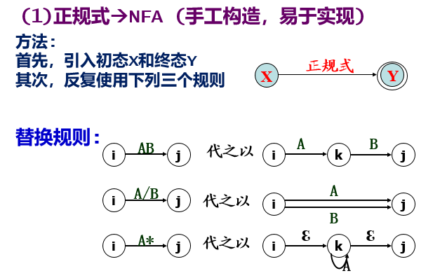

   求 最简 DFA 

   1.  正规式 -》 NFA -》 状态转换矩阵 -》 重命名的状态转换表 -》 化简后的状态表 -》 DFA

4. DFA的 化简

   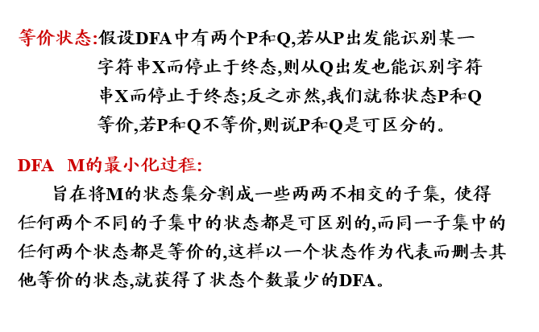

   

##### 三、正规式与有限自动机的等价性

##### 四、正规文法与有限自动机的等价性

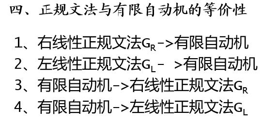

## 第四章总结

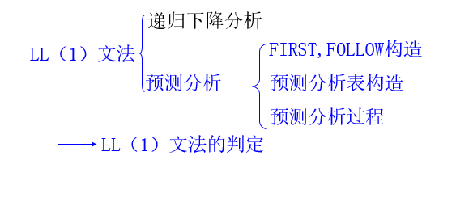

 总体任务 ： 分析出单词符号串的基础上，分析并判定程序的语法结构是否符号语法规则

语法分析方法分类： 

​		自上而下分析法

​		自下而上分析法

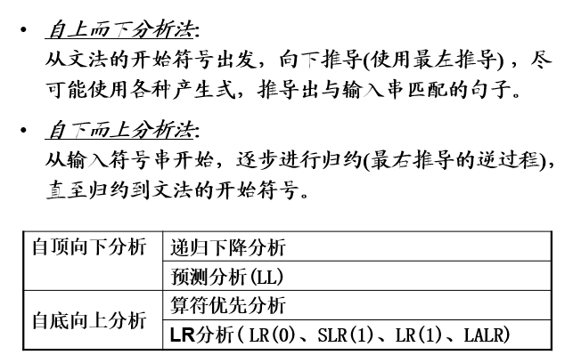

##### LL（1） 分析法

一、 左递归的消除

 1.  规则  ： 直接左递归消除

      	1.  直接左递归  可以  将左递归 变为 右递归

     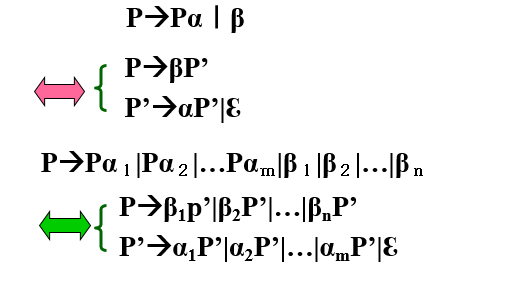

     2. 间接 左递归 消除 : 条件

        1.  不含以ε 为右部的产生式
        2. 不含回路 p -> P

        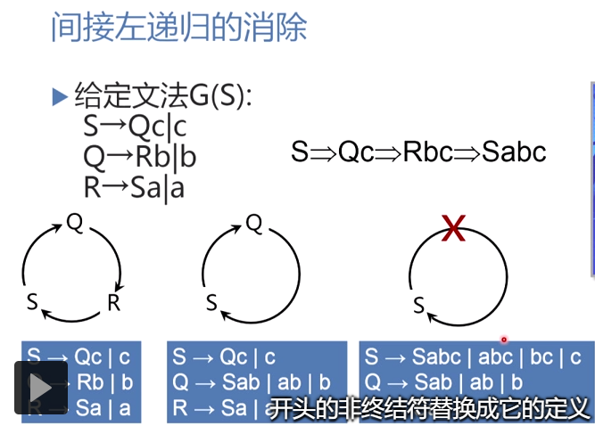

        

二、消除回溯，提取公共左因子

​	反复使用“提取公共左因子”的方法来改造文法，使得文法的每个非终结符号的各个候选式的首终结符两两不相交，来避免回溯。

三、LL(1) 文法

​	判断  是否是 LL（1） 文法

​			==文法不含左递归==

​			==对文法中的任一个非终结符A的各个产生式的候选首终结符两两不想交==

​				  若A- > α1|α2|∙∙∙|αn  ，则 First(ai)∩ First(aj) = φ      (i≠j)

​			 ==对文法中的每一个非终结符A，若他存在某个首选符集有**ε==**

​				       First(A)∩ Follow(A) = φ

​			**重点是FIRST 和FOLLOW 集合的求法**

   1.    FIRST 求解

         (1)若X∈VT, 则FIRST(X)={X}。

         (2)若X∈VN, 且有产生式Xa…, 则把a加入到FIRST(X)中;
            若Xℇ也是一条产生式,则把ℇ也加到FIRST(X)中。

         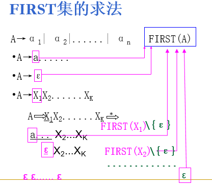

         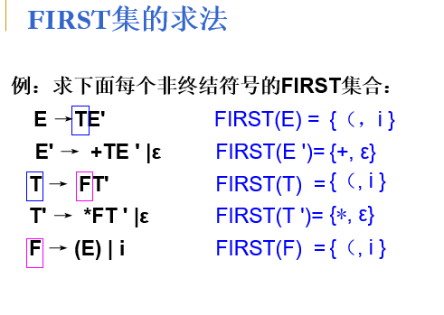

			2. FOLLOW集

      (1)对于文法的开始符号S, 置#于FOLLOW(S)中;

      (2)若A->αBβ是一个产生式,
         则把FIRST(β)\{ℇ}加至FOLLOW(B)中;

      (3)若A->αB是一个产生式 ,
         或A->αBβ是一个产生式而β⇒ℇ(即ℇ∈FIRST(β)),
         则把FOLLOW(A)加至FOLLOW(B)中。

      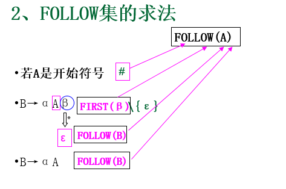

      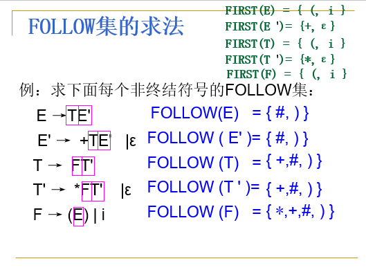

四、 LL（1） 文法的自上而下分析

五、 递归下降分析程序构造

​	优缺点分析：

   1.    优点 ; 简单直观，易于构造

   2.    缺点 ： 对文法要满足ll（1） 文法

         ​			有递归调用多，所以速度慢占用空间多

预测分析程序

1. 预测分析表构造

   1. FIRST集合构造

   2. FOLLOW 集合构造

   3. 预测分析表的构造

      关于不同的定义，放到不同的行里

      （1）对每个Aα，执行第2步和第3步；

      （2）对每个终结符a ∈FIRST(α），把Aα加至M[A,a]中；

      （3）若ε∈FIRST(α)，则对任何b ∈FOLLOW(α)，把Aα加至M[A,b]中；

      （4）把所有无定义的位置上标上“出错标志”。

      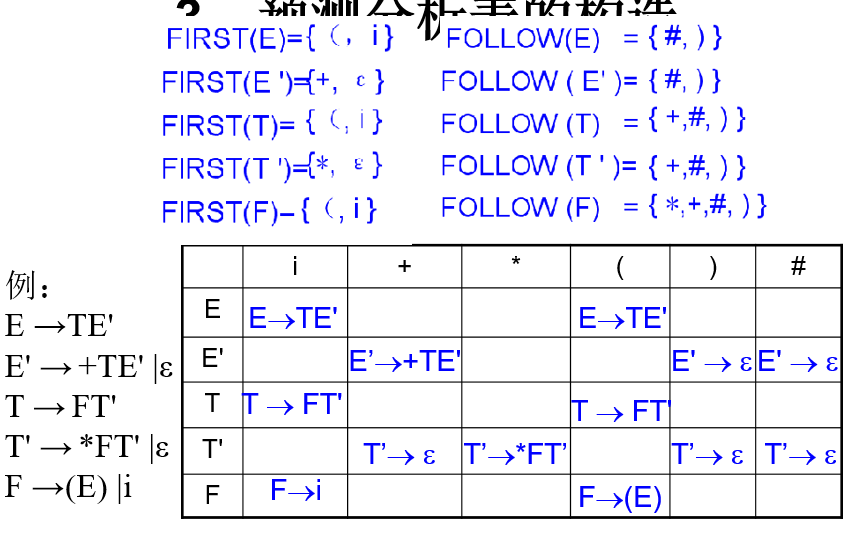

2. 预测分析程序

## 第五章总结

- 自下而上分析 ： 就是  从输入串开始，逐步进行规约，直至规约到文法的开始符号

  -  过程 ： 变输入单词符号，边规约

  

- 可规约串   ——————短语更加的符合
- 短语 和直接短语
  - 一个句型对应的语法树中
    - 以某非终结符为根的==两代以上的子树的所有末端结点从左到右排列==就是相对于该非终结符的短语
    - 如果子树只有两代，则该短语就是直接短语
- 算符文法
  - 一个文法，如果它的任一产生式的右部都不含两个相继（并列） 的非终结符，即不含...QR...形式的产生式右部，那么该文法就是算符文法

  规范规约简述：

  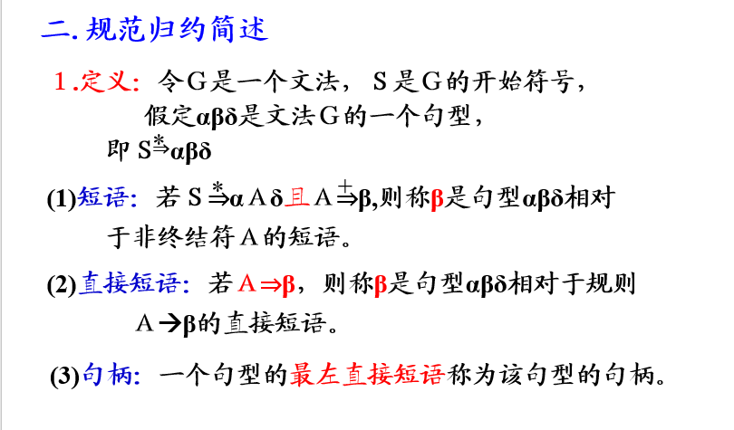

  例子

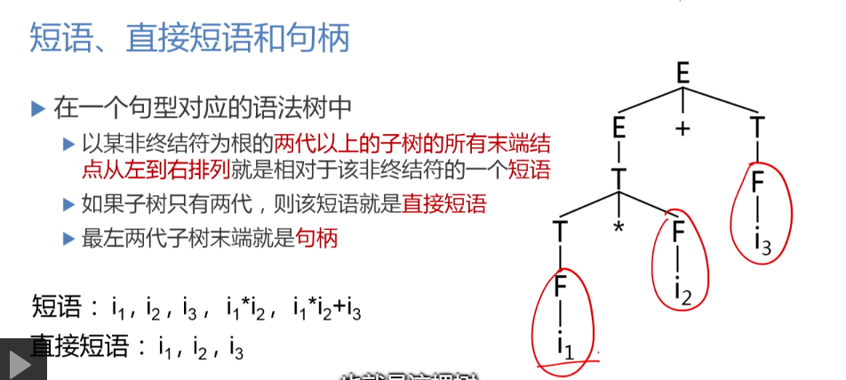


算符优先分析

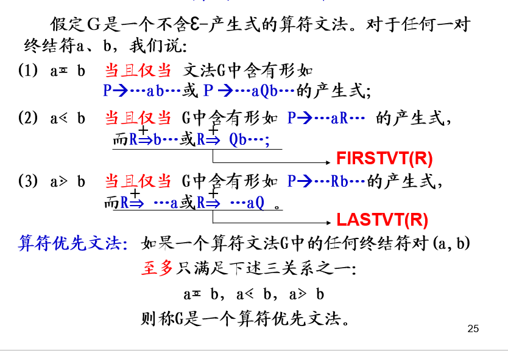

构造集合FIRSTVT 和LASTVT 集合

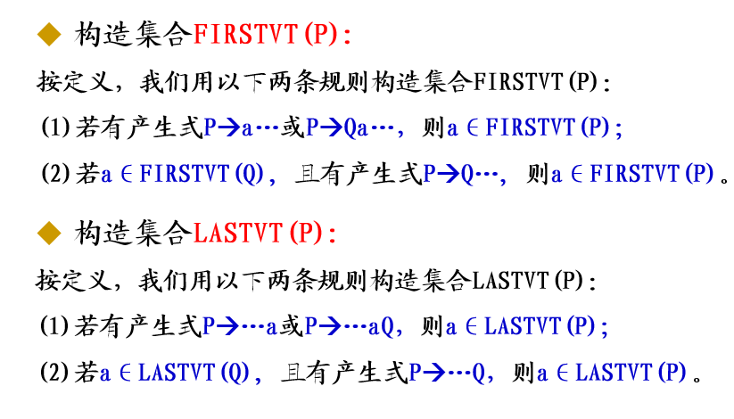

算符文法 ： 一个文法 ，如果它的任一产生式 的右部 都不含 两个相继 的非终结符，即不含如 式 的产生式右部：。。QR。。。


最左素短语： 

​	素短语 ： 是指这样的一个短语，他至少含有一个终结符，并且，除它自身之外不再含有任何更小的素短语

​	最左素短语 ： 指 处于句型最左边的那个素短语


## 第六章总结

语法知道翻译方法的实质是  在语法分析过程中同时进行语义处理的翻译技术，


语义规则 ;  为文法的每一个产生式配备的属性的计算规则

属性文法 ： 上下文无关文法 + 语义规则

属性文法 ： 三元组 A = （G，V，F）

​	G 上下文无关文法

​	V 属性的有穷集

​	F 关于属性的断言或谓词的有穷集

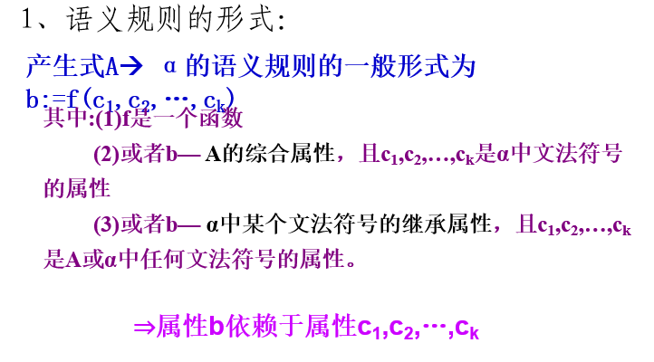


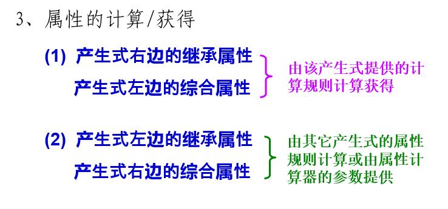

综合属性 ： 一个结点 的综合属性 的值 由其子节点的属性值确定

继承属性： 一个结点的继承属性由此 结点的父节点和 / 或 兄弟结点的某些属性确定


基于属性文法的处理过程 ： 

输入串-  语法树 -  依赖图 ---语义规则的计算次序-  进行语义规则计算，得到翻译结果


单词符号串 -----语法分析---》 语法分析树 ---遍历---》 计算


## 第七章总结

### 7.1 中间语言

一、 后缀式(逆波兰式)

规则 ： 

| **产生式** | **语义规则**     |
| ---------- | ---------------- |
| E→E1 OP E2 | E.code:= E1.code |
| E→(E1 )    | E.code:= E1.code |
| E→id       | E.code:= id      |


DAG
 例子----无循环有向图

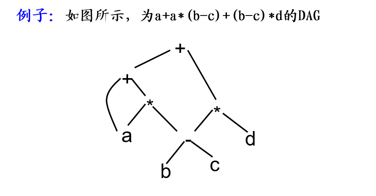

抽象 语法树  --- 


串的翻译过程

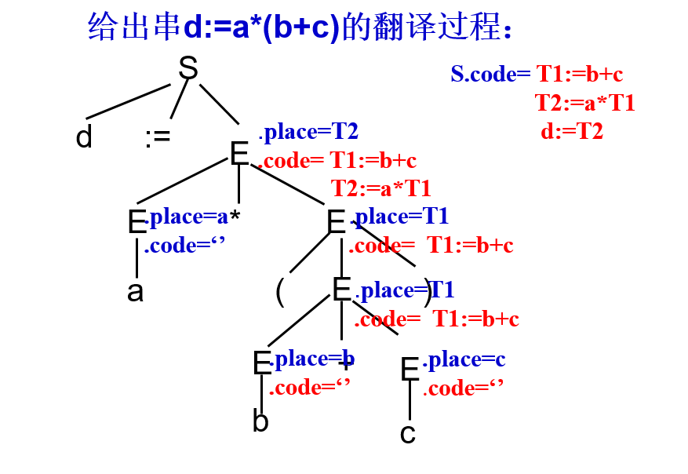

**三地址代码的三种实现方式：** 四元式，三元式，间接三元式 

他们的差别就是 四元式，比三元式多一列 result

三元式 就是   op，Arg1，arg2

间接 三元式 ： 间接码表 + 三元式表

### 7.2 说明语句

### 7.3 赋值语句的翻译

### 7.4 布尔表达式的翻译

### 7.5 控制语句的翻译


