# 考研-数据结构

## 一、绪论

### 1.1 数据结构的基本概念

#### 1） 基本概念以及术语

1. 数据 ： 信息的载体，是**描述客观事物**属性的数、字符及所有能输入到计算机中并被计算机程序识别和处理的==符号==
2. 数据对象： 具有相同性质的数据元素的集合，是数据的一个子集
3. 数据元素：数据的基本单位，通常作为一个整体进行考虑和处理
4. 数据   项 ： 构成数据元素的不可分割的最小单位
5. 数据类型（集合+操作）
   1. 原子类型： int、char，float
   2. 结构类型：list、map、set
   3. 抽象数据类型ADT：所有可以抽象出的模型
6. 结构 ： 数据不是孤立的，他们存在着某种关系
7. 数据结构 ： 是相互之间存在一种或多种特定==关系==的==数据元素==的集合
   1. 数据结构的==**三要素**==： ==逻辑结构==     ==物理结构==     ==数据的运算==

#### 2） 数据结构的三要素

##### a、 逻辑结构

1. 线性结构

2. 集合

3. 树形结构

4. 图状结构

   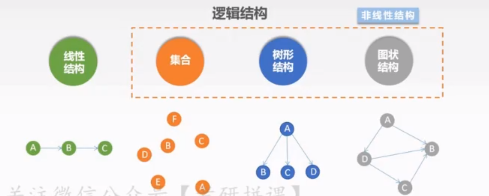

##### b、存储结构

1. 顺序存储： 逻辑和物理位置是相邻的
2. 链式存储：物理位置上不相邻，逻辑相邻
3. 索引存储：一张索引项，找到对应数据项
4. 散列存储： 哈希存储，（关键字函数运算）

##### c、数据运算

> 运算包括 运算的==定义和实现==，
>
> 运算的定义针对==逻辑结构==
>
> 运算的实现针对==存储结构==


### 1.2 算法和算法评价

#### 1）算法的基本概念

> 算法 ： 对特定的问题求解步骤的一种描述，他是指令的有限序列，其中每条指令表示一个或多个操作

1. 算法的特性 ： 有穷性，可行性，确定性，输入，输出
2. 算法与程序区别：

| 算法                                                         | 程序                                   |
| ------------------------------------------------------------ | -------------------------------------- |
| “指导者”                                                     | “实施者”                               |
| 解决问题的一种方法或一个过程，考虑如何将输入转换成输出吗，一个问题可以有限多个算法 | 程序是某种程序设计语言对算法的具体实现 |
| 有穷性                                                       | 无穷性                                 |
| 算法必须正确的                                               | 程序可以是错误的                       |
| 可以用==伪代码====程序语言等描述==                           | 只能用程序语言来运行                   |

#### 2）算法效率的度量

> 一个好的算法具有哪些特性：
>
> 	==正确性==
> 	
> 	==可读性==
> 	
> 	==健壮性==   输入非法数据，能做出正确的处理
> 	
> 	==效率与存储量==  效率是指算法执行时间，存储量需求是指算算								执行过程中所需最大存储空间
> 	
> 	==**时间复杂度                     空间复杂度**==

1. 语句频度 ： 该条语句可能重复执行的次数

2. T(n) ： 所有语句的频度之和，其中n为问题的规模

   ```c++
   int sum = 0; // 执行一次
   for（int i = 1; i<= n; i++)
       sum += i;//执行 n次
   ```

3. 时间复杂度 : T(n) = O(f（n）) ， 其中 O 表示T(n) 与f（n） 在n趋近于正无穷为同阶无穷大

   1. 分类：

      1. 最坏时间复杂度
      2. 最好时间复杂度
      3. 平均时间复杂度

   2. 计算

      1. 加法判断最大值当做时间复杂度
      2. 乘法为两个复杂度 相乘

   3. 通常采用==基本运算频度==来分析算法时间复杂度

      ```c++
      int sum = 0 ; O(1)
      for (int i =1 ; i<= n ;i ++)
      	sum += 1;	O(n)
      	
      for (int i =1 ; i<= n ;i ++)
      	for (int i =1 ; i<= n ;i ++)
      		sum += 1;	O(n²)
      	该程序为 O（n²）
      ```

   4. 常见时间复杂度

      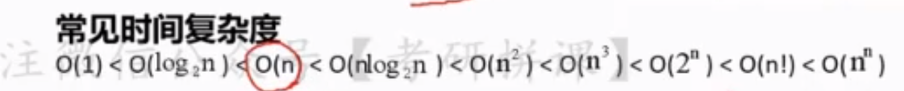

   5. 时间复杂度 ： 算法消耗 的存储空间 记 S(n) = O(g(n))

      > 除本身所用的指令、常数、变量和输入数据外、还需要一些对数据进行操作的工作单元和存储为实现算法所需的一些信息的辅助空间

      ==算法原地工作时指算法所需辅助空间为常量，O(1)==

## 二、 线性表

### 2.1 线性表的定义和基本操作

1. 线性表的定义

   线性表 是具有相同的类型的n 个元素的有限序列，其中n为表长，当n=0 是，该表为空表

   表示为 L = （a1,a2.....）

   1. 相同类型
   2. 有限
   3. 序列 : 有序号的

2. 线性表的特点：

   1. 表中的元素个数==有限==
   2. 表中元素具有逻辑上的顺序性，在序列中各个元素排序有其==先后次序==
   3. 表中元素都是==数据元素==，每个元素都是单个元素
   4. 表中元素的==数据类型都相同==，每个元素所占的相同大小的存储空间
   5. 表中的元素具有==抽象性==，即 讨论元素间一对一的逻辑关系
   6. 线性表是一种==逻辑结构== ，表示元素之间一对一相邻的关系

3. 线性表的九种基本操作：

   1. InitList(&L);初始化表，构造一个空的线性表
   2. DestroyList（&L）；销毁操作，销毁线性表，并释放线性表L所占用的内存空间
   3. LocateElem（L,e）；按值查找操作。在表中L查找具有给定关键字值得元素
   4. getElem（L，i）; 按位查找操作，获取表L中第i个位置的元素的值
   5. ListInsert（&L，i，e）； 插入操作，在表L中的第i个位置上插入指定元素
   6. ListDelete（&L，i，&e） ；删除表L中第i个位置的元素，并用e返回删除元素的值
   7. PrintList（L）； 遍历输出所有元素值
   8. Empty（L） ； 判空操作
   9. Length（L） ： 求表长

### 2.2 线性表的顺序表示

#### 1） 顺序表的定义（顺序存储）

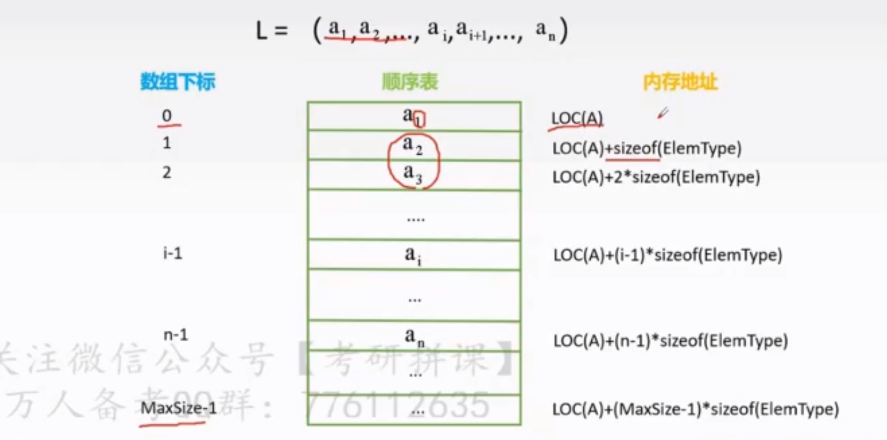

1. 数组静态分配

   ```c++
   #define MaxSize=50
   typedef struct{
       ElemType data[MaxSize];
       int length
   }SqList;
   ```

2. 数组动态分配

   ```c++
   #define MaxSize=50
   typedef struct{
       ElemType *data
       int length
   }SqList;
   ```

   1. 动态分配语句

      ```c++
      c L.data = (Elemtype*)malloc(sizeof(ElemType)*InitSize);
      
      c++ L.data = new ElemType(InitSize);
      ```

3. ListInsert（&L，i，e）； 插入操作

   ```c++
   bool ListInsert(SqList &L, int i ,ElemType e){
       if(i < 1 || i > L.length+1){
           returen false;
       }
       if(L.length >= MaxSize){
           return false;
       }
       for(int j=L.length; j>= i, i--){
           L.data[j] = L.data[j-1];
       }
       L.data[i-1] = e;
       L.length++;
       return true;
   }
   
   //时间复杂度
   1. 循环次数最少，时间复杂度最好O（1）
   2. 平均时间复杂度O（n）
   3. 循环次数最多，时间复杂度最坏O（n）
   ```

4. ListDelete（&L，i，&e）；删除

   ```c++
   bool ListDelete(SqList &L, int i ,ElemType &e){
       if(i < 1 || i > L.length){
           returen false;
       }
       e = L.data[i-1];
       for(int j=i;j<L.length;j++){
           L.data[j-1] = L.data[j];
       }
       L.length--;
       return true;
   }
   //时间复杂度
   1. 循环次数最好，时间复杂度最好O（1）
   2. 平均时间复杂度O（n）
   3. 循环次数最多，时间复杂度最坏O(n)
   ```

5. LocateElem（L,e）；按值查找操作

   ```c++
   int LocateElem(SqList L,ElemType e){
       int i;
       for(i = 0; i< L.length;i++){
           if(L.data[i]==e){
               return i+1;
           }
           return 0;
       }
   }
   //时间复杂度
   1. 循环次数最好，时间复杂度最好O（1）
   2. 平均时间复杂度O（n）
   3. 循环次数最多，时间复杂度最坏O(n)
   ```

## 三、栈和队列

### 3.1 栈

#### 1）栈的基本概念

1. 栈的基本概念 ： 只容许在一端进行插入或删除操作的线性表

   > ==后进先出==的特点

2. 栈的基本操作

   1. InitStack(&L); 初始化一个空栈S
   2. StackEmpty（S）：判断一个栈是否为空，若栈为空则返回true
   3. Push（&L，x）：进栈，若栈未满，则将x加入
   4. Pop（&L，&x）：出栈，若栈非空，去出栈顶元素x
   5. getTop（S,&x）：读栈顶元素，若栈非空，返回栈顶元素
   6. ClearStack（&L）：销毁栈，并释放S所占用的内存空间

#### 2）栈的顺序存储

 1.采用顺序存储的栈

```c++
#define MaxSize=50;
typedef struct{
    ElemType data[MaxSize];
 	int top;
}SqStack;
```

2. 栈空条件

   > S.top == -1

3. 栈长

   > S.top+1

4. 栈满条件

   > S.top==MaxSize-1

5. 初始化

   ```c++
   void InitStack(SqStack &S){
       s.top ==-1;
   }
   ```

6. 判断栈空

   ```c++
   bool stackEmpty(SqStack S){
       if(s.top ==-1){
           return true;
       }else{
           feturn false;
       }
   }
   ```

7. 进栈

   ```c++
   bool Push(SqStack &S,ElemType x){
       if(s.top == maxSize -1){
           return false;
       }
       S.data[++S.top] = x;
       return true;
   }
   ```

8. 出栈

   ```c++
   bool Pop(SqStack &s,ElemType &x){
       if(S.top ==-1){
           return false;
       }
       x= S.data[S.top--];//先赋值，才--
       return true;
   }
   ```

9. 读出栈顶元素

   ```c++
   bool GetTop(SqStack s, ElemType &x){
       if(s.top == -1){
           return false;
       }
       x = s.data[s.top];
       return true;
   }
   ```

##### a、共享栈

1. 共享栈： 将连个栈底设置在共享空间的两端，栈顶向空间中间延伸

2. 判空  0 号栈 top ==-1

   		  1 号栈 top == MaxSize

3. 栈满 top1 -top0 == 1

4. ==优点== ： 存取时间复杂度仍为O（1），但空间利用更加有效

#### 3）栈的链式存储

1. 定义

   ```c++
   typedef struct Linknode{
       ElemType data;
       struct Linknode *next;
   }*Listack;
   ```

2. 所有操作都在表头进行

### 3.2 队列

#### 1）队列的基本概念

1. 定义 ： 只容许在表的一端进行插入，表的另一端进行删除操作的线性表
2. 队列的基本操作
   1. InitQueue（&Q） ： 初始化队列
   2. QueueEmpty（Q） ： 判队列空
   3. EnQueue（&Q，x）：入队
   4. DeQueue（&Q，&x）： 出队
   5. GetHead(Q ,&x): 读队头元素
   6. ClearQueue（&Q）：销毁队列

#### 2） 队列的顺序存储

1. 顺序队 采用顺序存储的队列

2. 定义

   ```c++
   #define MaxSize 50
   typedef struct{
       ElemType data[MaxSize];
       int front ,rear;
   }SqQueue;
   ```

3. 判空

   	1. Q.front = Q.rear

4. 队长

   1. Q.rear-Q.front

##### a、循环队列

1. 把存储队列的顺序队列在逻辑上视为一个环

2. 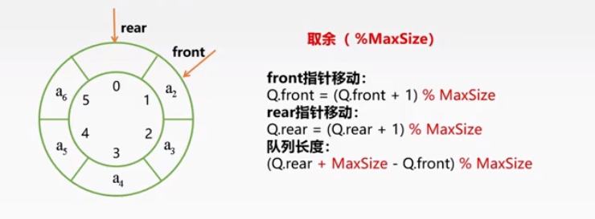

3. 判断队空与队满

   1. 方法一： 牺牲一个存储单元
      1. 队空
         1. Q.front== Q.rear
      2. 队满
         1. Q.front == （Q.rear+1）% MaxSize
   2. 方法二： 增加一个变量代表元素的个数
      1. 队空条件
         1. Q.size == 0
      2. 队满条件
         1. Q。size==MaxSize
   3. 方法三 ： 增加一个tag标识
      1. 队空
         1. Q.front == Q.rear & tag ==0;
      2. 队满条件
         1. Q.front == Q.rear & tag== -1

4. 循环队列的基本操作

   ```c++
   // 初始化
   void InitQueue(SqQueue &Q){
       Q.rear = Q.front = 0;
   }
   // 判队空
   bool isEmpty(SqQueue Q){
       if(Q.rear == Q.front){
           return true
       }else{
           return false;
       }
   }
   //入队
   bool EnQueue(SqQueue &Q, ElemType x){
       if((Q.rear+1)% MaxSize == Q.front){
           return false；
       }
       Q.data[Q.rear] = x;
       Q.rear = (Q.rear+1)%MaxSize;
       return true;
   }
   //出队
   bool DeQueue(SqQueue &Q, ElemType &x){
   
       if(q.rear == q.front){
           return false;
       }
       x = q.data[q.front];
       q.front = (q.front+1)%MaxSize;
   	return true;
   }
   ```

#### 3) 队列的链式存储

1. 带有头结点

2. 定义

   ```c++
   typedef struct{
       ElemType data;
       struct LinkNode *next;
   }LinkNode;
   typedef struct{
       LinkNode *front , * rear;
       
   }LinkQueue
   ```

3. 初始化

   

4. 判队空

   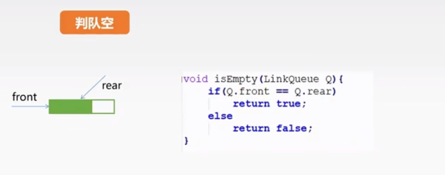

5. 入队

   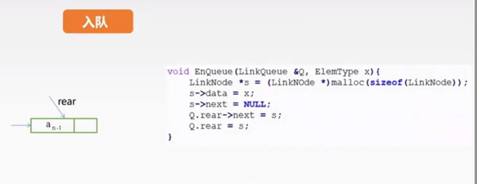

6. 出队

   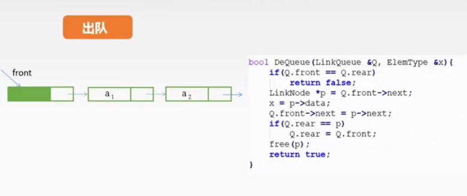

   

#### 4） 双端队列

##### a、输出序列

1. 连续输入和输出

   1. 队列是 ： 输入序列与输出序列是一样的
   2. 栈是：输入序列与输出序列是相反的

2. 不连续输入和输出

   1.  栈 ：出栈序列中每一个元素后面所有比它小的元素组成一个递减序列

      1. 合法出栈序列的个数 ： 

         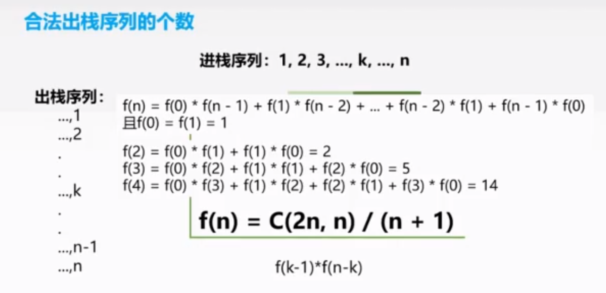

##### b、双端队列

1. 双端队列容许两端都可以进行入队以及出队操作的队列

2. 分类

   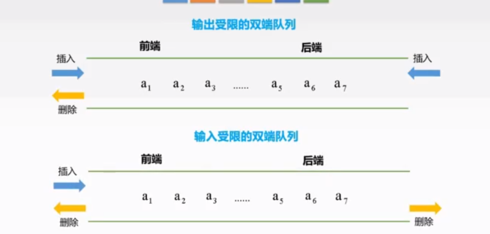

   

### 3.3 栈和队列的应用

#### 1) 栈的应用

##### a、括号匹配

1. 算法思想
   1. 初始一个空栈，顺序读入括号
   2. 若是右括号，则与栈顶元素进行匹配
      1. 若匹配，则弹出栈顶元素并进行下一个元素
      2. 若不匹配，则该序列不合法
   3. 若是左括号，则压入栈中
   4. 若全部元素遍历完毕，栈中非空则序列不合法

##### b、表达式求值

1. 算法思想
   1. 数字直接加入后缀表达式
   2. 运算符时：
      1. 若为（ ，入栈
      2. 若为 ）， 则依次把占中的运算符计入后缀表达式，知道出现（ ，并从栈中删除 （；
      3. 若为+ ，- ,*,/,
         1. 栈空，入栈
         2. 栈顶元素为（ ，入栈
         3. 高于栈顶元素优先级，入栈
         4. 否则，依次弹出栈顶运算符，知道一个优先级比它低的运算符或（ 为止；
      4. 遍历完成，若栈非空依次弹出所有元素

##### c、递归

递归 ： 若在一个函数、过程或数据结构的定义中又应用了它自身，则称他为递归定义的

==递归的精髓在于能否将原始问题转换为属性相同但规模较小的问题==

1. 递归出现的问题
   1.  **开辟工作栈来进行数据存储，递归次数过多容易造成栈溢出**
   2. 通常情况下，递归的效率并不高
   3. **递归算法转换为非递归算法，往往需要借助栈进行**

### 3.4 特殊矩阵的压缩矩阵

#### 1）矩阵

1. 压缩存储 ： 指多个==值相同==的元素只分配==一个==存储空间，对==零元素==不分配存储空间

2. 特殊矩阵 ： 指具有许多相同矩阵元素或零元素，并且这些==相同矩阵元素或零元素==的分布有一定规律性的矩阵

3. 特殊的矩阵的压缩存储： 找出特殊矩阵中值相同的矩阵元素的分布规律，把那些呈现规律性分布、值相同的多个矩阵元素==压缩存储到一个存储空间上==。

   1. 对称矩阵：关于对角线对称

      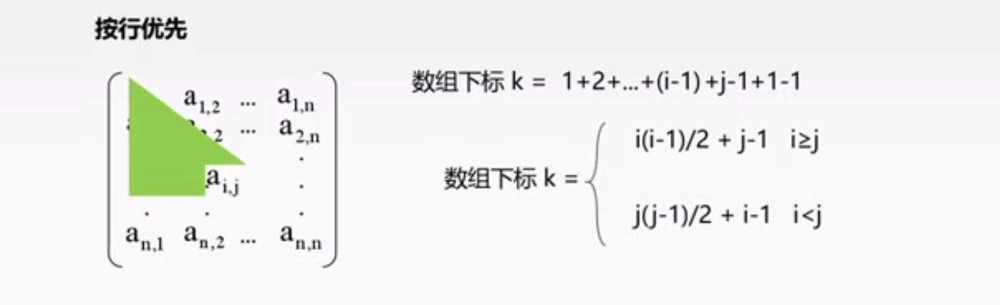

   2. 三角矩阵：

      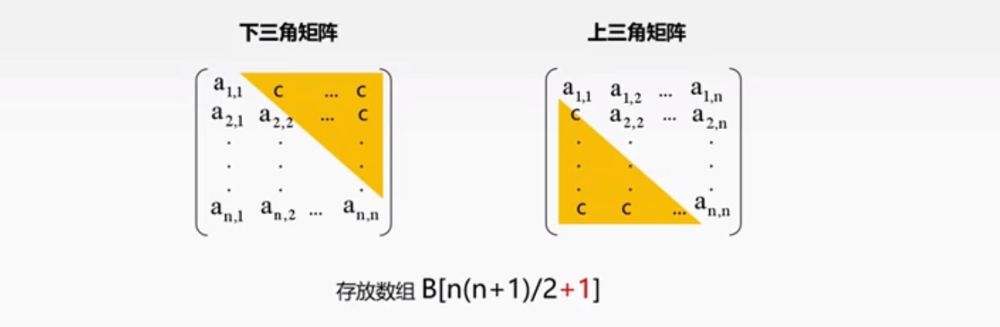

   3. 三对角矩阵

      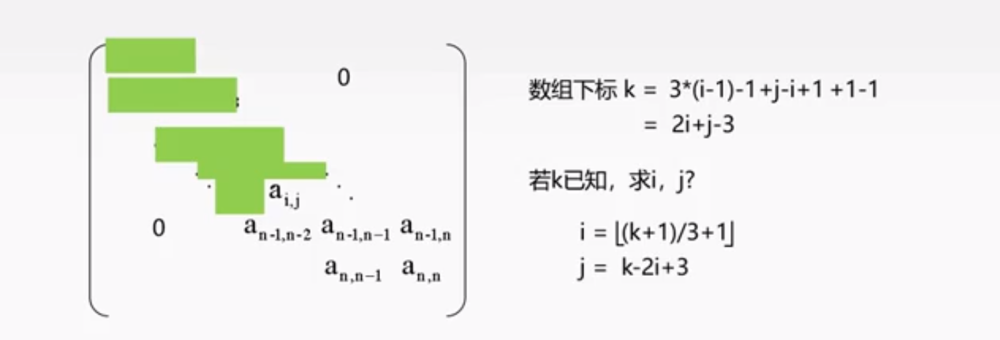

   4. 稀疏矩阵：矩阵元素个数s 相对于矩阵中非零元素的个数来说非常多

      1. 通过三元组进行 压缩，
      2. 但是失去了 随机存储的特性

#### 2）数组

1. 数组具有维度
2. 数组的维度和维界不可变
3. 只有存储和修改的操作
4. 存储结构： 顺序存储
   1. 用数组类型去保存
5. 计算 行存储和列存储的 ，位置，
   1. 这个 是有公式的，==必须要记住==

## 四、树与二叉树

### 4.1 树的基本概念

#### 1） 树的基本概念

> 树 是 N( N >= 0) 个节点 的有限集合，n=0时，称为空树
>
> 	而任意非空树应满足
> 	
> 			1） 有且仅有一个特定的称为根的节点
> 	
> 			2） 当n>1时，其余节点可分为m 个互不相交的有限							集合，其中每一个集合本身又是一棵树，称为根							节点的子树

==n个结点的树只有n-1条边==

> 树中一个结点的子节点的个数称为该结点的度
>
> ==树中最大的度数称为树的度==
>
> 度大于0 的结点称为分支结点
>
> 度为0 的结点称为叶子结点


> ==树的高度（深度） 是树中结点的最大层数==

1. 树的性质
   	1. 树中的结点树等于所有结点的度数+1
    	2. 度为m的树中第i层上之多有m^(i-1)个节点(i>=1)
    	3. 高度为h的m叉树至多有(m^h -1) / ( m -1) 个结点
    	4. 具有n个结点的m叉树的最小高度为[$log_ m(n(m-1)+1)$]


### 4.2 二叉树的概念

#### 1）二叉树的定义

1. 二叉树

   > 二叉树 是n 个结点的有限集合。
   >
   > 1） n=0 ，二叉树为空
   >
   > 2） n >0,  由根节点和两个互不相交的被称为根的左子树和右子树组成，左子树和右子树也分别是一颗二叉树

2. 五种基本形态

   

3. 二叉树 VS 度为2 有序树

   1. 二叉树可以为空，而度为2 的有序树至少有三个结点
   2. 二叉树的孩子结点始终有左右之分，而度为2 有序树的孩子结点次序是相对的。

4. 满二叉树：

   > 一颗高度为h，且含有$2^h -1$ 个结点的二叉树为满二叉树
   >
   > 	==对于编号为i 的结点，若存在，其双亲的编号为【i/ 2】,左孩子为2i，有孩子为2i+1==
   
5. 完全二叉树

   > 设一个高度为h，有n个结点的二叉树，当且仅当其每个结点都与高度为h的满二叉树中编号1~n的结点一一对应，称为完全二叉树
   >
   > 性质：
   >
   > 		1） 若 i<= n/2(取整)， 则结点i为分支结点，否则为叶子结点
   > 	
   > 		2） 叶子结点只可能在层次最大的两层出现。对于最大层次的叶子结点，都依次排在最左边的位置上
   > 	
   > 		3） 度为1 的结点若存在，则可能有一个，且是编号最大的分支节点，并孩子结点一定是左结点

6. 二叉排序树

   > 一个二叉树，若树非空则具有如下性质：
   >
   > 	对任意结点若存在左子树或右子树，则其左子树上所有结点的关键字均小于该节点，右子树所有结点均大于该节点

7. 平衡二叉树

   > 树上==任意结点== 的左子树和右子树的深度只差不超过1

8. 二叉树的性质

   1. 非空二叉树的叶子结点数等于度为2 的结点数 加 1，即 $n0 = n2 + 1$
2. 非空二叉树第k层上至多有$_2[k-1]$
   
   3. 高度为h 的二叉树至多有$2^H-1$个结点
4. 对完全二叉树按从上到下，从左到右的顺序依次编号1到n，则有以下关系
   
   - 当i > 1 是，结点i 的双亲结点标号为(i/2)取整，即当i为偶数时，其双亲结点的编号为i/2 ,他是双亲结点的左孩子；当i为奇数时，其双亲结点的编号为（i-1）/2,他是双亲结点的右孩子
      - 当2i <= n 时，结点i 的左孩子编号为 2i，否则无左孩子
   - 当2i +1 <= n 时，结点i的右孩子编号为2I+1，否则无右孩子
   5. 具有 n个 结点的完全二叉树的高度%$log_2n $+1 或$log_2(n+1)$
   
#### 2） 二叉树的存储结构

##### a、顺序存储

1. 用一组连续的存储单元依次自上而下、自左至右存储完全二叉树的结点元素
2. 在完全二叉树中依次编号，对于结点i：
   1. 若存在左孩子 ，则编号为2i，
   2. 若存在右孩子，则编号为2i+1； 
3. ==顺序存储适用于完全二叉树，但不适用其他==，会造成空间浪费

##### b、链式存储

1. 用链表俩存放一颗二叉树，二叉树中每个结点用链表的一个链接点来存储

   ```c++
   typedef struct BiTNode{
       ElemType data;
       struct BiTNode *lchild,*rchild;
   }BiTnode, * BiTree;
   ```

   

2. 含有n个结点的二叉链表中，有n+1个空链域

### 4.3 二叉树的遍历

分为 **先序遍历**，**中序遍历**，**后序遍历**

#### 1） 先序遍历

> 若二叉树非空
>
> 1） 访问根节点
>
> 2） 先序遍历左子树
>
> 3） 先序遍历右子树

1. 递归算法

   ```c++
   void PreOrder(BiTree T){
       if(T != NULL){
           Visit(T);
           PreOrder(T -> lchild);
           PreOrder(T -> rchild);
       }
   }
   
   ```
#### 2）中序遍历

   >
   >若二叉树非空
   >
   >1）中序遍历左子树
   >
   >2）访问根节点
   >
   >3）中序遍历右子树

```c++
   void InOrder(BiTree T){
       if(T != null){
           InOrder(T->lchild);
           visit(T);
           InOrder(T->rchild);
       }
   }

```


#### 3）后序遍历

> 若二叉树非空
>
> 1） 后序遍历左子树
>
> 2）后序遍历右子树
>
> 3） 访问根节点

```c++
   void PostOrder(BiTree T){
       if(T != null){
           PostOrder(T->lchild);
           PostOrder(T->rchild);
           visit(T);
       }
   }
```

#### 4) 中序遍历非递归算法

1. 借助栈

   > 算法思想：
   >
   > 1） 初始时依次扫买哦根节点的所有左侧结点并将它们一一进栈
   >
   > 2） 出栈一个结点，访问它
   >
   > 3）扫描该节点的右孩子结点并将其进栈
   >
   > 4）依次扫描右孩子的所有左侧结点并一一进栈
   >
   > 5）反复该过程知道栈为空

```c++
void InOrder2(BiTee T){
    InitStack(S);BiTree p =T;
    while(p || !IsEmpty(S)){
        if(P){
            Push(S,p);
            P = p->lchild;
        }else{
            Pop(S,p);visit(p);
            p=p->rchild;
        }
    }
}
```

#### 5) 线索二叉树

1. 概念

   

2.  存储结构

   

   

3. 中序线索二叉树 ： 寻找前驱和后继

   

4. 中序线索二叉树线索化

   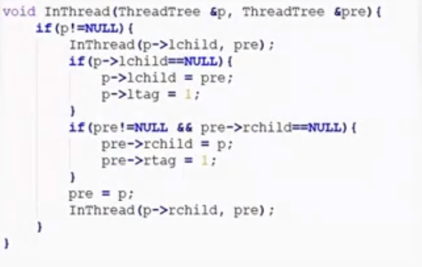

   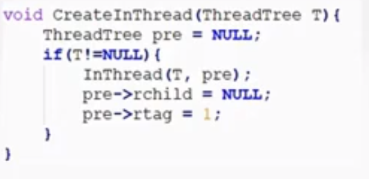

5. 中序线索二叉树的遍历

   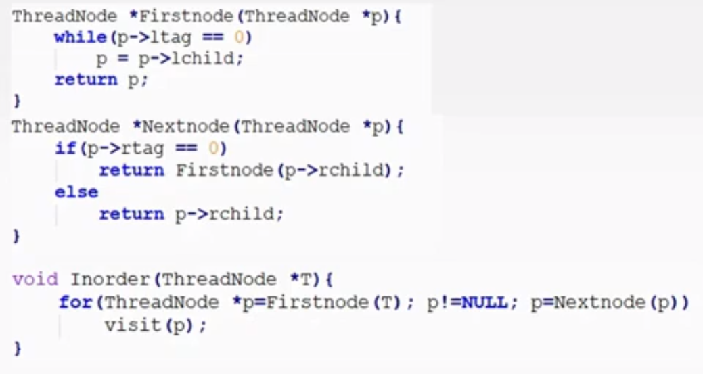


### 4.4  树和森林

#### 1） 树的存储结构

##### a、双亲表示法

1. 采用一组连续的存储空间来存储每个结点，同时在每个节点中增设一个伪指针，指示双亲结点在数组中的位置，根节点的下标为0，其伪指针域为-1

   ```c++
   #define MAX_TREE_SIZE 100
   typedef struct{
       ElemType data;
       int parent;
   }PTNode;
   
   typedef struct{
       PTNode nodes[MAX_TREE_SIZE];
       int n;
   }PTree
   ```

    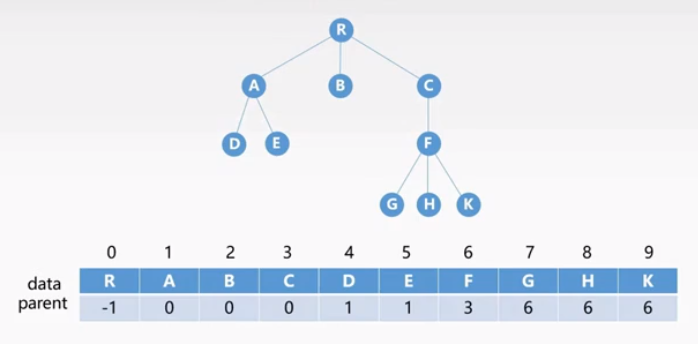

##### b、孩子表示法

1. 将每个结点的孩子结点都用单链表链接起来形成一个线性结构，n个结点具有n个孩子链表

   ```c++
   #define MAX_TREE_SIZE 100
   //每一个孩子的结构体
   typedef struct{
       int child;
       struct CNode *next;
   }CNode;
   //每个指针的元素和头指针
   typedef struct{
       ElemType data;
       struct CNode *child;
   }PNode;
   //描述一个树，用数组来表示
   typedef struct{
       PNode nodes[MAX_TREE_SIZE];
       int n;
   }CTree;
   ```

   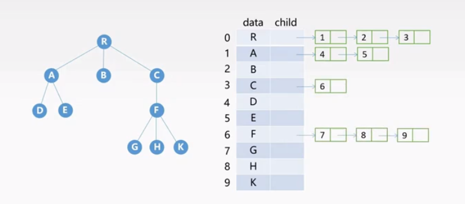

##### c、孩子兄弟表示法

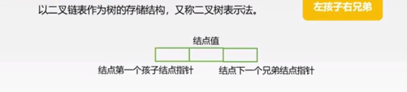

 ```c++
typedef struct CSNode{
    ElemType data;
    struct CSNode *firstchild , *nextsibling;
}CSNode,CSTree;
 ```

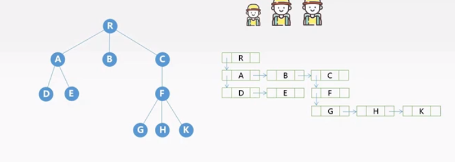

| 存储结构       | 优点                                             | 缺点                     |
| -------------- | ------------------------------------------------ | ------------------------ |
| 双亲表示法     | 寻找结点的双亲结点效率高                         | 寻找结点的孩子结点效率低 |
| 孩子表示法     | 寻找结点的孩子结点效率高                         | 寻找结点的双亲结点效率低 |
| 孩子兄弟表示法 | 寻找结点的孩子结点效率高，方便实现树转换为二叉树 | 寻找结点的双亲结点效率低 |


#### 2） 树、森林与二叉树的转换

##### a、树与二叉树的转换

1. 规则 ： ==每个结点做指针指向它的第一个孩子结点，右指针指向它在树中相邻兄弟结点==

2. ==左孩子右兄弟==

   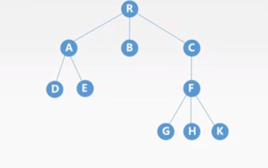

   ​	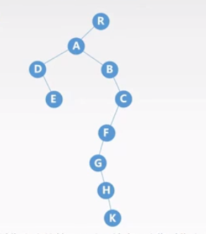

##### c、森林与二叉树的转换

1. 规则 ： ==将每一棵树转换为二叉树，将每棵二叉树的根依次作为上一棵二叉树的右子树==

   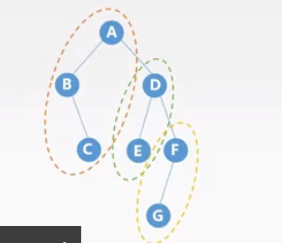

   ​		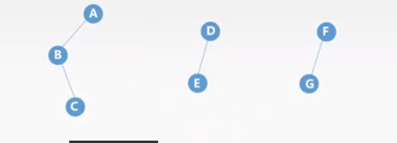

##### d、树和森林的遍历

1. 树的遍历 ： 按照某种方式访问树中的每个结点，且仅访问依次

   1. 先根遍历 ： 若树非空，则先访问根结点，再按从左到右的顺序遍历根节点的每棵子树
      - ==树的先根遍历序列与这棵树对应二叉树的先序遍历序列相同==
   2. 后根遍历 ： 若树非空，则先按从左到右的顺序遍历根节点的每棵子树，再访问根节点
      - 树的后根遍历序列与这棵树对应二叉树的中序遍历序列相同
   3. 层次遍历 ： 

2. 森林的遍历

   1. 先序遍历 ： 若森林非空，则 ① 访问森林中第一棵树的根结点 ② 先序遍历第一棵树的子树森林③ 先序遍历除去第一棵树之后剩余的树构成的子树森林
      - 森林的先序遍历序列与森林对应二叉树的先序遍历序列相同
   2. 中序遍历 ： 若森林为空，则①中序遍历第一棵树的根节点的子树森林②访问第一棵树的根节点③中序遍历除去第一棵树之后剩余的树构成的子树森林
      - 森林的中序遍历序列与森林对应二叉树的中序遍历序列相同

3. 对应关系

   | 树       | 森林     | 二叉树   |
   | -------- | -------- | -------- |
   | 先根遍历 | 先序遍历 | 先序遍历 |
   | 后根遍历 | 中序遍历 | 中序遍历 |

#### 3）树的应用并查集

1. 并查集 ： 一种简单的集合表示

   > 通常用树的==双亲表示法==作为并查集的存储结构
   >
   > 通常有那个数组元素的下标代表元素名，用根节点的下标代表子集合名，根节点的双亲结点为负数

   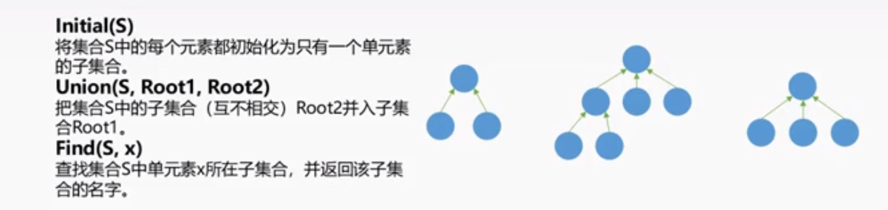

   1. 例子

      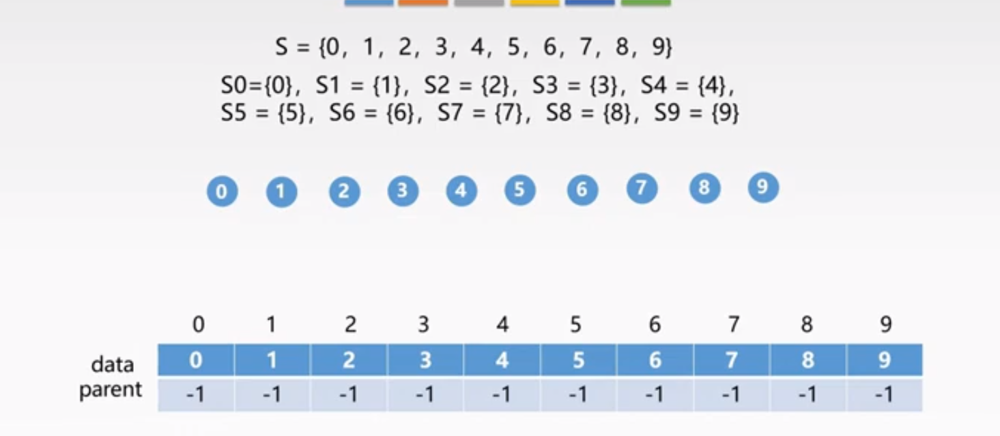

      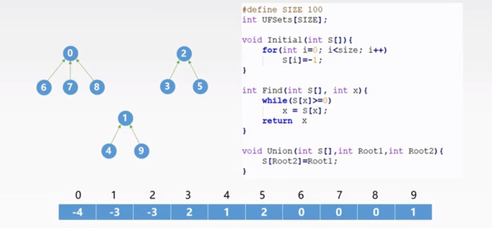

      

   


