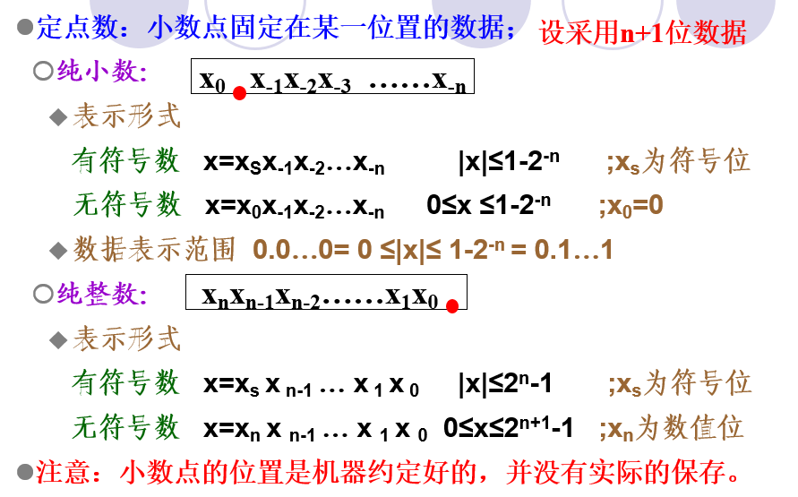
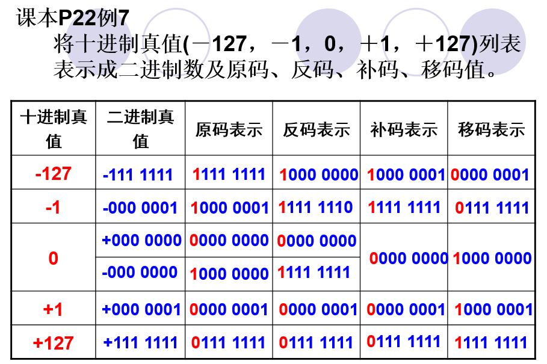
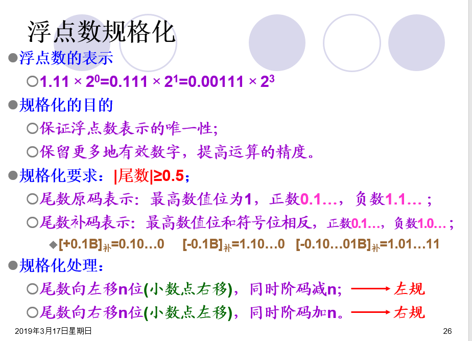
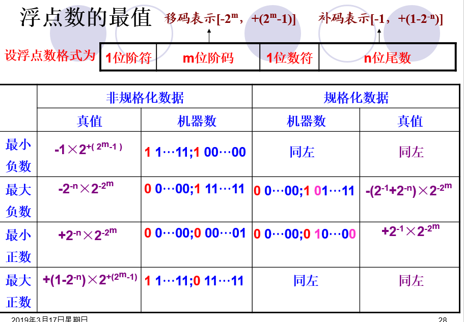
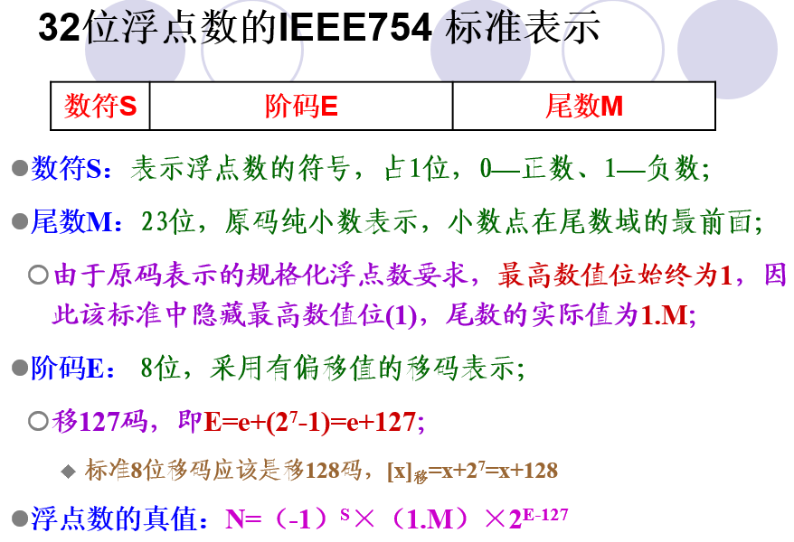

# 计算机组成原理


## 第一章 ： 计算机系统概论

1. 计算机的性能指标

   1. 吞吐量 ： 表征一台计算机在某一时间间隔内能够处理的信息量

   2. 相应时间： 从==输入有效==到系统==产生相应==之间的时间度量，用时间单位来表示

   3. 利用率 ： 在给定的时间间隔内，，系统被实际使用的时间所占的比率吗，用百分比表示

   4. 处理机字长(机器字长) ： 

      1. 处理机运算器中一次能够完成二进制运算的位数，如 32,64等

      2. 机器字长和系统数据总线宽度具有一定的相关性

   5. 总线宽度： 一般指运算器与存储器之间的数据总线宽度

   6. 主存储器容量

      1. 主存储器 所能存储二进制数据的位数

         * 或者说-“主存储中所有存储元的总数目“，而非存储单元

   7. 主存储器带宽 ： 单位时间内从主存储器读出的二进制信息量，一般用字节数/秒显示

      1. 主频/时钟周期： 主时钟的频率f 叫CPU 的主频

   8. CPU 执行时间 ： cpu执行一般程序所占用的CPU时间

      1. CPU执行时间 = 程序的总时钟周期数 * CPU时钟周期

   9. CPI

      1. 执行一条指令所需的平均时钟周期数

       - 平均CPI = 某程序总的CPU时钟周期数 / 该程序包含的指令条数

    10.  MIPS 

      - 每秒 百万指令数，即单位时间内执行的指令数
      - MIPS = 指令数 / 程序执行时间

   11. FLOPS
       1. 每秒百万次浮点操作数，衡量机器浮点操作的性能
       2. FLOPS = 程序中的浮点操作次数 / 程序执行时间(s)

   ```TXT
   用一台50MHz处理机执行标准测试程序，它包含的混合指令数和相应所需的平均时钟周期数如下表所示：
   指令类型   指令数目 	平均时钟周期数
   整数运算	45000			1	
   数据传送	32000			2
   浮点运算	15000			2
   控制传送	8000			2
   
   求有效CPI、MIPS、处理机程序执行时间tCPU。
   ```

   解 ：


## 第二章： 运算方法和运算器

1. 数据的类型

   1. 按数制分：
      - 十进制，二进制，十六进制

   2. 按数据格式分：
      - 真值 ： 没有经过编码的直观数据表示方式
      - 机器数 ： 符号 化后的数值表示

   3. 按数据的表示范围分
      - 顶点数 ： 小数点位置固定，数据表示范围小
      - 浮点数 ： 小数点位置不固定，数据表示范围较大
   4. 按能否表示负数分
      - 无符号数 ： 数据所有值均为表示数值
      - 有符号数： 有正负分，，，最高位为符号位

2. 数据格式 

   1. 顶点数
       - 顶点数 的特点
          - 所能表示的数据范围小，
          - 数据精度较低
          - 存储单元利用低
       - 

   2. 有原码到补码

      1. 除符号位以外，其余各位按位取反，末位加1；
      2. 除符号位以外，从最低位开始，遇到的第一个1以前的各位保持不变，之后各位去反

   3. **原、补、移码的编码形式**

      1. **原码和补码**

         1.  正数
            1. 原、补码的编码完全相同
         2. 负数
            1. 符号位为1
            2. 数值部分与原码各位相反，且末位加1
      2. 补码和移码

         1. 无论正数还是负数
            1. 符号位相反，数值位相同
      3. 

   4.  数据格式  --- 浮点数

       1. 浮点数定义 ： N = R^e * M

           1. M为尾数 ， 是一个纯小数，表示数据的全部有效数位，其位数决定这数值的精度
           2. R为基数， 可以取2,8,10,16 表示当前的数制；
           3. e 为阶码 ， 是一个整数，用于支出小数点在该数中的位置，其位数决定着数据的取值范围

       2. 机器数的一般表示形式

           1.  | --   | --   | --   | --   |
               | ---- | ---- | ---- | ---- |
               | 阶符 | 阶码 | 数符 | 尾数 |
               | 数符 |阶符 | 阶码 |  尾数    |

               

       3. 浮点数的规格化

           1. 
           2. 浮点数的最值
               1. 

       4. 32位浮点数的IEEE754标准显示

           1. 
           2. 


