[1. 重要和要求](#1-重要和要求)

[2. 第一章概述](#2-第一章概述)    
- [2.1. 计算机网络的分类](#21-计算机网络的分类)    
- [2.2. 计算机网络向用户提供的最重要的功能:连通和共享](#22-计算机网络向用户提供的最重要的功能连通和共享)    
- [2.3. 三种交换技术及实例(电路、报文和分组交换)](#23-三种交换技术及实例电路报文和分组交换)    
- [2.4. 网络协议的基本概念、协议与服务的关系](#24-网络协议的基本概念协议与服务的关系)    
- [2.5. 网络的主要性能指标的含义、单位及应用（带宽、时延、时延带宽积）](#25-网络的主要性能指标的含义单位及应用带宽时延时延带宽积)    
- [2.6. 五层体系结构的层次及各层的主要作用](#26-五层体系结构的层次及各层的主要作用)    
- [2.7. OSI和TCP/IP的层次模型](#27-osi和tcpip的层次模型)

[3. 第二章_物理层](#3-第二章_物理层)  

- [3.1. 物理层接口的主要特征](#31-物理层接口的主要特征)   
- [3.2. 奈氏准则，波特率和比特率的关系](#32-奈氏准则波特率和比特率的关系)   
- [3.3. 香农公式，信道中的极限信息传输速率和带宽及信噪比的关系](#33-香农公式信道中的极限信息传输速率和带宽及信噪比的关系)    
- [3.4. 常见的物理传输媒体及特性，平行线、交叉线的应用](#34-常见的物理传输媒体及特性平行线交叉线的应用)
- [3.5. 通信的三种基本方式（单向、双向交替和双向同时）](#35-通信的三种基本方式单向双向交替和双向同时)  
- [3.6. 信道复用技术的种类及其主要特征（FDM, TDM, WDM, CDMA等）](#36-信道复用技术的种类及其主要特征fdm-tdm-wdm-cdma等)    
- [3.7. CDMA的简单应用](#37-cdma的简单应用)    
- [3.8. 常用带宽接入技术](#38-常用带宽接入技术)

[4. 第三章_数据链路层](#4-第三章_数据链路层)    
- [4.1. 数据链路层的三个基本问题](#41-数据链路层的三个基本问题)    
- [4.2. PPP协议及其透明传输的实现（同步传输连续5个1）](#42-ppp协议及其透明传输的实现同步传输连续5个1) 
- [4.3. 差错检测技术（CRC应用）](#43-差错检测技术crc应用)    
- [4.4. 以太网的拓扑类型、协议标准、数据编码等基本概念](#44-以太网的拓扑类型协议标准数据编码等基本概念)
- [4.5. CSMA/CD协议的工作过程，争用期、最短帧长等概念和应用](#45-csmacd协议的工作过程争用期最短帧长等概念和应用)    
- [4.6. 以太网的MAC地址及帧格式](#46-以太网的mac地址及帧格式)    
- [4.7. 交换机的自学习算法](#47-交换机的自学习算法)    
- [4.8. 集线器、交换机对网络冲突域、广播域及带宽的影响](#48-集线器交换机对网络冲突域广播域及带宽的影响)
- [4.9. VLAN的基本概念和应用](#49-vlan的基本概念和应用)

[5. 第4章 网络层](#5-第4章-网络层)    

- [5.1. 网络层提供的两种服务方式及特点（虚电路和数据报）](#51-网络层提供的两种服务方式及特点虚电路和数据报)    
- [5.2. IP地址分类，与硬件地址的关系（ARP），传输过程中的变化，分片](#52-ip地址分类与硬件地址的关系arp传输过程中的变化分片)    
- [5.3. 子网的划分，会求子网数、主机数、子网号、子网掩码等](#53-子网的划分会求子网数主机数子网号子网掩码等)    
- [5.4. CIDR的基本概念和应用（路由聚合、地址块分配、地址数、掩码等）](#54-cidr的基本概念和应用路由聚合地址块分配地址数掩码等)    
- [5.5. IP数据报格式](#55-ip数据报格式)    
- [5.6. ICMP协议的基本概念和应用；IGMP协议的基本概念](#56-icmp协议的基本概念和应用igmp协议的基本概念) 
- [5.7. 路由算法的含义和应用（RIP应用、OSPF）](#57-路由算法的含义和应用rip应用ospf)    
- [5.8. IPv6的地址格式](#58-ipv6的地址格式)    
- [5.9. VPN和NAT的含义和作用，专用地址和私有地址](#59-vpn和nat的含义和作用专用地址和私有地址)

[6. 第五章_运输层](#6-第五章_运输层)   

- [6.1. 运输层两个主要协议的特点：TCP和UDP](#61-运输层两个主要协议的特点tcp和udp)    
- [6.2. 端口、套接字，网络中通信一端的标识](#62-端口套接字网络中通信一端的标识)    
- [6.3. 流量控制的含义和方法](#63-流量控制的含义和方法)    
- [6.4. TCP的流量控制与确认机制](#64-tcp的流量控制与确认机制)    
- [6.5. 拥塞，TCP的拥塞控制算法及应用；实际发送窗口的限制](#65-拥塞tcp的拥塞控制算法及应用实际发送窗口的限制)    
- [6.6. TCP的三次握手](#66-tcp的三次握手)

[7. 第六章_应用层](#7-第六章_应用层)    

- [7.1. DNS的基本概念及解析过程](#71-dns的基本概念及解析过程)    
- [7.2. FTP的基本概念及两个连接机制](#72-ftp的基本概念及两个连接机制)    
- [7.3. 万维网的基本概念，HTTP的请求时间](#73-万维网的基本概念http的请求时间)    
- [7.4. 电子邮件的基本概念、收发协议；基于万维网的电子邮件发送和接收中采用的协议](#74-电子邮件的基本概念收发协议基于万维网的电子邮件发送和接收中采用的协议)    
- [7.5. DHCP的用途](#75-dhcp的用途)

# 1. 重要和要求

1 重点

* 第三章
* 第四章
* 第五章

2 要求

* 习题可能有考试题，或者是相关的，，
* 计网重在理解，死记硬背，真的太多了

# 2. 第一章概述

## 2.1. 计算机网络的分类 

1 按网络的作用范围进行分类

* 广域网WAN
* 城域网MAN
* 局域网LAN
* 个人局域网PAN

2 按网络的使用者进行分类.

* 公用网 : 可以指电信公司等等
* 专用网 : 指的是某个部门的网络

## 2.2. 计算机网络向用户提供的最重要的功能:连通和共享

## 2.3. 三种交换技术及实例(电路、报文和分组交换)

1 图例比较
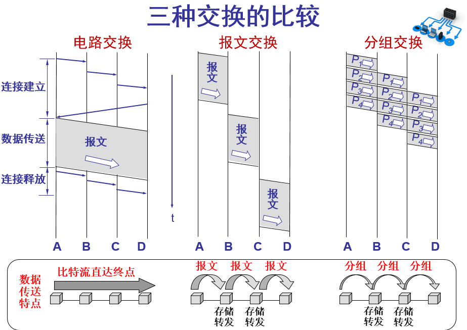 

2 三种交换方式的特点：

* 电路交换 - 整个报文的比特流连续地从源点直达终点，好像在一个管道中传送
* 报文交换 - 整个报文先传送到相邻结点，全部存储下来后查找转发表，转发到下一个结点
* 分组交换 - 单个分组(这只是整个报文的一部分)传送到相邻的结点，存储下来后查找转发表，转发到下一个结点

3 三种交换的比较

* 若要连续传送大量的数据，且传送时间远大于连接建立的时间，则电路交换的传输速率较快
* 报文交换和分组交换不需要预先分配传输带宽，在传送突发数据时可提高整个网络的信道利用率
* 由于一个分组的长度往往小于整个报文的长度，因此分组交换比报文交换的时延小，同时也具有更好的灵活性

## 2.4. 网络协议的基本概念、协议与服务的关系

1 基本概念 - 网络协议即协议，是为了进行网络中的数据交换而建立的规则。计算机网络的各层及其协议的集合，称为网络的体系结构

    网络协议的三要素： 语法，语义，同步

2 协议与服务的关系 - 在概念上是不一样的 

    协议 的实现 保证了能够向上一层提供服务
    1. 协议是 "水平的" , 即 协议 是控制对等实体之间的通信的规则
    2. 服务是 "垂直的" , 即 服务是由下层向上层通过层间接口提供的
    * 本层的服务用户只能看见服务而无法看见下面的协议，即下面的协议对上面的服务用户是透明的

## 2.5. 网络的主要性能指标的含义、单位及应用（带宽、时延、时延带宽积）

计算机网络最常用的性能指标是：速率、带宽、吞吐量、时延(发送、传播、处理、排队)、时延带宽积、往返时间和信道(或网络)利用率

1 速率 

* 指的是 数据的传送速率 ，它也称为数据率 或 比特率
* 速率往往是指额定速率或标称速率，非实际运行速率

2 带宽

* 表示在单位时间内网络中的某信道所能通过的`最高数据率`单位是bit/s 

3 吞吐量

* 表示在单位时间内通过某个网络(或信道、接口)的数据量
* 吞吐量受网络的带宽或网络的额定速率的限制

4 时延

* 是指数据从网络的一端传送到另一端所需的时间
* 有四部分组成 - 发送，传播，处理，排队

    (1) 发送时延

    * 发送数据时，数据帧从结点进入到传输媒体所需要的时间
    

    (2) 传播时延
    * 电磁波在信道上的传播的时间
    

    (3) 处理时延
    * 主机或路由器在收到分组时，为处理分组所花费的时间

    (4) 排队时延
    * 分组在路由器输入输出队列中`排队等待处理`所经历的时延
    * 排队时延 的长度 往往取决于`网络中当时的通信量`

&&& 容易产生的错误概念

* 对于高速网络链路，我们提高的仅仅是数据的`发送速率`而不是比特在链路上的传播速率

* 说法错误的- `在高速链路(高带宽链路)上，比特会传送的更快些`

5 时延带宽积

* 链路的时延带宽积 又称为 以比特为单位的链路长度

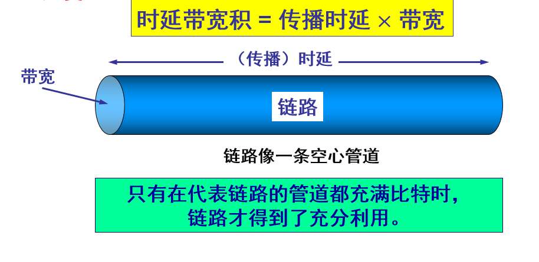

6 往返时间RTT

* 往返时间表示从发送方发送数据开始，到发送方收到确认消息，总共经历的时间
* 还包括各中间结点 的时延。

7 利用率

* 分为信道利用率和网络利用率
    (1) 信道利用率 是指出 某信道有百分之几 的时间是被利用的
    (2) 网络利用率 则是全网络的信道利用率的加权平均值
* `当某信道的利用率增大时，该信道引起的时延也就迅速增加`

8 时延与网络利用率的关系

'''
D = D0 / 1- U
D0 表示网络空闲时延
D 表示网络当前的时延
U 网络利用率 数值在0到9 之间

'''

## 2.6. 五层体系结构的层次及各层的主要作用

按照从下到上：`物理层，数据链路层，网络层，运输层，应用层`


1. 物理层 - 是要尽可能地屏蔽掉这些传输媒体和通信手段的差异，使物理层上面的数据链路层感觉不到这些差异。让数据链路层只需要考虑本层的协议和服务 ，透明的传输比特流
2. 数据链路层 -  任务是在两个相邻结点间的无差错传送以帧为单位的数据，每一帧都包含数据和必要的控制信息
3. 网络层 ： 主要是选择合适的路由，使发送站的运输层所传下来的分组能够正确无误的按照地址找到目的站，
4. 运输层 ： 是向上一层的进行通信的两个进程之间提供一个可靠的端到端服务，
5. 应用层 - 应用层直接为用户的应用进程提供服务

## 2.7. OSI和TCP/IP的层次模型


# 3. 第二章_物理层

## 3.1. 物理层接口的主要特征

1 机械特性
2 电气特性
3 功能特性
4 过程特性

## 3.2. 奈氏准则，波特率和比特率的关系

* 在任何信道中，码元传输是有上限的，传输速率超过此上限，会出现严重的码间串扰问题

## 3.3. 香农公式，信道中的极限信息传输速率和带宽及信噪比的关系

* 信噪比 就是信号的平均功率和噪声的平均功率之比。 常记为 S/N 
* 信噪比(dB) = 10 log10 ^(S/N)

* 信道的极限传输速率C可 表达为:

    ```java
    C = Wlog2 ^(1 + S/N)  单位bit/s

    其中：W 为信道的带宽（以 Hz 为单位）;
	S 为信道内所传信号的平均功率;
	N 为信道内部的高斯噪声功率。  

    ```
* 香农公式表明

    (1) 信道的带宽或信道中的信噪比越大，则信息的极限传输速率就越高。 
    (2) 只要信息传输速率低于信道的极限信息传输速率，就一定可以找到某种办法来实现无差错的传输。 
    (3) 若信道带宽 W 或信噪比 S/N 没有上限（当然实际信道不可能是这样的），则信道的极限信息传输速率 C 也就没有上限。
    (4) 实际信道上能够达到的信息传输速率要比香农的极限传输速率低不少。  

## 3.4. 常见的物理传输媒体及特性，平行线、交叉线的应用

* 传输媒体 分为 导引型传输媒体和非导引型传输媒体

1. 导引型传输媒体 : 电磁波被导引沿着固体媒体传播

2. 非导引型传输媒体 : 就是指自由空间， 电磁波的传输称为无线传输

3. 平行线和交叉线暂议

## 3.5. 通信的三种基本方式（单向、双向交替和双向同时）

1. 单向通信 : 只能有一个方向的通信而没有反方向的交互
2. 双向交替通信 : 为半双工通信 ，通信的双方都可以发送信息，但不能同时发送
3. 双向同时通信 : 全双工通信 ， 通信的双发既可以同时发送也可以同时接收

## 3.6. 信道复用技术的种类及其主要特征（FDM, TDM, WDM, CDMA等）

* 信道复用 分为 频分复用、时分复用和统计时分复用， 波分复用，码分复用
* 复用 ： 它容许用户使用一个共享信道进行通信，降低成本，提高利用率

1. 频分复用、时分复用和统计时分复用
    （1） 频分复用FDM ： 指 所有用户在同样的时间 `占用 不同的带宽`资源 
    * 带宽指的是频率带宽 而不是数据的发送速率

    （2） 时分复用TDM ： 是将时间划分为一段段等长的`时分复用帧`。
    * 每一个用户所占用的时隙是周期性地出现( 周期就是TDM 帧的长度)
    * 时分复用的所有用户是在`不同的时间 `占用`同样的频带宽度`
    (3) 统计时分复用STDM ： 不是像TDM 固定分配是按需分配的时隙，提高线路的利用率
2. 波分复用WDM
    
    * 就是光的频分复用。使用一根光纤来同时传输多个光载波信号
3. 码分复用CDM
    * 各用户 使用经过特殊挑选的不同码型，因此不会干扰彼此
    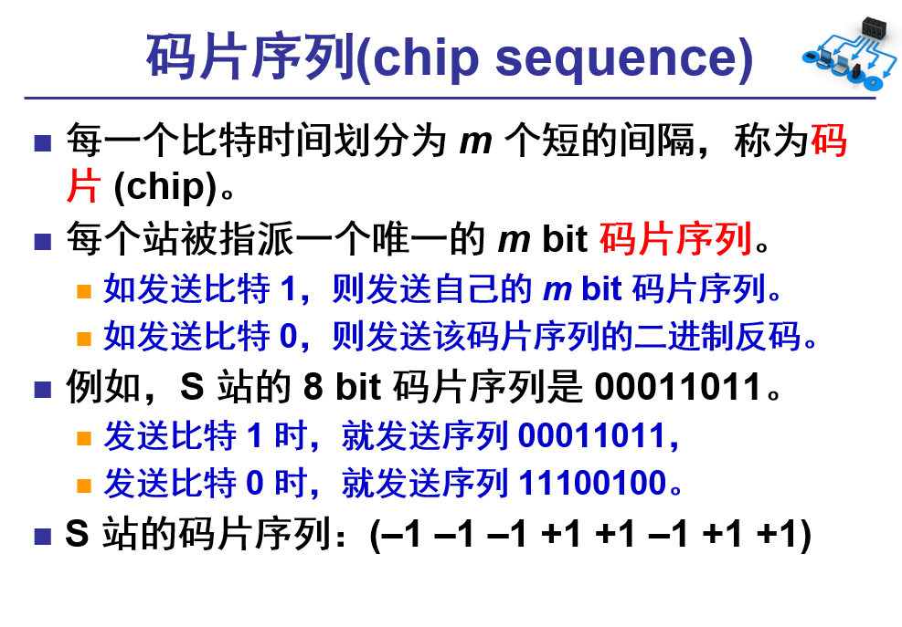
4. 码片多址CDMA 的特点
    * 每个站分配的码片序列不仅必须各不相同，并且还必须互相正交 (orthogonal)。
    * 在实用的系统中是使用伪随机码序列。 

## 3.7. CDMA的简单应用

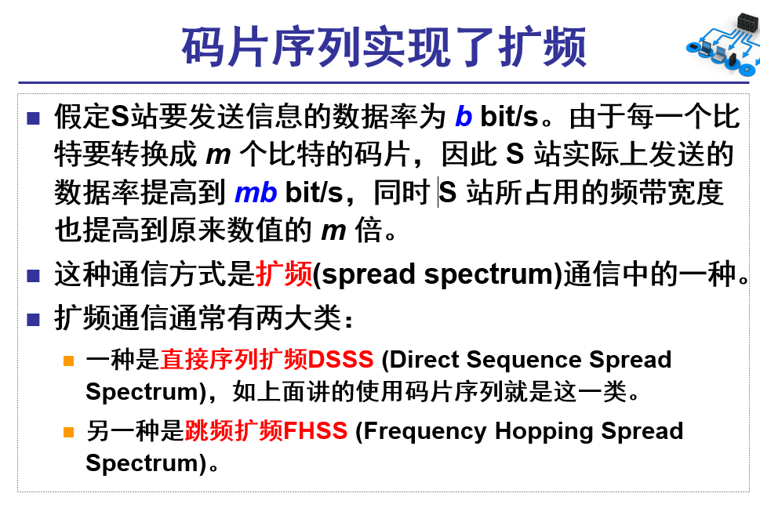

## 3.8. 常用带宽接入技术

* 首先什么是宽带 ： 只要双向速率之和超过200Kbit/s 就是宽带

1. ADSL 技术
    
* 非对称数字用户线ADSL  其实就是电话用户线改造的
    
2. 光纤同轴混合网(HFC)
    * 是将原CATV 网中的同轴电缆 主干部分改换为光纤，并使用模拟光纤技术
    * 采用光的振幅调制AM

3. FTTx 技术
    * 是一种实现宽带居民接入网的方案，代表多种宽带光纤接入方式
    ```txt
    FTTx 表示 Fiber To The…（光纤到…），例如：
     光纤到户 FTTH (Fiber To The Home)：光纤一直铺设到用户家庭，可能是居民接入网最后的解决方法。
    光纤到大楼 FTTB (Fiber To The Building)：光纤进入大楼后就转换为电信号，然后用电缆或双绞线分配到各用户。
    光纤到路边 FTTC (Fiber To The Curb)：光纤铺到路边，从路边到各用户可使用星形结构双绞线作为传输媒体。

    ```

# 4. 第三章_数据链路层

## 4.1. 数据链路层的三个基本问题

1. 封装成帧
    * 就是在一段数据的前后分别添加首部和尾部，构成一个帧。确定帧的界限
    * 首部和尾部的一个重要作用就是进行帧定界
    * 用`控制字符`进行帧定界的方法
    ```txt
    控制字符 SOH (Start Of Header) 放在一帧的最前面，表示帧的首部开始。另一个控制字符 EOT (End Of Transmission) 表示帧的结束。
    ```

2. 透明传输
    * 什么是透明传输：
    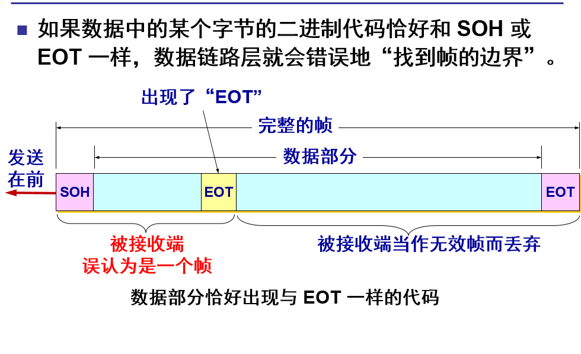
    * 解决方法 ： 字节填充 或 字符填充 
    ```txt
    1. 发送端的数据链路层在数据中出现控制字符“SOH”或“EOT”的前面插入一个转义字符“ESC” (其十六进制编码是 1B)。
    2.接收端的数据链路层在将数据送往网络层之前删除插入的转义字符。
    3.如果转义字符也出现在数据当中，那么应在转义字符前面插入一个转义字符 ESC。当接收端收到连续的两个转义字符时，就删除其中前面的一个. 
    ```
3. 差错控制
    * 在传输过程中可能会产生`比特差错` 1 可能会变成0 而也可以相反
    * 传输错误的比特占所传输比特总数的比率为误码率
    * 误码率与信噪比有很大的关系
    * 循环冗余检验的原理 
    ```txt
    1.在数据链路层传送的帧中，广泛使用了循环冗余检验 CRC 的检错技术。
    2.在发送端，先把数据划分为组。假定每组 k 个比特。 
    3.假设待传送的一组数据 M = 101001（现在 k = 6）。我们在 M 的后面再添加供差错检测用的 n 位冗余码一起发送。  
    ```
    * 冗余码的计算举例
    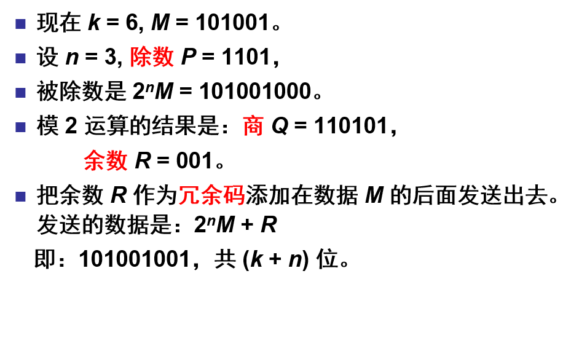
    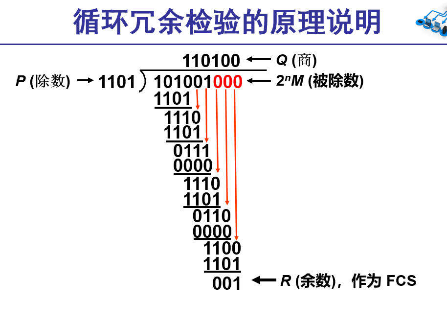
    * 帧检验序列FCS
        在数据后面添加上的冗余码称为帧检验序列FCS
        FCS 可以 通过CRC 得到，但不是唯一方法

## 4.2. PPP协议及其透明传输的实现（同步传输连续5个1）

1. ppp协议的组成：
    （1） 一个将IP 数据报分装到串行链路的方法
    （2） 链路控制协议LCP
    （3） 网络控制协议NCP
    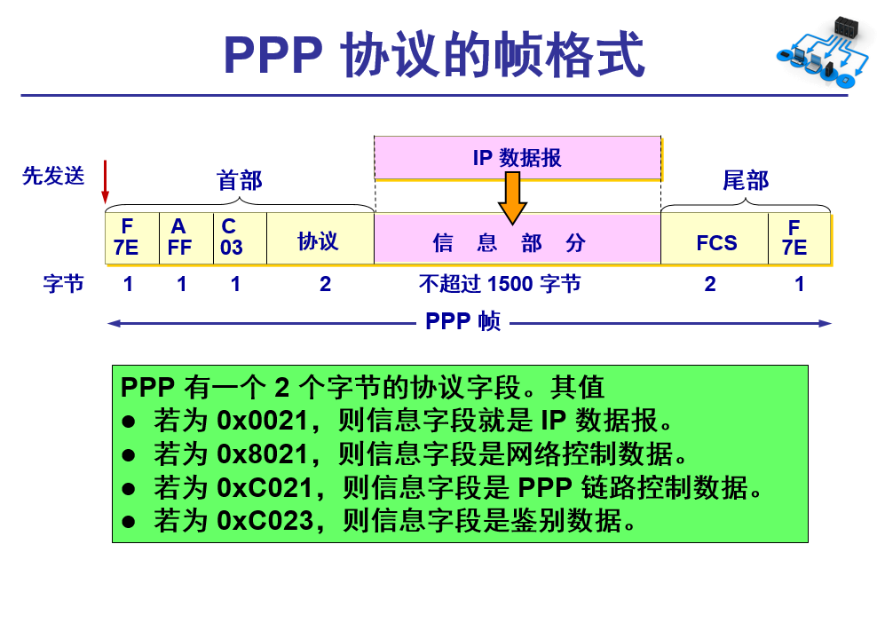
2. 透明传输的实现 
    * 同步传输 采用 `比特填充`
    * 异步传输 采用 `字符填充法`
    * 零比特填充 来实现 透明传输
    ```txt
    1.在发送端，只要发现有 5 个连续 1，则立即填入一个 0。
    2.接收端对帧中的比特流进行扫描。每当发现 5 个连续1时，就把这 5 个连续 1 后的一个 0 删除。
    ```

## 4.3. 差错检测技术（CRC应用）

## 4.4. 以太网的拓扑类型、协议标准、数据编码等基本概念

1. 拓扑结构
    星形网 ， 总线网， 环形网
2. 两个标准
    DIX Ethernet V2 
    IEEE 802.3
3. 编码格式
    以太网 发送的数据都是`曼彻斯特` 编码
    * 缺点是 ： 它所占的频带宽度比原始的基带信号增加一倍

## 4.5. CSMA/CD协议的工作过程，争用期、最短帧长等概念和应用

1. CSMA/CD 协议
    载波监听多点接入 / 碰撞检测
    * 碰撞检测就是检测 信道上的电压大小
    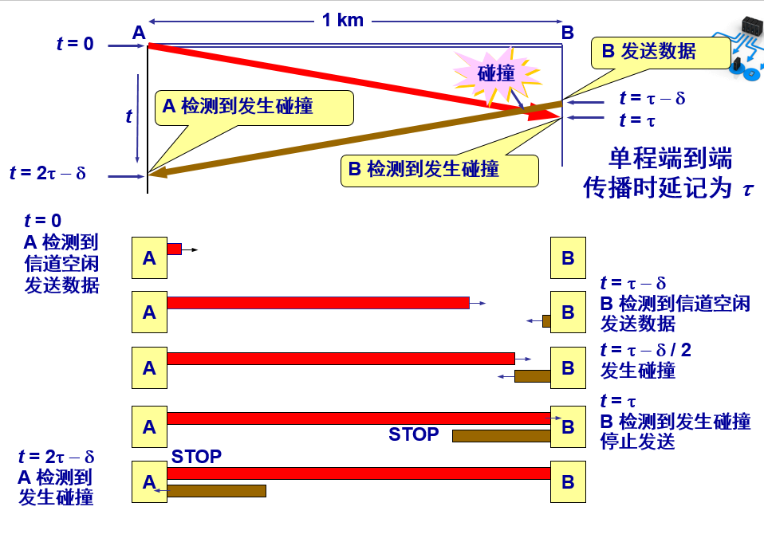
2. 争用期
    ```txt
    最先发送数据帧的站，在发送数据帧后至多经过时间 2 （两倍的端到端往返时延）就可知道发送的数据帧是否遭受了碰撞。
    以太网的端到端往返时延 2 称为争用期，或碰撞窗口。
    经过争用期这段时间还没有检测到碰撞，才能肯定这次发送不会发生碰撞。

    ```
3. 最短帧长
    * 如果发生冲突，就一定是在发送的前 64 字节之内。 
    * 由于一检测到冲突就立即中止发送，这时已经发送出去的数据一定小于 64 字节。 
    * 以太网规定了最短有效帧长为 64 字节，凡长度小于 64 字节的帧都是由于冲突而异常中止的无效帧。

## 4.6. 以太网的MAC地址及帧格式

1. MAC 地址
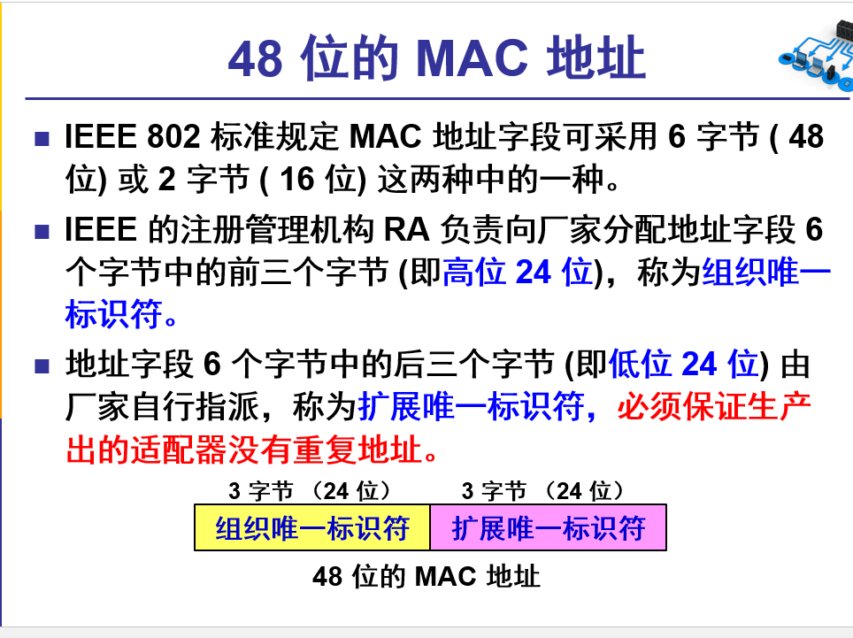

2. 发往本站的帧三种
    单播，广播，多播

3. 帧格式
    DIX Ethernet V2 标准
    IEEE 的 802.3 标准
最常用的 MAC 帧是以太网 V2 的格式。

## 4.7. 交换机的自学习算法

## 4.8. 集线器、交换机对网络冲突域、广播域及带宽的影响

## 4.9. VLAN的基本概念和应用

1. 虚拟局域网 VLAN 是由一些局域网网段构成的与物理位置无关的逻辑组，而这些网段具有某些共同的需求。每一个 VLAN 的帧都有一个明确的标识符，指明发送这个帧的计算机是属于哪一个 VLAN。

2. 虚拟局域网其实只是局域网给用户提供的一种服务，而并不是一种新型局域网。

# 5. 第4章 网络层

## 5.1. 网络层提供的两种服务方式及特点（虚电路和数据报）

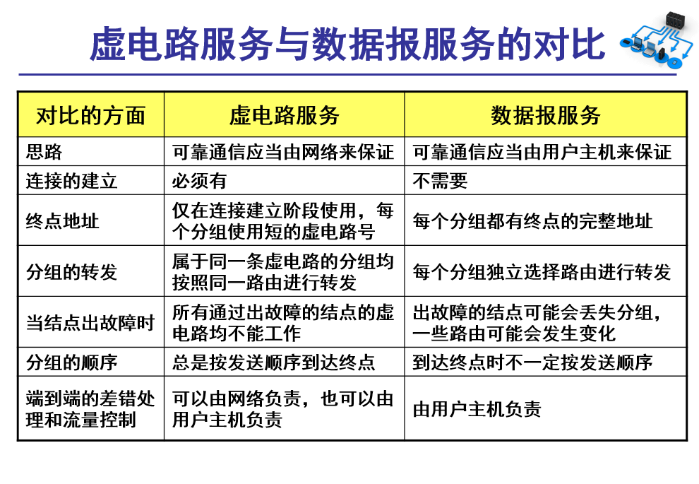

1. 虚电路 ： 逻辑连接 ，分组按照存储转发的方式传送
2. 数据报 ： 网络层只提供简单灵活的，无连接的，尽最大努力交付的数据报服务
    不提供服务质量的承诺

## 5.2. IP地址分类，与硬件地址的关系（ARP），传输过程中的变化，分片

1. IP地址分类

    * 地址结构主要为 网络号+ 主机号

    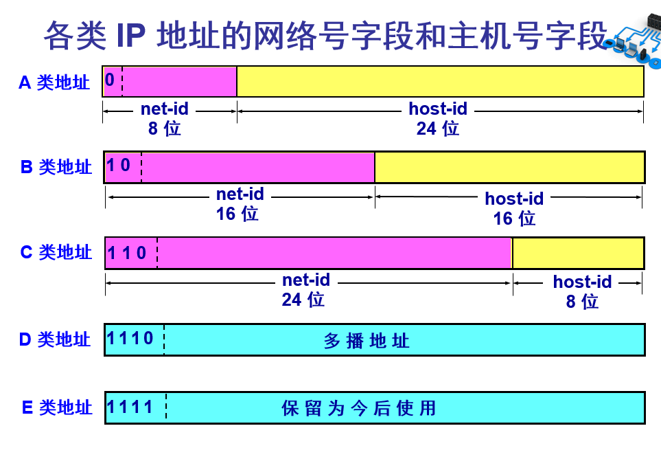

    * IP地址是`点分十进制记法` 每个8位一组，
    * 常见的三种类别的IP地址

    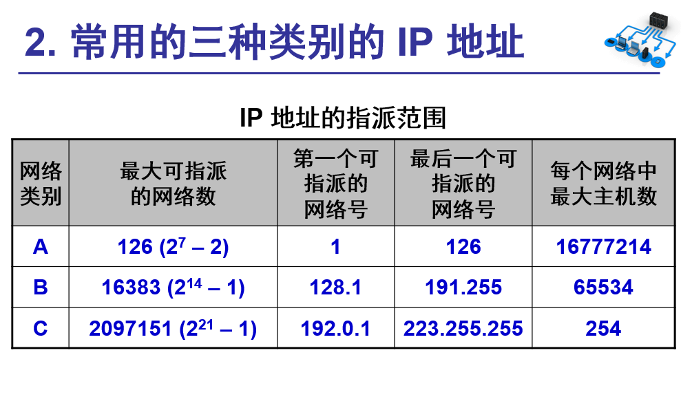

    * 特殊的IP地址
    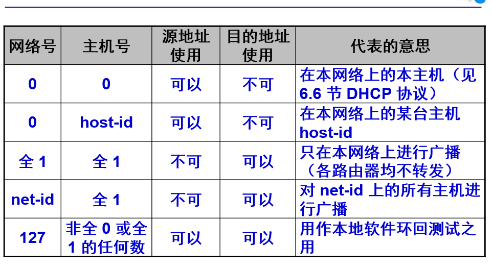

2. IP地址和MAC 的关系
    IP地址是放在IP数据报的首部
    硬件地址是放在MAC帧的首部
    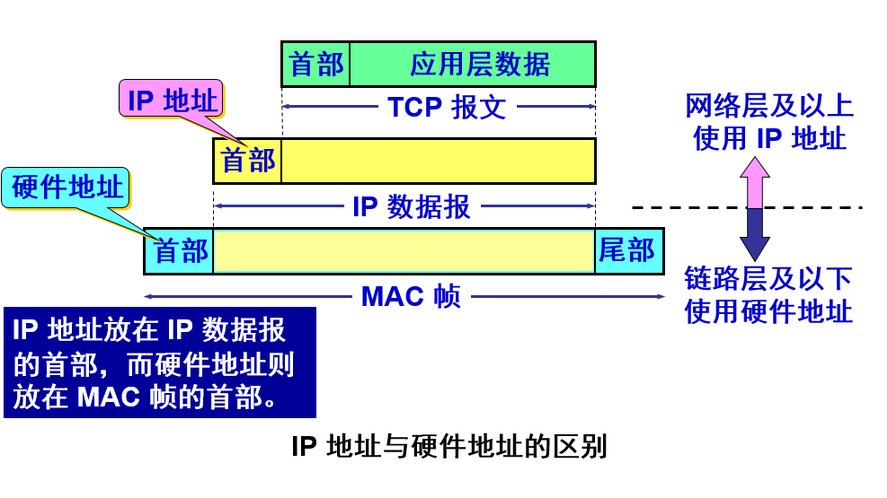
3. 地址解析协议ARP
    作用是 ： 从网络层使用的IP地址，解析出在数据链路层使用的硬件地址
    * `ARP请求分组`：包含发送方硬件地址 / 发送方 IP 地址 / 目标方硬件地址(未知时填 0) / 目标方 IP 地址。
    * `ARP 响应分组：`包含发送方硬件地址 / 发送方 IP地址 / 目标方硬件地址 / 目标方 IP 地址。
4. 分片

    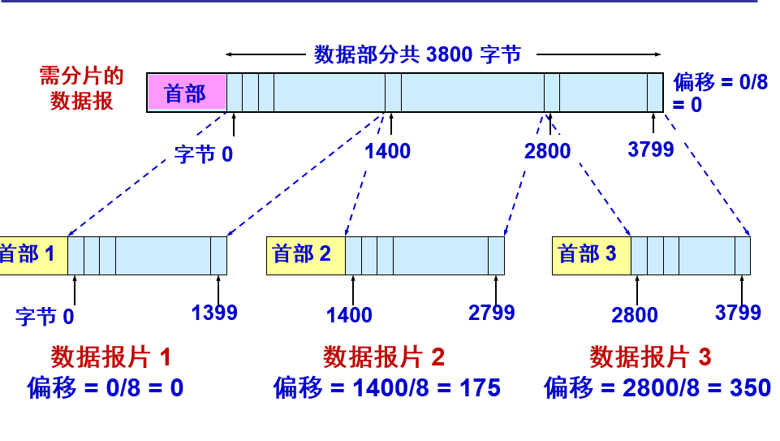

## 5.3. 子网的划分，会求子网数、主机数、子网号、子网掩码等

* 划分子网 ： 就是在主机号的借用若干位 作为子网号
    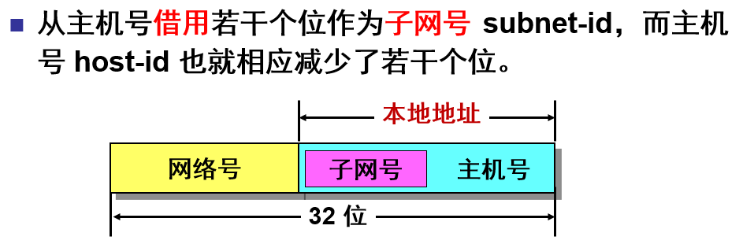
1. 子网掩码
    可以找出IP地址中的子网部分
    * 规则
        * 子网掩码长度 ＝ 32 位
        * 某位 ＝ 1：IP地址中的对应位为网络号和子网号
        * 某位 ＝ 0：IP地址中的对应位为主机号 
    * 计算方法
        `(IP地址) AND (子网掩码) = 网络地址`
    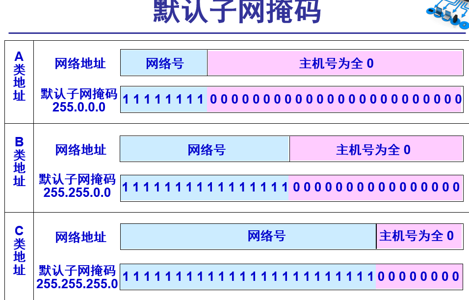
2. 子网划分方法
    有固定长度子网和变长子网 两种方法
    `在采用固定长度子网时，所划分的所有子网的子网掩码都是相同的`
    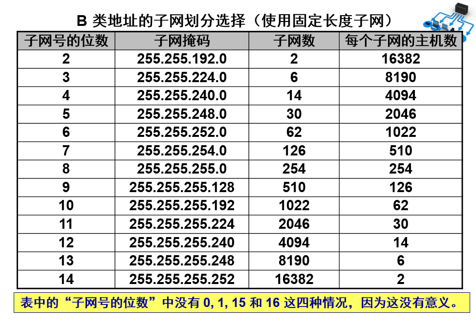
* 例题
    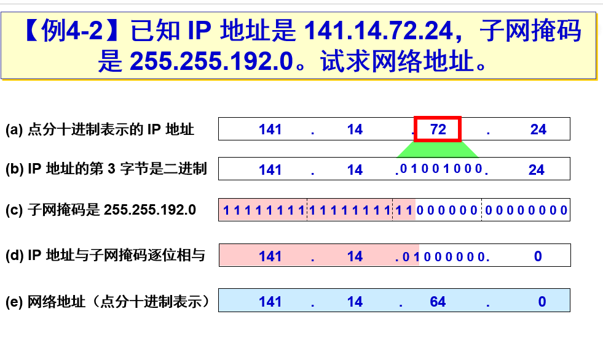

## 5.4. CIDR的基本概念和应用（路由聚合、地址块分配、地址数、掩码等）

1. CIDR 把网络前缀都相同的连续的IP地址组成 CIDR 地址块

2. 路由聚合
    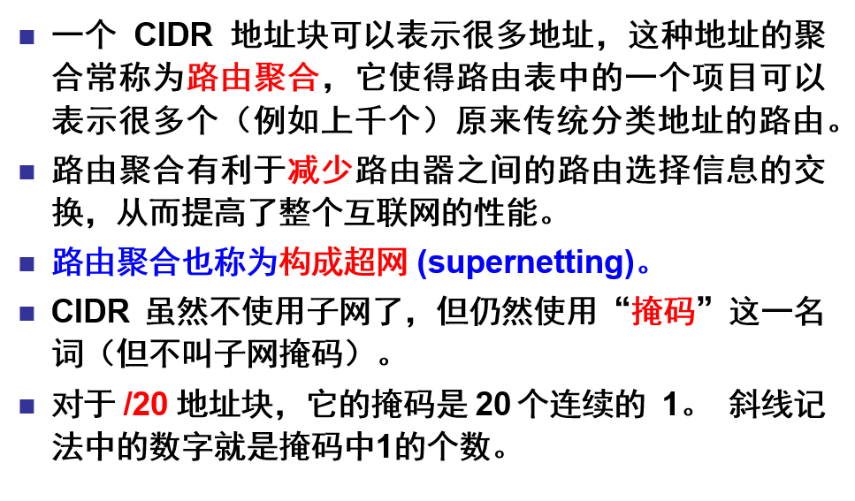

## 5.5. IP数据报格式

## 5.6. ICMP协议的基本概念和应用；IGMP协议的基本概念

* 国际控制报文协议ICMP
* 容许主机或路由器报告差错情况和提供有关异常情况的报告
* 应用
    1. PING 用来测试两个主机之间的连通性。
    2. PING 使用了 ICMP 回送请求与回送回答报文。
    3. PING 是应用层直接使用网络层 ICMP 的例子，它没有通过运输层的 TCP 或UDP。
    4. Traceroute 的应用举例

## 5.7. 路由算法的含义和应用（RIP应用、OSPF）

1. RIP 内部网关协议
    是一种分布式、基于距离向量的路由选择协议
    * 好消息快，坏消息慢
2. OSPF 内部网关协议
    为克服RIP协议的缺点设置的

## 5.8. IPv6的地址格式

1. 地址格式

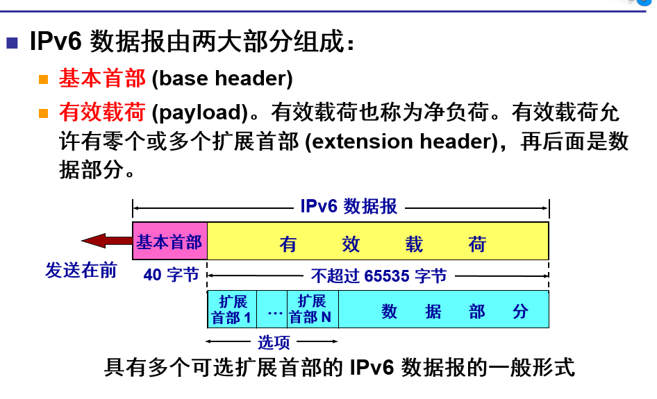  

## 5.9. VPN和NAT的含义和作用，专用地址和私有地址

1. VPN 虚拟专用网
    * 利用公用的互联网 作为本机构 各专用网之间的通信载体，又称为虚拟专用网
    * “专用网”是因为这种网络是为本机构的主机用于机构内部的通信，而不是用于和网络外非本机构的主机通信。

2. 网络地址转换NAT 
    * 可以通过一个实体的iP可以让nat路由器上的主机都可以上网减少IP地址浪费
    * 使用端口号的 NAT 叫做网络地址与端口号转换NAPT (Network Address and Port Translation)，而不使用端口号的 NAT 就叫做传统的 NAT 

# 6. 第五章_运输层

## 6.1. 运输层两个主要协议的特点：TCP和UDP

* UDP ： 一种无连接协议
    提供无连接服务
    不需要再传送数据之前建立连接
    单位是UDP报文和用户数据报
    对方也不用恢复确认
* Tcp ： 面向连接协议
    单位 是TCP报文段
    不提供广播或多播服务
* TcP 主要特点：
    TCP 是面向连接的运输层协议。
    每一条 TCP 连接只能有两个端点 (endpoint)，每一条 TCP 连接只能是点对点的（一对一）。 
    TCP 提供可靠交付的服务。
    TCP 提供全双工通信。
    面向字节流

## 6.2. 端口、套接字，网络中通信一端的标识

1. 端口 -   在运输层使用协议端口号 简称端口

2. 套接字 ： 每一条TCP连接 唯一地被通信两端的两个端点 所确定

## 6.3. 流量控制的含义和方法

1. 流量控制 ： 就是 让发送方的发送速率不要太快，既要让接收方来得及接收，也不要使网络发生拥塞

2. 方法
    利用`滑动窗口机制`可以很方便地在 TCP 连接上实现流量控制

## 6.4. TCP的流量控制与确认机制

## 6.5. 拥塞，TCP的拥塞控制算法及应用；实际发送窗口的限制

## 6.6. TCP的三次握手

    1. 第一次 
        建立连接时，客户端发送syn包 到服务器 ，并进入SYN_SENT 状态，等待服务器确认，SYN ： 同步序列号
    2. 第二次握手
        服务器收到syn包，必须确认客户的SYN ，同时自己也发送一个SYN包，即SYN+ACK包此时服务器进入SYN_RECV状态
    3. 第三次
        客户端收到服务器的SYN+ACK包，向服务器发送包ACK ，此包发送完毕，客户端和服务器进入ESTABLISHED 状态，完成三次握手

# 7. 第六章_应用层

## 7.1. DNS的基本概念及解析过程

1. DNS 是域名系统，
    名字到 IP 地址的解析是由若干个域名服务器程序完成的。域名服务器程序在专设的结点上运行，运行该程序的机器称为域名服务器。  

2. 互联网采用`层次结构`的命名树作为主机的名字并使用分布式的域名系统DNS
3. 解析过程
    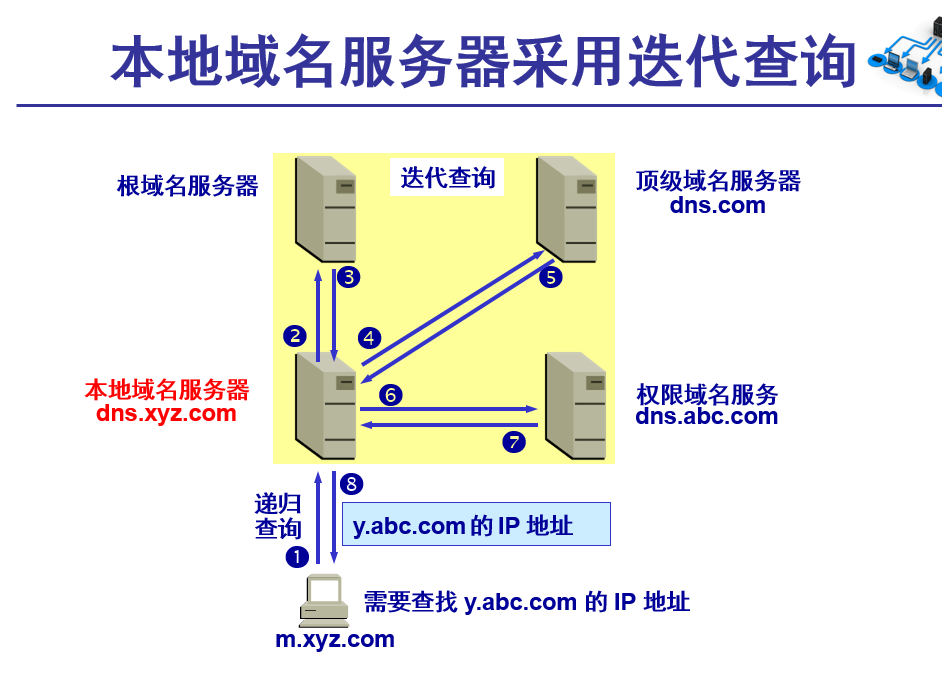
    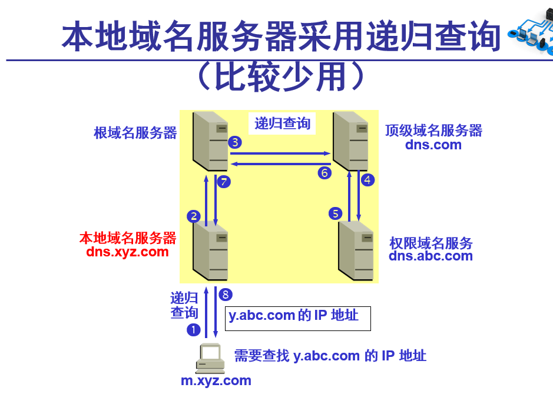

## 7.2. FTP的基本概念及两个连接机制

1. FTP : 就是 文件传送协议 - FTP提供了交互式的访问，容许客户指明文件的类型和格式，并容许文件具有存取权限

2. 两个连接机制
    控制连接 只负责接收客户请求
    实际用户 传输文件的是 `数据连接` 
    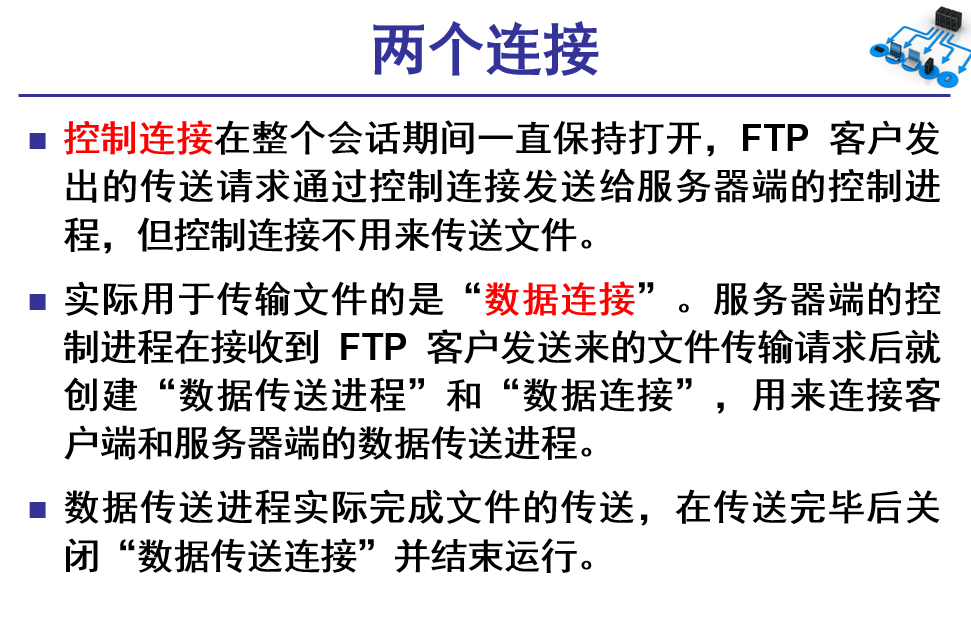

3. 使用的两个TCP
    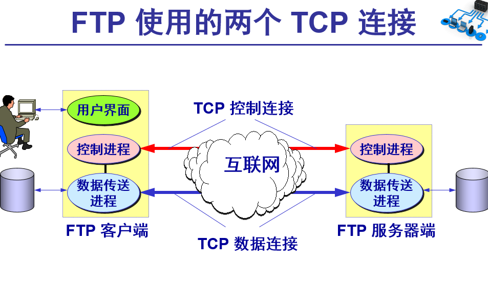
4. FTP 也是使用不一样的端口号，
    当客户进程向服务器进程发出建立连接请求时，要找连接服务器进程的熟知端口(21) 
    服务器进程的传送数据的端口的熟知端口（20）

## 7.3. 万维网的基本概念，HTTP的请求时间

1. 概念
    是一个大规模的、联机式的信息储藏所。
    也是一歌分布式超媒体系统，他是超文本系统的扩充
2. HTTP
    HTTP的格式是 
    ```txt
    http://<主机>:<端口>/<路径>
    ```
3. 请求时间
    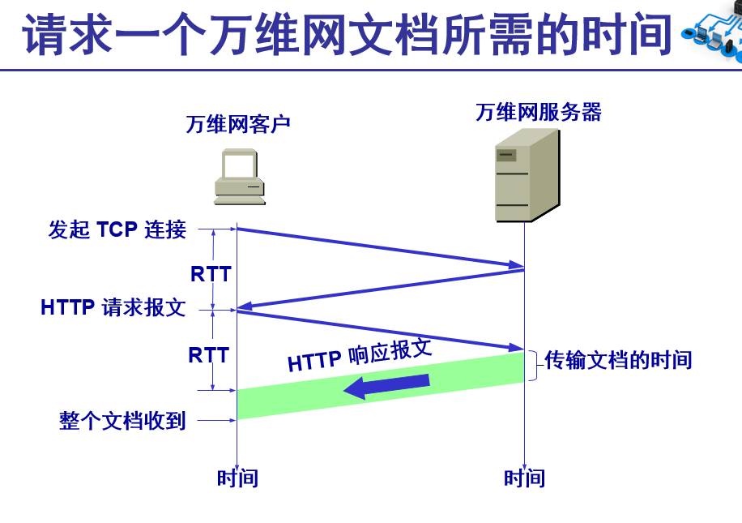

## 7.4. 电子邮件的基本概念、收发协议；基于万维网的电子邮件发送和接收中采用的协议

1. 电子邮件 (e-mail) 是互联网上使用得最多的和最受用户欢迎的一种应用
    电子邮件把邮件发送到收件人使用的邮件服务器，并放在其中的收件人邮箱中，收件人可随时上网到自己使用的邮件服务器进行读取
2. 电子邮件的协议
    发送邮件的协议 SMTP
    读取邮件的协议 POP3 和IMAP
    MIME 可以在邮件首部说明邮件类型
3. 基于万维网的电子邮件 协议
    * 首先利用HTTP 协议 将邮件传送到邮件服务器
    * 两个邮件服务器 使用SMTP 传送
    * 下载邮件 也是利用HTTP
    * 还有一个协议是MIME

## 7.5. DHCP的用途

1. 什么是DHCP
    互联网广泛使用的动态主机配置协议 DHCP (Dynamic Host Configuration Protocol) 提供了即插即用连网 (plug-and-play networking) 的机制。

2. 用途
    DHCP 的中继代理 
    用DHCP Relay代理可以去掉在每个物理的网段都要有DHCP服务器的必要,它可以传递消息到不在同一个物理子网的DHCP服务器，也可以将服务器的消息传回给不在同一个物理子网的DHCP客户机。