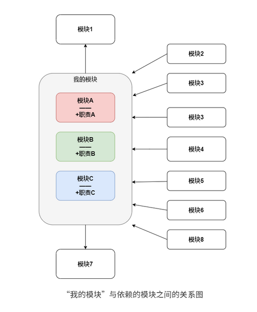
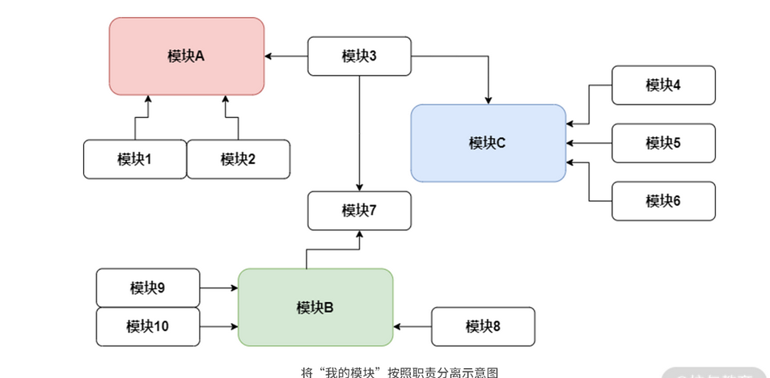
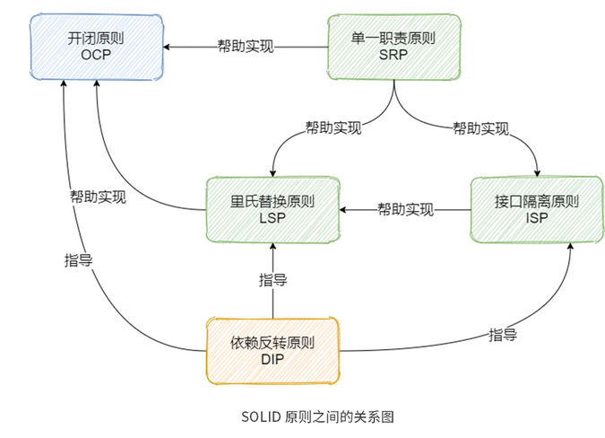
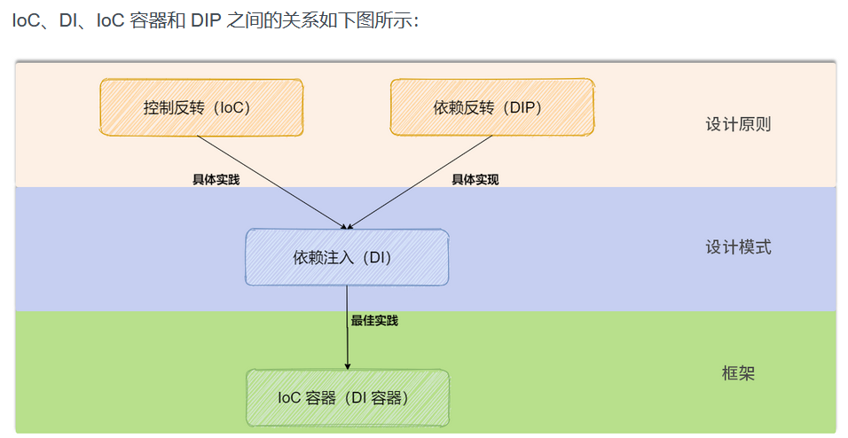
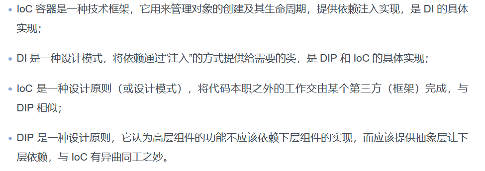

#  理解软件编程背后的系统化思维

## 学习思维：如何学好设计模式

> 1. 先于搞清楚设计模式能解决那些范围的问题，才能正确的时候设计模式
> 2. 设计模式解决的是`可复用`的设计模式
> 3. `设计模式的提出就是为了解决限定领域的有限问题`
> 4. 好的设计从来不是看用的模式有多少，而是看如何合理利用模式的设计思想，以及如何利用模式解决真实的问题。

## 组合思维：Unix哲学

> 1. Unix 设计哲学，主张组合设计，而不是单体设计；主张使用集体智慧，而不是某个人的特殊智慧
> 2. `简单完备性`,`组合思维`,`数据驱动`

1. 保持简单清晰性，能提升代码质量（`一个程序只做一件事，并做的很好`）
2. 借鉴组合理念，有效应对多变的需求
3. 重拾数据思维，重构优化程序设计
4. `在Unix 的理念中，编程中重要的是数据结构，而不是算法`
5. 数据驱动编程： 会把代码和代码作用的数据结构分开，这样在改变程序的逻辑时，就只要编辑数据结构，而不需要修改代码了。


## 分层思维： 为什么要做代码分层架构

> 1. 功能性需求 ： 一个程序能为用户做些什么，
> 2. 非功能需求： 指功能性需求以外的其他必要需求，比如性能、安全性等等。


### 代码分层架构是什么

#### 软件部署分层


> 软件分层架构是通过层来隔离不同的关注点（变化相似的地方），依次来解决不同需求变化的问题，使得这种变化可以被控制在一个层里。

#### 应用程序里的分层架构


#### 什么是代码分层

> 代码分层架构 ： 就是将软件“元素”（代码）按照“层”（代码关系）的方式组织起来的一种架构
>
> 分层架构核心的原则是：当请求或数据从外部传递过来后，必须是从上一层传递给下一层。


##### 代码分层能解决什么问题

- 快速拆解功能问题
- 提升代码的可扩展性


#### 解决上面的两个问题

> 1. 功能性需求： 将复杂问题分解为多个容易解决的子层问题
> 2. 非功能性需求，可以提升代码可扩展性


## 工程思维： 利用软件工程解决开发难题


### 保证软件交付的效率和可靠性

- 从计算机科学角度看，软件开发需要关注软件本身运行的原理
- 从工程角度来看，软件开发更多的是关注如何为用户实现价值

`在软件开发时，我们总是容易太过于关注局部，而没能跳出剧本看整体`


### 什么是软件工程

> 软件开发过程 = 定义与分析 + 设计+ 实现 + 测试 + 交付 + 维护
>
> 软件工程 =  过程 + 方法 + 工具


## 对象思维： 面向对象编程有哪些优势

> 面向对象技术  就是为了 解决软件的大规模可扩展性问题
>
> 编程范式是一种根据编程语言的功能对编程语言进行分类的方法，它不针对具体的某种编程语言。


#### 面向对象编程优势

- 模块化更适合团队敏捷开发
- 对象结构更能提升代码重用性、可读性
- 组合和聚合思想让代码演进更重视组件化


## 迭代思维：如何高效编程


### 什么是高效编程

> 1. 写代码的效率只是整体编程效率的一部分
> 2. 高效编程`其实就是一种高效的工作流`


### 如何高效编程？

> `高效编程 = 原则 * 工具 * 编码 * 反馈 * 迭代`

#### 1. 建立原则

> 原则能让在你编程时，不会轻易遗忘一些重要的事情

1. 第一条原则：问题到你为止
   1. 无论是不是你的问题，你都应该尝试去终结这个问题
2. 多读、多写代码
   1. 多读别人的代码
   2. 多写自己的代码
3. 打破砂锅问到底


### 2. 打磨工具

> 时刻关注前沿，，一方面可以熟悉组件特性，另一方面是培养你编程上多准备的习惯。


### 3. 实践编码

1. 靠运气编码（lucky）
2. 重复硬编码（非常紧急的事情）
3. 写PPT，开会


### 4. 及时反馈

### 5. 迭代更新

> 1. 每一个迭代都应有输入，处理和输出
> 2. 记录版本
> 3. 不断更新


# 从设计原则中领悟编程技能

## 单一原则： 如何跳出错误抽象的误区

> 1. 面向对象原则（SOLID）
> 2. 简单原则（KISS）
> 3. 单一原则（DRY）
> 4. 最少原则（LoD）
> 5. 分离原则（Soc）

`为什么会选择困难，有的原则之间是相互冲突的，而有的原则之间又是彼此重复的`


### DRY原则

> 不要重复自己

####  陷阱一 ： 随时关心代码重用性

> 随时在意有没有写重复代码；
>
> 随时在意代码能不能重用；
>
> 随时在意有没有因为重复而浪费时间。

三种代码重复类型

> 功能需求重复
>
> 实现逻辑重复
>
> 执行调用重复


`简单来说，你应该先写出可以运行的代码，再考虑是否需要重用代码。`


#### 陷阱二 ： 过度设计

> 是因为我们总是期望通过现在的灵活设计来避免未来需求变化后的重复设计与编码。这样做的话，确实特别符合 DRY 原则的理念。但实际上，需求的变化方向是不可预测的。

`抓住上下文，适度设计`


#### 陷阱三 ： 写一次性代码

> 1. 硬编码
> 2. 复制粘贴编程

`坚持写易懂的代码`

1. 易懂的代码不是指容易、简单的代码
2. 易懂的代码能借用语言特性来发挥优势
3. 易懂的代码需要遵从一定的代码规范
4. 易懂的代码要能正确运行
5. 始终牢记 ——易懂的代码不是你告诉计算机怎么做的答案，而是告诉另一个程序员你想要计算机做什么的意图。


## 简单原则：如何写出简单代码

> 简单原则：KISS原则


### 为什么要让代码保持简单

1. 防止代码腐坏
2. 减少时间成本投入
3. 快速迭代，拥抱变化


### 理解代码中的简单？

> 误解： `简单分析 + 简单设计 + 简单编程 = 简单产品`
>
> `编程的本质就是控制复杂度`

1. 简单≠简单设计或简单编程
2. 简单≠数量少
3. 简单≠过度简洁

#### 简单是什么

1. 简单应是坚持实践
2. 简单是尽量简单，但又不能太简单。换句话说，就是要管理合适的代码上下文环境，并且在边界范围内以“最少知识”的方式构建程序，满足要求即可，保持一定的克制。
3. 简单应该是让别人理解代码逻辑时更简单

### 如何写出简单代码

#### 四不要：

1. 不要长期进行补丁式的打码
2. 不要炫耀编程技巧
3. 不要简单编程（硬编码、一次性编码、复制粘贴编码、面向搜索编程都是简单编程）
4. 不要过早优化

#### 四要：

1. 定期做Code Review
2. 要选择合适的编码规范
3. 要适时重构
4. 要有目标地逐渐优化


### 扩展： YAGNI原则

> `不要写“将来可能需求，但现在却用不上”的代码`
>
> YAGNI 原则能够帮助我们更好地实现 KISS 原则


## 最少原则：如何实现“最少知识”代码

```java
final String outputDir = ctxt.getOptions().getScratchDir().getAbsolutePath();
```

> 上述代码存在依赖每一个细节，不仅增加了耦合，也使代码结构僵化

迪米特法则正是为了避免对象间出现这样过多的细节依赖而被提出来。

### 什么是迪米特法则

> 1. 一个类只应该与它直接相关的类通信
> 2. 每一个类应该知道自己需要的最少知识

换句话说，在面向对象编程中，它要求任何一个对象（O）的方法（m），只应该调用以下对象：

- 对象（O）自身；
- 通过方法（m）的参数传入的对象；
- 在方法（m）内创建的对象；
- 组成对象（O）的对象；
- 在方法（m）的范围内，可让对象（O）访问的全局变量。


### 应用法则需要注意的问题

1. 容易为了简化局部而忽略整体的简化
2. 拆分时容易引入很多过小的中间类和方法
3. 不同模块之间的消息传递效率可能会降低


### 扩展 ： 面向切面编程AOP

> **面向切面编程，简单来说，就是可以在不修改已有程序代码功能的前提下给程序动态添加功能的一种技术**
>
> 迪米特法则是在**程序设计时（静态）** 降低代码耦合的方法的话
>
> 面向切面编程就是在**程序运行期间（动态）** 降低代码耦合的方法


## 表达原则： 如何让源码成为一种逻辑线索


### 为什么要提升源代码的可读性

1. 更易于维护
2. 更易于重构
3. 更易于测试
4. 更易于应用设计模式


### 如何写出有“逻辑线索”的源代码

1. 代码表现形式 ： 在命名、代码格式、注释等方面的改进
2. 控制流和逻辑：尽量分离控制流和逻辑，让代码变得更容易理解
3. 惯性思维：找出长犯的一些惯性思考方式并逐一改进。
   1. 避免一次性代码
   2. 避免复制粘贴代码
   3. 避免写超长代码
   4. 避免过度简化命名和表达式
   5. 避免写“是什么”的注释


## 职责原则：如何在代码设计中实现职责分离

### 高内聚、低耦合： 职责分离的目标





`内聚本质上表示的是系统内部的各个部分对同一个问题的专注程度，以及这些部分彼此之间联系的紧密性`

`职责分离就是将不同变化原因引起的类或方法修改行为拆分到不同类或方法里面去`

### 职责分离的重要性

1. 直接对问题进行对象建模，方便理清构建逻辑
2. 将问题分解为各种职责，更有利于系统的测试、调试和维护
3. 提高系统的可扩展性

### 职责分离的时机

1. 命名太过于笼统
2. 改动代码后的测试规模很大
3. 类和方法过大


### 如何通过职责分离实现高内聚

> 实现职责分离的核心技巧就在于寻找互相不重合的职责


## 面向对象原则： 面向对象编程框架到底长什么样


### 五大设计原则概览


1. SRP  ： 单一职责原则，意思是对象应该仅具有一种单一的功能
2. OCP： 开闭原则，也就是程序对扩展开发，对于修改关闭
3. LSP： 里式替换原则，程序中的对象应该是可以在不改变程序正确性的前提下被它的子类所替换的
4. ISP： 接口隔离原则，多个特定客户端接口要好于一个宽泛用途的接口
5. DIP： 依赖反转原则： 该原则认为一个方法应该遵从“依赖于抽象而不是一个实例”


#### 单一职责原则

> 对一个类而言，应该仅有一个引起它变化的原因

理解SRP 时，抓住重点`职责是否具有唯一性`


#### 开闭原则

> 你在设计或修改程序代码时，应该尽量去扩展原有程序，而不是修改原有程序
>
> **开闭原则更像是一个框架的设计原则，而不是具体的业务编码技巧**

```java
public abstract class Demo  extends AbstractDataSource {

    private int readDsSize;


    @Override

    public Connection getConnection() throws SQLException {

        return this.determineTargetDataSource().getConnection();

    }

    @Override

    public Connection getConnection(String username, String password) throws SQLException {

        return this.determineTargetDataSource().getConnection(username, password);

    }

    protected DataSource determineTargetDataSource() {

        if (determineCurrentLookupKey() && this.readDsSize > 0){

            //读库做负载均衡（从库）

            return this.loadBalance();

        } else {

            //写库使用主库

            return this.getResolvedMasterDataSource();

        }

    }

    protected abstract boolean determineCurrentLookupKey();


    //其他代码省略


}

```


#### 里氏替换原则

> 原意： 子类应该能够完全替换掉它的基类。换句话说，在进行代码设计时，应该尽量保持子类和父类方法行为的一致性

LSP 的本质就是`通过继承实现多态行为`


#### 接口隔离原则

> 适合接口的设计原则
>
> 原意 ： 不应该强迫用户依赖于他们不用的方法

`好的接口隔离不是只考虑一个接口中方法的隔离，还应该多考虑整体系统中的职责`

#### 依赖反转原则

> 原意 ： 
>
> 1. 高层模块不应该依赖底层模块，二者都应该依赖于抽象
> 2. 抽象不应该依赖于细节，细节应该依赖于抽象。
>
> 通俗来说： 寻找好的抽象。这里的抽象不是简单指java中的interface，而是指可以创建出固定却能够描述一组任意个可能行为的抽象体。
>
> 而好的抽象 就是指 **具备一些共性规律并能经得起事件检验的抽象**

`要尽量通过寻找好的抽象来解决大量重复工作的效率问题`


#### 五大设计原则之间的关系




## 反转原则 ： 如何减少代码间的相互影响

>适用于场景：
>
>1. 一个平台系统，需要接入各种各样的业务系统，而这些业务系统都有自己的账号体系，平台需要兼容这些系统的账号体系，于是代码中出现了大量依赖于各种账号体系的代码。
>2. 一个网站页面，需要越来越多的频道（首页、搜索、分类等），不同频道对应的个性化需求各不相同，并且各种页面的标准组件、布局、模板，以及与后端交互框架也各不相同，不同体系的代码依赖非常紧密。
>3. 一个通用的订单处理平台，各条业务线都需要通过这个平台来处理自己的交易业务，但是垂直业务线上的个性化需求太多，代码里随处可见定制化的需求代码。


### DIP ： 统一代码交互标准

> 这和浏览器的使用原理也很类似。浏览器（对应商品买家）并不依赖于后面的 Web 服务器（对应商品卖家），其只依赖于 HTTP 协议（对应银行），只要我们遵循 HTTP 协议就能在浏览器中提供很多丰富的 Web 功能，而不必针对特定的浏览器定制开发。


`依赖反转原则DIP 就是一种统一代码交互标准的软件设计方法`


#### 理解DIP 这个定义：

1. 首先，定义中的高级组件和低级组件，主要对应的是调用关系上的层级
2. 其次，高级组件和低级组件都应依赖抽象，是为了消除组件间变换对对方造成的影响，换句话说，抽象是一种约束，让高级组件或低级组件不能太随意的变动。
3. 最后，抽象不应该依赖实现，实现应该依赖抽象。


#### 为什么要使用DIP

1. 可以有效的控制代码变化的影响范围
2. 可以使代码具有更强的可读性和可维护性


### 怎么做： 给具体实现抽象标准接口


实现一个功能： 读取字符串后，再输出显示

为了方便你理解组件间的作用关系，我们下面将 StringReader 类和 StringWriter 类统称为低级组件，StringProcessor 称为高级组件，这样能更清楚地了解每个设计选择是如何影响整体设计的。

#### 设计一： 低级组件和高级组件都作为具体类放在同一包中

```java
public class StringProcessor { //具体类

    private final StringReader stringReader; //具体类

    private final StringWriter stringWriter; //具体类

    //通过构造函数来注入依赖组件

    public StringProcessor(StringReader stringReader, StringWriter stringWriter) {

        this.stringReader = stringReader;

        this.stringWriter = stringWriter;

    }

    public void readAndWrite() {

        stringWriter.write(stringReader.getValue());

    }

    //测试用例

    public static void main(String[] args) {

        StringReader sr = new StringReader();

        sr.read("1111111");

        StringWriter sw = new StringWriter();

        StringProcessor sp = new StringProcessor(sr,sw);

        sp.readAndWrite();

    }

}

```

> 基本设计方法，逻辑简单，编码容易，缺点 是程序高度耦合，任何一个低级组件的修改都会影响高级组件

#### 设计二： 低级组件具体类与高级组件接口实现类放在同一程序包中

```java
public interface StringProcessor {

    void readAndWrite(StringReader stringReader, StringWriter stringWriter);

}

```

```java
public class StringProcessorImpl implements StringProcessor {

    //通过接口传参来注入依赖组件

    @Override

    public void readAndWrite(StringReader stringReader, StringWriter stringWriter) {

        stringWriter.write(stringReader.getValue());

    }

    public static void main(String[] args){

        StringReader sr = new StringReader();

        sr.read("222222");

        StringWriter sw = new StringWriter();

        StringProcessor sp = new StringProcessorImpl();

        sp.readAndWrite(sr,sw);

    }

}

```

> 常见的误区之一 ： 只要有组件有接口就代表一定可复用
>
> 实际上 ，高级组件还是直接依赖于低级组件


#### 低级组件接口类与高级组件接口实现类放在同一程序包中

```java
public interface StringReader {

    void read(String path);

    String getValue();

}

public interface StringWriter {

    void write(String value);

}

```

```java
public class StringProcessorImpl implements StringProcessor {

    //StringReader 是接口

    //StringWriter 是接口

    @Override

    public void readAndWrite(StringReader stringReader, StringWriter stringWriter) {

        stringWriter.write(stringReader.getValue());

    }

    public static void main(String[] args) {

        StringReader sr = new StringReaderImpl();

        sr.read("333333");

        StringWriter sw = new StringWriterImpl();

        StringProcessor sp = new StringProcessorImpl();

        sp.readAndWrite(sr,sw);

    }

}

```

> 此时，StringProcessor、StringReader 和 StringWriter 都依赖于抽象，整体组件的逻辑控制权真正发生了变化，我们通过抽象化组件之间的交互，已经实现了从上到下的依赖关系的反转。
>
> 过去，StringProcessor 依赖于 StringReader 和 StringWriter 的具体实现，而现在则是 StringProcessor 来定义一组抽象规则，由 StringReader 和 StringWriter 来依赖。


#### 设计四： 低级组件接口类与高级组件接口类放在不同包中

```java
public class SPTest {

    @Resource

    private StringProcessor sp;

    @Resource

    private StringReader sr;

    @Resource

    private StringWriter sw;

    public void main(String[] args) {

        sr.read("444444");

        sp.readAndWrite(sr,sw);

    }

}

```

> 对于 StringReader 和 StringWriter 的实现这时就变成了“黑盒”，换句话说，对于使用者来说，我们可以完全不用关心  StringReader 和 StringWriter 是如何实现的，实现可以是 JDK  原生实现，可以是第三方的包实现，也可以是我们自行实现的，只要低级组件按照抽象约定的提供读写功能即可。

`只要是面向对象编程的语言，就能够用于这个四个思路实现DIP`


### 扩展Ioc ,DI ,IOC 容器与DIP 的区别

DI —— 依赖注入

IoC——控制反转

Ioc容器


#### 控制反转

> 是一种设计原则（也有人将其称为设计模式）。顾名思义，它用于反转设计中各种组件的控制关系，以实现松耦合。在这里，控制是指对象除自身主要职责以外的任何其他职责，通常包括对应用程序流的控制，以及对象的创建或子对象的创建、绑定的控制。
>
> 比如，你要开车去上班，这意味着你要控制一辆汽车，而 IoC 的理念是反转你的控制，你不用自己开车而是选择打车，让出租车师傅带你去上班，这时你的控制就发生了反转，出租车师傅专注于开车，而你专注于上班。


#### 依赖注入

> 简单来说，**它允许在类之外创建依赖对象，并通过不同方式将这些对象提供给类**。一般来讲，主要有三种方式来注入类：通过构造函数、通过属性和通过方法。


#### Ioc容器

> **IoC 容器（又叫作 DI 容器），是用于实现自动依赖注入的框架**。它的作用是管理对象的创建及其生命周期，并提供向类注入依赖项的具体实现，这样做是为了我们不必手动创建和管理对象。但**实际上更准确的描述应该是 DI 容器**，只不过因为 Spring 号称自己为 IoC 容器而造成了误解






## 惯例原则： 如何提升编程中的沟通效率


`惯例优于配置原则`


### CoC惯例原则

> 1. 惯例原则就是将一些在编程中公认的配置方式和约定信息作为内部缺省的默认规则来使用。
> 2. 主要解决了在编程中我们对共同隐性知识的学习问题，通过统一的默认规则，建立起了一道沟通的桥梁。


### 惯例原则的副作用

1. 丢失灵活性
2. 自定义惯例有风险
3. 参考变强制
4. 不同框架下的惯例之间并不能复用


### 如何正确使用惯例规则

1. 遵循大多数人使用的惯例
2. 搞清楚惯例的适用范围
3. 自定义惯例时需要在团队内反复不断确认
4. 要在惯例和灵活性之间做平衡
5. 不要强制他人使用惯例


## 分离原则： 如何将复杂问题拆分成小问题

> 关注点分离原则 是一个帮助我们将复杂问题拆分成小问题的好方法
>
> 关注点是能对程序代码产生影响的一组特定信息


### 为什么用关注点分离原则拆分复杂问题

1. 你破坏其他用户正在使用的现有功能的可能性会变小
2. 关注点分类能帮助你适应人类的短期记忆限制


### 两个视角下的关注点分离

> `现将复杂问题做合理的分解，在分别仔细研究上特定问题的侧面（关注点），最后解决得出的接口，再合成整体的解决思路`


#### 架构设计视角

> 侧重点： 整个系统内组件之间的边界划分
>
> **将层作为关注点来进行分离，通过解决每一个层的问题来实现整体问题的解决**。
>
> **架构设计视角下的关注点分离更重视组件之间的分离，并通过一定的通信策略来保证架构内各个组件间的相互引用**


#### 编码实现视角

> 侧重点 ： **某个具体类或方法间的边界划分**——————————————职责分离
>
> **虽然架构设计和编码实现中的关注点各有不同，但是对关注点进行分离后获得的效果却是一样的**。


### 如何实现关注点分离

> **好的架构必须使每个关注点相互分离，也就是说系统中的一部分发生了改变，并不会影响到其他部分**。这主要体现在这三个方面：
>
> 1. ①即使需要改变，也能够清晰地识别出哪些部分需要改变；
> 2. ②如果需要扩展架构，尽量做到影响最小化；
> 3. ③已经可以工作的部分还都将继续工作


#### 在架构设计上，做到策略和机制分离

- 机制
  - 各种软件要素之间的结构关系和运行方式。可以理解为实现某个功能所需要的基础操作和通用结构。在代码中相对稳定，表现形式有：通用算法、流程、数据结构等可以起到不可变作用的部分。
- 策略
  - 可以实现软件发布目标的编码方案集合。在代码中相对不稳定，表现形式有：业务逻辑、接口实现。

**策略和机制分离的本质就是进行标准化，也就是制定一套标准（提供机制），让使用者按照标准使用它（不同策略）**


#### 在编码实现上，做到使用和创建分离

**实体的实例化（创建）与实体间相互使用（使用）的分离**。


## 契约原则： 如何做好API接口设计


### 契约式设计原则（DbC）： API 设计的指导书

> 原理  :  **在软件设计时应该为软件组件定义一种精确和可验证的接口规范，这种规范要包括使用的预置条件、后置条件和不变条件，用来扩展普通抽象数据类型的定义**

1. API 必须保证输入是接收者期望的输入条件
2. API 必须要保证输出结果的正确性
3. API必须要保证处理过程的一致性


### 如何做好API接口设计

#### 让接口职责分离

#### APi命名很重要

#### 尽量少创造自定义错误码

#### 同一接口要做到幂等

> **什么是幂等？简单来说，就是当一个操作多次执行所产生的影响均与一次执行的影响相同，则它是幂等的。**

如何做到接口幂等：

1. 使用天然幂等条件： 比如 数据库 查询，删除
2. 使用唯一键值
3. 使用加锁策略。 比如 悲观锁，乐观锁，分布式锁
4. 使用Source + Token 验证机制
5. 使用有限状态机


# 拆解23种设计模式的实现原理