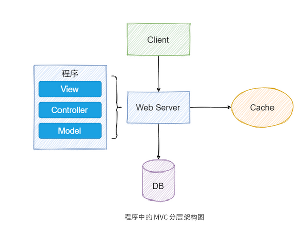
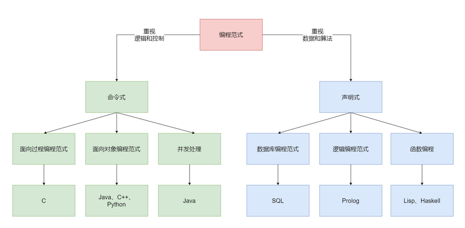

#  理解软件编程背后的系统化思维

## 学习思维：如何学好设计模式

> 1. 先于搞清楚设计模式能解决那些范围的问题，才能正确的时候设计模式
> 2. 设计模式解决的是`可复用`的设计模式
> 3. `设计模式的提出就是为了解决限定领域的有限问题`
> 4. 好的设计从来不是看用的模式有多少，而是看如何合理利用模式的设计思想，以及如何利用模式解决真实的问题。

## 组合思维：Unix哲学

> 1. Unix 设计哲学，主张组合设计，而不是单体设计；主张使用集体智慧，而不是某个人的特殊智慧
> 2. `简单完备性`,`组合思维`,`数据驱动`

1. 保持简单清晰性，能提升代码质量（`一个程序只做一件事，并做的很好`）
2. 借鉴组合理念，有效应对多变的需求
3. 重拾数据思维，重构优化程序设计
4. `在Unix 的理念中，编程中重要的是数据结构，而不是算法`
5. 数据驱动编程： 会把代码和代码作用的数据结构分开，这样在改变程序的逻辑时，就只要编辑数据结构，而不需要修改代码了。


## 分层思维： 为什么要做代码分层架构

> 1. 功能性需求 ： 一个程序能为用户做些什么，
> 2. 非功能需求： 指功能性需求以外的其他必要需求，比如性能、安全性等等。


### 代码分层架构是什么

#### 软件部署分层


> 软件分层架构是通过层来隔离不同的关注点（变化相似的地方），依次来解决不同需求变化的问题，使得这种变化可以被控制在一个层里。

#### 应用程序里的分层架构



#### 什么是代码分层

> 代码分层架构 ： 就是将软件“元素”（代码）按照“层”（代码关系）的方式组织起来的一种架构
>
> 分层架构核心的原则是：当请求或数据从外部传递过来后，必须是从上一层传递给下一层。


##### 代码分层能解决什么问题

- 快速拆解功能问题
- 提升代码的可扩展性


#### 解决上面的两个问题

> 1. 功能性需求： 将复杂问题分解为多个容易解决的子层问题
> 2. 非功能性需求，可以提升代码可扩展性


## 工程思维： 利用软件工程解决开发难题


### 保证软件交付的效率和可靠性

- 从计算机科学角度看，软件开发需要关注软件本身运行的原理
- 从工程角度来看，软件开发更多的是关注如何为用户实现价值

`在软件开发时，我们总是容易太过于关注局部，而没能跳出剧本看整体`


### 什么是软件工程

> 软件开发过程 = 定义与分析 + 设计+ 实现 + 测试 + 交付 + 维护
>
> 软件工程 =  过程 + 方法 + 工具


## 对象思维： 面向对象编程有哪些优势

> 面向对象技术  就是为了 解决软件的大规模可扩展性问题
>
> 编程范式是一种根据编程语言的功能对编程语言进行分类的方法，它不针对具体的某种编程语言。




#### 面向对象编程优势

- 模块化更适合团队敏捷开发
- 对象结构更能提升代码重用性、可读性
- 组合和聚合思想让代码演进更重视组件化


## 迭代思维：如何高效编程


### 什么是高效编程

> 1. 写代码的效率只是整体编程效率的一部分
> 2. 高效编程`其实就是一种高效的工作流`


### 如何高效编程？

> `高效编程 = 原则 * 工具 * 编码 * 反馈 * 迭代`

#### 1. 建立原则

> 原则能让在你编程时，不会轻易遗忘一些重要的事情

1. 第一条原则：问题到你为止
   1. 无论是不是你的问题，你都应该尝试去终结这个问题
2. 多读、多写代码
   1. 多读别人的代码
   2. 多写自己的代码
3. 打破砂锅问到底


### 2. 打磨工具

> 时刻关注前沿，，一方面可以熟悉组件特性，另一方面是培养你编程上多准备的习惯。


### 3. 实践编码

1. 靠运气编码（lucky）
2. 重复硬编码（非常紧急的事情）
3. 写PPT，开会


### 4. 及时反馈

### 5. 迭代更新

> 1. 每一个迭代都应有输入，处理和输出
> 2. 记录版本
> 3. 不断更新


# 从设计原则中领悟编程技能

## 单一原则： 如何跳出错误抽象的误区

> 1. 面向对象原则（SOLID）
> 2. 简单原则（KISS）
> 3. 单一原则（DRY）
> 4. 最少原则（LoD）
> 5. 分离原则（Soc）

`为什么会选择困难，有的原则之间是相互冲突的，而有的原则之间又是彼此重复的`


### DRY原则

> 不要重复自己

####  陷阱一 ： 随时关心代码重用性

> 随时在意有没有写重复代码；
>
> 随时在意代码能不能重用；
>
> 随时在意有没有因为重复而浪费时间。

三种代码重复类型

> 功能需求重复
>
> 实现逻辑重复
>
> 执行调用重复


`简单来说，你应该先写出可以运行的代码，再考虑是否需要重用代码。`


#### 陷阱二 ： 过度设计

> 是因为我们总是期望通过现在的灵活设计来避免未来需求变化后的重复设计与编码。这样做的话，确实特别符合 DRY 原则的理念。但实际上，需求的变化方向是不可预测的。

`抓住上下文，适度设计`


#### 陷阱三 ： 写一次性代码

> 1. 硬编码
> 2. 复制粘贴编程

`坚持写易懂的代码`

1. 易懂的代码不是指容易、简单的代码
2. 易懂的代码能借用语言特性来发挥优势
3. 易懂的代码需要遵从一定的代码规范
4. 易懂的代码要能正确运行
5. 始终牢记 ——易懂的代码不是你告诉计算机怎么做的答案，而是告诉另一个程序员你想要计算机做什么的意图。


## 简单原则：如何写出简单代码

> 简单原则：KISS原则


### 为什么要让代码保持简单

1. 防止代码腐坏
2. 减少时间成本投入
3. 快速迭代，拥抱变化


### 理解代码中的简单？

> 误解： `简单分析 + 简单设计 + 简单编程 = 简单产品`
>
> `编程的本质就是控制复杂度`

1. 简单≠简单设计或简单编程
2. 简单≠数量少
3. 简单≠过度简洁

#### 简单是什么

1. 简单应是坚持实践
2. 简单是尽量简单，但又不能太简单。换句话说，就是要管理合适的代码上下文环境，并且在边界范围内以“最少知识”的方式构建程序，满足要求即可，保持一定的克制。
3. 简单应该是让别人理解代码逻辑时更简单

### 如何写出简单代码

#### 四不要：

1. 不要长期进行补丁式的打码
2. 不要炫耀编程技巧
3. 不要简单编程（硬编码、一次性编码、复制粘贴编码、面向搜索编程都是简单编程）
4. 不要过早优化

#### 四要：

1. 定期做Code Review
2. 要选择合适的编码规范
3. 要适时重构
4. 要有目标地逐渐优化


### 扩展： YAGNI原则

> `不要写“将来可能需求，但现在却用不上”的代码`
>
> YAGNI 原则能够帮助我们更好地实现 KISS 原则


## 最少原则：如何实现“最少知识”代码

```java
final String outputDir = ctxt.getOptions().getScratchDir().getAbsolutePath();
```

> 上述代码存在依赖每一个细节，不仅增加了耦合，也使代码结构僵化

迪米特法则正是为了避免对象间出现这样过多的细节依赖而被提出来。

### 什么是迪米特法则

> 1. 一个类只应该与它直接相关的类通信
> 2. 每一个类应该知道自己需要的最少知识

换句话说，在面向对象编程中，它要求任何一个对象（O）的方法（m），只应该调用以下对象：

- 对象（O）自身；
- 通过方法（m）的参数传入的对象；
- 在方法（m）内创建的对象；
- 组成对象（O）的对象；
- 在方法（m）的范围内，可让对象（O）访问的全局变量。


### 应用法则需要注意的问题

1. 容易为了简化局部而忽略整体的简化
2. 拆分时容易引入很多过小的中间类和方法
3. 不同模块之间的消息传递效率可能会降低


### 扩展 ： 面向切面编程AOP

> **面向切面编程，简单来说，就是可以在不修改已有程序代码功能的前提下给程序动态添加功能的一种技术**
>
> 迪米特法则是在**程序设计时（静态）** 降低代码耦合的方法的话
>
> 面向切面编程就是在**程序运行期间（动态）** 降低代码耦合的方法


## 表达原则： 如何让源码成为一种逻辑线索