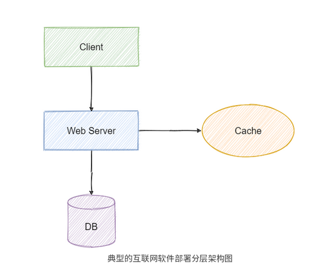

#  理解软件编程背后的系统化思维

## 学习思维：如何学好设计模式

> 1. 先于搞清楚设计模式能解决那些范围的问题，才能正确的时候设计模式
> 2. 设计模式解决的是`可复用`的设计模式
> 3. `设计模式的提出就是为了解决限定领域的有限问题`
> 4. 好的设计从来不是看用的模式有多少，而是看如何合理利用模式的设计思想，以及如何利用模式解决真实的问题。

## 组合思维：Unix哲学

> 1. Unix 设计哲学，主张组合设计，而不是单体设计；主张使用集体智慧，而不是某个人的特殊智慧
> 2. `简单完备性`,`组合思维`,`数据驱动`

1. 保持简单清晰性，能提升代码质量（`一个程序只做一件事，并做的很好`）
2. 借鉴组合理念，有效应对多变的需求
3. 重拾数据思维，重构优化程序设计
4. `在Unix 的理念中，编程中重要的是数据结构，而不是算法`
5. 数据驱动编程： 会把代码和代码作用的数据结构分开，这样在改变程序的逻辑时，就只要编辑数据结构，而不需要修改代码了。


## 分层思维： 为什么要做代码分层架构

> 1. 功能性需求 ： 一个程序能为用户做些什么，
> 2. 非功能需求： 指功能性需求以外的其他必要需求，比如性能、安全性等等。


### 代码分层架构是什么

#### 软件部署分层



> 软件分层架构是通过层来隔离不同的关注点（变化相似的地方），依次来解决不同需求变化的问题，使得这种变化可以被控制在一个层里。

#### 应用程序里的分层架构


#### 什么是代码分层

> 代码分层架构 ： 就是将软件“元素”（代码）按照“层”（代码关系）的方式组织起来的一种架构
>
> 分层架构核心的原则是：当请求或数据从外部传递过来后，必须是从上一层传递给下一层。


##### 代码分层能解决什么问题

- 快速拆解功能问题
- 提升代码的可扩展性


#### 解决上面的两个问题

> 1. 功能性需求： 将复杂问题分解为多个容易解决的子层问题
> 2. 非功能性需求，可以提升代码可扩展性


## 工程思维： 利用软件工程解决开发难题


### 保证软件交付的效率和可靠性

- 从计算机科学角度看，软件开发需要关注软件本身运行的原理
- 从工程角度来看，软件开发更多的是关注如何为用户实现价值

`在软件开发时，我们总是容易太过于关注局部，而没能跳出剧本看整体`


### 什么是软件工程

> 软件开发过程 = 定义与分析 + 设计+ 实现 + 测试 + 交付 + 维护
>
> 软件工程 =  过程 + 方法 + 工具


## 对象思维： 面向对象编程有哪些优势

> 面向对象技术  就是为了 解决软件的大规模可扩展性问题
>
> 编程范式是一种根据编程语言的功能对编程语言进行分类的方法，它不针对具体的某种编程语言。


#### 面向对象编程优势

- 模块化更适合团队敏捷开发
- 对象结构更能提升代码重用性、可读性
- 组合和聚合思想让代码演进更重视组件化


## 迭代思维：如何高效编程


### 什么是高效编程

> 1. 写代码的效率只是整体编程效率的一部分
> 2. 高效编程`其实就是一种高效的工作流`


### 如何高效编程？

> `高效编程 = 原则 * 工具 * 编码 * 反馈 * 迭代`

#### 1. 建立原则

> 原则能让在你编程时，不会轻易遗忘一些重要的事情

1. 第一条原则：问题到你为止
   1. 无论是不是你的问题，你都应该尝试去终结这个问题
2. 多读、多写代码
   1. 多读别人的代码
   2. 多写自己的代码
3. 打破砂锅问到底


### 2. 打磨工具

> 时刻关注前沿，，一方面可以熟悉组件特性，另一方面是培养你编程上多准备的习惯。


### 3. 实践编码

1. 靠运气编码（lucky）
2. 重复硬编码（非常紧急的事情）
3. 写PPT，开会


### 4. 及时反馈

### 5. 迭代更新

> 1. 每一个迭代都应有输入，处理和输出
> 2. 记录版本
> 3. 不断更新


# 从设计原则中领悟编程技能

## 单一原则： 如何跳出错误抽象的误区

> 1. 面向对象原则（SOLID）
> 2. 简单原则（KISS）
> 3. 单一原则（DRY）
> 4. 最少原则（LoD）
> 5. 分离原则（Soc）

`为什么会选择困难，有的原则之间是相互冲突的，而有的原则之间又是彼此重复的`


### DRY原则

> 不要重复自己

####  陷阱一 ： 随时关心代码重用性

> 随时在意有没有写重复代码；
>
> 随时在意代码能不能重用；
>
> 随时在意有没有因为重复而浪费时间。

三种代码重复类型

> 功能需求重复
>
> 实现逻辑重复
>
> 执行调用重复


`简单来说，你应该先写出可以运行的代码，再考虑是否需要重用代码。`


#### 陷阱二 ： 过度设计

> 是因为我们总是期望通过现在的灵活设计来避免未来需求变化后的重复设计与编码。这样做的话，确实特别符合 DRY 原则的理念。但实际上，需求的变化方向是不可预测的。

`抓住上下文，适度设计`


#### 陷阱三 ： 写一次性代码

> 1. 硬编码
> 2. 复制粘贴编程

`坚持写易懂的代码`

1. 易懂的代码不是指容易、简单的代码
2. 易懂的代码能借用语言特性来发挥优势
3. 易懂的代码需要遵从一定的代码规范
4. 易懂的代码要能正确运行
5. 始终牢记 ——易懂的代码不是你告诉计算机怎么做的答案，而是告诉另一个程序员你想要计算机做什么的意图。


## 简单原则：如何写出简单代码

> 简单原则：KISS原则


### 为什么要让代码保持简单

1. 防止代码腐坏
2. 减少时间成本投入
3. 快速迭代，拥抱变化


### 理解代码中的简单？

> 误解： `简单分析 + 简单设计 + 简单编程 = 简单产品`
>
> `编程的本质就是控制复杂度`

1. 简单≠简单设计或简单编程
2. 简单≠数量少
3. 简单≠过度简洁

#### 简单是什么

1. 简单应是坚持实践
2. 简单是尽量简单，但又不能太简单。换句话说，就是要管理合适的代码上下文环境，并且在边界范围内以“最少知识”的方式构建程序，满足要求即可，保持一定的克制。
3. 简单应该是让别人理解代码逻辑时更简单

### 如何写出简单代码

#### 四不要：

1. 不要长期进行补丁式的打码
2. 不要炫耀编程技巧
3. 不要简单编程（硬编码、一次性编码、复制粘贴编码、面向搜索编程都是简单编程）
4. 不要过早优化

#### 四要：

1. 定期做Code Review
2. 要选择合适的编码规范
3. 要适时重构
4. 要有目标地逐渐优化


### 扩展： YAGNI原则

> `不要写“将来可能需求，但现在却用不上”的代码`
>
> YAGNI 原则能够帮助我们更好地实现 KISS 原则


## 最少原则：如何实现“最少知识”代码

```java
final String outputDir = ctxt.getOptions().getScratchDir().getAbsolutePath();
```

> 上述代码存在依赖每一个细节，不仅增加了耦合，也使代码结构僵化

迪米特法则正是为了避免对象间出现这样过多的细节依赖而被提出来。

### 什么是迪米特法则

> 1. 一个类只应该与它直接相关的类通信
> 2. 每一个类应该知道自己需要的最少知识

换句话说，在面向对象编程中，它要求任何一个对象（O）的方法（m），只应该调用以下对象：

- 对象（O）自身；
- 通过方法（m）的参数传入的对象；
- 在方法（m）内创建的对象；
- 组成对象（O）的对象；
- 在方法（m）的范围内，可让对象（O）访问的全局变量。


### 应用法则需要注意的问题

1. 容易为了简化局部而忽略整体的简化
2. 拆分时容易引入很多过小的中间类和方法
3. 不同模块之间的消息传递效率可能会降低


### 扩展 ： 面向切面编程AOP

> **面向切面编程，简单来说，就是可以在不修改已有程序代码功能的前提下给程序动态添加功能的一种技术**
>
> 迪米特法则是在**程序设计时（静态）** 降低代码耦合的方法的话
>
> 面向切面编程就是在**程序运行期间（动态）** 降低代码耦合的方法


## 表达原则： 如何让源码成为一种逻辑线索


### 为什么要提升源代码的可读性

1. 更易于维护
2. 更易于重构
3. 更易于测试
4. 更易于应用设计模式


### 如何写出有“逻辑线索”的源代码

1. 代码表现形式 ： 在命名、代码格式、注释等方面的改进
2. 控制流和逻辑：尽量分离控制流和逻辑，让代码变得更容易理解
3. 惯性思维：找出长犯的一些惯性思考方式并逐一改进。
   1. 避免一次性代码
   2. 避免复制粘贴代码
   3. 避免写超长代码
   4. 避免过度简化命名和表达式
   5. 避免写“是什么”的注释


## 职责原则：如何在代码设计中实现职责分离

### 高内聚、低耦合： 职责分离的目标


`内聚本质上表示的是系统内部的各个部分对同一个问题的专注程度，以及这些部分彼此之间联系的紧密性`

`职责分离就是将不同变化原因引起的类或方法修改行为拆分到不同类或方法里面去`

### 职责分离的重要性

1. 直接对问题进行对象建模，方便理清构建逻辑
2. 将问题分解为各种职责，更有利于系统的测试、调试和维护
3. 提高系统的可扩展性

### 职责分离的时机

1. 命名太过于笼统
2. 改动代码后的测试规模很大
3. 类和方法过大


### 如何通过职责分离实现高内聚

> 实现职责分离的核心技巧就在于寻找互相不重合的职责


## 面向对象原则： 面向对象编程框架到底长什么样


### 五大设计原则概览


1. SRP  ： 单一职责原则，意思是对象应该仅具有一种单一的功能
2. OCP： 开闭原则，也就是程序对扩展开发，对于修改关闭
3. LSP： 里式替换原则，程序中的对象应该是可以在不改变程序正确性的前提下被它的子类所替换的
4. ISP： 接口隔离原则，多个特定客户端接口要好于一个宽泛用途的接口
5. DIP： 依赖反转原则： 该原则认为一个方法应该遵从“依赖于抽象而不是一个实例”


#### 单一职责原则

> 对一个类而言，应该仅有一个引起它变化的原因

理解SRP 时，抓住重点`职责是否具有唯一性`


#### 开闭原则

> 你在设计或修改程序代码时，应该尽量去扩展原有程序，而不是修改原有程序
>
> **开闭原则更像是一个框架的设计原则，而不是具体的业务编码技巧**

```java
public abstract class Demo  extends AbstractDataSource {

    private int readDsSize;


    @Override

    public Connection getConnection() throws SQLException {

        return this.determineTargetDataSource().getConnection();

    }

    @Override

    public Connection getConnection(String username, String password) throws SQLException {

        return this.determineTargetDataSource().getConnection(username, password);

    }

    protected DataSource determineTargetDataSource() {

        if (determineCurrentLookupKey() && this.readDsSize > 0){

            //读库做负载均衡（从库）

            return this.loadBalance();

        } else {

            //写库使用主库

            return this.getResolvedMasterDataSource();

        }

    }

    protected abstract boolean determineCurrentLookupKey();


    //其他代码省略


}

```


#### 里氏替换原则

> 原意： 子类应该能够完全替换掉它的基类。换句话说，在进行代码设计时，应该尽量保持子类和父类方法行为的一致性

LSP 的本质就是`通过继承实现多态行为`


#### 接口隔离原则

> 适合接口的设计原则
>
> 原意 ： 不应该强迫用户依赖于他们不用的方法

`好的接口隔离不是只考虑一个接口中方法的隔离，还应该多考虑整体系统中的职责`

#### 依赖反转原则

> 原意 ： 
>
> 1. 高层模块不应该依赖底层模块，二者都应该依赖于抽象
> 2. 抽象不应该依赖于细节，细节应该依赖于抽象。
>
> 通俗来说： 寻找好的抽象。这里的抽象不是简单指java中的interface，而是指可以创建出固定却能够描述一组任意个可能行为的抽象体。
>
> 而好的抽象 就是指 **具备一些共性规律并能经得起事件检验的抽象**

`要尽量通过寻找好的抽象来解决大量重复工作的效率问题`


#### 五大设计原则之间的关系


## 反转原则 ： 如何减少代码间的相互影响

>适用于场景：
>
>1. 一个平台系统，需要接入各种各样的业务系统，而这些业务系统都有自己的账号体系，平台需要兼容这些系统的账号体系，于是代码中出现了大量依赖于各种账号体系的代码。
>2. 一个网站页面，需要越来越多的频道（首页、搜索、分类等），不同频道对应的个性化需求各不相同，并且各种页面的标准组件、布局、模板，以及与后端交互框架也各不相同，不同体系的代码依赖非常紧密。
>3. 一个通用的订单处理平台，各条业务线都需要通过这个平台来处理自己的交易业务，但是垂直业务线上的个性化需求太多，代码里随处可见定制化的需求代码。


### DIP ： 统一代码交互标准

> 这和浏览器的使用原理也很类似。浏览器（对应商品买家）并不依赖于后面的 Web 服务器（对应商品卖家），其只依赖于 HTTP 协议（对应银行），只要我们遵循 HTTP 协议就能在浏览器中提供很多丰富的 Web 功能，而不必针对特定的浏览器定制开发。


`依赖反转原则DIP 就是一种统一代码交互标准的软件设计方法`


#### 理解DIP 这个定义：

1. 首先，定义中的高级组件和低级组件，主要对应的是调用关系上的层级
2. 其次，高级组件和低级组件都应依赖抽象，是为了消除组件间变换对对方造成的影响，换句话说，抽象是一种约束，让高级组件或低级组件不能太随意的变动。
3. 最后，抽象不应该依赖实现，实现应该依赖抽象。


#### 为什么要使用DIP

1. 可以有效的控制代码变化的影响范围
2. 可以使代码具有更强的可读性和可维护性


### 怎么做： 给具体实现抽象标准接口


实现一个功能： 读取字符串后，再输出显示

为了方便你理解组件间的作用关系，我们下面将 StringReader 类和 StringWriter 类统称为低级组件，StringProcessor 称为高级组件，这样能更清楚地了解每个设计选择是如何影响整体设计的。

#### 设计一： 低级组件和高级组件都作为具体类放在同一包中

```java
public class StringProcessor { //具体类

    private final StringReader stringReader; //具体类

    private final StringWriter stringWriter; //具体类

    //通过构造函数来注入依赖组件

    public StringProcessor(StringReader stringReader, StringWriter stringWriter) {

        this.stringReader = stringReader;

        this.stringWriter = stringWriter;

    }

    public void readAndWrite() {

        stringWriter.write(stringReader.getValue());

    }

    //测试用例

    public static void main(String[] args) {

        StringReader sr = new StringReader();

        sr.read("1111111");

        StringWriter sw = new StringWriter();

        StringProcessor sp = new StringProcessor(sr,sw);

        sp.readAndWrite();

    }

}

```

> 基本设计方法，逻辑简单，编码容易，缺点 是程序高度耦合，任何一个低级组件的修改都会影响高级组件

#### 设计二： 低级组件具体类与高级组件接口实现类放在同一程序包中

```java
public interface StringProcessor {

    void readAndWrite(StringReader stringReader, StringWriter stringWriter);

}

```

```java
public class StringProcessorImpl implements StringProcessor {

    //通过接口传参来注入依赖组件

    @Override

    public void readAndWrite(StringReader stringReader, StringWriter stringWriter) {

        stringWriter.write(stringReader.getValue());

    }

    public static void main(String[] args){

        StringReader sr = new StringReader();

        sr.read("222222");

        StringWriter sw = new StringWriter();

        StringProcessor sp = new StringProcessorImpl();

        sp.readAndWrite(sr,sw);

    }

}

```

> 常见的误区之一 ： 只要有组件有接口就代表一定可复用
>
> 实际上 ，高级组件还是直接依赖于低级组件


#### 低级组件接口类与高级组件接口实现类放在同一程序包中

```java
public interface StringReader {

    void read(String path);

    String getValue();

}

public interface StringWriter {

    void write(String value);

}

```

```java
public class StringProcessorImpl implements StringProcessor {

    //StringReader 是接口

    //StringWriter 是接口

    @Override

    public void readAndWrite(StringReader stringReader, StringWriter stringWriter) {

        stringWriter.write(stringReader.getValue());

    }

    public static void main(String[] args) {

        StringReader sr = new StringReaderImpl();

        sr.read("333333");

        StringWriter sw = new StringWriterImpl();

        StringProcessor sp = new StringProcessorImpl();

        sp.readAndWrite(sr,sw);

    }

}

```

> 此时，StringProcessor、StringReader 和 StringWriter 都依赖于抽象，整体组件的逻辑控制权真正发生了变化，我们通过抽象化组件之间的交互，已经实现了从上到下的依赖关系的反转。
>
> 过去，StringProcessor 依赖于 StringReader 和 StringWriter 的具体实现，而现在则是 StringProcessor 来定义一组抽象规则，由 StringReader 和 StringWriter 来依赖。


#### 设计四： 低级组件接口类与高级组件接口类放在不同包中

```java
public class SPTest {

    @Resource

    private StringProcessor sp;

    @Resource

    private StringReader sr;

    @Resource

    private StringWriter sw;

    public void main(String[] args) {

        sr.read("444444");

        sp.readAndWrite(sr,sw);

    }

}

```

> 对于 StringReader 和 StringWriter 的实现这时就变成了“黑盒”，换句话说，对于使用者来说，我们可以完全不用关心  StringReader 和 StringWriter 是如何实现的，实现可以是 JDK  原生实现，可以是第三方的包实现，也可以是我们自行实现的，只要低级组件按照抽象约定的提供读写功能即可。

`只要是面向对象编程的语言，就能够用于这个四个思路实现DIP`


### 扩展Ioc ,DI ,IOC 容器与DIP 的区别

DI —— 依赖注入

IoC——控制反转

Ioc容器


#### 控制反转

> 是一种设计原则（也有人将其称为设计模式）。顾名思义，它用于反转设计中各种组件的控制关系，以实现松耦合。在这里，控制是指对象除自身主要职责以外的任何其他职责，通常包括对应用程序流的控制，以及对象的创建或子对象的创建、绑定的控制。
>
> 比如，你要开车去上班，这意味着你要控制一辆汽车，而 IoC 的理念是反转你的控制，你不用自己开车而是选择打车，让出租车师傅带你去上班，这时你的控制就发生了反转，出租车师傅专注于开车，而你专注于上班。


#### 依赖注入

> 简单来说，**它允许在类之外创建依赖对象，并通过不同方式将这些对象提供给类**。一般来讲，主要有三种方式来注入类：通过构造函数、通过属性和通过方法。


#### Ioc容器

> **IoC 容器（又叫作 DI 容器），是用于实现自动依赖注入的框架**。它的作用是管理对象的创建及其生命周期，并提供向类注入依赖项的具体实现，这样做是为了我们不必手动创建和管理对象。但**实际上更准确的描述应该是 DI 容器**，只不过因为 Spring 号称自己为 IoC 容器而造成了误解


## 惯例原则： 如何提升编程中的沟通效率


`惯例优于配置原则`


### CoC惯例原则

> 1. 惯例原则就是将一些在编程中公认的配置方式和约定信息作为内部缺省的默认规则来使用。
> 2. 主要解决了在编程中我们对共同隐性知识的学习问题，通过统一的默认规则，建立起了一道沟通的桥梁。


### 惯例原则的副作用

1. 丢失灵活性
2. 自定义惯例有风险
3. 参考变强制
4. 不同框架下的惯例之间并不能复用


### 如何正确使用惯例规则

1. 遵循大多数人使用的惯例
2. 搞清楚惯例的适用范围
3. 自定义惯例时需要在团队内反复不断确认
4. 要在惯例和灵活性之间做平衡
5. 不要强制他人使用惯例


## 分离原则： 如何将复杂问题拆分成小问题

> 关注点分离原则 是一个帮助我们将复杂问题拆分成小问题的好方法
>
> 关注点是能对程序代码产生影响的一组特定信息


### 为什么用关注点分离原则拆分复杂问题

1. 你破坏其他用户正在使用的现有功能的可能性会变小
2. 关注点分类能帮助你适应人类的短期记忆限制


### 两个视角下的关注点分离

> `现将复杂问题做合理的分解，在分别仔细研究上特定问题的侧面（关注点），最后解决得出的接口，再合成整体的解决思路`


#### 架构设计视角

> 侧重点： 整个系统内组件之间的边界划分
>
> **将层作为关注点来进行分离，通过解决每一个层的问题来实现整体问题的解决**。
>
> **架构设计视角下的关注点分离更重视组件之间的分离，并通过一定的通信策略来保证架构内各个组件间的相互引用**


#### 编码实现视角

> 侧重点 ： **某个具体类或方法间的边界划分**——————————————职责分离
>
> **虽然架构设计和编码实现中的关注点各有不同，但是对关注点进行分离后获得的效果却是一样的**。


### 如何实现关注点分离

> **好的架构必须使每个关注点相互分离，也就是说系统中的一部分发生了改变，并不会影响到其他部分**。这主要体现在这三个方面：
>
> 1. ①即使需要改变，也能够清晰地识别出哪些部分需要改变；
> 2. ②如果需要扩展架构，尽量做到影响最小化；
> 3. ③已经可以工作的部分还都将继续工作


#### 在架构设计上，做到策略和机制分离

- 机制
  - 各种软件要素之间的结构关系和运行方式。可以理解为实现某个功能所需要的基础操作和通用结构。在代码中相对稳定，表现形式有：通用算法、流程、数据结构等可以起到不可变作用的部分。
- 策略
  - 可以实现软件发布目标的编码方案集合。在代码中相对不稳定，表现形式有：业务逻辑、接口实现。

**策略和机制分离的本质就是进行标准化，也就是制定一套标准（提供机制），让使用者按照标准使用它（不同策略）**


#### 在编码实现上，做到使用和创建分离

**实体的实例化（创建）与实体间相互使用（使用）的分离**。


## 契约原则： 如何做好API接口设计


### 契约式设计原则（DbC）： API 设计的指导书

> 原理  :  **在软件设计时应该为软件组件定义一种精确和可验证的接口规范，这种规范要包括使用的预置条件、后置条件和不变条件，用来扩展普通抽象数据类型的定义**

1. API 必须保证输入是接收者期望的输入条件
2. API 必须要保证输出结果的正确性
3. API必须要保证处理过程的一致性


### 如何做好API接口设计

#### 让接口职责分离

#### APi命名很重要

#### 尽量少创造自定义错误码

#### 同一接口要做到幂等

> **什么是幂等？简单来说，就是当一个操作多次执行所产生的影响均与一次执行的影响相同，则它是幂等的。**

如何做到接口幂等：

1. 使用天然幂等条件： 比如 数据库 查询，删除
2. 使用唯一键值
3. 使用加锁策略。 比如 悲观锁，乐观锁，分布式锁
4. 使用Source + Token 验证机制
5. 使用有限状态机


# 拆解23种设计模式的实现原理


## 单例模式：如何有效进行程序初始化


为此我就结合我多年学习设计模式的经验，总结出了一个简单的学习框架，它可以帮助你更高效地学习设计模式。

    这个模式中隐藏（封装）了什么实现（变化）？
    
    这个模式中有什么共性规律（哪类变化）？
    
    这个模式中的对象职责是什么？
    
    这个模式中对象之间的关系是什么？
    
    这个模式常用在哪些场景中？
    
    这个模式基于常用场景的通用代码实现是什么？
    
    这个模式如何基于上下文环境来进行设计和使用？


### 单例模式分析

> 单例模式 ： 容许存在一个和仅存一个给定类的实例。它提供一种机制让任何实体都可以访问该实例

```java
public class Singleton {
		//用于存储单一实例的静态对象
    private static Singleton _instance; 
		//私有的空构造函数
    private Singleton(){
    };
		//通过判断静态对象是否被初始化来选择是否创建对象
    public static Singleton getInstance(){

        if (null == _instance){
            _instance = new Singleton();
        }
        return _instance;

    }
}

```

三个要点：

1. 一个单例类只能有一个实例
2. 单例类必须自行创建这个实例
3. 单例类必须保证全局其他对象都能唯一访问到它


单例模式的对象职责：

1. 保证一个类只有一个实例
2. 为该实例提供一个全局访问节点

**单例模式就类似于全局变量或全局函数的角色，可以使用它来代替全局变量**。


### 常见场景和解决方案

> 单例模式更多的是程序一开始进行初始化时使用的
>
> 常见的单例模式应用和使用的解决方案有：饿汉式初始化、懒汉式初始化、同步信号、双重锁定和使用 ThreadLocal。

```java
import java.util.HashMap;

import java.util.Map;

public class AppContext {

    private static final ThreadLocal<AppContext> local = new ThreadLocal<>();

    private Map<String,Object> data = new HashMap<>();

    public Map<String, Object> getData() {

        return getAppContext().data;

    }

    //批量存数据

    public void setData(Map<String, Object> data) {

        getAppContext().data.putAll(data);

    }

    //存数据

    public void set(String key, String value) {

        getAppContext().data.put(key,value);

    }

    //取数据

    public void get(String key) {

        getAppContext().data.get(key);

    }

    //初始化的实现方法

    private static AppContext init(){

        AppContext context = new AppContext();

        local.set(context);

        return context;

    }

    //做延迟初始化

    public static AppContext getAppContext(){

        AppContext context = local.get();

        if (null == context) {

            context = init();

        }

        return context;

    }

    //删除实例

    public static void remove() {

        local.remove();

    }

}

```

**而 ThreadLocal 则会为每一个线程提供一个独立的对象副本**，从而解决了多个线程对数据的访问冲突的问题。正因为每一个线程都拥有自己的对象副本，也就省去了线程之间的同步操作。

所以说，**现在绝大多数单例模式的实现基本上都是采用的 ThreadLocal 这一种实现方式**。


### 为什么使用单例模式

1. 系统某些资源有限

2. 需要表示为全局唯一的对象

   


## 建造者模式： 如何创建不同形式的复杂对象


> 第二个高频使用的创建型设计模式——Builder模式 ，， 称为 建造者模式 或生成器模式
>
> 就是先创建一个建造者，然后给建造者指定一个构建算法，建造者按照算法中的步骤分步完成对象的构建，最后获取最终对象


- **Product**：代表最终构建的对象，比如，汽车类。
- **Builder**：代表建造者的抽象基类（可以使用接口来代替）。它定义了构建 Product 的步骤，它的子类（或接口实现类）需要实现这些步骤。同时，它还需要包含一个用来返回最终对象的方法 getProduct()。
- **ConcreteBuilder**：代表 Builder 类的具体实现类。
- **Director**：代表需要建造最终对象的某种算法。这里通过使用构造函数 Construct(Builder builder) 来调用 Builder 的创建方法创建对象，等创建完成后，再通过 getProduct() 方法来获取最终的完整对象。

```java
public class Product {

    private int partA;

    private String partB;

    private int partC;

    public Product(int partA, String partB, int partC) {

        this.partA = partA;

        this.partB = partB;

        this.partC = partC;

    }

    @Override

    public String toString() {

        return "Product{" +

                "partA=" + partA +

                ", partB='" + partB + '\'' +

                ", partC=" + partC +

                '}';

    }

}

public interface Builder {

    void buildPartA(int partA);

    void buildPartB(String partB);

    void buildPartC(int partC);

    Product getResult();

}

public class ConcreteBuilder implements Builder {

    private int partA;

    private String partB;

    private int partC;

    @Override

    public void buildPartA(int partA) {

        this.partA = partA;

    }

    @Override

    public void buildPartB(String partB) {

        this.partB = partB;

    }

    @Override

    public void buildPartC(int partC) {

        this.partC = partC;

    }

    public Product getResult(){

        return new Product(partA,partB,partC);

    }

}

public class Director {

    public void construct(Builder builder) {

        builder.buildPartA(1);

        builder.buildPartB("test-test");

        builder.buildPartC(2);

    }

    

}

```

```java
    public static void main(String[] args) {

        Director director = new Director();

        Builder builder = new ConcreteBuilder();

        director.construct(builder);

        System.out.println(builder.getResult());

    }

```


### 常用场景分析

1. 需要生成的对象包含多个成员属性
2. 需要生成的对象的属性相互依赖，需要指定其生成顺序
3. 对象的创建过程独立于创建对象的类
4. 需要隔离复杂对象的创建和使用，并使得相同的创建过程可以创建不同的产品。


### 案例

#### 没有使用建造者模式

```java
public class MigrantWorkerOld {

    private String name;    //姓名

    private int age;        //年龄

    private String phone;   //电话

    private String gender;  //性别

    public MigrantWorkerOld(String name, int age, String phone, String gender) {

        this.name = name;

        this.age = age;

        this.phone = phone;

        this.gender = gender;

    }

    public MigrantWorkerOld(String name, int age, String phone) {

        this.name = name;

        this.age = age;

        this.phone = phone;

    }

    public MigrantWorkerOld(String name, int age) {

        this.name = name;

        this.age = age;

    }

    

}

```

#### 使用建造者模式的类

```java 
public class MigrantWorker {

    //所有属性

    private String name;   

    private int age;       

    private String phone;  

    private String gender; 

    public MigrantWorker() {

    }

    public static MigrantWorker builder() {

        return new MigrantWorker();

    }

    //将属性作为步骤

    public MigrantWorker name(String name) {

        this.name = name;

        return this;

    }

    //将属性作为步骤

    public MigrantWorker age(int age) {

        this.age = age;

        return this;

    }

    //将属性作为步骤

    public MigrantWorker phone(String phone) {

        this.phone = phone;

        return this;

    }

    //将属性作为步骤

    public MigrantWorker gender(String gender) {

        this.gender = gender;

        return this;

    }

    //执行创建操作

    public MigrantWorker build() {

        validateObject(this);

        return this;

    }

    private void validateObject(MigrantWorker migrantWorker) {

        //可以做基础预校验，或自定义校验

    }

    @Override

    public String toString() {

        return "MigrantWorker{" +

                "name='" + name + '\'' +

                ", age=" + age +

                ", phone='" + phone + '\'' +

                ", gender='" + gender + '\'' +

                '}';

    }

}

```

```java
public static void main(String[] args) {

    MigrantWorker migrantWorker1 = MigrantWorker.builder()

            .name("Spike")

            .age(27)

            .phone("1810000111")

            .gender("男")

            .build();

    System.out.println(migrantWorker1);

    MigrantWorker migrantWorker2 = MigrantWorker.builder()

            .name("Max")

            .age(7)

            .phone("1810000222")

            //没有性别

            .build();

    System.out.println(migrantWorker2);

    MigrantWorker migrantWorker3 = MigrantWorker.builder()

            .name("Mia")

            .age(17)

            //没有 电话

            .gender("女")

            .build();

    System.out.println(migrantWorker3);

    MigrantWorker migrantWorker4 = MigrantWorker.builder()

            .name("Mick")

            //没有 年龄

            //没有 电话

            //没有 性别

            .build();

    System.out.println(migrantWorker4);

}

```

### 为什么使用建造者模式

> 在实际的使用中，通常可以**直接使用 lombok 的 @Builder 注解实现类自身的建造者模式**，或者**使用案例中的将自身类作为建造者的方法**来实现。
>
> 所有JDK类库中的Appendable 接口都是实现了建造者模式的优秀范例

**第一，分阶段、分步骤的方法更适合多次运算结果类创建场景**

**第二，不需要关心特定类型的建造者的具体算法实现。**


### 收获什么，损失什么

1. 分离创建与使用
2. 满足开闭原则
3. 自由的组合对象的创建过程


1. 使用范围优先
2. 容易引起超大的类
3. 增加代码的行数


## 抽象工厂模式： 如何统一不同风格下的代码级别

> 工厂模式 一般被分为： 简单工厂、工厂方法和抽象工厂。
>
> `学习抽象工厂模式真正的重点和难点在于： 如何找到正确的抽象`


### 模式原理分析

抽象工厂模式的原始定义是：提供了一个用于创建相关或相关对象族的接口，而无须指定其具体类。

实际上，这句话是给使用者说的。因为从使用者的角度来看，他有时可能只关心某一个抽象的大类，就好比你去租车时，你对店员说，你想要租一辆小型轿车，但具体品牌和型号你并不在意。而站在创建者的角度看，他需要关注的是如何找到这个正确的抽象大类，就好比在上面的租车场景中，你需要从普通的汽车消费者变成汽车厂的厂长一样，你必须关注最后具体的型号该怎么落地。

所以说，**当我们在创建抽象工厂模式时，最终还是会涉及指定具体的实现类**。换句话说，定义只是说了抽象工厂模式应该要朝着分析共性规律的方向走，而具体操作时我们还得仔细分析具体实现类该怎么实现才行


`抽象产品的好坏才是直接决定了抽象工厂的具体工厂能否发挥最大作用的关键所在`

```java
public class Client {

    private Chair myChair;

    private Sofa mySofa;

    private Table myTable;

	//通过抽象工厂来生产家具

    public Client(AbsractFactory af){

        myChair = af.createChair();

        mySofa = af.createSofa();

        myTable = af.createTable();

    }

}

//抽象的家具工厂

public abstract class AbsractFactory {

    abstract Chair createChair();

    abstract Sofa createSofa();

    abstract Table createTable();

}

//中国的家具工厂

public class ChinaFactory extends AbsractFactory {

    @Override

    Chair createChair() {

        return new ChinaChair();

    }

    @Override

    Sofa createSofa() {

        return new ChinaSofa();

    }

    @Override

    Table createTable() {

        return new ChinaTable();

    }

}

//美国的家具工厂

public class USAFactory extends AbsractFactory{

    @Override

    Chair createChair() {

        return new USAChair();

    }

    @Override

    Sofa createSofa() {

        return new USASofa();

    }

    @Override

    Table createTable() {

        return new USATable();

    }

}

```

从上面代码实现中我们可以看出，抽象工厂模式向使用（客户）方隐藏了下列变化：

- 程序所支持的实例集合（具体工厂）的数目；
- 当前是使用的实例集合中的哪一个实例；
- 在任意给定时刻被实例化的具体类型；
- 实例集变化的依据。


对于**软件使用者**来说，他们其实更关心某一组产品的某些共性功能，至于这些功能具体的实现他们并不在意。反过来，对于**软件创建者**来说，他们要找到正确的共性功能，并尽可能隐藏具体的实现细节，始终围绕着提供符合共性功能的软件。比如，Spring 框架就是始终围绕着如何正确地管理（创建、使用、销毁）Java 对象生命周期这个共性功能。


### 使用场景分析


`简单来说，在软件开发中，抽象工厂模式的使用场景主要就是解决跨平台兼容性的问题`

总结来说，**在实际的代码实现中，抽象工厂模式体现为定义一个抽象工厂类，多个不同的具体工厂继承这个抽象工厂类后，再各自实现相同的抽象功能，进而实现代码上的多态性**

### 为什么要使用抽象工厂模式

1. 对于不同产品系列有比较多的共性特征时，可以使用抽象工厂模式，有助于提升组件的复用性。
2. 当需要提升代码的扩展性并降低维护成本时，把对象的创建和使用过程分开，能有效的将代码统一到一个级别上。
3. 解决跨平台带来的兼容性问题。

### 收获什么？损失什么？

1. 符合开闭原则
2. 可以保证同一工厂生成的产品符合预期
3. 将使用和创建的代码进行解耦
4. 满足单一职责原则
5. 容易增加新的产品系列


1. 增加代码量
2. 增加学习成本
3. 变更产品的结构困难


## 工厂方法模式： 如何解决生成对象时的不确定性

> 工厂方法模式俗称工厂模式，
>
> 工厂方法模式因为只围绕着一类接口来进行对象的创建与使用，使用场景更简单和单一，在实际的项目中使用频率反而比抽象工厂模式更高


### 模式原理分析

> 原始定义： 定义一个创建对象的接口，但让实现这个接口的类来决定实例化那个类
>
> 目的： `封装对象创建的过程，提升创建对象方法的可复用性`


> 不同于抽象工厂模式，工厂模式侧重于`直接对具体产品的实现进行封装和调用，通过统一的接口定义来约束程度的对外行为`。换句话说，**用户通过使用核心工厂来获得具体实例对象，在通过对象的统一接口来使用对象功能**

```java
//抽象产品

public interface IProduct {

    void apply();

}

//核心工厂类

public class ProductFactory {

    public static IProduct getProduct(String name){

        if ("a".equals(name)) {

            return new Product_A_Impl();

        }

        return new Product_B_Impl();

    }

}

//具体产品实现A

public class Product_A_Impl implements IProduct{

    @Override

    public void apply() {

        System.out.println("use A product now");

    }

}

//具体产品实现B

public class Product_B_Impl implements IProduct{

    @Override

    public void apply() {

        System.out.println("use B product now");

    }

}

//client使用者

public static void main(String[] args) {

    IProduct iProduct = ProductFactory.getProduct("");

    iProduct.apply();

    IProduct iProducta = ProductFactory.getProduct("a");

    iProducta.apply();

}

```

> 总体来说： 工厂方法模式是围绕着特定的抽象产品（一般是接口）来封装对象的创建过程，客户端只需要通过工厂类来创建对象并使用特定接口的功能


myBatis 案例

```java
 public final class LogFactory {

    public static final String MARKER = "MYBATIS";

    private static Constructor<? extends Log> logConstructor;

    private LogFactory() {

    }

    public static Log getLog(Class<?> clazz) {

        return getLog(clazz.getName());

    }

    public static Log getLog(String logger) {

        try {

            return (Log)logConstructor.newInstance(logger);

        } catch (Throwable var2) {

            throw new LogException("Error creating logger for logger " + logger + ".  Cause: " + var2, var2);

        }

    }

    ...省略具体工厂实现类...

    private static void tryImplementation(Runnable runnable) {

        if (logConstructor == null) {

            try {

                runnable.run();

            } catch (Throwable var2) {

            }

        }

    }

    private static void setImplementation(Class<? extends Log> implClass) {

        try {

            Constructor<? extends Log> candidate = implClass.getConstructor(String.class);

            Log log = (Log)candidate.newInstance(LogFactory.class.getName());

            if (log.isDebugEnabled()) {

                log.debug("Logging initialized using '" + implClass + "' adapter.");

            }

            logConstructor = candidate;

        } catch (Throwable var3) {

            throw new LogException("Error setting Log implementation.  Cause: " + var3, var3);

        }

    }

    static {

        tryImplementation(LogFactory::useSlf4jLogging);

        tryImplementation(LogFactory::useCommonsLogging);

        tryImplementation(LogFactory::useLog4J2Logging);

        tryImplementation(LogFactory::useLog4JLogging);

        tryImplementation(LogFactory::useJdkLogging);

        tryImplementation(LogFactory::useNoLogging);

    }

}

public interface Log {

    boolean isDebugEnabled();

    boolean isTraceEnabled();

    void error(String var1, Throwable var2);

    void error(String var1);

    void debug(String var1);

    void trace(String var1);

    void warn(String var1);

}

```

### 为什么要用工厂方法模式

1. 为了把对象的创建和使用过程分开，降低代码耦合性
2. 减少重复代码
3. 统一管理创建对象的不同实现逻辑 

### 收益与损失

#### 优点

1. 能根据用户的需求定制化地创建对象
2. 隐藏了具体使用那种产品来创建对象
3. 实现同一抽象父类的多态性，满足LSP
4. 满足开闭原则

#### 缺点

1. 抽象接口新增方法时，会增加开发成本
2. 具体工厂实现逻辑不统一，增加代码理解难度


## 原型模式： 什么场景下需要用到对象拷贝

> 原型模式最初的思维模型： **拥有一张可以实例化成许多副本的原图，如果用户更改了主工程图，则所有实例也会更改。**

### 模式原理分析


```java
public interface PrototypeInterface extends Cloneable {

    PrototypeInterface clone() throws CloneNotSupportedException;

}

public class ProtypeA implements PrototypeInterface {

    @Override

    public ProtypeA clone() throws CloneNotSupportedException {

        System.out.println("Cloning new object: A");

        return (ProtypeA) super.clone();

    }

}

public class ProtypeB implements PrototypeInterface {

    @Override

    public ProtypeB clone() throws CloneNotSupportedException {

        System.out.println("Cloning new object: B");

        return (ProtypeB) super.clone();

    }

}

//ProtypeA以自己为原型通过拷贝创建一个新的对象newInstanceA

public static void main(String[] args) throws CloneNotSupportedException {

    ProtypeA source = new ProtypeA();

    System.out.println(source);


    ProtypeA newInstanceA = source.clone();

    System.out.println(newInstanceA);

}

```


> 原型模式从建立原型到拷贝原型生成新实例，都是对用户透明的，一旦中间任何一个小细节出现问题，你可能获取的就是一个错误的对象。


### 使用场景分析

1. 资源优化场景
2. 复杂的依赖场景
3. 性能和安全要求的场景
4. 同一个对象可能被多个修改者使用的场景
5. 需要保存原始对象状态的场景
6. 结合工厂模式来使用

> 浅拷贝与深拷贝。当我们在做对象拷贝时，需要在浅拷贝和深拷贝之间做取舍。如果类仅包含原始字段和不可变字段，可以使用浅拷贝；如果类还包含有可变字段的引用（比如，对象中包含对象），那么我们就应该使用深拷贝。


### 为什么要使用原型模式

1. 减少每次创建对象的资源消耗
2. 减低对象创建的时间消耗
3. 快速复制对象运行时状态
4. 能保存原始对象的副本


### 收益什么？损失什么？

#### 优点

1. 原型并不基于继承，因此没有继承的缺点
2. 复制大对象时，性能更优。
3. 可以快速扩展运行时对象的属性和方法

#### 缺点：

1. 虽然不基于继承，但原型需要一个被初始化过的正确对象
2. 复制大对象时，可能会出现内存OOM错误
3. 动态扩展对象功能时可能会掩盖新的风险


## 适配器模式： 如何处理不同API接口的兼容性

> 结构型模式： 适配器模式、桥接模式、组合模式、装饰模式、门面模式、享元模式和代理模式


### 模式原理分析

> 将类的接口转换为客户期望的另一个接口，适配器可以让不兼容的类一起协同工作


```java
public abstract class TargetAbstraction {

    public abstract String filter(String str);

}

public class TargetAbstractionImpl extends TargetAbstraction {

    @Override

    public String filter(String str) {

        return str.replaceAll("a","A");

    }

}

public class Adapter extends TargetAbstraction {

    private OtherClass otherClass;

    public Adapter() {

        otherClass = new OtherClass();

    }

    @Override

    public String filter(String str) {

        otherClass.preCheck(str);

        return otherClass.replace(str);

    }

}

public class OtherClass {

    public OtherClass() {

    }

    public String replace(String str){

            return str.replaceAll("<","[");

    }

    public void preCheck(String str){

    }

}

```

> 核心原理就是在**原有的接口或类的外层封装一个新的适配器层，以实现扩展对象结构的效果，并且这种扩展可以无限扩展下去**

### 使用场景分析

1. 原有接口无法修改时
2. 原有接口功能太老旧
3. 统一多个类的接口设计时
4. 需要过渡升级旧接口
5. 需要依赖外部系统
6. 适配不同数据格式时
7. 不同接口协议转换时

> 使用场景两大类：
>
> 1. 原有接口功能不满足现有要求，需要在兼容老接口的同时做适当的扩展
> 2. 有相似性的多个不同接口之间做功能的统一


### 为什么 要使用适配器模式

1. 原有接口无法修改但又必须快速兼容部分新功能
2. 需要使用外部组件组合成新组件来 提供功能，而又不想重复开发部分功能
3. 不同数据格式、不同协议需要转换


### 收益什么？损失什么？

#### 优点

1. 将目标类和具体适配类解耦
2. 增加了类的透明性
3. 满足里氏替换原则
4. 符合开闭原则
5. 统一多个类或接口

#### 缺点

1. 一次只能适配一个抽象类或接口
2. 过度嵌套会导致接口臃肿
3. **目标接口依赖太多适配接口，修改目标接口会导致所有适配接口都需要定制修改**


## 桥接模式： 如何实现抽象协议与不同实现的绑定


### 模式原理分析

> 定义： 将抽象部分与它实现部分分离，使他们都可以独立地变化


**抽象的分离间接完成了具体类与具体类之间的解耦，它们之间使用抽象来进行组合或聚合，而不再使用继承**。

```java
public abstract class AbstractEntity {

    //行为对象

    protected AbstractBehavior myBehavior;

    //实体与行为的关联

    public AbstractEntity(AbstractBehavior aBehavior) {

        myBehavior = aBehavior;

    }

    //子类需要实现的方法

    public abstract void request();

}

public class DetailEntityA extends AbstractEntity {

    public DetailEntityA(AbstractBehavior aBehavior) {

        super(aBehavior);

    }

    @Override

    public void request() {

        super.myBehavior.operation1();

    }

}

public class DetailEntityB extends AbstractEntity {

    public DetailEntityB(AbstractBehavior aBehavior) {

        super(aBehavior);

    }

    @Override

    public void request() {

        super.myBehavior.operation2();

    }

}

public abstract class AbstractBehavior {

    public abstract void operation1();

    public abstract void operation2();

}

public class DetailBehaviorA extends AbstractBehavior{

    @Override

    public void operation1() {

        System.out.println("op-1 from DetailBehaviorA");

    }

    @Override

    public void operation2() {

        System.out.println("op-2 from DetailBehaviorA");

    }

}

public class DetailBehaviorB extends AbstractBehavior {

    @Override

    public void operation1() {

        System.out.println("op-1 from DetailBehaviorB");

    }

    @Override

    public void operation2() {

        System.out.println("op-2 from DetailBehaviorB");

    }

}

```

桥接模式封装变化的本质上是对事物进行分类（实体），并对实体中的功能性（行为）再划分的一种解决方案。比如，电子产品可以被分为手机、电脑等，其中手机隐藏了手机一类相关的变化；同样，手机和电脑都具备使用 App 软件的功能，它们各自隐藏了如何使用 App 的具体方式。

所以说，**桥接模式的本质是通过对一个对象进行实体与行为的分离，来将需要使用多层继承的场景转换为使用组合或聚合的方式，进而解耦对象间的强耦合关系，达到对象与对象之间的动态绑定的效果，提升代码结构的扩展性**


### 为什么要使用桥接模式

1. 为了灵活扩展代码结构
2. 为了更好的解决跨平台兼容性问题
3. 为了运行时组合不同的组件

### 收益什么？ 损失什么？

#### 优点

1. 分离实体与行为，可以提升各自维度的演化效率
2. 符合开闭原则，提升代码复用性
3. 用组合关系替代了多重继承，提升了代码结构的演化灵活性
4. 符合表达原则，提升代码的可理解性

#### 缺点

1. 增加了维护成本
2. 导致性能下降
3. 增加设计难度


## 组合模式： 如何用树形结构处理对象之间的复杂关系


### 模式原理分析

> 定义： 将对象组合成树形结构以表示整个部分的层次结构
>
> 1. 用树形结构来分层
> 2. 通过统一对待来简化操作


除了上述 的树形结构，还有 环形结构 和双向结构


```java
//抽象组件

public abstract class Component{

     public abstract void operation();

}

//叶子节点

public class Leaf extends Component{

    @Override

    public void operation() {

        //叶子节点的操作放这里

    }

}


//组合节点

public class Node extends Component {

    private List<Component> myChildren;  //存放子节点列表

    @Override

    public void operation() {

        for (Component component: myChildren) {

            component.operation();

        }

    }

}

```


### 使用场景分析

1. 处理一个树形结构，比如 公司人员组织架构，订单信息等
2. 跨越多个层次结构聚合数据，比如： 统计文件夹下文件总数
3. 统一处理一个结构中的多个对象，比如： 遍历文件夹下所有XML类型文件内容

### 为什么要使用组合模式

**第一，希望一组对象按照某种层级结构进行管理**，比如，管理文件夹和文件，管理订单下的商品等。树形结构天然有一种层次的划分特性，能够让我们自然地理解多个对象间的结构。

**第二，需要按照统一的行为来处理复杂结构中的对象**，比如，创建文件，删除文件，移动文件等。在使用文件时，我们其实并不关心文件夹和文件是如何被组织和存储的，只要我们能够正确操作文件即可，这时组合模式就能够很好地帮助我们组织复杂的结构，同时按照定义的统一行为进行操作。

**第三，能够快速扩展对象组合。** 比如，订单下的手机商品节点可以自由挂接不同分类的手机（品牌类的，如华为、苹果），并且还可以按照商品的特性（如，价格、图片、商家、功能等）再自由地挂接新的节点组合，而查找时可以从手机开始查找，不断增加节点类型，直到找到合适的手机商品


### 收获与损失

#### 优点

- **清晰定义分层结构**。组合模式在实现树形结构时，能够非常清楚地定义层次，并且能让使用者忽略层次的差异，以方便对整个层次结构进行控制。
- **简化了使用者使用复杂结构数据的代码**。由于组合模式中的对象只有组合节点和叶子节点两种类型，而节点的使用操作是一样的，比如，查找子节点，查找父节点等，那么对于使用者来说，就能使用一致的行为，而不用不关心当前处理的是单个对象还是整个结构，间接简化了使用者的代码。
- **快速新增节点，提升组合灵活性。** 在组合模式中，新增节点会很方便，而无须对现有代码进行任何修改，符合“开闭原则”；同时还能够在局部节点上按照相关性再进行自由的组合，大大提升了对象结构的灵活性。

#### 缺点

- **难以限制节点类型。** 比如，在上面的订单例子中，订单树中除了组合商品类的节点外，实际上只要不约束，就可以组合任意类型的节点，因为它们都来自同一个根节点，都属于节点类型，只不过节点里包含的信息各不相同罢了，所以，在使用组合模式时，通常需要在设计时从逻辑层面上进行一定的约束。
- **需要增加很多运行时的检查，增加了代码复杂度。** 一旦对象类型不能做限制后，就必须通过运行时来进行类型检查，而这个实现过程比较复杂，会增加很多额外的代码耦合性，同时还会增加代码的理解难度。
- **错误的遍历算法可能会影响系统性能。** 组合模式实现树形结构虽然好用，但是一旦使用了错误的遍历算法，就会在数据量剧增的情况下拖慢系统速度，比如，当使用简单多层 for  循环嵌套来查找全量的数据时，算法的时间复杂度可能是 m 次方  O(n^m)，会造成外部服务阻塞等待，这样很可能会直接导致其他服务因为长时间等待而出现超时错误。因此，使用组合模式时一定要谨慎选择遍历算法。


## 装饰模式： 如何在基础组件上扩展新功能

> 适配器模式侧重于转换，而装饰模式侧重于动态扩展；桥接模式侧重于横向宽度的扩展，而装饰模式侧重于纵向深度的扩展


### 模式原理分析

> 定义： 容许动态地向一个现有的对象加新的功能，同时又不改变其结构，相当于对现有的对象进行一个包装


```java
//组件

public interface Component {

    void excute();

} 

//具体组件

public class BaseComponent implements Component {

    @Override

    public void excute() {

        //do something

    }

}

//装饰器

public class BaseDecorator implements Component {

    private Component wrapper;

    public BaseDecorator(Component wrapper) {

        this.wrapper = wrapper;

    }

    @Override

    public void excute() {

        wrapper.excute();

    }

}

//具体装饰器A

public class DecoratorA extends  BaseDecorator {

    public DecoratorA(Component wrapper) {

        super(wrapper);

    }

    @Override

    public void excute() {

        super.excute();

    }

}

//具体装饰器B

public class DecoratorB extends  BaseDecorator {

    public DecoratorB(Component wrapper) {

        super(wrapper);

    }

    @Override

    public void excute() {

        super.excute();

    }

}

```

**装饰模式本质上就是给已有不可修改的类附加新的功能，同时还能很方便地撤销**。


### 使用场景分析

- **快速动态扩展和撤销一个类的功能场景。** 比如，有的场景下对 API 接口的安全性要求较高，那么就可以使用装饰模式对传输的字符串数据进行压缩或加密。如果安全性要求不高，则可以不使用。
- **可以通过顺序组合包装的方式来附加扩张功能的场景。** 比如，加解密的装饰器外层可以包装压缩解压缩的装饰器，而压缩解压缩装饰器外层又可以包装特殊字符的筛选过滤的装饰器等。
- **不支持继承扩展类的场景。** 比如，使用 final 关键字的类，或者系统中存在大量通过继承产生的子类。


### 为什么时候装饰模式

**第一个，为了快速动态扩展类功能，降低开发的时间成本。** 比如，一个类 A，有子类 A01、A02，然后 A01 又有子类  A001，以此类推，A0001、A00001……这样的设计会带来一个严重的问题，那就是：当需要扩展 A01 时，所有 A01  的子类和父类都会受到影响。但是，如果这时我们使用装饰器 B01、B02、C01、C02，那么扩展 A01 就会变为  A01B01C01、A01B02C02 这样的组合。这样就能快速地扩展类功能，同时还可以按需来任意组合，极大地节省了开发时间。

**第二个，希望通过继承的方式扩展老旧功能。** 比如，前面我们说到，当类标识有 final  关键字时，要想复用这个类就只能通过重新复制代码的方式，不过通常这样的类又处于需要对外提供功能的状态，不能轻易修改，而梳理上下文逻辑又费时费力，那么采用装饰模式就是一个很好的选择。因为装饰器是在外层进行扩展，即使功能不合适，也能及时地撤销而不影响原有的功能。所以说，在一些维护系统的升级或重构场景中，使用装饰模式来重构代码，在短期内都能达到快速解耦的效果。


### 收益和损失

#### 优点

- **快速扩展对象的功能。** 对于一些独立且无法修改的类来说，当需要在短期内扩展功能时，采用装饰模式能快速有效地扩展功能，同时也不会影响原有的功能。
- **可以动态增删对象实例的功能。** 比如，在上面文件读写器的例子中，我们可以在创建对象的时候再决定是一起使用压缩装饰器和加密装饰器，还是分开使用，或者只是用基本的读写功能。
- **可以在统一行为上组合几种行为。** 装饰模式是对某一个接口行为进行的组合扩展，通过包装的方式不断扩展代码的行为，从而实现了更多行为的组合。
- **满足单一职责原则。** 每一个具体装饰器类只实现一个组件的具体行为，即便附加了新的功能也是围绕着组件的职责而做扩展，保证了职责的单一性。

#### 缺点

- **在调用链中删除某个装饰器时需要修改代码。** 装饰模式的最大弊端在于，当在某个组件上附加了太多装饰器后，想要删除其中的某个装饰器时，就需要修改前后的装饰器的引用位置，这样容易导致上下文中代码都需要修改的情况，大大增加了出错的可能性。
- **容易导致产生很多装饰对象，增加代码理解难度。** 由于使用了组合方式，并且在调用时使用了链式结构，这样间接增加了很多装饰器对象，而一旦不了解装饰模式的特性，就很容易误解为多个对象的参数调用，增加了代码的理解难度。
- **增加问题定位和后期代码维护成本。** 虽然装饰模式使用的组合方式比继承更加灵活，但同时也会增加代码的复杂性，在维护代码时会增加问题定位难度，同时调试时也需要逐级排查，比较烦琐，增加了后期代码维护成本。


## 门面模式： 如何实现API网关的高可用性


### 模式原理分析

> 定义： 为子系统的一组接口提供统一的接口。


**本质就是简化外部系统使用内部多个子系统的使用方式**


### 使用场景分析

- **简化复杂系统。** 比如，当我们开发了一整套的电商系统后（包括订单、商品、支付、会员等系统），我们不能让用户依次使用这些系统后才能完成商品的购买，而是需要一个门户网站或手机 App 这样简化过的门面系统来提供在线的购物功能。
- **减少客户端处理的系统数量。**  比如，在 Web 应用中，系统与系统之间的调用可能需要处理 Database 数据库、Model 业务对象等，其中使用 Database  对象就需要处理打开数据库、关闭连接等操作，然后转换为 Model 业务对象，实在是太麻烦了。如果能够创建一个数据库使用的门面（其实就是常说的  DAO 层），那么实现以上过程将变得容易很多。
- **让一个系统（或对象）为多个系统（或对象）工作。** 比如，线程池 ThreadPool 就是一个门面模式，它为系统提供了统一的线程对象的创建、销毁、使用等。
- **联合更多的系统来扩展原有系统。** 当我们的电商系统中需要一些新功能时，比如，人脸识别，我们可以不需要自行研发，而是购买别家公司的系统来提供服务，这时通过门面系统就能方便快速地进行扩展。
- **作为一个简洁的中间层。**  门面模式还可以用来隐藏或者封装系统中的分层结构，同时作为一个简化的中间层来使用。比如，在秒杀、库存、钱包等场景中，我们需要共享有状态的数据时（如商品库存、账户里的钱），在不改变原有系统的前提下，通过一个中间的共享层（如将秒杀活动的商品库存总数统一放在 Redis 里），就能统一进行各种服务（如，秒杀详情页、商品详情页、购物车等）的调用。


### 为什么使用门面模式

1. 为了解决遗留系统重构的问题
2. 为了解决分层架构中的扩展问题


### 收益什么？ 损失什么？

#### 优点

**对使用者屏蔽子系统的细节，因而减少了使用者处理的对象数目，让整个系统使用起来更加方便**。比如，API 网关对外只有一个调用点，而后端服务可以用成百上千的服务系统连接网关。

**实现了子系统与使用者之间的松散耦合关系**。比如，活动时用户只需要点击抢购按钮就能实现一键下单并送货，用户不用知道商品系统是如何扣减商品的，也不用知道物流系统如何调度送货的。

**有助于建立层次结构系统，并简化层与层之间的依赖关系**。比如，视图层要访问存储层数据时，如果直接使用数据访问接口会造成依赖混乱，而按照某一个分类的服务建立一个门面服务层，比如，动态路由读写数据门面系统、数据埋点采集门面系统等，能够提供更简化统一的操作。

**能够消除复杂的循环依赖**。比如，为多个外部系统提供统一的 SDK 应用包，统一定义不同的接口方法，指定对应的子系统进行使用。

**有利于系统在不同平台之间的移植和重构**。 比如，系统早期通过 C# 实现，但现在团队期望通过 Java 进行重构，这时门面系统就可以充当中间的协议统一者，提供 HTTP 协议接口，然后逐渐迁移代码功能，使用过渡与升级同时并存的方式，完成系统的切换与升级


#### 缺点

1. 降低了可靠性
2. 容易导致子系统越来越复杂