# 代码整洁之道


## 名句

1. 1

   我喜欢优雅和高效的代码。代码逻辑应当直截了当，觉缺陷难以隐藏；尽量减少依赖关系，使之便于维护；依据某种分层战略完善错误处理代码；性能调至最优，省的引诱别人做没规矩的优化，搞出一堆混乱来。整洁的代码只做好一件事  ——————《C++ Programming Language 作者》

2. 2

   整洁的代码简单直接。整洁的代码如同优美的散文。整洁的代码从不隐藏设计者的意图，充满了干净利落的抽象和直截了当的控制语句——————《面向对象分析与设计（中译版）  作者》

3. 3

   整洁的代码应可由作者之外的开发者阅读和增补。它应有单元测试和验收测试。它使用有意义的命名。它只提供一种而非多种做一件事的途径。他只有尽量少的依赖关系，而且要明确地定义和提供清晰、尽量少的API，代码应通过字面表达含义，因为不同的语言导致并非所有必须信息均可通过代码自身清晰表达 ————《Eclipse 战略  DaveThomas》

4. 4

   我可以列出我留意到的整洁代码的所有特点，但其中有一条是根本性的。整洁的代码总是看起来像是某位特别在意它的人写的。几乎没有改进的余地。代码作者什么都想到了，如果你企图改进它，总会回到原点，赞叹某人留给你的代码————全心投入的某人留下的代码 ——————《修改代码的艺术 作者》

5. 5

   如果每个例程都让你感到深合己意，那就是整洁代码。如果代码让编程语言看起来像是专门解决那个问题而存在，就可以称之为漂亮的代码。————《Smalltalk  》


## 第二章： 有意义的命名


### 名副其实

> 变量、函数和类的名称应该已经答复所有的大问题。
>
> `如果名称需要注释来补充，那就不算是名副其实`


### 避免误导

> 1. 尽量避免特殊名词的词汇，例如 hp
> 2. 名称只有确定是list 才可以使用list 后缀，不然 尽量不要加。

### 做有意义的区分

> 1. 尽量做有区别的区分，而不是用后缀 1,2,3,4 来区分
> 2. 也不要用错误单词拼写命名，如果spelling 修复，会导致代码报错

### 使用读得出来的名称

> 1. 尽量使用大众的词，常见，大家都认可的。
> 2. 不要使用单词缩写，除非大家公认，不然不要使用

### 使用可搜索的名称

> 1. `名称长短应与作用域大小相对应`，例如for循环使用字母kv等，如果多处使用，赋予便于搜索的名称

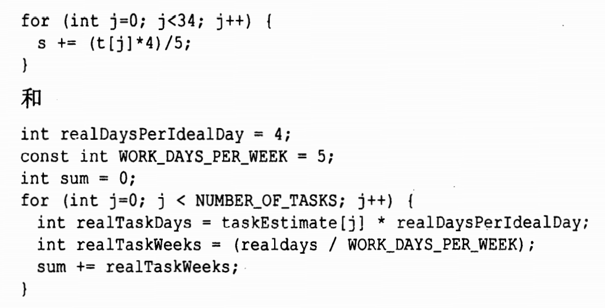


### 避免使用编码


#### 匈牙利语标记法

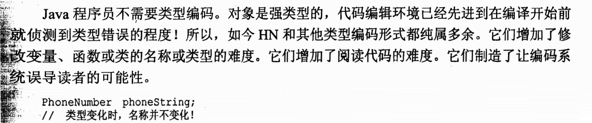


#### 成员前缀

> 1. 非必要，不要使用前缀来标明成员变量。应该把类和函数做的足够小。
> 2. 可以使用编辑器，的变量的范围来标明


#### 接口和实现

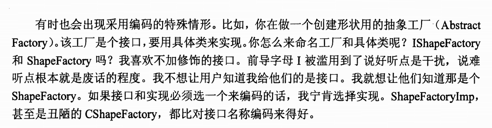


### 避免思维映射

> 不应当让读者在脑中把你的名称翻译为他们熟知的名称。这种问题经常出现在选择是使用问题领域术语还是解决方案领域术语时。

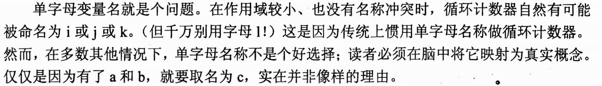


### 类名

> 类名和对象名应该是名词或名词短语，而不是动词。

### 方法名

> 方法名应当是`动词`或者`动词短语`,如getPayment ，这里javabean  标准更让人懂

### 别扮可爱（沙雕）

> 不要你以为他就以为懂，，，，，，，，

### 每个概念对应一个词

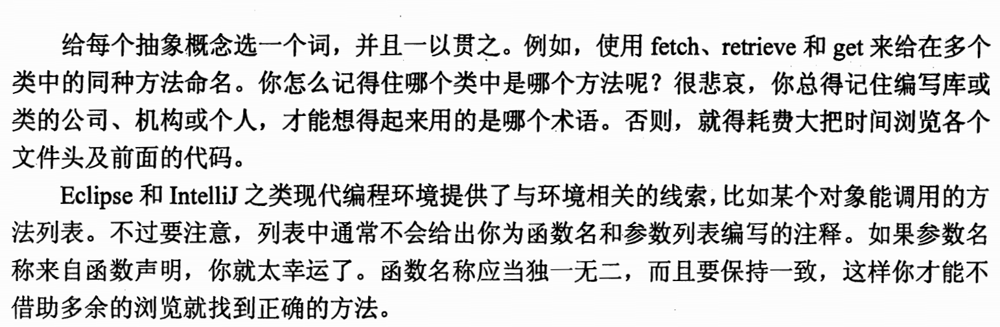

### 别用双关语

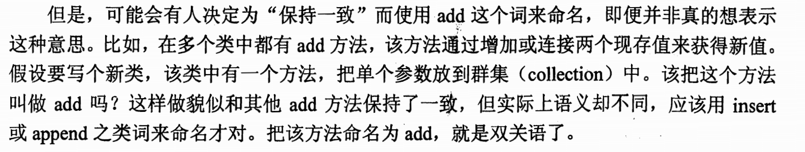

###  使用解决方法领域名称

> 只有程序员才会读你的代码，所以使用计算机科学术语 。是没有问题的， 例如  JobQueue  程序员是都会知道的

### 使用源自所涉问题领域的名称

> 优先使用解决方法领域，，其次使用所涉问题领域，


### 添加有意义的语境

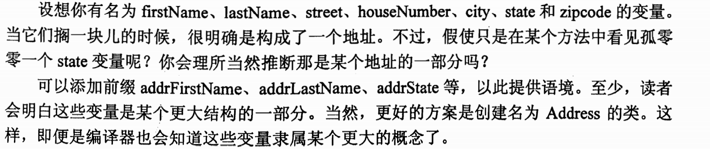

### 不要添加没用的语境

> 只要短名称足够清楚，就要比长名称好。别给名称添加不必要的语境。
>
> 例如接口定义前加个I 表示接口，


## 第三章： 函数


### 短小

> 1. 函数第一规则是要短小
> 2. 第二条规则，还要更短小
> 3. 函数不应该大到足以容纳嵌套结构。函数的缩进层级不该多于一层或两层。

### 只做一件事

> `函数应该做一件事。做好这件事。只做这一件事`
>
> 如果函数知识做了该函数名下统一抽象层上的步骤，则函数还是只做了一件事。
>
> 编写函数毕竟是为了把大一些的概念（函数的名称）拆分为另一抽象层上的一系列步骤。

### 每个函数一个抽象层级

> 要确保函数只做一件事，函数中的语句都要在同一抽象层上。

#### 自顶向下读代码： 向下规则

> 要让每个函数后面都跟着位于下一抽象层级的函数。这样在查看函数列表，就能循抽象层级向下阅读了。

### switch 语句

> 遇见过长的case 语句，
>
> 解决方案： 是将switch 语句埋到抽象工厂底下，不让任何人看到。
>
> 而case 里面的不同函数，使用多态接口接收派遣。

> `当然全写出来，也并没有什么大的问题，就事论事`

### 使用描述性的名称

> 1. 函数名称尽量使用描述性的名称： 能够表明 函数做的事。
>
> `沃德原则：如果每个例程都让你感到深合己意，那就是整洁代码`
>
> 选择描述性的名称能理清你关于模块的设计思路，并帮你改进之。追索好名称，往往对代码的改善重构。
>
> 命名方式要保持一致。模块名、类型、方法名 。 能够写起代码来，如鱼得水。


### 函数参数

> 1. 应尽量避免三参数以上函数，


#### 一元函数的普遍函数

> 向函数传入单个参数有两种极普遍的理由：
>
> 1. 操作该参数，例如转换，再输出
> 2. 判断那个参数的问题  ：  boolean fileExists（“file”）
> 3. 不普遍（但有用）事件（event）。

#### 标识函数

> 痛点： 向函数传入布尔值
>
> 函数不止做一件事！！！

#### 二元函数

> 参数必须要有着规律性，或者是自然的组合，又或是 自然的排序。
>
> 会导致加大程序员查看方法的难度

#### 三元函数

> 类比二元函数难度递增

#### 参数对象

> 如果函数需要三个以上参数，那么参数应该分装为类。

#### 参数列表

> 对可变参数的函数，进行注意

#### 动词与关键字

> 给函数取个好名字，能较好解释函数的意图，以及参数的顺序和意图。
>
> 对于一元函数，函数和参数应当形成一种非常良好的动词/名词对形式，例如 write（name)
>
> 或者将参数名称编码成了函数名。

### 无副作用

> 函数承诺只做一件事，但还是会做其他被藏起来的事。有时，它会对自己类中的变量做出未能预期的改动。
>
> 无论那种亲狂，都是具有破坏性的，会导致古怪的时序性耦合及顺序依赖。

##### 输出参数

参数多数会被自然而然的看做是函数的输入。

普遍而言，应避免使用输出参数。如果函数必须要修改某种状态，就修改所属对象的状态吧。

### 分隔指令与询问

> 函数要么做什么事，要么回答什么事，但二者不可兼得。
>
> 函数应该修改某对象的状态，或是返回该对象的有关信息。不可以在同一个方法调用

### 使用异常替代返回错误码

从指令式函数返回错误码轻微违反了指令与询问分隔的规则。它鼓励在if语句判断中把指令当做表达式使用

```java
if (deletePage(page) == E_OK)
```

这不会引起动词/形容词混淆，但却导致更深层次的嵌套结构。当返回错误码时，就是在要求调用者立刻处理错误。

另一方面，使用异常替代返回错误码，错误处理代码就能从主路径代码中分离出来，简化

```java
try {
	deletePage(page);
    registry.delteReference(page.name)
        configKeys.deleteKey(page.name.makeKey())
}catch(Exception e){
	logger.log(e.getMessage())
}
```

####  抽离Try/Catch 代码块

书中说Try/Catch 代码块丑陋不堪，因为他们搞乱了代码 结构，`把错误处理与正常流程混为一谈`

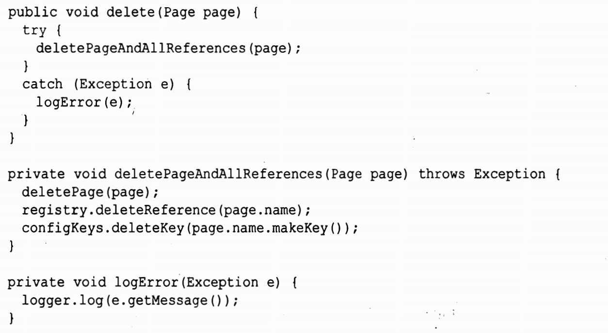

话说不是很懂啊，他说 ： 代码更易于理解和修改，，，理解可能更好理解，修改？？？

#### 错误处理就是一件事

> 函数应该只做一件事。错误处理就是一件事。因此，处理错误的函数不该做其他事。这意味着如果关键字try 在某个函数中存在，它就该是这个函数的第一个单词，而且在catch/finally 后面也不该有其他内容

#### Error.java 依赖磁铁

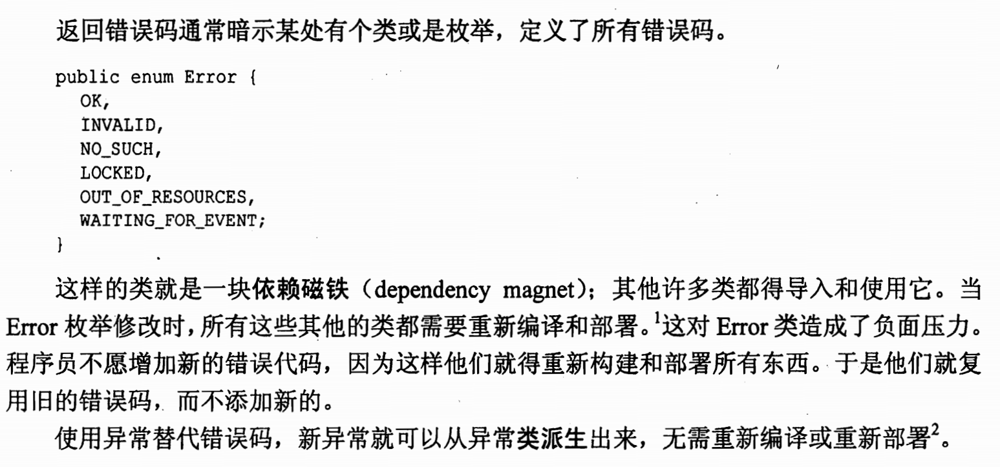

### 别重复自己

### 结构化编程

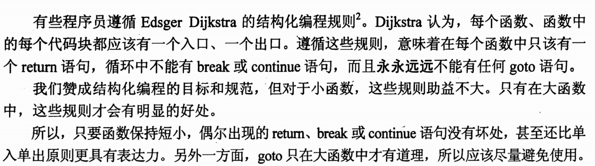

### 如何写出这样的函数

1. 先满足函数正常逻辑
2. 完成函数可用状态
3. 根据规则，优化函数


## 第四章： 注释

> 注释的恰当用法是弥补我们在用代码表达意图是遭遇的失败。
>
> 如果你的代码需要写注释，那么需要用代码来表达。

> 为什么不推荐注释？
>
> 因为程序员不能坚持维护注释，注释存在越久，就离所描述的代码越远。或许会变得错误。


### 注释不能美化糟糕的代码

1. 面对乱七八糟的类，不是使用注释去解释
2. 而是使用重构进行简化代码

### 用代码来阐述你的意图

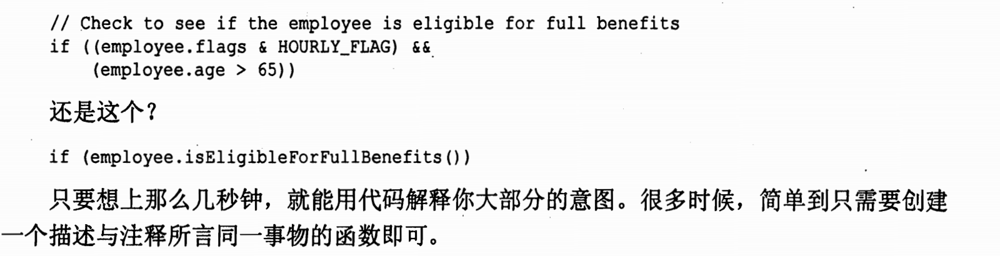

### 好注释

> 有些注释是必须的

#### 法律信息

#### 提供信息的注释

例如 解释了某个抽象方法的返回值

#### 对意图的解释

你也许不同意程序员给这个问题提供的解决方案，但至少你知道他想干什么。

#### 阐释

> 有时，注释把某些晦涩难明的参数或返回值的意义翻译为某种可读形式，也会是有用的。通常，更好的方法是使用自身解释自己，但是参数或返回值是某个标准库的一部分，或是不能修改，帮助阐释就很有用。

#### 警示

> 会告诉调用这个方法，会出现某种后果的注释

#### TODO 注释

> 解释了为什么该函数的实现部分无所作为，将来应该是怎么样。

> 表示未来做什么事情

#### 放大

> 注释可以用来放大某种看来不合理之物的重要性。

#### 公共API 的JAVADOC


### 坏注释


#### 楠楠自语

#### 多余的注释

> 无用的注释，还会影响对代码的判断

#### 误导性注释

#### 循规式注释

> 所谓每个函数都要有javadoc或每个变量都要有注释的规矩全然是愚蠢可笑的。这只会让代码变得散乱。

#### 日志式注释

现在使用git 来进行版本控制，这个废弃

#### 废话注释

#### 可怕的废话

> 有可能JavaDoc 也可能是废话

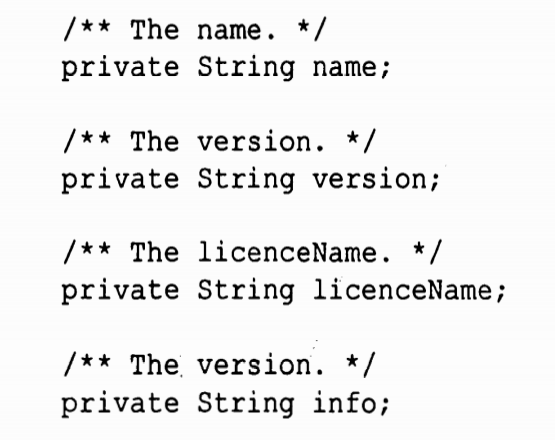

#### 能用函数或变量时就别用注释

#### 位置标记

```java
//Actions //////////////////////////////////////////////
```

按需标记，无滥用


#### 括号后面的注释

> 对于含有深度嵌套结构的常函数可能有意义，但是促进编写更小的函数

#### 归属与署名

在源代码控制系统是这类消息最好的归属地


#### 注释掉的代码

> 要么删掉，要么有用，

####  HTML 注释

#### 非本地信息

> 注释就应该与代码在一起，而不是上下文中猜测。

#### 信息过多

#### 不明显的联系

#### 函数头

述第三章所说，

#### 非公共代码中的Javadoc


## 第五章：格式