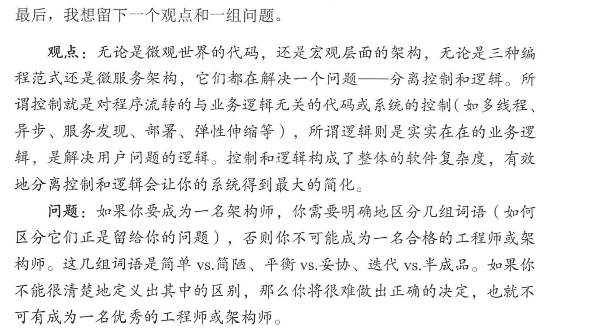

# 架构整洁之道

###### 随文

程序员分为三个层次：普通程序员、工程师和架构师

- 普通程序员： 是编写代码的人。是那种只要能让程序跑起来，能正确处理业务流程和对数据进行计算。
- 工程师： 能够使用各种各样的手段和技术不断提高代码的易读性、可扩展性、可维护性和重用性。，有着工匠精神、有修养的程序员。 
  - 会用工程的方法来编写代码，以便让编程开发更为高效和快速。
  - 把代码模块化，让这么模块可以更容易交互拼装和组织，让代码排列对其——阅读和维护这些代码更舒服
- 架构师： 开始处理更加复杂的问题
  - 基于业务分析给出平衡的方案
  - 尝试设计更高级的技术
  - 设计更灵活的系统
  - 开始简化和轻量化整个系统。

###### 系列书籍

- 代码整洁之道 ： 教你写出易读、可扩展、可维护、可重用的代码
- 代码整洁之道：程序员的职业素养 ： 教你变成一个有修养的程序员
- 架构整洁之道  ： 描述软件设计的一些理论知识

## 大体书中讲了什么

1. 编程范式
   1. 结构化编程
   2. 面向对象对象
   3. 函数式编程
2. 设计原则
   1. SOLID  六大设计原则
3. 软件架构
   1. 高屋建瓴的内容

