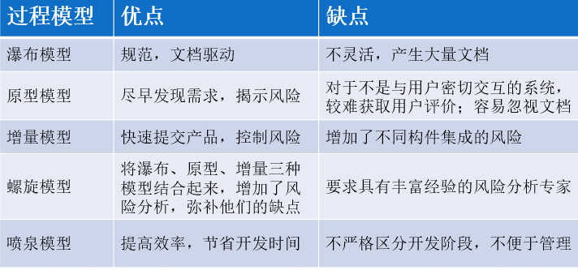
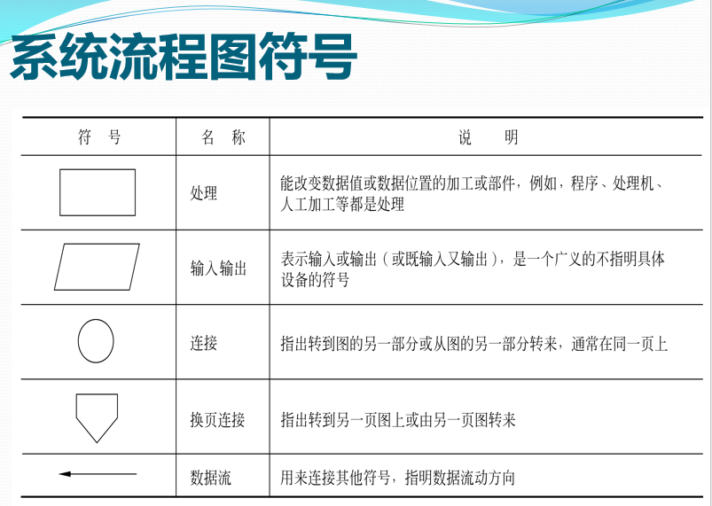
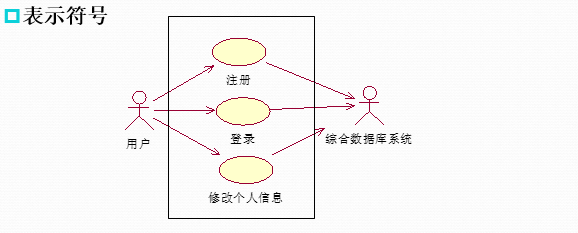
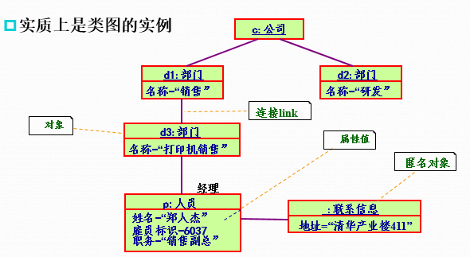
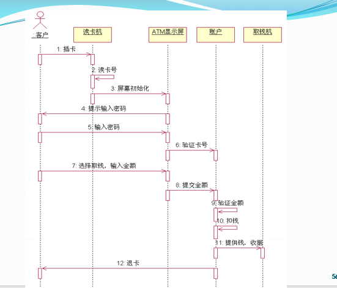
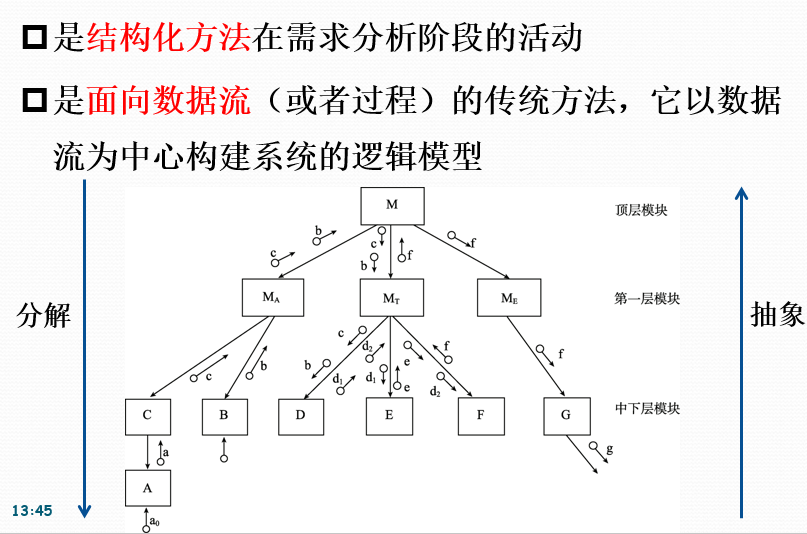

[TOC]

## 第一章 

1. 软件的定义  
    软件是计算机程序，规程以及运行计算机系统过程需要的相关文档和数据
    程序 = 算法 + 数据结构
    软件 = 程序 + 数据 + 文档
2. 什么软件工程
    软件工程是将系统化、规范化、可度量的方法应用于软件开发、运行和维护过程，即将工程化应用于软件中的方法的研究
3. 软件危机
    * 定义
        指在软件的开发和维护的过程中所遇到的一系列严重问题
    * 产生软件危机的原因
        1. 软件本身的特点
            软件规模大，结构越来越复杂
            开发管理困难
        2. 生产管理方式
            生产方式落后，开发工具落后等
    * 消除软件危机的途径
        从**管理和技术**两方面解决软件危机
4. 两种软件开发方法
    * 面向过程的方法
    * 面向对象的方法

## 第二章

1. 软件生命周期
    * 软件定义时期
    * 软件开发时期
    * 软件维护时期
2. 软件过程模型
    1. 模型 ： 对现实的抽象
    2. 抽象： 提取所关注的信息
    3. 模型的作用 ： 有助于人们对现实世界的认识
    4. 模型的表示 ： 任何形式
3. 什么是软件过程模型
    * 模型就是对实际事物、实际系统的一种抽象。所以软件过程模型是软件开发的全部过程、活动和任务的结构框架，直观的表达了软件开发的全过程，明确规定了要完成的主要活动、任务和开发策略。
    * 作用：告诉人们应该去遵循一个什么样的过程和策略去开发软件系统
4. 常见的软件过程模型
    * 瀑布模型
    * 原型模型
    * 增量模型
    * 螺旋模型
    * 喷泉模型
    1. 瀑布模型
        包含了各项软件工程活动，即制定开发计划，进行需求分析、软件设计、程序编码、测试及运行维护
        它规定了各项软件工程活动自上而下、相互斜接的固定次序
        * 特点：
            ① 上一项活动接受该项活动的工作对象作为输入；
            ② 利用这一输入实施该项应完成的内容；
            ③ 产生本项活动的相关产出，作为输出传给下一项活动；
            ④ 对本项活动执行情况进行平生。如果活动执行得到确认，则继续进行下一项活动，否则返回前一项，甚至对前一项的活动进行返工。
        * 缺点：
            ① 在软件开发的初始阶段指明全部需求是非常困难的，有时甚至是不现实的。
            ② 需求一旦确定，用户和软件项目负责人需要等一段时间（经过设计、实现、测试、运行等阶段）才能得到一份软件的最初版本。
            ③ 瀑布模型的软件活动是文档驱动的，当阶段之间规定过多的文档时，会大大增加软件开发的工作量，而且以文档的完成情况来评估项目完成进度时，往往会产生错误的结论。
    2. 原型模型
        * 作用是 准确的确定用户需求
            通俗的讲，原型模型就是先获取用户的基本需求，然后开发一个小型软件系统原型，然后根据用户的反馈，对原型进行不断的修改
        * 优点 
            用户参与
            开发过程与用户培训过程同步
        * 缺点
            对系统分析并对系统进行整体划分，用原型模拟系统功能比较困难
            计算量大，难度困难
    **下面的模型一笔带过**
    3. 螺旋模型
        使用原型及其他方法来降低风险
    4. 增量模型
        可以让客户把需求逐步提出来
    5. 喷泉模型
        软件开发过程自下而上周期的各阶段是相互重叠和多次反复的（迭代性
    
5. 可行性研究的目的
    用最小的代价在尽可能短的时间内研究并确定客户提出的问题是否有行得通的解决办法
    * 可行性研究的内容
        技术可行性
        经济可行性
        操作可行性
        社会可行性
6. 系统流程图
    

## 第四章

1. 需求工程
    * 定义 ： 应用已经证实的技术、方法进行需求分析，确定客户需求，帮助分析人员理解问题并定义目标系统的所有外部特征的一个学科
    * 分类
        系统需求工程
        软件需求工程
    * 需求开发过程：
        ① **需求获取**：通过访谈，问卷调查，专题讨论会等手段获取用户需求。
        ② **需求建模**：用清晰、简明的方式将需求分析获得的信息记录下来，得到一个逻辑模型。
        ③ **需求规格说明**：用户和开发人员都充分了解用户需求后，将共同的理解以规范化的形式准确的表达出来，形成需求规格说明书。
        ④ **需求评审**：在将需求交付设计之前，对需求规格说明书进行彻底的检查和修改。
    * 需求管理
        需求管理主要包括：**需求变更控制**、**需求版本控制**、**需求跟踪**、**需求状态跟踪**
2. 面向过程的结构化开发方法
    1. 特点
        动态的视角，软件即输入输出过程
        强调模块化思想，主要采用抽象和分解两个手段
        主要采取“自顶向下，逐步求精”
        程序 = 算法 + 数据结构
    **ER 是实体关系图，DFD 数据流图**   
3. 面向对象 
    面向对象 = 对象 + 类 + 继承 + 通信

4. 什么是UML  
    是一种面向对象的软件系统的通用可视化建模语言

## 第五章

1. 面向对象的三大基本特性
    封装，继承，多态
2. 面向对象的五大基本原则
    单一职责
    开放封闭
    替换
    依赖倒置
    接口分离
3. 面向对象的关系
    依赖
    关联
    泛化
    实现
4. 用例图
    
5. 对象图
    就是描述系统在某一时刻对象和他们之间的联系
    
6. 序列图
    描述一组交互对象间的交互方式
    

## 第六章_结构化分析

1. 结构化分析方法概述
    

## 第七章

1. 面向对象概述
    不从功能和处理算法上考虑，而是从系统的组成上进行分解
    尽可能直接描述现实世界
**面向对象 = 对象+类+继承+通信**
喷泉模型是 典型的面向对象软件过程模型

## 第八章

1. 软件设计的概念与原则
    1. 模块化与模块独立性
    2. 抽象与逐步求精
    3. 信息隐蔽

2. 模块
    * 是指 一组程序语句，他包括输入，输出和逻辑处理通能、内部信息及其运行计划
    * 模块的4个基本属性
        接口
        功能
        逻辑
        状态
3. 模块化
    * 解决一个复杂问题时，自顶向下逐层把软件划分成若干个模块的过程
    * 目的 ： 为了降低软件的复杂性
4. 模块的目标
    模块的独立性
    * 衡量模块独立性的两个准则
        内聚，耦合
    * 模块的独立性高
        块内联系强
        块间联系弱
             

